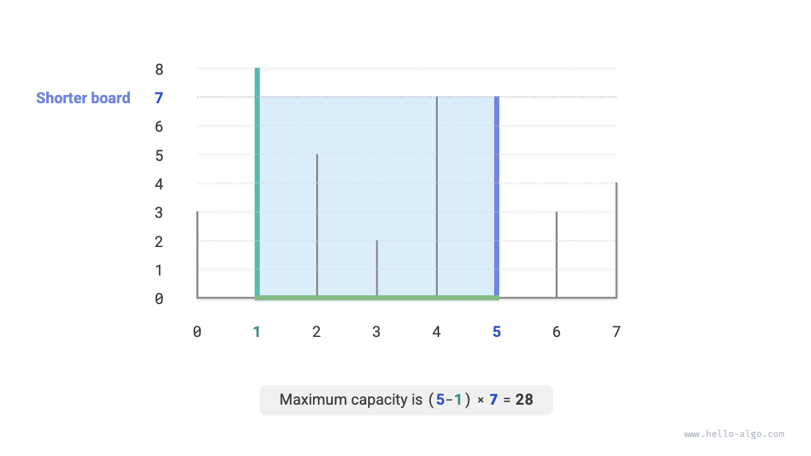
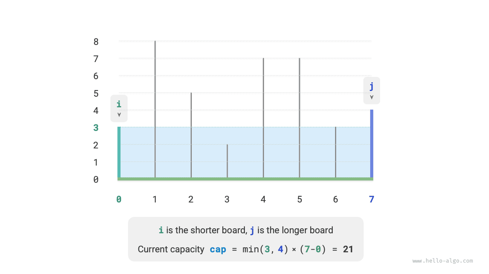
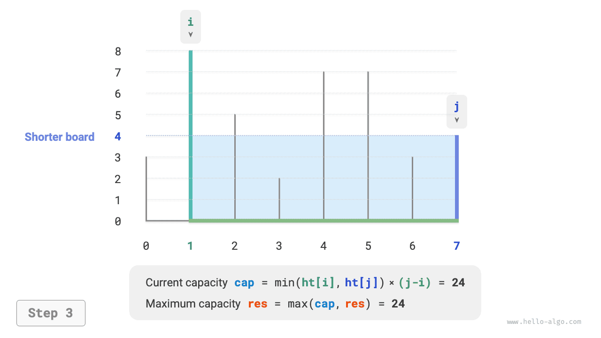
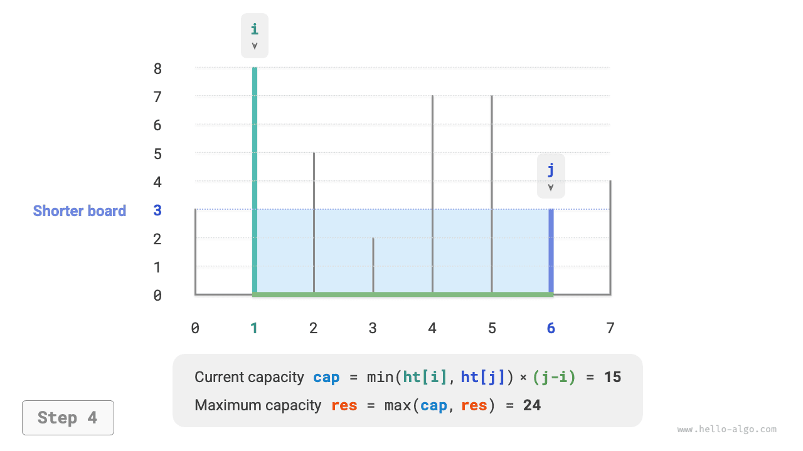
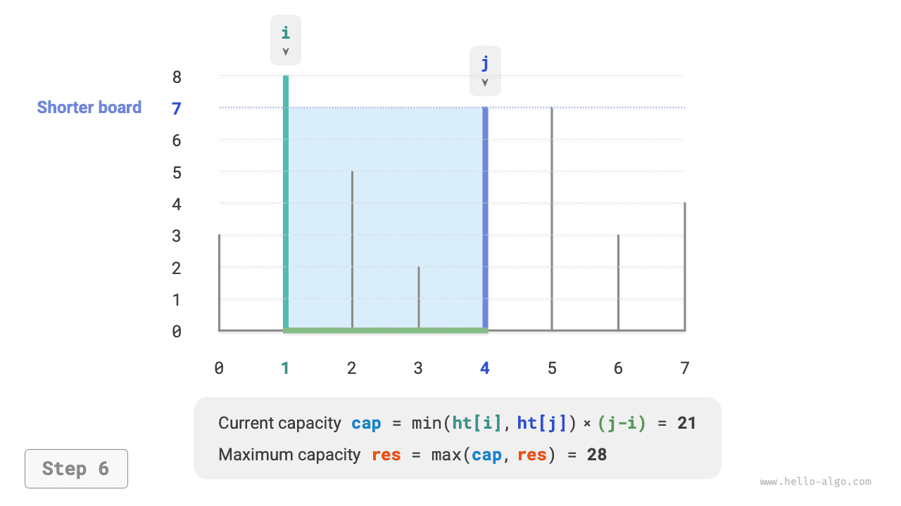

# 15.3 &nbsp; 最大容量問題

!!! question "問題"

    配列 $ht$ が与えられ、各要素は垂直な仕切り板の高さを表します。任意の 2 枚の仕切り板とその間の空間で、容器を作れます。
    
    容器の容量は高さと幅の積（面積）です。高さは低い方の仕切り板で決まり、幅は 2 枚の仕切り板の配列インデックスの差です。
    
    容器の容量が最大になるように 2 枚の仕切り板を選び、最大容量を返してください。例を図 15-7 に示します。

{ class="animation-figure" }

<p align="center"> 図 15-7 &nbsp; 最大容量問題のデータ例 </p>

容器は任意の 2 枚の仕切り板で作るため、**この問題の状態は 2 枚のインデックス $[i, j]$ で表せます**。

問題文によると、容量は高さと幅の積であり、高さは低い方の板、幅はインデックスの差で決まります。容量を $cap[i, j]$ とすると、次の式が得られます。

$$
cap[i, j] = \min(ht[i], ht[j]) \times (j - i)
$$

配列の長さを $n$ とすると、2 枚の組み合わせ（状態の総数）は $C_n^2 = \frac{n(n - 1)}{2}$ 通りです。最も直接的には、**すべての状態を列挙して**最大容量を求められます。時間計算量は $O(n^2)$ です。

### 1. &nbsp; 貪欲戦略を決める

この問題には、さらに効率的な解法があります。図 15-8 のように、$i < j$ かつ $ht[i] < ht[j]$ を満たす状態 $[i, j]$ を選びます。つまり、$i$ が低い板、$j$ が高い板です。

{ class="animation-figure" }

<p align="center"> 図 15-8 &nbsp; 初期状態 </p>

図 15-9 のように、**高い方の板 $j$ を低い方の板 $i$ に近づけると、容量は必ず小さくなります**。

板 $j$ を動かすと、幅 $j-i$ は必ず小さくなります。一方、高さは低い方の板で決まるため、変わらない（$i$ が引き続き低い方）か、小さくなる（移動後の $j$ が低い方になる）かのどちらかです。

{ class="animation-figure" }

<p align="center"> 図 15-9 &nbsp; 高い方の板を内側に動かした状態 </p>

逆に考えると、**容量が大きくなる可能性があるのは、低い方の板 $i$ を内側に動かす場合だけです**。幅は必ず小さくなりますが、**高さは大きくなる可能性がある**からです（移動先の板 $i$ がより高いことがあります）。たとえば図 15-10 では、低い方の板を動かすと面積が大きくなります。

{ class="animation-figure" }

<p align="center"> 図 15-10 &nbsp; 低い方の板を内側に動かした状態 </p>

ここから貪欲戦略が導けます。二つのポインタを容器の両端に置き、毎回、低い方の板に対応するポインタを内側に動かし、二つが出会うまで続けます。

図 15-11 に、貪欲戦略の実行手順を示します。

1. 初期状態では、ポインタ $i$ と $j$ を配列の両端に置きます。
2. 現在の状態の容量 $cap[i, j]$ を計算し、最大容量を更新します。
3. 板 $i$ と板 $j$ の高さを比較し、低い方を一つ内側に動かします。
4. 手順 `2.` と `3.` を繰り返し、$i$ と $j$ が出会ったら終了します。

=== "<1>"
    { class="animation-figure" }

=== "<2>"
    { class="animation-figure" }

=== "<3>"
    { class="animation-figure" }

=== "<4>"
    { class="animation-figure" }

=== "<5>"
    { class="animation-figure" }

=== "<6>"
    { class="animation-figure" }

=== "<7>"
    { class="animation-figure" }

=== "<8>"
    { class="animation-figure" }

=== "<9>"
    { class="animation-figure" }

<p align="center"> 図 15-11 &nbsp; 最大容量問題を貪欲に解く流れ </p>

### 2. &nbsp; コードの実装

ループは最大 $n$ 回なので、**時間計算量は $O(n)$ です**。

変数 $i$、$j$、$res$ が使う追加の空間は一定なので、**空間計算量は $O(1)$ です**。

=== "Python"

    ```python title="max_capacity.py"
    def max_capacity(ht: list[int]) -> int:
        """最大容量：貪欲法"""
        # i, j を初期化し、配列の両端をそれぞれ指すようにする
        i, j = 0, len(ht) - 1
        # 最大容量の初期値は 0
        res = 0
        # 2 枚の板が出会うまで貪欲な選択を繰り返す
        while i < j:
            # 最大容量を更新する
            cap = min(ht[i], ht[j]) * (j - i)
            res = max(res, cap)
            # 低い方の仕切り板を内側に移動する
            if ht[i] < ht[j]:
                i += 1
            else:
                j -= 1
        return res
    ```

=== "C++"

    ```cpp title="max_capacity.cpp"
    /* 最大容量：貪欲法 */
    int maxCapacity(vector<int> &ht) {
        // i, j を初期化し、配列の両端をそれぞれ指すようにする
        int i = 0, j = ht.size() - 1;
        // 最大容量の初期値は 0
        int res = 0;
        // 2 枚の板が出会うまで貪欲な選択を繰り返す
        while (i < j) {
            // 最大容量を更新する
            int cap = min(ht[i], ht[j]) * (j - i);
            res = max(res, cap);
            // 低い方の仕切り板を内側に移動する
            if (ht[i] < ht[j]) {
                i++;
            } else {
                j--;
            }
        }
        return res;
    }
    ```

=== "Java"

    ```java title="max_capacity.java"
    /* 最大容量：貪欲法 */
    int maxCapacity(int[] ht) {
        // i, j を初期化し、配列の両端をそれぞれ指すようにする
        int i = 0, j = ht.length - 1;
        // 最大容量の初期値は 0
        int res = 0;
        // 2 枚の板が出会うまで貪欲な選択を繰り返す
        while (i < j) {
            // 最大容量を更新する
            int cap = Math.min(ht[i], ht[j]) * (j - i);
            res = Math.max(res, cap);
            // 低い方の仕切り板を内側に移動する
            if (ht[i] < ht[j]) {
                i++;
            } else {
                j--;
            }
        }
        return res;
    }
    ```

=== "C#"

    ```csharp title="max_capacity.cs"
    /* 最大容量：貪欲法 */
    int MaxCapacity(int[] ht) {
        // i, j を初期化し、配列の両端をそれぞれ指すようにする
        int i = 0, j = ht.Length - 1;
        // 最大容量の初期値は 0
        int res = 0;
        // 2 枚の板が出会うまで貪欲な選択を繰り返す
        while (i < j) {
            // 最大容量を更新する
            int cap = Math.Min(ht[i], ht[j]) * (j - i);
            res = Math.Max(res, cap);
            // 低い方の仕切り板を内側に移動する
            if (ht[i] < ht[j]) {
                i++;
            } else {
                j--;
            }
        }
        return res;
    }
    ```

=== "Go"

    ```go title="max_capacity.go"
    /* 最大容量：貪欲法 */
    func maxCapacity(ht []int) int {
        // i, j を初期化し、配列の両端をそれぞれ指すようにする
        i, j := 0, len(ht)-1
        // 最大容量の初期値は 0
        res := 0
        // 2 枚の板が出会うまで貪欲な選択を繰り返す
        for i < j {
            // 最大容量を更新する
            capacity := int(math.Min(float64(ht[i]), float64(ht[j]))) * (j - i)
            res = int(math.Max(float64(res), float64(capacity)))
            // 低い方の仕切り板を内側に移動する
            if ht[i] < ht[j] {
                i++
            } else {
                j--
            }
        }
        return res
    }
    ```

=== "Swift"

    ```swift title="max_capacity.swift"
    /* 最大容量：貪欲法 */
    func maxCapacity(ht: [Int]) -> Int {
        // i, j を初期化し、配列の両端をそれぞれ指すようにする
        var i = ht.startIndex, j = ht.endIndex - 1
        // 最大容量の初期値は 0
        var res = 0
        // 2 枚の板が出会うまで貪欲な選択を繰り返す
        while i < j {
            // 最大容量を更新する
            let cap = min(ht[i], ht[j]) * (j - i)
            res = max(res, cap)
            // 低い方の仕切り板を内側に移動する
            if ht[i] < ht[j] {
                i += 1
            } else {
                j -= 1
            }
        }
        return res
    }
    ```

=== "JS"

    ```javascript title="max_capacity.js"
    /* 最大容量：貪欲法 */
    function maxCapacity(ht) {
        // i, j を初期化し、配列の両端をそれぞれ指すようにする
        let i = 0,
            j = ht.length - 1;
        // 最大容量の初期値は 0
        let res = 0;
        // 2 枚の板が出会うまで貪欲な選択を繰り返す
        while (i < j) {
            // 最大容量を更新する
            const cap = Math.min(ht[i], ht[j]) * (j - i);
            res = Math.max(res, cap);
            // 低い方の仕切り板を内側に移動する
            if (ht[i] < ht[j]) {
                i += 1;
            } else {
                j -= 1;
            }
        }
        return res;
    }
    ```

=== "TS"

    ```typescript title="max_capacity.ts"
    /* 最大容量：貪欲法 */
    function maxCapacity(ht: number[]): number {
        // i, j を初期化し、配列の両端をそれぞれ指すようにする
        let i = 0,
            j = ht.length - 1;
        // 最大容量の初期値は 0
        let res = 0;
        // 2 枚の板が出会うまで貪欲な選択を繰り返す
        while (i < j) {
            // 最大容量を更新する
            const cap: number = Math.min(ht[i], ht[j]) * (j - i);
            res = Math.max(res, cap);
            // 低い方の仕切り板を内側に移動する
            if (ht[i] < ht[j]) {
                i += 1;
            } else {
                j -= 1;
            }
        }
        return res;
    }
    ```

=== "Dart"

    ```dart title="max_capacity.dart"
    /* 最大容量：貪欲法 */
    int maxCapacity(List<int> ht) {
      // i, j を初期化し、配列の両端をそれぞれ指すようにする
      int i = 0, j = ht.length - 1;
      // 最大容量の初期値は 0
      int res = 0;
      // 2 枚の板が出会うまで貪欲な選択を繰り返す
      while (i < j) {
        // 最大容量を更新する
        int cap = min(ht[i], ht[j]) * (j - i);
        res = max(res, cap);
        // 低い方の仕切り板を内側に移動する
        if (ht[i] < ht[j]) {
          i++;
        } else {
          j--;
        }
      }
      return res;
    }
    ```

=== "Rust"

    ```rust title="max_capacity.rs"
    /* 最大容量：貪欲法 */
    fn max_capacity(ht: &[i32]) -> i32 {
        // i, j を初期化し、配列の両端をそれぞれ指すようにする
        let mut i = 0;
        let mut j = ht.len() - 1;
        // 最大容量の初期値は 0
        let mut res = 0;
        // 2 枚の板が出会うまで貪欲な選択を繰り返す
        while i < j {
            // 最大容量を更新する
            let cap = std::cmp::min(ht[i], ht[j]) * (j - i) as i32;
            res = std::cmp::max(res, cap);
            // 低い方の仕切り板を内側に移動する
            if ht[i] < ht[j] {
                i += 1;
            } else {
                j -= 1;
            }
        }
        res
    }
    ```

=== "C"

    ```c title="max_capacity.c"
    /* 最大容量：貪欲法 */
    int maxCapacity(int ht[], int htLength) {
        // i, j を初期化し、配列の両端をそれぞれ指すようにする
        int i = 0;
        int j = htLength - 1;
        // 最大容量の初期値は 0
        int res = 0;
        // 2 枚の板が出会うまで貪欲な選択を繰り返す
        while (i < j) {
            // 最大容量を更新する
            int capacity = myMin(ht[i], ht[j]) * (j - i);
            res = myMax(res, capacity);
            // 低い方の仕切り板を内側に移動する
            if (ht[i] < ht[j]) {
                i++;
            } else {
                j--;
            }
        }
        return res;
    }
    ```

=== "Kotlin"

    ```kotlin title="max_capacity.kt"
    /* 最大容量：貪欲法 */
    fun maxCapacity(ht: IntArray): Int {
        // i, j を初期化し、配列の両端をそれぞれ指すようにする
        var i = 0
        var j = ht.size - 1
        // 最大容量の初期値は 0
        var res = 0
        // 2 枚の板が出会うまで貪欲な選択を繰り返す
        while (i < j) {
            // 最大容量を更新する
            val cap = min(ht[i], ht[j]) * (j - i)
            res = max(res, cap)
            // 低い方の仕切り板を内側に移動する
            if (ht[i] < ht[j]) {
                i++
            } else {
                j--
            }
        }
        return res
    }
    ```

=== "Ruby"

    ```ruby title="max_capacity.rb"
    ### 最大容量：貪欲法 ###
    def max_capacity(ht)
      # i, j を初期化し、配列の両端をそれぞれ指すようにする
      i, j = 0, ht.length - 1
      # 最大容量の初期値は 0
      res = 0

      # 2 枚の板が出会うまで貪欲な選択を繰り返す
      while i < j
        # 最大容量を更新する
        cap = [ht[i], ht[j]].min * (j - i)
        res = [res, cap].max
        # 低い方の仕切り板を内側に移動する
        if ht[i] < ht[j]
          i += 1
        else
          j -= 1
        end
      end

      res
    end
    ```

??? pythontutor "実行の可視化"

    <div style="height: 549px; width: 100%;"><iframe class="pythontutor-iframe" title="実行の可視化" src="https://pythontutor.com/iframe-embed.html#code=def%20max_capacity%28ht%3A%20list%5Bint%5D%29%20-%3E%20int%3A%0A%20%20%20%20%22%22%22%E6%9C%80%E5%A4%A7%E5%AE%B9%E9%87%8F%EF%BC%9A%E8%B2%AA%E6%AC%B2%E6%B3%95%22%22%22%0A%20%20%20%20%23%20i,%20j%20%E3%82%92%E5%88%9D%E6%9C%9F%E5%8C%96%E3%81%97%E3%80%81%E9%85%8D%E5%88%97%E3%81%AE%E4%B8%A1%E7%AB%AF%E3%82%92%E3%81%9D%E3%82%8C%E3%81%9E%E3%82%8C%E6%8C%87%E3%81%99%E3%82%88%E3%81%86%E3%81%AB%E3%81%99%E3%82%8B%0A%20%20%20%20i,%20j%20%3D%200,%20len%28ht%29%20-%201%0A%20%20%20%20%23%20%E6%9C%80%E5%A4%A7%E5%AE%B9%E9%87%8F%E3%81%AE%E5%88%9D%E6%9C%9F%E5%80%A4%E3%81%AF%200%0A%20%20%20%20res%20%3D%200%0A%20%20%20%20%23%202%20%E6%9E%9A%E3%81%AE%E6%9D%BF%E3%81%8C%E5%87%BA%E4%BC%9A%E3%81%86%E3%81%BE%E3%81%A7%E8%B2%AA%E6%AC%B2%E3%81%AA%E9%81%B8%E6%8A%9E%E3%82%92%E7%B9%B0%E3%82%8A%E8%BF%94%E3%81%99%0A%20%20%20%20while%20i%20%3C%20j%3A%0A%20%20%20%20%20%20%20%20%23%20%E6%9C%80%E5%A4%A7%E5%AE%B9%E9%87%8F%E3%82%92%E6%9B%B4%E6%96%B0%E3%81%99%E3%82%8B%0A%20%20%20%20%20%20%20%20cap%20%3D%20min%28ht%5Bi%5D,%20ht%5Bj%5D%29%20%2A%20%28j%20-%20i%29%0A%20%20%20%20%20%20%20%20res%20%3D%20max%28res,%20cap%29%0A%20%20%20%20%20%20%20%20%23%20%E4%BD%8E%E3%81%84%E6%96%B9%E3%81%AE%E4%BB%95%E5%88%87%E3%82%8A%E6%9D%BF%E3%82%92%E5%86%85%E5%81%B4%E3%81%AB%E7%A7%BB%E5%8B%95%E3%81%99%E3%82%8B%0A%20%20%20%20%20%20%20%20if%20ht%5Bi%5D%20%3C%20ht%5Bj%5D%3A%0A%20%20%20%20%20%20%20%20%20%20%20%20i%20%2B%3D%201%0A%20%20%20%20%20%20%20%20else%3A%0A%20%20%20%20%20%20%20%20%20%20%20%20j%20-%3D%201%0A%20%20%20%20return%20res%0A%0A%0A%22%22%22%E5%AE%9F%E8%A1%8C%E7%94%A8%E3%82%B3%E3%83%BC%E3%83%89%22%22%22%0Aif%20__name__%20%3D%3D%20%22__main__%22%3A%0A%20%20%20%20ht%20%3D%20%5B3,%208,%205,%202,%207,%207,%203,%204%5D%0A%0A%20%20%20%20%23%20%E8%B2%AA%E6%AC%B2%E3%82%A2%E3%83%AB%E3%82%B4%E3%83%AA%E3%82%BA%E3%83%A0%0A%20%20%20%20res%20%3D%20max_capacity%28ht%29%0A%20%20%20%20print%28f%22%E6%9C%80%E5%A4%A7%E5%AE%B9%E9%87%8F%E3%81%AF%20%7Bres%7D%22%29&codeDivHeight=472&codeDivWidth=350&cumulative=false&curInstr=4&heapPrimitives=nevernest&origin=opt-frontend.js&py=311&rawInputLstJSON=%5B%5D&textReferences=false"> </iframe></div>
    <div style="margin-top: 5px;"><a href="https://pythontutor.com/iframe-embed.html#code=def%20max_capacity%28ht%3A%20list%5Bint%5D%29%20-%3E%20int%3A%0A%20%20%20%20%22%22%22%E6%9C%80%E5%A4%A7%E5%AE%B9%E9%87%8F%EF%BC%9A%E8%B2%AA%E6%AC%B2%E6%B3%95%22%22%22%0A%20%20%20%20%23%20i,%20j%20%E3%82%92%E5%88%9D%E6%9C%9F%E5%8C%96%E3%81%97%E3%80%81%E9%85%8D%E5%88%97%E3%81%AE%E4%B8%A1%E7%AB%AF%E3%82%92%E3%81%9D%E3%82%8C%E3%81%9E%E3%82%8C%E6%8C%87%E3%81%99%E3%82%88%E3%81%86%E3%81%AB%E3%81%99%E3%82%8B%0A%20%20%20%20i,%20j%20%3D%200,%20len%28ht%29%20-%201%0A%20%20%20%20%23%20%E6%9C%80%E5%A4%A7%E5%AE%B9%E9%87%8F%E3%81%AE%E5%88%9D%E6%9C%9F%E5%80%A4%E3%81%AF%200%0A%20%20%20%20res%20%3D%200%0A%20%20%20%20%23%202%20%E6%9E%9A%E3%81%AE%E6%9D%BF%E3%81%8C%E5%87%BA%E4%BC%9A%E3%81%86%E3%81%BE%E3%81%A7%E8%B2%AA%E6%AC%B2%E3%81%AA%E9%81%B8%E6%8A%9E%E3%82%92%E7%B9%B0%E3%82%8A%E8%BF%94%E3%81%99%0A%20%20%20%20while%20i%20%3C%20j%3A%0A%20%20%20%20%20%20%20%20%23%20%E6%9C%80%E5%A4%A7%E5%AE%B9%E9%87%8F%E3%82%92%E6%9B%B4%E6%96%B0%E3%81%99%E3%82%8B%0A%20%20%20%20%20%20%20%20cap%20%3D%20min%28ht%5Bi%5D,%20ht%5Bj%5D%29%20%2A%20%28j%20-%20i%29%0A%20%20%20%20%20%20%20%20res%20%3D%20max%28res,%20cap%29%0A%20%20%20%20%20%20%20%20%23%20%E4%BD%8E%E3%81%84%E6%96%B9%E3%81%AE%E4%BB%95%E5%88%87%E3%82%8A%E6%9D%BF%E3%82%92%E5%86%85%E5%81%B4%E3%81%AB%E7%A7%BB%E5%8B%95%E3%81%99%E3%82%8B%0A%20%20%20%20%20%20%20%20if%20ht%5Bi%5D%20%3C%20ht%5Bj%5D%3A%0A%20%20%20%20%20%20%20%20%20%20%20%20i%20%2B%3D%201%0A%20%20%20%20%20%20%20%20else%3A%0A%20%20%20%20%20%20%20%20%20%20%20%20j%20-%3D%201%0A%20%20%20%20return%20res%0A%0A%0A%22%22%22%E5%AE%9F%E8%A1%8C%E7%94%A8%E3%82%B3%E3%83%BC%E3%83%89%22%22%22%0Aif%20__name__%20%3D%3D%20%22__main__%22%3A%0A%20%20%20%20ht%20%3D%20%5B3,%208,%205,%202,%207,%207,%203,%204%5D%0A%0A%20%20%20%20%23%20%E8%B2%AA%E6%AC%B2%E3%82%A2%E3%83%AB%E3%82%B4%E3%83%AA%E3%82%BA%E3%83%A0%0A%20%20%20%20res%20%3D%20max_capacity%28ht%29%0A%20%20%20%20print%28f%22%E6%9C%80%E5%A4%A7%E5%AE%B9%E9%87%8F%E3%81%AF%20%7Bres%7D%22%29&codeDivHeight=800&codeDivWidth=600&cumulative=false&curInstr=4&heapPrimitives=nevernest&origin=opt-frontend.js&py=311&rawInputLstJSON=%5B%5D&textReferences=false" target="_blank" rel="noopener noreferrer">全画面で表示 ></a></div>

### 3. &nbsp; 正しさの証明

貪欲法が総当たりより速いのは、各回の貪欲な選択で一部の状態を「飛ばす」ためです。

たとえば状態 $cap[i, j]$ で、$i$ が低い板、$j$ が高い板だとします。低い方の $i$ を貪欲に一つ内側へ動かすと、図 15-12 の状態が「飛ばされます」。**つまり、その後はこれらの状態の容量を確認できなくなります**。

$$
cap[i, i+1], cap[i, i+2], \dots, cap[i, j-2], cap[i, j-1]
$$

{ class="animation-figure" }

<p align="center"> 図 15-12 &nbsp; 低い方の板を動かすことで飛ばされる状態 </p>

**飛ばされる状態は、実際には高い方の板 $j$ を内側へ動かして得られるすべての状態です**。高い方の板を内側へ動かすと容量が必ず小さくなることは、すでに示しました。したがって、飛ばす状態が最適解になることはなく、**飛ばしても最適解を見逃すことはありません**。

以上から、低い方の板を動かす操作は「安全」であり、貪欲戦略は有効です。
