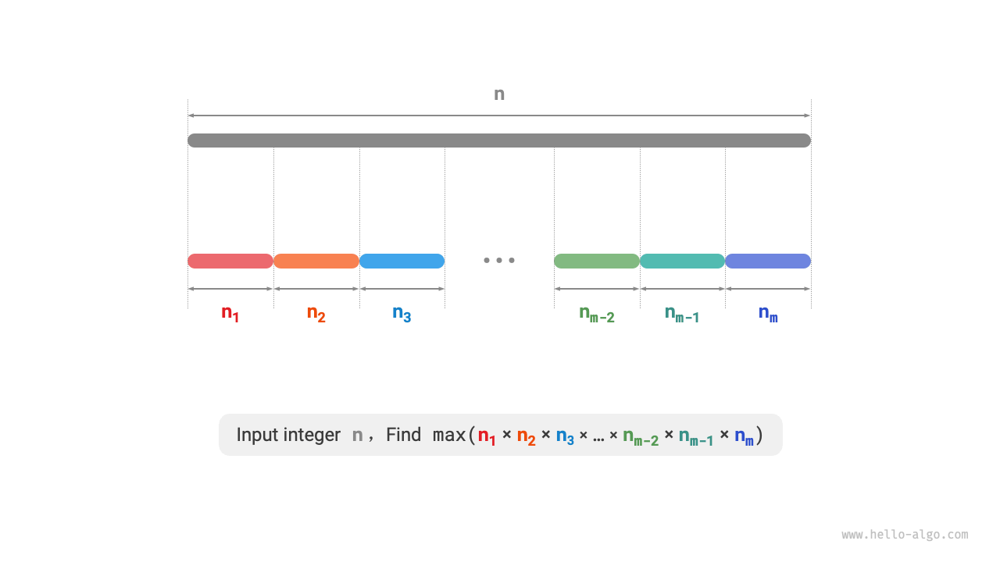
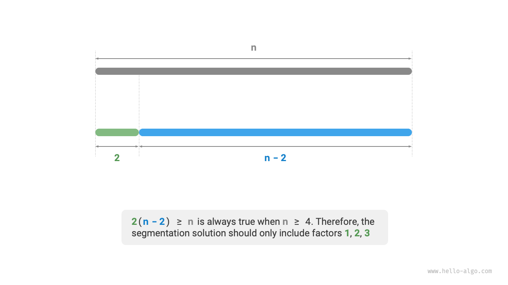
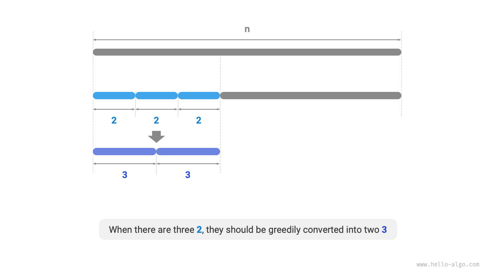
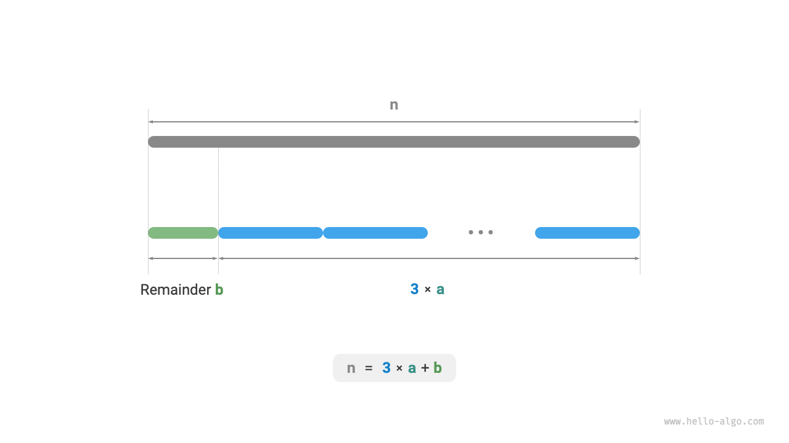

# 最大積切断問題

!!! question

    正の整数 $n$ が与えられたとき、それを合計が $n$ になる少なくとも2つの正の整数に分割し、これらの整数の最大積を求めてください。下の図に示すとおりです。



$n$ を $m$ 個の整数因子に分割すると仮定し、$i$ 番目の因子を $n_i$ と表記すると、

$$
n = \sum_{i=1}^{m}n_i
$$

この問題の目標は、すべての整数因子の最大積を見つけることです。すなわち、

$$
\max(\prod_{i=1}^{m}n_i)
$$

考慮すべき点：分割数 $m$ はどの程度大きくすべきか、各 $n_i$ は何であるべきか？

### 貪欲戦略の決定

経験的に、2つの整数の積は多くの場合その和よりも大きくなります。$n$ から因子 $2$ を分割すると仮定すると、その積は $2(n-2)$ です。この積を $n$ と比較します：

$$
\begin{aligned}
2(n-2) & \geq n \newline
2n - n - 4 & \geq 0 \newline
n & \geq 4
\end{aligned}
$$

下の図に示すように、$n \geq 4$ のとき、$2$ を分割すると積が増加します。**これは4以上の整数を分割すべきであることを示しています**。

**貪欲戦略1**：分割スキームが $\geq 4$ の因子を含む場合、それらはさらに分割されるべきです。最終的な分割は因子 $1$、$2$、$3$ のみを含むべきです。



次に、どの因子が最適かを考慮します。因子 $1$、$2$、$3$ の中で、明らかに $1$ が最悪です。$1 \times (n-1) < n$ が常に成り立つため、$1$ を分割すると実際に積が減少します。

下の図に示すように、$n = 6$ のとき、$3 \times 3 > 2 \times 2 \times 2$ です。**これは $3$ を分割する方が $2$ を分割するよりも良いことを意味します**。

**貪欲戦略2**：分割スキームには最大で2つの $2$ があるべきです。3つの $2$ は常に2つの $3$ に置き換えてより高い積を得ることができるからです。



上記から、以下の貪欲戦略を導出できます。

1. 入力整数 $n$ について、余りが $0$、$1$、または $2$ になるまで因子 $3$ を継続的に分割します。
2. 余りが $0$ の場合、$n$ が $3$ の倍数であることを意味するため、それ以上の行動は取りません。
3. 余りが $2$ の場合、さらに分割を続けず、そのまま保持します。
4. 余りが $1$ の場合、$2 \times 2 > 1 \times 3$ であるため、最後の $3$ を $2$ に置き換えるべきです。

### コード実装

下の図に示すように、整数を分割するためにループを使用する必要はなく、床除算演算を使用して $3$ の数 $a$ を取得し、剰余演算を使用して余り $b$ を取得できます。したがって：

$$
n = 3a + b
$$

$n \leq 3$ の境界ケースでは、$1$ を分割する必要があり、積は $1 \times (n - 1)$ であることに注意してください。

```src
[file]{max_product_cutting}-[class]{}-[func]{max_product_cutting}
```



**時間計算量はプログラミング言語のべき乗演算の実装に依存します**。Pythonでは、よく使用されるべき乗計算関数は3種類あります：

- 演算子 `**` と関数 `pow()` の両方の時間計算量は $O(\log⁡ a)$ です。
- `math.pow()` 関数は内部でC言語ライブラリの `pow()` 関数を呼び出し、浮動小数点べき乗を実行し、時間計算量は $O(1)$ です。

変数 $a$ と $b$ は一定サイズの追加スペースを使用するため、**空間計算量は $O(1)$** です。

### 正しさの証明

背理法を使用し、$n \geq 3$ のケースのみを分析します。

1. **すべての因子 $\leq 3$**：最適分割スキームが因子 $x \geq 4$ を含むと仮定すると、それを確実に $2(x-2)$ にさらに分割でき、より大きな積を得られます。これは仮定と矛盾します。
2. **分割スキームに $1$ が含まれない**：最適分割スキームが因子 $1$ を含むと仮定すると、それを確実に別の因子と結合してより大きな積を得られます。これは仮定と矛盾します。
3. **分割スキームには最大で2つの $2$ が含まれる**：最適分割スキームが3つの $2$ を含むと仮定すると、それらを確実に2つの $3$ に置き換えて、より高い積を達成できます。これは仮定と矛盾します。
