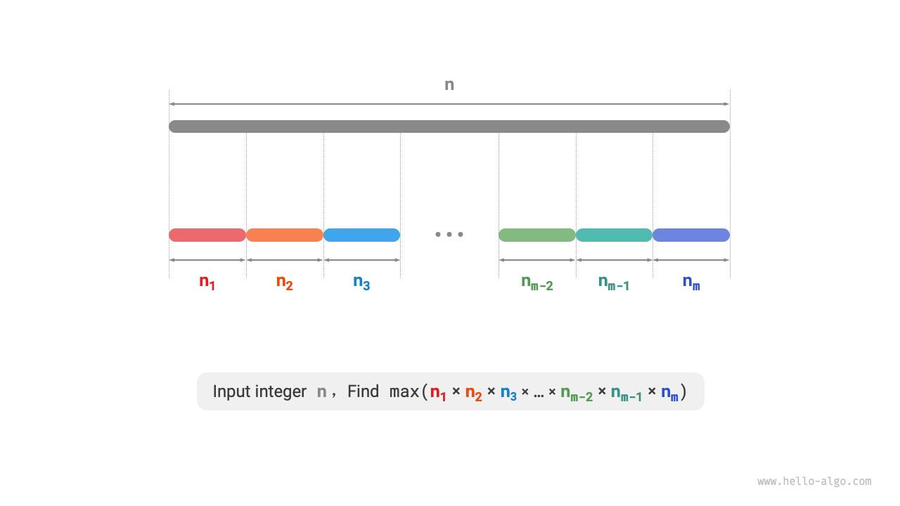
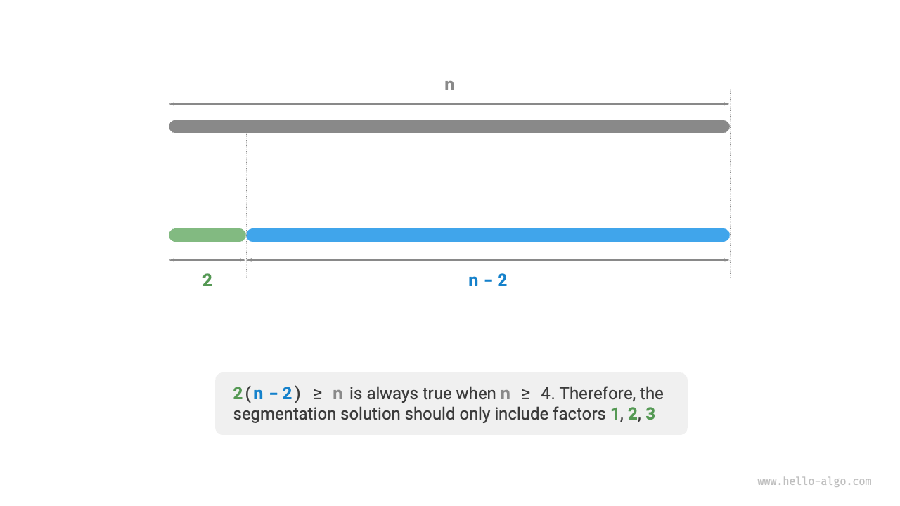
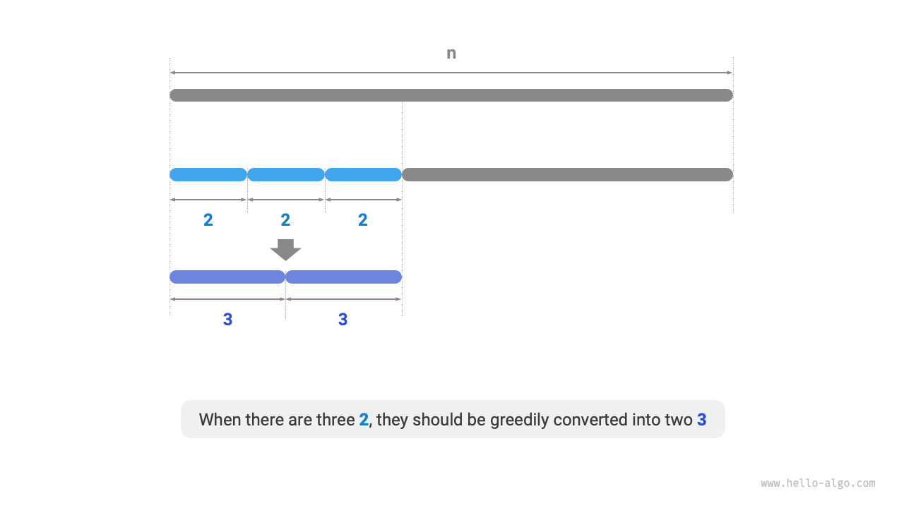
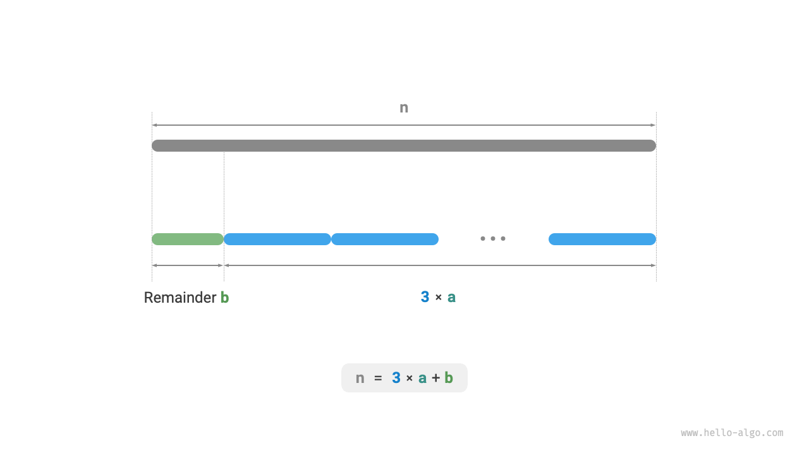

# 最大積分割問題

!!! question

    正整数 $n$ が与えられたとき、それを少なくとも 2 つの正整数の和に分割し、分割後のすべての整数の積の最大値を求めよ。下図に示す。



仮に $n$ を $m$ 個の整数因子に分割し、そのうち第 $i$ 個の因子を $n_i$ と記すと、

$$
n = \sum_{i=1}^{m}n_i
$$

本問題の目的は、すべての整数因子の積の最大値を求めることであり、すなわち

$$
\max(\prod_{i=1}^{m}n_i)
$$

考えるべきことは、分割数 $m$ をいくつにすべきか、各 $n_i$ をいくつにすべきかである。

### 貪欲戦略の決定

経験的に、2 つの整数の積はその和より大きくなることが多い。$n$ から因子 $2$ を 1 つ切り出すと、それらの積は $2(n-2)$ となる。この積を $n$ と比較すると、

$$
\begin{aligned}
2(n-2) & \geq n \newline
2n - n - 4 & \geq 0 \newline
n & \geq 4
\end{aligned}
$$

下図のように、$n \geq 4$ のとき、$2$ を 1 つ切り出すと積は大きくなる。**これは、$4$ 以上の整数はすべて分割すべきことを意味する**。

**貪欲戦略一**：分割方法に $\geq 4$ の因子が含まれるなら、それはさらに分割すべきである。最終的な分割方法に現れる因子は $1$、$2$、$3$ の 3 種類だけである。



次に、どの因子が最適かを考える。$1$、$2$、$3$ の 3 つの因子のうち、明らかに $1$ が最も悪い。なぜなら $1 \times (n-1) < n$ は常に成り立ち、$1$ を切り出すとかえって積が小さくなるからである。

下図のように、$n = 6$ のとき、$3 \times 3 > 2 \times 2 \times 2$ が成り立つ。**これは、$2$ を切り出すより $3$ を切り出すほうが有利であることを意味する**。

**貪欲戦略二**：分割方法の中に存在してよい $2$ は高々 2 つである。なぜなら、3 つの $2$ は常に 2 つの $3$ に置き換えられ、より大きな積を得られるからである。



以上より、次の貪欲戦略が導かれる。

1. 整数 $n$ を入力し、余りが $0$、$1$、$2$ になるまで、そこから因子 $3$ を繰り返し切り出す。
2. 余りが $0$ のとき、$n$ は $3$ の倍数であることを表すため、何も処理しない。
3. 余りが $2$ のときは、それ以上分割せず、そのまま残す。
4. 余りが $1$ のとき、$2 \times 2 > 1 \times 3$ であるため、最後の $3$ を $2$ に置き換えるべきである。

### コード実装

下図のように、ループで整数を分割する必要はなく、切り捨て除算によって $3$ の個数 $a$ を、剰余演算によって余り $b$ を得られる。このとき、

$$
n = 3 a + b
$$

なお、$n \leq 3$ の境界ケースでは、必ず $1$ を 1 つ分割する必要があり、積は $1 \times (n - 1)$ となる。

```src
[file]{max_product_cutting}-[class]{}-[func]{max_product_cutting}
```



**時間計算量は、プログラミング言語におけるべき乗演算の実装方法に依存する**。Python を例に取ると、よく使われるべき乗計算関数は 3 種類ある。

- 演算子 `**` と関数 `pow()` の時間計算量はいずれも $O(\log⁡ a)$ である。
- 関数 `math.pow()` は内部で C 言語ライブラリの `pow()` 関数を呼び出し、浮動小数点のべき乗を実行するため、時間計算量は $O(1)$ である。

変数 $a$ と $b$ が使う追加領域は定数サイズであり、**したがって空間計算量は $O(1)$ である**。

### 正しさの証明

背理法を用い、$n \geq 4$ の場合のみを考える。

1. **すべての因子は $\leq 3$** ：最適な分割方法に $\geq 4$ の因子 $x$ が存在すると仮定すると、それは必ずさらに $2(x-2)$ に分割でき、より大きい（または等しい）積が得られる。これは仮定に矛盾する。
2. **分割方法に $1$ は含まれない** ：最適な分割方法に因子 $1$ が 1 つ存在すると仮定すると、それは必ず別の因子に併合でき、より大きい積を得られる。これは仮定に矛盾する。
3. **分割方法に含まれる $2$ は高々 2 つ** ：最適な分割方法に 3 つの $2$ が含まれると仮定すると、それは必ず 2 つの $3$ に置き換えられ、積はより大きくなる。これは仮定に矛盾する。
