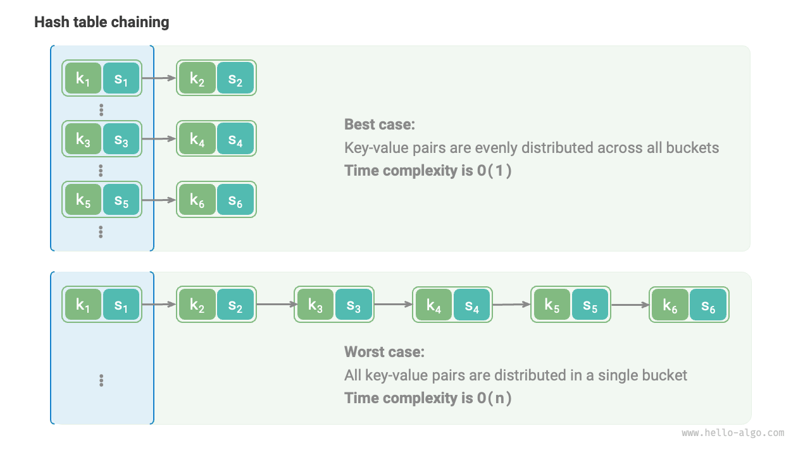

# ハッシュアルゴリズム

前の2つの節では、ハッシュ表の動作原理とハッシュ衝突を処理する方法を紹介しました。しかし、オープンアドレス法と連鎖法はどちらも**衝突が発生した際にハッシュ表が正常に機能することのみを保証でき、ハッシュ衝突の発生頻度を減らすことはできません**。

ハッシュ衝突があまりにも頻繁に発生すると、ハッシュ表の性能は劇的に悪化します。下図に示すように、連鎖法ハッシュ表では、理想的なケースではキー値ペアがバケット間に均等に分散され、最適なクエリ効率を実現します。最悪のケースでは、すべてのキー値ペアが同じバケットに格納され、時間計算量が$O(n)$に悪化します。



**キー値ペアの分布はハッシュ関数によって決定されます**。ハッシュ関数の計算ステップを思い出すと、まずハッシュ値を計算し、次に配列長で剰余を取ります：

```shell
index = hash(key) % capacity
```

上記の式を観察すると、ハッシュ表の容量`capacity`が固定されている場合、**ハッシュアルゴリズム`hash()`が出力値を決定し**、それによってハッシュ表におけるキー値ペアの分布を決定します。

これは、ハッシュ衝突の確率を減らすために、ハッシュアルゴリズム`hash()`の設計に焦点を当てるべきであることを意味します。

## ハッシュアルゴリズムの目標

「高速で安定した」ハッシュ表データ構造を実現するために、ハッシュアルゴリズムは以下の特性を持つべきです：

- **決定性**: 同じ入力に対して、ハッシュアルゴリズムは常に同じ出力を生成するべきです。そうでなければハッシュ表は信頼できません。
- **高効率**: ハッシュ値を計算するプロセスは十分に高速である必要があります。計算オーバーヘッドが小さいほど、ハッシュ表はより実用的になります。
- **均等分散**: ハッシュアルゴリズムはキー値ペアがハッシュ表に均等に分散されることを保証するべきです。分散が均等であるほど、ハッシュ衝突の確率は低くなります。

実際、ハッシュアルゴリズムはハッシュ表の実装だけでなく、他の分野でも広く応用されています。

- **パスワード保存**: ユーザーパスワードのセキュリティを保護するために、システムは通常平文パスワードを保存せず、パスワードのハッシュ値を保存します。ユーザーがパスワードを入力すると、システムは入力のハッシュ値を計算し、保存されているハッシュ値と比較します。一致すれば、パスワードは正しいと見なされます。
- **データ整合性チェック**: データ送信者はデータのハッシュ値を計算して一緒に送信できます。受信者は受信したデータのハッシュ値を再計算し、受信したハッシュ値と比較できます。一致すれば、データは完全であると見なされます。

暗号化アプリケーションでは、ハッシュ値から元のパスワードを推測するなどの逆行分析を防ぐために、ハッシュアルゴリズムはより高いレベルのセキュリティ機能が必要です。

- **一方向性**: ハッシュ値から入力データに関する情報を推測することは不可能であるべきです。
- **衝突耐性**: 同じハッシュ値を生成する2つの異なる入力を見つけることは極めて困難であるべきです。
- **雪崩効果**: 入力の小さな変更は、出力に大きく予測不可能な変化をもたらすべきです。

**「均等分散」と「衝突耐性」は2つの別々の概念**であることに注意してください。均等分散を満たしても、必ずしも衝突耐性があるとは限りません。例えば、ランダムな入力`key`の下で、ハッシュ関数`key % 100`は均等に分散された出力を生成できます。しかし、このハッシュアルゴリズムは過度にシンプルで、下二桁が同じすべての`key`は同じ出力を持つため、ハッシュ値から使用可能な`key`を簡単に推測でき、パスワードを破ることができます。

## ハッシュアルゴリズムの設計

ハッシュアルゴリズムの設計は多くの要因を考慮する必要がある複雑な問題です。しかし、要求が少ない一部のシナリオでは、いくつかの簡単なハッシュアルゴリズムを設計することもできます。

- **加算ハッシュ**: 入力の各文字のASCIIコードを合計し、合計をハッシュ値として使用します。
- **乗算ハッシュ**: 乗算の非相関性を利用し、各ラウンドで定数を乗算し、各文字のASCIIコードをハッシュ値に累積します。
- **XORハッシュ**: 入力データの各要素をXORすることでハッシュ値を累積します。
- **回転ハッシュ**: 各文字のASCIIコードをハッシュ値に累積し、各累積前にハッシュ値に回転操作を実行します。

```src
[file]{simple_hash}-[class]{}-[func]{rot_hash}
```

各ハッシュアルゴリズムの最後のステップが大きな素数$1000000007$の剰余を取ることで、ハッシュ値が適切な範囲内にあることを保証していることが観察されます。なぜ素数の剰余を取ることが強調されるのか、または合成数の剰余を取ることの欠点は何かを考える価値があります。これは興味深い質問です。

結論として：**大きな素数を剰余として使用することで、ハッシュ値の均等分散を最大化できます**。素数は他の数と共通因子を持たないため、剰余演算によって引き起こされる周期的パターンを減らし、ハッシュ衝突を回避できます。

例えば、合成数$9$を剰余として選択するとします。これは$3$で割り切れるため、$3$で割り切れるすべての`key`はハッシュ値$0$、$3$、$6$にマッピングされます。

$$
\begin{aligned}
\text{modulus} & = 9 \newline
\text{key} & = \{ 0, 3, 6, 9, 12, 15, 18, 21, 24, 27, 30, 33, \dots \} \newline
\text{hash} & = \{ 0, 3, 6, 0, 3, 6, 0, 3, 6, 0, 3, 6,\dots \}
\end{aligned}
$$

入力`key`がたまたまこの種の等差数列分布を持つ場合、ハッシュ値がクラスターし、ハッシュ衝突を悪化させます。今度は`modulus`を素数$13$に置き換えるとします。`key`と`modulus`の間に共通因子がないため、出力ハッシュ値の均等性が大幅に改善されます。

$$
\begin{aligned}
\text{modulus} & = 13 \newline
\text{key} & = \{ 0, 3, 6, 9, 12, 15, 18, 21, 24, 27, 30, 33, \dots \} \newline
\text{hash} & = \{ 0, 3, 6, 9, 12, 2, 5, 8, 11, 1, 4, 7, \dots \}
\end{aligned}
$$

`key`がランダムで均等に分散されることが保証されている場合、剰余として素数または合成数を選択しても、両方とも均等に分散されたハッシュ値を生成できることは注目に値します。しかし、`key`の分布にある種の周期性がある場合、合成数の剰余はクラスタリングを引き起こしやすくなります。

要約すると、通常は素数を剰余として選択し、この素数は周期的パターンを可能な限り排除し、ハッシュアルゴリズムの堅牢性を向上させるために十分大きくある必要があります。

## 一般的なハッシュアルゴリズム

上記で言及した簡単なハッシュアルゴリズムはかなり「脆弱」で、ハッシュアルゴリズムの設計目標から程遠いことは難しくありません。例えば、加算とXORは交換法則に従うため、加算ハッシュとXORハッシュは同じ内容だが順序が異なる文字列を区別できず、ハッシュ衝突を悪化させ、セキュリティ問題を引き起こす可能性があります。

実際には、通常MD5、SHA-1、SHA-2、SHA-3などの標準ハッシュアルゴリズムを使用します。これらは任意の長さの入力データを固定長のハッシュ値にマッピングできます。

過去1世紀にわたって、ハッシュアルゴリズムは継続的なアップグレードと最適化のプロセスにありました。一部の研究者はハッシュアルゴリズムの性能向上に努め、ハッカーを含む他の人々はハッシュアルゴリズムのセキュリティ問題を見つけることに専念しています。以下の表は、実用的なアプリケーションで一般的に使用されるハッシュアルゴリズムを示しています。

- MD5とSHA-1は複数回攻撃に成功しており、さまざまなセキュリティアプリケーションで放棄されています。
- SHA-2シリーズ、特にSHA-256は、現在最も安全なハッシュアルゴリズムの1つで、成功した攻撃は報告されておらず、さまざまなセキュリティアプリケーションとプロトコルで一般的に使用されています。
- SHA-3はSHA-2と比較して実装コストが低く、計算効率が高いですが、現在の使用範囲はSHA-2シリーズほど広範囲ではありません。

<p align="center"> 表 <id> &nbsp; 一般的なハッシュアルゴリズム </p>

|                 | MD5                                             | SHA-1                               | SHA-2                                                             | SHA-3                        |
| --------------- | ----------------------------------------------- | ----------------------------------- | ----------------------------------------------------------------- | ---------------------------- |
| リリース年      | 1992                                            | 1995                                | 2002                                                              | 2008                         |
| 出力長          | 128 bit                                         | 160 bit                             | 256/512 bit                                                       | 224/256/384/512 bit          |
| ハッシュ衝突    | 頻繁                                            | 頻繁                                | まれ                                                              | まれ                         |
| セキュリティレベル | 低、攻撃に成功している                          | 低、攻撃に成功している              | 高                                                                | 高                           |
| アプリケーション | 放棄、データ整合性チェックにまだ使用           | 放棄                                | 暗号通貨取引検証、デジタル署名など                                | SHA-2の代替として使用可能    |

# データ構造におけるハッシュ値

ハッシュ表のキーは整数、小数、文字列などのさまざまなデータ型にできることを知っています。プログラミング言語は通常、これらのデータ型に対して組み込みのハッシュアルゴリズムを提供し、ハッシュ表のバケットインデックスを計算します。Pythonを例に取ると、`hash()`関数を使用してさまざまなデータ型のハッシュ値を計算できます。

- 整数とブール値のハッシュ値は、それら自身の値です。
- 浮動小数点数と文字列のハッシュ値の計算はより複雑で、興味のある読者は自分で研究することをお勧めします。
- タプルのハッシュ値は、その各要素のハッシュ値の組み合わせで、単一のハッシュ値になります。
- オブジェクトのハッシュ値は、そのメモリアドレスに基づいて生成されます。オブジェクトのハッシュメソッドをオーバーライドすることで、内容に基づいてハッシュ値を生成できます。

!!! tip

    異なるプログラミング言語における組み込みハッシュ値計算関数の定義と方法は異なることに注意してください。

=== "Python"

    ```python title="built_in_hash.py"
    num = 3
    hash_num = hash(num)
    # 整数3のハッシュ値は3

    bol = True
    hash_bol = hash(bol)
    # ブール値Trueのハッシュ値は1

    dec = 3.14159
    hash_dec = hash(dec)
    # 小数3.14159のハッシュ値は326484311674566659

    str = "Hello 算法"
    hash_str = hash(str)
    # 文字列"Hello 算法"のハッシュ値は4617003410720528961

    tup = (12836, "小哈")
    hash_tup = hash(tup)
    # タプル(12836, '小哈')のハッシュ値は1029005403108185979

    obj = ListNode(0)
    hash_obj = hash(obj)
    # ListNodeオブジェクト0x1058fd810のハッシュ値は274267521
    ```

=== "C++"

    ```cpp title="built_in_hash.cpp"
    int num = 3;
    size_t hashNum = hash<int>()(num);
    // 整数3のハッシュ値は3

    bool bol = true;
    size_t hashBol = hash<bool>()(bol);
    // ブール値1のハッシュ値は1

    double dec = 3.14159;
    size_t hashDec = hash<double>()(dec);
    // 小数3.14159のハッシュ値は4614256650576692846

    string str = "Hello 算法";
    size_t hashStr = hash<string>()(str);
    // 文字列"Hello 算法"のハッシュ値は15466937326284535026

    // C++では、組み込みstd::hash()は基本データ型のハッシュ値のみを提供
    // 配列とオブジェクトのハッシュ値は別途実装が必要
    ```

=== "Java"

    ```java title="built_in_hash.java"
    int num = 3;
    int hashNum = Integer.hashCode(num);
    // 整数3のハッシュ値は3

    boolean bol = true;
    int hashBol = Boolean.hashCode(bol);
    // ブール値trueのハッシュ値は1231

    double dec = 3.14159;
    int hashDec = Double.hashCode(dec);
    // 小数3.14159のハッシュ値は-1340954729

    String str = "Hello 算法";
    int hashStr = str.hashCode();
    // 文字列"Hello 算法"のハッシュ値は-727081396

    Object[] arr = { 12836, "小哈" };
    int hashTup = Arrays.hashCode(arr);
    // 配列[12836, 小哈]のハッシュ値は1151158

    ListNode obj = new ListNode(0);
    int hashObj = obj.hashCode();
    // ListNodeオブジェクトutils.ListNode@7dc5e7b4のハッシュ値は2110121908
    ```

=== "C#"

    ```csharp title="built_in_hash.cs"
    int num = 3;
    int hashNum = num.GetHashCode();
    // 整数3のハッシュ値は3;

    bool bol = true;
    int hashBol = bol.GetHashCode();
    // ブール値trueのハッシュ値は1;

    double dec = 3.14159;
    int hashDec = dec.GetHashCode();
    // 小数3.14159のハッシュ値は-1340954729;

    string str = "Hello 算法";
    int hashStr = str.GetHashCode();
    // 文字列"Hello 算法"のハッシュ値は-586107568;

    object[] arr = [12836, "小哈"];
    int hashTup = arr.GetHashCode();
    // 配列[12836, 小哈]のハッシュ値は42931033;

    ListNode obj = new(0);
    int hashObj = obj.GetHashCode();
    // ListNodeオブジェクト0のハッシュ値は39053774;
    ```

=== "Go"

    ```go title="built_in_hash.go"
    // Goには組み込みのハッシュコード関数が提供されていません
    ```

=== "Swift"

    ```swift title="built_in_hash.swift"
    let num = 3
    let hashNum = num.hashValue
    // 整数3のハッシュ値は9047044699613009734

    let bol = true
    let hashBol = bol.hashValue
    // ブール値trueのハッシュ値は-4431640247352757451

    let dec = 3.14159
    let hashDec = dec.hashValue
    // 小数3.14159のハッシュ値は-2465384235396674631

    let str = "Hello 算法"
    let hashStr = str.hashValue
    // 文字列"Hello 算法"のハッシュ値は-7850626797806988787

    let arr = [AnyHashable(12836), AnyHashable("小哈")]
    let hashTup = arr.hashValue
    // 配列[AnyHashable(12836), AnyHashable("小哈")]のハッシュ値は-2308633508154532996

    let obj = ListNode(x: 0)
    let hashObj = obj.hashValue
    // ListNodeオブジェクトutils.ListNodeのハッシュ値は-2434780518035996159
    ```

=== "JS"

    ```javascript title="built_in_hash.js"
    // JavaScriptには組み込みのハッシュコード関数が提供されていません
    ```

=== "TS"

    ```typescript title="built_in_hash.ts"
    // TypeScriptには組み込みのハッシュコード関数が提供されていません
    ```

=== "Dart"

    ```dart title="built_in_hash.dart"
    int num = 3;
    int hashNum = num.hashCode;
    // 整数3のハッシュ値は34803

    bool bol = true;
    int hashBol = bol.hashCode;
    // ブール値trueのハッシュ値は1231

    double dec = 3.14159;
    int hashDec = dec.hashCode;
    // 小数3.14159のハッシュ値は2570631074981783

    String str = "Hello 算法";
    int hashStr = str.hashCode;
    // 文字列"Hello 算法"のハッシュ値は468167534

    List arr = [12836, "小哈"];
    int hashArr = arr.hashCode;
    // 配列[12836, 小哈]のハッシュ値は976512528

    ListNode obj = new ListNode(0);
    int hashObj = obj.hashCode;
    // ListNodeオブジェクトInstance of 'ListNode'のハッシュ値は1033450432
    ```

=== "Rust"

    ```rust title="built_in_hash.rs"
    use std::collections::hash_map::DefaultHasher;
    use std::hash::{Hash, Hasher};

    let num = 3;
    let mut num_hasher = DefaultHasher::new();
    num.hash(&mut num_hasher);
    let hash_num = num_hasher.finish();
    // 整数3のハッシュ値は568126464209439262

    let bol = true;
    let mut bol_hasher = DefaultHasher::new();
    bol.hash(&mut bol_hasher);
    let hash_bol = bol_hasher.finish();
    // ブール値trueのハッシュ値は4952851536318644461

    let dec: f32 = 3.14159;
    let mut dec_hasher = DefaultHasher::new();
    dec.to_bits().hash(&mut dec_hasher);
    let hash_dec = dec_hasher.finish();
    // 小数3.14159のハッシュ値は2566941990314602357

    let str = "Hello 算法";
    let mut str_hasher = DefaultHasher::new();
    str.hash(&mut str_hasher);
    let hash_str = str_hasher.finish();
    // 文字列"Hello 算法"のハッシュ値は16092673739211250988

    let arr = (&12836, &"小哈");
    let mut tup_hasher = DefaultHasher::new();
    arr.hash(&mut tup_hasher);
    let hash_tup = tup_hasher.finish();
    // タプル(12836, "小哈")のハッシュ値は1885128010422702749

    let node = ListNode::new(42);
    let mut hasher = DefaultHasher::new();
    node.borrow().val.hash(&mut hasher);
    let hash = hasher.finish();
    // ListNodeオブジェクトRefCell { value: ListNode { val: 42, next: None } }のハッシュ値は15387811073369036852
    ```

=== "C"

    ```c title="built_in_hash.c"
    // Cには組み込みのハッシュコード関数が提供されていません
    ```

=== "Kotlin"

    ```kotlin title="built_in_hash.kt"

    ```

=== "Zig"

    ```zig title="built_in_hash.zig"

    ```

多くのプログラミング言語では、**不変オブジェクトのみがハッシュ表の`key`として機能できます**。リスト（動的配列）を`key`として使用する場合、リストの内容が変更されると、そのハッシュ値も変更され、ハッシュ表で元の`value`を見つけることができなくなります。

カスタムオブジェクト（連結リストノードなど）のメンバー変数は可変ですが、ハッシュ可能です。**これは、オブジェクトのハッシュ値が通常そのメモリアドレスに基づいて生成されるためです**。オブジェクトの内容が変更されても、メモリアドレスは同じままなので、ハッシュ値は変更されません。

異なるコンソールで出力されるハッシュ値が異なることに気づいたかもしれません。**これは、Pythonインタープリターが起動するたびに文字列ハッシュ関数にランダムソルトを追加するためです**。このアプローチはHashDoS攻撃を効果的に防ぎ、ハッシュアルゴリズムのセキュリティを向上させます。
