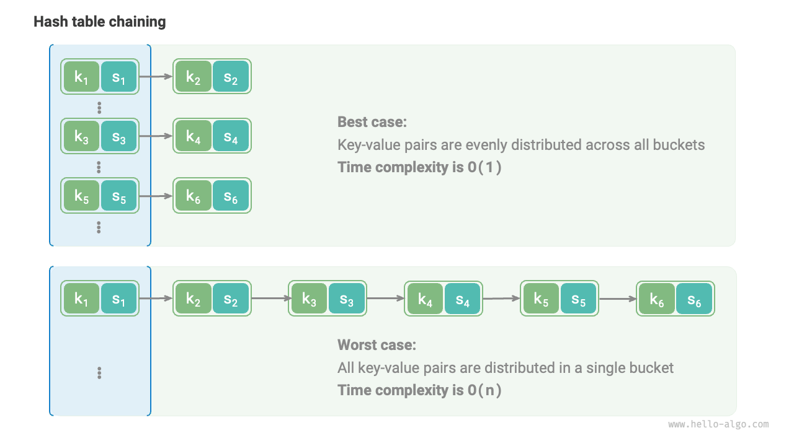

# ハッシュアルゴリズム

前の 2 節では、ハッシュテーブルの動作原理とハッシュ衝突の処理方法を紹介しました。しかし、オープンアドレス法であれ連鎖方式であれ、**それらが保証できるのは衝突発生時でもハッシュテーブルが正常に動作することだけであり、ハッシュ衝突そのものを減らすことはできません**。

ハッシュ衝突があまりにも頻繁に発生すると、ハッシュテーブルの性能は急激に劣化します。下図のように、連鎖方式のハッシュテーブルでは、理想的な場合にはキーと値のペアが各バケットに均等に分布し、最良の検索効率を達成します。最悪の場合には、すべてのキーと値のペアが同じバケットに格納され、時間計算量は $O(n)$ に劣化します。



**キーと値のペアの分布はハッシュ関数によって決まります**。ハッシュ関数の計算手順を思い出すと、まずハッシュ値を計算し、その後で配列長に対して剰余を取ります。

```shell
index = hash(key) % capacity
```

上の式から分かるように、ハッシュテーブルの容量 `capacity` が固定されているとき、**出力値を決めるのはハッシュアルゴリズム `hash()` です**。したがって、それがキーと値のペアのハッシュテーブル内での分布も決定します。

これは、ハッシュ衝突の発生確率を下げるには、ハッシュアルゴリズム `hash()` の設計に注目すべきだということを意味します。

## ハッシュアルゴリズムの目標

「高速かつ安定した」ハッシュテーブルというデータ構造を実現するために、ハッシュアルゴリズムは次の特徴を備える必要があります。

- **決定性**：同じ入力に対して、ハッシュアルゴリズムは常に同じ出力を生成しなければなりません。そうして初めて、ハッシュテーブルの信頼性が保たれます。
- **高効率**：ハッシュ値の計算過程は十分に高速であるべきです。計算コストが小さいほど、ハッシュテーブルの実用性は高くなります。
- **均一分布**：ハッシュアルゴリズムは、キーと値のペアがハッシュテーブル内に均等に分布するようにすべきです。分布が均一であるほど、ハッシュ衝突の確率は低くなります。

実際には、ハッシュアルゴリズムはハッシュテーブルの実装だけでなく、ほかの多くの分野でも広く利用されています。

- **パスワード保存**：ユーザーのパスワードを保護するために、システムは通常、平文パスワードを直接保存せず、そのハッシュ値を保存します。ユーザーがパスワードを入力すると、システムは入力内容のハッシュ値を計算し、保存済みのハッシュ値と比較します。一致すれば、そのパスワードは正しいと見なされます。
- **データ完全性検査**：送信側はデータのハッシュ値を計算してデータと一緒に送信できます。受信側は受け取ったデータのハッシュ値を再計算し、受信したハッシュ値と比較できます。両者が一致すれば、そのデータは完全だと見なされます。

暗号分野の応用では、ハッシュ値から元のパスワードを推測するといった逆解析を防ぐために、ハッシュアルゴリズムにはさらに高いレベルの安全性が求められます。

- **一方向性**：ハッシュ値から入力データに関するいかなる情報も逆算できないこと。
- **耐衝突性**：異なる 2 つの入力で同じハッシュ値になるものを見つけることが、極めて困難であること。
- **アバランシェ効果**：入力のわずかな変化が、出力の大きく予測不能な変化を引き起こすこと。

注意してほしいのは、**「均一分布」と「耐衝突性」は独立した 2 つの概念である**という点です。均一分布を満たしていても、耐衝突性を満たすとは限りません。たとえば、入力 `key` がランダムである場合、ハッシュ関数 `key % 100` は均一に分布した出力を生成できます。しかし、このハッシュアルゴリズムはあまりにも単純で、下 2 桁が同じ `key` はすべて同じ出力になります。そのため、ハッシュ値から利用可能な `key` を容易に逆算でき、結果としてパスワードが破られてしまいます。

## ハッシュアルゴリズムの設計

ハッシュアルゴリズムの設計は、多くの要素を考慮しなければならない複雑な問題です。しかし、要求の高くない場面であれば、いくつかの単純なハッシュアルゴリズムを設計することもできます。

- **加算ハッシュ**：入力の各文字の ASCII コードを足し合わせ、その合計をハッシュ値とします。
- **乗算ハッシュ**：乗算の非相関性を利用し、各ラウンドで定数を掛けながら、各文字の ASCII コードをハッシュ値に累積します。
- **XOR ハッシュ**：入力データの各要素を XOR 演算で 1 つのハッシュ値に累積します。
- **回転ハッシュ**：各文字の ASCII コードを 1 つのハッシュ値に累積し、各回の累積前にハッシュ値を回転させます。

```src
[file]{simple_hash}-[class]{}-[func]{rot_hash}
```

見て分かるように、各ハッシュアルゴリズムの最後のステップでは、大きな素数 $1000000007$ で剰余を取り、ハッシュ値が適切な範囲に収まるようにしています。ここで考えてみる価値があるのは、なぜ素数での剰余を強調するのか、あるいは合成数で剰余を取ることにどんな欠点があるのか、という点です。これは興味深い問題です。

先に結論を述べると、**法として大きな素数を使うと、ハッシュ値が均一に分布することを最大限に保証できます**。素数はほかの数と公約数を持たないため、剰余演算によって生じる周期的なパターンを減らし、ハッシュ衝突を避けやすくなります。

たとえば、法として合成数 $9$ を選ぶとします。これは $3$ で割り切れるため、$3$ で割り切れるすべての `key` は、$0$、$3$、$6$ の 3 つのハッシュ値に写像されます。

$$
\begin{aligned}
\text{modulus} & = 9 \newline
\text{key} & = \{ 0, 3, 6, 9, 12, 15, 18, 21, 24, 27, 30, 33, \dots \} \newline
\text{hash} & = \{ 0, 3, 6, 0, 3, 6, 0, 3, 6, 0, 3, 6,\dots \}
\end{aligned}
$$

入力 `key` がたまたまこのような等差数列の分布をしていると、ハッシュ値に偏りが生じ、ハッシュ衝突がさらに深刻になります。そこで `modulus` を素数 $13$ に置き換えると仮定すると、`key` と `modulus` の間に公約数が存在しないため、出力されるハッシュ値の均一性は明らかに向上します。

$$
\begin{aligned}
\text{modulus} & = 13 \newline
\text{key} & = \{ 0, 3, 6, 9, 12, 15, 18, 21, 24, 27, 30, 33, \dots \} \newline
\text{hash} & = \{ 0, 3, 6, 9, 12, 2, 5, 8, 11, 1, 4, 7, \dots \}
\end{aligned}
$$

補足すると、`key` がランダムかつ均一に分布していると保証できるなら、法に素数を選んでも合成数を選んでも構いません。どちらでも均一に分布したハッシュ値を出力できます。しかし、`key` の分布に何らかの周期性がある場合、合成数で剰余を取るほうが偏りが生じやすくなります。

要するに、通常は法として素数を選び、その素数はできるだけ大きいほうが望ましいです。そうすることで周期的なパターンをできる限り取り除き、ハッシュアルゴリズムの堅牢性を高められます。

## 一般的なハッシュアルゴリズム

上で紹介した単純なハッシュアルゴリズムは、どれも比較的「脆弱」であり、ハッシュアルゴリズムの設計目標にはほど遠いことが分かります。たとえば、加算と XOR は交換法則を満たすため、加算ハッシュと XOR ハッシュでは、内容が同じで順序だけ異なる文字列を区別できません。これはハッシュ衝突を悪化させ、一部の安全上の問題を引き起こす可能性があります。

実際には、MD5、SHA-1、SHA-2、SHA-3 などの標準的なハッシュアルゴリズムを用いることが一般的です。これらは任意長の入力データを、固定長のハッシュ値へ写像できます。

ここ 1 世紀近くの間、ハッシュアルゴリズムは継続的に改良と最適化が進められてきました。ある研究者たちは性能向上に取り組み、別の研究者やハッカーたちは安全性の弱点を探し続けてきました。次の表は、実際の応用でよく使われるハッシュアルゴリズムを示したものです。

- MD5 と SHA-1 は何度も攻撃に成功されているため、各種のセキュリティ用途では廃止されています。
- SHA-2 系列の SHA-256 は最も安全なハッシュアルゴリズムの 1 つであり、いまだに成功した攻撃例がないため、多くのセキュリティ用途やプロトコルで広く使われています。
- SHA-3 は SHA-2 と比べて実装コストが低く、計算効率も高い一方で、現時点での普及度は SHA-2 系列に及びません。

<p align="center"> 表 <id> &nbsp; 一般的なハッシュアルゴリズム </p>

|          | MD5                            | SHA-1            | SHA-2                        | SHA-3               |
| -------- | ------------------------------ | ---------------- | ---------------------------- | ------------------- |
| 発表年   | 1992                           | 1995             | 2002                         | 2008                |
| 出力長   | 128 bit                        | 160 bit          | 256/512 bit                  | 224/256/384/512 bit |
| ハッシュ衝突 | 多い                           | 多い             | 非常に少ない                 | 非常に少ない        |
| セキュリティレベル | 低く、攻撃に成功されている     | 低く、攻撃に成功されている | 高い                         | 高い                |
| 用途     | 廃止済みだが、データ完全性検査には使われる | 廃止済み         | 暗号資産の取引検証、デジタル署名など | SHA-2 の代替に使える |

## データ構造のハッシュ値

ご存じのように、ハッシュテーブルの `key` には整数、小数、文字列などのデータ型を使えます。プログラミング言語は通常、これらのデータ型に対して組み込みのハッシュアルゴリズムを提供し、ハッシュテーブル内のバケットインデックス計算に利用します。Python を例にすると、`hash()` 関数を呼び出して各種データ型のハッシュ値を計算できます。

- 整数と真理値のハッシュ値は、その値自身です。
- 浮動小数点数と文字列のハッシュ値の計算はやや複雑なので、興味がある読者は自分で調べてみてください。
- タプルのハッシュ値は、各要素のハッシュ値を求めてから、それらを組み合わせて 1 つのハッシュ値にしたものです。
- オブジェクトのハッシュ値は、そのメモリアドレスに基づいて生成されます。オブジェクトのハッシュメソッドをオーバーライドすれば、内容に基づくハッシュ値を実装できます。

!!! tip

    注意してください。組み込みのハッシュ値計算関数の定義や方法は、プログラミング言語ごとに異なります。

=== "Python"

    ```python title="built_in_hash.py"
    num = 3
    hash_num = hash(num)
    # 整数 3 のハッシュ値は 3

    bol = True
    hash_bol = hash(bol)
    # 真理値 True のハッシュ値は 1

    dec = 3.14159
    hash_dec = hash(dec)
    # 小数 3.14159 のハッシュ値は 326484311674566659

    str = "Hello アルゴリズム"
    hash_str = hash(str)
    # 文字列「Hello アルゴリズム」のハッシュ値は 4617003410720528961

    tup = (12836, "シャオハ")
    hash_tup = hash(tup)
    # タプル (12836, 'シャオハ') のハッシュ値は 1029005403108185979

    obj = ListNode(0)
    hash_obj = hash(obj)
    # ノードオブジェクト <ListNode object at 0x1058fd810> のハッシュ値は 274267521
    ```

=== "C++"

    ```cpp title="built_in_hash.cpp"
    int num = 3;
    size_t hashNum = hash<int>()(num);
    // 整数 3 のハッシュ値は 3

    bool bol = true;
    size_t hashBol = hash<bool>()(bol);
    // 真理値 1 のハッシュ値は 1

    double dec = 3.14159;
    size_t hashDec = hash<double>()(dec);
    // 小数 3.14159 のハッシュ値は 4614256650576692846

    string str = "Hello アルゴリズム";
    size_t hashStr = hash<string>()(str);
    // 文字列「Hello アルゴリズム」のハッシュ値は 15466937326284535026

    // C++ では、組み込みの std:hash() は基本データ型のハッシュ値計算のみを提供する
    // 配列やオブジェクトのハッシュ値計算は自分で実装する必要がある
    ```

=== "Java"

    ```java title="built_in_hash.java"
    int num = 3;
    int hashNum = Integer.hashCode(num);
    // 整数 3 のハッシュ値は 3

    boolean bol = true;
    int hashBol = Boolean.hashCode(bol);
    // 真理値 true のハッシュ値は 1231

    double dec = 3.14159;
    int hashDec = Double.hashCode(dec);
    // 小数 3.14159 のハッシュ値は -1340954729

    String str = "Hello アルゴリズム";
    int hashStr = str.hashCode();
    // 文字列「Hello アルゴリズム」のハッシュ値は -727081396

    Object[] arr = { 12836, "シャオハ" };
    int hashTup = Arrays.hashCode(arr);
    // 配列 [12836, シャオハ] のハッシュ値は 1151158

    ListNode obj = new ListNode(0);
    int hashObj = obj.hashCode();
    // ノードオブジェクト utils.ListNode@7dc5e7b4 のハッシュ値は 2110121908
    ```

=== "C#"

    ```csharp title="built_in_hash.cs"
    int num = 3;
    int hashNum = num.GetHashCode();
    // 整数 3 のハッシュ値は 3;

    bool bol = true;
    int hashBol = bol.GetHashCode();
    // 真理値 true のハッシュ値は 1;

    double dec = 3.14159;
    int hashDec = dec.GetHashCode();
    // 小数 3.14159 のハッシュ値は -1340954729;

    string str = "Hello アルゴリズム";
    int hashStr = str.GetHashCode();
    // 文字列「Hello アルゴリズム」のハッシュ値は -586107568;

    object[] arr = [12836, "シャオハ"];
    int hashTup = arr.GetHashCode();
    // 配列 [12836, シャオハ] のハッシュ値は 42931033;

    ListNode obj = new(0);
    int hashObj = obj.GetHashCode();
    // ノードオブジェクト 0 のハッシュ値は 39053774;
    ```

=== "Go"

    ```go title="built_in_hash.go"
    // Go は組み込みの hash code 関数を提供していない
    ```

=== "Swift"

    ```swift title="built_in_hash.swift"
    let num = 3
    let hashNum = num.hashValue
    // 整数 3 のハッシュ値は 9047044699613009734

    let bol = true
    let hashBol = bol.hashValue
    // 真理値 true のハッシュ値は -4431640247352757451

    let dec = 3.14159
    let hashDec = dec.hashValue
    // 小数 3.14159 のハッシュ値は -2465384235396674631

    let str = "Hello アルゴリズム"
    let hashStr = str.hashValue
    // 文字列「Hello アルゴリズム」のハッシュ値は -7850626797806988787

    let arr = [AnyHashable(12836), AnyHashable("シャオハ")]
    let hashTup = arr.hashValue
    // 配列 [AnyHashable(12836), AnyHashable("シャオハ")] のハッシュ値は -2308633508154532996

    let obj = ListNode(x: 0)
    let hashObj = obj.hashValue
    // ノードオブジェクト utils.ListNode のハッシュ値は -2434780518035996159
    ```

=== "JS"

    ```javascript title="built_in_hash.js"
    // JavaScript は組み込みの hash code 関数を提供していない
    ```

=== "TS"

    ```typescript title="built_in_hash.ts"
    // TypeScript は組み込みの hash code 関数を提供していない
    ```

=== "Dart"

    ```dart title="built_in_hash.dart"
    int num = 3;
    int hashNum = num.hashCode;
    // 整数 3 のハッシュ値は 34803

    bool bol = true;
    int hashBol = bol.hashCode;
    // 真理値 true のハッシュ値は 1231

    double dec = 3.14159;
    int hashDec = dec.hashCode;
    // 小数 3.14159 のハッシュ値は 2570631074981783

    String str = "Hello アルゴリズム";
    int hashStr = str.hashCode;
    // 文字列「Hello アルゴリズム」のハッシュ値は 468167534

    List arr = [12836, "シャオハ"];
    int hashArr = arr.hashCode;
    // 配列 [12836, シャオハ] のハッシュ値は 976512528

    ListNode obj = new ListNode(0);
    int hashObj = obj.hashCode;
    // ノードオブジェクト Instance of 'ListNode' のハッシュ値は 1033450432
    ```

=== "Rust"

    ```rust title="built_in_hash.rs"
    use std::collections::hash_map::DefaultHasher;
    use std::hash::{Hash, Hasher};

    let num = 3;
    let mut num_hasher = DefaultHasher::new();
    num.hash(&mut num_hasher);
    let hash_num = num_hasher.finish();
    // 整数 3 のハッシュ値は 568126464209439262

    let bol = true;
    let mut bol_hasher = DefaultHasher::new();
    bol.hash(&mut bol_hasher);
    let hash_bol = bol_hasher.finish();
    // 真理値 true のハッシュ値は 4952851536318644461

    let dec: f32 = 3.14159;
    let mut dec_hasher = DefaultHasher::new();
    dec.to_bits().hash(&mut dec_hasher);
    let hash_dec = dec_hasher.finish();
    // 小数 3.14159 のハッシュ値は 2566941990314602357

    let str = "Hello アルゴリズム";
    let mut str_hasher = DefaultHasher::new();
    str.hash(&mut str_hasher);
    let hash_str = str_hasher.finish();
    // 文字列「Hello アルゴリズム」のハッシュ値は 16092673739211250988

    let arr = (&12836, &"シャオハ");
    let mut tup_hasher = DefaultHasher::new();
    arr.hash(&mut tup_hasher);
    let hash_tup = tup_hasher.finish();
    // タプル (12836, "シャオハ") のハッシュ値は 1885128010422702749

    let node = ListNode::new(42);
    let mut hasher = DefaultHasher::new();
    node.borrow().val.hash(&mut hasher);
    let hash = hasher.finish();
    // ノードオブジェクト RefCell { value: ListNode { val: 42, next: None } } のハッシュ値は15387811073369036852
    ```

=== "C"

    ```c title="built_in_hash.c"
    // C は組み込みの hash code 関数を提供していない
    ```

=== "Kotlin"

    ```kotlin title="built_in_hash.kt"
    val num = 3
    val hashNum = num.hashCode()
    // 整数 3 のハッシュ値は 3

    val bol = true
    val hashBol = bol.hashCode()
    // 真理値 true のハッシュ値は 1231

    val dec = 3.14159
    val hashDec = dec.hashCode()
    // 小数 3.14159 のハッシュ値は -1340954729

    val str = "Hello アルゴリズム"
    val hashStr = str.hashCode()
    // 文字列「Hello アルゴリズム」のハッシュ値は -727081396

    val arr = arrayOf<Any>(12836, "シャオハ")
    val hashTup = arr.hashCode()
    // 配列 [12836, シャオハ] のハッシュ値は 189568618

    val obj = ListNode(0)
    val hashObj = obj.hashCode()
    // ノードオブジェクト utils.ListNode@1d81eb93 のハッシュ値は 495053715
    ```

=== "Ruby"

    ```ruby title="built_in_hash.rb"
    num = 3
    hash_num = num.hash
    # 整数 3 のハッシュ値は -4385856518450339636

    bol = true
    hash_bol = bol.hash
    # 真理値 true のハッシュ値は -1617938112149317027

    dec = 3.14159
    hash_dec = dec.hash
    # 小数 3.14159 のハッシュ値は -1479186995943067893

    str = "Hello アルゴリズム"
    hash_str = str.hash
    # 文字列「Hello アルゴリズム」のハッシュ値は -4075943250025831763

    tup = [12836, 'シャオハ']
    hash_tup = tup.hash
    # タプル (12836, 'シャオハ') のハッシュ値は 1999544809202288822

    obj = ListNode.new(0)
    hash_obj = obj.hash
    # ノードオブジェクト #<ListNode:0x000078133140ab70> のハッシュ値は 4302940560806366381
    ```

??? pythontutor "可視化実行"

    https://pythontutor.com/render.html#code=class%20ListNode%3A%0A%20%20%20%20%22%22%22%E9%93%BE%E8%A1%A8%E8%8A%82%E7%82%B9%E7%B1%BB%22%22%22%0A%20%20%20%20def%20__init__%28self,%20val%3A%20int%29%3A%0A%20%20%20%20%20%20%20%20self.val%3A%20int%20%3D%20val%20%20%23%20%E8%8A%82%E7%82%B9%E5%80%BC%0A%20%20%20%20%20%20%20%20self.next%3A%20ListNode%20%7C%20None%20%3D%20None%20%20%23%20%E5%90%8E%E7%BB%A7%E8%8A%82%E7%82%B9%E5%BC%95%E7%94%A8%0A%0A%22%22%22Driver%20Code%22%22%22%0Aif%20__name__%20%3D%3D%20%22__main__%22%3A%0A%20%20%20%20num%20%3D%203%0A%20%20%20%20hash_num%20%3D%20hash%28num%29%0A%20%20%20%20%23%20%E6%95%B4%E6%95%B0%203%20%E7%9A%84%E5%93%88%E5%B8%8C%E5%80%BC%E4%B8%BA%203%0A%0A%20%20%20%20bol%20%3D%20True%0A%20%20%20%20hash_bol%20%3D%20hash%28bol%29%0A%20%20%20%20%23%20%E5%B8%83%E5%B0%94%E9%87%8F%20True%20%E7%9A%84%E5%93%88%E5%B8%8C%E5%80%BC%E4%B8%BA%201%0A%0A%20%20%20%20dec%20%3D%203.14159%0A%20%20%20%20hash_dec%20%3D%20hash%28dec%29%0A%20%20%20%20%23%20%E5%B0%8F%E6%95%B0%203.14159%20%E7%9A%84%E5%93%88%E5%B8%8C%E5%80%BC%E4%B8%BA%20326484311674566659%0A%0A%20%20%20%20str%20%3D%20%22Hello%20%E7%AE%97%E6%B3%95%22%0A%20%20%20%20hash_str%20%3D%20hash%28str%29%0A%20%20%20%20%23%20%E5%AD%97%E7%AC%A6%E4%B8%B2%E2%80%9CHello%20%E7%AE%97%E6%B3%95%E2%80%9D%E7%9A%84%E5%93%88%E5%B8%8C%E5%80%BC%E4%B8%BA%204617003410720528961%0A%0A%20%20%20%20tup%20%3D%20%2812836,%20%22%E5%B0%8F%E5%93%88%22%29%0A%20%20%20%20hash_tup%20%3D%20hash%28tup%29%0A%20%20%20%20%23%20%E5%85%83%E7%BB%84%20%2812836,%20'%E5%B0%8F%E5%93%88'%29%20%E7%9A%84%E5%93%88%E5%B8%8C%E5%80%BC%E4%B8%BA%201029005403108185979%0A%0A%20%20%20%20obj%20%3D%20ListNode%280%29%0A%20%20%20%20hash_obj%20%3D%20hash%28obj%29%0A%20%20%20%20%23%20%E8%8A%82%E7%82%B9%E5%AF%B9%E8%B1%A1%20%3CListNode%20object%20at%200x1058fd810%3E%20%E7%9A%84%E5%93%88%E5%B8%8C%E5%80%BC%E4%B8%BA%20274267521&cumulative=false&curInstr=19&heapPrimitives=nevernest&mode=display&origin=opt-frontend.js&py=311&rawInputLstJSON=%5B%5D&textReferences=false

多くのプログラミング言語では、**不変オブジェクトだけがハッシュテーブルの `key` として使えます**。仮にリスト（動的配列）を `key` とすると、その内容が変化したときにハッシュ値も変わってしまうため、もとの `value` をハッシュテーブルから検索できなくなります。

カスタムオブジェクト（たとえば連結リストのノード）のメンバ変数は可変ですが、それでもハッシュ可能です。**これは、オブジェクトのハッシュ値が通常はメモリアドレスに基づいて生成されるためです**。オブジェクトの内容が変化しても、メモリアドレスが変わらなければ、ハッシュ値も変わりません。

注意深い人なら、異なるコンソールでプログラムを実行したときに、出力されるハッシュ値が異なることに気づくかもしれません。**これは、Python インタプリタが起動のたびに文字列ハッシュ関数へランダムな salt 値を追加しているためです**。この方法によって HashDoS 攻撃を効果的に防ぎ、ハッシュアルゴリズムの安全性を高めています。
