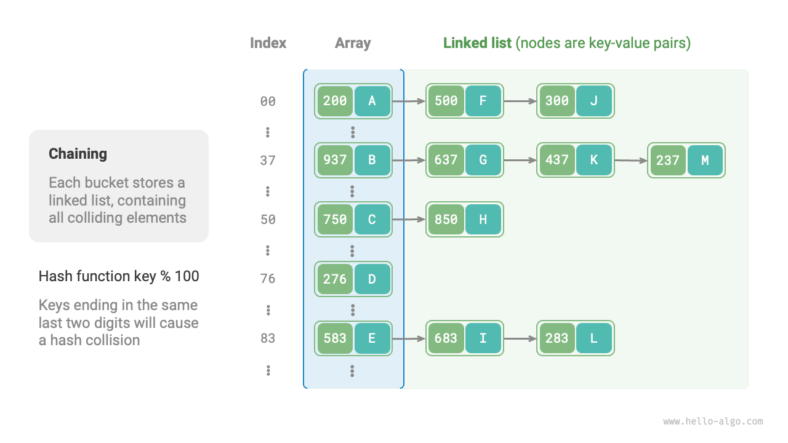

# ハッシュ衝突

前節で述べたように、**ほとんどの場合、ハッシュ関数の入力空間は出力空間よりもはるかに大きい**ため、理論的にはハッシュ衝突は避けられません。例えば、入力空間がすべての整数で、出力空間が配列容量のサイズの場合、複数の整数が必然的に同じバケットインデックスにマッピングされます。

ハッシュ衝突は誤ったクエリ結果につながり、ハッシュ表の使いやすさに深刻な影響を与える可能性があります。この問題に対処するために、ハッシュ衝突が発生するたびに、衝突が消えるまでハッシュ表のリサイズを実行します。このアプローチは非常にシンプルで直接的であり、うまく機能します。しかし、テーブルの拡張には大量のデータ移行とハッシュコードの再計算が含まれ、これらは高コストであるため、非常に非効率的に見えます。効率を向上させるために、以下の戦略を採用できます：

1. **ハッシュ衝突が発生した場合でも、ターゲット要素の検索が適切に機能する**ようにハッシュ表のデータ構造を改善する。
2. 深刻な衝突が観察され、必要になる前に、拡張は最後の手段とする。

ハッシュ表の構造を改善する主な方法は2つあります：「連鎖法」と「オープンアドレス法」です。

## 連鎖法

元のハッシュ表では、各バケットは1つのキー値ペアのみを格納できます。<u>連鎖法</u>は単一の要素を連結リストに変換し、キー値ペアをリストノードとして扱い、衝突するすべてのキー値ペアを同じ連結リストに格納します。下図は連鎖法を使用したハッシュ表の例を示しています。



連鎖法で実装されたハッシュ表の操作は以下のように変更されます：

- **要素のクエリ**: `key`を入力し、ハッシュ関数を通してバケットインデックスを取得し、連結リストのヘッドノードにアクセスします。連結リストを走査してキーを比較し、ターゲットキー値ペアを見つけます。
- **要素の追加**: ハッシュ関数を通して連結リストのヘッドノードにアクセスし、ノード（キー値ペア）をリストに追加します。
- **要素の削除**: ハッシュ関数の結果に基づいて連結リストのヘッドにアクセスし、連結リストを走査してターゲットノードを見つけて削除します。

連鎖法には以下の制限があります：

- **空間使用量の増加**: 連結リストにはノードポインタが含まれており、配列よりも多くのメモリ空間を消費します。
- **クエリ効率の低下**: 対応する要素を見つけるために連結リストの線形走査が必要になるためです。

以下のコードは連鎖法ハッシュ表の簡単な実装を提供し、注意すべき2つの点があります：

- 簡単にするために、連結リストの代わりにリスト（動的配列）を使用します。この設定では、ハッシュ表（配列）は複数のバケットを含み、各バケットはリストです。
- この実装にはハッシュ表のリサイズメソッドが含まれています。負荷率が$\frac{2}{3}$を超えると、ハッシュ表を元のサイズの2倍に拡張します。

```src
[file]{hash_map_chaining}-[class]{hash_map_chaining}-[func]{}
```

連結リストが非常に長い場合、クエリ効率$O(n)$が悪いことは注目に値します。**この場合、リストを「AVL木」または「赤黒木」に変換して**、クエリ操作の時間計算量を$O(\log n)$に最適化できます。

## オープンアドレス法

<u>オープンアドレス法</u>は追加のデータ構造を導入せず、代わりに「複数回プローブ」を通してハッシュ衝突を処理します。プローブ方法には主に線形プローブ、二次プローブ、二重ハッシュがあります。

線形プローブを例にして、オープンアドレス法ハッシュ表のメカニズムを紹介しましょう。

### 線形プローブ

線形プローブは固定ステップの線形検索をプローブに使用し、通常のハッシュ表とは異なります。

- **要素の挿入**: ハッシュ関数を使用してバケットインデックスを計算します。バケットに既に要素が含まれている場合、衝突位置から線形に前方に走査し（通常ステップサイズは$1$）、空のバケットが見つかるまで進み、要素を挿入します。
- **要素の検索**: ハッシュ衝突に遭遇した場合、同じステップサイズを使用して線形に前方に走査し、対応する要素が見つかったら`value`を返します。空のバケットに遭遇した場合、ターゲット要素がハッシュ表にないことを意味するため、`None`を返します。

下図はオープンアドレス法（線形プローブ）ハッシュ表におけるキー値ペアの分布を示しています。このハッシュ関数によると、下二桁が同じキーは同じバケットにマッピングされます。線形プローブを通して、それらはそのバケットとその下のバケットに順次格納されます。


しかし、**線形プローブは「クラスタリング」を作りやすい傾向があります**。具体的には、配列内の連続的に占有された位置が長いほど、これらの連続した位置でハッシュ衝突が発生する確率が高くなり、その位置でのクラスタリングの成長をさらに促進し、悪循環を形成し、最終的に挿入、削除、クエリ、更新操作の効率低下につながります。

**オープンアドレス法ハッシュ表では要素を直接削除できない**ことに注意することが重要です。要素を削除すると、配列に空のバケット`None`が作成されます。要素を検索する際、線形プローブがこの空のバケットに遭遇すると戻ってしまい、このバケットの下の要素にアクセスできなくなります。プログラムはこれらの要素が存在しないと誤って仮定する可能性があります。下図に示すとおりです。


この問題を解決するために、<u>遅延削除</u>メカニズムを採用できます：ハッシュ表から要素を直接削除する代わりに、**定数`TOMBSTONE`を使用してバケットをマークします**。このメカニズムでは、`None`と`TOMBSTONE`の両方が空のバケットを表し、キー値ペアを保持できます。ただし、線形プローブが`TOMBSTONE`に遭遇した場合、その下にまだキー値ペアがある可能性があるため、走査を続ける必要があります。

しかし、**遅延削除はハッシュ表の性能劣化を加速する可能性があります**。削除操作のたびに削除マークが生成され、`TOMBSTONE`が増加すると、線形プローブがターゲット要素を見つけるために複数の`TOMBSTONE`をスキップする必要がある可能性があるため、検索時間も増加します。

これに対処するために、線形プローブ中に最初に遭遇した`TOMBSTONE`のインデックスを記録し、検索されたターゲット要素とその`TOMBSTONE`の位置を交換することを検討してください。これを行う利点は、要素がクエリまたは追加されるたびに、要素がその理想的な位置（プローブの開始点）により近いバケットに移動され、クエリ効率が最適化されることです。

以下のコードは、遅延削除を使用したオープンアドレス法（線形プローブ）ハッシュ表を実装しています。ハッシュ表の空間をより有効に活用するために、ハッシュ表を「循環配列」として扱います。配列の終わりを超えると、最初に戻って走査を続けます。

```src
[file]{hash_map_open_addressing}-[class]{hash_map_open_addressing}-[func]{}
```

### 二次プローブ

二次プローブは線形プローブに似ており、オープンアドレス法の一般的な戦略の1つです。衝突が発生した場合、二次プローブは単純に固定ステップ数をスキップするのではなく、「プローブ回数の二乗」に等しいステップ数、つまり$1, 4, 9, \dots$ステップをスキップします。

二次プローブには以下の利点があります：

- 二次プローブは、プローブ回数の二乗の距離をスキップすることで、線形プローブのクラスタリング効果を軽減しようとします。
- 二次プローブはより大きな距離をスキップして空の位置を見つけ、データをより均等に分散するのに役立ちます。

しかし、二次プローブは完璧ではありません：

- クラスタリングは依然として存在し、つまり一部の位置は他の位置よりも占有される可能性が高いです。
- 二乗の成長により、二次プローブはハッシュ表全体をプローブできない可能性があり、ハッシュ表に空のバケットがあっても、二次プローブがアクセスできない可能性があります。

### 二重ハッシュ

名前が示すように、二重ハッシュ法は複数のハッシュ関数$f_1(x)$、$f_2(x)$、$f_3(x)$、$\dots$をプローブに使用します。

- **要素の挿入**: ハッシュ関数$f_1(x)$が衝突に遭遇した場合、$f_2(x)$を試し、以下同様に、空の位置が見つかって要素が挿入されるまで続けます。
- **要素の検索**: 同じハッシュ関数の順序で検索し、ターゲット要素が見つかって返されるまで、または空の位置に遭遇するかすべてのハッシュ関数が試されるまで続け、要素がハッシュ表にないことを示し、`None`を返します。

線形プローブと比較して、二重ハッシュ法はクラスタリングが起こりにくいですが、複数のハッシュ関数は追加の計算オーバーヘッドを導入します。

!!! tip

    オープンアドレス法（線形プローブ、二次プローブ、二重ハッシュ）ハッシュ表はすべて「要素を直接削除できない」という問題があることに注意してください。

## プログラミング言語の選択

異なるプログラミング言語は異なるハッシュ表実装戦略を採用しています。以下にいくつかの例を示します：

- Pythonはオープンアドレス法を使用します。`dict`辞書はプローブに疑似乱数を使用します。
- Javaは連鎖法を使用します。JDK 1.8以降、`HashMap`の配列長が64に達し、連結リストの長さが8に達すると、連結リストは検索性能を向上させるために赤黒木に変換されます。
- Goは連鎖法を使用します。Goは各バケットが最大8つのキー値ペアを格納できることを規定し、容量を超えた場合はオーバーフローバケットが連結されます。オーバーフローバケットが多すぎる場合、性能を確保するために特別な等容量リサイズ操作が実行されます。
