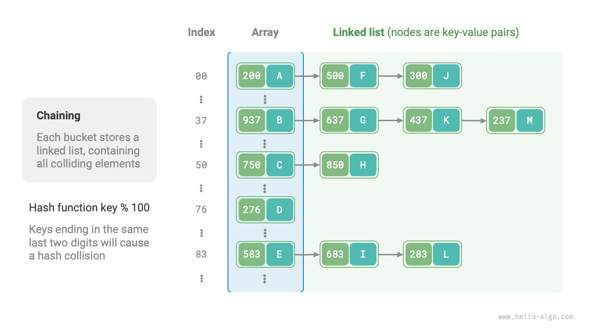
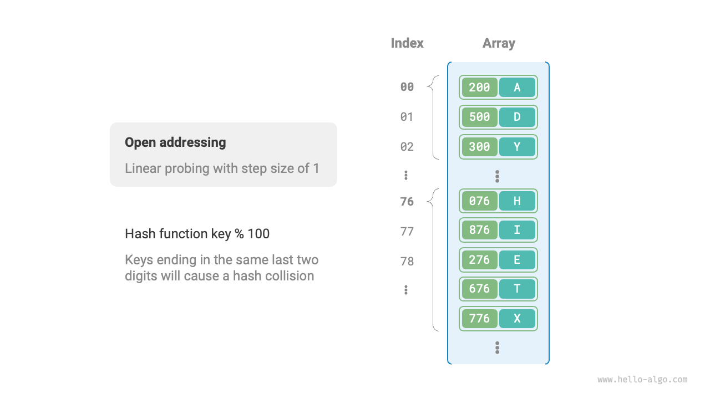
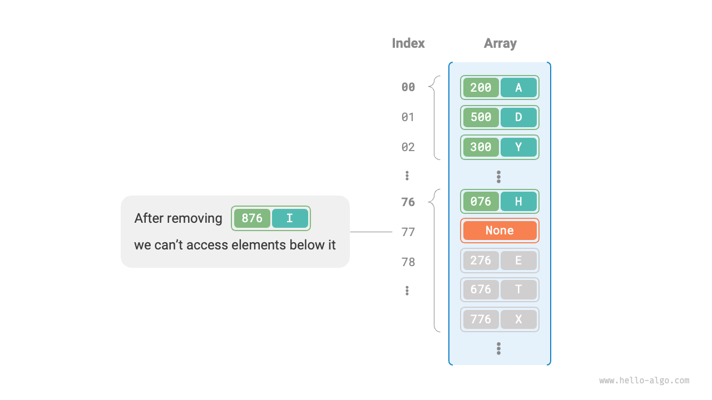

# ハッシュ衝突

前節で述べたように、**通常、ハッシュ関数の入力空間は出力空間よりもはるかに大きい**ため、理論上ハッシュ衝突は避けられません。例えば、入力空間がすべての整数で、出力空間が配列の容量サイズである場合、必然的に複数の整数が同じバケットインデックスに写像されます。

ハッシュ衝突は検索結果の誤りを招き、ハッシュテーブルの利用可能性に深刻な影響を与えます。この問題を解決するために、ハッシュ衝突が発生するたびにハッシュテーブルを拡張し、衝突が消えるまで続けることが考えられます。この方法は単純で効果的ですが、効率が低すぎます。なぜなら、ハッシュテーブルの拡張には大量のデータ移動とハッシュ値の計算が必要だからです。効率を高めるために、次の戦略を採用できます。

1. ハッシュテーブルのデータ構造を改良し、**ハッシュ衝突が発生してもハッシュテーブルが正常に動作できるようにする**。
2. 必要な場合、すなわちハッシュ衝突が比較的深刻なときにのみ、拡張操作を実行する。

ハッシュテーブルの構造改善方法には、主に「チェイン法」と「オープンアドレッシング」があります。

## チェイン法

元のハッシュテーブルでは、各バケットには 1 つのキーと値のペアしか格納できません。<u>チェイン法（separate chaining）</u>では、単一要素を連結リストに置き換え、キーと値のペアを連結リストのノードとして扱い、衝突したすべてのキーと値のペアを同じ連結リストに格納します。下図はチェイン法によるハッシュテーブルの例を示しています。



チェイン法で実装されたハッシュテーブルでは、操作方法が次のように変わります。

- **要素の検索**：入力 `key` をハッシュ関数に通してバケットインデックスを得ると、連結リストの先頭ノードにアクセスできます。その後、連結リストを走査して `key` を比較し、目的のキーと値のペアを探します。
- **要素の追加**：まずハッシュ関数で連結リストの先頭ノードにアクセスし、その後ノード（キーと値のペア）を連結リストに追加します。
- **要素の削除**：ハッシュ関数の結果に基づいて連結リストの先頭にアクセスし、続いて連結リストを走査して対象ノードを探し、削除します。

チェイン法には次の制約があります。

- **使用メモリの増加**：連結リストにはノードポインタが含まれるため、配列よりも多くのメモリを消費します。
- **検索効率の低下**：対応する要素を見つけるために連結リストを線形走査する必要があるためです。

以下のコードはチェイン法ハッシュテーブルの簡単な実装を示しています。注意すべき点は 2 つあります。

- 連結リストの代わりにリスト（動的配列）を使って、コードを簡潔にしています。この設定では、ハッシュテーブル（配列）は複数のバケットを含み、各バケットは 1 つのリストです。
- 以下の実装にはハッシュテーブルの拡張メソッドが含まれています。負荷率が $\frac{2}{3}$ を超えたとき、ハッシュテーブルを元の $2$ 倍に拡張します。

```src
[file]{hash_map_chaining}-[class]{hash_map_chaining}-[func]{}
```

注意すべきなのは、連結リストが長い場合、検索効率 $O(n)$ は非常に低いことです。**このとき、連結リストを「AVL 木」または「赤黒木」に変換することで**、検索操作の時間計算量を $O(\log n)$ に最適化できます。

## オープンアドレッシング

<u>オープンアドレッシング（open addressing）</u>では追加のデータ構造を導入せず、「複数回の探索」によってハッシュ衝突を処理します。探索方法には主に線形探索、二次探索、多重ハッシュなどがあります。

以下では線形探索を例に、オープンアドレッシングハッシュテーブルの動作の仕組みを説明します。

### 線形探索

線形探索では、固定ステップ長の線形探索によって探索を行います。その操作方法は通常のハッシュテーブルとは異なります。

- **要素の挿入**：ハッシュ関数によってバケットインデックスを計算し、バケット内にすでに要素がある場合は、衝突位置から後方へ線形に走査し（ステップ長は通常 $1$ ）、空のバケットが見つかるまで進み、その中に要素を挿入します。
- **要素の検索**：ハッシュ衝突が見つかった場合は、同じステップ長で後方へ線形走査を行い、対応する要素が見つかるまで続け、 `value` を返します。空のバケットに遭遇した場合は、対象要素がハッシュテーブル内に存在しないことを意味するため、 `None` を返します。

下図はオープンアドレッシング（線形探索）ハッシュテーブルにおけるキーと値のペアの分布を示しています。このハッシュ関数では、末尾 2 桁が同じ `key` はすべて同じバケットに写像されます。線形探索によって、それらはそのバケットとその後続のバケットに順に格納されます。



しかし、**線形探索では「クラスタリング現象」が起こりやすい**です。具体的には、配列内で連続して占有された位置が長いほど、それらの連続位置でハッシュ衝突が発生する可能性が高くなり、さらにその位置の集積成長を促して悪循環を生み、最終的には追加・削除・検索・更新操作の効率低下を招きます。

注意すべきなのは、**オープンアドレッシングハッシュテーブルでは要素を直接削除できない**ことです。これは、要素を削除すると配列内に空バケット `None` が生じ、要素を検索するときに線形探索がその空バケットに到達した時点で返ってしまうため、その空バケットより後ろの要素には二度とアクセスできなくなるからです。結果として、プログラムがそれらの要素を存在しないと誤判定する可能性があります。下図のとおりです。



この問題を解決するために、<u>遅延削除（lazy deletion）</u>の仕組みを採用できます。これは要素をハッシュテーブルから直接取り除かず、**代わりに定数 `TOMBSTONE` を使ってこのバケットをマークします**。この仕組みでは、`None` と `TOMBSTONE` はどちらも空バケットを表し、どちらにもキーと値のペアを配置できます。ただし異なるのは、線形探索が `TOMBSTONE` に到達した場合は、その先にキーと値のペアが存在する可能性があるため、探索を続けるべきだという点です。

しかし、**遅延削除はハッシュテーブルの性能劣化を加速させる可能性があります**。これは、削除操作のたびに削除マークが 1 つ生成され、`TOMBSTONE` が増えるにつれて探索時間も増加するためです。線形探索では、対象要素を見つけるまでに複数の `TOMBSTONE` を飛び越える必要があるかもしれません。

そのため、線形探索では、遭遇した最初の `TOMBSTONE` のインデックスを記録し、見つかった対象要素とその `TOMBSTONE` を交換することを考えます。こうする利点は、要素を検索または追加するたびに、要素が理想位置（探索開始点）により近いバケットへ移動し、検索効率が向上することです。

以下のコードは、遅延削除を含むオープンアドレッシング（線形探索）ハッシュテーブルを実装したものです。ハッシュテーブルの空間をより十分に活用するために、ハッシュテーブルを「環状配列」とみなし、配列末尾を越えたら先頭に戻って探索を続けます。

```src
[file]{hash_map_open_addressing}-[class]{hash_map_open_addressing}-[func]{}
```

### 二次探索

二次探索は線形探索に似ており、オープンアドレッシングの一般的な戦略の 1 つです。衝突が発生したとき、二次探索では単純に固定歩数を飛ばすのではなく、「探索回数の二乗」に相当する歩数、すなわち $1, 4, 9, \dots$ 歩を飛ばします。

二次探索には主に次の利点があります。

- 二次探索は、探索回数の二乗の距離を飛ばすことで、線形探索のクラスタリング効果を緩和しようとします。
- 二次探索はより大きな距離を飛ばして空き位置を探すため、データ分布がより均一になるのに役立ちます。

しかし、二次探索は完璧ではありません。

- 依然としてクラスタリング現象は存在し、ある位置が他の位置より占有されやすいことがあります。
- 二乗の増加により、二次探索はハッシュテーブル全体を探索できない可能性があります。これは、ハッシュテーブルに空バケットがあっても、二次探索ではそこに到達できないことがあることを意味します。

### 多重ハッシュ

その名のとおり、多重ハッシュ法では複数のハッシュ関数 $f_1(x)$、$f_2(x)$、$f_3(x)$、$\dots$ を使って探索を行います。

- **要素の挿入**：ハッシュ関数 $f_1(x)$ で衝突が発生した場合は、$f_2(x)$ を試し、以下同様に、空き位置が見つかるまで続けてから要素を挿入します。
- **要素の検索**：同じハッシュ関数の順序で探索し、対象要素が見つかった時点で返します。空き位置に遭遇するか、すべてのハッシュ関数を試しても見つからない場合は、ハッシュテーブル内にその要素は存在しないため、 `None` を返します。

線形探索と比べると、多重ハッシュ法はクラスタリングを起こしにくい一方で、複数のハッシュ関数により追加の計算量が発生します。

!!! tip

    注意してください。オープンアドレッシング（線形探索、二次探索、多重ハッシュ）のハッシュテーブルには、いずれも「要素を直接削除できない」という問題があります。

## プログラミング言語の選択

各種プログラミング言語は異なるハッシュテーブル実装戦略を採用しています。以下にいくつか例を挙げます。

- Python はオープンアドレッシングを採用しています。辞書 `dict` は疑似乱数を用いて探索します。
- Java はチェイン法を採用しています。JDK 1.8 以降、`HashMap` 内の配列長が 64 に達し、かつ連結リスト長が 8 に達すると、連結リストは検索性能を高めるため赤黒木に変換されます。
- Go はチェイン法を採用しています。Go では各バケットに最大 8 個のキーと値のペアを格納でき、容量を超えるとオーバーフローバケットを連結します。オーバーフローバケットが多すぎる場合は、性能を確保するために特殊な等量拡張操作を実行します。
