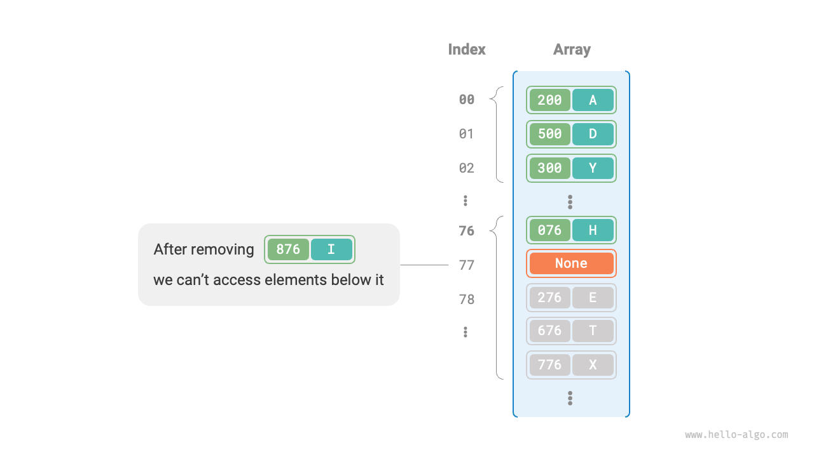

# 6.2 &nbsp; ハッシュ衝突

前節で述べたように、**ほとんどの場合、ハッシュ関数の入力空間は出力空間よりもはるかに大きい**ため、理論的にはハッシュ衝突は避けられません。例えば、入力空間がすべての整数で、出力空間が配列容量のサイズの場合、複数の整数が必然的に同じバケットインデックスにマッピングされます。

ハッシュ衝突は誤ったクエリ結果につながり、ハッシュ表の使いやすさに深刻な影響を与える可能性があります。この問題に対処するために、ハッシュ衝突が発生するたびに、衝突が消えるまでハッシュ表のリサイズを実行します。このアプローチは非常にシンプルで直接的であり、うまく機能します。しかし、テーブルの拡張には大量のデータ移行とハッシュコードの再計算が含まれ、これらは高コストであるため、非常に非効率的に見えます。効率を向上させるために、以下の戦略を採用できます：

1. **ハッシュ衝突が発生した場合でも、ターゲット要素の検索が適切に機能する**ようにハッシュ表のデータ構造を改善する。
2. 深刻な衝突が観察され、必要になる前に、拡張は最後の手段とする。

ハッシュ表の構造を改善する主な方法は2つあります：「連鎖法」と「オープンアドレス法」です。

## 6.2.1 &nbsp; 連鎖法

元のハッシュ表では、各バケットは1つのキー値ペアのみを格納できます。<u>連鎖法</u>は単一の要素を連結リストに変換し、キー値ペアをリストノードとして扱い、衝突するすべてのキー値ペアを同じ連結リストに格納します。下図は連鎖法を使用したハッシュ表の例を示しています。

{ class="animation-figure" }

<p align="center"> 図 6-5 &nbsp; 連鎖法ハッシュ表 </p>

連鎖法で実装されたハッシュ表の操作は以下のように変更されます：

- **要素のクエリ**: `key`を入力し、ハッシュ関数を通してバケットインデックスを取得し、連結リストのヘッドノードにアクセスします。連結リストを走査してキーを比較し、ターゲットキー値ペアを見つけます。
- **要素の追加**: ハッシュ関数を通して連結リストのヘッドノードにアクセスし、ノード（キー値ペア）をリストに追加します。
- **要素の削除**: ハッシュ関数の結果に基づいて連結リストのヘッドにアクセスし、連結リストを走査してターゲットノードを見つけて削除します。

連鎖法には以下の制限があります：

- **空間使用量の増加**: 連結リストにはノードポインタが含まれており、配列よりも多くのメモリ空間を消費します。
- **クエリ効率の低下**: 対応する要素を見つけるために連結リストの線形走査が必要になるためです。

以下のコードは連鎖法ハッシュ表の簡単な実装を提供し、注意すべき2つの点があります：

- 簡単にするために、連結リストの代わりにリスト（動的配列）を使用します。この設定では、ハッシュ表（配列）は複数のバケットを含み、各バケットはリストです。
- この実装にはハッシュ表のリサイズメソッドが含まれています。負荷率が$\frac{2}{3}$を超えると、ハッシュ表を元のサイズの2倍に拡張します。

=== "Python"

    ```python title="hash_map_chaining.py"
    class HashMapChaining:
        """チェーンアドレス法ハッシュテーブル"""

        def __init__(self):
            """コンストラクタ"""
            self.size = 0  # キー値ペアの数
            self.capacity = 4  # ハッシュテーブルの容量
            self.load_thres = 2.0 / 3.0  # 拡張をトリガーする負荷率の閾値
            self.extend_ratio = 2  # 拡張の倍数
            self.buckets = [[] for _ in range(self.capacity)]  # バケット配列

        def hash_func(self, key: int) -> int:
            """ハッシュ関数"""
            return key % self.capacity

        def load_factor(self) -> float:
            """負荷率"""
            return self.size / self.capacity

        def get(self, key: int) -> str | None:
            """照会操作"""
            index = self.hash_func(key)
            bucket = self.buckets[index]
            # バケットを走査し、キーが見つかれば対応する val を返す
            for pair in bucket:
                if pair.key == key:
                    return pair.val
            # キーが見つからない場合、None を返す
            return None

        def put(self, key: int, val: str):
            """追加操作"""
            # 負荷率が閾値を超えた場合、拡張を実行
            if self.load_factor() > self.load_thres:
                self.extend()
            index = self.hash_func(key)
            bucket = self.buckets[index]
            # バケットを走査し、指定されたキーに遭遇した場合、対応する val を更新して返す
            for pair in bucket:
                if pair.key == key:
                    pair.val = val
                    return
            # キーが見つからない場合、キー値ペアを末尾に追加
            pair = Pair(key, val)
            bucket.append(pair)
            self.size += 1

        def remove(self, key: int):
            """削除操作"""
            index = self.hash_func(key)
            bucket = self.buckets[index]
            # バケットを走査し、その中からキー値ペアを削除
            for pair in bucket:
                if pair.key == key:
                    bucket.remove(pair)
                    self.size -= 1
                    break

        def extend(self):
            """ハッシュテーブルを拡張"""
            # 元のハッシュテーブルを一時的に保存
            buckets = self.buckets
            # 拡張された新しいハッシュテーブルを初期化
            self.capacity *= self.extend_ratio
            self.buckets = [[] for _ in range(self.capacity)]
            self.size = 0
            # 元のハッシュテーブルから新しいハッシュテーブルにキー値ペアを移動
            for bucket in buckets:
                for pair in bucket:
                    self.put(pair.key, pair.val)

        def print(self):
            """ハッシュテーブルを出力"""
            for bucket in self.buckets:
                res = []
                for pair in bucket:
                    res.append(str(pair.key) + " -> " + pair.val)
                print(res)
    ```

=== "C++"

    ```cpp title="hash_map_chaining.cpp"
    /* チェイン法ハッシュテーブル */
    class HashMapChaining {
      private:
        int size;                       // キー値ペアの数
        int capacity;                   // ハッシュテーブルの容量
        double loadThres;               // 拡張をトリガーする負荷率の閾値
        int extendRatio;                // 拡張倍率
        vector<vector<Pair *>> buckets; // バケット配列

      public:
        /* コンストラクタ */
        HashMapChaining() : size(0), capacity(4), loadThres(2.0 / 3.0), extendRatio(2) {
            buckets.resize(capacity);
        }

        /* デストラクタ */
        ~HashMapChaining() {
            for (auto &bucket : buckets) {
                for (Pair *pair : bucket) {
                    // メモリを解放
                    delete pair;
                }
            }
        }

        /* ハッシュ関数 */
        int hashFunc(int key) {
            return key % capacity;
        }

        /* 負荷率 */
        double loadFactor() {
            return (double)size / (double)capacity;
        }

        /* クエリ操作 */
        string get(int key) {
            int index = hashFunc(key);
            // バケットを走査、キーが見つかった場合、対応するvalを返却
            for (Pair *pair : buckets[index]) {
                if (pair->key == key) {
                    return pair->val;
                }
            }
            // キーが見つからない場合、空文字列を返却
            return "";
        }

        /* 追加操作 */
        void put(int key, string val) {
            // 負荷率が閾値を超えた場合、拡張を実行
            if (loadFactor() > loadThres) {
                extend();
            }
            int index = hashFunc(key);
            // バケットを走査、指定キーに遭遇した場合、対応するvalを更新して返却
            for (Pair *pair : buckets[index]) {
                if (pair->key == key) {
                    pair->val = val;
                    return;
                }
            }
            // キーが見つからない場合、キー値ペアを末尾に追加
            buckets[index].push_back(new Pair(key, val));
            size++;
        }

        /* 削除操作 */
        void remove(int key) {
            int index = hashFunc(key);
            auto &bucket = buckets[index];
            // バケットを走査、キー値ペアを削除
            for (int i = 0; i < bucket.size(); i++) {
                if (bucket[i]->key == key) {
                    Pair *tmp = bucket[i];
                    bucket.erase(bucket.begin() + i); // キー値ペアを削除
                    delete tmp;                       // メモリを解放
                    size--;
                    return;
                }
            }
        }

        /* ハッシュテーブルを拡張 */
        void extend() {
            // 元のハッシュテーブルを一時保存
            vector<vector<Pair *>> bucketsTmp = buckets;
            // 拡張された新しいハッシュテーブルを初期化
            capacity *= extendRatio;
            buckets.clear();
            buckets.resize(capacity);
            size = 0;
            // 元のハッシュテーブルから新しいハッシュテーブルにキー値ペアを移動
            for (auto &bucket : bucketsTmp) {
                for (Pair *pair : bucket) {
                    put(pair->key, pair->val);
                    // メモリを解放
                    delete pair;
                }
            }
        }

        /* ハッシュテーブルを印刷 */
        void print() {
            for (auto &bucket : buckets) {
                cout << "[";
                for (Pair *pair : bucket) {
                    cout << pair->key << " -> " << pair->val << ", ";
                }
                cout << "]\n";
            }
        }
    };
    ```

=== "Java"

    ```java title="hash_map_chaining.java"
    /* チェイン法ハッシュテーブル */
    class HashMapChaining {
        int size; // キー値ペアの数
        int capacity; // ハッシュテーブルの容量
        double loadThres; // 拡張をトリガーする負荷率の閾値
        int extendRatio; // 拡張倍率
        List<List<Pair>> buckets; // バケット配列

        /* コンストラクタ */
        public HashMapChaining() {
            size = 0;
            capacity = 4;
            loadThres = 2.0 / 3.0;
            extendRatio = 2;
            buckets = new ArrayList<>(capacity);
            for (int i = 0; i < capacity; i++) {
                buckets.add(new ArrayList<>());
            }
        }

        /* ハッシュ関数 */
        int hashFunc(int key) {
            return key % capacity;
        }

        /* 負荷率 */
        double loadFactor() {
            return (double) size / capacity;
        }

        /* クエリ操作 */
        String get(int key) {
            int index = hashFunc(key);
            List<Pair> bucket = buckets.get(index);
            // バケットを走査、キーが見つかった場合対応するvalを返す
            for (Pair pair : bucket) {
                if (pair.key == key) {
                    return pair.val;
                }
            }
            // キーが見つからない場合、nullを返す
            return null;
        }

        /* 追加操作 */
        void put(int key, String val) {
            // 負荷率が閾値を超えた場合、拡張を実行
            if (loadFactor() > loadThres) {
                extend();
            }
            int index = hashFunc(key);
            List<Pair> bucket = buckets.get(index);
            // バケットを走査、指定したキーに遭遇した場合、対応するvalを更新して戻る
            for (Pair pair : bucket) {
                if (pair.key == key) {
                    pair.val = val;
                    return;
                }
            }
            // キーが見つからない場合、キー値ペアを末尾に追加
            Pair pair = new Pair(key, val);
            bucket.add(pair);
            size++;
        }

        /* 削除操作 */
        void remove(int key) {
            int index = hashFunc(key);
            List<Pair> bucket = buckets.get(index);
            // バケットを走査、その中からキー値ペアを削除
            for (Pair pair : bucket) {
                if (pair.key == key) {
                    bucket.remove(pair);
                    size--;
                    break;
                }
            }
        }

        /* ハッシュテーブルを拡張 */
        void extend() {
            // 元のハッシュテーブルを一時的に保存
            List<List<Pair>> bucketsTmp = buckets;
            // 拡張された新しいハッシュテーブルを初期化
            capacity *= extendRatio;
            buckets = new ArrayList<>(capacity);
            for (int i = 0; i < capacity; i++) {
                buckets.add(new ArrayList<>());
            }
            size = 0;
            // 元のハッシュテーブルから新しいハッシュテーブルにキー値ペアを移動
            for (List<Pair> bucket : bucketsTmp) {
                for (Pair pair : bucket) {
                    put(pair.key, pair.val);
                }
            }
        }

        /* ハッシュテーブルを印刷 */
        void print() {
            for (List<Pair> bucket : buckets) {
                List<String> res = new ArrayList<>();
                for (Pair pair : bucket) {
                    res.add(pair.key + " -> " + pair.val);
                }
                System.out.println(res);
            }
        }
    }
    ```

=== "C#"

    ```csharp title="hash_map_chaining.cs"
    [class]{HashMapChaining}-[func]{}
    ```

=== "Go"

    ```go title="hash_map_chaining.go"
    [class]{hashMapChaining}-[func]{}
    ```

=== "Swift"

    ```swift title="hash_map_chaining.swift"
    [class]{HashMapChaining}-[func]{}
    ```

=== "JS"

    ```javascript title="hash_map_chaining.js"
    [class]{HashMapChaining}-[func]{}
    ```

=== "TS"

    ```typescript title="hash_map_chaining.ts"
    [class]{HashMapChaining}-[func]{}
    ```

=== "Dart"

    ```dart title="hash_map_chaining.dart"
    [class]{HashMapChaining}-[func]{}
    ```

=== "Rust"

    ```rust title="hash_map_chaining.rs"
    [class]{HashMapChaining}-[func]{}
    ```

=== "C"

    ```c title="hash_map_chaining.c"
    [class]{Node}-[func]{}

    [class]{HashMapChaining}-[func]{}
    ```

=== "Kotlin"

    ```kotlin title="hash_map_chaining.kt"
    [class]{HashMapChaining}-[func]{}
    ```

=== "Ruby"

    ```ruby title="hash_map_chaining.rb"
    [class]{HashMapChaining}-[func]{}
    ```

連結リストが非常に長い場合、クエリ効率$O(n)$が悪いことは注目に値します。**この場合、リストを「AVL木」または「赤黒木」に変換して**、クエリ操作の時間計算量を$O(\log n)$に最適化できます。

## 6.2.2 &nbsp; オープンアドレス法

<u>オープンアドレス法</u>は追加のデータ構造を導入せず、代わりに「複数回プローブ」を通してハッシュ衝突を処理します。プローブ方法には主に線形プローブ、二次プローブ、二重ハッシュがあります。

線形プローブを例にして、オープンアドレス法ハッシュ表のメカニズムを紹介しましょう。

### 1. &nbsp; 線形プローブ

線形プローブは固定ステップの線形検索をプローブに使用し、通常のハッシュ表とは異なります。

- **要素の挿入**: ハッシュ関数を使用してバケットインデックスを計算します。バケットに既に要素が含まれている場合、衝突位置から線形に前方に走査し（通常ステップサイズは$1$）、空のバケットが見つかるまで進み、要素を挿入します。
- **要素の検索**: ハッシュ衝突に遭遇した場合、同じステップサイズを使用して線形に前方に走査し、対応する要素が見つかったら`value`を返します。空のバケットに遭遇した場合、ターゲット要素がハッシュ表にないことを意味するため、`None`を返します。

下図はオープンアドレス法（線形プローブ）ハッシュ表におけるキー値ペアの分布を示しています。このハッシュ関数によると、下二桁が同じキーは同じバケットにマッピングされます。線形プローブを通して、それらはそのバケットとその下のバケットに順次格納されます。

{ class="animation-figure" }

<p align="center"> 図 6-6 &nbsp; オープンアドレス法（線形プローブ）ハッシュ表におけるキー値ペアの分布 </p>

しかし、**線形プローブは「クラスタリング」を作りやすい傾向があります**。具体的には、配列内の連続的に占有された位置が長いほど、これらの連続した位置でハッシュ衝突が発生する確率が高くなり、その位置でのクラスタリングの成長をさらに促進し、悪循環を形成し、最終的に挿入、削除、クエリ、更新操作の効率低下につながります。

**オープンアドレス法ハッシュ表では要素を直接削除できない**ことに注意することが重要です。要素を削除すると、配列に空のバケット`None`が作成されます。要素を検索する際、線形プローブがこの空のバケットに遭遇すると戻ってしまい、このバケットの下の要素にアクセスできなくなります。プログラムはこれらの要素が存在しないと誤って仮定する可能性があります。下図に示すとおりです。

{ class="animation-figure" }

<p align="center"> 図 6-7 &nbsp; オープンアドレス法での削除によるクエリ問題 </p>

この問題を解決するために、<u>遅延削除</u>メカニズムを採用できます：ハッシュ表から要素を直接削除する代わりに、**定数`TOMBSTONE`を使用してバケットをマークします**。このメカニズムでは、`None`と`TOMBSTONE`の両方が空のバケットを表し、キー値ペアを保持できます。ただし、線形プローブが`TOMBSTONE`に遭遇した場合、その下にまだキー値ペアがある可能性があるため、走査を続ける必要があります。

しかし、**遅延削除はハッシュ表の性能劣化を加速する可能性があります**。削除操作のたびに削除マークが生成され、`TOMBSTONE`が増加すると、線形プローブがターゲット要素を見つけるために複数の`TOMBSTONE`をスキップする必要がある可能性があるため、検索時間も増加します。

これに対処するために、線形プローブ中に最初に遭遇した`TOMBSTONE`のインデックスを記録し、検索されたターゲット要素とその`TOMBSTONE`の位置を交換することを検討してください。これを行う利点は、要素がクエリまたは追加されるたびに、要素がその理想的な位置（プローブの開始点）により近いバケットに移動され、クエリ効率が最適化されることです。

以下のコードは、遅延削除を使用したオープンアドレス法（線形プローブ）ハッシュ表を実装しています。ハッシュ表の空間をより有効に活用するために、ハッシュ表を「循環配列」として扱います。配列の終わりを超えると、最初に戻って走査を続けます。

=== "Python"

    ```python title="hash_map_open_addressing.py"
    class HashMapOpenAddressing:
        """オープンアドレス法ハッシュテーブル"""

        def __init__(self):
            """コンストラクタ"""
            self.size = 0  # キー値ペアの数
            self.capacity = 4  # ハッシュテーブルの容量
            self.load_thres = 2.0 / 3.0  # 拡張をトリガーする負荷率の閾値
            self.extend_ratio = 2  # 拡張の倍数
            self.buckets: list[Pair | None] = [None] * self.capacity  # バケット配列
            self.TOMBSTONE = Pair(-1, "-1")  # 削除マーク

        def hash_func(self, key: int) -> int:
            """ハッシュ関数"""
            return key % self.capacity

        def load_factor(self) -> float:
            """負荷率"""
            return self.size / self.capacity

        def find_bucket(self, key: int) -> int:
            """key に対応するバケットインデックスを検索"""
            index = self.hash_func(key)
            first_tombstone = -1
            # 線形探査、空のバケットに遭遇したらブレーク
            while self.buckets[index] is not None:
                # キーに遭遇した場合、対応するバケットインデックスを返す
                if self.buckets[index].key == key:
                    # 削除マークが以前に遭遇していた場合、キー値ペアをそのインデックスに移動
                    if first_tombstone != -1:
                        self.buckets[first_tombstone] = self.buckets[index]
                        self.buckets[index] = self.TOMBSTONE
                        return first_tombstone  # 移動されたバケットインデックスを返す
                    return index  # バケットインデックスを返す
                # 最初に遭遇した削除マークを記録
                if first_tombstone == -1 and self.buckets[index] is self.TOMBSTONE:
                    first_tombstone = index
                # バケットインデックスを計算、末尾を超えた場合は先頭に戻る
                index = (index + 1) % self.capacity
            # キーが存在しない場合、挿入ポイントのインデックスを返す
            return index if first_tombstone == -1 else first_tombstone

        def get(self, key: int) -> str:
            """照会操作"""
            # key に対応するバケットインデックスを検索
            index = self.find_bucket(key)
            # キー値ペアが見つかれば、対応する val を返す
            if self.buckets[index] not in [None, self.TOMBSTONE]:
                return self.buckets[index].val
            # キー値ペアが存在しない場合、None を返す
            return None

        def put(self, key: int, val: str):
            """追加操作"""
            # 負荷率が閾値を超えた場合、拡張を実行
            if self.load_factor() > self.load_thres:
                self.extend()
            # key に対応するバケットインデックスを検索
            index = self.find_bucket(key)
            # キー値ペアが見つかれば、val を上書きして返す
            if self.buckets[index] not in [None, self.TOMBSTONE]:
                self.buckets[index].val = val
                return
            # キー値ペアが存在しない場合、キー値ペアを追加
            self.buckets[index] = Pair(key, val)
            self.size += 1

        def remove(self, key: int):
            """削除操作"""
            # key に対応するバケットインデックスを検索
            index = self.find_bucket(key)
            # キー値ペアが見つかれば、削除マークで覆う
            if self.buckets[index] not in [None, self.TOMBSTONE]:
                self.buckets[index] = self.TOMBSTONE
                self.size -= 1

        def extend(self):
            """ハッシュテーブルを拡張"""
            # 元のハッシュテーブルを一時的に保存
            buckets_tmp = self.buckets
            # 拡張された新しいハッシュテーブルを初期化
            self.capacity *= self.extend_ratio
            self.buckets = [None] * self.capacity
            self.size = 0
            # 元のハッシュテーブルから新しいハッシュテーブルにキー値ペアを移動
            for pair in buckets_tmp:
                if pair not in [None, self.TOMBSTONE]:
                    self.put(pair.key, pair.val)

        def print(self):
            """ハッシュテーブルを出力"""
            for pair in self.buckets:
                if pair is None:
                    print("None")
                elif pair is self.TOMBSTONE:
                    print("TOMBSTONE")
                else:
                    print(pair.key, "->", pair.val)
    ```

=== "C++"

    ```cpp title="hash_map_open_addressing.cpp"
    /* オープンアドレス法ハッシュテーブル */
    class HashMapOpenAddressing {
      private:
        int size;                             // キー値ペアの数
        int capacity = 4;                     // ハッシュテーブルの容量
        const double loadThres = 2.0 / 3.0;     // 拡張をトリガーする負荷率の閾値
        const int extendRatio = 2;            // 拡張倍率
        vector<Pair *> buckets;               // バケット配列
        Pair *TOMBSTONE = new Pair(-1, "-1"); // 削除マーク

      public:
        /* コンストラクタ */
        HashMapOpenAddressing() : size(0), buckets(capacity, nullptr) {
        }

        /* デストラクタ */
        ~HashMapOpenAddressing() {
            for (Pair *pair : buckets) {
                if (pair != nullptr && pair != TOMBSTONE) {
                    delete pair;
                }
            }
            delete TOMBSTONE;
        }

        /* ハッシュ関数 */
        int hashFunc(int key) {
            return key % capacity;
        }

        /* 負荷率 */
        double loadFactor() {
            return (double)size / capacity;
        }

        /* keyに対応するバケットインデックスを検索 */
        int findBucket(int key) {
            int index = hashFunc(key);
            int firstTombstone = -1;
            // 線形探査、空のバケットに遭遇したら中断
            while (buckets[index] != nullptr) {
                // keyに遭遇した場合、対応するバケットインデックスを返却
                if (buckets[index]->key == key) {
                    // 以前に削除マークに遭遇していた場合、キー値ペアをそのインデックスに移動
                    if (firstTombstone != -1) {
                        buckets[firstTombstone] = buckets[index];
                        buckets[index] = TOMBSTONE;
                        return firstTombstone; // 移動されたバケットインデックスを返却
                    }
                    return index; // バケットインデックスを返却
                }
                // 最初に遭遇した削除マークを記録
                if (firstTombstone == -1 && buckets[index] == TOMBSTONE) {
                    firstTombstone = index;
                }
                // バケットインデックスを計算、末尾を超えた場合は先頭に戻る
                index = (index + 1) % capacity;
            }
            // keyが存在しない場合、挿入ポイントのインデックスを返却
            return firstTombstone == -1 ? index : firstTombstone;
        }

        /* クエリ操作 */
        string get(int key) {
            // keyに対応するバケットインデックスを検索
            int index = findBucket(key);
            // キー値ペアが見つかった場合、対応するvalを返却
            if (buckets[index] != nullptr && buckets[index] != TOMBSTONE) {
                return buckets[index]->val;
            }
            // キー値ペアが存在しない場合、空文字列を返却
            return "";
        }

        /* 追加操作 */
        void put(int key, string val) {
            // 負荷率が閾値を超えた場合、拡張を実行
            if (loadFactor() > loadThres) {
                extend();
            }
            // keyに対応するバケットインデックスを検索
            int index = findBucket(key);
            // キー値ペアが見つかった場合、valを上書きして返却
            if (buckets[index] != nullptr && buckets[index] != TOMBSTONE) {
                buckets[index]->val = val;
                return;
            }
            // キー値ペアが存在しない場合、キー値ペアを追加
            buckets[index] = new Pair(key, val);
            size++;
        }

        /* 削除操作 */
        void remove(int key) {
            // keyに対応するバケットインデックスを検索
            int index = findBucket(key);
            // キー値ペアが見つかった場合、削除マークで覆う
            if (buckets[index] != nullptr && buckets[index] != TOMBSTONE) {
                delete buckets[index];
                buckets[index] = TOMBSTONE;
                size--;
            }
        }

        /* ハッシュテーブルを拡張 */
        void extend() {
            // 元のハッシュテーブルを一時保存
            vector<Pair *> bucketsTmp = buckets;
            // 拡張された新しいハッシュテーブルを初期化
            capacity *= extendRatio;
            buckets = vector<Pair *>(capacity, nullptr);
            size = 0;
            // 元のハッシュテーブルから新しいハッシュテーブルにキー値ペアを移動
            for (Pair *pair : bucketsTmp) {
                if (pair != nullptr && pair != TOMBSTONE) {
                    put(pair->key, pair->val);
                    delete pair;
                }
            }
        }

        /* ハッシュテーブルを印刷 */
        void print() {
            for (Pair *pair : buckets) {
                if (pair == nullptr) {
                    cout << "nullptr" << endl;
                } else if (pair == TOMBSTONE) {
                    cout << "TOMBSTONE" << endl;
                } else {
                    cout << pair->key << " -> " << pair->val << endl;
                }
            }
        }
    };
    ```

=== "Java"

    ```java title="hash_map_open_addressing.java"
    /* オープンアドレス法ハッシュテーブル */
    class HashMapOpenAddressing {
        private int size; // キー値ペアの数
        private int capacity = 4; // ハッシュテーブルの容量
        private final double loadThres = 2.0 / 3.0; // 拡張をトリガーする負荷率の閾値
        private final int extendRatio = 2; // 拡張倍率
        private Pair[] buckets; // バケット配列
        private final Pair TOMBSTONE = new Pair(-1, "-1"); // 削除マーク

        /* コンストラクタ */
        public HashMapOpenAddressing() {
            size = 0;
            buckets = new Pair[capacity];
        }

        /* ハッシュ関数 */
        private int hashFunc(int key) {
            return key % capacity;
        }

        /* 負荷率 */
        private double loadFactor() {
            return (double) size / capacity;
        }

        /* keyに対応するバケットインデックスを検索 */
        private int findBucket(int key) {
            int index = hashFunc(key);
            int firstTombstone = -1;
            // 線形探査、空のバケットに遭遇したら終了
            while (buckets[index] != null) {
                // keyに遭遇した場合、対応するバケットインデックスを返す
                if (buckets[index].key == key) {
                    // 以前に削除マークに遭遇していた場合、キー値ペアをそのインデックスに移動
                    if (firstTombstone != -1) {
                        buckets[firstTombstone] = buckets[index];
                        buckets[index] = TOMBSTONE;
                        return firstTombstone; // 移動後のバケットインデックスを返す
                    }
                    return index; // バケットインデックスを返す
                }
                // 最初に遭遇した削除マークを記録
                if (firstTombstone == -1 && buckets[index] == TOMBSTONE) {
                    firstTombstone = index;
                }
                // バケットインデックスを計算、末尾を超えた場合は先頭に戻る
                index = (index + 1) % capacity;
            }
            // keyが存在しない場合、挿入ポイントのインデックスを返す
            return firstTombstone == -1 ? index : firstTombstone;
        }

        /* クエリ操作 */
        public String get(int key) {
            // keyに対応するバケットインデックスを検索
            int index = findBucket(key);
            // キー値ペアが見つかった場合、対応するvalを返す
            if (buckets[index] != null && buckets[index] != TOMBSTONE) {
                return buckets[index].val;
            }
            // キー値ペアが存在しない場合、nullを返す
            return null;
        }

        /* 追加操作 */
        public void put(int key, String val) {
            // 負荷率が閾値を超えた場合、拡張を実行
            if (loadFactor() > loadThres) {
                extend();
            }
            // keyに対応するバケットインデックスを検索
            int index = findBucket(key);
            // キー値ペアが見つかった場合、valを上書きして戻る
            if (buckets[index] != null && buckets[index] != TOMBSTONE) {
                buckets[index].val = val;
                return;
            }
            // キー値ペアが存在しない場合、キー値ペアを追加
            buckets[index] = new Pair(key, val);
            size++;
        }

        /* 削除操作 */
        public void remove(int key) {
            // keyに対応するバケットインデックスを検索
            int index = findBucket(key);
            // キー値ペアが見つかった場合、削除マークで覆う
            if (buckets[index] != null && buckets[index] != TOMBSTONE) {
                buckets[index] = TOMBSTONE;
                size--;
            }
        }

        /* ハッシュテーブルを拡張 */
        private void extend() {
            // 元のハッシュテーブルを一時的に保存
            Pair[] bucketsTmp = buckets;
            // 拡張された新しいハッシュテーブルを初期化
            capacity *= extendRatio;
            buckets = new Pair[capacity];
            size = 0;
            // 元のハッシュテーブルから新しいハッシュテーブルにキー値ペアを移動
            for (Pair pair : bucketsTmp) {
                if (pair != null && pair != TOMBSTONE) {
                    put(pair.key, pair.val);
                }
            }
        }

        /* ハッシュテーブルを印刷 */
        public void print() {
            for (Pair pair : buckets) {
                if (pair == null) {
                    System.out.println("null");
                } else if (pair == TOMBSTONE) {
                    System.out.println("TOMBSTONE");
                } else {
                    System.out.println(pair.key + " -> " + pair.val);
                }
            }
        }
    }
    ```

=== "C#"

    ```csharp title="hash_map_open_addressing.cs"
    [class]{HashMapOpenAddressing}-[func]{}
    ```

=== "Go"

    ```go title="hash_map_open_addressing.go"
    [class]{hashMapOpenAddressing}-[func]{}
    ```

=== "Swift"

    ```swift title="hash_map_open_addressing.swift"
    [class]{HashMapOpenAddressing}-[func]{}
    ```

=== "JS"

    ```javascript title="hash_map_open_addressing.js"
    [class]{HashMapOpenAddressing}-[func]{}
    ```

=== "TS"

    ```typescript title="hash_map_open_addressing.ts"
    [class]{HashMapOpenAddressing}-[func]{}
    ```

=== "Dart"

    ```dart title="hash_map_open_addressing.dart"
    [class]{HashMapOpenAddressing}-[func]{}
    ```

=== "Rust"

    ```rust title="hash_map_open_addressing.rs"
    [class]{HashMapOpenAddressing}-[func]{}
    ```

=== "C"

    ```c title="hash_map_open_addressing.c"
    [class]{HashMapOpenAddressing}-[func]{}
    ```

=== "Kotlin"

    ```kotlin title="hash_map_open_addressing.kt"
    [class]{HashMapOpenAddressing}-[func]{}
    ```

=== "Ruby"

    ```ruby title="hash_map_open_addressing.rb"
    [class]{HashMapOpenAddressing}-[func]{}
    ```

### 2. &nbsp; 二次プローブ

二次プローブは線形プローブに似ており、オープンアドレス法の一般的な戦略の1つです。衝突が発生した場合、二次プローブは単純に固定ステップ数をスキップするのではなく、「プローブ回数の二乗」に等しいステップ数、つまり$1, 4, 9, \dots$ステップをスキップします。

二次プローブには以下の利点があります：

- 二次プローブは、プローブ回数の二乗の距離をスキップすることで、線形プローブのクラスタリング効果を軽減しようとします。
- 二次プローブはより大きな距離をスキップして空の位置を見つけ、データをより均等に分散するのに役立ちます。

しかし、二次プローブは完璧ではありません：

- クラスタリングは依然として存在し、つまり一部の位置は他の位置よりも占有される可能性が高いです。
- 二乗の成長により、二次プローブはハッシュ表全体をプローブできない可能性があり、ハッシュ表に空のバケットがあっても、二次プローブがアクセスできない可能性があります。

### 3. &nbsp; 二重ハッシュ

名前が示すように、二重ハッシュ法は複数のハッシュ関数$f_1(x)$、$f_2(x)$、$f_3(x)$、$\dots$をプローブに使用します。

- **要素の挿入**: ハッシュ関数$f_1(x)$が衝突に遭遇した場合、$f_2(x)$を試し、以下同様に、空の位置が見つかって要素が挿入されるまで続けます。
- **要素の検索**: 同じハッシュ関数の順序で検索し、ターゲット要素が見つかって返されるまで、または空の位置に遭遇するかすべてのハッシュ関数が試されるまで続け、要素がハッシュ表にないことを示し、`None`を返します。

線形プローブと比較して、二重ハッシュ法はクラスタリングが起こりにくいですが、複数のハッシュ関数は追加の計算オーバーヘッドを導入します。

!!! tip

    オープンアドレス法（線形プローブ、二次プローブ、二重ハッシュ）ハッシュ表はすべて「要素を直接削除できない」という問題があることに注意してください。

## 6.2.3 &nbsp; プログラミング言語の選択

異なるプログラミング言語は異なるハッシュ表実装戦略を採用しています。以下にいくつかの例を示します：

- Pythonはオープンアドレス法を使用します。`dict`辞書はプローブに疑似乱数を使用します。
- Javaは連鎖法を使用します。JDK 1.8以降、`HashMap`の配列長が64に達し、連結リストの長さが8に達すると、連結リストは検索性能を向上させるために赤黒木に変換されます。
- Goは連鎖法を使用します。Goは各バケットが最大8つのキー値ペアを格納できることを規定し、容量を超えた場合はオーバーフローバケットが連結されます。オーバーフローバケットが多すぎる場合、性能を確保するために特別な等容量リサイズ操作が実行されます。
