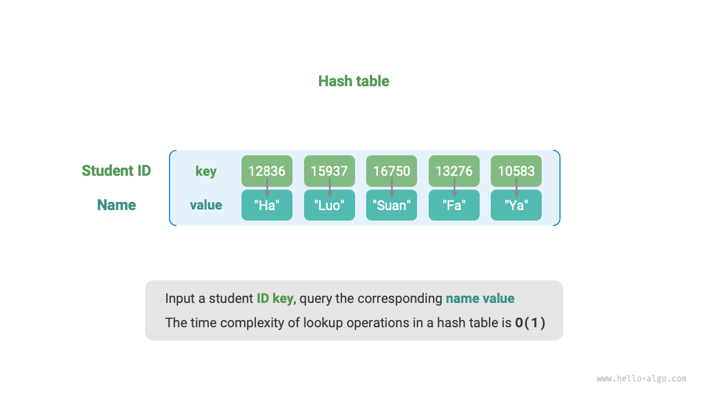
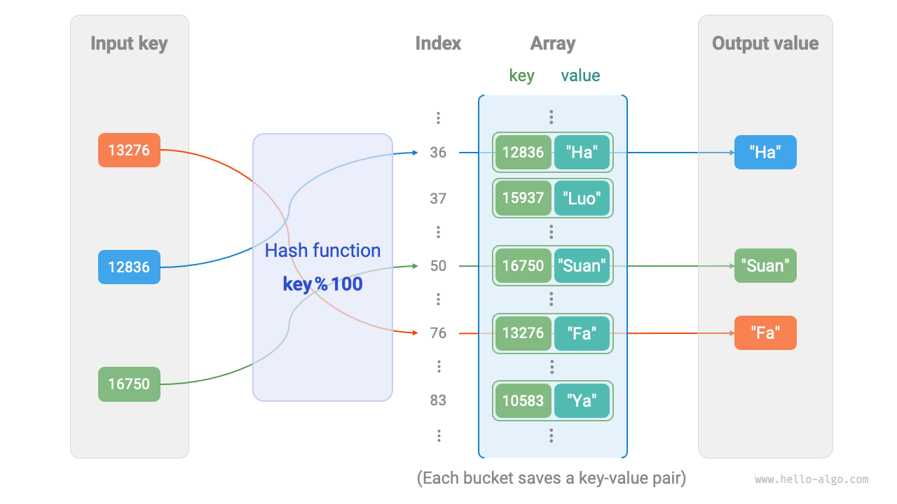
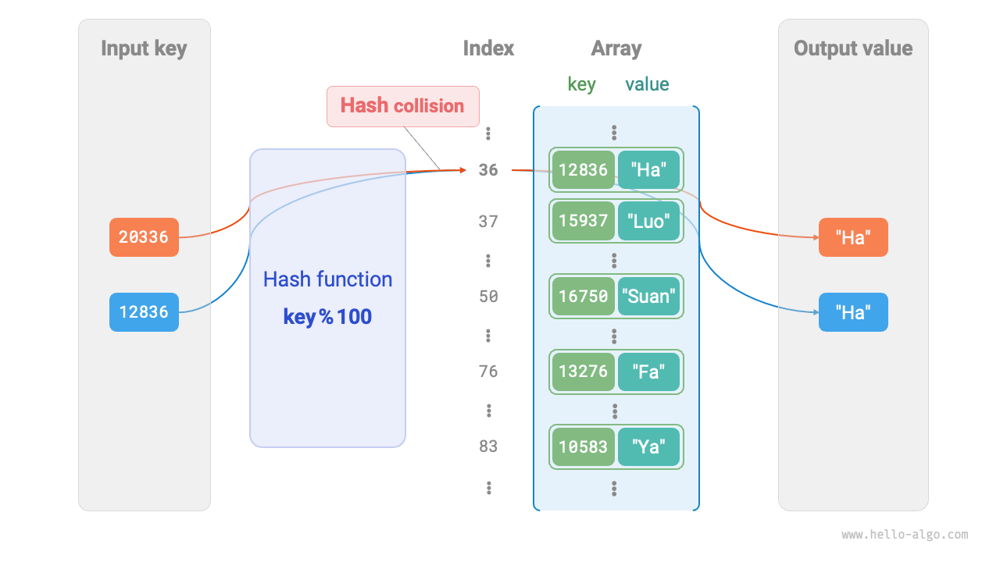
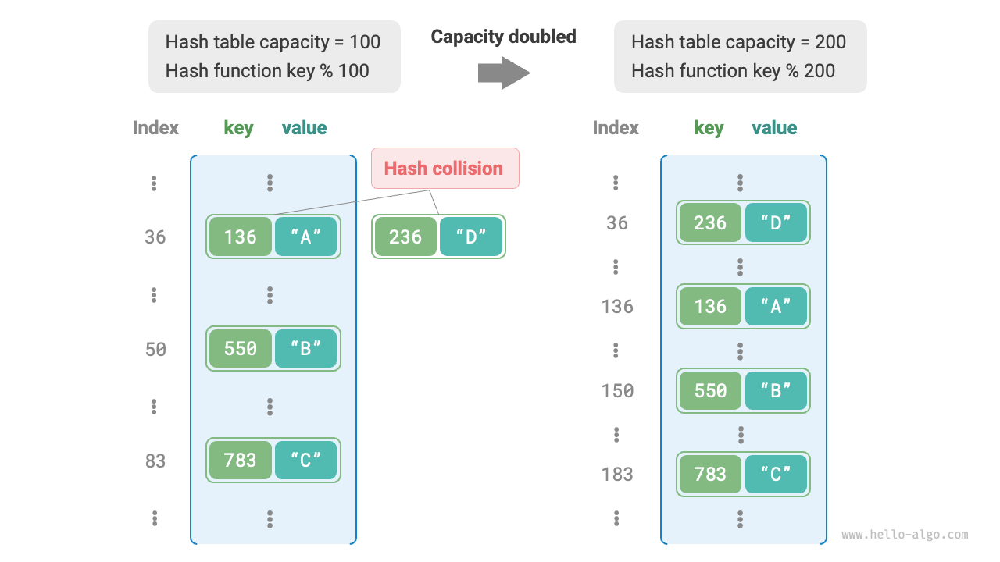

# ハッシュ表

<u>ハッシュ表</u>は<u>ハッシュマップ</u>とも呼ばれ、キーと値の間のマッピングを確立し、効率的な要素の取得を可能にするデータ構造です。具体的には、ハッシュ表に`key`を入力すると、$O(1)$の時間計算量で対応する`value`を取得できます。

下図に示すように、$n$人の学生がいて、各学生には「名前」と「学籍番号」の2つのデータフィールドがあるとします。学籍番号を入力として対応する名前を返すクエリ機能を実装したい場合、下図に示すハッシュ表を使用できます。



ハッシュ表に加えて、配列や連結リストもクエリ機能の実装に使用できますが、時間計算量が異なります。効率は以下の表で比較されています：

- **要素の挿入**: 配列（または連結リスト）の末尾に要素を追加するだけです。この操作の時間計算量は$O(1)$です。
- **要素の検索**: 配列（または連結リスト）がソートされていないため、要素を検索するにはすべての要素を走査する必要があります。この操作の時間計算量は$O(n)$です。
- **要素の削除**: 要素を削除するには、まずその要素を見つけてから、配列（または連結リスト）から削除します。この操作の時間計算量は$O(n)$です。

<p align="center"> 表 <id> &nbsp; 一般的な操作の時間効率の比較 </p>

|                | 配列     | 連結リスト   | ハッシュ表   |
| -------------- | ------ | ----------- | ---------- |
| 要素の検索        | $O(n)$ | $O(n)$      | $O(1)$     |
| 要素の挿入        | $O(1)$ | $O(1)$      | $O(1)$     |
| 要素の削除        | $O(n)$ | $O(n)$      | $O(1)$     |

観察されるように、**ハッシュ表における操作（挿入、削除、検索、変更）の時間計算量は$O(1)$**で、非常に効率的です。

## ハッシュ表の一般的な操作

ハッシュ表の一般的な操作には、初期化、クエリ、キー値ペアの追加、キー値ペアの削除があります。以下はコード例です：

=== "Python"

    ```python title="hash_map.py"
    # ハッシュ表を初期化
    hmap: dict = {}

    # 追加操作
    # ハッシュ表にキー値ペア (key, value) を追加
    hmap[12836] = "小哈"
    hmap[15937] = "小啰"
    hmap[16750] = "小算"
    hmap[13276] = "小法"
    hmap[10583] = "小鸭"

    # クエリ操作
    # ハッシュ表にキーを入力し、値を取得
    name: str = hmap[15937]

    # 削除操作
    # ハッシュ表からキー値ペア (key, value) を削除
    hmap.pop(10583)
    ```

=== "C++"

    ```cpp title="hash_map.cpp"
    /* ハッシュ表を初期化 */
    unordered_map<int, string> map;

    /* 追加操作 */
    // ハッシュ表にキー値ペア (key, value) を追加
    map[12836] = "小哈";
    map[15937] = "小啰";
    map[16750] = "小算";
    map[13276] = "小法";
    map[10583] = "小鸭";

    /* クエリ操作 */
    // ハッシュ表にキーを入力し、値を取得
    string name = map[15937];

    /* 削除操作 */
    // ハッシュ表からキー値ペア (key, value) を削除
    map.erase(10583);
    ```

=== "Java"

    ```java title="hash_map.java"
    /* ハッシュ表を初期化 */
    Map<Integer, String> map = new HashMap<>();

    /* 追加操作 */
    // ハッシュ表にキー値ペア (key, value) を追加
    map.put(12836, "小哈");
    map.put(15937, "小啰");
    map.put(16750, "小算");
    map.put(13276, "小法");
    map.put(10583, "小鸭");

    /* クエリ操作 */
    // ハッシュ表にキーを入力し、値を取得
    String name = map.get(15937);

    /* 削除操作 */
    // ハッシュ表からキー値ペア (key, value) を削除
    map.remove(10583);
    ```

=== "C#"

    ```csharp title="hash_map.cs"
    /* ハッシュ表を初期化 */
    Dictionary<int, string> map = new() {
        /* 追加操作 */
        // ハッシュ表にキー値ペア (key, value) を追加
        { 12836, "小哈" },
        { 15937, "小啰" },
        { 16750, "小算" },
        { 13276, "小法" },
        { 10583, "小鸭" }
    };

    /* クエリ操作 */
    // ハッシュ表にキーを入力し、値を取得
    string name = map[15937];

    /* 削除操作 */
    // ハッシュ表からキー値ペア (key, value) を削除
    map.Remove(10583);
    ```

=== "Go"

    ```go title="hash_map_test.go"
    /* ハッシュ表を初期化 */
    hmap := make(map[int]string)

    /* 追加操作 */
    // ハッシュ表にキー値ペア (key, value) を追加
    hmap[12836] = "小哈"
    hmap[15937] = "小啰"
    hmap[16750] = "小算"
    hmap[13276] = "小法"
    hmap[10583] = "小鸭"

    /* クエリ操作 */
    // ハッシュ表にキーを入力し、値を取得
    name := hmap[15937]

    /* 削除操作 */
    // ハッシュ表からキー値ペア (key, value) を削除
    delete(hmap, 10583)
    ```

=== "Swift"

    ```swift title="hash_map.swift"
    /* ハッシュ表を初期化 */
    var map: [Int: String] = [:]

    /* 追加操作 */
    // ハッシュ表にキー値ペア (key, value) を追加
    map[12836] = "小哈"
    map[15937] = "小啰"
    map[16750] = "小算"
    map[13276] = "小法"
    map[10583] = "小鸭"

    /* クエリ操作 */
    // ハッシュ表にキーを入力し、値を取得
    let name = map[15937]!

    /* 削除操作 */
    // ハッシュ表からキー値ペア (key, value) を削除
    map.removeValue(forKey: 10583)
    ```

=== "JS"

    ```javascript title="hash_map.js"
    /* ハッシュ表を初期化 */
    const map = new Map();
    /* 追加操作 */
    // ハッシュ表にキー値ペア (key, value) を追加
    map.set(12836, '小哈');
    map.set(15937, '小啰');
    map.set(16750, '小算');
    map.set(13276, '小法');
    map.set(10583, '小鸭');

    /* クエリ操作 */
    // ハッシュ表にキーを入力し、値を取得
    let name = map.get(15937);

    /* 削除操作 */
    // ハッシュ表からキー値ペア (key, value) を削除
    map.delete(10583);
    ```

=== "TS"

    ```typescript title="hash_map.ts"
    /* ハッシュ表を初期化 */
    const map = new Map<number, string>();
    /* 追加操作 */
    // ハッシュ表にキー値ペア (key, value) を追加
    map.set(12836, '小哈');
    map.set(15937, '小啰');
    map.set(16750, '小算');
    map.set(13276, '小法');
    map.set(10583, '小鸭');
    console.info('\n追加後、ハッシュ表は\nKey -> Value');
    console.info(map);

    /* クエリ操作 */
    // ハッシュ表にキーを入力し、値を取得
    let name = map.get(15937);
    console.info('\n学籍番号15937を入力、名前を問い合わせ ' + name);

    /* 削除操作 */
    // ハッシュ表からキー値ペア (key, value) を削除
    map.delete(10583);
    console.info('\n10583を削除後、ハッシュ表は\nKey -> Value');
    console.info(map);
    ```

=== "Dart"

    ```dart title="hash_map.dart"
    /* ハッシュ表を初期化 */
    Map<int, String> map = {};

    /* 追加操作 */
    // ハッシュ表にキー値ペア (key, value) を追加
    map[12836] = "小哈";
    map[15937] = "小啰";
    map[16750] = "小算";
    map[13276] = "小法";
    map[10583] = "小鸭";

    /* クエリ操作 */
    // ハッシュ表にキーを入力し、値を取得
    String name = map[15937];

    /* 削除操作 */
    // ハッシュ表からキー値ペア (key, value) を削除
    map.remove(10583);
    ```

=== "Rust"

    ```rust title="hash_map.rs"
    use std::collections::HashMap;

    /* ハッシュ表を初期化 */
    let mut map: HashMap<i32, String> = HashMap::new();

    /* 追加操作 */
    // ハッシュ表にキー値ペア (key, value) を追加
    map.insert(12836, "小哈".to_string());
    map.insert(15937, "小啰".to_string());
    map.insert(16750, "小算".to_string());
    map.insert(13279, "小法".to_string());
    map.insert(10583, "小鸭".to_string());

    /* クエリ操作 */
    // ハッシュ表にキーを入力し、値を取得
    let _name: Option<&String> = map.get(&15937);

    /* 削除操作 */
    // ハッシュ表からキー値ペア (key, value) を削除
    let _removed_value: Option<String> = map.remove(&10583);
    ```

=== "C"

    ```c title="hash_map.c"
    // Cには組み込みのハッシュ表が提供されていません
    ```

=== "Kotlin"

    ```kotlin title="hash_map.kt"

    ```

=== "Zig"

    ```zig title="hash_map.zig"

    ```

ハッシュ表を走査する一般的な方法は3つあります：キー値ペアの走査、キーの走査、値の走査。以下はコード例です：

=== "Python"

    ```python title="hash_map.py"
    # ハッシュ表を走査
    # キー値ペア key->value を走査
    for key, value in hmap.items():
        print(key, "->", value)
    # キーのみを走査
    for key in hmap.keys():
        print(key)
    # 値のみを走査
    for value in hmap.values():
        print(value)
    ```

=== "C++"

    ```cpp title="hash_map.cpp"
    /* ハッシュ表を走査 */
    // キー値ペア key->value を走査
    for (auto kv: map) {
        cout << kv.first << " -> " << kv.second << endl;
    }
    // イテレータを使用してキー値ペア key->value を走査
    for (auto iter = map.begin(); iter != map.end(); iter++) {
        cout << iter->first << "->" << iter->second << endl;
    }
    ```

=== "Java"

    ```java title="hash_map.java"
    /* ハッシュ表を走査 */
    // キー値ペア key->value を走査
    for (Map.Entry<Integer, String> kv: map.entrySet()) {
        System.out.println(kv.getKey() + " -> " + kv.getValue());
    }
    // キーのみを走査
    for (int key: map.keySet()) {
        System.out.println(key);
    }
    // 値のみを走査
    for (String val: map.values()) {
        System.out.println(val);
    }
    ```

=== "C#"

    ```csharp title="hash_map.cs"
    /* ハッシュ表を走査 */
    // キー値ペア Key->Value を走査
    foreach (var kv in map) {
        Console.WriteLine(kv.Key + " -> " + kv.Value);
    }
    // キーのみを走査
    foreach (int key in map.Keys) {
        Console.WriteLine(key);
    }
    // 値のみを走査
    foreach (string val in map.Values) {
        Console.WriteLine(val);
    }
    ```

=== "Go"

    ```go title="hash_map_test.go"
    /* ハッシュ表を走査 */
    // キー値ペア key->value を走査
    for key, value := range hmap {
        fmt.Println(key, "->", value)
    }
    // キーのみを走査
    for key := range hmap {
        fmt.Println(key)
    }
    // 値のみを走査
    for _, value := range hmap {
        fmt.Println(value)
    }
    ```

=== "Swift"

    ```swift title="hash_map.swift"
    /* ハッシュ表を走査 */
    // キー値ペア Key->Value を走査
    for (key, value) in map {
        print("\(key) -> \(value)")
    }
    // キーのみを走査
    for key in map.keys {
        print(key)
    }
    // 値のみを走査
    for value in map.values {
        print(value)
    }
    ```

=== "JS"

    ```javascript title="hash_map.js"
    /* ハッシュ表を走査 */
    console.info('\nキー値ペア Key->Value を走査');
    for (const [k, v] of map.entries()) {
        console.info(k + ' -> ' + v);
    }
    console.info('\nキーのみを走査 Key');
    for (const k of map.keys()) {
        console.info(k);
    }
    console.info('\n値のみを走査 Value');
    for (const v of map.values()) {
        console.info(v);
    }
    ```

=== "TS"

    ```typescript title="hash_map.ts"
    /* ハッシュ表を走査 */
    console.info('\nキー値ペア Key->Value を走査');
    for (const [k, v] of map.entries()) {
        console.info(k + ' -> ' + v);
    }
    console.info('\nキーのみを走査 Key');
    for (const k of map.keys()) {
        console.info(k);
    }
    console.info('\n値のみを走査 Value');
    for (const v of map.values()) {
        console.info(v);
    }
    ```

=== "Dart"

    ```dart title="hash_map.dart"
    /* ハッシュ表を走査 */
    // キー値ペア Key->Value を走査
    map.forEach((key, value) {
    print('$key -> $value');
    });

    // キーのみを走査 Key
    map.keys.forEach((key) {
    print(key);
    });

    // 値のみを走査 Value
    map.values.forEach((value) {
    print(value);
    });
    ```

=== "Rust"

    ```rust title="hash_map.rs"
    /* ハッシュ表を走査 */
    // キー値ペア Key->Value を走査
    for (key, value) in &map {
        println!("{key} -> {value}");
    }

    // キーのみを走査 Key
    for key in map.keys() {
        println!("{key}");
    }

    // 値のみを走査 Value
    for value in map.values() {
        println!("{value}");
    }
    ```

=== "C"

    ```c title="hash_map.c"
    // Cには組み込みのハッシュ表が提供されていません
    ```

=== "Kotlin"

    ```kotlin title="hash_map.kt"

    ```

=== "Zig"

    ```zig title="hash_map.zig"
    // Zigの例は提供されていません
    ```

## ハッシュ表の簡単な実装

まず、最も簡単なケースを考えてみましょう：**配列のみを使ってハッシュ表を実装すること**。ハッシュ表において、配列の各空きスロットは<u>バケット</u>と呼ばれ、各バケットはキー値ペアを格納できます。したがって、クエリ操作は`key`に対応するバケットを見つけ、そこから`value`を取得することになります。

では、`key`に基づいて対応するバケットをどのように特定するのでしょうか？これは<u>ハッシュ関数</u>によって実現されます。ハッシュ関数の役割は、より大きな入力空間をより小さな出力空間にマッピングすることです。ハッシュ表では、入力空間はすべてのキーで構成され、出力空間はすべてのバケット（配列インデックス）で構成されます。つまり、`key`が与えられた場合、**ハッシュ関数を使用して対応するキー値ペアの配列内の格納位置を決定できます**。

与えられた`key`に対して、ハッシュ関数の計算は2つのステップで構成されます：

1. 特定のハッシュアルゴリズム`hash()`を使用してハッシュ値を計算します。
2. ハッシュ値をバケット数（配列長）`capacity`で剰余を取り、キーに対応する配列`index`を取得します。

```shell
index = hash(key) % capacity
```

その後、`index`を使用してハッシュ表内の対応するバケットにアクセスし、`value`を取得できます。

配列長が`capacity = 100`で、ハッシュアルゴリズムが`hash(key) = key`として定義されているとします。したがって、ハッシュ関数は`key % 100`として表現できます。以下の図は、`key`を学籍番号、`value`を名前として、ハッシュ関数の動作原理を示しています。



以下のコードは簡単なハッシュ表を実装しています。ここでは、`key`と`value`を`Pair`クラスにカプセル化してキー値ペアを表現しています。

```src
[file]{array_hash_map}-[class]{array_hash_map}-[func]{}
```

## ハッシュ衝突とリサイズ

本質的に、ハッシュ関数の役割は、すべてのキーの入力空間全体を、すべての配列インデックスの出力空間にマッピングすることです。しかし、入力空間は出力空間よりもはるかに大きいことがよくあります。したがって、**理論的には、「複数の入力が同じ出力に対応する」ケースが常に存在します**。

上記の例では、与えられたハッシュ関数で、入力`key`の下二桁が同じ場合、ハッシュ関数は同じ出力を生成します。例えば、学籍番号12836と20336の2人の学生をクエリすると、以下のことがわかります：

```shell
12836 % 100 = 36
20336 % 100 = 36
```

下図に示すように、両方の学籍番号が同じ名前を指しており、これは明らかに間違っています。この複数の入力が同じ出力に対応する状況を<u>ハッシュ衝突</u>と呼びます。



ハッシュ表の容量$n$が増加するにつれて、複数のキーが同じバケットに割り当てられる確率が減少し、衝突が少なくなることは理解しやすいです。したがって、**ハッシュ表をリサイズすることでハッシュ衝突を減らすことができます**。

下図に示すように、リサイズ前は、キー値ペア`(136, A)`と`(236, D)`が衝突していました。しかし、リサイズ後は衝突が解決されています。



配列の拡張と同様に、ハッシュ表のリサイズにはすべてのキー値ペアを元のハッシュ表から新しいものに移行する必要があり、時間がかかります。さらに、ハッシュ表の`capacity`が変更されるため、ハッシュ関数を使用してすべてのキー値ペアの格納位置を再計算する必要があり、リサイズプロセスの計算オーバーヘッドがさらに増加します。したがって、プログラミング言語は頻繁なリサイズを防ぐために、ハッシュ表に十分大きな容量を割り当てることがよくあります。

<u>負荷率</u>はハッシュ表の重要な概念です。ハッシュ表内の要素数とバケット数の比率として定義されます。ハッシュ衝突の深刻度を測定するために使用され、**しばしばハッシュ表のリサイズのトリガーとしても機能します**。例えば、Javaでは、負荷率が$0.75$を超えると、システムはハッシュ表を元のサイズの2倍にリサイズします。
