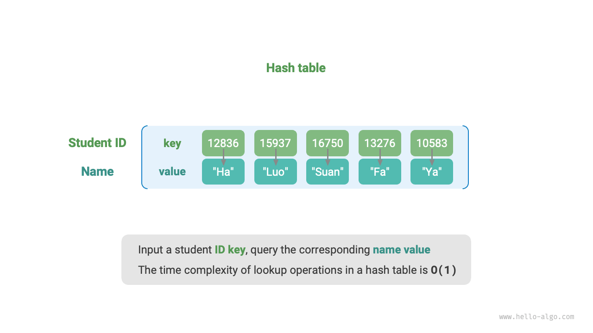
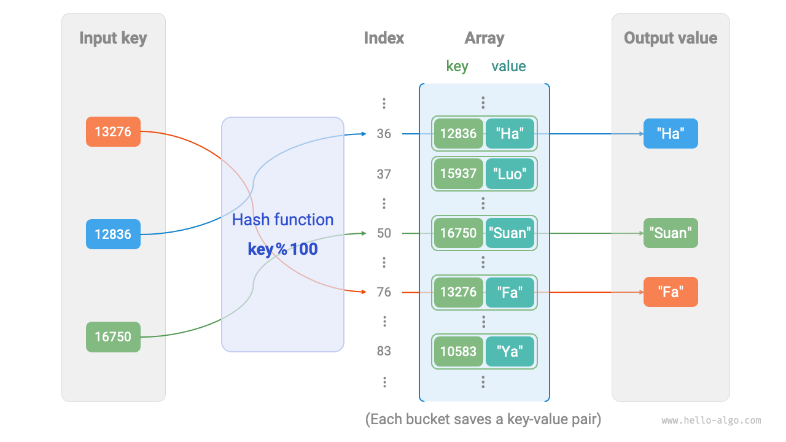
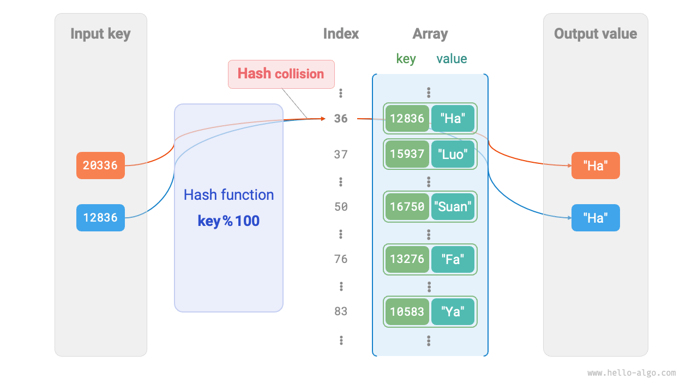
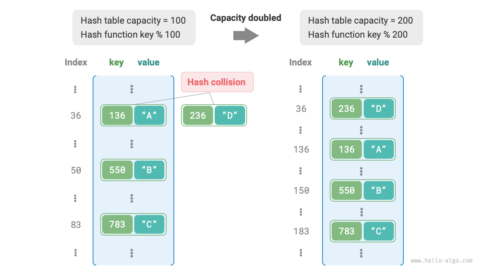

# 6.1 &nbsp; ハッシュテーブル

<u>ハッシュテーブル（hash table）</u>は、<u>散列表</u>とも呼ばれ、キー `key` と値 `value` の対応関係を構築することで、高効率な要素検索を実現します。具体的には、ハッシュテーブルにキー `key` を入力すると、対応する値 `value` を $O(1)$ 時間で取得できます。

以下の図に示すように、$n$ 人の学生がいるとし、各学生は「名前」と「学籍番号」の 2 つの情報を持っています。もし「学籍番号を入力すると対応する名前を返す」という検索機能を実現したいなら、下図のようなハッシュテーブルを用いることができます。

{ class="animation-figure" }

<p align="center"> 図 6-1 &nbsp; ハッシュテーブルの抽象表現 </p>

ハッシュテーブルのほかに、配列や連結リストでも検索機能を実現できます。それらの効率比較を次の表に示します。

- **要素の追加**：要素を配列（連結リスト）の末尾に追加するだけでよく、$O(1)$ 時間です。
- **要素の検索**：配列（連結リスト）は無秩序なので、すべての要素を走査する必要があり、$O(n)$ 時間かかります。
- **要素の削除**：先に要素を検索してから配列（連結リスト）から削除する必要があり、$O(n)$ 時間かかります。

<p align="center"> 表 6-1 &nbsp; 要素検索効率の比較 </p>

<div class="center-table" markdown>

|          | 配列   | 連結リスト | ハッシュテーブル |
| -------- | ------ | ------ | ------ |
| 要素の検索 | $O(n)$ | $O(n)$ | $O(1)$ |
| 要素の追加 | $O(1)$ | $O(1)$ | $O(1)$ |
| 要素の削除 | $O(n)$ | $O(n)$ | $O(1)$ |

</div>

以上から分かるように、**ハッシュテーブルにおける追加・削除・検索・更新の時間計算量はいずれも $O(1)$** であり、非常に高効率です。

## 6.1.1 &nbsp; ハッシュテーブルの基本操作

ハッシュテーブルの一般的な操作には、初期化、検索、キーと値のペアの追加、キーと値のペアの削除などがあります。コード例は以下のとおりです：

=== "Python"

    ```python title="hash_map.py"
    # ハッシュテーブルを初期化
    hmap: dict = {}

    # 追加操作
    # ハッシュテーブルにキーと値のペア (key, value) を追加
    hmap[12836] = "シャオハ"
    hmap[15937] = "シャオルオ"
    hmap[16750] = "シャオスワン"
    hmap[13276] = "シャオファ"
    hmap[10583] = "シャオヤー"

    # 検索操作
    # ハッシュテーブルにキー key を入力し、値 value を取得
    name: str = hmap[15937]

    # 削除操作
    # ハッシュテーブルからキーと値のペア (key, value) を削除
    hmap.pop(10583)
    ```

=== "C++"

    ```cpp title="hash_map.cpp"
    /* ハッシュテーブルを初期化 */
    unordered_map<int, string> map;

    /* 追加操作 */
    // ハッシュテーブルにキーと値のペア (key, value) を追加
    map[12836] = "シャオハ";
    map[15937] = "シャオルオ";
    map[16750] = "シャオスワン";
    map[13276] = "シャオファ";
    map[10583] = "シャオヤー";

    /* 検索操作 */
    // ハッシュテーブルにキー key を入力し、値 value を取得
    string name = map[15937];

    /* 削除操作 */
    // ハッシュテーブルからキーと値のペア (key, value) を削除
    map.erase(10583);
    ```

=== "Java"

    ```java title="hash_map.java"
    /* ハッシュテーブルを初期化 */
    Map<Integer, String> map = new HashMap<>();

    /* 追加操作 */
    // ハッシュテーブルにキーと値のペア (key, value) を追加
    map.put(12836, "シャオハ");
    map.put(15937, "シャオルオ");
    map.put(16750, "シャオスワン");
    map.put(13276, "シャオファ");
    map.put(10583, "シャオヤー");

    /* 検索操作 */
    // ハッシュテーブルにキー key を入力し、値 value を取得
    String name = map.get(15937);

    /* 削除操作 */
    // ハッシュテーブルからキーと値のペア (key, value) を削除
    map.remove(10583);
    ```

=== "C#"

    ```csharp title="hash_map.cs"
    /* ハッシュテーブルを初期化 */
    Dictionary<int, string> map = new() {
        /* 追加操作 */
        // ハッシュテーブルにキーと値のペア (key, value) を追加
        { 12836, "シャオハ" },
        { 15937, "シャオルオ" },
        { 16750, "シャオスワン" },
        { 13276, "シャオファ" },
        { 10583, "シャオヤー" }
    };

    /* 検索操作 */
    // ハッシュテーブルにキー key を入力し、値 value を取得
    string name = map[15937];

    /* 削除操作 */
    // ハッシュテーブルからキーと値のペア (key, value) を削除
    map.Remove(10583);
    ```

=== "Go"

    ```go title="hash_map_test.go"
    /* ハッシュテーブルを初期化 */
    hmap := make(map[int]string)

    /* 追加操作 */
    // ハッシュテーブルにキーと値のペア (key, value) を追加
    hmap[12836] = "シャオハ"
    hmap[15937] = "シャオルオ"
    hmap[16750] = "シャオスワン"
    hmap[13276] = "シャオファ"
    hmap[10583] = "シャオヤー"

    /* 検索操作 */
    // ハッシュテーブルにキー key を入力し、値 value を取得
    name := hmap[15937]

    /* 削除操作 */
    // ハッシュテーブルからキーと値のペア (key, value) を削除
    delete(hmap, 10583)
    ```

=== "Swift"

    ```swift title="hash_map.swift"
    /* ハッシュテーブルを初期化 */
    var map: [Int: String] = [:]

    /* 追加操作 */
    // ハッシュテーブルにキーと値のペア (key, value) を追加
    map[12836] = "シャオハ"
    map[15937] = "シャオルオ"
    map[16750] = "シャオスワン"
    map[13276] = "シャオファ"
    map[10583] = "シャオヤー"

    /* 検索操作 */
    // ハッシュテーブルにキー key を入力し、値 value を取得
    let name = map[15937]!

    /* 削除操作 */
    // ハッシュテーブルからキーと値のペア (key, value) を削除
    map.removeValue(forKey: 10583)
    ```

=== "JS"

    ```javascript title="hash_map.js"
    /* ハッシュテーブルを初期化 */
    const map = new Map();
    /* 追加操作 */
    // ハッシュテーブルにキーと値のペア (key, value) を追加
    map.set(12836, 'シャオハ');
    map.set(15937, 'シャオルオ');
    map.set(16750, 'シャオスワン');
    map.set(13276, 'シャオファ');
    map.set(10583, 'シャオヤー');

    /* 検索操作 */
    // ハッシュテーブルにキー key を入力し、値 value を取得
    let name = map.get(15937);

    /* 削除操作 */
    // ハッシュテーブルからキーと値のペア (key, value) を削除
    map.delete(10583);
    ```

=== "TS"

    ```typescript title="hash_map.ts"
    /* ハッシュテーブルを初期化 */
    const map = new Map<number, string>();
    /* 追加操作 */
    // ハッシュテーブルにキーと値のペア (key, value) を追加
    map.set(12836, 'シャオハ');
    map.set(15937, 'シャオルオ');
    map.set(16750, 'シャオスワン');
    map.set(13276, 'シャオファ');
    map.set(10583, 'シャオヤー');
    console.info('\n追加後のハッシュテーブルは次のとおりです\nKey -> Value');
    console.info(map);

    /* 検索操作 */
    // ハッシュテーブルにキー key を入力し、値 value を取得
    let name = map.get(15937);
    console.info('\n学籍番号 15937 を入力し、名前を検索: ' + name);

    /* 削除操作 */
    // ハッシュテーブルからキーと値のペア (key, value) を削除
    map.delete(10583);
    console.info('\n10583 を削除した後のハッシュテーブル\nKey -> Value');
    console.info(map);
    ```

=== "Dart"

    ```dart title="hash_map.dart"
    /* ハッシュテーブルを初期化 */
    Map<int, String> map = {};

    /* 追加操作 */
    // ハッシュテーブルにキーと値のペア (key, value) を追加
    map[12836] = "シャオハ";
    map[15937] = "シャオルオ";
    map[16750] = "シャオスワン";
    map[13276] = "シャオファ";
    map[10583] = "シャオヤー";

    /* 検索操作 */
    // ハッシュテーブルにキー key を入力し、値 value を取得
    String name = map[15937];

    /* 削除操作 */
    // ハッシュテーブルからキーと値のペア (key, value) を削除
    map.remove(10583);
    ```

=== "Rust"

    ```rust title="hash_map.rs"
    use std::collections::HashMap;

    /* ハッシュテーブルを初期化 */
    let mut map: HashMap<i32, String> = HashMap::new();

    /* 追加操作 */
    // ハッシュテーブルにキーと値のペア (key, value) を追加
    map.insert(12836, "シャオハ".to_string());
    map.insert(15937, "シャオルオ".to_string());
    map.insert(16750, "シャオスワン".to_string());
    map.insert(13279, "シャオファ".to_string());
    map.insert(10583, "シャオヤー".to_string());

    /* 検索操作 */
    // ハッシュテーブルにキー key を入力し、値 value を取得
    let _name: Option<&String> = map.get(&15937);

    /* 削除操作 */
    // ハッシュテーブルからキーと値のペア (key, value) を削除
    let _removed_value: Option<String> = map.remove(&10583);
    ```

=== "C"

    ```c title="hash_map.c"
    // C には組み込みのハッシュテーブルはありません
    ```

=== "Kotlin"

    ```kotlin title="hash_map.kt"
    /* ハッシュテーブルを初期化 */
    val map = HashMap<Int,String>()

    /* 追加操作 */
    // ハッシュテーブルにキーと値のペア (key, value) を追加
    map[12836] = "シャオハ"
    map[15937] = "シャオルオ"
    map[16750] = "シャオスワン"
    map[13276] = "シャオファ"
    map[10583] = "シャオヤー"

    /* 検索操作 */
    // ハッシュテーブルにキー key を入力し、値 value を取得
    val name = map[15937]

    /* 削除操作 */
    // ハッシュテーブルからキーと値のペア (key, value) を削除
    map.remove(10583)
    ```

=== "Ruby"

    ```ruby title="hash_map.rb"
    # ハッシュテーブルを初期化
    hmap = {}

    # 追加操作
    # ハッシュテーブルにキーと値のペア (key, value) を追加
    hmap[12836] = "シャオハ"
    hmap[15937] = "シャオルオ"
    hmap[16750] = "シャオスワン"
    hmap[13276] = "シャオファ"
    hmap[10583] = "シャオヤー"

    # 検索操作
    # ハッシュテーブルにキー key を入力し、値 value を取得
    name = hmap[15937]

    # 削除操作
    # ハッシュテーブルからキーと値のペア (key, value) を削除
    hmap.delete(10583)
    ```

??? pythontutor "可視化実行"

    https://pythontutor.com/render.html#code=%22%22%22Driver%20Code%22%22%22%0Aif%20__name__%20%3D%3D%20%22__main__%22%3A%0A%20%20%20%20%23%20%E5%88%9D%E5%A7%8B%E5%8C%96%E5%93%88%E5%B8%8C%E8%A1%A8%0A%20%20%20%20hmap%20%3D%20%7B%7D%0A%20%20%20%20%0A%20%20%20%20%23%20%E6%B7%BB%E5%8A%A0%E6%93%8D%E4%BD%9C%0A%20%20%20%20%23%20%E5%9C%A8%E5%93%88%E5%B8%8C%E8%A1%A8%E4%B8%AD%E6%B7%BB%E5%8A%A0%E9%94%AE%E5%80%BC%E5%AF%B9%20%28key,%20value%29%0A%20%20%20%20hmap%5B12836%5D%20%3D%20%22%E5%B0%8F%E5%93%88%22%0A%20%20%20%20hmap%5B15937%5D%20%3D%20%22%E5%B0%8F%E5%95%B0%22%0A%20%20%20%20hmap%5B16750%5D%20%3D%20%22%E5%B0%8F%E7%AE%97%22%0A%20%20%20%20hmap%5B13276%5D%20%3D%20%22%E5%B0%8F%E6%B3%95%22%0A%20%20%20%20hmap%5B10583%5D%20%3D%20%22%E5%B0%8F%E9%B8%AD%22%0A%20%20%20%20%0A%20%20%20%20%23%20%E6%9F%A5%E8%AF%A2%E6%93%8D%E4%BD%9C%0A%20%20%20%20%23%20%E5%90%91%E5%93%88%E5%B8%8C%E8%A1%A8%E4%B8%AD%E8%BE%93%E5%85%A5%E9%94%AE%20key%20%EF%BC%8C%E5%BE%97%E5%88%B0%E5%80%BC%20value%0A%20%20%20%20name%20%3D%20hmap%5B15937%5D%0A%20%20%20%20%0A%20%20%20%20%23%20%E5%88%A0%E9%99%A4%E6%93%8D%E4%BD%9C%0A%20%20%20%20%23%20%E5%9C%A8%E5%93%88%E5%B8%8C%E8%A1%A8%E4%B8%AD%E5%88%A0%E9%99%A4%E9%94%AE%E5%80%BC%E5%AF%B9%20%28key,%20value%29%0A%20%20%20%20hmap.pop%2810583%29&cumulative=false&curInstr=2&heapPrimitives=nevernest&mode=display&origin=opt-frontend.js&py=311&rawInputLstJSON=%5B%5D&textReferences=false

ハッシュテーブルには、キーと値のペア、キー、値を走査する 3 つの一般的な方法があります。コード例は以下のとおりです：

=== "Python"

    ```python title="hash_map.py"
    # ハッシュテーブルを走査
    # キーと値のペア key->value を走査
    for key, value in hmap.items():
        print(key, "->", value)
    # キー key のみを走査
    for key in hmap.keys():
        print(key)
    # 値 value のみを走査
    for value in hmap.values():
        print(value)
    ```

=== "C++"

    ```cpp title="hash_map.cpp"
    /* ハッシュテーブルを走査 */
    // キーと値のペア key->value を走査
    for (auto kv: map) {
        cout << kv.first << " -> " << kv.second << endl;
    }
    // イテレータを使って key->value を走査
    for (auto iter = map.begin(); iter != map.end(); iter++) {
        cout << iter->first << "->" << iter->second << endl;
    }
    ```

=== "Java"

    ```java title="hash_map.java"
    /* ハッシュテーブルを走査 */
    // キーと値のペア key->value を走査
    for (Map.Entry <Integer, String> kv: map.entrySet()) {
        System.out.println(kv.getKey() + " -> " + kv.getValue());
    }
    // キー key のみを走査
    for (int key: map.keySet()) {
        System.out.println(key);
    }
    // 値 value のみを走査
    for (String val: map.values()) {
        System.out.println(val);
    }
    ```

=== "C#"

    ```csharp title="hash_map.cs"
    /* ハッシュテーブルを走査 */
    // キーと値のペア Key->Value を走査
    foreach (var kv in map) {
        Console.WriteLine(kv.Key + " -> " + kv.Value);
    }
    // キー key のみを走査
    foreach (int key in map.Keys) {
        Console.WriteLine(key);
    }
    // 値 value のみを走査
    foreach (string val in map.Values) {
        Console.WriteLine(val);
    }
    ```

=== "Go"

    ```go title="hash_map_test.go"
    /* ハッシュテーブルを走査 */
    // キーと値のペア key->value を走査
    for key, value := range hmap {
        fmt.Println(key, "->", value)
    }
    // キー key のみを走査
    for key := range hmap {
        fmt.Println(key)
    }
    // 値 value のみを走査
    for _, value := range hmap {
        fmt.Println(value)
    }
    ```

=== "Swift"

    ```swift title="hash_map.swift"
    /* ハッシュテーブルを走査 */
    // キーと値のペア Key->Value を走査
    for (key, value) in map {
        print("\(key) -> \(value)")
    }
    // キー Key のみを走査
    for key in map.keys {
        print(key)
    }
    // 値 Value のみを走査
    for value in map.values {
        print(value)
    }
    ```

=== "JS"

    ```javascript title="hash_map.js"
    /* ハッシュテーブルを走査 */
    console.info('\nキーと値のペア Key->Value を走査');
    for (const [k, v] of map.entries()) {
        console.info(k + ' -> ' + v);
    }
    console.info('\nキー Key のみを走査');
    for (const k of map.keys()) {
        console.info(k);
    }
    console.info('\n値 Value のみを走査');
    for (const v of map.values()) {
        console.info(v);
    }
    ```

=== "TS"

    ```typescript title="hash_map.ts"
    /* ハッシュテーブルを走査 */
    console.info('\nキーと値のペア Key->Value を走査');
    for (const [k, v] of map.entries()) {
        console.info(k + ' -> ' + v);
    }
    console.info('\nキー Key のみを走査');
    for (const k of map.keys()) {
        console.info(k);
    }
    console.info('\n値 Value のみを走査');
    for (const v of map.values()) {
        console.info(v);
    }
    ```

=== "Dart"

    ```dart title="hash_map.dart"
    /* ハッシュテーブルを走査 */
    // キーと値のペア Key->Value を走査
    map.forEach((key, value) {
      print('$key -> $value');
    });

    // キー Key のみを走査
    map.keys.forEach((key) {
      print(key);
    });

    // 値 Value のみを走査
    map.values.forEach((value) {
      print(value);
    });
    ```

=== "Rust"

    ```rust title="hash_map.rs"
    /* ハッシュテーブルを走査 */
    // キーと値のペア Key->Value を走査
    for (key, value) in &map {
        println!("{key} -> {value}");
    }

    // キー Key のみを走査
    for key in map.keys() {
        println!("{key}");
    }

    // 値 Value のみを走査
    for value in map.values() {
        println!("{value}");
    }
    ```

=== "C"

    ```c title="hash_map.c"
    // C には組み込みのハッシュテーブルはありません
    ```

=== "Kotlin"

    ```kotlin title="hash_map.kt"
    /* ハッシュテーブルを走査 */
    // キーと値のペア key->value を走査
    for ((key, value) in map) {
        println("$key -> $value")
    }
    // キー key のみを走査
    for (key in map.keys) {
        println(key)
    }
    // 値 value のみを走査
    for (_val in map.values) {
        println(_val)
    }
    ```

=== "Ruby"

    ```ruby title="hash_map.rb"
    # ハッシュテーブルを走査
    # キーと値のペア key->value を走査
    hmap.entries.each { |key, value| puts "#{key} -> #{value}" }

    # キー key のみを走査
    hmap.keys.each { |key| puts key }

    # 値 value のみを走査
    hmap.values.each { |val| puts val }
    ```

??? pythontutor "可視化実行"

    https://pythontutor.com/render.html#code=%22%22%22Driver%20Code%22%22%22%0Aif%20__name__%20%3D%3D%20%22__main__%22%3A%0A%20%20%20%20%23%20%E5%88%9D%E5%A7%8B%E5%8C%96%E5%93%88%E5%B8%8C%E8%A1%A8%0A%20%20%20%20hmap%20%3D%20%7B%7D%0A%20%20%20%20%0A%20%20%20%20%23%20%E6%B7%BB%E5%8A%A0%E6%93%8D%E4%BD%9C%0A%20%20%20%20%23%20%E5%9C%A8%E5%93%88%E5%B8%8C%E8%A1%A8%E4%B8%AD%E6%B7%BB%E5%8A%A0%E9%94%AE%E5%80%BC%E5%AF%B9%20%28key,%20value%29%0A%20%20%20%20hmap%5B12836%5D%20%3D%20%22%E5%B0%8F%E5%93%88%22%0A%20%20%20%20hmap%5B15937%5D%20%3D%20%22%E5%B0%8F%E5%95%B0%22%0A%20%20%20%20hmap%5B16750%5D%20%3D%20%22%E5%B0%8F%E7%AE%97%22%0A%20%20%20%20hmap%5B13276%5D%20%3D%20%22%E5%B0%8F%E6%B3%95%22%0A%20%20%20%20hmap%5B10583%5D%20%3D%20%22%E5%B0%8F%E9%B8%AD%22%0A%20%20%20%20%0A%20%20%20%20%23%20%E9%81%8D%E5%8E%86%E5%93%88%E5%B8%8C%E8%A1%A8%0A%20%20%20%20%23%20%E9%81%8D%E5%8E%86%E9%94%AE%E5%80%BC%E5%AF%B9%20key-%3Evalue%0A%20%20%20%20for%20key,%20value%20in%20hmap.items%28%29%3A%0A%20%20%20%20%20%20%20%20print%28key,%20%22-%3E%22,%20value%29%0A%20%20%20%20%23%20%E5%8D%95%E7%8B%AC%E9%81%8D%E5%8E%86%E9%94%AE%20key%0A%20%20%20%20for%20key%20in%20hmap.keys%28%29%3A%0A%20%20%20%20%20%20%20%20print%28key%29%0A%20%20%20%20%23%20%E5%8D%95%E7%8B%AC%E9%81%8D%E5%8E%86%E5%80%BC%20value%0A%20%20%20%20for%20value%20in%20hmap.values%28%29%3A%0A%20%20%20%20%20%20%20%20print%28value%29&cumulative=false&curInstr=8&heapPrimitives=nevernest&mode=display&origin=opt-frontend.js&py=311&rawInputLstJSON=%5B%5D&textReferences=false

## 6.1.2 &nbsp; ハッシュテーブルの簡単な実装

まずは最も単純なケースとして、**1 つの配列だけでハッシュテーブルを実装する**ことを考えます。ハッシュテーブルでは、配列中の各空き位置を<u>バケット（bucket）</u>と呼び、各バケットには 1 つのキーと値のペアを格納できます。したがって、検索操作とは `key` に対応するバケットを見つけ、そのバケットから `value` を取得することです。

では、`key` に基づいて対応するバケットをどのように特定するのでしょうか。これは<u>ハッシュ関数（hash function）</u>によって実現されます。ハッシュ関数の役割は、大きな入力空間をより小さな出力空間に写像することです。ハッシュテーブルでは、入力空間はすべての `key` 、出力空間はすべてのバケット（配列インデックス）です。言い換えると、`key` を入力すると、**ハッシュ関数によってその `key` に対応するキーと値のペアの配列内での格納位置を求められます**。

`key` を入力したとき、ハッシュ関数の計算過程は次の 2 段階に分かれます。

1. あるハッシュアルゴリズム `hash()` を用いてハッシュ値を計算します。
2. ハッシュ値をバケット数（配列長）`capacity` で剰余し、その `key` に対応するバケット（配列インデックス）`index` を求めます。

```shell
index = hash(key) % capacity
```

その後、`index` を使ってハッシュテーブル内の対応するバケットにアクセスし、`value` を取得できます。

配列長を `capacity = 100` 、ハッシュアルゴリズムを `hash(key) = key` とすると、ハッシュ関数は `key % 100` となります。次の図では、`key` を学籍番号、`value` を名前の例として、ハッシュ関数の動作原理を示します。

{ class="animation-figure" }

<p align="center"> 図 6-2 &nbsp; ハッシュ関数の動作原理 </p>

以下のコードは、単純なハッシュテーブルを実装したものです。ここでは、キーと値のペアを表すために `key` と `value` をクラス `Pair` にまとめています。

=== "Python"

    ```python title="array_hash_map.py"
    class Pair:
        """キーと値の組"""

        def __init__(self, key: int, val: str):
            self.key = key
            self.val = val

    class ArrayHashMap:
        """配列ベースのハッシュテーブル"""

        def __init__(self):
            """コンストラクタ"""
            # 100 個のバケットを含む配列を初期化
            self.buckets: list[Pair | None] = [None] * 100

        def hash_func(self, key: int) -> int:
            """ハッシュ関数"""
            index = key % 100
            return index

        def get(self, key: int) -> str | None:
            """検索操作"""
            index: int = self.hash_func(key)
            pair: Pair = self.buckets[index]
            if pair is None:
                return None
            return pair.val

        def put(self, key: int, val: str):
            """追加と更新の操作"""
            pair = Pair(key, val)
            index: int = self.hash_func(key)
            self.buckets[index] = pair

        def remove(self, key: int):
            """削除操作"""
            index: int = self.hash_func(key)
            # None に設定し、削除を表す
            self.buckets[index] = None

        def entry_set(self) -> list[Pair]:
            """すべてのキーと値のペアを取得"""
            result: list[Pair] = []
            for pair in self.buckets:
                if pair is not None:
                    result.append(pair)
            return result

        def key_set(self) -> list[int]:
            """すべてのキーを取得"""
            result = []
            for pair in self.buckets:
                if pair is not None:
                    result.append(pair.key)
            return result

        def value_set(self) -> list[str]:
            """すべての値を取得"""
            result = []
            for pair in self.buckets:
                if pair is not None:
                    result.append(pair.val)
            return result

        def print(self):
            """ハッシュテーブルを出力"""
            for pair in self.buckets:
                if pair is not None:
                    print(pair.key, "->", pair.val)
    ```

=== "C++"

    ```cpp title="array_hash_map.cpp"
    /* キーと値の組 */
    struct Pair {
      public:
        int key;
        string val;
        Pair(int key, string val) {
            this->key = key;
            this->val = val;
        }
    };

    /* 配列ベースのハッシュテーブル */
    class ArrayHashMap {
      private:
        vector<Pair *> buckets;

      public:
        ArrayHashMap() {
            // 100 個のバケットを含む配列を初期化
            buckets = vector<Pair *>(100);
        }

        ~ArrayHashMap() {
            // メモリを解放する
            for (const auto &bucket : buckets) {
                delete bucket;
            }
            buckets.clear();
        }

        /* ハッシュ関数 */
        int hashFunc(int key) {
            int index = key % 100;
            return index;
        }

        /* 検索操作 */
        string get(int key) {
            int index = hashFunc(key);
            Pair *pair = buckets[index];
            if (pair == nullptr)
                return "";
            return pair->val;
        }

        /* 追加操作 */
        void put(int key, string val) {
            Pair *pair = new Pair(key, val);
            int index = hashFunc(key);
            buckets[index] = pair;
        }

        /* 削除操作 */
        void remove(int key) {
            int index = hashFunc(key);
            // メモリを解放して nullptr に設定する
            delete buckets[index];
            buckets[index] = nullptr;
        }

        /* すべてのキーと値のペアを取得 */
        vector<Pair *> pairSet() {
            vector<Pair *> pairSet;
            for (Pair *pair : buckets) {
                if (pair != nullptr) {
                    pairSet.push_back(pair);
                }
            }
            return pairSet;
        }

        /* すべてのキーを取得 */
        vector<int> keySet() {
            vector<int> keySet;
            for (Pair *pair : buckets) {
                if (pair != nullptr) {
                    keySet.push_back(pair->key);
                }
            }
            return keySet;
        }

        /* すべての値を取得 */
        vector<string> valueSet() {
            vector<string> valueSet;
            for (Pair *pair : buckets) {
                if (pair != nullptr) {
                    valueSet.push_back(pair->val);
                }
            }
            return valueSet;
        }

        /* ハッシュテーブルを出力 */
        void print() {
            for (Pair *kv : pairSet()) {
                cout << kv->key << " -> " << kv->val << endl;
            }
        }
    };
    ```

=== "Java"

    ```java title="array_hash_map.java"
    /* キーと値の組 */
    class Pair {
        public int key;
        public String val;

        public Pair(int key, String val) {
            this.key = key;
            this.val = val;
        }
    }

    /* 配列ベースのハッシュテーブル */
    class ArrayHashMap {
        private List<Pair> buckets;

        public ArrayHashMap() {
            // 100 個のバケットを含む配列を初期化
            buckets = new ArrayList<>();
            for (int i = 0; i < 100; i++) {
                buckets.add(null);
            }
        }

        /* ハッシュ関数 */
        private int hashFunc(int key) {
            int index = key % 100;
            return index;
        }

        /* 検索操作 */
        public String get(int key) {
            int index = hashFunc(key);
            Pair pair = buckets.get(index);
            if (pair == null)
                return null;
            return pair.val;
        }

        /* 追加操作 */
        public void put(int key, String val) {
            Pair pair = new Pair(key, val);
            int index = hashFunc(key);
            buckets.set(index, pair);
        }

        /* 削除操作 */
        public void remove(int key) {
            int index = hashFunc(key);
            // null に設定し、削除を表す
            buckets.set(index, null);
        }

        /* すべてのキーと値のペアを取得 */
        public List<Pair> pairSet() {
            List<Pair> pairSet = new ArrayList<>();
            for (Pair pair : buckets) {
                if (pair != null)
                    pairSet.add(pair);
            }
            return pairSet;
        }

        /* すべてのキーを取得 */
        public List<Integer> keySet() {
            List<Integer> keySet = new ArrayList<>();
            for (Pair pair : buckets) {
                if (pair != null)
                    keySet.add(pair.key);
            }
            return keySet;
        }

        /* すべての値を取得 */
        public List<String> valueSet() {
            List<String> valueSet = new ArrayList<>();
            for (Pair pair : buckets) {
                if (pair != null)
                    valueSet.add(pair.val);
            }
            return valueSet;
        }

        /* ハッシュテーブルを出力 */
        public void print() {
            for (Pair kv : pairSet()) {
                System.out.println(kv.key + " -> " + kv.val);
            }
        }
    }
    ```

=== "C#"

    ```csharp title="array_hash_map.cs"
    /* キーと値の組 int->string */
    class Pair(int key, string val) {
        public int key = key;
        public string val = val;
    }

    /* 配列ベースのハッシュテーブル */
    class ArrayHashMap {
        List<Pair?> buckets;
        public ArrayHashMap() {
            // 100 個のバケットを含む配列を初期化
            buckets = [];
            for (int i = 0; i < 100; i++) {
                buckets.Add(null);
            }
        }

        /* ハッシュ関数 */
        int HashFunc(int key) {
            int index = key % 100;
            return index;
        }

        /* 検索操作 */
        public string? Get(int key) {
            int index = HashFunc(key);
            Pair? pair = buckets[index];
            if (pair == null) return null;
            return pair.val;
        }

        /* 追加操作 */
        public void Put(int key, string val) {
            Pair pair = new(key, val);
            int index = HashFunc(key);
            buckets[index] = pair;
        }

        /* 削除操作 */
        public void Remove(int key) {
            int index = HashFunc(key);
            // null に設定し、削除を表す
            buckets[index] = null;
        }

        /* すべてのキーと値のペアを取得 */
        public List<Pair> PairSet() {
            List<Pair> pairSet = [];
            foreach (Pair? pair in buckets) {
                if (pair != null)
                    pairSet.Add(pair);
            }
            return pairSet;
        }

        /* すべてのキーを取得 */
        public List<int> KeySet() {
            List<int> keySet = [];
            foreach (Pair? pair in buckets) {
                if (pair != null)
                    keySet.Add(pair.key);
            }
            return keySet;
        }

        /* すべての値を取得 */
        public List<string> ValueSet() {
            List<string> valueSet = [];
            foreach (Pair? pair in buckets) {
                if (pair != null)
                    valueSet.Add(pair.val);
            }
            return valueSet;
        }

        /* ハッシュテーブルを出力 */
        public void Print() {
            foreach (Pair kv in PairSet()) {
                Console.WriteLine(kv.key + " -> " + kv.val);
            }
        }
    }
    ```

=== "Go"

    ```go title="array_hash_map.go"
    /* キーと値の組 */
    type pair struct {
        key int
        val string
    }

    /* 配列ベースのハッシュテーブル */
    type arrayHashMap struct {
        buckets []*pair
    }

    /* ハッシュテーブルを初期化 */
    func newArrayHashMap() *arrayHashMap {
        // 100 個のバケットを含む配列を初期化
        buckets := make([]*pair, 100)
        return &arrayHashMap{buckets: buckets}
    }

    /* ハッシュ関数 */
    func (a *arrayHashMap) hashFunc(key int) int {
        index := key % 100
        return index
    }

    /* 検索操作 */
    func (a *arrayHashMap) get(key int) string {
        index := a.hashFunc(key)
        pair := a.buckets[index]
        if pair == nil {
            return "Not Found"
        }
        return pair.val
    }

    /* 追加操作 */
    func (a *arrayHashMap) put(key int, val string) {
        pair := &pair{key: key, val: val}
        index := a.hashFunc(key)
        a.buckets[index] = pair
    }

    /* 削除操作 */
    func (a *arrayHashMap) remove(key int) {
        index := a.hashFunc(key)
        // nil に設定し、削除を表す
        a.buckets[index] = nil
    }

    /* すべてのキーのペアを取得する */
    func (a *arrayHashMap) pairSet() []*pair {
        var pairs []*pair
        for _, pair := range a.buckets {
            if pair != nil {
                pairs = append(pairs, pair)
            }
        }
        return pairs
    }

    /* すべてのキーを取得 */
    func (a *arrayHashMap) keySet() []int {
        var keys []int
        for _, pair := range a.buckets {
            if pair != nil {
                keys = append(keys, pair.key)
            }
        }
        return keys
    }

    /* すべての値を取得 */
    func (a *arrayHashMap) valueSet() []string {
        var values []string
        for _, pair := range a.buckets {
            if pair != nil {
                values = append(values, pair.val)
            }
        }
        return values
    }

    /* ハッシュテーブルを出力 */
    func (a *arrayHashMap) print() {
        for _, pair := range a.buckets {
            if pair != nil {
                fmt.Println(pair.key, "->", pair.val)
            }
        }
    }
    ```

=== "Swift"

    ```swift title="array_hash_map.swift"
    /* キーと値の組 */
    class Pair: Equatable {
        public var key: Int
        public var val: String

        public init(key: Int, val: String) {
            self.key = key
            self.val = val
        }

        public static func == (lhs: Pair, rhs: Pair) -> Bool {
            lhs.key == rhs.key && lhs.val == rhs.val
        }
    }

    /* 配列ベースのハッシュテーブル */
    class ArrayHashMap {
        private var buckets: [Pair?]

        init() {
            // 100 個のバケットを含む配列を初期化
            buckets = Array(repeating: nil, count: 100)
        }

        /* ハッシュ関数 */
        private func hashFunc(key: Int) -> Int {
            let index = key % 100
            return index
        }

        /* 検索操作 */
        func get(key: Int) -> String? {
            let index = hashFunc(key: key)
            let pair = buckets[index]
            return pair?.val
        }

        /* 追加操作 */
        func put(key: Int, val: String) {
            let pair = Pair(key: key, val: val)
            let index = hashFunc(key: key)
            buckets[index] = pair
        }

        /* 削除操作 */
        func remove(key: Int) {
            let index = hashFunc(key: key)
            // nil に設定し、削除を表す
            buckets[index] = nil
        }

        /* すべてのキーと値のペアを取得 */
        func pairSet() -> [Pair] {
            buckets.compactMap { $0 }
        }

        /* すべてのキーを取得 */
        func keySet() -> [Int] {
            buckets.compactMap { $0?.key }
        }

        /* すべての値を取得 */
        func valueSet() -> [String] {
            buckets.compactMap { $0?.val }
        }

        /* ハッシュテーブルを出力 */
        func print() {
            for pair in pairSet() {
                Swift.print("\(pair.key) -> \(pair.val)")
            }
        }
    }
    ```

=== "JS"

    ```javascript title="array_hash_map.js"
    /* キーと値の組 Number -> String */
    class Pair {
        constructor(key, val) {
            this.key = key;
            this.val = val;
        }
    }

    /* 配列ベースのハッシュテーブル */
    class ArrayHashMap {
        #buckets;
        constructor() {
            // 100 個のバケットを含む配列を初期化
            this.#buckets = new Array(100).fill(null);
        }

        /* ハッシュ関数 */
        #hashFunc(key) {
            return key % 100;
        }

        /* 検索操作 */
        get(key) {
            let index = this.#hashFunc(key);
            let pair = this.#buckets[index];
            if (pair === null) return null;
            return pair.val;
        }

        /* 追加操作 */
        set(key, val) {
            let index = this.#hashFunc(key);
            this.#buckets[index] = new Pair(key, val);
        }

        /* 削除操作 */
        delete(key) {
            let index = this.#hashFunc(key);
            // null に設定し、削除を表す
            this.#buckets[index] = null;
        }

        /* すべてのキーと値のペアを取得 */
        entries() {
            let arr = [];
            for (let i = 0; i < this.#buckets.length; i++) {
                if (this.#buckets[i]) {
                    arr.push(this.#buckets[i]);
                }
            }
            return arr;
        }

        /* すべてのキーを取得 */
        keys() {
            let arr = [];
            for (let i = 0; i < this.#buckets.length; i++) {
                if (this.#buckets[i]) {
                    arr.push(this.#buckets[i].key);
                }
            }
            return arr;
        }

        /* すべての値を取得 */
        values() {
            let arr = [];
            for (let i = 0; i < this.#buckets.length; i++) {
                if (this.#buckets[i]) {
                    arr.push(this.#buckets[i].val);
                }
            }
            return arr;
        }

        /* ハッシュテーブルを出力 */
        print() {
            let pairSet = this.entries();
            for (const pair of pairSet) {
                console.info(`${pair.key} -> ${pair.val}`);
            }
        }
    }
    ```

=== "TS"

    ```typescript title="array_hash_map.ts"
    /* キーと値の組 Number -> String */
    class Pair {
        public key: number;
        public val: string;

        constructor(key: number, val: string) {
            this.key = key;
            this.val = val;
        }
    }

    /* 配列ベースのハッシュテーブル */
    class ArrayHashMap {
        private readonly buckets: (Pair | null)[];

        constructor() {
            // 100 個のバケットを含む配列を初期化
            this.buckets = new Array(100).fill(null);
        }

        /* ハッシュ関数 */
        private hashFunc(key: number): number {
            return key % 100;
        }

        /* 検索操作 */
        public get(key: number): string | null {
            let index = this.hashFunc(key);
            let pair = this.buckets[index];
            if (pair === null) return null;
            return pair.val;
        }

        /* 追加操作 */
        public set(key: number, val: string) {
            let index = this.hashFunc(key);
            this.buckets[index] = new Pair(key, val);
        }

        /* 削除操作 */
        public delete(key: number) {
            let index = this.hashFunc(key);
            // null に設定し、削除を表す
            this.buckets[index] = null;
        }

        /* すべてのキーと値のペアを取得 */
        public entries(): (Pair | null)[] {
            let arr: (Pair | null)[] = [];
            for (let i = 0; i < this.buckets.length; i++) {
                if (this.buckets[i]) {
                    arr.push(this.buckets[i]);
                }
            }
            return arr;
        }

        /* すべてのキーを取得 */
        public keys(): (number | undefined)[] {
            let arr: (number | undefined)[] = [];
            for (let i = 0; i < this.buckets.length; i++) {
                if (this.buckets[i]) {
                    arr.push(this.buckets[i].key);
                }
            }
            return arr;
        }

        /* すべての値を取得 */
        public values(): (string | undefined)[] {
            let arr: (string | undefined)[] = [];
            for (let i = 0; i < this.buckets.length; i++) {
                if (this.buckets[i]) {
                    arr.push(this.buckets[i].val);
                }
            }
            return arr;
        }

        /* ハッシュテーブルを出力 */
        public print() {
            let pairSet = this.entries();
            for (const pair of pairSet) {
                console.info(`${pair.key} -> ${pair.val}`);
            }
        }
    }
    ```

=== "Dart"

    ```dart title="array_hash_map.dart"
    /* キーと値の組 */
    class Pair {
      int key;
      String val;
      Pair(this.key, this.val);
    }

    /* 配列ベースのハッシュテーブル */
    class ArrayHashMap {
      late List<Pair?> _buckets;

      ArrayHashMap() {
        // 100 個のバケットを含む配列を初期化
        _buckets = List.filled(100, null);
      }

      /* ハッシュ関数 */
      int _hashFunc(int key) {
        final int index = key % 100;
        return index;
      }

      /* 検索操作 */
      String? get(int key) {
        final int index = _hashFunc(key);
        final Pair? pair = _buckets[index];
        if (pair == null) {
          return null;
        }
        return pair.val;
      }

      /* 追加操作 */
      void put(int key, String val) {
        final Pair pair = Pair(key, val);
        final int index = _hashFunc(key);
        _buckets[index] = pair;
      }

      /* 削除操作 */
      void remove(int key) {
        final int index = _hashFunc(key);
        _buckets[index] = null;
      }

      /* すべてのキーと値のペアを取得 */
      List<Pair> pairSet() {
        List<Pair> pairSet = [];
        for (final Pair? pair in _buckets) {
          if (pair != null) {
            pairSet.add(pair);
          }
        }
        return pairSet;
      }

      /* すべてのキーを取得 */
      List<int> keySet() {
        List<int> keySet = [];
        for (final Pair? pair in _buckets) {
          if (pair != null) {
            keySet.add(pair.key);
          }
        }
        return keySet;
      }

      /* すべての値を取得 */
      List<String> values() {
        List<String> valueSet = [];
        for (final Pair? pair in _buckets) {
          if (pair != null) {
            valueSet.add(pair.val);
          }
        }
        return valueSet;
      }

      /* ハッシュテーブルを出力 */
      void printHashMap() {
        for (final Pair kv in pairSet()) {
          print("${kv.key} -> ${kv.val}");
        }
      }
    }
    ```

=== "Rust"

    ```rust title="array_hash_map.rs"
    /* キーと値の組 */
    #[derive(Debug, Clone, PartialEq)]
    pub struct Pair {
        pub key: i32,
        pub val: String,
    }

    /* 配列ベースのハッシュテーブル */
    pub struct ArrayHashMap {
        buckets: Vec<Option<Pair>>,
    }

    impl ArrayHashMap {
        pub fn new() -> ArrayHashMap {
            // 100 個のバケットを含む配列を初期化
            Self {
                buckets: vec![None; 100],
            }
        }

        /* ハッシュ関数 */
        fn hash_func(&self, key: i32) -> usize {
            key as usize % 100
        }

        /* 検索操作 */
        pub fn get(&self, key: i32) -> Option<&String> {
            let index = self.hash_func(key);
            self.buckets[index].as_ref().map(|pair| &pair.val)
        }

        /* 追加操作 */
        pub fn put(&mut self, key: i32, val: &str) {
            let index = self.hash_func(key);
            self.buckets[index] = Some(Pair {
                key,
                val: val.to_string(),
            });
        }

        /* 削除操作 */
        pub fn remove(&mut self, key: i32) {
            let index = self.hash_func(key);
            // None に設定し、削除を表す
            self.buckets[index] = None;
        }

        /* すべてのキーと値のペアを取得 */
        pub fn entry_set(&self) -> Vec<&Pair> {
            self.buckets
                .iter()
                .filter_map(|pair| pair.as_ref())
                .collect()
        }

        /* すべてのキーを取得 */
        pub fn key_set(&self) -> Vec<&i32> {
            self.buckets
                .iter()
                .filter_map(|pair| pair.as_ref().map(|pair| &pair.key))
                .collect()
        }

        /* すべての値を取得 */
        pub fn value_set(&self) -> Vec<&String> {
            self.buckets
                .iter()
                .filter_map(|pair| pair.as_ref().map(|pair| &pair.val))
                .collect()
        }

        /* ハッシュテーブルを出力 */
        pub fn print(&self) {
            for pair in self.entry_set() {
                println!("{} -> {}", pair.key, pair.val);
            }
        }
    }
    ```

=== "C"

    ```c title="array_hash_map.c"
    /* キーと値の組 int->string */
    typedef struct {
        int key;
        char *val;
    } Pair;

    /* 配列ベースのハッシュテーブル */
    typedef struct {
        Pair *buckets[MAX_SIZE];
    } ArrayHashMap;

    /* コンストラクタ */
    ArrayHashMap *newArrayHashMap() {
        ArrayHashMap *hmap = malloc(sizeof(ArrayHashMap));
        for (int i=0; i < MAX_SIZE; i++) {
            hmap->buckets[i] = NULL;
        }
        return hmap;
    }

    /* デストラクタ */
    void delArrayHashMap(ArrayHashMap *hmap) {
        for (int i = 0; i < MAX_SIZE; i++) {
            if (hmap->buckets[i] != NULL) {
                free(hmap->buckets[i]->val);
                free(hmap->buckets[i]);
            }
        }
        free(hmap);
    }

    /* 追加操作 */
    void put(ArrayHashMap *hmap, const int key, const char *val) {
        Pair *Pair = malloc(sizeof(Pair));
        Pair->key = key;
        Pair->val = malloc(strlen(val) + 1);
        strcpy(Pair->val, val);

        int index = hashFunc(key);
        hmap->buckets[index] = Pair;
    }

    /* 削除操作 */
    void removeItem(ArrayHashMap *hmap, const int key) {
        int index = hashFunc(key);
        free(hmap->buckets[index]->val);
        free(hmap->buckets[index]);
        hmap->buckets[index] = NULL;
    }

    /* すべてのキーと値のペアを取得 */
    void pairSet(ArrayHashMap *hmap, MapSet *set) {
        Pair *entries;
        int i = 0, index = 0;
        int total = 0;
        /* 有効なキーと値のペア数を集計 */
        for (i = 0; i < MAX_SIZE; i++) {
            if (hmap->buckets[i] != NULL) {
                total++;
            }
        }
        entries = malloc(sizeof(Pair) * total);
        for (i = 0; i < MAX_SIZE; i++) {
            if (hmap->buckets[i] != NULL) {
                entries[index].key = hmap->buckets[i]->key;
                entries[index].val = malloc(strlen(hmap->buckets[i]->val) + 1);
                strcpy(entries[index].val, hmap->buckets[i]->val);
                index++;
            }
        }
        set->set = entries;
        set->len = total;
    }

    /* すべてのキーを取得 */
    void keySet(ArrayHashMap *hmap, MapSet *set) {
        int *keys;
        int i = 0, index = 0;
        int total = 0;
        /* 有効なキーと値のペア数を集計 */
        for (i = 0; i < MAX_SIZE; i++) {
            if (hmap->buckets[i] != NULL) {
                total++;
            }
        }
        keys = malloc(total * sizeof(int));
        for (i = 0; i < MAX_SIZE; i++) {
            if (hmap->buckets[i] != NULL) {
                keys[index] = hmap->buckets[i]->key;
                index++;
            }
        }
        set->set = keys;
        set->len = total;
    }

    /* すべての値を取得 */
    void valueSet(ArrayHashMap *hmap, MapSet *set) {
        char **vals;
        int i = 0, index = 0;
        int total = 0;
        /* 有効なキーと値のペア数を集計 */
        for (i = 0; i < MAX_SIZE; i++) {
            if (hmap->buckets[i] != NULL) {
                total++;
            }
        }
        vals = malloc(total * sizeof(char *));
        for (i = 0; i < MAX_SIZE; i++) {
            if (hmap->buckets[i] != NULL) {
                vals[index] = hmap->buckets[i]->val;
                index++;
            }
        }
        set->set = vals;
        set->len = total;
    }

    /* ハッシュテーブルを出力 */
    void print(ArrayHashMap *hmap) {
        int i;
        MapSet set;
        pairSet(hmap, &set);
        Pair *entries = (Pair *)set.set;
        for (i = 0; i < set.len; i++) {
            printf("%d -> %s\n", entries[i].key, entries[i].val);
        }
        free(set.set);
    }
    ```

=== "Kotlin"

    ```kotlin title="array_hash_map.kt"
    /* キーと値の組 */
    class Pair(
        var key: Int,
        var _val: String
    )

    /* 配列ベースのハッシュテーブル */
    class ArrayHashMap {
        // 100 個のバケットを含む配列を初期化
        private val buckets = arrayOfNulls<Pair>(100)

        /* ハッシュ関数 */
        fun hashFunc(key: Int): Int {
            val index = key % 100
            return index
        }

        /* 検索操作 */
        fun get(key: Int): String? {
            val index = hashFunc(key)
            val pair = buckets[index] ?: return null
            return pair._val
        }

        /* 追加操作 */
        fun put(key: Int, _val: String) {
            val pair = Pair(key, _val)
            val index = hashFunc(key)
            buckets[index] = pair
        }

        /* 削除操作 */
        fun remove(key: Int) {
            val index = hashFunc(key)
            // null に設定し、削除を表す
            buckets[index] = null
        }

        /* すべてのキーと値のペアを取得 */
        fun pairSet(): MutableList<Pair> {
            val pairSet = mutableListOf<Pair>()
            for (pair in buckets) {
                if (pair != null)
                    pairSet.add(pair)
            }
            return pairSet
        }

        /* すべてのキーを取得 */
        fun keySet(): MutableList<Int> {
            val keySet = mutableListOf<Int>()
            for (pair in buckets) {
                if (pair != null)
                    keySet.add(pair.key)
            }
            return keySet
        }

        /* すべての値を取得 */
        fun valueSet(): MutableList<String> {
            val valueSet = mutableListOf<String>()
            for (pair in buckets) {
                if (pair != null)
                    valueSet.add(pair._val)
            }
            return valueSet
        }

        /* ハッシュテーブルを出力 */
        fun print() {
            for (kv in pairSet()) {
                val key = kv.key
                val _val = kv._val
                println("$key -> $_val")
            }
        }
    }
    ```

=== "Ruby"

    ```ruby title="array_hash_map.rb"
    ### キーと値のペア ###
    class Pair
      attr_accessor :key, :val

      def initialize(key, val)
        @key = key
        @val = val
      end
    end

    ### 配列で実装したハッシュテーブル ###
    class ArrayHashMap
      ### コンストラクタ ###
      def initialize
        # 100 個のバケットを含む配列を初期化
        @buckets = Array.new(100)
      end

      ### ハッシュ関数 ###
      def hash_func(key)
        index = key % 100
      end

      ### 検索操作 ###
      def get(key)
        index = hash_func(key)
        pair = @buckets[index]

        return if pair.nil?
        pair.val
      end

      ### 追加操作 ###
      def put(key, val)
        pair = Pair.new(key, val)
        index = hash_func(key)
        @buckets[index] = pair
      end

      ### 削除操作 ###
      def remove(key)
        index = hash_func(key)
        # nil に設定し、削除を表す
        @buckets[index] = nil
      end

      ### すべてのキーと値のペアを取得 ###
      def entry_set
        result = []
        @buckets.each { |pair| result << pair unless pair.nil? }
        result
      end

      ### すべてのキーを取得 ###
      def key_set
        result = []
        @buckets.each { |pair| result << pair.key unless pair.nil? }
        result
      end

      ### すべての値を取得 ###
      def value_set
        result = []
        @buckets.each { |pair| result << pair.val unless pair.nil? }
        result
      end

      ### ハッシュテーブルを出力 ###
      def print
        @buckets.each { |pair| puts "#{pair.key} -> #{pair.val}" unless pair.nil? }
      end
    end
    ```

??? pythontutor "コードの可視化"

    <div style="height: 549px; width: 100%;"><iframe class="pythontutor-iframe" src="https://pythontutor.com/iframe-embed.html#code=class%20Pair%3A%0A%0A%20%20%20%20def%20__init__%28self%2C%20key%3A%20int%2C%20val%3A%20str%29%3A%0A%20%20%20%20%20%20%20%20self.key%20%3D%20key%0A%20%20%20%20%20%20%20%20self.val%20%3D%20val%0A%0Aclass%20ArrayHashMap%3A%0A%0A%20%20%20%20def%20__init__%28self%29%3A%0A%20%20%20%20%20%20%20%20self.buckets%3A%20list%5BPair%20%7C%20None%5D%20%3D%20%5BNone%5D%20%2A%2020%0A%0A%20%20%20%20def%20hash_func%28self%2C%20key%3A%20int%29%20-%3E%20int%3A%0A%20%20%20%20%20%20%20%20index%20%3D%20key%20%25%2020%0A%20%20%20%20%20%20%20%20return%20index%0A%0A%20%20%20%20def%20get%28self%2C%20key%3A%20int%29%20-%3E%20str%3A%0A%20%20%20%20%20%20%20%20index%3A%20int%20%3D%20self.hash_func%28key%29%0A%20%20%20%20%20%20%20%20pair%3A%20Pair%20%3D%20self.buckets%5Bindex%5D%0A%20%20%20%20%20%20%20%20if%20pair%20is%20None%3A%0A%20%20%20%20%20%20%20%20%20%20%20%20return%20None%0A%20%20%20%20%20%20%20%20return%20pair.val%0A%0A%20%20%20%20def%20put%28self%2C%20key%3A%20int%2C%20val%3A%20str%29%3A%0A%20%20%20%20%20%20%20%20pair%20%3D%20Pair%28key%2C%20val%29%0A%20%20%20%20%20%20%20%20index%3A%20int%20%3D%20self.hash_func%28key%29%0A%20%20%20%20%20%20%20%20self.buckets%5Bindex%5D%20%3D%20pair%0A%0A%20%20%20%20def%20remove%28self%2C%20key%3A%20int%29%3A%0A%20%20%20%20%20%20%20%20index%3A%20int%20%3D%20self.hash_func%28key%29%0A%20%20%20%20%20%20%20%20self.buckets%5Bindex%5D%20%3D%20None%0A%0A%20%20%20%20def%20entry_set%28self%29%20-%3E%20list%5BPair%5D%3A%0A%20%20%20%20%20%20%20%20result%3A%20list%5BPair%5D%20%3D%20%5B%5D%0A%20%20%20%20%20%20%20%20for%20pair%20in%20self.buckets%3A%0A%20%20%20%20%20%20%20%20%20%20%20%20if%20pair%20is%20not%20None%3A%0A%20%20%20%20%20%20%20%20%20%20%20%20%20%20%20%20result.append%28pair%29%0A%20%20%20%20%20%20%20%20return%20result%0A%0A%20%20%20%20def%20key_set%28self%29%20-%3E%20list%5Bint%5D%3A%0A%20%20%20%20%20%20%20%20result%20%3D%20%5B%5D%0A%20%20%20%20%20%20%20%20for%20pair%20in%20self.buckets%3A%0A%20%20%20%20%20%20%20%20%20%20%20%20if%20pair%20is%20not%20None%3A%0A%20%20%20%20%20%20%20%20%20%20%20%20%20%20%20%20result.append%28pair.key%29%0A%20%20%20%20%20%20%20%20return%20result%0A%0A%20%20%20%20def%20value_set%28self%29%20-%3E%20list%5Bstr%5D%3A%0A%20%20%20%20%20%20%20%20result%20%3D%20%5B%5D%0A%20%20%20%20%20%20%20%20for%20pair%20in%20self.buckets%3A%0A%20%20%20%20%20%20%20%20%20%20%20%20if%20pair%20is%20not%20None%3A%0A%20%20%20%20%20%20%20%20%20%20%20%20%20%20%20%20result.append%28pair.val%29%0A%20%20%20%20%20%20%20%20return%20result%0A%0A%20%20%20%20def%20print%28self%29%3A%0A%20%20%20%20%20%20%20%20for%20pair%20in%20self.buckets%3A%0A%20%20%20%20%20%20%20%20%20%20%20%20if%20pair%20is%20not%20None%3A%0A%20%20%20%20%20%20%20%20%20%20%20%20%20%20%20%20print%28pair.key%2C%20%27-%3E%27%2C%20pair.val%29%0Aif%20__name__%20%3D%3D%20%27__main__%27%3A%0A%20%20%20%20hmap%20%3D%20ArrayHashMap%28%29%0A%20%20%20%20hmap.put%2812836%2C%20%27%E3%82%B7%E3%83%A3%E3%82%AA%E3%83%8F%E3%83%BC%27%29%0A%20%20%20%20hmap.put%2815937%2C%20%27%E3%82%B7%E3%83%A3%E3%82%AA%E3%83%AB%E3%82%AA%27%29%0A%20%20%20%20hmap.put%2816750%2C%20%27%E3%82%B7%E3%83%A3%E3%82%AA%E3%82%B9%E3%83%AF%E3%83%B3%27%29%0A%20%20%20%20hmap.put%2813276%2C%20%27%E3%82%B7%E3%83%A3%E3%82%AA%E3%83%95%E3%82%A1%E3%83%BC%27%29%0A%20%20%20%20hmap.put%2810583%2C%20%27%E3%82%B7%E3%83%A3%E3%82%AA%E3%83%A4%E3%83%BC%27%29%0A%20%20%20%20name%20%3D%20hmap.get%2815937%29%0A%20%20%20%20hmap.remove%2810583%29%0A%20%20%20%20print%28%27%5Cn%E3%82%AD%E3%83%BC%E3%81%A8%E5%80%A4%E3%81%AE%E3%83%9A%E3%82%A2%20Key-%3EValue%20%E3%82%92%E8%B5%B0%E6%9F%BB%27%29%0A%20%20%20%20for%20pair%20in%20hmap.entry_set%28%29%3A%0A%20%20%20%20%20%20%20%20print%28pair.key%2C%20%27-%3E%27%2C%20pair.val%29&codeDivHeight=472&codeDivWidth=350&cumulative=false&curInstr=4&heapPrimitives=nevernest&origin=opt-frontend.js&py=311&rawInputLstJSON=%5B%5D&textReferences=false"> </iframe></div>
    <div style="margin-top: 5px;"><a href="https://pythontutor.com/iframe-embed.html#code=class%20Pair%3A%0A%0A%20%20%20%20def%20__init__%28self%2C%20key%3A%20int%2C%20val%3A%20str%29%3A%0A%20%20%20%20%20%20%20%20self.key%20%3D%20key%0A%20%20%20%20%20%20%20%20self.val%20%3D%20val%0A%0Aclass%20ArrayHashMap%3A%0A%0A%20%20%20%20def%20__init__%28self%29%3A%0A%20%20%20%20%20%20%20%20self.buckets%3A%20list%5BPair%20%7C%20None%5D%20%3D%20%5BNone%5D%20%2A%2020%0A%0A%20%20%20%20def%20hash_func%28self%2C%20key%3A%20int%29%20-%3E%20int%3A%0A%20%20%20%20%20%20%20%20index%20%3D%20key%20%25%2020%0A%20%20%20%20%20%20%20%20return%20index%0A%0A%20%20%20%20def%20get%28self%2C%20key%3A%20int%29%20-%3E%20str%3A%0A%20%20%20%20%20%20%20%20index%3A%20int%20%3D%20self.hash_func%28key%29%0A%20%20%20%20%20%20%20%20pair%3A%20Pair%20%3D%20self.buckets%5Bindex%5D%0A%20%20%20%20%20%20%20%20if%20pair%20is%20None%3A%0A%20%20%20%20%20%20%20%20%20%20%20%20return%20None%0A%20%20%20%20%20%20%20%20return%20pair.val%0A%0A%20%20%20%20def%20put%28self%2C%20key%3A%20int%2C%20val%3A%20str%29%3A%0A%20%20%20%20%20%20%20%20pair%20%3D%20Pair%28key%2C%20val%29%0A%20%20%20%20%20%20%20%20index%3A%20int%20%3D%20self.hash_func%28key%29%0A%20%20%20%20%20%20%20%20self.buckets%5Bindex%5D%20%3D%20pair%0A%0A%20%20%20%20def%20remove%28self%2C%20key%3A%20int%29%3A%0A%20%20%20%20%20%20%20%20index%3A%20int%20%3D%20self.hash_func%28key%29%0A%20%20%20%20%20%20%20%20self.buckets%5Bindex%5D%20%3D%20None%0A%0A%20%20%20%20def%20entry_set%28self%29%20-%3E%20list%5BPair%5D%3A%0A%20%20%20%20%20%20%20%20result%3A%20list%5BPair%5D%20%3D%20%5B%5D%0A%20%20%20%20%20%20%20%20for%20pair%20in%20self.buckets%3A%0A%20%20%20%20%20%20%20%20%20%20%20%20if%20pair%20is%20not%20None%3A%0A%20%20%20%20%20%20%20%20%20%20%20%20%20%20%20%20result.append%28pair%29%0A%20%20%20%20%20%20%20%20return%20result%0A%0A%20%20%20%20def%20key_set%28self%29%20-%3E%20list%5Bint%5D%3A%0A%20%20%20%20%20%20%20%20result%20%3D%20%5B%5D%0A%20%20%20%20%20%20%20%20for%20pair%20in%20self.buckets%3A%0A%20%20%20%20%20%20%20%20%20%20%20%20if%20pair%20is%20not%20None%3A%0A%20%20%20%20%20%20%20%20%20%20%20%20%20%20%20%20result.append%28pair.key%29%0A%20%20%20%20%20%20%20%20return%20result%0A%0A%20%20%20%20def%20value_set%28self%29%20-%3E%20list%5Bstr%5D%3A%0A%20%20%20%20%20%20%20%20result%20%3D%20%5B%5D%0A%20%20%20%20%20%20%20%20for%20pair%20in%20self.buckets%3A%0A%20%20%20%20%20%20%20%20%20%20%20%20if%20pair%20is%20not%20None%3A%0A%20%20%20%20%20%20%20%20%20%20%20%20%20%20%20%20result.append%28pair.val%29%0A%20%20%20%20%20%20%20%20return%20result%0A%0A%20%20%20%20def%20print%28self%29%3A%0A%20%20%20%20%20%20%20%20for%20pair%20in%20self.buckets%3A%0A%20%20%20%20%20%20%20%20%20%20%20%20if%20pair%20is%20not%20None%3A%0A%20%20%20%20%20%20%20%20%20%20%20%20%20%20%20%20print%28pair.key%2C%20%27-%3E%27%2C%20pair.val%29%0Aif%20__name__%20%3D%3D%20%27__main__%27%3A%0A%20%20%20%20hmap%20%3D%20ArrayHashMap%28%29%0A%20%20%20%20hmap.put%2812836%2C%20%27%E3%82%B7%E3%83%A3%E3%82%AA%E3%83%8F%E3%83%BC%27%29%0A%20%20%20%20hmap.put%2815937%2C%20%27%E3%82%B7%E3%83%A3%E3%82%AA%E3%83%AB%E3%82%AA%27%29%0A%20%20%20%20hmap.put%2816750%2C%20%27%E3%82%B7%E3%83%A3%E3%82%AA%E3%82%B9%E3%83%AF%E3%83%B3%27%29%0A%20%20%20%20hmap.put%2813276%2C%20%27%E3%82%B7%E3%83%A3%E3%82%AA%E3%83%95%E3%82%A1%E3%83%BC%27%29%0A%20%20%20%20hmap.put%2810583%2C%20%27%E3%82%B7%E3%83%A3%E3%82%AA%E3%83%A4%E3%83%BC%27%29%0A%20%20%20%20name%20%3D%20hmap.get%2815937%29%0A%20%20%20%20hmap.remove%2810583%29%0A%20%20%20%20print%28%27%5Cn%E3%82%AD%E3%83%BC%E3%81%A8%E5%80%A4%E3%81%AE%E3%83%9A%E3%82%A2%20Key-%3EValue%20%E3%82%92%E8%B5%B0%E6%9F%BB%27%29%0A%20%20%20%20for%20pair%20in%20hmap.entry_set%28%29%3A%0A%20%20%20%20%20%20%20%20print%28pair.key%2C%20%27-%3E%27%2C%20pair.val%29&codeDivHeight=800&codeDivWidth=600&cumulative=false&curInstr=4&heapPrimitives=nevernest&origin=opt-frontend.js&py=311&rawInputLstJSON=%5B%5D&textReferences=false" target="_blank" rel="noopener noreferrer">全画面で見る ></a></div>

## 6.1.3 &nbsp; ハッシュ衝突と拡張

本質的には、ハッシュ関数の役割は、すべての `key` からなる入力空間を、配列のすべてのインデックスからなる出力空間に写像することです。しかし、入力空間は多くの場合、出力空間よりはるかに大きいため、**理論上は必ず「複数の入力が同じ出力に対応する」状況が存在します**。

上の例のハッシュ関数では、入力 `key` の下 2 桁が同じであれば、出力結果も同じになります。たとえば、学籍番号 12836 と 20336 の 2 人の学生を検索すると、次の結果を得ます：

```shell
12836 % 100 = 36
20336 % 100 = 36
```

次の図に示すように、2 つの学籍番号が同じ名前を指してしまっており、これは明らかに誤りです。このような、複数の入力が同じ出力に対応する状況を<u>ハッシュ衝突（hash collision）</u>と呼びます。

{ class="animation-figure" }

<p align="center"> 図 6-3 &nbsp; ハッシュ衝突の例 </p>

容易に分かるように、ハッシュテーブルの容量 $n$ が大きいほど、複数の `key` が同じバケットに割り当てられる確率は低くなり、衝突も少なくなります。したがって、**ハッシュテーブルを拡張することでハッシュ衝突を減らせます**。

次の図に示すように、拡張前はキーと値のペア `(136, A)` と `(236, D)` が衝突していますが、拡張後は衝突が解消されます。

{ class="animation-figure" }

<p align="center"> 図 6-4 &nbsp; ハッシュテーブルの拡張 </p>

配列の拡張と同様に、ハッシュテーブルの拡張ではすべてのキーと値のペアを元のハッシュテーブルから新しいハッシュテーブルへ移し替える必要があり、非常に時間がかかります。また、ハッシュテーブルの容量 `capacity` が変わるため、ハッシュ関数を使ってすべてのキーと値のペアの格納位置を再計算しなければならず、これによって拡張過程の計算コストがさらに増加します。そのため、プログラミング言語では通常、頻繁な拡張を防ぐために十分大きなハッシュテーブル容量をあらかじめ確保します。

<u>負荷率（load factor）</u>はハッシュテーブルにおける重要な概念であり、ハッシュテーブル内の要素数をバケット数で割ったものとして定義され、ハッシュ衝突の深刻さを測るために用いられます。**また、ハッシュテーブル拡張の発動条件としてもよく使われます**。例えば Java では、負荷率が $0.75$ を超えると、システムはハッシュテーブルを元の $2$ 倍に拡張します。
