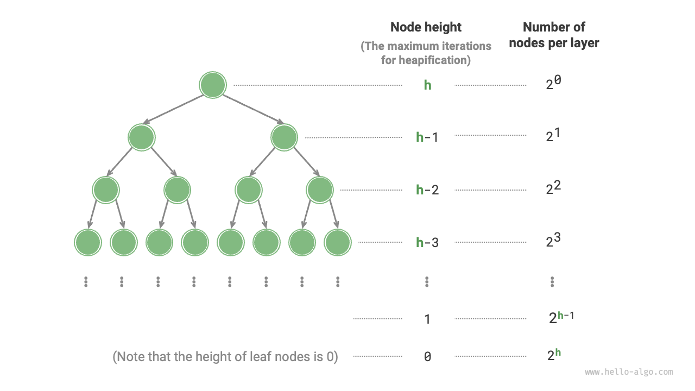

# 8.2 &nbsp; ヒープ構築

場合によっては、リスト内のすべての要素を使ってヒープを構築したいことがあります。この過程を「ヒープ構築」と呼びます。

## 8.2.1 &nbsp; ヒープへの挿入操作による実現

まず空のヒープを作成し、次にリストを走査して、各要素に対して順に「ヒープへの挿入操作」を実行します。つまり、要素をヒープの末尾に追加してから、その要素に対して「下から上へ」のヒープ化を行います。

要素が1つヒープに挿入されるたびに、ヒープの長さは1増加します。ノードは上から下へ順に二分木へ追加されるため、ヒープは「上から下へ」構築されます。

要素数を $n$ とすると、各要素のヒープへの挿入操作には $O(\log{n})$ の時間がかかるため、このヒープ構築法の時間計算量は $O(n \log n)$ です。

## 8.2.2 &nbsp; 走査によるヒープ化で実現

実際には、より効率的なヒープ構築法を実現でき、全体は2つの手順に分かれます。

1. リストのすべての要素をそのままヒープに追加します。この時点では、ヒープの性質はまだ満たされていません。
2. ヒープを逆順で走査し（レベル順走査の逆順）、各非葉ノードに対して順に「上から下へ」のヒープ化を実行します。

**あるノードをヒープ化するたびに、そのノードを根とする部分木は合法な部分ヒープになります**。また、逆順で走査するため、ヒープは「下から上へ」構築されます。

逆順走査を選ぶのは、この方法なら現在のノードの下にある部分木がすでに合法な部分ヒープであることを保証でき、そのうえで現在のノードをヒープ化してはじめて有効になるからです。

なお、**葉ノードには子ノードがないため、それ自体が自然に合法な部分ヒープであり、ヒープ化は不要です**。以下のコードが示すように、最後の非葉ノードは最後のノードの親ノードであり、そこから逆順に走査してヒープ化を実行します。

=== "Python"

    ```python title="my_heap.py"
    def __init__(self, nums: list[int]):
        """コンストラクタ。入力リストに基づいてヒープを構築する"""
        # リスト要素をそのままヒープに追加
        self.max_heap = nums
        # 葉ノード以外のすべてのノードをヒープ化
        for i in range(self.parent(self.size() - 1), -1, -1):
            self.sift_down(i)
    ```

=== "C++"

    ```cpp title="my_heap.cpp"
    /* コンストラクタ。入力リストに基づいてヒープを構築する */
    MaxHeap(vector<int> nums) {
        // リスト要素をそのままヒープに追加
        maxHeap = nums;
        // 葉ノード以外のすべてのノードをヒープ化
        for (int i = parent(size() - 1); i >= 0; i--) {
            siftDown(i);
        }
    }
    ```

=== "Java"

    ```java title="my_heap.java"
    /* コンストラクタ。入力リストに基づいてヒープを構築する */
    MaxHeap(List<Integer> nums) {
        // リスト要素をそのままヒープに追加
        maxHeap = new ArrayList<>(nums);
        // 葉ノード以外のすべてのノードをヒープ化
        for (int i = parent(size() - 1); i >= 0; i--) {
            siftDown(i);
        }
    }
    ```

=== "C#"

    ```csharp title="my_heap.cs"
    /* コンストラクタ。入力リストに基づいてヒープを構築 */
    MaxHeap(IEnumerable<int> nums) {
        // リスト要素をそのままヒープに追加
        maxHeap = new List<int>(nums);
        // 葉ノード以外のすべてのノードをヒープ化
        var size = Parent(this.Size() - 1);
        for (int i = size; i >= 0; i--) {
            SiftDown(i);
        }
    }
    ```

=== "Go"

    ```go title="my_heap.go"
    /* コンストラクタ。スライスからヒープを構築する */
    func newMaxHeap(nums []any) *maxHeap {
        // リスト要素をそのままヒープに追加
        h := &maxHeap{data: nums}
        for i := h.parent(len(h.data) - 1); i >= 0; i-- {
            // 葉ノード以外のすべてのノードをヒープ化
            h.siftDown(i)
        }
        return h
    }
    ```

=== "Swift"

    ```swift title="my_heap.swift"
    /* コンストラクタ。入力リストに基づいてヒープを構築する */
    init(nums: [Int]) {
        // リスト要素をそのままヒープに追加
        maxHeap = nums
        // 葉ノード以外のすべてのノードをヒープ化
        for i in (0 ... parent(i: size() - 1)).reversed() {
            siftDown(i: i)
        }
    }
    ```

=== "JS"

    ```javascript title="my_heap.js"
    /* コンストラクタ。空のヒープを作成するか、入力リストからヒープを構築する */
    constructor(nums) {
        // リスト要素をそのままヒープに追加
        this.#maxHeap = nums === undefined ? [] : [...nums];
        // 葉ノード以外のすべてのノードをヒープ化
        for (let i = this.#parent(this.size() - 1); i >= 0; i--) {
            this.#siftDown(i);
        }
    }
    ```

=== "TS"

    ```typescript title="my_heap.ts"
    /* コンストラクタ。空のヒープを作成するか、入力リストからヒープを構築する */
    constructor(nums?: number[]) {
        // リスト要素をそのままヒープに追加
        this.maxHeap = nums === undefined ? [] : [...nums];
        // 葉ノード以外のすべてのノードをヒープ化
        for (let i = this.parent(this.size() - 1); i >= 0; i--) {
            this.siftDown(i);
        }
    }
    ```

=== "Dart"

    ```dart title="my_heap.dart"
    /* コンストラクタ。入力リストに基づいてヒープを構築する */
    MaxHeap(List<int> nums) {
      // リスト要素をそのままヒープに追加
      _maxHeap = nums;
      // 葉ノード以外のすべてのノードをヒープ化
      for (int i = _parent(size() - 1); i >= 0; i--) {
        siftDown(i);
      }
    }
    ```

=== "Rust"

    ```rust title="my_heap.rs"
    /* コンストラクタ。入力リストに基づいてヒープを構築する */
    fn new(nums: Vec<i32>) -> Self {
        // リスト要素をそのままヒープに追加
        let mut heap = MaxHeap { max_heap: nums };
        // 葉ノード以外のすべてのノードをヒープ化
        for i in (0..=Self::parent(heap.size() - 1)).rev() {
            heap.sift_down(i);
        }
        heap
    }
    ```

=== "C"

    ```c title="my_heap.c"
    /* コンストラクタ。スライスからヒープを構築する */
    MaxHeap *newMaxHeap(int nums[], int size) {
        // すべての要素をヒープに入れる
        MaxHeap *maxHeap = (MaxHeap *)malloc(sizeof(MaxHeap));
        maxHeap->size = size;
        memcpy(maxHeap->data, nums, size * sizeof(int));
        for (int i = parent(maxHeap, size - 1); i >= 0; i--) {
            // 葉ノード以外のすべてのノードをヒープ化
            siftDown(maxHeap, i);
        }
        return maxHeap;
    }
    ```

=== "Kotlin"

    ```kotlin title="my_heap.kt"
    /* 最大ヒープ */
    class MaxHeap(nums: MutableList<Int>?) {
        // 配列ではなくリストを使うことで、拡張を考慮する必要がない
        private val maxHeap = mutableListOf<Int>()

        /* コンストラクタ。入力リストに基づいてヒープを構築する */
        init {
            // リスト要素をそのままヒープに追加
            maxHeap.addAll(nums!!)
            // 葉ノード以外のすべてのノードをヒープ化
            for (i in parent(size() - 1) downTo 0) {
                siftDown(i)
            }
        }

        /* 左子ノードのインデックスを取得 */
        private fun left(i: Int): Int {
            return 2 * i + 1
        }

        /* 右子ノードのインデックスを取得 */
        private fun right(i: Int): Int {
            return 2 * i + 2
        }

        /* 親ノードのインデックスを取得 */
        private fun parent(i: Int): Int {
            return (i - 1) / 2 // 切り捨て除算
        }

        /* 要素を交換 */
        private fun swap(i: Int, j: Int) {
            val temp = maxHeap[i]
            maxHeap[i] = maxHeap[j]
            maxHeap[j] = temp
        }

        /* ヒープのサイズを取得 */
        fun size(): Int {
            return maxHeap.size
        }

        /* ヒープが空かどうかを判定 */
        fun isEmpty(): Boolean {
            /* ヒープが空かどうかを判定 */
            return size() == 0
        }

        /* ヒープ先頭要素にアクセス */
        fun peek(): Int {
            return maxHeap[0]
        }

        /* 要素をヒープに追加 */
        fun push(_val: Int) {
            // ノードを追加
            maxHeap.add(_val)
            // 下から上へヒープ化
            siftUp(size() - 1)
        }

        /* ノード i から始めて、下から上へヒープ化 */
        private fun siftUp(it: Int) {
            // Kotlin の関数引数は不変のため、一時変数を作成する
            var i = it
            while (true) {
                // ノード i の親ノードを取得
                val p = parent(i)
                // 「根ノードを越えた」または「ノードの修復が不要」になったらヒープ化を終了
                if (p < 0 || maxHeap[i] <= maxHeap[p]) break
                // 2 つのノードを交換
                swap(i, p)
                // ループで下から上へヒープ化
                i = p
            }
        }

        /* 要素をヒープから取り出す */
        fun pop(): Int {
            // 空判定の処理
            if (isEmpty()) throw IndexOutOfBoundsException()
            // 根ノードと最も右の葉ノードを交換（先頭要素と末尾要素を交換）
            swap(0, size() - 1)
            // ノードを削除
            val _val = maxHeap.removeAt(size() - 1)
            // 上から下へヒープ化
            siftDown(0)
            // ヒープ先頭要素を返す
            return _val
        }

        /* ノード i から始めて、上から下へヒープ化 */
        private fun siftDown(it: Int) {
            // Kotlin の関数引数は不変のため、一時変数を作成する
            var i = it
            while (true) {
                // ノード i, l, r のうち値が最大のノードを ma とする
                val l = left(i)
                val r = right(i)
                var ma = i
                if (l < size() && maxHeap[l] > maxHeap[ma]) ma = l
                if (r < size() && maxHeap[r] > maxHeap[ma]) ma = r
                // ノード i が最大、またはインデックス l, r が範囲外なら、ヒープ化は不要なので抜ける
                if (ma == i) break
                // 2 つのノードを交換
                swap(i, ma)
                // ループで上から下へヒープ化
                i = ma
            }
        }

        /* ヒープ（二分木）を出力 */
        fun print() {
            val queue = PriorityQueue { a: Int, b: Int -> b - a }
            queue.addAll(maxHeap)
            printHeap(queue)
        }
    }
    ```

=== "Ruby"

    ```ruby title="my_heap.rb"
    ### コンストラクタ。入力リストに基づいてヒープを構築 ###
    def initialize(nums)
      # リスト要素をそのままヒープに追加
      @max_heap = nums
      # 葉ノード以外のすべてのノードをヒープ化
      parent(size - 1).downto(0) do |i|
        sift_down(i)
      end
    end
    ```

??? pythontutor "コードの可視化"

    <div style="height: 549px; width: 100%;"><iframe class="pythontutor-iframe" src="https://pythontutor.com/iframe-embed.html#code=class%20MaxHeap%3A%0A%20%20%20%20%22%22%22%E6%9C%80%E5%A4%A7%E3%83%92%E3%83%BC%E3%83%97%22%22%22%0A%0A%20%20%20%20def%20__init__%28self%2C%20nums%3A%20list%5Bint%5D%29%3A%0A%20%20%20%20%20%20%20%20%22%22%22%E3%82%B3%E3%83%B3%E3%82%B9%E3%83%88%E3%83%A9%E3%82%AF%E3%82%BF%E3%80%82%E5%85%A5%E5%8A%9B%E3%83%AA%E3%82%B9%E3%83%88%E3%81%AB%E5%9F%BA%E3%81%A5%E3%81%84%E3%81%A6%E3%83%92%E3%83%BC%E3%83%97%E3%82%92%E6%A7%8B%E7%AF%89%E3%81%99%E3%82%8B%22%22%22%0A%20%20%20%20%20%20%20%20%23%20%E3%83%AA%E3%82%B9%E3%83%88%E8%A6%81%E7%B4%A0%E3%82%92%E3%81%9D%E3%81%AE%E3%81%BE%E3%81%BE%E3%83%92%E3%83%BC%E3%83%97%E3%81%AB%E8%BF%BD%E5%8A%A0%0A%20%20%20%20%20%20%20%20self.max_heap%20%3D%20nums%0A%20%20%20%20%20%20%20%20%23%20%E8%91%89%E3%83%8E%E3%83%BC%E3%83%89%E4%BB%A5%E5%A4%96%E3%81%AE%E3%81%99%E3%81%B9%E3%81%A6%E3%81%AE%E3%83%8E%E3%83%BC%E3%83%89%E3%82%92%E3%83%92%E3%83%BC%E3%83%97%E5%8C%96%0A%20%20%20%20%20%20%20%20for%20i%20in%20range%28self.parent%28self.size%28%29%20-%201%29%2C%20-1%2C%20-1%29%3A%0A%20%20%20%20%20%20%20%20%20%20%20%20self.sift_down%28i%29%0A%0A%20%20%20%20def%20left%28self%2C%20i%3A%20int%29%20-%3E%20int%3A%0A%20%20%20%20%20%20%20%20%22%22%22%E5%B7%A6%E5%AD%90%E3%83%8E%E3%83%BC%E3%83%89%E3%81%AE%E3%82%A4%E3%83%B3%E3%83%87%E3%83%83%E3%82%AF%E3%82%B9%E3%82%92%E5%8F%96%E5%BE%97%22%22%22%0A%20%20%20%20%20%20%20%20return%202%20%2A%20i%20%2B%201%0A%0A%20%20%20%20def%20right%28self%2C%20i%3A%20int%29%20-%3E%20int%3A%0A%20%20%20%20%20%20%20%20%22%22%22%E5%8F%B3%E5%AD%90%E3%83%8E%E3%83%BC%E3%83%89%E3%81%AE%E3%82%A4%E3%83%B3%E3%83%87%E3%83%83%E3%82%AF%E3%82%B9%E3%82%92%E5%8F%96%E5%BE%97%22%22%22%0A%20%20%20%20%20%20%20%20return%202%20%2A%20i%20%2B%202%0A%0A%20%20%20%20def%20parent%28self%2C%20i%3A%20int%29%20-%3E%20int%3A%0A%20%20%20%20%20%20%20%20%22%22%22%E8%A6%AA%E3%83%8E%E3%83%BC%E3%83%89%E3%81%AE%E3%82%A4%E3%83%B3%E3%83%87%E3%83%83%E3%82%AF%E3%82%B9%E3%82%92%E5%8F%96%E5%BE%97%22%22%22%0A%20%20%20%20%20%20%20%20return%20%28i%20-%201%29%20%2F%2F%202%20%20%23%20%E5%88%87%E3%82%8A%E6%8D%A8%E3%81%A6%E9%99%A4%E7%AE%97%0A%0A%20%20%20%20def%20swap%28self%2C%20i%3A%20int%2C%20j%3A%20int%29%3A%0A%20%20%20%20%20%20%20%20%22%22%22%E8%A6%81%E7%B4%A0%E3%82%92%E4%BA%A4%E6%8F%9B%22%22%22%0A%20%20%20%20%20%20%20%20self.max_heap%5Bi%5D%2C%20self.max_heap%5Bj%5D%20%3D%20self.max_heap%5Bj%5D%2C%20self.max_heap%5Bi%5D%0A%0A%20%20%20%20def%20size%28self%29%20-%3E%20int%3A%0A%20%20%20%20%20%20%20%20%22%22%22%E3%83%92%E3%83%BC%E3%83%97%E3%81%AE%E3%82%B5%E3%82%A4%E3%82%BA%E3%82%92%E5%8F%96%E5%BE%97%22%22%22%0A%20%20%20%20%20%20%20%20return%20len%28self.max_heap%29%0A%0A%20%20%20%20def%20sift_down%28self%2C%20i%3A%20int%29%3A%0A%20%20%20%20%20%20%20%20%22%22%22%E3%83%8E%E3%83%BC%E3%83%89%20i%20%E3%81%8B%E3%82%89%E5%A7%8B%E3%82%81%E3%81%A6%E3%80%81%E4%B8%8A%E3%81%8B%E3%82%89%E4%B8%8B%E3%81%B8%E3%83%92%E3%83%BC%E3%83%97%E5%8C%96%22%22%22%0A%20%20%20%20%20%20%20%20while%20True%3A%0A%20%20%20%20%20%20%20%20%20%20%20%20%23%20%E3%83%8E%E3%83%BC%E3%83%89%20i%2C%20l%2C%20r%20%E3%81%AE%E3%81%86%E3%81%A1%E5%80%A4%E3%81%8C%E6%9C%80%E5%A4%A7%E3%81%AE%E3%83%8E%E3%83%BC%E3%83%89%E3%82%92%20ma%20%E3%81%A8%E3%81%99%E3%82%8B%0A%20%20%20%20%20%20%20%20%20%20%20%20l%2C%20r%2C%20ma%20%3D%20self.left%28i%29%2C%20self.right%28i%29%2C%20i%0A%20%20%20%20%20%20%20%20%20%20%20%20if%20l%20%3C%20self.size%28%29%20and%20self.max_heap%5Bl%5D%20%3E%20self.max_heap%5Bma%5D%3A%0A%20%20%20%20%20%20%20%20%20%20%20%20%20%20%20%20ma%20%3D%20l%0A%20%20%20%20%20%20%20%20%20%20%20%20if%20r%20%3C%20self.size%28%29%20and%20self.max_heap%5Br%5D%20%3E%20self.max_heap%5Bma%5D%3A%0A%20%20%20%20%20%20%20%20%20%20%20%20%20%20%20%20ma%20%3D%20r%0A%20%20%20%20%20%20%20%20%20%20%20%20%23%20%E3%83%8E%E3%83%BC%E3%83%89%20i%20%E3%81%8C%E6%9C%80%E5%A4%A7%E3%80%81%E3%81%BE%E3%81%9F%E3%81%AF%E3%82%A4%E3%83%B3%E3%83%87%E3%83%83%E3%82%AF%E3%82%B9%20l%2C%20r%20%E3%81%8C%E7%AF%84%E5%9B%B2%E5%A4%96%E3%81%AA%E3%82%89%E3%80%81%E3%83%92%E3%83%BC%E3%83%97%E5%8C%96%E3%81%AF%E4%B8%8D%E8%A6%81%E3%81%AA%E3%81%AE%E3%81%A7%E6%8A%9C%E3%81%91%E3%82%8B%0A%20%20%20%20%20%20%20%20%20%20%20%20if%20ma%20%3D%3D%20i%3A%0A%20%20%20%20%20%20%20%20%20%20%20%20%20%20%20%20break%0A%20%20%20%20%20%20%20%20%20%20%20%20%23%202%20%E3%81%A4%E3%81%AE%E3%83%8E%E3%83%BC%E3%83%89%E3%82%92%E4%BA%A4%E6%8F%9B%0A%20%20%20%20%20%20%20%20%20%20%20%20self.swap%28i%2C%20ma%29%0A%20%20%20%20%20%20%20%20%20%20%20%20%23%20%E3%83%AB%E3%83%BC%E3%83%97%E3%81%A7%E4%B8%8A%E3%81%8B%E3%82%89%E4%B8%8B%E3%81%B8%E3%83%92%E3%83%BC%E3%83%97%E5%8C%96%0A%20%20%20%20%20%20%20%20%20%20%20%20i%20%3D%20ma%0A%0A%0Aif%20__name__%20%3D%3D%20%22__main__%22%3A%0A%20%20%20%20%23%20%E6%9C%80%E5%A4%A7%E3%83%92%E3%83%BC%E3%83%97%E3%82%92%E5%88%9D%E6%9C%9F%E5%8C%96%0A%20%20%20%20max_heap%20%3D%20MaxHeap%28%5B1%2C%202%2C%203%2C%204%2C%205%5D%29&codeDivHeight=472&codeDivWidth=350&cumulative=false&curInstr=4&heapPrimitives=nevernest&origin=opt-frontend.js&py=311&rawInputLstJSON=%5B%5D&textReferences=false"> </iframe></div>
    <div style="margin-top: 5px;"><a href="https://pythontutor.com/iframe-embed.html#code=class%20MaxHeap%3A%0A%20%20%20%20%22%22%22%E6%9C%80%E5%A4%A7%E3%83%92%E3%83%BC%E3%83%97%22%22%22%0A%0A%20%20%20%20def%20__init__%28self%2C%20nums%3A%20list%5Bint%5D%29%3A%0A%20%20%20%20%20%20%20%20%22%22%22%E3%82%B3%E3%83%B3%E3%82%B9%E3%83%88%E3%83%A9%E3%82%AF%E3%82%BF%E3%80%82%E5%85%A5%E5%8A%9B%E3%83%AA%E3%82%B9%E3%83%88%E3%81%AB%E5%9F%BA%E3%81%A5%E3%81%84%E3%81%A6%E3%83%92%E3%83%BC%E3%83%97%E3%82%92%E6%A7%8B%E7%AF%89%E3%81%99%E3%82%8B%22%22%22%0A%20%20%20%20%20%20%20%20%23%20%E3%83%AA%E3%82%B9%E3%83%88%E8%A6%81%E7%B4%A0%E3%82%92%E3%81%9D%E3%81%AE%E3%81%BE%E3%81%BE%E3%83%92%E3%83%BC%E3%83%97%E3%81%AB%E8%BF%BD%E5%8A%A0%0A%20%20%20%20%20%20%20%20self.max_heap%20%3D%20nums%0A%20%20%20%20%20%20%20%20%23%20%E8%91%89%E3%83%8E%E3%83%BC%E3%83%89%E4%BB%A5%E5%A4%96%E3%81%AE%E3%81%99%E3%81%B9%E3%81%A6%E3%81%AE%E3%83%8E%E3%83%BC%E3%83%89%E3%82%92%E3%83%92%E3%83%BC%E3%83%97%E5%8C%96%0A%20%20%20%20%20%20%20%20for%20i%20in%20range%28self.parent%28self.size%28%29%20-%201%29%2C%20-1%2C%20-1%29%3A%0A%20%20%20%20%20%20%20%20%20%20%20%20self.sift_down%28i%29%0A%0A%20%20%20%20def%20left%28self%2C%20i%3A%20int%29%20-%3E%20int%3A%0A%20%20%20%20%20%20%20%20%22%22%22%E5%B7%A6%E5%AD%90%E3%83%8E%E3%83%BC%E3%83%89%E3%81%AE%E3%82%A4%E3%83%B3%E3%83%87%E3%83%83%E3%82%AF%E3%82%B9%E3%82%92%E5%8F%96%E5%BE%97%22%22%22%0A%20%20%20%20%20%20%20%20return%202%20%2A%20i%20%2B%201%0A%0A%20%20%20%20def%20right%28self%2C%20i%3A%20int%29%20-%3E%20int%3A%0A%20%20%20%20%20%20%20%20%22%22%22%E5%8F%B3%E5%AD%90%E3%83%8E%E3%83%BC%E3%83%89%E3%81%AE%E3%82%A4%E3%83%B3%E3%83%87%E3%83%83%E3%82%AF%E3%82%B9%E3%82%92%E5%8F%96%E5%BE%97%22%22%22%0A%20%20%20%20%20%20%20%20return%202%20%2A%20i%20%2B%202%0A%0A%20%20%20%20def%20parent%28self%2C%20i%3A%20int%29%20-%3E%20int%3A%0A%20%20%20%20%20%20%20%20%22%22%22%E8%A6%AA%E3%83%8E%E3%83%BC%E3%83%89%E3%81%AE%E3%82%A4%E3%83%B3%E3%83%87%E3%83%83%E3%82%AF%E3%82%B9%E3%82%92%E5%8F%96%E5%BE%97%22%22%22%0A%20%20%20%20%20%20%20%20return%20%28i%20-%201%29%20%2F%2F%202%20%20%23%20%E5%88%87%E3%82%8A%E6%8D%A8%E3%81%A6%E9%99%A4%E7%AE%97%0A%0A%20%20%20%20def%20swap%28self%2C%20i%3A%20int%2C%20j%3A%20int%29%3A%0A%20%20%20%20%20%20%20%20%22%22%22%E8%A6%81%E7%B4%A0%E3%82%92%E4%BA%A4%E6%8F%9B%22%22%22%0A%20%20%20%20%20%20%20%20self.max_heap%5Bi%5D%2C%20self.max_heap%5Bj%5D%20%3D%20self.max_heap%5Bj%5D%2C%20self.max_heap%5Bi%5D%0A%0A%20%20%20%20def%20size%28self%29%20-%3E%20int%3A%0A%20%20%20%20%20%20%20%20%22%22%22%E3%83%92%E3%83%BC%E3%83%97%E3%81%AE%E3%82%B5%E3%82%A4%E3%82%BA%E3%82%92%E5%8F%96%E5%BE%97%22%22%22%0A%20%20%20%20%20%20%20%20return%20len%28self.max_heap%29%0A%0A%20%20%20%20def%20sift_down%28self%2C%20i%3A%20int%29%3A%0A%20%20%20%20%20%20%20%20%22%22%22%E3%83%8E%E3%83%BC%E3%83%89%20i%20%E3%81%8B%E3%82%89%E5%A7%8B%E3%82%81%E3%81%A6%E3%80%81%E4%B8%8A%E3%81%8B%E3%82%89%E4%B8%8B%E3%81%B8%E3%83%92%E3%83%BC%E3%83%97%E5%8C%96%22%22%22%0A%20%20%20%20%20%20%20%20while%20True%3A%0A%20%20%20%20%20%20%20%20%20%20%20%20%23%20%E3%83%8E%E3%83%BC%E3%83%89%20i%2C%20l%2C%20r%20%E3%81%AE%E3%81%86%E3%81%A1%E5%80%A4%E3%81%8C%E6%9C%80%E5%A4%A7%E3%81%AE%E3%83%8E%E3%83%BC%E3%83%89%E3%82%92%20ma%20%E3%81%A8%E3%81%99%E3%82%8B%0A%20%20%20%20%20%20%20%20%20%20%20%20l%2C%20r%2C%20ma%20%3D%20self.left%28i%29%2C%20self.right%28i%29%2C%20i%0A%20%20%20%20%20%20%20%20%20%20%20%20if%20l%20%3C%20self.size%28%29%20and%20self.max_heap%5Bl%5D%20%3E%20self.max_heap%5Bma%5D%3A%0A%20%20%20%20%20%20%20%20%20%20%20%20%20%20%20%20ma%20%3D%20l%0A%20%20%20%20%20%20%20%20%20%20%20%20if%20r%20%3C%20self.size%28%29%20and%20self.max_heap%5Br%5D%20%3E%20self.max_heap%5Bma%5D%3A%0A%20%20%20%20%20%20%20%20%20%20%20%20%20%20%20%20ma%20%3D%20r%0A%20%20%20%20%20%20%20%20%20%20%20%20%23%20%E3%83%8E%E3%83%BC%E3%83%89%20i%20%E3%81%8C%E6%9C%80%E5%A4%A7%E3%80%81%E3%81%BE%E3%81%9F%E3%81%AF%E3%82%A4%E3%83%B3%E3%83%87%E3%83%83%E3%82%AF%E3%82%B9%20l%2C%20r%20%E3%81%8C%E7%AF%84%E5%9B%B2%E5%A4%96%E3%81%AA%E3%82%89%E3%80%81%E3%83%92%E3%83%BC%E3%83%97%E5%8C%96%E3%81%AF%E4%B8%8D%E8%A6%81%E3%81%AA%E3%81%AE%E3%81%A7%E6%8A%9C%E3%81%91%E3%82%8B%0A%20%20%20%20%20%20%20%20%20%20%20%20if%20ma%20%3D%3D%20i%3A%0A%20%20%20%20%20%20%20%20%20%20%20%20%20%20%20%20break%0A%20%20%20%20%20%20%20%20%20%20%20%20%23%202%20%E3%81%A4%E3%81%AE%E3%83%8E%E3%83%BC%E3%83%89%E3%82%92%E4%BA%A4%E6%8F%9B%0A%20%20%20%20%20%20%20%20%20%20%20%20self.swap%28i%2C%20ma%29%0A%20%20%20%20%20%20%20%20%20%20%20%20%23%20%E3%83%AB%E3%83%BC%E3%83%97%E3%81%A7%E4%B8%8A%E3%81%8B%E3%82%89%E4%B8%8B%E3%81%B8%E3%83%92%E3%83%BC%E3%83%97%E5%8C%96%0A%20%20%20%20%20%20%20%20%20%20%20%20i%20%3D%20ma%0A%0A%0Aif%20__name__%20%3D%3D%20%22__main__%22%3A%0A%20%20%20%20%23%20%E6%9C%80%E5%A4%A7%E3%83%92%E3%83%BC%E3%83%97%E3%82%92%E5%88%9D%E6%9C%9F%E5%8C%96%0A%20%20%20%20max_heap%20%3D%20MaxHeap%28%5B1%2C%202%2C%203%2C%204%2C%205%5D%29&codeDivHeight=800&codeDivWidth=600&cumulative=false&curInstr=4&heapPrimitives=nevernest&origin=opt-frontend.js&py=311&rawInputLstJSON=%5B%5D&textReferences=false" target="_blank" rel="noopener noreferrer">全画面で見る ></a></div>

## 8.2.3 &nbsp; 計算量の分析

以下では、2つ目のヒープ構築法の時間計算量を求めてみましょう。

- 完全二分木のノード数を $n$ とすると、葉ノード数は $(n + 1) / 2$ です。ここで $/$ は切り捨て除算を表します。したがって、ヒープ化が必要なノード数は $(n - 1) / 2$ です。
- 上から下へのヒープ化の過程では、各ノードは最大で葉ノードまでヒープ化されるため、最大反復回数は二分木の高さ $\log n$ です。

上の2つを掛け合わせると、ヒープ構築過程の時間計算量は $O(n \log n)$ となります。**しかし、この見積もりは正確ではありません。二分木では下層のノード数が上層よりはるかに多いという性質を考慮していないためです**。

次に、より正確な計算を行います。計算を簡単にするため、ノード数が $n$ 、高さが $h$ の「満二分木」を仮定します。この仮定は計算結果の正しさに影響しません。

{ class="animation-figure" }

<p align="center"> 図 8-5 &nbsp; 満二分木の各層のノード数 </p>

上図に示すように、ノードを「上から下へヒープ化」する最大反復回数は、そのノードから葉ノードまでの距離に等しく、この距離こそが「ノードの高さ」です。したがって、各層の「ノード数 $\times$ ノードの高さ」を合計すれば、**すべてのノードのヒープ化反復回数の総和**が得られます。

$$
T(h) = 2^0h + 2^1(h-1) + 2^2(h-2) + \dots + 2^{(h-1)}\times1
$$

上式を簡約するには中学の数列の知識を用います。まず $T(h)$ に $2$ を掛けると、次のようになります。

$$
\begin{aligned}
T(h) & = 2^0h + 2^1(h-1) + 2^2(h-2) + \dots + 2^{h-1}\times1 \newline
2 T(h) & = 2^1h + 2^2(h-1) + 2^3(h-2) + \dots + 2^{h}\times1 \newline
\end{aligned}
$$

ずらして引く方法を用い、下式の $2 T(h)$ から上式の $T(h)$ を引くと、次が得られます。

$$
2T(h) - T(h) = T(h) = -2^0h + 2^1 + 2^2 + \dots + 2^{h-1} + 2^h
$$

上式を見ると、$T(h)$ は等比数列であることがわかるため、和の公式を直接用いて、時間計算量は次のように求められます。

$$
\begin{aligned}
T(h) & = 2 \frac{1 - 2^h}{1 - 2} - h \newline
& = 2^{h+1} - h - 2 \newline
& = O(2^h)
\end{aligned}
$$

さらに、高さ $h$ の満二分木のノード数は $n = 2^{h+1} - 1$ であるため、計算量は容易に $O(2^h) = O(n)$ とわかります。以上の導出は、**入力リストからヒープを構築する時間計算量が $O(n)$ であり、非常に効率的である**ことを示しています。
