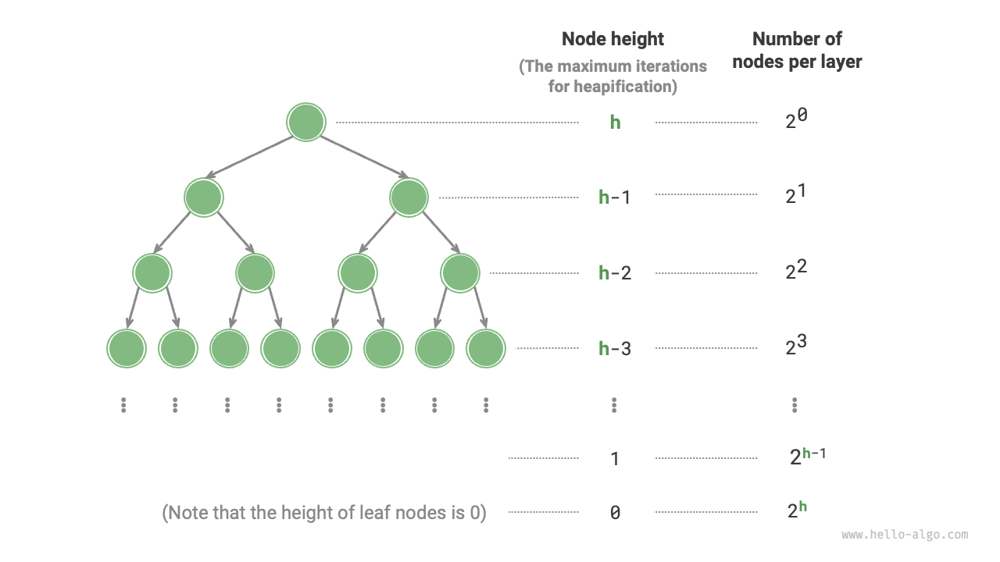

# ヒープ構築操作

場合によっては、リストのすべての要素を使用してヒープを構築したいことがあり、このプロセスは「ヒープ構築操作」として知られています。

## ヒープ挿入操作による実装

まず、空のヒープを作成し、次にリストを反復処理して、各要素に対して順番に「ヒープ挿入操作」を実行します。これは、要素をヒープの末尾に追加し、次に下から上に「ヒープ化」することを意味します。

ヒープに要素が追加されるたびに、ヒープの長さは1つずつ増加します。ノードは二分木に上から下に追加されるため、ヒープは「上から下に」構築されます。

要素数を$n$とすると、各要素の挿入操作は$O(\log{n})$時間かかるため、このヒープ構築方法の時間計算量は$O(n \log n)$です。

## 走査によるヒープ化の実装

実際には、2つのステップでより効率的なヒープ構築方法を実装できます。

1. リストのすべての要素をそのままヒープに追加します。この時点では、ヒープの性質はまだ満たされていません。
2. ヒープを逆順（レベル順走査の逆）で走査し、各非葉ノードに対して「上から下のヒープ化」を実行します。

**ノードをヒープ化した後、そのノードを根とする部分木は有効な部分ヒープになります**。走査が逆順であるため、ヒープは「下から上に」構築されます。

逆走査を選択する理由は、現在のノードの下の部分木がすでに有効な部分ヒープであることを保証し、現在のノードのヒープ化を効果的にするためです。

言及する価値があるのは、**葉ノードは子を持たないため、自然に有効な部分ヒープを形成し、ヒープ化する必要がない**ということです。以下のコードに示すように、最後の非葉ノードは最後のノードの親です。そこから開始して逆順に走査してヒープ化を実行します：

```src
[file]{my_heap}-[class]{max_heap}-[func]{__init__}
```

## 計算量分析

次に、この第2のヒープ構築方法の時間計算量を計算してみましょう。

- 完備二分木のノード数を$n$と仮定すると、葉ノードの数は$(n + 1) / 2$です。ここで$/$ は整数除算です。したがって、ヒープ化が必要なノードの数は$(n - 1) / 2$です。
- 「上から下のヒープ化」のプロセスでは、各ノードは最大で葉ノードまでヒープ化されるため、最大反復回数は二分木の高さ$\log n$です。

この2つを掛け合わせると、ヒープ構築プロセスの時間計算量は$O(n \log n)$となります。**しかし、この推定は正確ではありません。二分木の下位レベルには上位よりもはるかに多くのノードがあるという性質を考慮していないからです。**

より正確な計算を行いましょう。計算を簡素化するため、$n$個のノードと高さ$h$を持つ「完全二分木」を仮定します。この仮定は結果の正確性に影響しません。



上図に示すように、ノードが「上から下にヒープ化される」最大反復回数は、そのノードから葉ノードまでの距離と等しく、これは正確に「ノードの高さ」です。したがって、各レベルで「ノード数×ノードの高さ」を合計して、**すべてのノードの総ヒープ化反復回数を得る**ことができます。

$$
T(h) = 2^0h + 2^1(h-1) + 2^2(h-2) + \dots + 2^{(h-1)}\times1
$$

上記の方程式を簡素化するために、高校の数列の知識を使用する必要があります。まず$T(h)$に$2$を掛けて以下を得ます：

$$
\begin{aligned}
T(h) & = 2^0h + 2^1(h-1) + 2^2(h-2) + \dots + 2^{h-1}\times1 \newline
2T(h) & = 2^1h + 2^2(h-1) + 2^3(h-2) + \dots + 2^h\times1 \newline
\end{aligned}
$$

変位法を使用して$2T(h)$から$T(h)$を減算すると、以下を得ます：

$$
2T(h) - T(h) = T(h) = -2^0h + 2^1 + 2^2 + \dots + 2^{h-1} + 2^h
$$

方程式を観察すると、$T(h)$は等比数列であり、和の公式を使用して直接計算でき、時間計算量は以下になります：

$$
\begin{aligned}
T(h) & = 2 \frac{1 - 2^h}{1 - 2} - h \newline
& = 2^{h+1} - h - 2 \newline
& = O(2^h)
\end{aligned}
$$

さらに、高さ$h$の完全二分木は$n = 2^{h+1} - 1$個のノードを持つため、計算量は$O(2^h) = O(n)$です。この計算は、**リストを入力してヒープを構築する時間計算量が$O(n)$であり、非常に効率的である**ことを示しています。
