# 8.1 &nbsp; ヒープ

<u>ヒープ</u>は特定の条件を満たす完備二分木で、主に次の2つのタイプに分類されます（下図参照）。

- <u>最小ヒープ</u>：任意のノードの値 $\leq$ その子ノードの値。
- <u>最大ヒープ</u>：任意のノードの値 $\geq$ その子ノードの値。

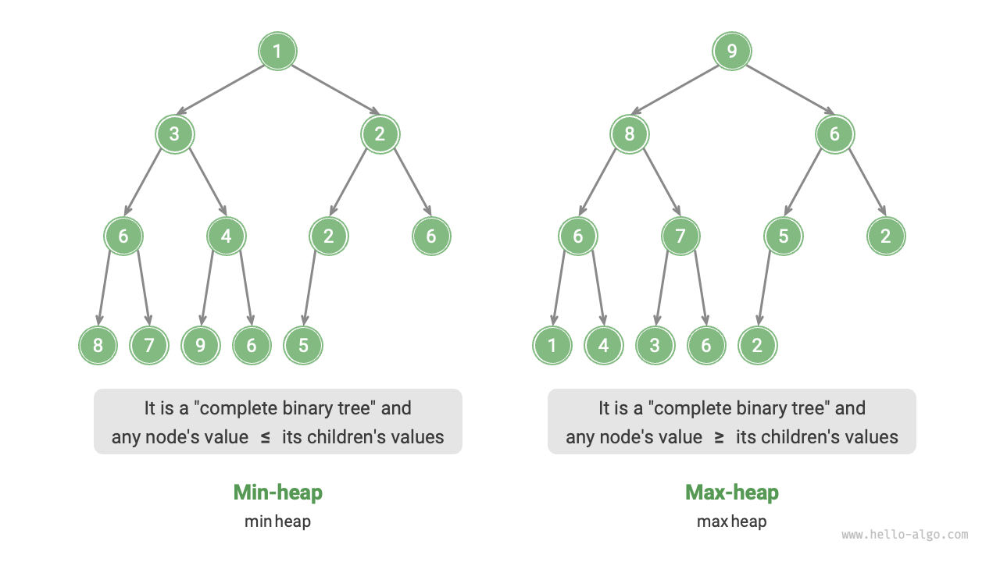{ class="animation-figure" }

<p align="center"> 図 8-1 &nbsp; 最小ヒープと最大ヒープ </p>

完備二分木の特別なケースとして、ヒープには以下の特性があります：

- 最下位層のノードは左から右に埋められ、他の層のノードは完全に埋められています。
- 二分木の根ノードをヒープの「先頭」と呼び、最も右下のノードをヒープの「末尾」と呼びます。
- 最大ヒープ（最小ヒープ）の場合、先頭要素（根）の値はすべての要素の中で最大（最小）です。

## 8.1.1 &nbsp; ヒープの一般的な操作

多くのプログラミング言語が<u>優先度キュー</u>を提供していることに注意してください。これは優先度付きソートを持つキューとして定義される抽象データ構造です。

実際には、**ヒープは優先度キューを実装するためによく使用されます。最大ヒープは、要素が降順でデキューされる優先度キューに対応します**。使用の観点から、「優先度キュー」と「ヒープ」を同等のデータ構造と考えることができます。したがって、この本では両者を特別に区別せず、統一して「ヒープ」と呼びます。

ヒープの一般的な操作を下表に示します。メソッド名はプログラミング言語によって異なる場合があります。

<p align="center"> 表 8-1 &nbsp; ヒープ操作の効率 </p>

<div class="center-table" markdown>

| メソッド名   | 説明                                               | 時間計算量   |
| ----------- | ------------------------------------------------- | ----------- |
| `push()`    | ヒープに要素を追加                                 | $O(\log n)$ |
| `pop()`     | ヒープから先頭要素を削除                           | $O(\log n)$ |
| `peek()`    | 先頭要素にアクセス（最大/最小ヒープの場合、最大/最小値） | $O(1)$      |
| `size()`    | ヒープ内の要素数を取得                             | $O(1)$      |
| `isEmpty()` | ヒープが空かどうかをチェック                       | $O(1)$      |

</div>

実際には、プログラミング言語によって提供されるヒープクラス（または優先度キュークラス）を直接使用できます。

ソートアルゴリズムで「昇順」と「降順」があるように、`flag`を設定するか`Comparator`を変更することで「最小ヒープ」と「最大ヒープ」を切り替えることができます。コードは以下の通りです：

=== "Python"

    ```python title="heap.py"
    # 最小ヒープの初期化
    min_heap, flag = [], 1
    # 最大ヒープの初期化
    max_heap, flag = [], -1

    # Pythonのheapqモジュールはデフォルトで最小ヒープを実装
    # 要素をヒープにプッシュする前に負の値にすることで、順序を反転させ、最大ヒープを実装
    # この例では、flag = 1は最小ヒープに対応し、flag = -1は最大ヒープに対応

    # ヒープに要素をプッシュ
    heapq.heappush(max_heap, flag * 1)
    heapq.heappush(max_heap, flag * 3)
    heapq.heappush(max_heap, flag * 2)
    heapq.heappush(max_heap, flag * 5)
    heapq.heappush(max_heap, flag * 4)

    # ヒープの先頭要素を取得
    peek: int = flag * max_heap[0] # 5

    # ヒープの先頭要素をポップ
    # ポップされた要素は降順のシーケンスを形成
    val = flag * heapq.heappop(max_heap) # 5
    val = flag * heapq.heappop(max_heap) # 4
    val = flag * heapq.heappop(max_heap) # 3
    val = flag * heapq.heappop(max_heap) # 2
    val = flag * heapq.heappop(max_heap) # 1

    # ヒープのサイズを取得
    size: int = len(max_heap)

    # ヒープが空かどうかをチェック
    is_empty: bool = not max_heap

    # リストからヒープを作成
    min_heap: list[int] = [1, 3, 2, 5, 4]
    heapq.heapify(min_heap)
    ```

=== "C++"

    ```cpp title="heap.cpp"
    /* ヒープの初期化 */
    // 最小ヒープの初期化
    priority_queue<int, vector<int>, greater<int>> minHeap;
    // 最大ヒープの初期化
    priority_queue<int, vector<int>, less<int>> maxHeap;

    /* ヒープに要素をプッシュ */
    maxHeap.push(1);
    maxHeap.push(3);
    maxHeap.push(2);
    maxHeap.push(5);
    maxHeap.push(4);

    /* ヒープの先頭要素を取得 */
    int peek = maxHeap.top(); // 5

    /* ヒープの先頭要素をポップ */
    // ポップされた要素は降順のシーケンスを形成
    maxHeap.pop(); // 5
    maxHeap.pop(); // 4
    maxHeap.pop(); // 3
    maxHeap.pop(); // 2
    maxHeap.pop(); // 1

    /* ヒープのサイズを取得 */
    int size = maxHeap.size();

    /* ヒープが空かどうかをチェック */
    bool isEmpty = maxHeap.empty();

    /* リストからヒープを作成 */
    vector<int> input{1, 3, 2, 5, 4};
    priority_queue<int, vector<int>, greater<int>> minHeap(input.begin(), input.end());
    ```

=== "Java"

    ```java title="heap.java"
    /* ヒープの初期化 */
    // 最小ヒープの初期化
    Queue<Integer> minHeap = new PriorityQueue<>();
    // 最大ヒープの初期化（ラムダ式でComparatorを変更するだけ）
    Queue<Integer> maxHeap = new PriorityQueue<>((a, b) -> b - a);

    /* ヒープに要素をプッシュ */
    maxHeap.offer(1);
    maxHeap.offer(3);
    maxHeap.offer(2);
    maxHeap.offer(5);
    maxHeap.offer(4);

    /* ヒープの先頭要素を取得 */
    int peek = maxHeap.peek(); // 5

    /* ヒープの先頭要素をポップ */
    // ポップされた要素は降順のシーケンスを形成
    peek = maxHeap.poll(); // 5
    peek = maxHeap.poll(); // 4
    peek = maxHeap.poll(); // 3
    peek = maxHeap.poll(); // 2
    peek = maxHeap.poll(); // 1

    /* ヒープのサイズを取得 */
    int size = maxHeap.size();

    /* ヒープが空かどうかをチェック */
    boolean isEmpty = maxHeap.isEmpty();

    /* リストからヒープを作成 */
    minHeap = new PriorityQueue<>(Arrays.asList(1, 3, 2, 5, 4));
    ```

=== "C#"

    ```csharp title="heap.cs"
    /* ヒープの初期化 */
    // 最小ヒープの初期化
    PriorityQueue<int, int> minHeap = new();
    // 最大ヒープの初期化（ラムダ式でComparatorを変更するだけ）
    PriorityQueue<int, int> maxHeap = new(Comparer<int>.Create((x, y) => y - x));

    /* ヒープに要素をプッシュ */
    maxHeap.Enqueue(1, 1);
    maxHeap.Enqueue(3, 3);
    maxHeap.Enqueue(2, 2);
    maxHeap.Enqueue(5, 5);
    maxHeap.Enqueue(4, 4);

    /* ヒープの先頭要素を取得 */
    int peek = maxHeap.Peek();//5

    /* ヒープの先頭要素をポップ */
    // ポップされた要素は降順のシーケンスを形成
    peek = maxHeap.Dequeue();  // 5
    peek = maxHeap.Dequeue();  // 4
    peek = maxHeap.Dequeue();  // 3
    peek = maxHeap.Dequeue();  // 2
    peek = maxHeap.Dequeue();  // 1

    /* ヒープのサイズを取得 */
    int size = maxHeap.Count;

    /* ヒープが空かどうかをチェック */
    bool isEmpty = maxHeap.Count == 0;

    /* リストからヒープを作成 */
    minHeap = new PriorityQueue<int, int>([(1, 1), (3, 3), (2, 2), (5, 5), (4, 4)]);
    ```

=== "Go"

    ```go title="heap.go"
    // Goでは、heap.Interfaceを実装することで整数の最大ヒープを構築できます
    // heap.Interfaceを実装するには、sort.Interfaceも実装する必要があります
    type intHeap []any

    // heap.InterfaceのPushメソッド、要素をヒープにプッシュ
    func (h *intHeap) Push(x any) {
        // PushとPopの両方でポインタレシーバーを使用
        // スライスの要素を調整するだけでなく、その長さも変更するため
        *h = append(*h, x.(int))
    }

    // heap.InterfaceのPopメソッド、ヒープの先頭要素を削除
    func (h *intHeap) Pop() any {
        // ヒープからポップする要素は末尾に格納
        last := (*h)[len(*h)-1]
        *h = (*h)[:len(*h)-1]
        return last
    }

    // sort.InterfaceのLenメソッド
    func (h *intHeap) Len() int {
        return len(*h)
    }

    // sort.InterfaceのLessメソッド
    func (h *intHeap) Less(i, j int) bool {
        // 最小ヒープを実装したい場合は、これを小なり比較に変更
        return (*h)[i].(int) > (*h)[j].(int)
    }

    // sort.InterfaceのSwapメソッド
    func (h *intHeap) Swap(i, j int) {
        (*h)[i], (*h)[j] = (*h)[j], (*h)[i]
    }

    // Top ヒープの先頭要素を取得
    func (h *intHeap) Top() any {
        return (*h)[0]
    }

    /* ドライバーコード */
    func TestHeap(t *testing.T) {
        /* ヒープの初期化 */
        // 最大ヒープの初期化
        maxHeap := &intHeap{}
        heap.Init(maxHeap)
        /* ヒープに要素をプッシュ */
        // heap.Interfaceのメソッドを呼び出して要素を追加
        heap.Push(maxHeap, 1)
        heap.Push(maxHeap, 3)
        heap.Push(maxHeap, 2)
        heap.Push(maxHeap, 4)
        heap.Push(maxHeap, 5)

        /* ヒープの先頭要素を取得 */
        top := maxHeap.Top()
        fmt.Printf("ヒープの先頭要素は %d\n", top)

        /* ヒープの先頭要素をポップ */
        // heap.Interfaceのメソッドを呼び出して要素を削除
        heap.Pop(maxHeap) // 5
        heap.Pop(maxHeap) // 4
        heap.Pop(maxHeap) // 3
        heap.Pop(maxHeap) // 2
        heap.Pop(maxHeap) // 1

        /* ヒープのサイズを取得 */
        size := len(*maxHeap)
        fmt.Printf("ヒープ内の要素数は %d\n", size)

        /* ヒープが空かどうかをチェック */
        isEmpty := len(*maxHeap) == 0
        fmt.Printf("ヒープは空ですか？ %t\n", isEmpty)
    }
    ```

=== "Swift"

    ```swift title="heap.swift"
    /* ヒープの初期化 */
    // SwiftのHeap型は最大ヒープと最小ヒープの両方をサポートし、swift-collectionsライブラリが必要
    var heap = Heap<Int>()

    /* ヒープに要素をプッシュ */
    heap.insert(1)
    heap.insert(3)
    heap.insert(2)
    heap.insert(5)
    heap.insert(4)

    /* ヒープの先頭要素を取得 */
    var peek = heap.max()!

    /* ヒープの先頭要素をポップ */
    peek = heap.removeMax() // 5
    peek = heap.removeMax() // 4
    peek = heap.removeMax() // 3
    peek = heap.removeMax() // 2
    peek = heap.removeMax() // 1

    /* ヒープのサイズを取得 */
    let size = heap.count

    /* ヒープが空かどうかをチェック */
    let isEmpty = heap.isEmpty

    /* リストからヒープを作成 */
    let heap2 = Heap([1, 3, 2, 5, 4])
    ```

=== "JS"

    ```javascript title="heap.js"
    // JavaScriptは組み込みのHeapクラスを提供していません
    ```

=== "TS"

    ```typescript title="heap.ts"
    // TypeScriptは組み込みのHeapクラスを提供していません
    ```

=== "Dart"

    ```dart title="heap.dart"
    // Dartは組み込みのHeapクラスを提供していません
    ```

=== "Rust"

    ```rust title="heap.rs"
    use std::collections::BinaryHeap;
    use std::cmp::Reverse;

    /* ヒープの初期化 */
    // 最小ヒープの初期化
    let mut min_heap = BinaryHeap::<Reverse<i32>>::new();
    // 最大ヒープの初期化
    let mut max_heap = BinaryHeap::new();

    /* ヒープに要素をプッシュ */
    max_heap.push(1);
    max_heap.push(3);
    max_heap.push(2);
    max_heap.push(5);
    max_heap.push(4);

    /* ヒープの先頭要素を取得 */
    let peek = max_heap.peek().unwrap();  // 5

    /* ヒープの先頭要素をポップ */
    // ポップされた要素は降順のシーケンスを形成
    let peek = max_heap.pop().unwrap();   // 5
    let peek = max_heap.pop().unwrap();   // 4
    let peek = max_heap.pop().unwrap();   // 3
    let peek = max_heap.pop().unwrap();   // 2
    let peek = max_heap.pop().unwrap();   // 1

    /* ヒープのサイズを取得 */
    let size = max_heap.len();

    /* ヒープが空かどうかをチェック */
    let is_empty = max_heap.is_empty();

    /* リストからヒープを作成 */
    let min_heap = BinaryHeap::from(vec![Reverse(1), Reverse(3), Reverse(2), Reverse(5), Reverse(4)]);
    ```

=== "C"

    ```c title="heap.c"
    // Cは組み込みのHeapクラスを提供していません
    ```

=== "Kotlin"

    ```kotlin title="heap.kt"
    /* ヒープの初期化 */
    // 最小ヒープの初期化
    var minHeap = PriorityQueue<Int>()
    // 最大ヒープの初期化（ラムダ式でComparatorを変更するだけ）
    val maxHeap = PriorityQueue { a: Int, b: Int -> b - a }

    /* ヒープに要素をプッシュ */
    maxHeap.offer(1)
    maxHeap.offer(3)
    maxHeap.offer(2)
    maxHeap.offer(5)
    maxHeap.offer(4)

    /* ヒープの先頭要素を取得 */
    var peek = maxHeap.peek() // 5

    /* ヒープの先頭要素をポップ */
    // ポップされた要素は降順のシーケンスを形成
    peek = maxHeap.poll() // 5
    peek = maxHeap.poll() // 4
    peek = maxHeap.poll() // 3
    peek = maxHeap.poll() // 2
    peek = maxHeap.poll() // 1

    /* ヒープのサイズを取得 */
    val size = maxHeap.size

    /* ヒープが空かどうかをチェック */
    val isEmpty = maxHeap.isEmpty()

    /* リストからヒープを作成 */
    minHeap = PriorityQueue(mutableListOf(1, 3, 2, 5, 4))
    ```

=== "Ruby"

    ```ruby title="heap.rb"

    ```

=== "Zig"

    ```zig title="heap.zig"

    ```

## 8.1.2 &nbsp; ヒープの実装

以下の実装は最大ヒープです。最小ヒープに変換するには、すべてのサイズ論理比較を反転させるだけです（例えば、$\geq$を$\leq$に置き換える）。興味のある読者は自分で実装することをお勧めします。

### 1. &nbsp; ヒープの格納と表現

「二分木」の節で述べたように、完備二分木は配列表現に非常に適しています。ヒープは完備二分木の一種なので、**配列を使用してヒープを格納します**。

配列を使用して二分木を表現する場合、要素はノード値を表し、インデックスは二分木内のノード位置を表します。**ノードポインタはインデックスマッピング公式を通じて実装されます**。

下図に示すように、インデックス$i$が与えられた場合、その左の子のインデックスは$2i + 1$、右の子のインデックスは$2i + 2$、親のインデックスは$(i - 1) / 2$（床除算）です。インデックスが範囲外の場合、nullノードまたはノードが存在しないことを意味します。

{ class="animation-figure" }

<p align="center"> 図 8-2 &nbsp; ヒープの表現と格納 </p>

後で便利に使用するため、インデックスマッピング公式を関数にカプセル化できます：

=== "Python"

    ```python title="my_heap.py"
    def left(self, i: int) -> int:
        """左の子ノードのインデックスを取得"""
        return 2 * i + 1

    def right(self, i: int) -> int:
        """右の子ノードのインデックスを取得"""
        return 2 * i + 2

    def parent(self, i: int) -> int:
        """親ノードのインデックスを取得"""
        return (i - 1) // 2  # 整数除算で切り下げ
    ```

=== "C++"

    ```cpp title="my_heap.cpp"
    /* 左の子ノードのインデックスを取得 */
    int left(int i) {
        return 2 * i + 1;
    }

    /* 右の子ノードのインデックスを取得 */
    int right(int i) {
        return 2 * i + 2;
    }

    /* 親ノードのインデックスを取得 */
    int parent(int i) {
        return (i - 1) / 2; // 整数除算で切り下げ
    }
    ```

=== "Java"

    ```java title="my_heap.java"
    /* 左の子ノードのインデックスを取得 */
    int left(int i) {
        return 2 * i + 1;
    }

    /* 右の子ノードのインデックスを取得 */
    int right(int i) {
        return 2 * i + 2;
    }

    /* 親ノードのインデックスを取得 */
    int parent(int i) {
        return (i - 1) / 2; // 整数除算で切り下げ
    }
    ```

=== "C#"

    ```csharp title="my_heap.cs"
    [class]{MaxHeap}-[func]{Left}

    [class]{MaxHeap}-[func]{Right}

    [class]{MaxHeap}-[func]{Parent}
    ```

=== "Go"

    ```go title="my_heap.go"
    [class]{maxHeap}-[func]{left}

    [class]{maxHeap}-[func]{right}

    [class]{maxHeap}-[func]{parent}
    ```

=== "Swift"

    ```swift title="my_heap.swift"
    [class]{MaxHeap}-[func]{left}

    [class]{MaxHeap}-[func]{right}

    [class]{MaxHeap}-[func]{parent}
    ```

=== "JS"

    ```javascript title="my_heap.js"
    [class]{MaxHeap}-[func]{left}

    [class]{MaxHeap}-[func]{right}

    [class]{MaxHeap}-[func]{parent}
    ```

=== "TS"

    ```typescript title="my_heap.ts"
    [class]{MaxHeap}-[func]{left}

    [class]{MaxHeap}-[func]{right}

    [class]{MaxHeap}-[func]{parent}
    ```

=== "Dart"

    ```dart title="my_heap.dart"
    [class]{MaxHeap}-[func]{_left}

    [class]{MaxHeap}-[func]{_right}

    [class]{MaxHeap}-[func]{_parent}
    ```

=== "Rust"

    ```rust title="my_heap.rs"
    [class]{MaxHeap}-[func]{left}

    [class]{MaxHeap}-[func]{right}

    [class]{MaxHeap}-[func]{parent}
    ```

=== "C"

    ```c title="my_heap.c"
    [class]{MaxHeap}-[func]{left}

    [class]{MaxHeap}-[func]{right}

    [class]{MaxHeap}-[func]{parent}
    ```

=== "Kotlin"

    ```kotlin title="my_heap.kt"
    [class]{MaxHeap}-[func]{left}

    [class]{MaxHeap}-[func]{right}

    [class]{MaxHeap}-[func]{parent}
    ```

=== "Ruby"

    ```ruby title="my_heap.rb"
    [class]{MaxHeap}-[func]{left}

    [class]{MaxHeap}-[func]{right}

    [class]{MaxHeap}-[func]{parent}
    ```

=== "Zig"

    ```zig title="my_heap.zig"
    [class]{MaxHeap}-[func]{left}

    [class]{MaxHeap}-[func]{right}

    [class]{MaxHeap}-[func]{parent}
    ```

### 2. &nbsp; ヒープの先頭要素へのアクセス

ヒープの先頭要素は二分木の根ノードで、リストの最初の要素でもあります：

=== "Python"

    ```python title="my_heap.py"
    def peek(self) -> int:
        """ヒープの先頭要素にアクセス"""
        return self.max_heap[0]
    ```

=== "C++"

    ```cpp title="my_heap.cpp"
    /* ヒープの先頭要素にアクセス */
    int peek() {
        return maxHeap[0];
    }
    ```

=== "Java"

    ```java title="my_heap.java"
    /* ヒープの先頭要素にアクセス */
    int peek() {
        return maxHeap.get(0);
    }
    ```

=== "C#"

    ```csharp title="my_heap.cs"
    [class]{MaxHeap}-[func]{Peek}
    ```

=== "Go"

    ```go title="my_heap.go"
    [class]{maxHeap}-[func]{peek}
    ```

=== "Swift"

    ```swift title="my_heap.swift"
    [class]{MaxHeap}-[func]{peek}
    ```

=== "JS"

    ```javascript title="my_heap.js"
    [class]{MaxHeap}-[func]{peek}
    ```

=== "TS"

    ```typescript title="my_heap.ts"
    [class]{MaxHeap}-[func]{peek}
    ```

=== "Dart"

    ```dart title="my_heap.dart"
    [class]{MaxHeap}-[func]{peek}
    ```

=== "Rust"

    ```rust title="my_heap.rs"
    [class]{MaxHeap}-[func]{peek}
    ```

=== "C"

    ```c title="my_heap.c"
    [class]{MaxHeap}-[func]{peek}
    ```

=== "Kotlin"

    ```kotlin title="my_heap.kt"
    [class]{MaxHeap}-[func]{peek}
    ```

=== "Ruby"

    ```ruby title="my_heap.rb"
    [class]{MaxHeap}-[func]{peek}
    ```

=== "Zig"

    ```zig title="my_heap.zig"
    [class]{MaxHeap}-[func]{peek}
    ```

### 3. &nbsp; ヒープへの要素挿入

要素`val`が与えられた場合、まずそれをヒープの底に追加します。追加後、`val`がヒープ内の他の要素より大きい可能性があるため、ヒープの完全性が損なわれる可能性があります。**したがって、挿入されたノードから根ノードまでのパスを修復する必要があります**。この操作は<u>ヒープ化</u>と呼ばれます。

挿入されたノードから開始して、**下から上にヒープ化を実行します**。下図に示すように、挿入されたノードの値をその親ノードと比較し、挿入されたノードが大きい場合はそれらを交換します。次にこの操作を続行し、根に到達するか、交換が不要なノードに遭遇するまで、下から上にヒープ内の各ノードを修復します。

=== "<1>"
    { class="animation-figure" }

=== "<2>"
    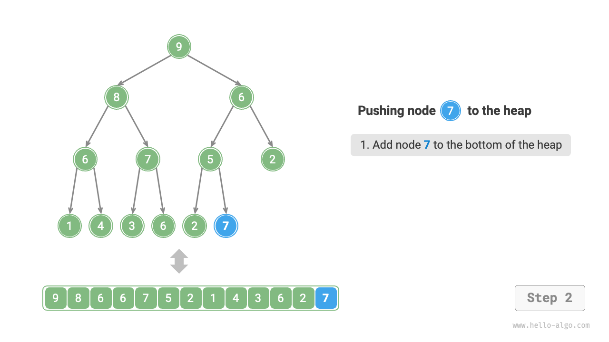{ class="animation-figure" }

=== "<3>"
    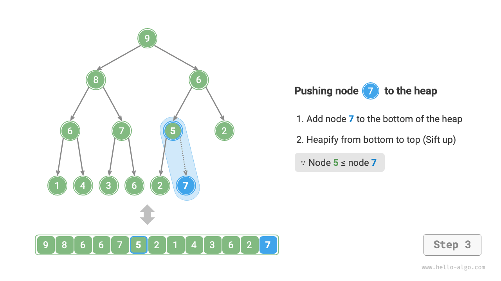{ class="animation-figure" }

=== "<4>"
    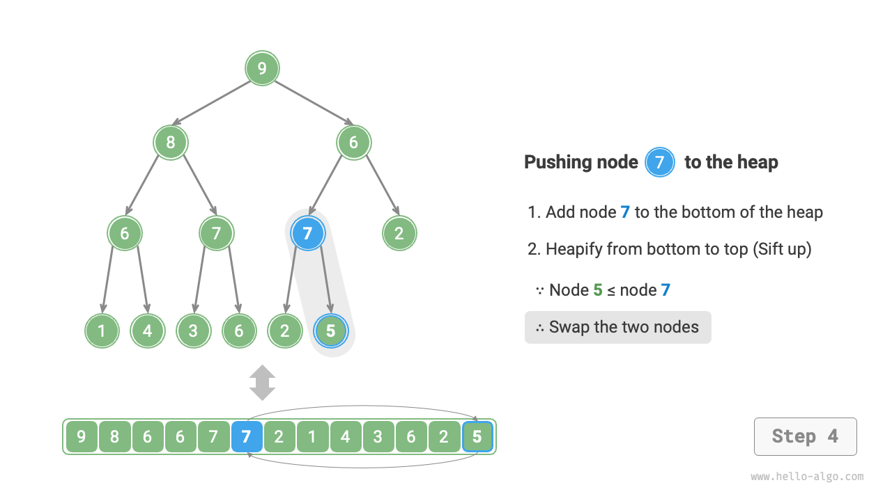{ class="animation-figure" }

=== "<5>"
    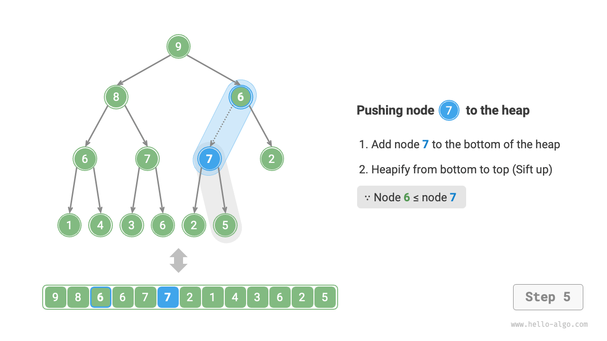{ class="animation-figure" }

=== "<6>"
    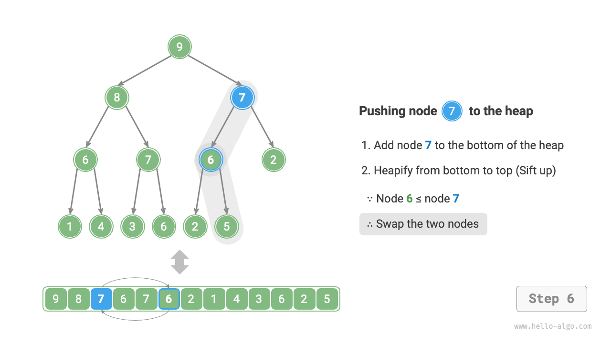{ class="animation-figure" }

=== "<7>"
    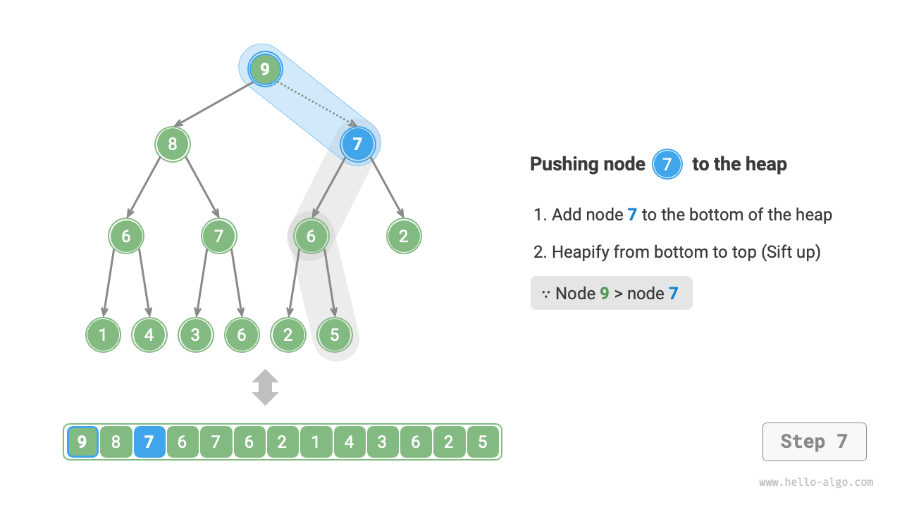{ class="animation-figure" }

=== "<8>"
    { class="animation-figure" }

=== "<9>"
    { class="animation-figure" }

<p align="center"> 図 8-3 &nbsp; ヒープへの要素挿入の手順 </p>

総ノード数を$n$とすると、木の高さは$O(\log n)$です。したがって、ヒープ化操作のループ反復回数は最大$O(\log n)$で、**要素挿入操作の時間計算量は$O(\log n)$になります**。コードは以下の通りです：

=== "Python"

    ```python title="my_heap.py"
    def push(self, val: int):
        """ヒープに要素をプッシュ"""
        # ノードを追加
        self.max_heap.append(val)
        # 下から上へヒープ化
        self.sift_up(self.size() - 1)

    def sift_up(self, i: int):
        """ノードiから開始して、下から上へヒープ化"""
        while True:
            # ノードiの親ノードを取得
            p = self.parent(i)
            # 「ルートノードを越える」または「ノードが修復不要」の場合、ヒープ化を終了
            if p < 0 or self.max_heap[i] <= self.max_heap[p]:
                break
            # 2つのノードを交換
            self.swap(i, p)
            # 上向きのループヒープ化
            i = p
    ```

=== "C++"

    ```cpp title="my_heap.cpp"
    /* ヒープに要素をプッシュ */
    void push(int val) {
        // ノードを追加
        maxHeap.push_back(val);
        // 下から上へヒープ化
        siftUp(size() - 1);
    }

    /* ノードiから上向きにヒープ化を開始 */
    void siftUp(int i) {
        while (true) {
            // ノードiの親ノードを取得
            int p = parent(i);
            // 「ルートノードを超える」または「ノードが修復不要」の場合、ヒープ化を終了
            if (p < 0 || maxHeap[i] <= maxHeap[p])
                break;
            // 2つのノードを交換
            swap(maxHeap[i], maxHeap[p]);
            // 上向きにループしてヒープ化
            i = p;
        }
    }
    ```

=== "Java"

    ```java title="my_heap.java"
    /* 要素をヒープにプッシュ */
    void push(int val) {
        // ノードを追加
        maxHeap.add(val);
        // 下から上へヒープ化
        siftUp(size() - 1);
    }

    /* ノード i から上向きにヒープ化を開始 */
    void siftUp(int i) {
        while (true) {
            // ノード i の親ノードを取得
            int p = parent(i);
            // 「根ノードを越える」または「ノードが修復不要」の場合、ヒープ化を終了
            if (p < 0 || maxHeap.get(i) <= maxHeap.get(p))
                break;
            // 2つのノードを交換
            swap(i, p);
            // 上向きにヒープ化をループ
            i = p;
        }
    }
    ```

=== "C#"

    ```csharp title="my_heap.cs"
    [class]{MaxHeap}-[func]{Push}

    [class]{MaxHeap}-[func]{SiftUp}
    ```

=== "Go"

    ```go title="my_heap.go"
    [class]{maxHeap}-[func]{push}

    [class]{maxHeap}-[func]{siftUp}
    ```

=== "Swift"

    ```swift title="my_heap.swift"
    [class]{MaxHeap}-[func]{push}

    [class]{MaxHeap}-[func]{siftUp}
    ```

=== "JS"

    ```javascript title="my_heap.js"
    [class]{MaxHeap}-[func]{push}

    [class]{MaxHeap}-[func]{siftUp}
    ```

=== "TS"

    ```typescript title="my_heap.ts"
    [class]{MaxHeap}-[func]{push}

    [class]{MaxHeap}-[func]{siftUp}
    ```

=== "Dart"

    ```dart title="my_heap.dart"
    [class]{MaxHeap}-[func]{push}

    [class]{MaxHeap}-[func]{siftUp}
    ```

=== "Rust"

    ```rust title="my_heap.rs"
    [class]{MaxHeap}-[func]{push}

    [class]{MaxHeap}-[func]{sift_up}
    ```

=== "C"

    ```c title="my_heap.c"
    [class]{MaxHeap}-[func]{push}

    [class]{MaxHeap}-[func]{siftUp}
    ```

=== "Kotlin"

    ```kotlin title="my_heap.kt"
    [class]{MaxHeap}-[func]{push}

    [class]{MaxHeap}-[func]{siftUp}
    ```

=== "Ruby"

    ```ruby title="my_heap.rb"
    [class]{MaxHeap}-[func]{push}

    [class]{MaxHeap}-[func]{sift_up}
    ```

=== "Zig"

    ```zig title="my_heap.zig"
    [class]{MaxHeap}-[func]{push}

    [class]{MaxHeap}-[func]{siftUp}
    ```

### 4. &nbsp; ヒープからの先頭要素削除

ヒープの先頭要素は二分木の根ノード、つまりリストの最初の要素です。リストから最初の要素を直接削除すると、二分木内のすべてのノードインデックスが変更され、後続の修復にヒープ化を使用することが困難になります。要素インデックスの変更を最小限に抑えるため、次の手順を使用します。

1. ヒープの先頭要素と底の要素を交換します（根ノードと最も右の葉ノードを交換）。
2. 交換後、リストからヒープの底を削除します（交換されているため、実際には元の先頭要素が削除される）。
3. 根ノードから開始して、**上から下にヒープ化を実行します**。

下図に示すように、**「上から下のヒープ化」の方向は「下から上のヒープ化」と反対です**。根ノードの値をその2つの子と比較し、最大の子と交換します。次に、葉ノードに到達するか、交換が不要なノードに遭遇するまで、この操作を繰り返します。

=== "<1>"
    { class="animation-figure" }

=== "<2>"
    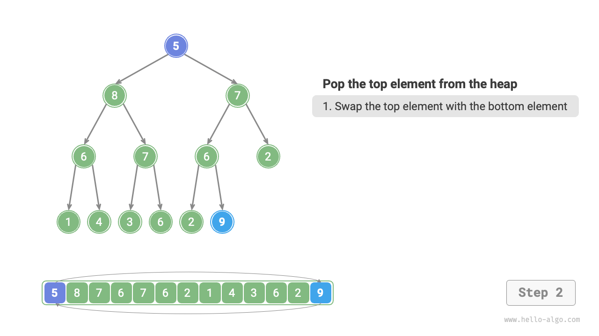{ class="animation-figure" }

=== "<3>"
    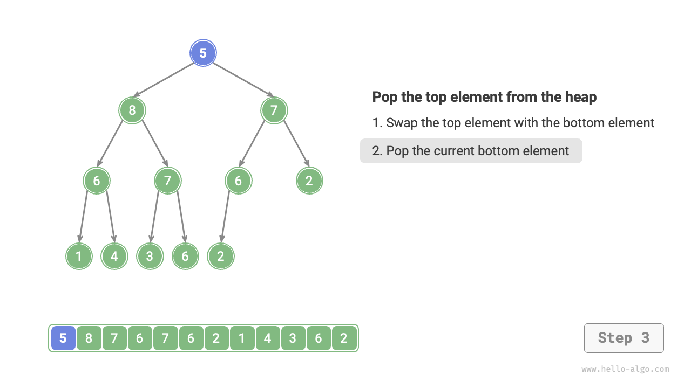{ class="animation-figure" }

=== "<4>"
    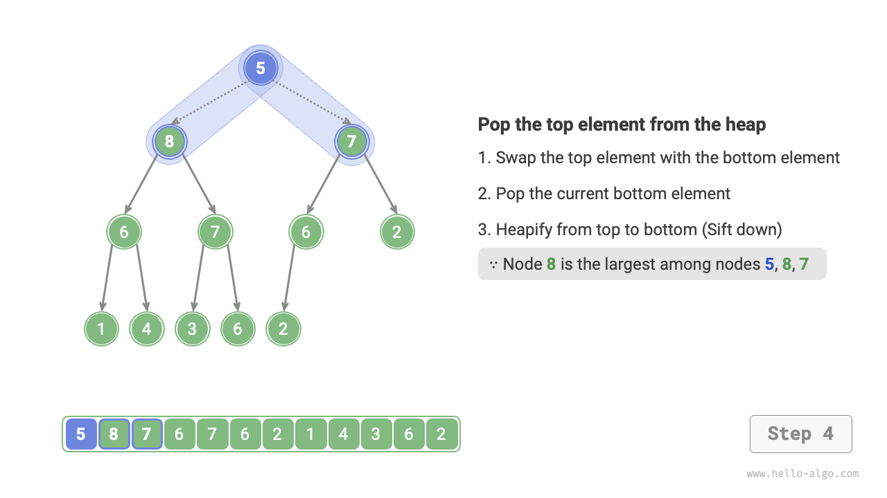{ class="animation-figure" }

=== "<5>"
    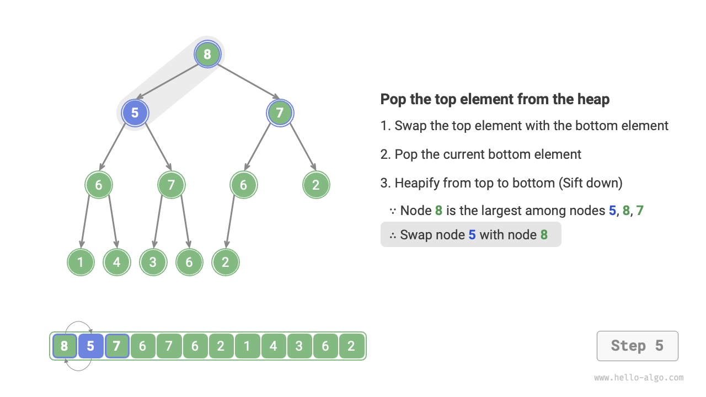{ class="animation-figure" }

=== "<6>"
    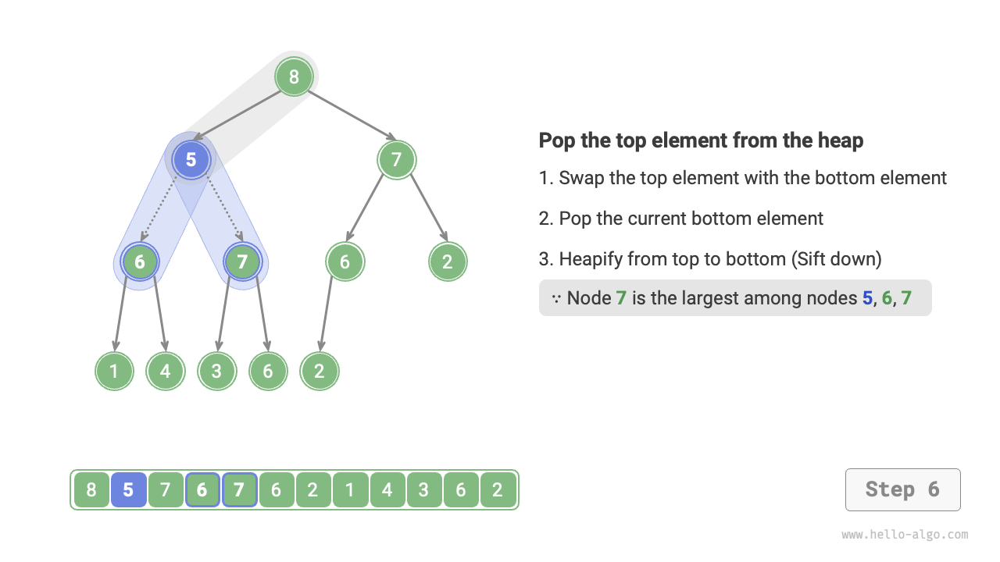{ class="animation-figure" }

=== "<7>"
    { class="animation-figure" }

=== "<8>"
    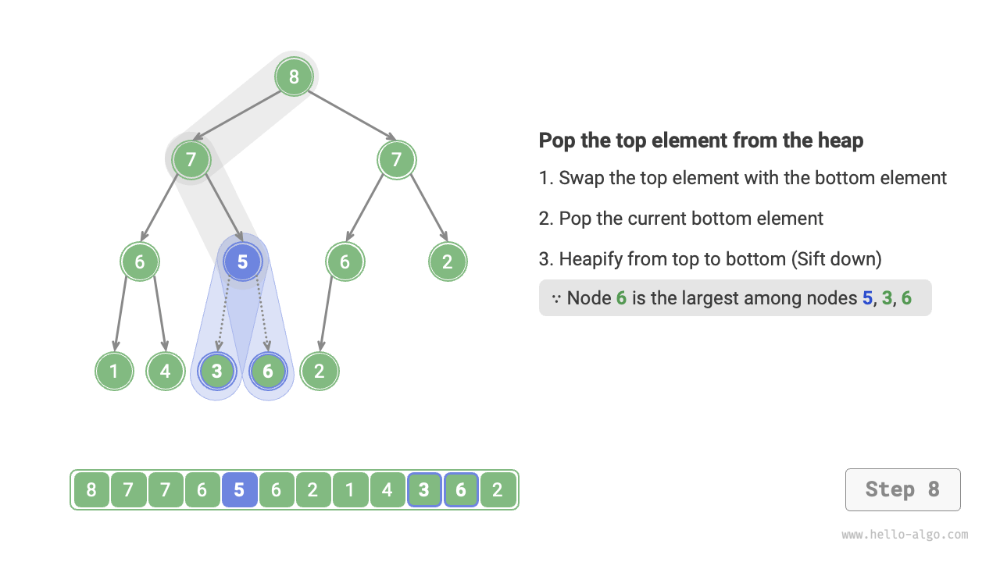{ class="animation-figure" }

=== "<9>"
    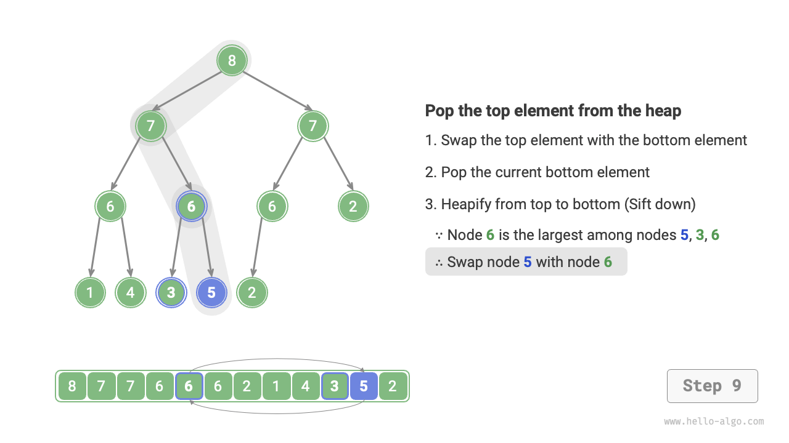{ class="animation-figure" }

=== "<10>"
    { class="animation-figure" }

<p align="center"> 図 8-4 &nbsp; ヒープからの先頭要素削除の手順 </p>

要素挿入操作と同様に、先頭要素削除操作の時間計算量も$O(\log n)$です。コードは以下の通りです：

=== "Python"

    ```python title="my_heap.py"
    def pop(self) -> int:
        """要素をヒープから出す"""
        # 空の処理
        if self.is_empty():
            raise IndexError("Heap is empty")
        # ルートノードと最右端の葉ノードを交換（最初の要素と最後の要素を交換）
        self.swap(0, self.size() - 1)
        # ノードを削除
        val = self.max_heap.pop()
        # 上から下へヒープ化
        self.sift_down(0)
        # ヒープの先頭要素を返す
        return val

    def sift_down(self, i: int):
        """ノードiから開始して、上から下へヒープ化"""
        while True:
            # i、l、rの中で最大のノードを決定し、maとする
            l, r, ma = self.left(i), self.right(i), i
            if l < self.size() and self.max_heap[l] > self.max_heap[ma]:
                ma = l
            if r < self.size() and self.max_heap[r] > self.max_heap[ma]:
                ma = r
            # ノードiが最大またはインデックスl、rが範囲外の場合、さらなるヒープ化は不要、ブレーク
            if ma == i:
                break
            # 2つのノードを交換
            self.swap(i, ma)
            # 下向きのループヒープ化
            i = ma
    ```

=== "C++"

    ```cpp title="my_heap.cpp"
    /* 要素がヒープから退出 */
    void pop() {
        // 空の処理
        if (isEmpty()) {
            throw out_of_range("Heap is empty");
        }
        // ルートノードを最も右の葉ノードと交換（最初の要素と最後の要素を交換）
        swap(maxHeap[0], maxHeap[size() - 1]);
        // ノードを削除
        maxHeap.pop_back();
        // 上から下へヒープ化
        siftDown(0);
    }

    /* ノードiから下向きにヒープ化を開始 */
    void siftDown(int i) {
        while (true) {
            // i、l、rの中で最大のノードを決定し、maとして記録
            int l = left(i), r = right(i), ma = i;
            if (l < size() && maxHeap[l] > maxHeap[ma])
                ma = l;
            if (r < size() && maxHeap[r] > maxHeap[ma])
                ma = r;
            // ノードiが最大、またはインデックスl、rが範囲外の場合、これ以上のヒープ化は不要、ブレーク
            if (ma == i)
                break;
            swap(maxHeap[i], maxHeap[ma]);
            // 下向きにループしてヒープ化
            i = ma;
        }
    }
    ```

=== "Java"

    ```java title="my_heap.java"
    /* 要素がヒープから退出 */
    int pop() {
        // 空の処理
        if (isEmpty())
            throw new IndexOutOfBoundsException();
        // 根ノードを最も右の葉ノードと交換（最初の要素を最後の要素と交換）
        swap(0, size() - 1);
        // ノードを削除
        int val = maxHeap.remove(size() - 1);
        // 上から下へヒープ化
        siftDown(0);
        // ヒープの先頭要素を返す
        return val;
    }

    /* ノード i から下向きにヒープ化を開始 */
    void siftDown(int i) {
        while (true) {
            // i、l、r の中で最大のノードを決定し、ma とする
            int l = left(i), r = right(i), ma = i;
            if (l < size() && maxHeap.get(l) > maxHeap.get(ma))
                ma = l;
            if (r < size() && maxHeap.get(r) > maxHeap.get(ma))
                ma = r;
            // ノード i が最大の場合、またはインデックス l、r が範囲外の場合、さらなるヒープ化は不要、終了
            if (ma == i)
                break;
            // 2つのノードを交換
            swap(i, ma);
            // 下向きにヒープ化をループ
            i = ma;
        }
    }
    ```

=== "C#"

    ```csharp title="my_heap.cs"
    [class]{MaxHeap}-[func]{Pop}

    [class]{MaxHeap}-[func]{SiftDown}
    ```

=== "Go"

    ```go title="my_heap.go"
    [class]{maxHeap}-[func]{pop}

    [class]{maxHeap}-[func]{siftDown}
    ```

=== "Swift"

    ```swift title="my_heap.swift"
    [class]{MaxHeap}-[func]{pop}

    [class]{MaxHeap}-[func]{siftDown}
    ```

=== "JS"

    ```javascript title="my_heap.js"
    [class]{MaxHeap}-[func]{pop}

    [class]{MaxHeap}-[func]{siftDown}
    ```

=== "TS"

    ```typescript title="my_heap.ts"
    [class]{MaxHeap}-[func]{pop}

    [class]{MaxHeap}-[func]{siftDown}
    ```

=== "Dart"

    ```dart title="my_heap.dart"
    [class]{MaxHeap}-[func]{pop}

    [class]{MaxHeap}-[func]{siftDown}
    ```

=== "Rust"

    ```rust title="my_heap.rs"
    [class]{MaxHeap}-[func]{pop}

    [class]{MaxHeap}-[func]{sift_down}
    ```

=== "C"

    ```c title="my_heap.c"
    [class]{MaxHeap}-[func]{pop}

    [class]{MaxHeap}-[func]{siftDown}
    ```

=== "Kotlin"

    ```kotlin title="my_heap.kt"
    [class]{MaxHeap}-[func]{pop}

    [class]{MaxHeap}-[func]{siftDown}
    ```

=== "Ruby"

    ```ruby title="my_heap.rb"
    [class]{MaxHeap}-[func]{pop}

    [class]{MaxHeap}-[func]{sift_down}
    ```

=== "Zig"

    ```zig title="my_heap.zig"
    [class]{MaxHeap}-[func]{pop}

    [class]{MaxHeap}-[func]{siftDown}
    ```

## 8.1.3 &nbsp; ヒープの一般的な応用

- **優先度キュー**：ヒープは優先度キューを実装するための好ましいデータ構造で、エンキュー操作とデキュー操作の両方の時間計算量が$O(\log n)$、キュー構築の時間計算量が$O(n)$で、すべて非常に効率的です。
- **ヒープソート**：データセットが与えられた場合、それらからヒープを作成し、次に要素削除操作を継続的に実行して順序付けされたデータを取得できます。ただし、ヒープソートを実装するより洗練された方法があり、「ヒープソート」の章で説明されています。
- **最大$k$個の要素の発見**：これは古典的なアルゴリズム問題であり、一般的な使用例でもあります。Weiboホット検索のトップ10ホットニュースの選択や、トップ10の売れ筋商品の選択などです。
