# Top-k問題

!!! question

    長さ$n$の順序付けられていない配列`nums`が与えられたとき、配列内の最大$k$個の要素を返してください。

この問題について、まず2つの直接的な解法を紹介し、次により効率的なヒープベースの方法を説明します。

## 方法1：反復選択

下図に示すように、$k$回の反復を実行し、各回で$1$番目、$2$番目、$\dots$、$k$番目に大きい要素を抽出できます。時間計算量は$O(nk)$です。

この方法は$k \ll n$の場合にのみ適しています。$k$が$n$に近い場合、時間計算量は$O(n^2)$に近づき、非常に時間がかかります。

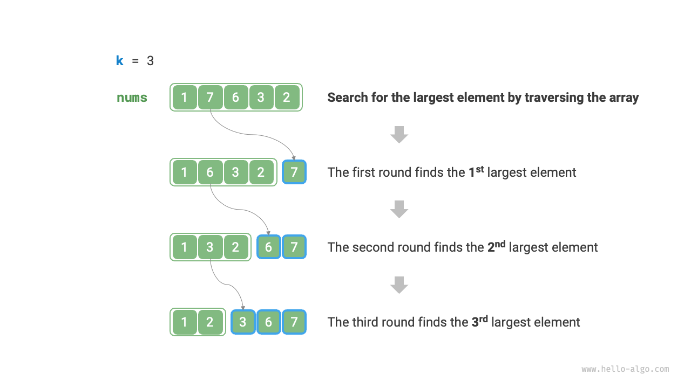

!!! tip

    $k = n$の場合、完全に順序付けられたシーケンスを得ることができ、これは「選択ソート」アルゴリズムと同等です。

## 方法2：ソート

下図に示すように、まず配列`nums`をソートし、次に最後の$k$個の要素を返すことができます。時間計算量は$O(n \log n)$です。

明らかに、この方法はタスクを「やりすぎ」ています。最大$k$個の要素を見つけるだけでよく、他の要素をソートする必要はありません。

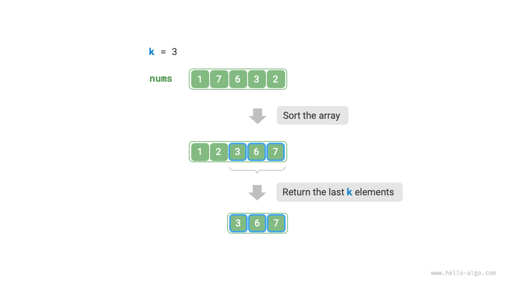

## 方法3：ヒープ

以下のプロセスに示すように、ヒープに基づいてTop-k問題をより効率的に解決できます。

1. 最小ヒープを初期化します。先頭要素が最小になります。
2. まず、配列の最初の$k$個の要素をヒープに挿入します。
3. $k + 1$番目の要素から開始し、現在の要素がヒープの先頭要素より大きい場合、ヒープの先頭要素を削除し、現在の要素をヒープに挿入します。
4. 走査を完了した後、ヒープには最大$k$個の要素が含まれています。

=== "<1>"
    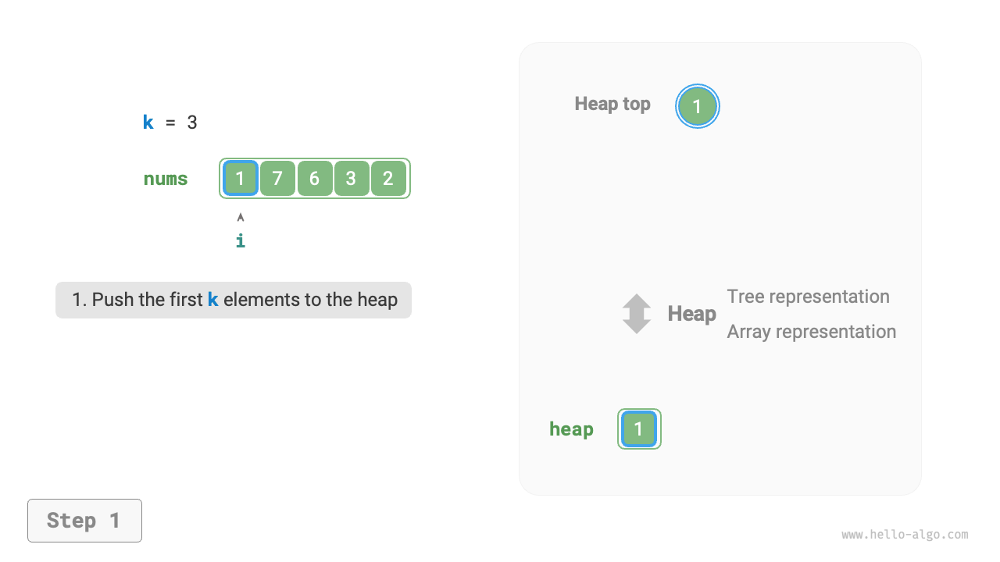

=== "<2>"
    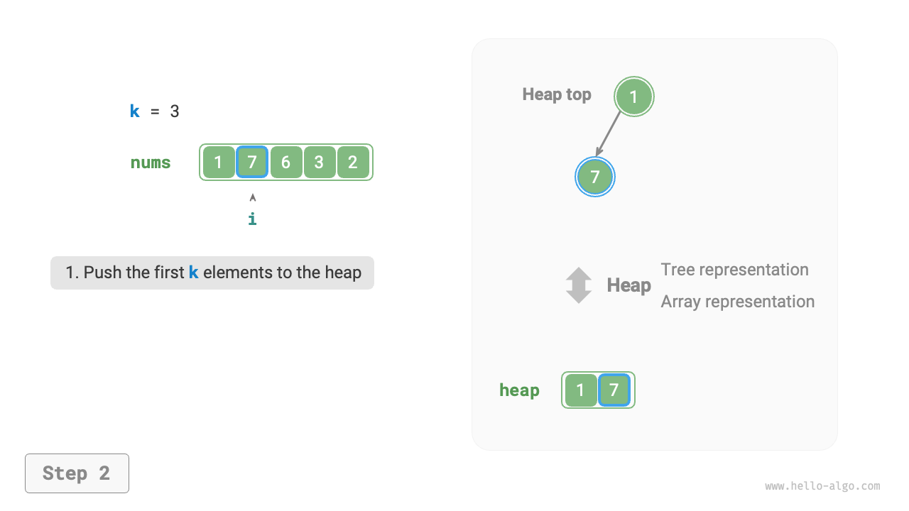

=== "<3>"
    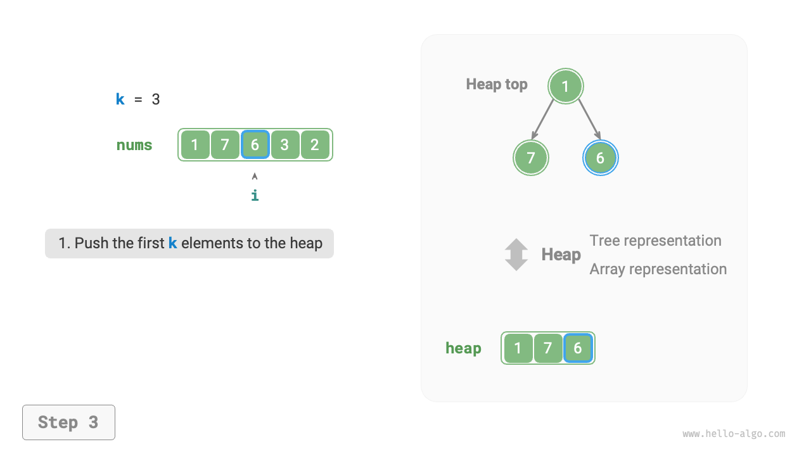

=== "<4>"
    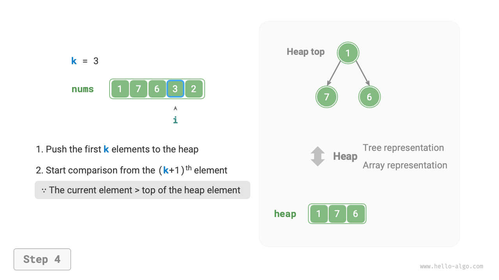

=== "<5>"
    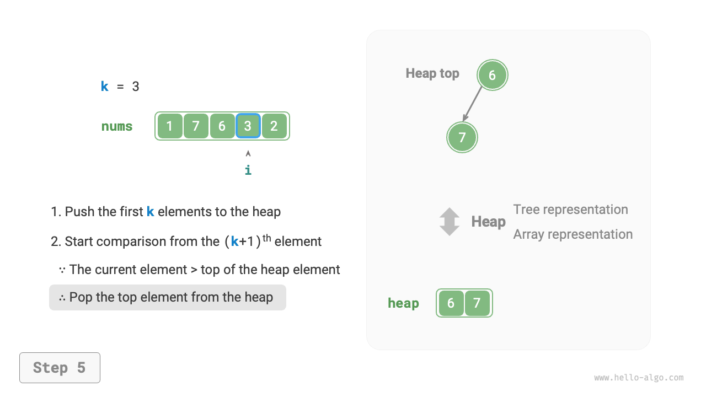

=== "<6>"
    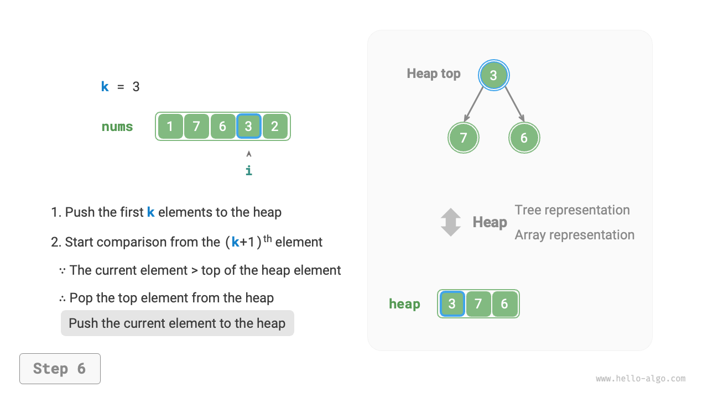

=== "<7>"
    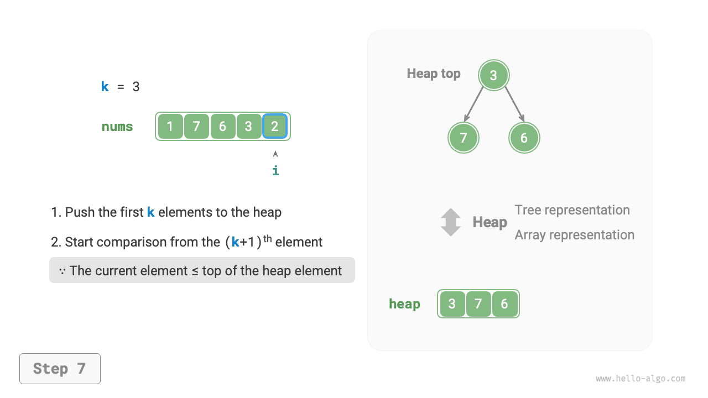

=== "<8>"
    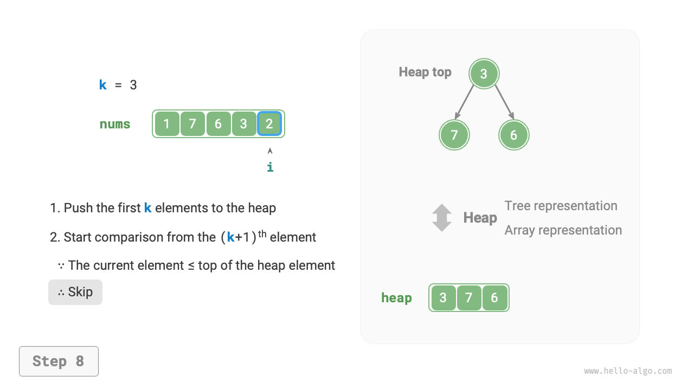

=== "<9>"
    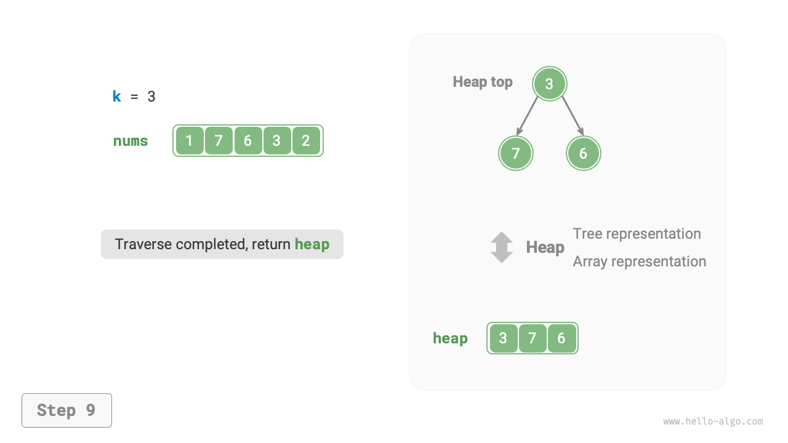

サンプルコードは以下の通りです：

```src
[file]{top_k}-[class]{}-[func]{top_k_heap}
```

合計$n$回のヒープ挿入と削除が実行され、最大ヒープサイズが$k$であるため、時間計算量は$O(n \log k)$です。この方法は非常に効率的で、$k$が小さい場合、時間計算量は$O(n)$に近づき、$k$が大きい場合でも、時間計算量は$O(n \log n)$を超えません。

さらに、この方法は動的データストリームのシナリオに適しています。データを継続的に追加することで、ヒープ内の要素を維持し、最大$k$個の要素の動的更新を実現できます。
