# 8.3 &nbsp; Top-k 問題

!!! question

    長さ $n$ の未整列配列 `nums` が与えられたとき、配列内で最大の $k$ 個の要素を返してください。

この問題について、まずは発想が比較的直接的な 2 つの解法を紹介し、その後でより効率の高いヒープ解法を紹介します。

## 8.3.1 &nbsp; 方法一：走査による選択

以下の図に示すように $k$ 回の走査を行い、各ラウンドでそれぞれ第 $1$、$2$、$\dots$、$k$ 位の要素を取り出すことができます。時間計算量は $O(nk)$ です。

この方法は $k \ll n$ の場合にしか適していません。$k$ が $n$ にかなり近いと、時間計算量は $O(n^2)$ に近づき、非常に時間がかかるためです。

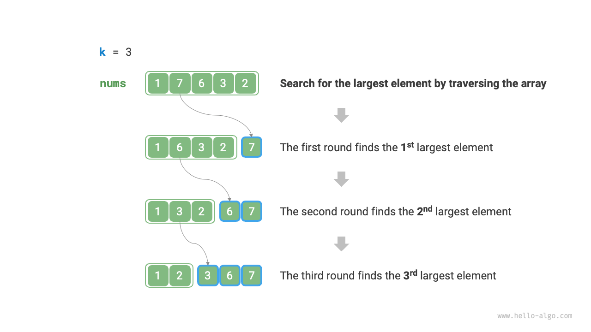{ class="animation-figure" }

<p align="center"> 図 8-6 &nbsp; 走査によって最大の k 個の要素を探す </p>

!!! tip

    $k = n$ のとき、完全な昇順列を得ることができ、この場合は「選択ソート」アルゴリズムと等価になります。

## 8.3.2 &nbsp; 方法二：ソート

以下の図に示すように、まず配列 `nums` をソートし、その後で右端の $k$ 個の要素を返すことができます。時間計算量は $O(n \log n)$ です。

明らかに、この方法は必要以上の処理を行っています。なぜなら、必要なのは最大の $k$ 個の要素を見つけることだけであり、他の要素をソートする必要はないからです。

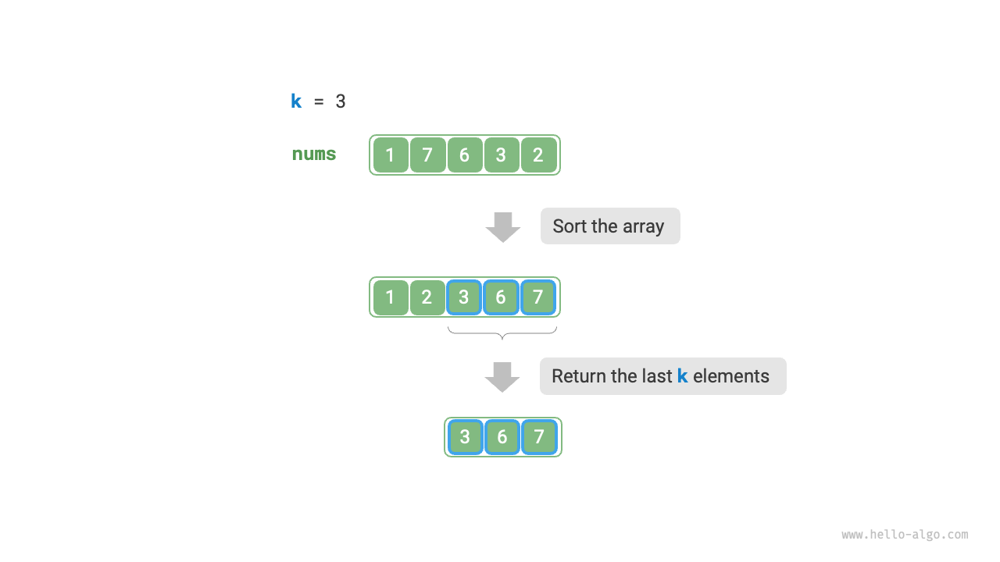{ class="animation-figure" }

<p align="center"> 図 8-7 &nbsp; ソートによって最大の k 個の要素を探す </p>

## 8.3.3 &nbsp; 方法三：ヒープ

ヒープを用いることで、Top-k 問題をより効率的に解くことができます。手順は以下の図のとおりです。

1. 最小ヒープを初期化し、そのヒープ頂点の要素が最小となるようにします。
2. まず配列の先頭 $k$ 個の要素を順にヒープへ挿入します。
3. $k + 1$ 番目の要素から開始し、現在の要素がヒープ頂点の要素より大きければ、ヒープ頂点の要素を取り出し、現在の要素をヒープへ挿入します。
4. 走査が完了した後、ヒープに保持されているのが最大の $k$ 個の要素です。

=== "<1>"
    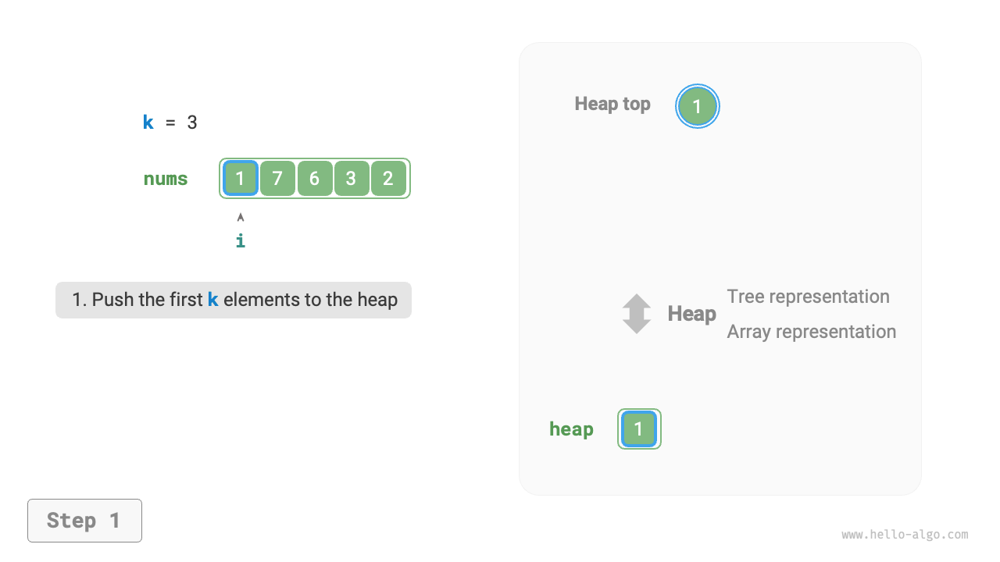{ class="animation-figure" }

=== "<2>"
    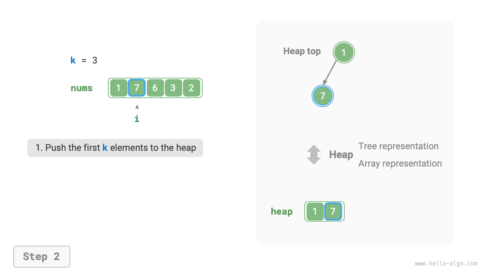{ class="animation-figure" }

=== "<3>"
    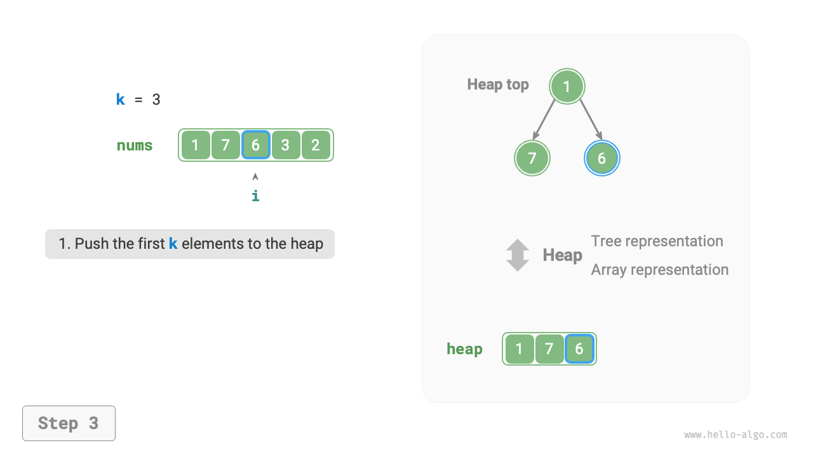{ class="animation-figure" }

=== "<4>"
    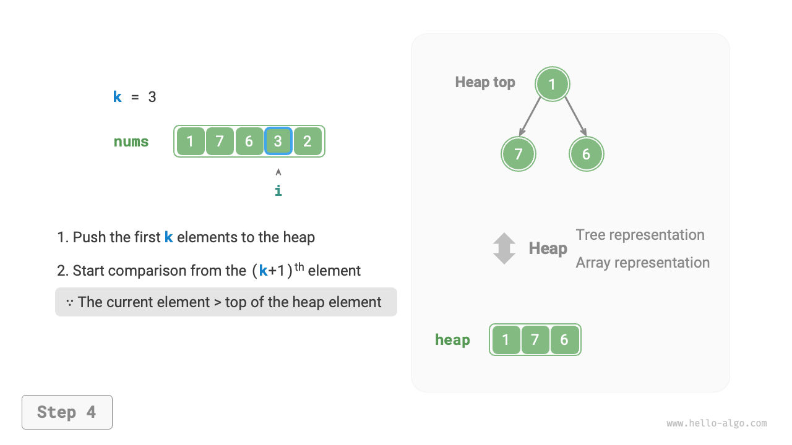{ class="animation-figure" }

=== "<5>"
    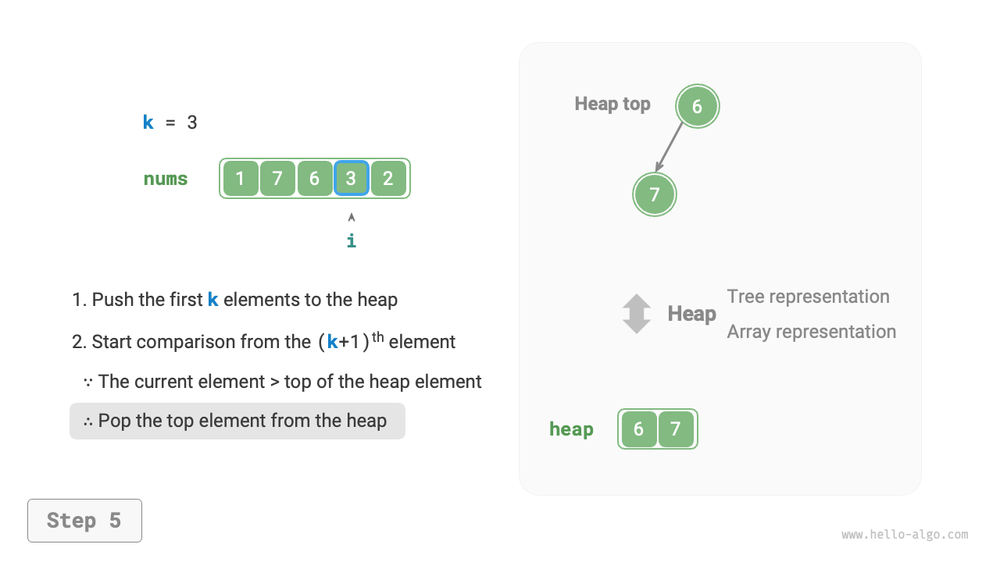{ class="animation-figure" }

=== "<6>"
    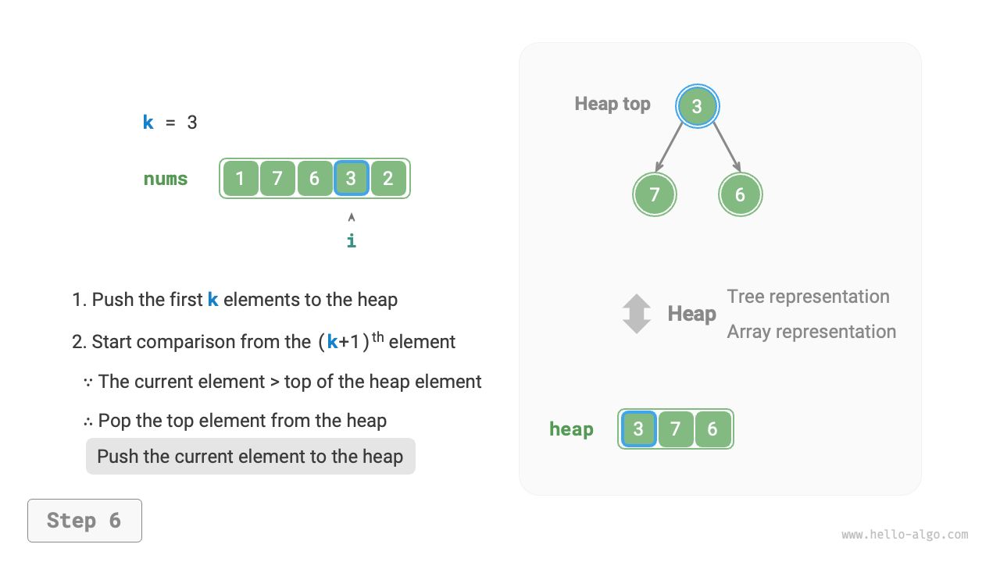{ class="animation-figure" }

=== "<7>"
    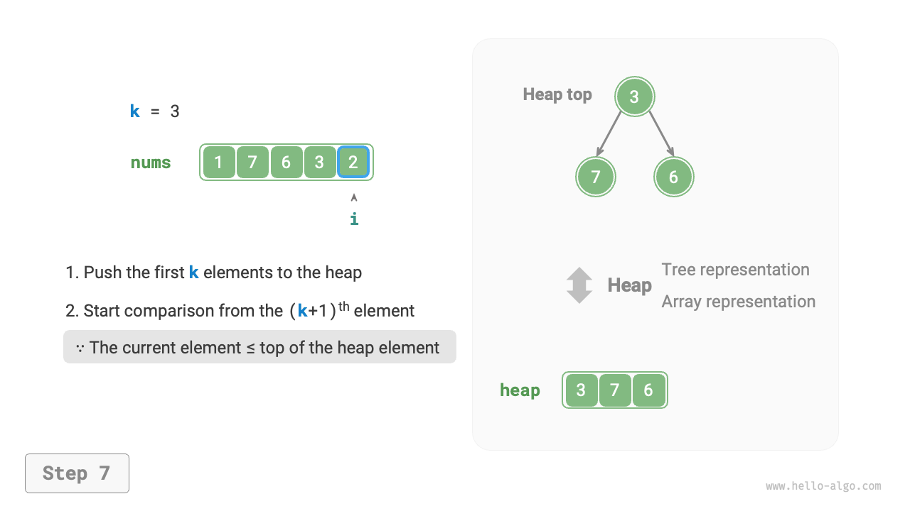{ class="animation-figure" }

=== "<8>"
    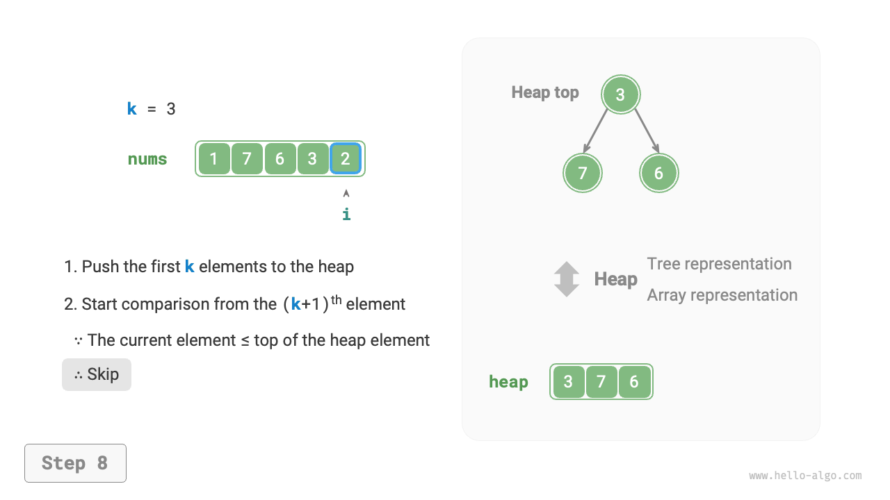{ class="animation-figure" }

=== "<9>"
    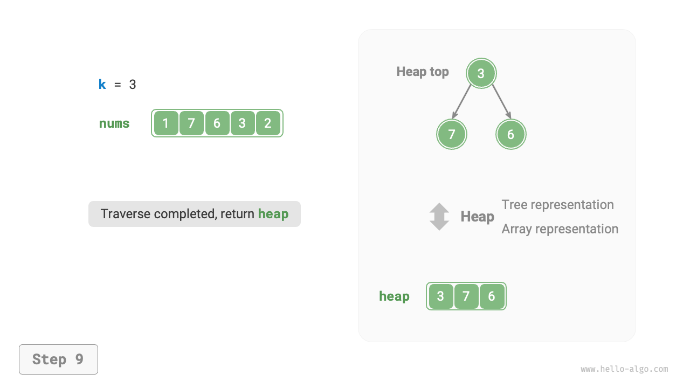{ class="animation-figure" }

<p align="center"> 図 8-8 &nbsp; ヒープに基づいて最大の k 個の要素を探す </p>

サンプルコードは以下のとおりです。

=== "Python"

    ```python title="top_k.py"
    def top_k_heap(nums: list[int], k: int) -> list[int]:
        """ヒープに基づいて配列中の最大の k 個の要素を探す"""
        # 最小ヒープを初期化
        heap = []
        # 配列の先頭 k 個の要素をヒープに追加
        for i in range(k):
            heapq.heappush(heap, nums[i])
        # k+1 番目の要素から開始し、ヒープ長を k に保つ
        for i in range(k, len(nums)):
            # 現在の要素がヒープ先頭より大きければ、ヒープ先頭を取り出して現在の要素を追加する
            if nums[i] > heap[0]:
                heapq.heappop(heap)
                heapq.heappush(heap, nums[i])
        return heap
    ```

=== "C++"

    ```cpp title="top_k.cpp"
    /* ヒープに基づいて配列中の最大の k 個の要素を探す */
    priority_queue<int, vector<int>, greater<int>> topKHeap(vector<int> &nums, int k) {
        // 最小ヒープを初期化
        priority_queue<int, vector<int>, greater<int>> heap;
        // 配列の先頭 k 個の要素をヒープに追加
        for (int i = 0; i < k; i++) {
            heap.push(nums[i]);
        }
        // k+1 番目の要素から開始し、ヒープ長を k に保つ
        for (int i = k; i < nums.size(); i++) {
            // 現在の要素がヒープ先頭より大きければ、ヒープ先頭を取り出して現在の要素を追加する
            if (nums[i] > heap.top()) {
                heap.pop();
                heap.push(nums[i]);
            }
        }
        return heap;
    }
    ```

=== "Java"

    ```java title="top_k.java"
    /* ヒープに基づいて配列中の最大の k 個の要素を探す */
    Queue<Integer> topKHeap(int[] nums, int k) {
        // 最小ヒープを初期化
        Queue<Integer> heap = new PriorityQueue<Integer>();
        // 配列の先頭 k 個の要素をヒープに追加
        for (int i = 0; i < k; i++) {
            heap.offer(nums[i]);
        }
        // k+1 番目の要素から開始し、ヒープ長を k に保つ
        for (int i = k; i < nums.length; i++) {
            // 現在の要素がヒープ先頭より大きければ、ヒープ先頭を取り出して現在の要素を追加する
            if (nums[i] > heap.peek()) {
                heap.poll();
                heap.offer(nums[i]);
            }
        }
        return heap;
    }
    ```

=== "C#"

    ```csharp title="top_k.cs"
    /* ヒープに基づいて配列中の最大の k 個の要素を探す */
    PriorityQueue<int, int> TopKHeap(int[] nums, int k) {
        // 最小ヒープを初期化
        PriorityQueue<int, int> heap = new();
        // 配列の先頭 k 個の要素をヒープに追加
        for (int i = 0; i < k; i++) {
            heap.Enqueue(nums[i], nums[i]);
        }
        // k+1 番目の要素から開始し、ヒープ長を k に保つ
        for (int i = k; i < nums.Length; i++) {
            // 現在の要素がヒープ先頭より大きければ、ヒープ先頭を取り出して現在の要素を追加する
            if (nums[i] > heap.Peek()) {
                heap.Dequeue();
                heap.Enqueue(nums[i], nums[i]);
            }
        }
        return heap;
    }
    ```

=== "Go"

    ```go title="top_k.go"
    /* ヒープに基づいて配列中の最大の k 個の要素を探す */
    func topKHeap(nums []int, k int) *minHeap {
        // 最小ヒープを初期化
        h := &minHeap{}
        heap.Init(h)
        // 配列の先頭 k 個の要素をヒープに追加
        for i := 0; i < k; i++ {
            heap.Push(h, nums[i])
        }
        // k+1 番目の要素から開始し、ヒープ長を k に保つ
        for i := k; i < len(nums); i++ {
            // 現在の要素がヒープ先頭より大きければ、ヒープ先頭を取り出して現在の要素を追加する
            if nums[i] > h.Top().(int) {
                heap.Pop(h)
                heap.Push(h, nums[i])
            }
        }
        return h
    }
    ```

=== "Swift"

    ```swift title="top_k.swift"
    /* ヒープに基づいて配列中の最大の k 個の要素を探す */
    func topKHeap(nums: [Int], k: Int) -> [Int] {
        // 最小ヒープを初期化し、先頭 k 個の要素でヒープを構築する
        var heap = Heap(nums.prefix(k))
        // k+1 番目の要素から開始し、ヒープ長を k に保つ
        for i in nums.indices.dropFirst(k) {
            // 現在の要素がヒープ先頭より大きければ、ヒープ先頭を取り出して現在の要素を追加する
            if nums[i] > heap.min()! {
                _ = heap.removeMin()
                heap.insert(nums[i])
            }
        }
        return heap.unordered
    }
    ```

=== "JS"

    ```javascript title="top_k.js"
    /* 要素をヒープに追加 */
    function pushMinHeap(maxHeap, val) {
        // 要素を反転する
        maxHeap.push(-val);
    }

    /* 要素をヒープから取り出す */
    function popMinHeap(maxHeap) {
        // 要素を反転する
        return -maxHeap.pop();
    }

    /* ヒープ先頭要素にアクセス */
    function peekMinHeap(maxHeap) {
        // 要素を反転する
        return -maxHeap.peek();
    }

    /* ヒープから要素を取り出す */
    function getMinHeap(maxHeap) {
        // 要素を反転する
        return maxHeap.getMaxHeap().map((num) => -num);
    }

    /* ヒープに基づいて配列中の最大の k 個の要素を探す */
    function topKHeap(nums, k) {
        // 最小ヒープを初期化する
        // 注意: ヒープ内の全要素を反転し、最大ヒープで最小ヒープをシミュレートする
        const maxHeap = new MaxHeap([]);
        // 配列の先頭 k 個の要素をヒープに追加
        for (let i = 0; i < k; i++) {
            pushMinHeap(maxHeap, nums[i]);
        }
        // k+1 番目の要素から開始し、ヒープ長を k に保つ
        for (let i = k; i < nums.length; i++) {
            // 現在の要素がヒープ先頭より大きければ、ヒープ先頭を取り出して現在の要素を追加する
            if (nums[i] > peekMinHeap(maxHeap)) {
                popMinHeap(maxHeap);
                pushMinHeap(maxHeap, nums[i]);
            }
        }
        // ヒープ内の要素を返す
        return getMinHeap(maxHeap);
    }
    ```

=== "TS"

    ```typescript title="top_k.ts"
    /* 要素をヒープに追加 */
    function pushMinHeap(maxHeap: MaxHeap, val: number): void {
        // 要素を反転する
        maxHeap.push(-val);
    }

    /* 要素をヒープから取り出す */
    function popMinHeap(maxHeap: MaxHeap): number {
        // 要素を反転する
        return -maxHeap.pop();
    }

    /* ヒープ先頭要素にアクセス */
    function peekMinHeap(maxHeap: MaxHeap): number {
        // 要素を反転する
        return -maxHeap.peek();
    }

    /* ヒープから要素を取り出す */
    function getMinHeap(maxHeap: MaxHeap): number[] {
        // 要素を反転する
        return maxHeap.getMaxHeap().map((num: number) => -num);
    }

    /* ヒープに基づいて配列中の最大の k 個の要素を探す */
    function topKHeap(nums: number[], k: number): number[] {
        // 最小ヒープを初期化する
        // 注意: ヒープ内の全要素を反転し、最大ヒープで最小ヒープをシミュレートする
        const maxHeap = new MaxHeap([]);
        // 配列の先頭 k 個の要素をヒープに追加
        for (let i = 0; i < k; i++) {
            pushMinHeap(maxHeap, nums[i]);
        }
        // k+1 番目の要素から開始し、ヒープ長を k に保つ
        for (let i = k; i < nums.length; i++) {
            // 現在の要素がヒープ先頭より大きければ、ヒープ先頭を取り出して現在の要素を追加する
            if (nums[i] > peekMinHeap(maxHeap)) {
                popMinHeap(maxHeap);
                pushMinHeap(maxHeap, nums[i]);
            }
        }
        // ヒープ内の要素を返す
        return getMinHeap(maxHeap);
    }
    ```

=== "Dart"

    ```dart title="top_k.dart"
    /* ヒープに基づいて配列中の最大の k 個の要素を探す */
    MinHeap topKHeap(List<int> nums, int k) {
      // 最小ヒープを初期化し、配列の先頭 k 個の要素をヒープに入れる
      MinHeap heap = MinHeap(nums.sublist(0, k));
      // k+1 番目の要素から開始し、ヒープ長を k に保つ
      for (int i = k; i < nums.length; i++) {
        // 現在の要素がヒープ先頭より大きければ、ヒープ先頭を取り出して現在の要素を追加する
        if (nums[i] > heap.peek()) {
          heap.pop();
          heap.push(nums[i]);
        }
      }
      return heap;
    }
    ```

=== "Rust"

    ```rust title="top_k.rs"
    /* ヒープに基づいて配列中の最大の k 個の要素を探す */
    fn top_k_heap(nums: Vec<i32>, k: usize) -> BinaryHeap<Reverse<i32>> {
        // BinaryHeap は最大ヒープであり、Reverse で要素の順序を反転することで最小ヒープを実現する
        let mut heap = BinaryHeap::<Reverse<i32>>::new();
        // 配列の先頭 k 個の要素をヒープに追加
        for &num in nums.iter().take(k) {
            heap.push(Reverse(num));
        }
        // k+1 番目の要素から開始し、ヒープ長を k に保つ
        for &num in nums.iter().skip(k) {
            // 現在の要素がヒープ先頭より大きければ、ヒープ先頭を取り出して現在の要素を追加する
            if num > heap.peek().unwrap().0 {
                heap.pop();
                heap.push(Reverse(num));
            }
        }
        heap
    }
    ```

=== "C"

    ```c title="top_k.c"
    /* 要素をヒープに追加 */
    void pushMinHeap(MaxHeap *maxHeap, int val) {
        // 要素を反転する
        push(maxHeap, -val);
    }

    /* 要素をヒープから取り出す */
    int popMinHeap(MaxHeap *maxHeap) {
        // 要素を反転する
        return -pop(maxHeap);
    }

    /* ヒープ先頭要素にアクセス */
    int peekMinHeap(MaxHeap *maxHeap) {
        // 要素を反転する
        return -peek(maxHeap);
    }

    /* ヒープから要素を取り出す */
    int *getMinHeap(MaxHeap *maxHeap) {
        // ヒープ内のすべての要素を反転して res 配列に格納
        int *res = (int *)malloc(maxHeap->size * sizeof(int));
        for (int i = 0; i < maxHeap->size; i++) {
            res[i] = -maxHeap->data[i];
        }
        return res;
    }

    /* ヒープから要素を取り出す */
    int *getMinHeap(MaxHeap *maxHeap) {
        // ヒープ内のすべての要素を反転して res 配列に格納
        int *res = (int *)malloc(maxHeap->size * sizeof(int));
        for (int i = 0; i < maxHeap->size; i++) {
            res[i] = -maxHeap->data[i];
        }
        return res;
    }

    // ヒープに基づいて配列中の最大の k 個の要素を求める関数
    int *topKHeap(int *nums, int sizeNums, int k) {
        // 最小ヒープを初期化する
        // 注意: ヒープ内の全要素を反転し、最大ヒープで最小ヒープをシミュレートする
        int *empty = (int *)malloc(0);
        MaxHeap *maxHeap = newMaxHeap(empty, 0);
        // 配列の先頭 k 個の要素をヒープに追加
        for (int i = 0; i < k; i++) {
            pushMinHeap(maxHeap, nums[i]);
        }
        // k+1 番目の要素から開始し、ヒープ長を k に保つ
        for (int i = k; i < sizeNums; i++) {
            // 現在の要素がヒープ先頭より大きければ、ヒープ先頭を取り出して現在の要素を追加する
            if (nums[i] > peekMinHeap(maxHeap)) {
                popMinHeap(maxHeap);
                pushMinHeap(maxHeap, nums[i]);
            }
        }
        int *res = getMinHeap(maxHeap);
        // メモリを解放する
        delMaxHeap(maxHeap);
        return res;
    }
    ```

=== "Kotlin"

    ```kotlin title="top_k.kt"
    /* ヒープに基づいて配列中の最大の k 個の要素を探す */
    fun topKHeap(nums: IntArray, k: Int): Queue<Int> {
        // 最小ヒープを初期化
        val heap = PriorityQueue<Int>()
        // 配列の先頭 k 個の要素をヒープに追加
        for (i in 0..<k) {
            heap.offer(nums[i])
        }
        // k+1 番目の要素から開始し、ヒープ長を k に保つ
        for (i in k..<nums.size) {
            // 現在の要素がヒープ先頭より大きければ、ヒープ先頭を取り出して現在の要素を追加する
            if (nums[i] > heap.peek()) {
                heap.poll()
                heap.offer(nums[i])
            }
        }
        return heap
    }
    ```

=== "Ruby"

    ```ruby title="top_k.rb"
    ### ヒープに基づいて配列中の最大 k 個の要素を探す ###
    def top_k_heap(nums, k)
      # 最小ヒープを初期化する
      # 注意: ヒープ内の全要素を反転し、最大ヒープで最小ヒープをシミュレートする
      max_heap = MaxHeap.new([])

      # 配列の先頭 k 個の要素をヒープに追加
      for i in 0...k
        push_min_heap(max_heap, nums[i])
      end

      # k+1 番目の要素から開始し、ヒープ長を k に保つ
      for i in k...nums.length
        # 現在の要素がヒープ先頭より大きければ、ヒープ先頭を取り出して現在の要素を追加する
        if nums[i] > peek_min_heap(max_heap)
          pop_min_heap(max_heap)
          push_min_heap(max_heap, nums[i])
        end
      end

      get_min_heap(max_heap)
    end
    ```

??? pythontutor "コードの可視化"

    <div style="height: 549px; width: 100%;"><iframe class="pythontutor-iframe" src="https://pythontutor.com/iframe-embed.html#code=import%20heapq%0A%0Adef%20top_k_heap%28nums%3A%20list%5Bint%5D%2C%20k%3A%20int%29%20-%3E%20list%5Bint%5D%3A%0A%20%20%20%20%22%22%22%E3%83%92%E3%83%BC%E3%83%97%E3%81%AB%E5%9F%BA%E3%81%A5%E3%81%84%E3%81%A6%E9%85%8D%E5%88%97%E4%B8%AD%E3%81%AE%E6%9C%80%E5%A4%A7%E3%81%AE%20k%20%E5%80%8B%E3%81%AE%E8%A6%81%E7%B4%A0%E3%82%92%E6%8E%A2%E3%81%99%22%22%22%0A%20%20%20%20%23%20%E6%9C%80%E5%B0%8F%E3%83%92%E3%83%BC%E3%83%97%E3%82%92%E5%88%9D%E6%9C%9F%E5%8C%96%0A%20%20%20%20heap%20%3D%20%5B%5D%0A%20%20%20%20%23%20%E9%85%8D%E5%88%97%E3%81%AE%E5%85%88%E9%A0%AD%20k%20%E5%80%8B%E3%81%AE%E8%A6%81%E7%B4%A0%E3%82%92%E3%83%92%E3%83%BC%E3%83%97%E3%81%AB%E8%BF%BD%E5%8A%A0%0A%20%20%20%20for%20i%20in%20range%28k%29%3A%0A%20%20%20%20%20%20%20%20heapq.heappush%28heap%2C%20nums%5Bi%5D%29%0A%20%20%20%20%23%20k%2B1%20%E7%95%AA%E7%9B%AE%E3%81%AE%E8%A6%81%E7%B4%A0%E3%81%8B%E3%82%89%E9%96%8B%E5%A7%8B%E3%81%97%E3%80%81%E3%83%92%E3%83%BC%E3%83%97%E9%95%B7%E3%82%92%20k%20%E3%81%AB%E4%BF%9D%E3%81%A4%0A%20%20%20%20for%20i%20in%20range%28k%2C%20len%28nums%29%29%3A%0A%20%20%20%20%20%20%20%20%23%20%E7%8F%BE%E5%9C%A8%E3%81%AE%E8%A6%81%E7%B4%A0%E3%81%8C%E3%83%92%E3%83%BC%E3%83%97%E5%85%88%E9%A0%AD%E3%82%88%E3%82%8A%E5%A4%A7%E3%81%8D%E3%81%91%E3%82%8C%E3%81%B0%E3%80%81%E3%83%92%E3%83%BC%E3%83%97%E5%85%88%E9%A0%AD%E3%82%92%E5%8F%96%E3%82%8A%E5%87%BA%E3%81%97%E3%81%A6%E7%8F%BE%E5%9C%A8%E3%81%AE%E8%A6%81%E7%B4%A0%E3%82%92%E8%BF%BD%E5%8A%A0%E3%81%99%E3%82%8B%0A%20%20%20%20%20%20%20%20if%20nums%5Bi%5D%20%3E%20heap%5B0%5D%3A%0A%20%20%20%20%20%20%20%20%20%20%20%20heapq.heappop%28heap%29%0A%20%20%20%20%20%20%20%20%20%20%20%20heapq.heappush%28heap%2C%20nums%5Bi%5D%29%0A%20%20%20%20return%20heap%0A%0Aif%20__name__%20%3D%3D%20%22__main__%22%3A%0A%20%20%20%20nums%20%3D%20%5B1%2C%207%2C%206%2C%203%2C%202%5D%0A%20%20%20%20k%20%3D%203%0A%0A%20%20%20%20res%20%3D%20top_k_heap%28nums%2C%20k%29&codeDivHeight=472&codeDivWidth=350&cumulative=false&curInstr=6&heapPrimitives=nevernest&origin=opt-frontend.js&py=311&rawInputLstJSON=%5B%5D&textReferences=false"> </iframe></div>
    <div style="margin-top: 5px;"><a href="https://pythontutor.com/iframe-embed.html#code=import%20heapq%0A%0Adef%20top_k_heap%28nums%3A%20list%5Bint%5D%2C%20k%3A%20int%29%20-%3E%20list%5Bint%5D%3A%0A%20%20%20%20%22%22%22%E3%83%92%E3%83%BC%E3%83%97%E3%81%AB%E5%9F%BA%E3%81%A5%E3%81%84%E3%81%A6%E9%85%8D%E5%88%97%E4%B8%AD%E3%81%AE%E6%9C%80%E5%A4%A7%E3%81%AE%20k%20%E5%80%8B%E3%81%AE%E8%A6%81%E7%B4%A0%E3%82%92%E6%8E%A2%E3%81%99%22%22%22%0A%20%20%20%20%23%20%E6%9C%80%E5%B0%8F%E3%83%92%E3%83%BC%E3%83%97%E3%82%92%E5%88%9D%E6%9C%9F%E5%8C%96%0A%20%20%20%20heap%20%3D%20%5B%5D%0A%20%20%20%20%23%20%E9%85%8D%E5%88%97%E3%81%AE%E5%85%88%E9%A0%AD%20k%20%E5%80%8B%E3%81%AE%E8%A6%81%E7%B4%A0%E3%82%92%E3%83%92%E3%83%BC%E3%83%97%E3%81%AB%E8%BF%BD%E5%8A%A0%0A%20%20%20%20for%20i%20in%20range%28k%29%3A%0A%20%20%20%20%20%20%20%20heapq.heappush%28heap%2C%20nums%5Bi%5D%29%0A%20%20%20%20%23%20k%2B1%20%E7%95%AA%E7%9B%AE%E3%81%AE%E8%A6%81%E7%B4%A0%E3%81%8B%E3%82%89%E9%96%8B%E5%A7%8B%E3%81%97%E3%80%81%E3%83%92%E3%83%BC%E3%83%97%E9%95%B7%E3%82%92%20k%20%E3%81%AB%E4%BF%9D%E3%81%A4%0A%20%20%20%20for%20i%20in%20range%28k%2C%20len%28nums%29%29%3A%0A%20%20%20%20%20%20%20%20%23%20%E7%8F%BE%E5%9C%A8%E3%81%AE%E8%A6%81%E7%B4%A0%E3%81%8C%E3%83%92%E3%83%BC%E3%83%97%E5%85%88%E9%A0%AD%E3%82%88%E3%82%8A%E5%A4%A7%E3%81%8D%E3%81%91%E3%82%8C%E3%81%B0%E3%80%81%E3%83%92%E3%83%BC%E3%83%97%E5%85%88%E9%A0%AD%E3%82%92%E5%8F%96%E3%82%8A%E5%87%BA%E3%81%97%E3%81%A6%E7%8F%BE%E5%9C%A8%E3%81%AE%E8%A6%81%E7%B4%A0%E3%82%92%E8%BF%BD%E5%8A%A0%E3%81%99%E3%82%8B%0A%20%20%20%20%20%20%20%20if%20nums%5Bi%5D%20%3E%20heap%5B0%5D%3A%0A%20%20%20%20%20%20%20%20%20%20%20%20heapq.heappop%28heap%29%0A%20%20%20%20%20%20%20%20%20%20%20%20heapq.heappush%28heap%2C%20nums%5Bi%5D%29%0A%20%20%20%20return%20heap%0A%0Aif%20__name__%20%3D%3D%20%22__main__%22%3A%0A%20%20%20%20nums%20%3D%20%5B1%2C%207%2C%206%2C%203%2C%202%5D%0A%20%20%20%20k%20%3D%203%0A%0A%20%20%20%20res%20%3D%20top_k_heap%28nums%2C%20k%29&codeDivHeight=800&codeDivWidth=600&cumulative=false&curInstr=6&heapPrimitives=nevernest&origin=opt-frontend.js&py=311&rawInputLstJSON=%5B%5D&textReferences=false" target="_blank" rel="noopener noreferrer">全画面で見る ></a></div>

合計で $n$ 回のヒープ挿入と取り出しを行い、ヒープの最大長は $k$ であるため、時間計算量は $O(n \log k)$ です。この方法は非常に効率が高く、$k$ が小さいときは時間計算量が $O(n)$ に近づき、$k$ が大きいときでも $O(n \log n)$ を超えることはありません。

さらに、この方法は動的データストリームの利用シーンにも適しています。データが継続的に追加される場合でも、ヒープ内の要素を保ち続けることで、最大の $k$ 個の要素を動的に更新できます。
