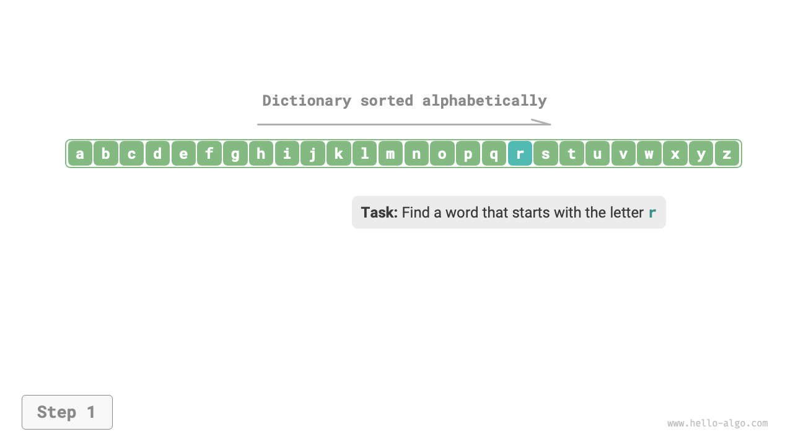
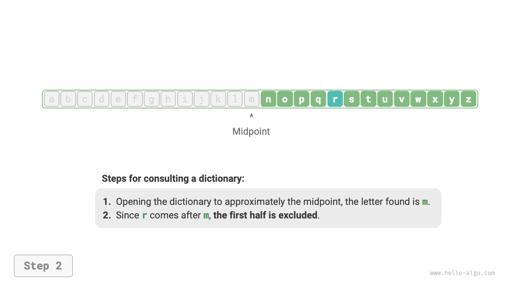
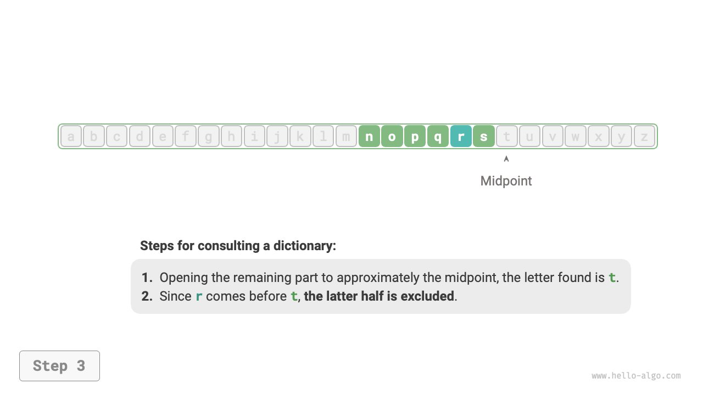
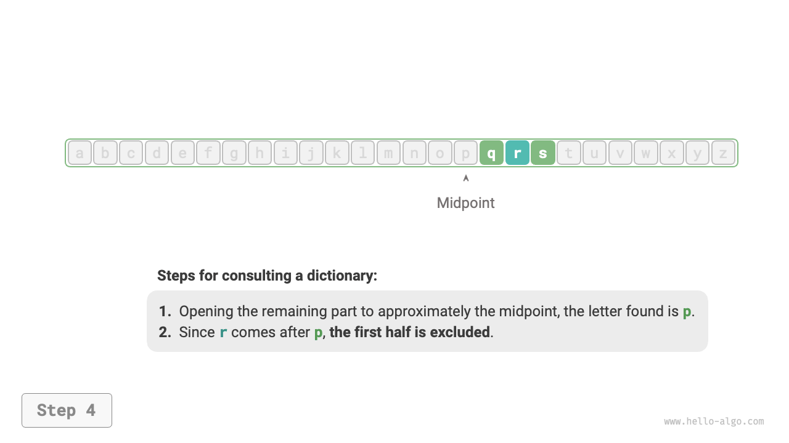
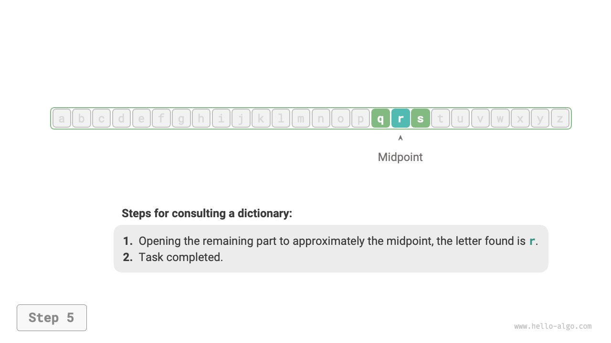
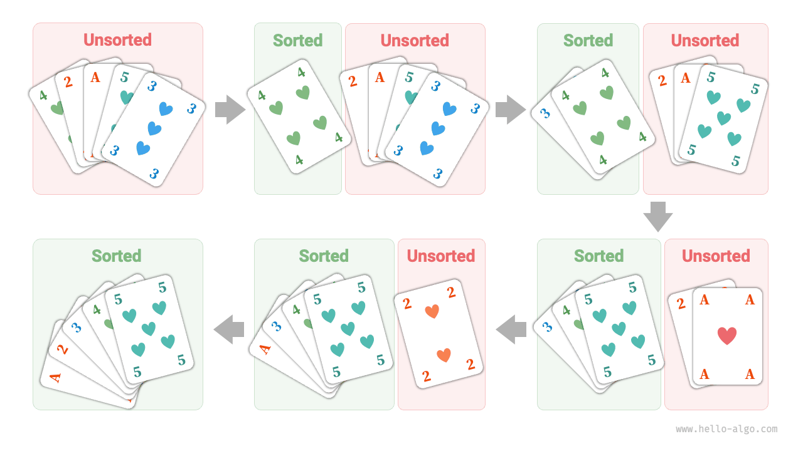
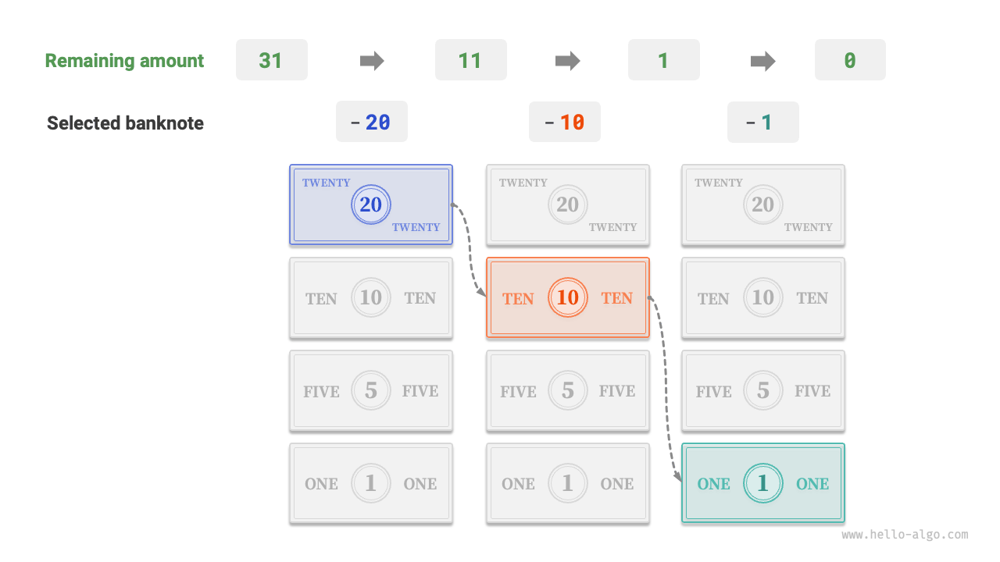

# アルゴリズムは至るところにある

「アルゴリズム」という言葉を聞くと、自然に数学を思い浮かべます。しかし実際には、多くのアルゴリズムは複雑な数学を必要とせず、むしろ基本的な論理に依存しており、その論理は私たちの日常生活のいたるところで見られます。

アルゴリズムを本格的に議論する前に、ひとつ面白い事実を共有しておきます。**あなたはすでに知らず知らずのうちに多くのアルゴリズムを身につけ、それらを日常生活に応用することに慣れているのです**。以下では、いくつかの具体例を挙げてこれを示します。

**例1：辞書を引く**。辞書では、各漢字に対応するピンインがあり、辞書はピンインのアルファベット順に並んでいます。ピンインの先頭文字が $r$ の字を探すと仮定すると、通常は次の図のような方法で行います。

1. 辞書をおよそ半分のところまで開き、そのページの先頭文字を確認し、先頭文字が $m$ だとします。
2. ピンインのアルファベット表では $r$ は $m$ の後にあるため、辞書の前半を除外し、探索範囲を後半に絞ります。
3. ピンインの先頭文字が $r$ のページを見つけるまで、手順 `1.` と手順 `2.` を繰り返します。

=== "<1>"
    

=== "<2>"
    

=== "<3>"
    

=== "<4>"
    

=== "<5>"
    

辞書を引くという小学生の必須スキルは、実は有名な「二分探索」アルゴリズムそのものです。データ構造の観点では、辞書を整列済みの「配列」とみなせます。アルゴリズムの観点では、上記の一連の辞書引きの操作を「二分探索」とみなせます。

**例2：トランプを整理する**。カードゲームをするとき、毎回手札のトランプを小さい順に並べ替える必要があります。その流れは次の図のとおりです。

1. トランプを「整列済み」と「未整列」の2つの部分に分け、初期状態では一番左の1枚がすでに整列済みだとします。
2. 未整列部分から1枚のトランプを取り出し、整列済み部分の正しい位置に挿入します。完了すると、左端の2枚は整列済みになります。
3. 手順 `2.` を繰り返し、各ラウンドで未整列部分から1枚を整列済み部分へ挿入し、すべてのトランプが整列済みになるまで続けます。

上記のトランプ整理の方法は、本質的には「挿入ソート」アルゴリズムです。これは小規模なデータ集合を処理する際に非常に効率的で、多くのプログラミング言語のソートライブラリ関数にも挿入ソートが使われています。

**例3：お釣りを出す**。スーパーで $69$ 元の商品を購入し、店員に $100$ 元渡したとすると、店員は $31$ 元のお釣りを返す必要があります。店員は自然に次の図のような考え方をします。

1. 選択肢は $31$ 元より小さい額面の貨幣で、$1$ 元、$5$ 元、$10$ 元、$20$ 元があります。
2. 選択肢の中から最大の $20$ 元を取り出すと、残りは $31 - 20 = 11$ 元です。
3. 残りの選択肢の中から最大の $10$ 元を取り出すと、残りは $11 - 10 = 1$ 元です。
4. 残りの選択肢の中から最大の $1$ 元を取り出すと、残りは $1 - 1 = 0$ 元です。
5. お釣りは完了し、内訳は $20 + 10 + 1 = 31$ 元です。

以上の手順では、各ステップでその時点で最善と思われる選択肢を取っています。つまり、できるだけ額面の大きい貨幣を使い、最終的に実行可能なお釣りの方案を得ています。データ構造とアルゴリズムの観点から見ると、この方法は本質的に「貪欲法」です。

料理を一品作ることから星間航行に至るまで、ほとんどあらゆる問題の解決にアルゴリズムは欠かせません。コンピュータの登場によって、プログラミングを通じてデータ構造をメモリに格納し、さらにコードを書いて CPU や GPU にアルゴリズムを実行させることが可能になりました。こうして、生活の中の問題をコンピュータに移し、より効率的な方法でさまざまな複雑な問題を解決できるのです。

!!! tip

    データ構造、アルゴリズム、配列、二分探索といった概念がまだ少し曖昧でも、そのまま読み進めてください。本書がデータ構造とアルゴリズムの知識の世界へと案内します。
