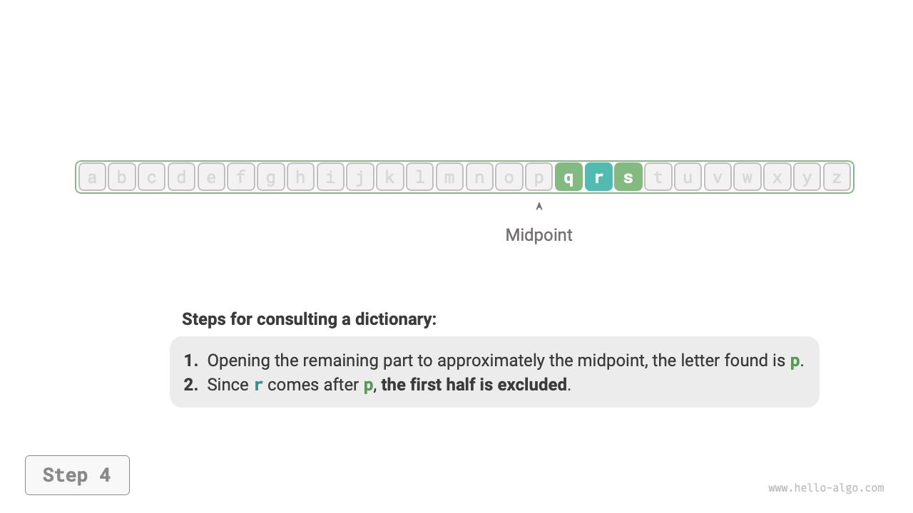

# アルゴリズムは至る所にある

「アルゴリズム」という言葉を聞くと、自然に数学を思い浮かべます。しかし、多くのアルゴリズムは複雑な数学を含まず、基本的な論理により多く依存しており、これは私たちの日常生活の至る所で見ることができます。

アルゴリズムについて正式に議論を始める前に、興味深い事実を共有する価値があります。**あなたは無意識のうちに多くのアルゴリズムを学び、日常生活でそれらを応用することに慣れています**。ここで、この点を証明するためにいくつかの具体的な例を挙げます。

**例1：辞書の引き方**。英語の辞書では、単語がアルファベット順に並んでいます。$r$で始まる単語を探していると仮定すると、通常は以下の方法で行います：

1. 辞書を大体半分ぐらいのところで開き、そのページの最初の語彙を確認します。例えば$m$で始まる文字だとしましょう。
2. $r$はアルファベットで$m$の後に来るので、前半を無視して、探索空間を後半に絞ります。
3. $r$で始まる単語を見つけるまで、ステップ`1.`と`2.`を繰り返します。

=== "<1>"
    

=== "<2>"
    

=== "<3>"
    

=== "<4>"
    

=== "<5>"
    

辞書を引くことは、小学生にとって必須のスキルですが、実際には有名な「二分探索」アルゴリズムです。データ構造の観点から、辞書をソートされた「配列」と考えることができます。アルゴリズムの観点から、辞書で単語を探すために取られる一連の行動は、「二分探索」アルゴリズムと見なすことができます。

**例2：トランプの整理**。トランプをプレイするとき、手札を昇順に並べる必要があります。以下の過程で示されます。

1. トランプを「整列済み」と「未整列」のセクションに分けます。最初は一番左のカードが既に整列していると仮定します。
2. 未整列セクションからカードを1枚取り出し、整列済みセクションの正しい位置に挿入します。この後、左端の2枚のカードが整列します。
3. すべてのカードが整列するまで、ステップ`2`を繰り返します。

上記のトランプを整理する方法は、実質的に「挿入ソート」アルゴリズムであり、小さなデータセットに対して非常に効率的です。多くのプログラミング言語のソート関数には挿入ソートが含まれています。

**例3：お釣りの計算**。スーパーマーケットで$69$の買い物をしたと仮定します。レジ係に$100$を渡すと、$31$のお釣りを提供する必要があります。この過程は以下の図で明確に理解できます。

1. 選択肢は$31$以下の価値のある通貨で、$1$、$5$、$10$、$20$が含まれます。
2. 選択肢から最大の$20$を取り出し、$31 - 20 = 11$が残ります。
3. 残りの選択肢から最大の$10$を取り出し、$11 - 10 = 1$が残ります。
4. 残りの選択肢から最大の$1$を取り出し、$1 - 1 = 0$が残ります。
5. お釣りの計算が完了し、解答は$20 + 10 + 1 = 31$です。

記述されたステップでは、利用可能な最大の額面を使用して各段階で最良の選択肢を選ぶことで、効果的なお釣り計算戦略につながります。データ構造とアルゴリズムの観点から、このアプローチは「貪欲」アルゴリズムとして知られています。

料理の準備から宇宙旅行まで、ほぼすべての問題解決にはアルゴリズムが関わっています。コンピュータの出現により、メモリにデータ構造を格納し、CPUとGPUを呼び出してアルゴリズムを実行するコードを書くことができるようになりました。このようにして、現実世界の問題をコンピュータに移し、より効率的な方法でさまざまな複雑な問題を解決できます。

!!! tip

    データ構造、アルゴリズム、配列、二分探索などの概念についてまだ混乱している場合は、読み続けることをお勧めします。この本は、データ構造とアルゴリズムの理解の領域へと優しく導いてくれるでしょう。
