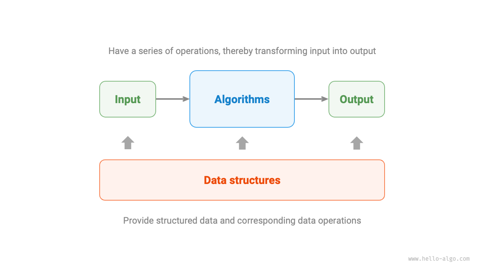

# 1.2 &nbsp; アルゴリズムとは

## 1.2.1 &nbsp; アルゴリズムの定義

<u>アルゴリズム（algorithm）</u>とは、限られた時間内に特定の問題を解決するための一連の命令または操作手順であり、次のような特徴を持ちます。

- 問題が明確であり、入力と出力の定義がはっきりしています。
- 実行可能であり、有限の手順、時間、メモリ空間で完了できます。
- 各手順の意味が確定しており、同じ入力と実行条件では常に同じ出力になります。

## 1.2.2 &nbsp; データ構造の定義

<u>データ構造（data structure）</u>とは、データを整理して保存する方式であり、データの内容、データ間の関係、データの操作方法を含み、次のような設計目標があります。

- 使用する空間をできるだけ少なくし、コンピュータのメモリを節約します。
- データの操作をできるだけ高速にし、アクセス、追加、削除、更新などを含みます。
- 簡潔なデータ表現と論理情報を提供し、アルゴリズムが効率よく動作できるようにします。

**データ構造の設計はトレードオフに満ちた過程です**。ある面を改善したい場合、別の面で妥協が必要になることがよくあります。以下に 2 つの例を示します。

- 連結リストは配列に比べてデータの追加や削除がしやすい一方で、データアクセス速度を犠牲にしています。
- グラフは連結リストに比べてより豊富な論理情報を提供しますが、より大きなメモリ空間を必要とします。

## 1.2.3 &nbsp; データ構造とアルゴリズムの関係

以下の図のように、データ構造とアルゴリズムは高度に関連し、密接に結び付いており、具体的には次の 3 つの点に表れます。

- データ構造はアルゴリズムの土台です。データ構造はアルゴリズムに対して、構造化して格納されたデータと、そのデータを操作する方法を提供します。
- アルゴリズムはデータ構造に命を吹き込みます。データ構造そのものはデータ情報を保存するだけであり、アルゴリズムと組み合わせて初めて特定の問題を解決できます。
- アルゴリズムは通常、異なるデータ構造に基づいて実装できますが、実行効率が大きく異なる場合があり、適切なデータ構造を選ぶことが重要です。

{ class="animation-figure" }

 図 1-4 &nbsp; データ構造とアルゴリズムの関係 

データ構造とアルゴリズムは、以下の図に示す組み立てブロックのようなものです。1 セットのブロックには多くの部品が含まれるだけでなく、詳しい組み立て説明書も付いています。説明書に従って一歩ずつ操作すれば、精巧なブロック模型を組み立てられます。

{ class="animation-figure" }

 図 1-5 &nbsp; 組み立てブロック 

両者の詳細な対応関係を次の表に示します。

 表 1-1 &nbsp; データ構造とアルゴリズムを組み立てブロックにたとえる 

| データ構造とアルゴリズム | 組み立てブロック                                 |
| -------------- | ---------------------------------------- |
| 入力データ       | まだ組み立てていないブロック                             |
| データ構造       | ブロックの構成形式。形状、大きさ、接続方法などを含む |
| アルゴリズム           | ブロックを目標の形に組み上げる一連の操作手順       |
| 出力データ       | ブロック模型                                 |

特筆すべき点として、データ構造とアルゴリズムはプログラミング言語から独立しています。だからこそ、本書では複数のプログラミング言語に基づく実装を提供できます。

!!! tip "慣習的な略称"

    実際の議論では、私たちは通常「データ構造とアルゴリズム」を略して「アルゴリズム」と呼びます。たとえば広く知られている LeetCode のアルゴリズム問題は、実際にはデータ構造とアルゴリズムの両方の知識を同時に問うています。
