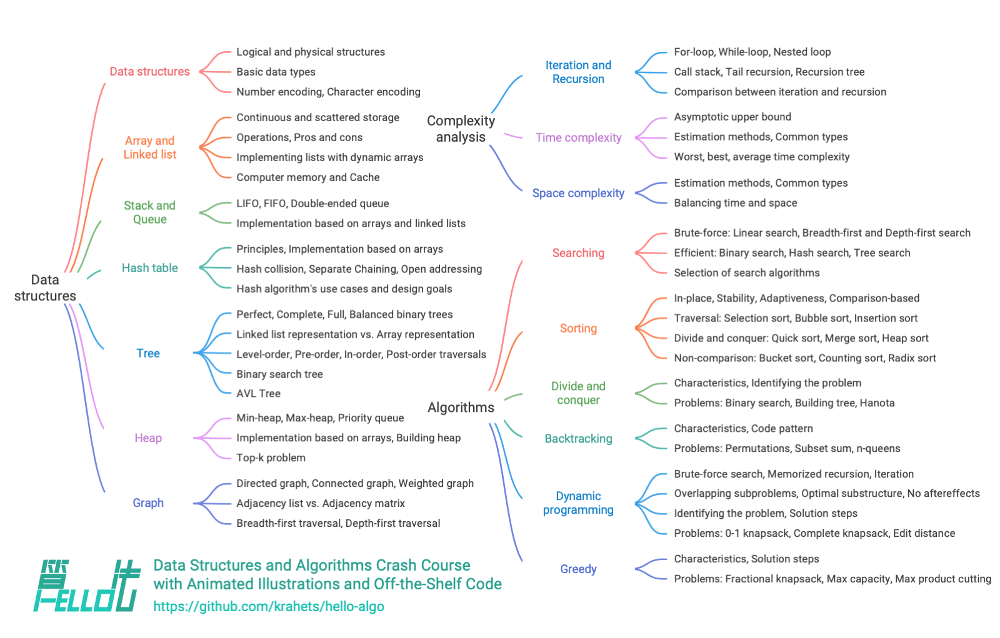

# この本について

このオープンソースプロジェクトは、データ構造とアルゴリズムに関する無料で初心者にやさしいクラッシュコースの作成を目指しています。

- アニメーション付きの図解、理解しやすい内容、滑らかな学習曲線により、初心者がデータ構造とアルゴリズムの「知識マップ」を探索するのに役立ちます。
- ワンクリックでコードを実行できるため、読者のプログラミングスキルの向上と、アルゴリズムの動作原理およびデータ構造の基礎実装の理解に役立ちます。
- 教えることによる学習を促進し、質問や洞察の共有を自由に行ってください。議論を通じて一緒に成長しましょう。

## 対象読者

もしあなたがアルゴリズムに触れたばかりで経験が限られている場合、またはアルゴリズムである程度の経験を積んでいても、データ構造とアルゴリズムについて曖昧な理解しかなく、常に「分かった」と「うーん」の間を行き来している場合、この本はあなたのためのものです！

すでにある程度の問題解決経験を積んでおり、ほとんどのタイプの問題に精通している場合、この本はアルゴリズムの知識体系を復習し整理するのに役立ちます。リポジトリのソースコードは「問題解決ツールキット」や「アルゴリズムチートシート」として使用できます。

もしあなたがアルゴリズムの専門家であれば、貴重な提案をいただくか、[参加して協力](https://www.hello-algo.com/chapter_appendix/contribution/)していただければと思います。

!!! success "前提条件"

    少なくとも一つのプログラミング言語で簡単なコードを書いて読むことができる必要があります。

## 内容構成

本書の主な内容を下図に示します。

- **計算量解析**: データ構造とアルゴリズムを評価する側面と方法を探求します。時間計算量と空間計算量を導出する方法、および一般的なタイプと例を扱います。
- **データ構造**: 基本的なデータ型、分類方法、定義、長所と短所、一般的な操作、タイプ、応用、および配列、連結リスト、スタック、キュー、ハッシュテーブル、木、ヒープ、グラフなどのデータ構造の実装方法に焦点を当てます。
- **アルゴリズム**: アルゴリズムを定義し、その長所と短所、効率性、応用シナリオ、問題解決ステップについて議論し、検索、ソート、分割統治、バックトラッキング、動的プログラミング、貪欲アルゴリズムなど、さまざまなアルゴリズムのサンプル問題を含みます。

## 謝辞

この本は、オープンソースコミュニティの多くの貢献者の共同努力により継続的に改善されています。時間とエネルギーを投資してくださった各執筆者に感謝いたします。GitHubで生成された順序で記載されています: krahets, coderonion, Gonglja, nuomi1, Reanon, justin-tse, hpstory, danielsss, curtishd, night-cruise, S-N-O-R-L-A-X, rongyi, msk397, gvenusleo, khoaxuantu, rivertwilight, K3v123, gyt95, zhuoqinyue, yuelinxin, Zuoxun, mingXta, Phoenix0415, FangYuan33, GN-Yu, longsizhuo, IsChristina, xBLACKICEx, guowei-gong, Cathay-Chen, pengchzn, QiLOL, magentaqin, hello-ikun, JoseHung, qualifier1024, thomasq0, sunshinesDL, L-Super, Guanngxu, Transmigration-zhou, WSL0809, Slone123c, lhxsm, yuan0221, what-is-me, Shyam-Chen, theNefelibatas, longranger2, codeberg-user, xiongsp, JeffersonHuang, prinpal, seven1240, Wonderdch, malone6, xiaomiusa87, gaofer, bluebean-cloud, a16su, SamJin98, hongyun-robot, nanlei, XiaChuerwu, yd-j, iron-irax, mgisr, steventimes, junminhong, heshuyue, danny900714, MolDuM, Nigh, Dr-XYZ, XC-Zero, reeswell, PXG-XPG, NI-SW, Horbin-Magician, Enlightenus, YangXuanyi, beatrix-chan, DullSword, xjr7670, jiaxianhua, qq909244296, iStig, boloboloda, hts0000, gledfish, wenjianmin, keshida, kilikilikid, lclc6, lwbaptx, linyejoe2, liuxjerry, llql1211, fbigm, echo1937, szu17dmy, dshlstarr, Yucao-cy, coderlef, czruby, bongbongbakudan, beintentional, ZongYangL, ZhongYuuu, ZhongGuanbin, hezhizhen, linzeyan, ZJKung, luluxia, xb534, ztkuaikuai, yw-1021, ElaBosak233, baagod, zhouLion, yishangzhang, yi427, yanedie, yabo083, weibk, wangwang105, th1nk3r-ing, tao363, 4yDX3906, syd168, sslmj2020, smilelsb, siqyka, selear, sdshaoda, Xi-Row, popozhu, nuquist19, noobcodemaker, XiaoK29, chadyi, lyl625760, lucaswangdev, 0130w, shanghai-Jerry, EJackYang, Javesun99, eltociear, lipusheng, KNChiu, BlindTerran, ShiMaRing, lovelock, FreddieLi, FloranceYeh, fanchenggang, gltianwen, goerll, nedchu, curly210102, CuB3y0nd, KraHsu, CarrotDLaw, youshaoXG, bubble9um, Asashishi, Asa0oo0o0o, fanenr, eagleanurag, akshiterate, 52coder, foursevenlove, KorsChen, GaochaoZhu, hopkings2008, yang-le, realwujing, Evilrabbit520, Umer-Jahangir, Turing-1024-Lee, Suremotoo, paoxiaomooo, Chieko-Seren, Allen-Scai, ymmmas, Risuntsy, Richard-Zhang1019, RafaelCaso, qingpeng9802, primexiao, Urbaner3, zhongfq, nidhoggfgg, MwumLi, CreatorMetaSky, martinx, ZnYang2018, hugtyftg, logan-qiu, psychelzh, Keynman, KeiichiKasai, and KawaiiAsh。

この本のコードレビュー作業は、coderonion, Gonglja, gvenusleo, hpstory, justin‐tse, khoaxuantu, krahets, night-cruise, nuomi1, Reanon and rongyi（アルファベット順）によって完了されました。彼らの時間と努力に感謝し、様々な言語でのコードの標準化と統一性を確保してくださいました。

この本の繁体字中国語版は Shyam-Chen と Dr-XYZ によってレビューされ、英語版は yuelinxin, K3v123, QiLOL, Phoenix0415, SamJin98, yanedie, RafaelCaso, pengchzn, thomasq0, and magentaqin によってレビューされました。彼らの継続的な貢献により、この本がより広い読者に届き、役立つことができます。

この本の制作過程において、多くの方々から貴重な支援をいただきました。これらに限定されませんが：

- 会社でのメンター、李熙博士に感謝します。ある会話で「早く行動しろ」と励ましていただき、この本を書く決意を固めることができました。
- ガールフレンドのBubbleに感謝します。この本の最初の読者として、アルゴリズム初心者の視点から多くの貴重な提案をいただき、この本を初心者により適したものにしてくださいました。
- Tengbao、Qibao、Feibaoに感謝します。この本のクリエイティブな名前を考えてくださり、みんなが初めて「Hello World!」を書いた時の素晴らしい思い出を呼び起こしてくれました。
- Xiaoquanに感謝します。知的財産に関する専門的な支援を提供してくださり、このオープンソース本の開発において重要な役割を果たしてくださいました。
- Sutongに感謝します。この本の美しいカバーとロゴをデザインしてくださり、私の要求で何度も修正を辛抱強く行ってくださいました。
- @squidfunk に感謝します。執筆と組版の提案、および彼が開発したオープンソースドキュメントテーマ [Material-for-MkDocs](https://github.com/squidfunk/mkdocs-material/tree/master) を提供してくださいました。

執筆の過程で、データ構造とアルゴリズムに関する多数の教科書や記事を深く研究しました。これらの作品は模範的なモデルとして機能し、この本の内容の正確性と品質を確保してくださいました。先人の方々の貴重な貢献に感謝いたします！

この本は、理論と実践を組み合わせた学習を提唱しており、この点で ["Dive into Deep Learning"](https://github.com/d2l-ai/d2l-en) からインスピレーションを受けています。この優れた本をすべての読者に強くお勧めします。

**継続的な支援と励ましにより、この興味深い仕事をすることを可能にしてくださった両親に心から感謝いたします**。
