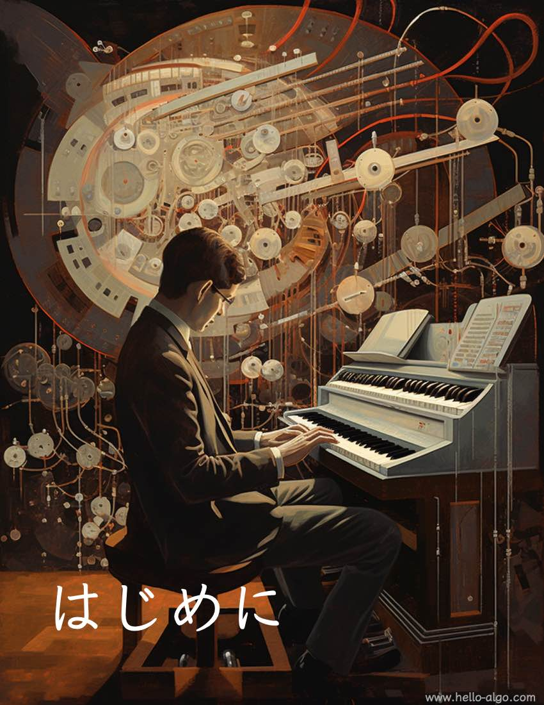

# 第 0 章 &nbsp; はじめに

{ class="cover-image" }

!!! abstract

    アルゴリズムは美しい交響曲のようであり、コードの一行一行が旋律のように流れていきます。
    
    この本があなたの心の中でそっと響き、独自で深い旋律を残してくれることを願っています。

## 章の内容

- [0.1 &nbsp; 本書について](about_the_book.md)
- [0.2 &nbsp; 本書の使い方](suggestions.md)
- [0.3 &nbsp; まとめ](summary.md)
