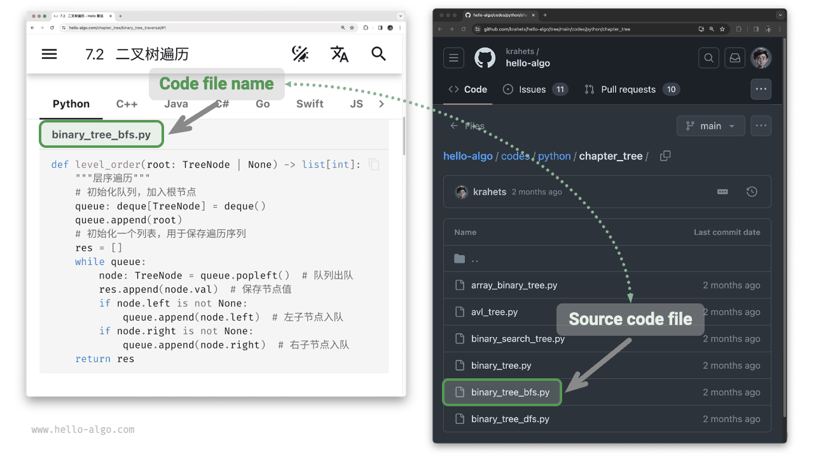
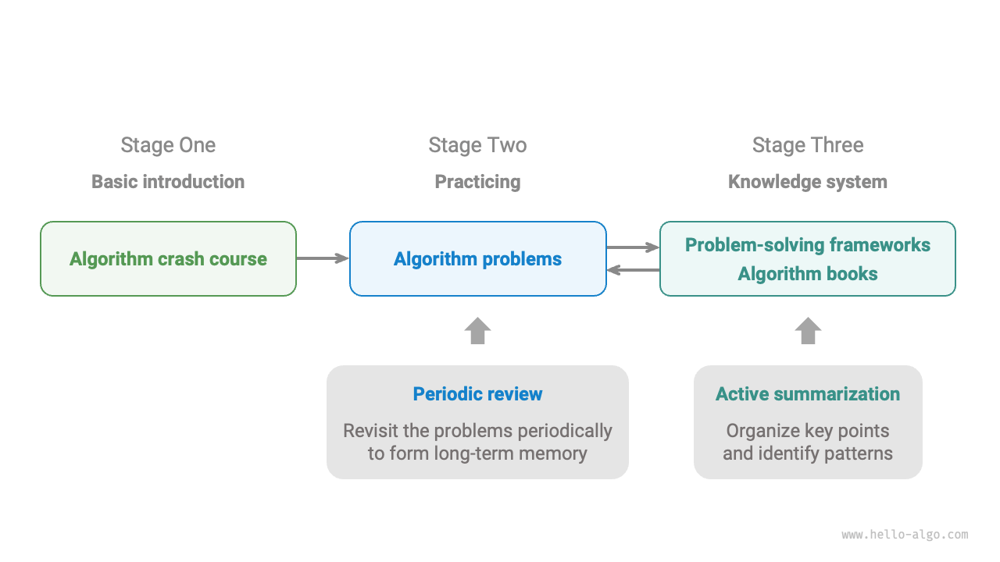

# 本書の使い方

!!! tip

    最適な読書体験を得るために、本節の内容を一通り読むことをおすすめします。

## 文章スタイルの約束

- 見出しの後に `*` が付いているのは選読章で、内容は比較的難しめです。時間が限られている場合は、先に読み飛ばしてもかまいません。
- 専門用語は太字（紙書籍版と PDF 版）または下線付き（Web 版）で示します。たとえば<u>配列（array）</u>のようなものです。文献を読む際に役立つため、覚えておくことをおすすめします。
- 重要な内容やまとめの文は **太字** で示します。これらの文章には特に注意してください。
- 特定の意味を持つ語句には“引用符”を付け、曖昧さを避けます。
- プログラミング言語ごとに用語が一致しない場合、本書では Python を基準とします。たとえば、“空”を表すのに `None` を使います。
- 本書では、よりコンパクトなレイアウトのために、言語ごとのコメント規約を一部省略しています。コメントは主に3種類あります。タイトルコメント、内容コメント、複数行コメントです。

=== "Python"

    ```python title=""
    """タイトルコメント。関数、クラス、テストケースなどを示すために使います"""
    
    # 内容コメント。コードを詳しく説明するために使います
    
    """
    複数行
    コメント
    """
    ```

=== "C++"

    ```cpp title=""
    /* タイトルコメント。関数、クラス、テストケースなどを示すために使います */
    
    // 内容コメント。コードを詳しく説明するために使います
    
    /**
     * 複数行
     * コメント
     */
    ```

=== "Java"

    ```java title=""
    /* タイトルコメント。関数、クラス、テストケースなどを示すために使います */
    
    // 内容コメント。コードを詳しく説明するために使います
    
    /**
     * 複数行
     * コメント
     */
    ```

=== "C#"

    ```csharp title=""
    /* タイトルコメント。関数、クラス、テストケースなどを示すために使います */
    
    // 内容コメント。コードを詳しく説明するために使います
    
    /**
     * 複数行
     * コメント
     */
    ```

=== "Go"

    ```go title=""
    /* タイトルコメント。関数、クラス、テストケースなどを示すために使います */
    
    // 内容コメント。コードを詳しく説明するために使います
    
    /**
     * 複数行
     * コメント
     */
    ```

=== "Swift"

    ```swift title=""
    /* タイトルコメント。関数、クラス、テストケースなどを示すために使います */
    
    // 内容コメント。コードを詳しく説明するために使います
    
    /**
     * 複数行
     * コメント
     */
    ```

=== "JS"

    ```javascript title=""
    /* タイトルコメント。関数、クラス、テストケースなどを示すために使います */
    
    // 内容コメント。コードを詳しく説明するために使います
    
    /**
     * 複数行
     * コメント
     */
    ```

=== "TS"

    ```typescript title=""
    /* タイトルコメント。関数、クラス、テストケースなどを示すために使います */
    
    // 内容コメント。コードを詳しく説明するために使います
    
    /**
     * 複数行
     * コメント
     */
    ```

=== "Dart"

    ```dart title=""
    /* タイトルコメント。関数、クラス、テストケースなどを示すために使います */
    
    // 内容コメント。コードを詳しく説明するために使います
    
    /**
     * 複数行
     * コメント
     */
    ```

=== "Rust"

    ```rust title=""
    /* タイトルコメント。関数、クラス、テストケースなどを示すために使います */

    // 内容コメント。コードを詳しく説明するために使います
    
    // 複数行
    // コメント
    ```

=== "C"

    ```c title=""
    /* タイトルコメント。関数、クラス、テストケースなどを示すために使います */
    
    // 内容コメント。コードを詳しく説明するために使います
    
    /**
     * 複数行
     * コメント
     */
    ```

=== "Kotlin"

    ```kotlin title=""
    /* タイトルコメント。関数、クラス、テストケースなどを示すために使います */
    
    // 内容コメント。コードを詳しく説明するために使います
    
    /**
     * 複数行
     * コメント
     */
    ```

=== "Ruby"

    ```ruby title=""
    ### タイトルコメント。関数、クラス、テストケースなどを示すために使います ###

    # 内容コメント。コードを詳しく説明するために使います
    
    # 複数行
    # コメント
    ```

## アニメーション図解で効率よく学ぶ

文字と比べて、動画や画像は情報密度と構造化の度合いが高く、理解しやすいものです。本書では、**重要かつ難解な知識は主にアニメーションによる図解で示し**、文章は説明と補足を担います。

本書を読んでいて、ある内容に以下の図のようなアニメーション図解がある場合は、**図を主、文章を従として**、両方を合わせて理解してください。


## コード実践で理解を深める

本書のサンプルコードは [GitHub リポジトリ](https://github.com/krahets/hello-algo) で管理されています。以下の図のように、**ソースコードにはテストケースが付いており、ワンクリックで実行できます**。

時間に余裕があれば、**コードを見ながら自分で一度書いてみることをおすすめします**。学習時間が限られている場合でも、少なくともすべてのコードに目を通し、実行してください。

コードを読むのに比べて、書く過程のほうが得られるものは多いものです。**手を動かしてこそ、本当に学んだことになります**。


コードを実行する前準備は主に3ステップです。

**第1ステップ：ローカルのプログラミング環境をインストールする**。付録の[チュートリアル](https://www.hello-algo.com/chapter_appendix/installation/)を参照してインストールしてください。すでにインストール済みであれば、この手順は省略できます。

**第2ステップ：コードリポジトリをクローンまたはダウンロードする**。 [GitHub リポジトリ](https://github.com/krahets/hello-algo) にアクセスしてください。すでに [Git](https://git-scm.com/downloads) をインストールしている場合は、次のコマンドでこのリポジトリをクローンできます：

```shell
git clone https://github.com/krahets/hello-algo.git
```

もちろん、以下の図に示す場所で“Download ZIP”ボタンをクリックし、コードの圧縮ファイルを直接ダウンロードしてローカルで展開することもできます。


**第3ステップ：ソースコードを実行する**。以下の図のように、上部にファイル名が表示されているコードブロックについては、リポジトリの `codes` フォルダ内に対応するソースコードファイルがあります。ソースコードファイルはワンクリックで実行できるため、不要なデバッグ時間を減らし、学習内容に集中できます。



ローカルでコードを実行するだけでなく、**Web 版では Python コードの可視化実行にも対応しています**（[pythontutor](https://pythontutor.com/) を利用）。以下の図のように、コードブロックの下にある“可視化実行”をクリックすると表示を展開し、アルゴリズムコードの実行過程を観察できます。また、“全画面表示”をクリックすると、より見やすい閲覧体験が得られます。


## 質問と議論を通じてともに成長する

本書を読んでいて、理解できていない知識点を安易に読み飛ばさないでください。**コメント欄で気軽に質問してください**。私と仲間たちが誠意をもって回答し、通常は 2 日以内に返信します。

以下の図のように、Web 版では各章の下部にコメント欄があります。ぜひコメント欄の内容にも目を通してください。一方では、みんなが直面した問題を知ることで知識の抜けを補い、より深い思考を促せます。もう一方では、ほかの仲間の質問にも積極的に答え、見解を共有し、互いの成長を助けてほしいと思います。


## アルゴリズム学習ロードマップ

全体として見ると、データ構造とアルゴリズムの学習過程は 3 つの段階に分けられます。

1. **第 1 段階：アルゴリズム入門**。さまざまなデータ構造の特徴と使い方に慣れ、異なるアルゴリズムの原理、流れ、用途、効率などを学ぶ必要があります。
2. **第 2 段階：アルゴリズム問題を解く**。まずは人気の高い問題から取り組み、少なくとも 100 問は蓄積して、主流のアルゴリズム問題に慣れることをおすすめします。最初のうちは、“知識の忘却”が課題になるかもしれませんが、心配はいりません。これはごく自然なことです。“エビングハウスの忘却曲線”に沿って問題を復習すれば、通常は 3～5 回繰り返すことでしっかり記憶に定着します。おすすめの問題リストと学習計画は、この [GitHub リポジトリ](https://github.com/krahets/LeetCode-Book) を参照してください。
3. **第 3 段階：知識体系を構築する**。学習面では、アルゴリズムの連載記事、解法フレームワーク、教材などを読むことで、知識体系を継続的に充実させられます。問題演習の面では、トピック別分類、1 問多解、1 解多題といった発展的な戦略も試せます。関連する学習ノウハウは各コミュニティで見つけられます。

以下の図のように、本書の内容は主に“第 1 段階”を扱っており、第 2 段階と第 3 段階の学習をより効率的に進める助けとなることを目的としています。


