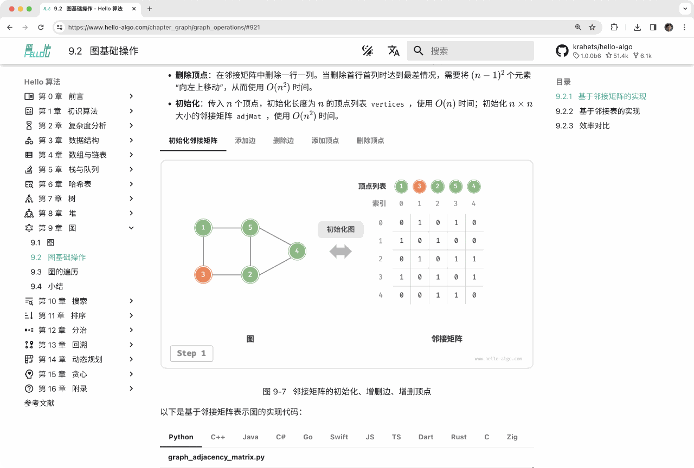
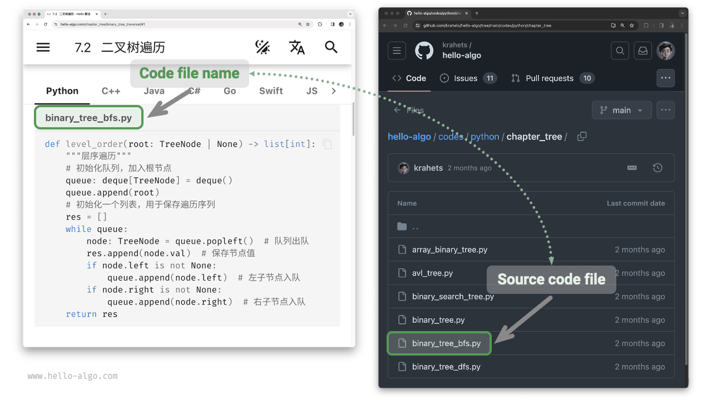

# 読み方

!!! tip

    最良の読書体験のために、このセクションを通読することをお勧めします。

## 記述規則

- タイトルの後に「*」が付いた章は任意であり、比較的難易度の高い内容が含まれています。時間に制約がある場合は、これらをスキップすることをお勧めします。
- 技術用語は太字（印刷版およびPDF版）または下線（Web版）で表示されます。例えば、<u>配列</u>などです。技術文書をより良く理解するために、これらに慣れることをお勧めします。
- **太字のテキスト**は重要な内容や要約文を示し、特別な注意を払う価値があります。
- 特定の意味を持つ単語や句は「引用符」で示され、曖昧さを避けます。
- プログラミング言語間で一致しない用語については、この本はPythonに従います。例えば、`null`を意味するために`None`を使用します。
- この本は、よりコンパクトなコンテンツレイアウトと引き換えに、プログラミング言語のコメント規約を部分的に無視しています。コメントは主に3つのタイプで構成されています：タイトルコメント、内容コメント、複数行コメント。

=== "Python"

    ```python title=""
    """関数、クラス、テストサンプルなどをラベル付けするためのヘッダーコメント"""

    # 詳細を説明するためのコメント

    """
    複数行
    コメント
    """
    ```

=== "C++"

    ```cpp title=""
    /* 関数、クラス、テストサンプルなどをラベル付けするためのヘッダーコメント */

    // 詳細を説明するためのコメント

    /**
     * 複数行
     * コメント
     */
    ```

=== "Java"

    ```java title=""
    /* 関数、クラス、テストサンプルなどをラベル付けするためのヘッダーコメント */

    // 詳細を説明するためのコメント

    /**
     * 複数行
     * コメント
     */
    ```

=== "C#"

    ```csharp title=""
    /* 関数、クラス、テストサンプルなどをラベル付けするためのヘッダーコメント */

    // 詳細を説明するためのコメント

    /**
     * 複数行
     * コメント
     */
    ```

=== "Go"

    ```go title=""
    /* 関数、クラス、テストサンプルなどをラベル付けするためのヘッダーコメント */

    // 詳細を説明するためのコメント

    /**
     * 複数行
     * コメント
     */
    ```

=== "Swift"

    ```swift title=""
    /* 関数、クラス、テストサンプルなどをラベル付けするためのヘッダーコメント */

    // 詳細を説明するためのコメント

    /**
     * 複数行
     * コメント
     */
    ```

=== "JS"

    ```javascript title=""
    /* 関数、クラス、テストサンプルなどをラベル付けするためのヘッダーコメント */

    // 詳細を説明するためのコメント

    /**
     * 複数行
     * コメント
     */
    ```

=== "TS"

    ```typescript title=""
    /* 関数、クラス、テストサンプルなどをラベル付けするためのヘッダーコメント */

    // 詳細を説明するためのコメント

    /**
     * 複数行
     * コメント
     */
    ```

=== "Dart"

    ```dart title=""
    /* 関数、クラス、テストサンプルなどをラベル付けするためのヘッダーコメント */

    // 詳細を説明するためのコメント

    /**
     * 複数行
     * コメント
     */
    ```

=== "Rust"

    ```rust title=""
    /* 関数、クラス、テストサンプルなどをラベル付けするためのヘッダーコメント */

    // 詳細を説明するためのコメント

    /**
     * 複数行
     * コメント
     */
    ```

=== "C"

    ```c title=""
    /* 関数、クラス、テストサンプルなどをラベル付けするためのヘッダーコメント */

    // 詳細を説明するためのコメント

    /**
     * 複数行
     * コメント
     */
    ```

=== "Kotlin"

    ```kotlin title=""
    /* 関数、クラス、テストサンプルなどをラベル付けするためのヘッダーコメント */

    // 詳細を説明するためのコメント

    /**
     * 複数行
     * コメント
     */
    ```

=== "Zig"

    ```zig title=""
    // 関数、クラス、テストサンプルなどをラベル付けするためのヘッダーコメント

    // 詳細を説明するためのコメント

    // 複数行
    // コメント
    ```

## アニメーション図解による効率的学習

テキストと比較して、動画や画像は情報密度が高く、より構造化されており、理解しやすくなっています。この本では、**重要で難しい概念は主にアニメーションと図解を通じて提示され**、テキストは説明と補足として機能します。

下図に示すようなアニメーションや図解のある内容に遭遇した場合、**図の理解を優先し、テキストを補足として**、両方を統合して包括的な理解を得てください。



## コーディング実践による理解の深化

この本のソースコードは[GitHubリポジトリ](https://github.com/krahets/hello-algo)でホストされています。下図に示すように、**ソースコードにはテスト例が付属しており、ワンクリックで実行できます**。

時間に余裕がある場合は、**自分でコードをタイプすることをお勧めします**。時間がない場合は、少なくともすべてのコードを読んで実行してください。

コードを読むだけと比較して、コードを書くことは多くの場合、より多くの学習をもたらします。**実践による学習こそが真の学習方法です。**


コードを実行するための設定には、主に3つのステップが含まれます。

**ステップ1：ローカルプログラミング環境をインストール**。付録の[チュートリアル](https://www.hello-algo.com/chapter_appendix/installation/)に従ってインストールするか、すでにインストールされている場合はこのステップをスキップしてください。

**ステップ2：コードリポジトリをクローンまたはダウンロード**。[GitHubリポジトリ](https://github.com/krahets/hello-algo)を訪問してください。

[Git](https://git-scm.com/downloads)がインストールされている場合は、次のコマンドを使用してリポジトリをクローンします：

```shell
git clone https://github.com/krahets/hello-algo.git
```

または、下図に示す場所にある「Download ZIP」ボタンをクリックして、コードを圧縮ZIPファイルとして直接ダウンロードすることもできます。その後、ローカルで展開するだけです。


**ステップ3：ソースコードを実行**。下図に示すように、上部にファイル名が記載されたコードブロックについては、リポジトリの`codes`フォルダで対応するソースコードファイルを見つけることができます。これらのファイルはワンクリックで実行でき、不要なデバッグ時間を節約し、学習に集中できます。



## 議論による共同学習

この本を読んでいる間、学べなかった点を飛ばさないでください。**コメントセクションで気軽に質問してください**。喜んでお答えし、通常2日以内に回答できます。

下図に示すように、各章の下部にコメントセクションがあります。これらのコメントに注意を払うことをお勧めします。他の人が遭遇した問題を知ることで、知識のギャップを特定し、より深い思索を促すだけでなく、仲間の読者の質問に答えたり、洞察を共有したり、相互の向上を促進したりすることで寛大に貢献することも招待します。


## アルゴリズム学習パス

全体的に、データ構造とアルゴリズムをマスターする旅は3つの段階に分けることができます：

1. **段階1：アルゴリズムの入門**。さまざまなデータ構造の特性と使用法に慣れ、異なるアルゴリズムの原理、プロセス、用途、効率について学ぶ必要があります。
2. **段階2：アルゴリズム問題の練習**。[Sword for Offer](https://leetcode.cn/studyplan/coding-interviews/)や[LeetCode Hot 100](https://leetcode.cn/studyplan/top-100-liked/)などの人気のある問題から始めることをお勧めし、少なくとも100問を蓄積して主流のアルゴリズム問題に慣れることです。練習を始めると忘却が課題になる可能性がありますが、これは正常なことですのでご安心ください。「エビングハウスの忘却曲線」に従って問題を復習することができ、通常3〜5回の反復の後、それらを覚えることができるでしょう。
3. **段階3：知識体系の構築**。学習の面では、アルゴリズムコラム記事、解法フレームワーク、アルゴリズム教科書を読んで知識体系を継続的に豊かにすることができます。練習の面では、トピック別分類、一つの問題に対する複数の解法、複数の問題に対する一つの解法など、高度な戦略を試すことができます。これらの戦略に関する洞察は、さまざまなコミュニティで見つけることができます。

下図に示すように、この本は主に「段階1」をカバーしており、段階2と3により効率的に取り組むのに役立つことを目的としています。


