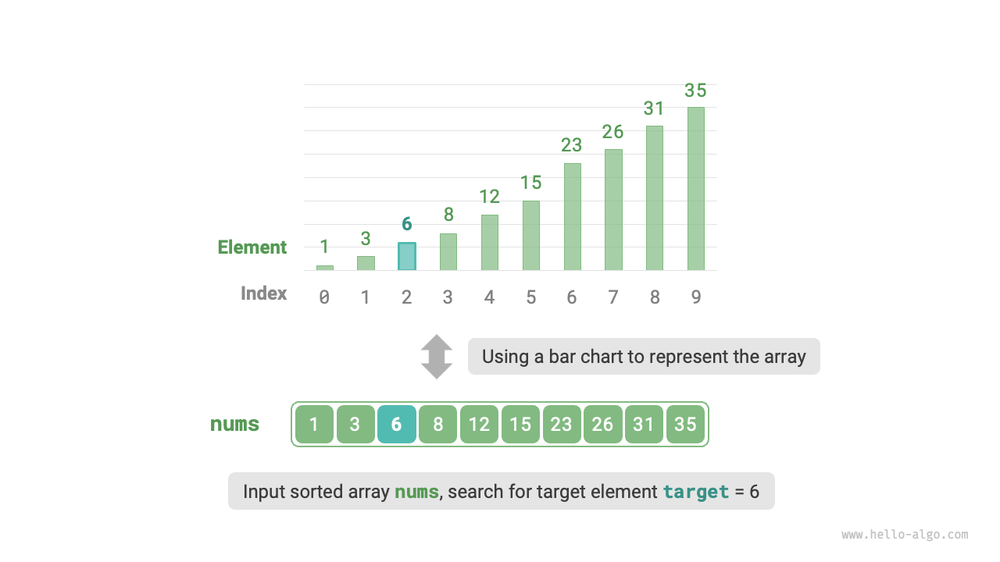
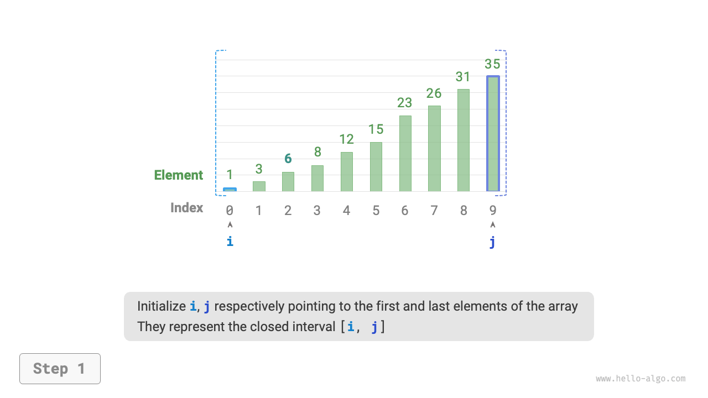
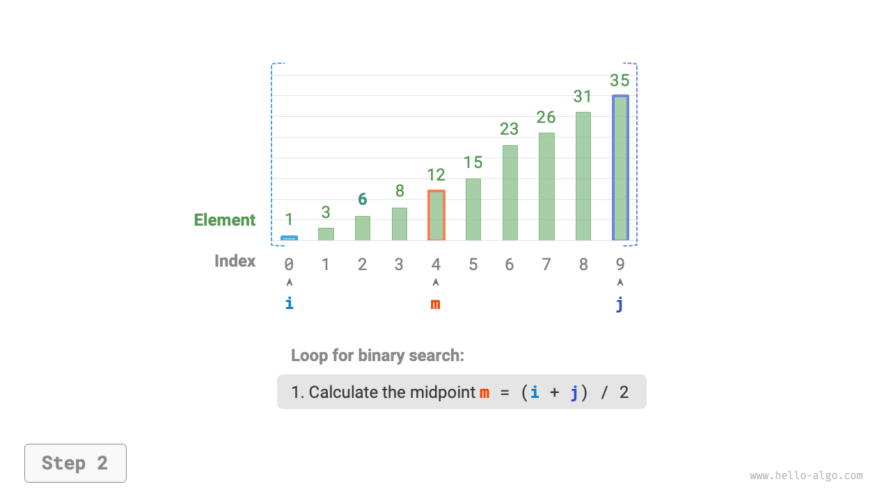
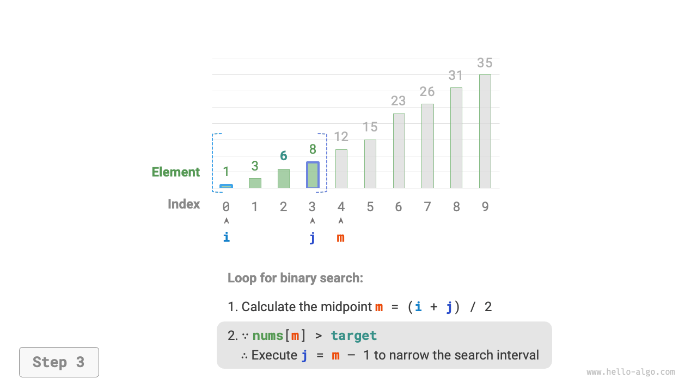
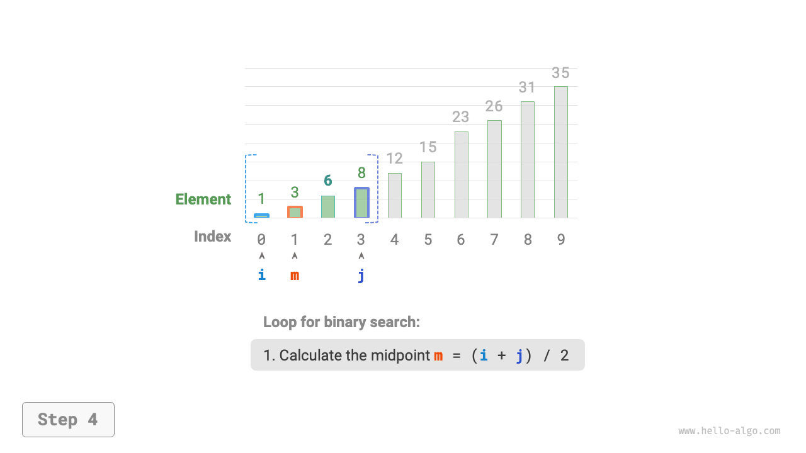
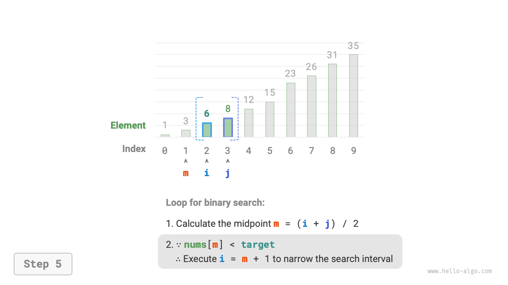
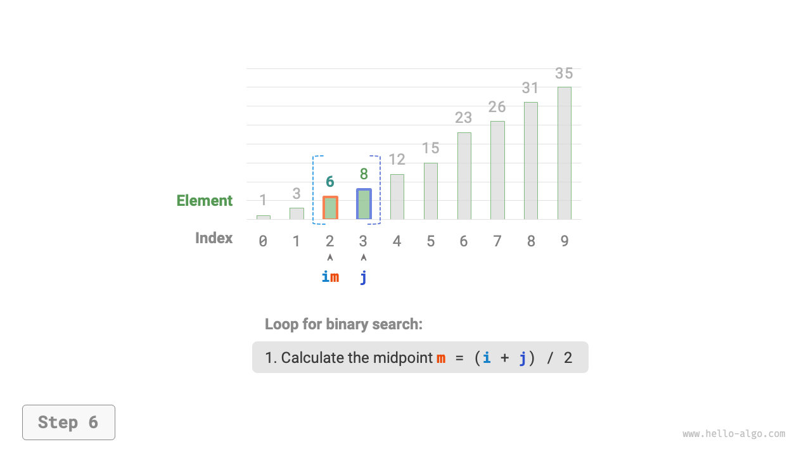
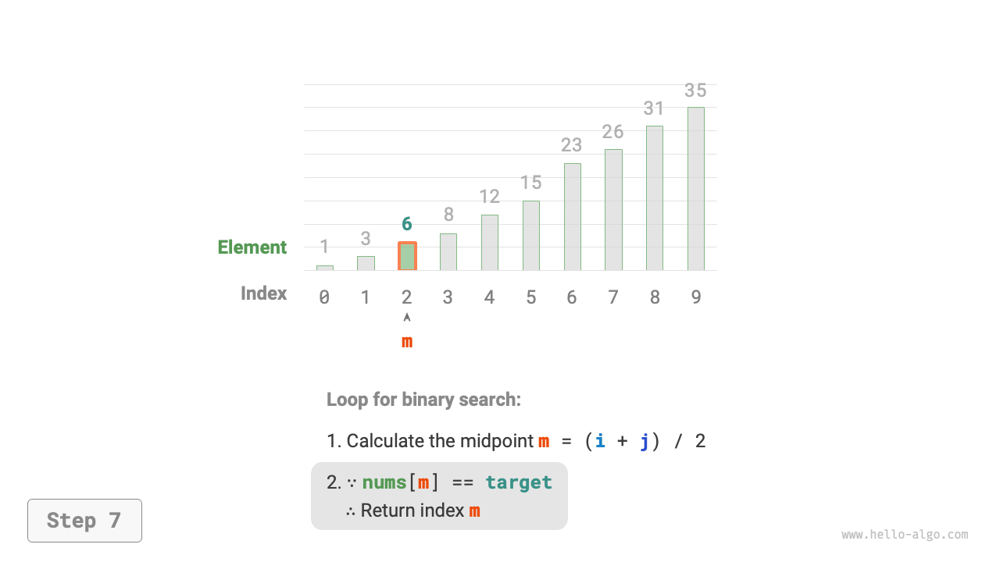
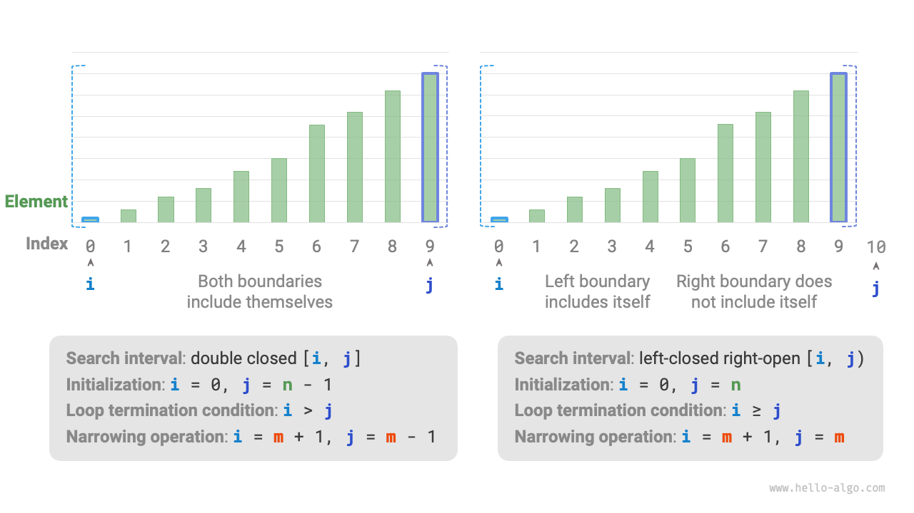

# 二分探索

<u>二分探索</u>は分割統治戦略を用いる効率的な探索アルゴリズムです。配列内の要素の整列順序を利用し、各反復で探索区間を半分に減らしながら、目標要素が見つかるか探索区間が空になるまで続行します。

!!! question

    長さ$n$の配列`nums`が与えられ、要素は重複なしで昇順に配列されています。この配列内の要素`target`のインデックスを見つけて返してください。配列に要素が含まれていない場合は$-1$を返してください。例を下図に示します。



下図に示すように、まず$i = 0$と$j = n - 1$でポインタを初期化し、それぞれ配列の最初と最後の要素を指します。これらはまた全体の探索区間$[0, n - 1]$を表します。角括弧は閉区間を示し、境界値自身も含むことに注意してください。

そして、以下の2つのステップをループで実行する可能性があります。

1. 中点インデックス$m = \lfloor {(i + j) / 2} \rfloor$を計算します。ここで$\lfloor \: \rfloor$は床関数を表します。
2. `nums[m]`と`target`の比較に基づいて、以下の3つのケースのうち1つを選択して実行します。
    1. `nums[m] < target`の場合、`target`は区間$[m + 1, j]$にあることを示すため、$i = m + 1$とします。
    2. `nums[m] > target`の場合、`target`は区間$[i, m - 1]$にあることを示すため、$j = m - 1$とします。
    3. `nums[m] = target`の場合、`target`が見つかったことを示すため、インデックス$m$を返します。

配列に目標要素が含まれていない場合、探索区間は最終的に空になり、$-1$を返して終了します。

=== "<1>"
    

=== "<2>"
    

=== "<3>"
    

=== "<4>"
    

=== "<5>"
    

=== "<6>"
    

=== "<7>"
    

$i$と$j$が両方とも`int`型であるため、**$i + j$は`int`型の範囲を超える可能性がある**ことは注目に値します。大きな数のオーバーフローを避けるため、通常は式$m = \lfloor {i + (j - i) / 2} \rfloor$を使用して中点を計算します。

コードは以下の通りです：

```src
[file]{binary_search}-[class]{}-[func]{binary_search}
```

**時間計算量は$O(\log n)$です**：二分ループにおいて、区間は各ラウンドで半分に減少するため、反復回数は$\log_2 n$となります。

**空間計算量は$O(1)$です**：ポインタ$i$と$j$は定数サイズの空間を占有します。

## 区間表現方法

上記の閉区間の他に、もう一つの一般的な区間表現は「左閉右開」区間で、$[0, n)$として定義され、左境界は自身を含み、右境界は含みません。この表現では、$i = j$のとき区間$[i, j)$は空になります。

この表現に基づいて同じ機能を持つ二分探索アルゴリズムを実装できます：

```src
[file]{binary_search}-[class]{}-[func]{binary_search_lcro}
```

下図に示すように、2つの区間表現タイプにおいて、二分探索アルゴリズムの初期化、ループ条件、区間縮小操作が異なります。

「閉区間」表現では両方の境界が包含的であるため、ポインタ$i$と$j$による区間縮小操作も対称的です。これによりエラーが発生しにくくなるため、**一般的に「閉区間」アプローチの使用が推奨されます**。



## 利点と制限

二分探索は時間と空間の両方の面で良好な性能を示します。

- 二分探索は時間効率が良いです。大きなデータセットでは、対数時間計算量が大きな利点を提供します。例えば、サイズ$n = 2^{20}$のデータセットが与えられた場合、線形探索は$2^{20} = 1048576$回の反復が必要ですが、二分探索は$\log_2 2^{20} = 20$回のループのみで済みます。
- 二分探索には追加の空間が必要ありません。追加の空間に依存する探索アルゴリズム（ハッシュ探索など）と比較して、二分探索はより空間効率的です。

しかし、二分探索は以下の懸念により、すべてのシナリオに適しているとは限りません。

- 二分探索はソート済みデータにのみ適用できます。未ソートのデータは二分探索を適用する前にソートする必要があり、ソートアルゴリズムは通常$O(n \log n)$の時間計算量を持つため、これは価値がないかもしれません。このコストは線形探索よりも高く、二分探索自体は言うまでもありません。頻繁な挿入があるシナリオでは、配列を順序に保つコストは非常に高く、特定の位置に新しい要素を挿入する時間計算量は$O(n)$です。
- 二分探索は配列のみを使用できます。二分探索には非連続（ジャンプ）要素アクセスが必要で、これは連結リストでは非効率的です。そのため、連結リストや連結リストに基づくデータ構造はこのアルゴリズムに適していない可能性があります。
- 線形探索は小さなデータセットでより良い性能を示します。線形探索では各反復で1つの判定操作のみが必要ですが、二分探索では1つの加算、1つの除算、1つから3つの判定操作、1つの加算（減算）を含み、合計4つから6つの操作が必要です。そのため、データサイズ$n$が小さい場合、線形探索は二分探索よりも高速です。
