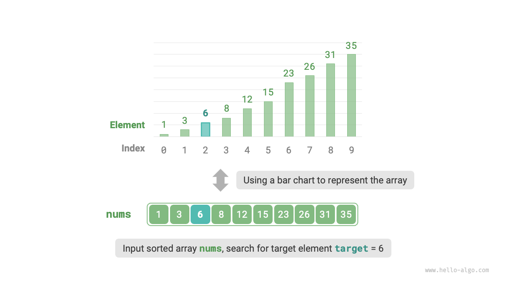
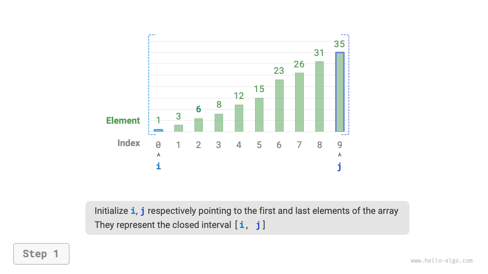
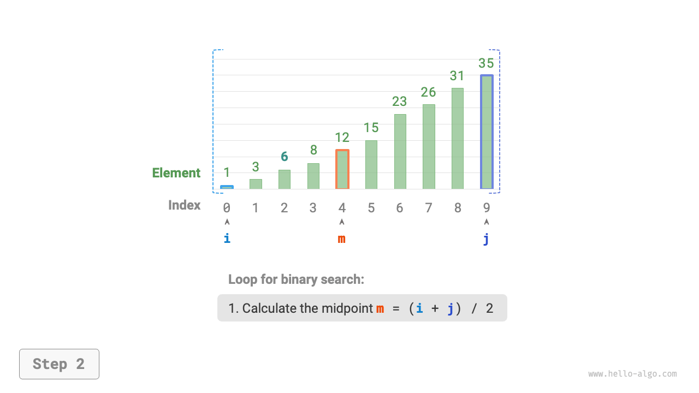
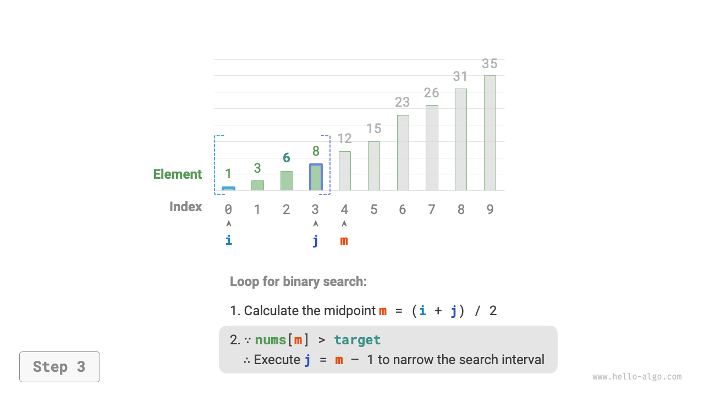
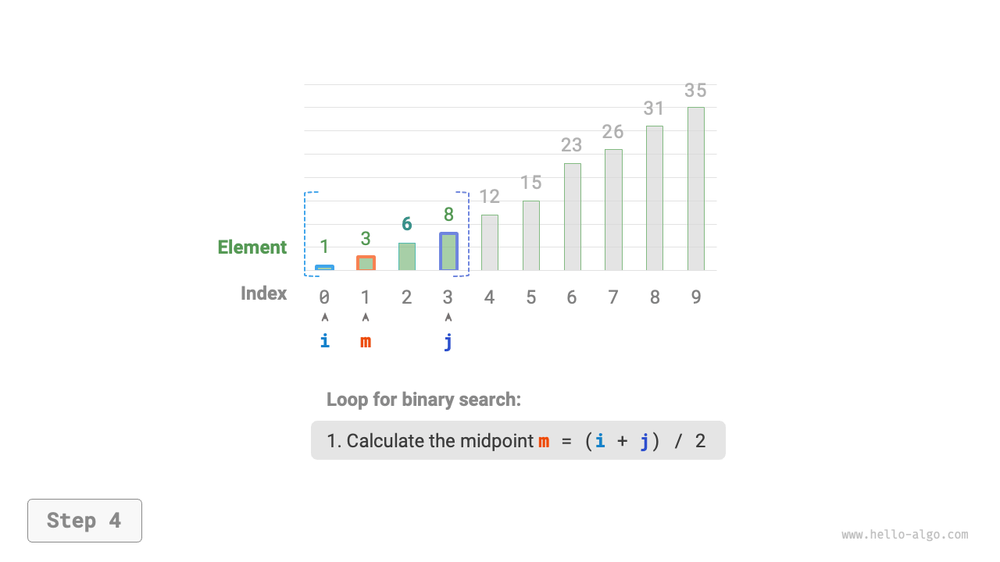
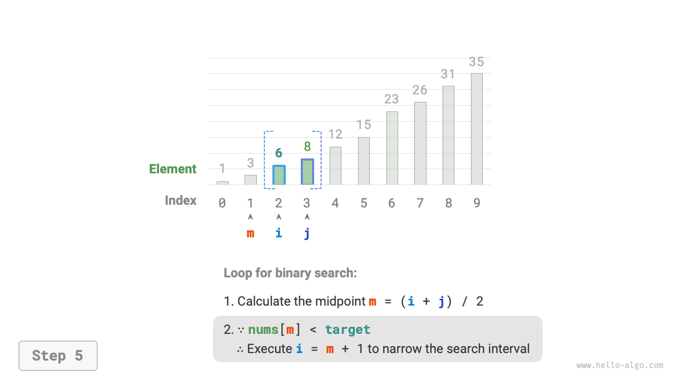
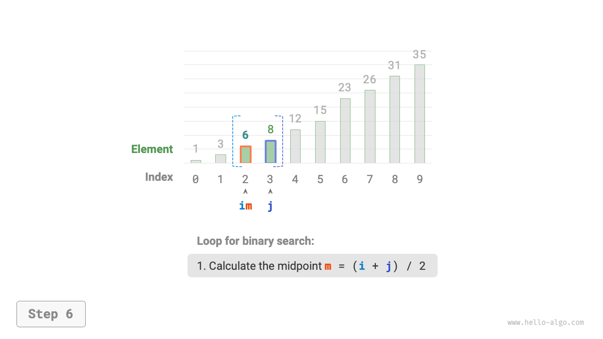
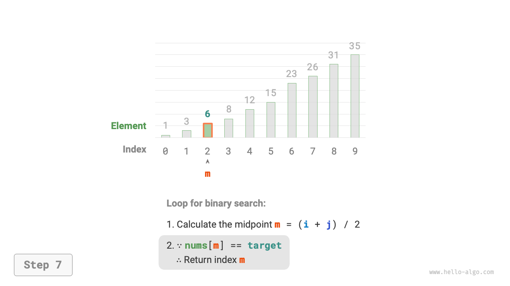
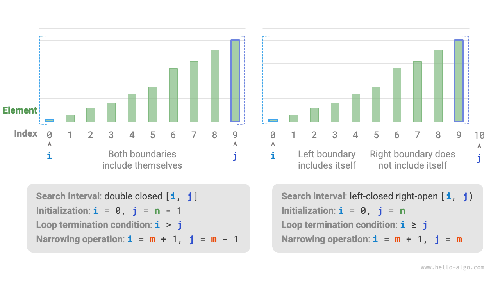

# 二分探索

<u>二分探索（binary search）</u>は分割統治法に基づく効率的な探索アルゴリズムです。データが整列済みである性質を利用し、各ラウンドで探索範囲を半分に縮小し、目標要素を見つけるか探索区間が空になるまで続けます。

!!! question

    長さ $n$ の配列 `nums` が与えられます。要素は小さい順に並んでおり、重複しません。要素 `target` がこの配列内にある場合はそのインデックスを返し、含まれない場合は $-1$ を返してください。例を次の図に示します。



次の図に示すように、まずポインタ $i = 0$ と $j = n - 1$ を初期化し、それぞれ配列の先頭要素と末尾要素を指すようにして、探索区間 $[0, n - 1]$ を表します。角括弧は閉区間を表し、境界値自体を含むことに注意してください。

次に、以下の 2 つの手順を繰り返します。

1. 中央のインデックス $m = \lfloor {(i + j) / 2} \rfloor$ を計算します。ここで $\lfloor \: \rfloor$ は切り捨てを表します。
2. `nums[m]` と `target` の大小関係を判定し、次の 3 つの場合に分かれます。
    1. `nums[m] < target` のとき、`target` は区間 $[m + 1, j]$ にあるため、$i = m + 1$ を実行します。
    2. `nums[m] > target` のとき、`target` は区間 $[i, m - 1]$ にあるため、$j = m - 1$ を実行します。
    3. `nums[m] = target` のとき、`target` が見つかったので、インデックス $m$ を返します。

配列に目標要素が含まれない場合、探索区間は最終的に空まで縮小されます。このとき $-1$ を返します。

=== "<1>"
    

=== "<2>"
    

=== "<3>"
    

=== "<4>"
    

=== "<5>"
    

=== "<6>"
    

=== "<7>"
    

注意すべき点として、$i$ と $j$ はどちらも `int` 型であるため、**$i + j$ が `int` 型の範囲を超える可能性があります**。大きな数によるオーバーフローを避けるため、通常は式 $m = \lfloor {i + (j - i) / 2} \rfloor$ を用いて中点を計算します。

コードは次のとおりです。

```src
[file]{binary_search}-[class]{}-[func]{binary_search}
```

**時間計算量は $O(\log n)$** ：二分探索のループでは各ラウンドで区間が半分になるため、ループ回数は $\log_2 n$ です。

**空間計算量は $O(1)$** ：ポインタ $i$ と $j$ に必要なのは定数サイズの空間だけです。

## 区間の表し方

上記の両閉区間のほかに、一般的な区間表現として「左閉右開」区間があり、$[0, n)$ と定義されます。つまり左端は含み、右端は含みません。この表現では、区間 $[i, j)$ は $i = j$ のとき空です。

この表現に基づいて、同じ機能を持つ二分探索アルゴリズムを実装できます。

```src
[file]{binary_search}-[class]{}-[func]{binary_search_lcro}
```

次の図に示すように、2 種類の区間表現では、二分探索アルゴリズムの初期化、ループ条件、区間の縮小操作がそれぞれ異なります。

「両閉区間」の表現では左右の境界がどちらも閉区間として定義されるため、ポインタ $i$ とポインタ $j$ による区間縮小の操作も対称になります。このほうがミスをしにくいため、**一般には「両閉区間」の書き方を推奨します**。



## 利点と限界

二分探索は時間と空間の両面で優れた性能を持ちます。

- 二分探索は時間効率が高いです。データ量が大きい場合、対数時間計算量は大きな優位性を持ちます。たとえば、データサイズ $n = 2^{20}$ のとき、線形探索では $2^{20} = 1048576$ 回のループが必要ですが、二分探索では $\log_2 2^{20} = 20$ 回で済みます。
- 二分探索は追加の空間を必要としません。追加領域を要する探索アルゴリズム（たとえばハッシュ探索）と比べて、二分探索はより省メモリです。

しかし、二分探索があらゆる状況に適しているわけではなく、主な理由は次のとおりです。

- 二分探索は整列済みデータにしか適用できません。入力データが無秩序な場合、二分探索を使うためだけにソートするのは割に合いません。ソートアルゴリズムの時間計算量は通常 $O(n \log n)$ であり、線形探索や二分探索よりも高いからです。要素を頻繁に挿入する場面では、配列の整列性を保つために特定位置へ挿入する必要があり、その時間計算量は $O(n)$ と高コストです。
- 二分探索は配列にしか適していません。二分探索では要素へ飛び飛びにアクセスする必要がありますが、連結リストでそのようなアクセスを行う効率は低いため、連結リストやそれを基に実装されたデータ構造には向きません。
- データ量が小さい場合は線形探索のほうが高性能です。線形探索では各ラウンドで 1 回の比較だけで済みますが、二分探索では 1 回の加算、1 回の除算、1 ~ 3 回の比較、1 回の加算（減算）が必要で、合計 4 ~ 6 個の基本操作になります。したがって、データ量 $n$ が小さいときは、線形探索のほうがかえって速くなります。
