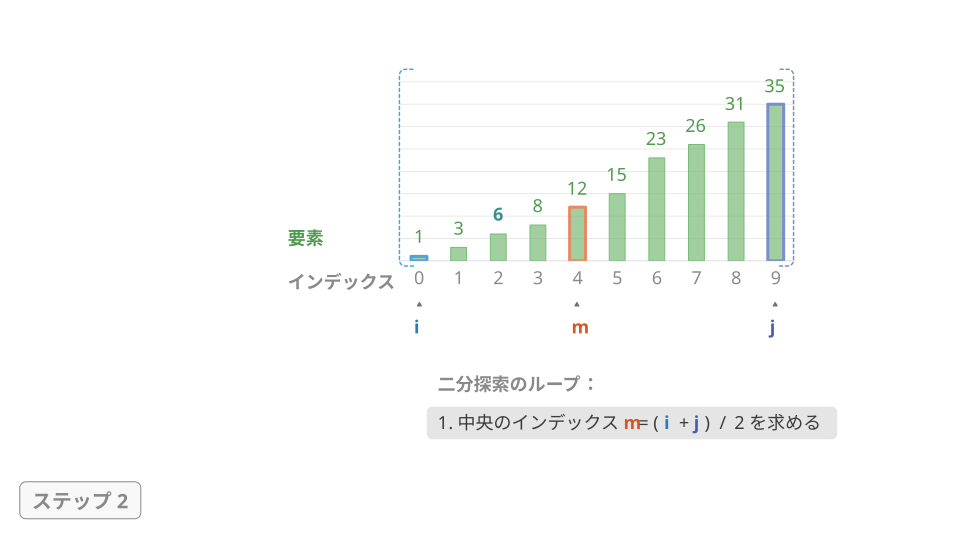
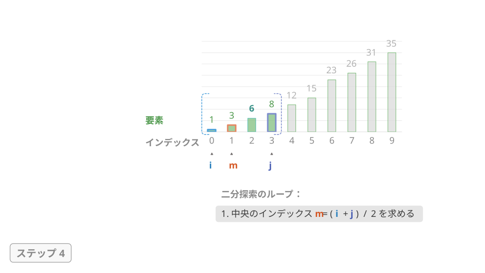
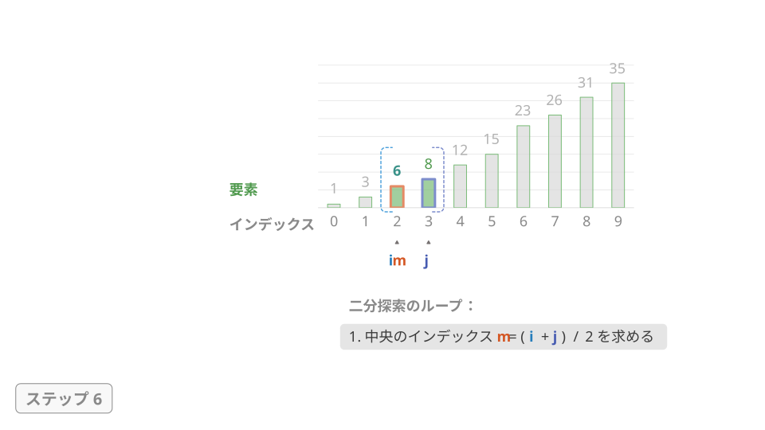
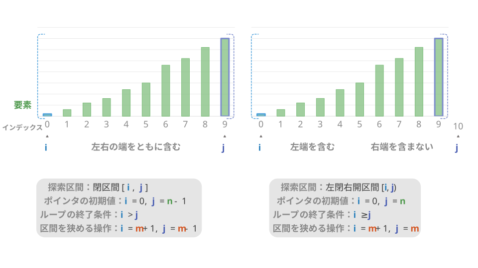

# 二分探索

<u>二分探索（binary search）</u>は、分割統治法に基づく効率のよい探索アルゴリズムです。データが整列済みであることを利用し、目標の要素が見つかるか探索区間が空になるまで、探索範囲を毎回半分に狭めます。

!!! question

    長さ $n$ の配列 `nums` が与えられます。要素は小さい順に並び、重複はありません。要素 `target` を探し、配列内のインデックスを返してください。その要素が配列になければ $-1$ を返してください。次の図に例を示します。


次の図のように、まずポインタを $i = 0$、$j = n - 1$ と初期化します。それぞれ配列の先頭要素と末尾要素を指し、探索区間 $[0, n - 1]$ を表します。角括弧は両端の値を含む閉区間を表します。

続いて、次の二つの手順を繰り返します。

1. 中央のインデックス $m = \lfloor {(i + j) / 2} \rfloor$ を求めます。ここで $\lfloor \: \rfloor$ は小数点以下を切り捨てる操作を表します。
2. `nums[m]` と `target` の大小関係を調べます。次の三つの場合があります。
    1. `nums[m] < target` のとき、`target` があるとすれば区間 $[m + 1, j]$ 内なので、$i = m + 1$ とします。
    2. `nums[m] > target` のとき、`target` があるとすれば区間 $[i, m - 1]$ 内なので、$j = m - 1$ とします。
    3. `nums[m] = target` のとき、`target` が見つかったのでインデックス $m$ を返します。

配列に目標の要素がなければ、探索区間はやがて空になります。そのときは $-1$ を返します。

=== "<1>"
    

=== "<2>"
    

=== "<3>"
    

=== "<4>"
    

=== "<5>"
    

=== "<6>"
    

=== "<7>"
    

$i$ と $j$ はどちらも `int` 型なので、**$i + j$ が `int` 型で表せる範囲を超える可能性があります**。このオーバーフローを避けるため、通常は $m = \lfloor {i + (j - i) / 2} \rfloor$ という式で中央のインデックスを求めます。

コードを以下に示します。

```src
[file]{binary_search}-[class]{}-[func]{binary_search}
```

**時間計算量は $O(\log n)$** です。二分探索のループでは区間が毎回半分に狭まるので、繰り返し回数は $\log_2 n$ です。

**空間計算量は $O(1)$** です。ポインタ $i$ と $j$ が使う領域の大きさは一定です。

## 区間の表し方

先ほどの閉区間のほかに、よく使う表し方に「左閉右開区間」があります。$[0, n)$ と表し、左端を含み、右端を含みません。この表し方では、区間 $[i, j)$ は $i = j$ のときに空になります。

この表し方でも、同じ働きをする二分探索を実装できます。

```src
[file]{binary_search}-[class]{}-[func]{binary_search_lcro}
```

次の図のように、どちらの区間を使うかによって、二分探索の初期化、ループ条件、区間の狭め方が変わります。

閉区間は左右の端をどちらも含むので、ポインタ $i$ で区間を狭める操作と、ポインタ $j$ で狭める操作は対称になります。それだけ間違いにくいため、**一般には閉区間を使う書き方を勧めます**。



## 利点と制約

二分探索は時間と記憶領域の両面で効率に優れています。

- 二分探索は高速です。データ量が多いとき、時間計算量が対数オーダーであることは大きな利点です。たとえば、データ数が $n = 2^{20}$ のとき、線形探索ではループが $2^{20} = 1048576$ 回必要ですが、二分探索ではわずか $\log_2 2^{20} = 20$ 回です。
- 二分探索には追加の記憶領域が必要ありません。ハッシュ探索のように追加の領域を使う探索アルゴリズムと比べて、メモリを節約できます。

ただし、二分探索があらゆる場面に適しているわけではありません。主な理由を挙げます。

- 二分探索が使えるのは整列済みのデータに限られます。入力が未整列なら、二分探索のためだけにソートするのは割に合いません。ソートの時間計算量は通常 $O(n \log n)$ で、線形探索よりも二分探索よりも大きいためです。また、頻繁に要素を挿入する場合、配列の順序を保つには決まった位置に要素を挿入する必要があります。これにも $O(n)$ の時間がかかり、負担は大きくなります。
- 二分探索に適しているのは配列です。二分探索では、要素を順番にたどらず、離れた位置に飛んでアクセスします。連結リストでこのようなアクセスを行うと効率が悪いため、連結リストや、それを使って実装したデータ構造には適していません。
- データ量が少ないときは線形探索のほうが高速です。線形探索ではループ 1 回につき判定が 1 回で済みます。二分探索では加算 1 回、除算 1 回、判定 1～3 回、さらに加算または減算が 1 回あり、合計 4～6 回の基本操作が必要です。そのため、データ数 $n$ が小さいときは、かえって線形探索のほうが速くなります。
