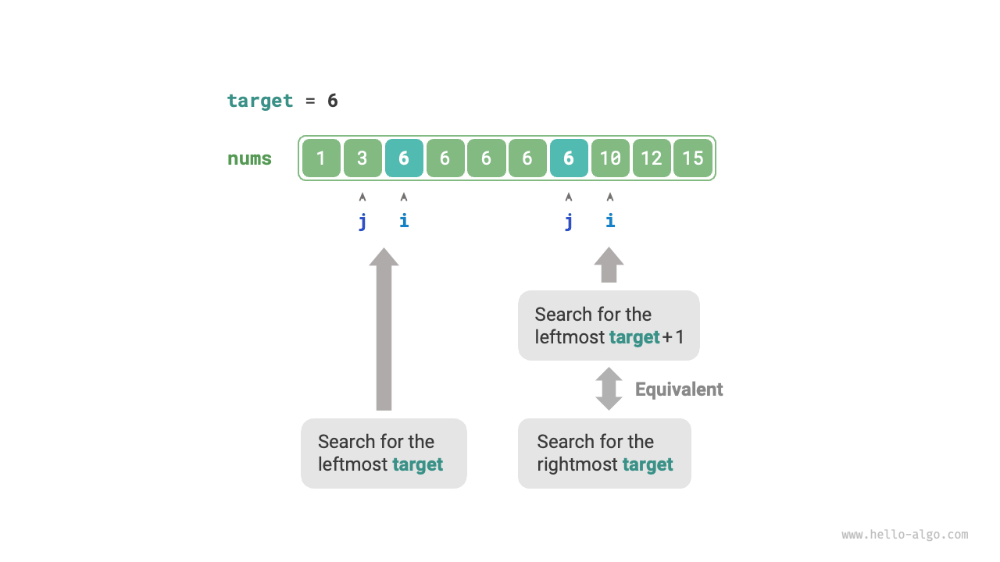
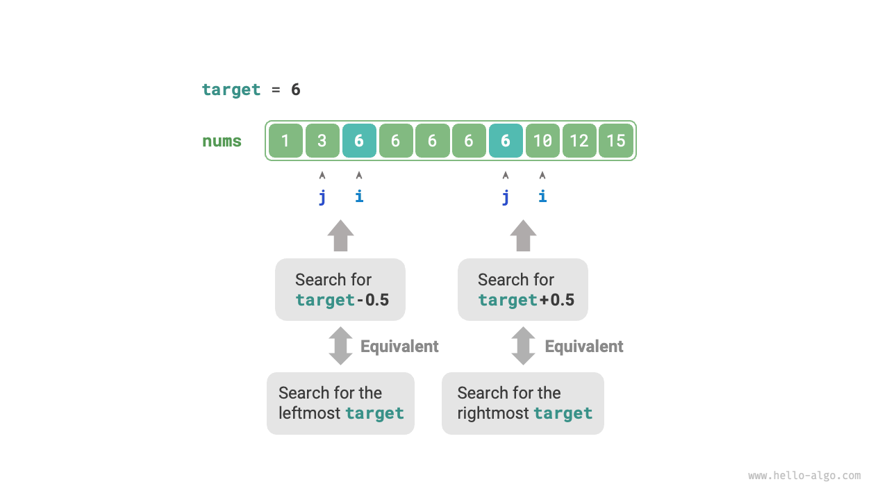

# 二分探索の境界

## 左境界を見つける

!!! question

    重複要素を含む可能性がある長さ$n$のソート済み配列`nums`が与えられ、最も左の要素`target`のインデックスを返してください。要素が配列に存在しない場合は、$-1$を返してください。

挿入位置の二分探索方法を思い出すと、探索完了後、インデックス$i$は`target`の最も左の出現を指します。したがって、**挿入位置の探索は本質的に最も左の`target`のインデックスを見つけることと同じです**。

挿入位置を見つける関数を使用して`target`の左境界を見つけることができます。配列に`target`が含まれていない可能性があることに注意してください。これは以下の2つの結果につながる可能性があります：

- 挿入位置のインデックス$i$が範囲外です。
- 要素`nums[i]`が`target`と等しくありません。

これらの場合、単に$-1$を返します。コードは以下の通りです：

```src
[file]{binary_search_edge}-[class]{}-[func]{binary_search_left_edge}
```

## 右境界を見つける

`target`の最も右の出現をどのように見つけるでしょうか？最も直接的な方法は、`nums[m] == target`の場合に探索境界を調整する方法を変更して、従来の二分探索ロジックを修正することです。コードはここでは省略されています。興味がある場合は、自分でコードを実装してみてください。

以下では、さらに2つの巧妙な方法を紹介します。

### 左境界探索を再利用する

`target`の最も右の出現を見つけるには、最も左の`target`を見つけるために使用された関数を再利用できます。具体的には、最も右のターゲットの探索を最も左のターゲット + 1の探索に変換します。

下図に示すように、探索完了後、ポインタ$i$は最も左の`target + 1`（存在する場合）を指し、ポインタ$j$は`target`の最も右の出現を指します。したがって、$j$を返すことで右境界が得られます。



返される挿入位置は$i$であることに注意してください。したがって、$j$を得るためには1を引く必要があります：

```src
[file]{binary_search_edge}-[class]{}-[func]{binary_search_right_edge}
```

### 要素探索に変換する

配列に`target`が含まれていない場合、$i$と$j$は最終的に`target`より大きい最初の要素と小さい最初の要素をそれぞれ指します。

したがって、下図に示すように、配列に存在しない要素を構築して、左と右の境界を探索できます。

- 最も左の`target`を見つけるには：`target - 0.5`を探索することに変換でき、ポインタ$i$を返します。
- 最も右の`target`を見つけるには：`target + 0.5`を探索することに変換でき、ポインタ$j$を返します。



コードはここでは省略されていますが、このアプローチについて注意すべき2つの重要な点があります。

- 与えられた配列`nums`には小数が含まれていないため、等しい場合の処理は心配ありません。
- ただし、このアプローチで小数を導入するには、`target`変数を浮動小数点型に変更する必要があります（Pythonでは変更は不要です）。
