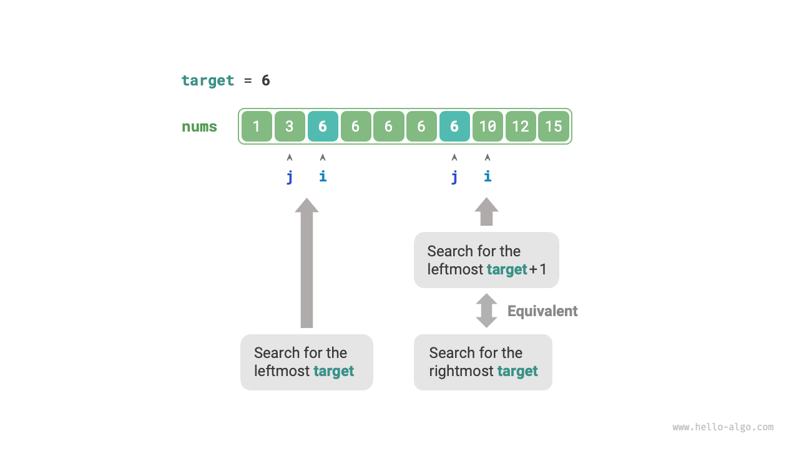
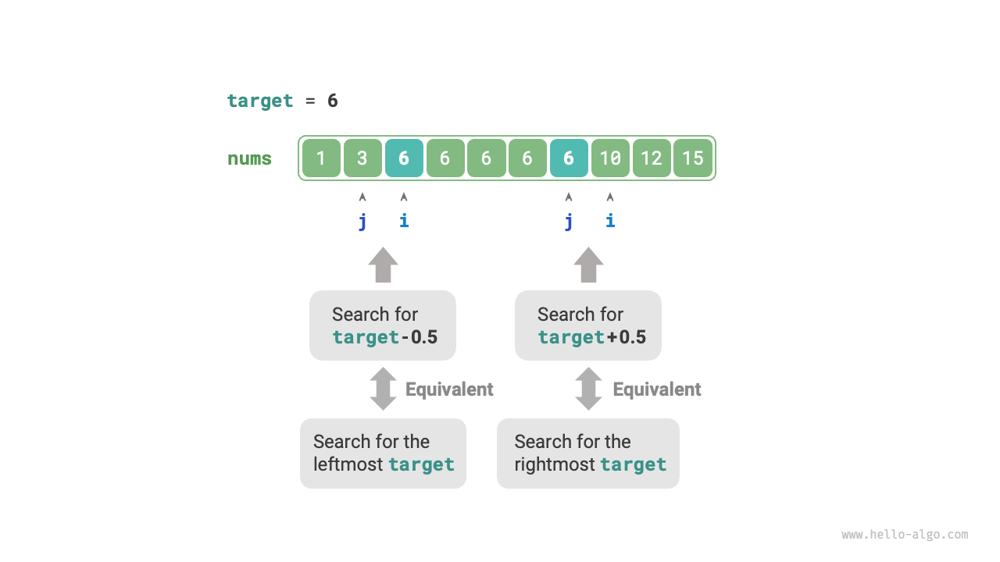

# 二分探索の境界

## 左端境界を探す

!!! question

    長さ $n$ のソート済み配列 `nums` が与えられ、その中には重複要素が含まれる可能性があります。配列内で最も左にある要素 `target` のインデックスを返してください。配列にこの要素が含まれない場合は、$-1$ を返します。

二分探索で挿入位置を求める方法を思い出すと、探索完了後に $i$ は最も左にある `target` を指します。**したがって、挿入位置を探すことの本質は、最も左にある `target` のインデックスを探すことです**。

挿入位置を探す関数を使って左端境界を求めることを考えます。なお、配列に `target` が含まれない場合があり、そのときは次の 2 つの結果が起こりえます。

- 挿入位置のインデックス $i$ が範囲外になる。
- 要素 `nums[i]` が `target` と等しくない。

上の 2 つの状況に当てはまる場合は、直接 $-1$ を返せば十分です。コードは以下のとおりです：

```src
[file]{binary_search_edge}-[class]{}-[func]{binary_search_left_edge}
```

## 右端境界を探す

では、最も右にある `target` はどのように探せるでしょうか。最も直接的な方法はコードを修正し、`nums[m] == target` の場合のポインタの縮小操作を置き換えることです。ここではコードを省略するので、興味があれば自分で実装してみてください。

ここでは、より巧妙な 2 つの方法を紹介します。

### 左端境界探索を再利用する

実際には、最も左の要素を探す関数を利用して最も右の要素を探せます。具体的には、**最も右にある `target` を探すことを、最も左にある `target + 1` を探すことに変換します**。

下図のように、探索完了後、ポインタ $i$ は最も左にある `target + 1`（存在する場合）を指し、$j$ は最も右にある `target` を指します。**したがって $j$ を返せばよいです**。



返される挿入位置は $i$ なので、そこから $1$ を引いて $j$ を得る必要があることに注意してください：

```src
[file]{binary_search_edge}-[class]{}-[func]{binary_search_right_edge}
```

### 要素探索に変換する

配列に `target` が含まれない場合、最終的に $i$ と $j$ はそれぞれ `target` より大きい最初の要素と、`target` より小さい最初の要素を指すことになります。

したがって、下図のように、配列中に存在しない要素を構成して、それを使って左右の境界を探せます。

- 最も左にある `target` の探索：`target - 0.5` を探すことに変換でき、ポインタ $i$ を返します。
- 最も右にある `target` の探索：`target + 0.5` を探すことに変換でき、ポインタ $j$ を返します。



ここではコードを省略しますが、次の 2 点に注意が必要です。

- 与えられた配列には小数が含まれないため、等しい場合をどう処理するかを気にする必要はありません。
- この方法では小数を導入するため、関数内の変数 `target` を浮動小数点数型に変更する必要があります（Python は変更不要です）。
