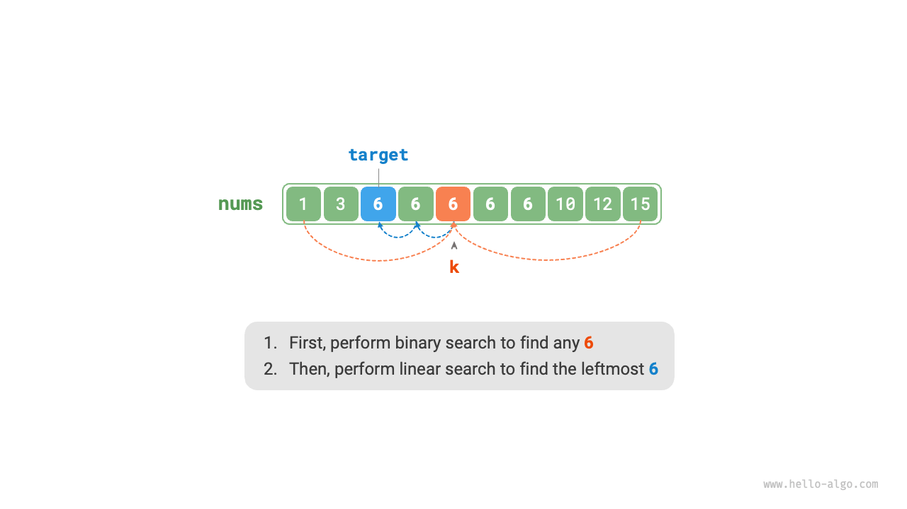
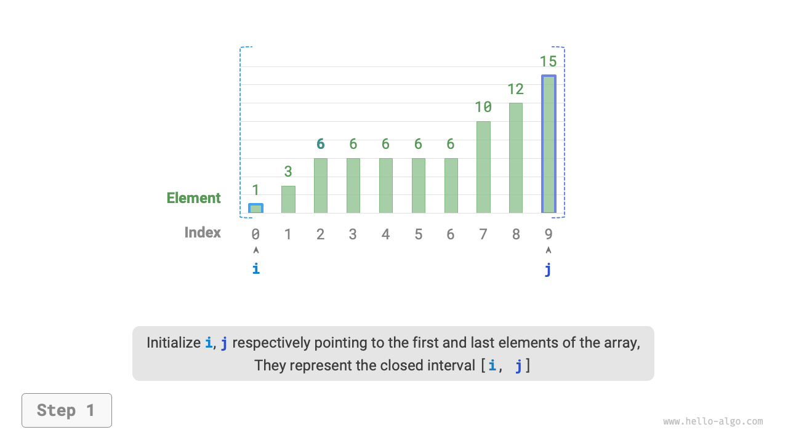
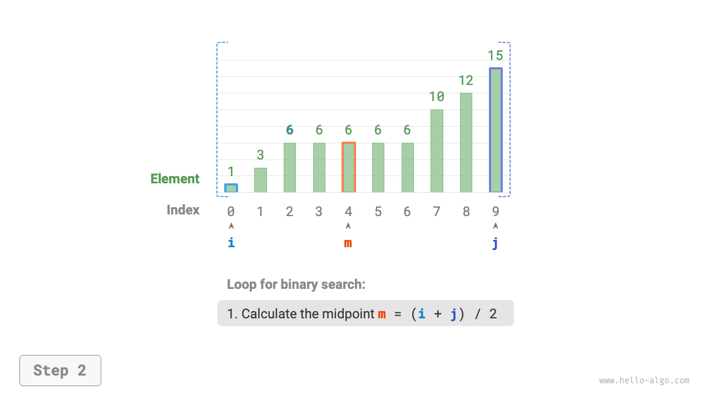
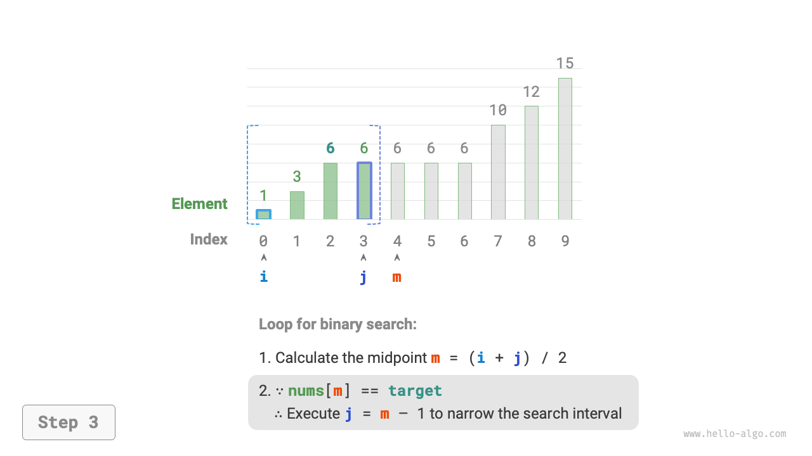
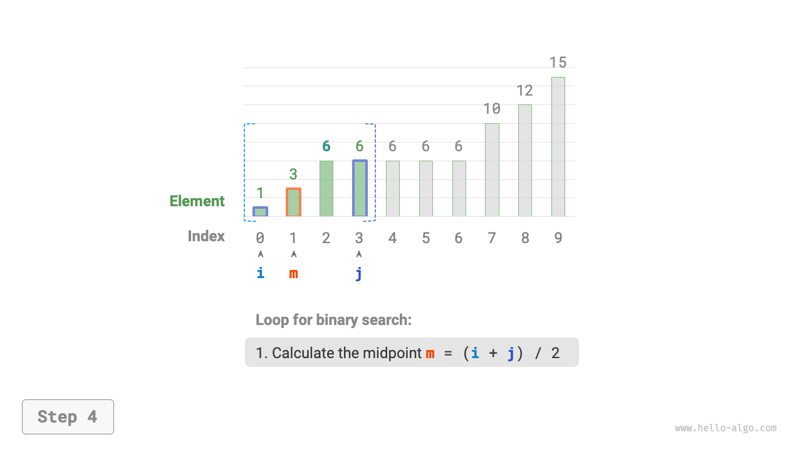
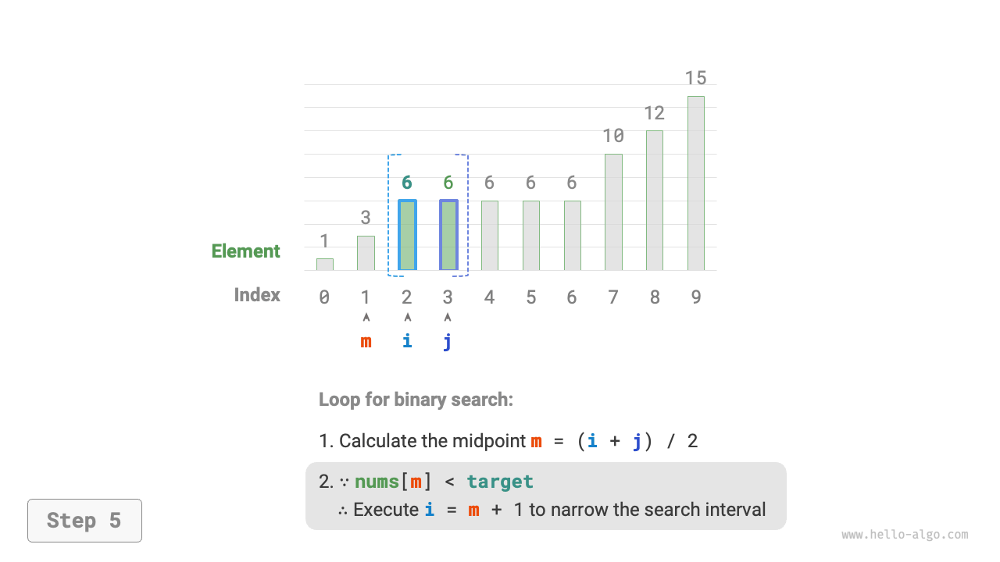
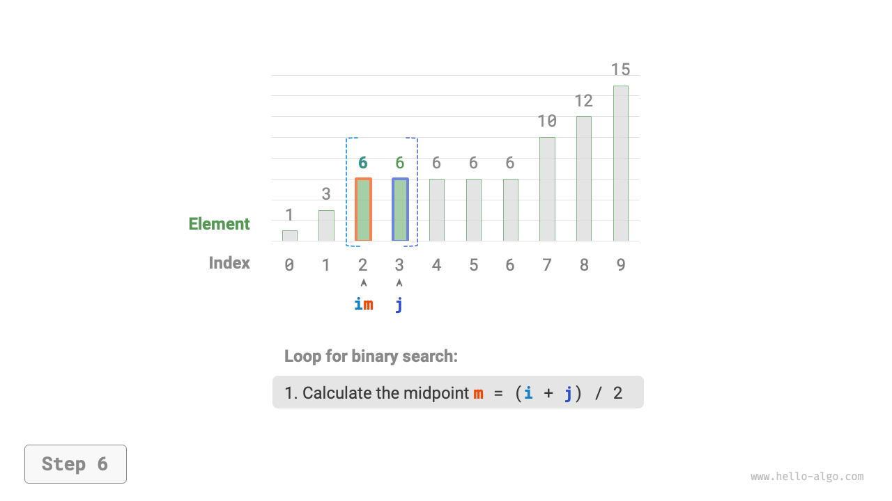
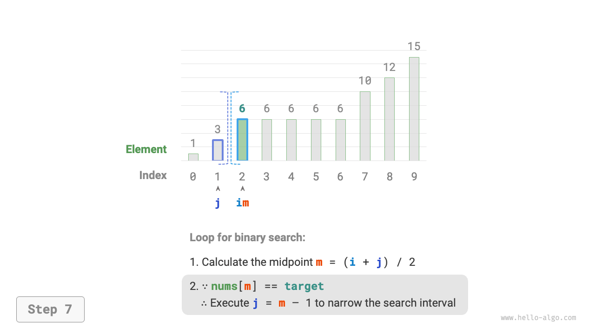
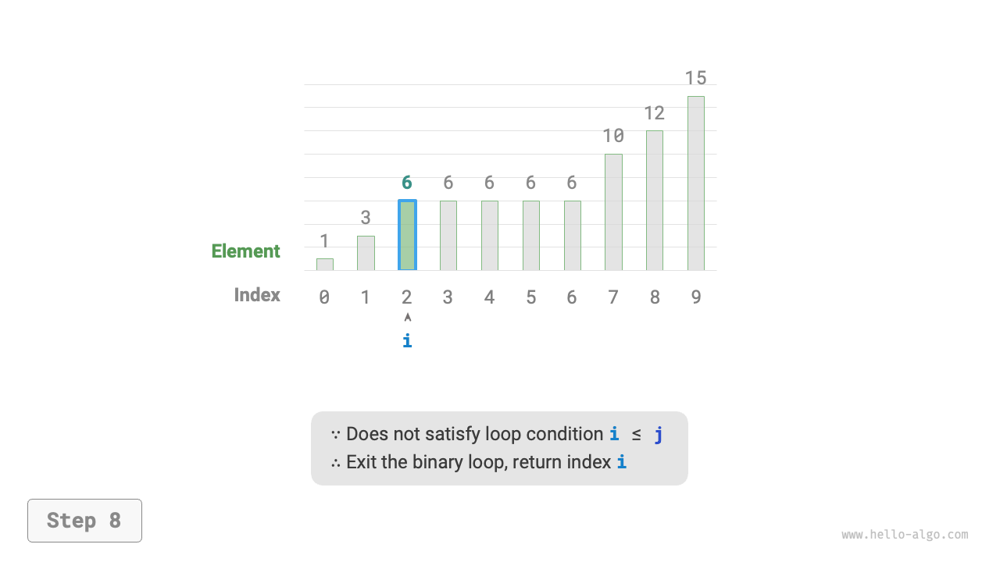

# 二分探索による挿入

二分探索は目標要素を探索するだけでなく、目標要素の挿入位置を探索するなど、多くの変種問題を解決するためにも使用されます。

## 重複要素がない場合

!!! question

    一意の要素を持つ長さ$n$のソート済み配列`nums`と要素`target`が与えられ、ソート順を維持しながら`target`を`nums`に挿入します。`target`が配列にすでに存在する場合は、既存の要素の左側に挿入します。挿入後の配列における`target`のインデックスを返してください。下図に示す例を参照してください。


前のセクションの二分探索コードを再利用したい場合、以下の2つの質問に答える必要があります。

**質問1**：配列にすでに`target`が含まれている場合、挿入位置は既存要素のインデックスになりますか？

`target`を等しい要素の左側に挿入するという要件は、新しく挿入される`target`が元の`target`の位置を置き換えることを意味します。つまり、**配列に`target`が含まれている場合、挿入位置は確かにその`target`のインデックスです**。

**質問2**：配列に`target`が含まれていない場合、どのインデックスに挿入されますか？

二分探索プロセスをさらに考えてみましょう：`nums[m] < target`のとき、ポインタ$i$が移動します。これは、ポインタ$i$が`target`以上の要素に近づいていることを意味します。同様に、ポインタ$j$は常に`target`以下の要素に近づいています。

したがって、二分の終了時には確実に：$i$は`target`より大きい最初の要素を指し、$j$は`target`より小さい最初の要素を指します。**配列に`target`が含まれていない場合、挿入位置は$i$であることは明らかです**。コードは以下の通りです：

```src
[file]{binary_search_insertion}-[class]{}-[func]{binary_search_insertion_simple}
```

## 重複要素がある場合

!!! question

    前の質問に基づいて、配列に重複要素が含まれている可能性があると仮定し、他はすべて同じとします。

配列に`target`の複数の出現がある場合、通常の二分探索は`target`の1つの出現のインデックスのみを返すことができ、**その位置の左右に`target`の出現がいくつあるかを特定することはできません**。

問題では目標要素を最も左の位置に挿入することが要求されているため、**配列内の最も左の`target`のインデックスを見つける必要があります**。最初に下図に示すステップを通してこれを実装することを考えてみましょう。

1. 二分探索を実行して`target`の任意のインデックス、例えば$k$を見つけます。
2. インデックス$k$から開始して、最も左の`target`の出現が見つかるまで左に線形探索を行い、このインデックスを返します。



この方法は実現可能ですが、線形探索を含むため、時間計算量は$O(n)$です。この方法は、配列に多くの重複する`target`が含まれている場合に非効率です。

今度は二分探索コードを拡張することを考えてみましょう。下図に示すように、全体的なプロセスは同じままです。各ラウンドで、まず中間インデックス$m$を計算し、次に`target`と`nums[m]`の値を比較して、以下のケースになります。

- `nums[m] < target`または`nums[m] > target`のとき、これは`target`がまだ見つかっていないことを意味するため、通常の二分探索を使用して探索範囲を狭め、**ポインタ$i$と$j$を`target`に近づけます**。
- `nums[m] == target`のとき、これは`target`より小さい要素が範囲$[i, m - 1]$にあることを示すため、$j = m - 1$を使用して範囲を狭め、**ポインタ$j$を`target`より小さい要素に近づけます**。

ループ後、$i$は最も左の`target`を指し、$j$は`target`より小さい最初の要素を指すため、**インデックス$i$が挿入位置です**。

=== "<1>"
    

=== "<2>"
    

=== "<3>"
    

=== "<4>"
    

=== "<5>"
    

=== "<6>"
    

=== "<7>"
    

=== "<8>"
    

以下のコードを観察してください。分岐`nums[m] > target`と`nums[m] == target`の操作は同じであるため、これら2つの分岐をマージできます。

それでも、ロジックがより明確になり、可読性が向上するため、条件を展開したままにしておくことができます。

```src
[file]{binary_search_insertion}-[class]{}-[func]{binary_search_insertion}
```

!!! tip

    このセクションのコードは「閉区間」を使用しています。「左閉右開」に興味がある場合は、自分でコードを実装してみてください。

要約すると、二分探索は本質的にポインタ$i$と$j$の探索目標を設定することです。これらの目標は特定の要素（`target`など）または要素の範囲（`target`より小さいものなど）である可能性があります。

二分探索の連続ループにおいて、ポインタ$i$と$j$は段階的に事前定義された目標に近づきます。最終的に、それらは答えを見つけるか、境界を越えた後に停止します。
