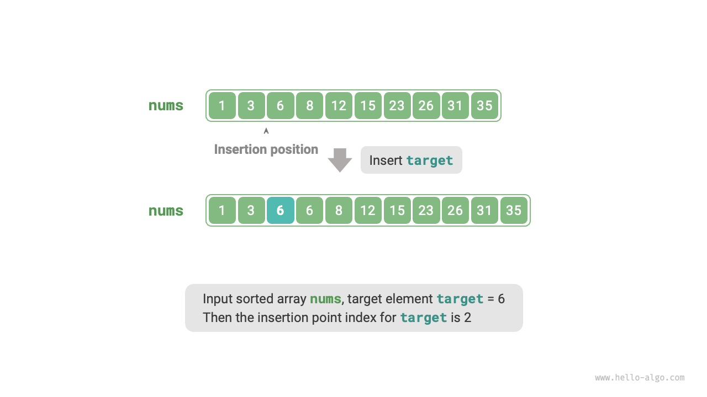
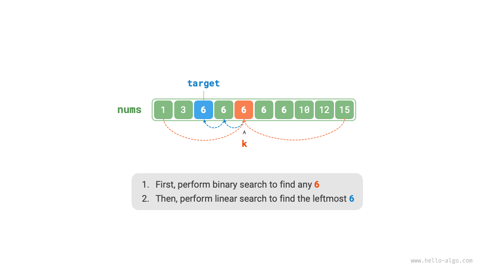
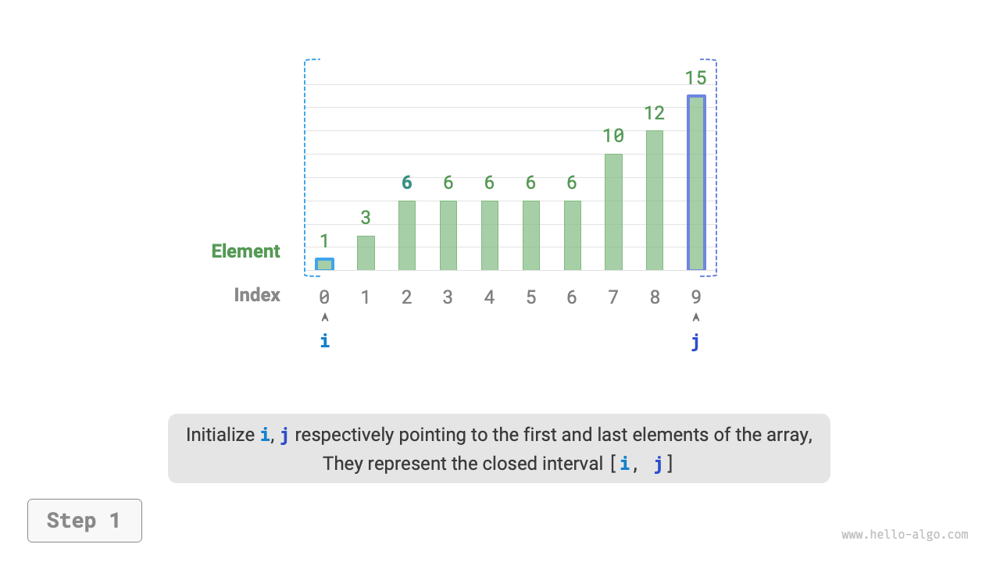
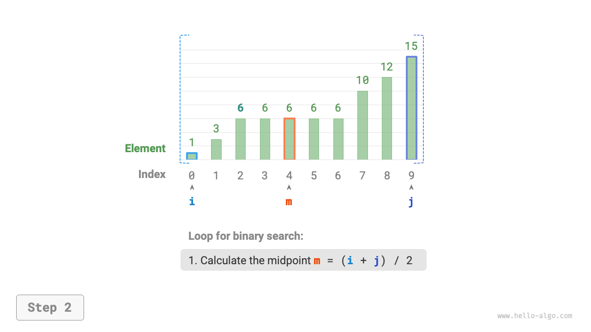
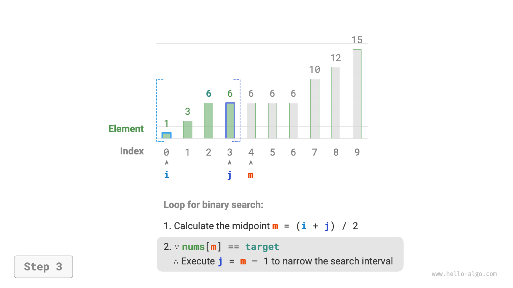
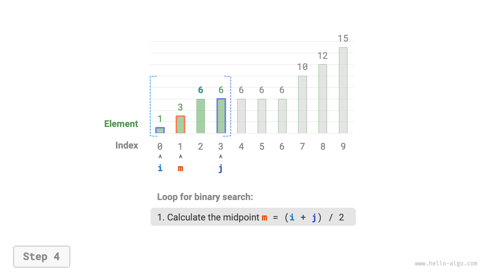
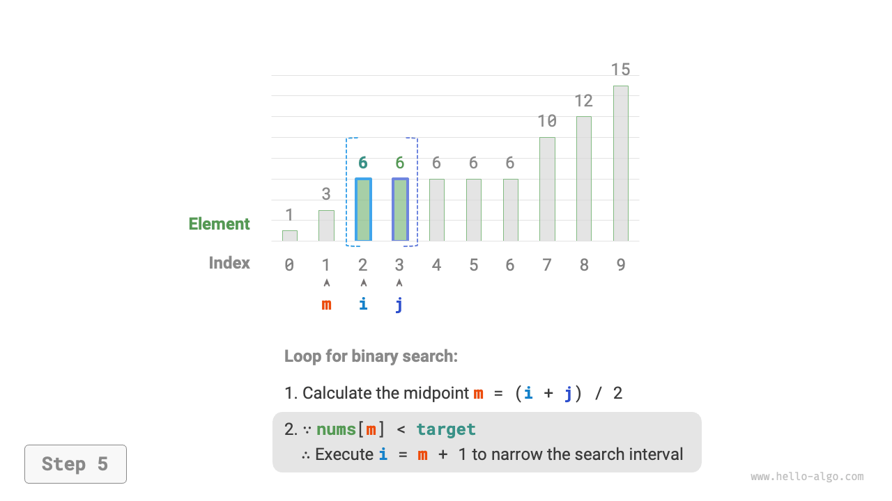
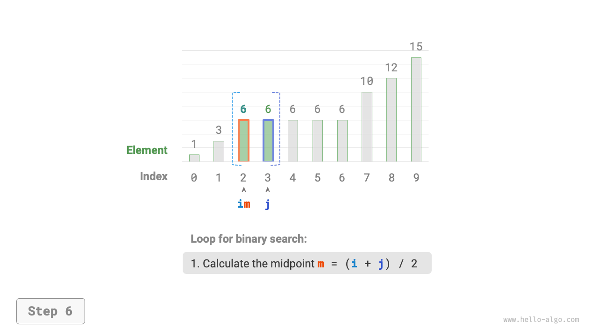
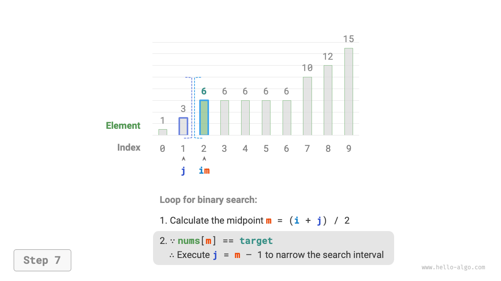
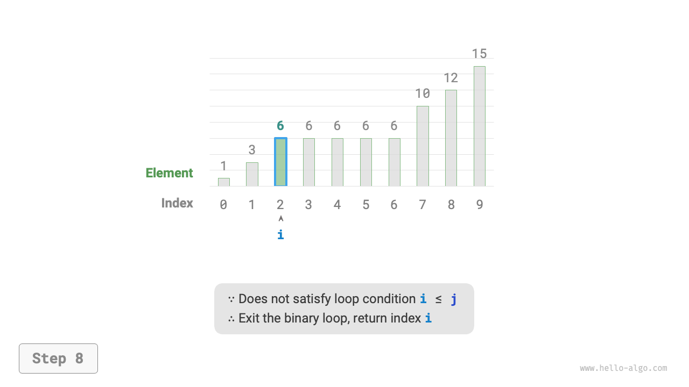

# 10.2 &nbsp; 二分探索の挿入位置

二分探索は目標要素の検索だけでなく、目標要素の挿入位置を探すなど、多くの派生問題の解決にも利用できます。

## 10.2.1 &nbsp; 重複要素がない場合

!!! question

    長さ $n$ の整列済み配列 `nums` と要素 `target` が与えられます。配列には重複要素は存在しません。ここで `target` を配列 `nums` に挿入し、その順序を保ちます。配列中にすでに要素 `target` が存在する場合は、その左側に挿入します。挿入後の配列における `target` のインデックスを返してください。例を以下の図に示します。

{ class="animation-figure" }

<p align="center"> 図 10-4 &nbsp; 二分探索の挿入位置の例データ </p>

前節の二分探索コードを再利用したい場合は、次の二つの問題に答える必要があります。

**問題 1**：配列に `target` が含まれる場合、挿入位置のインデックスはその要素のインデックスですか？

問題では `target` を等しい要素の左側に挿入するよう求めているため、新しく挿入された `target` は元の `target` の位置に入ります。つまり、**配列に `target` が含まれる場合、挿入位置のインデックスはその `target` のインデックスです**。

**問題 2**：配列に `target` が存在しない場合、挿入位置はどの要素のインデックスですか？

二分探索の過程をさらに考えると、`nums[m] < target` のときは $i$ が移動します。これは、ポインタ $i$ が `target` 以上の要素へ近づいていることを意味します。同様に、ポインタ $j$ は常に `target` 以下の要素へ近づいています。

したがって二分探索の終了時には、$i$ は最初の `target` より大きい要素を指し、$j$ は最初の `target` より小さい要素を指します。**よって、配列に `target` が含まれない場合、挿入インデックスは $i$ です**。コードは次のとおりです：

=== "Python"

    ```python title="binary_search_insertion.py"
    def binary_search_insertion_simple(nums: list[int], target: int) -> int:
        """二分探索で挿入位置を探す（重複要素なし）"""
        i, j = 0, len(nums) - 1  # 両閉区間 [0, n-1] を初期化
        while i <= j:
            m = (i + j) // 2  # 中点インデックス m を計算
            if nums[m] < target:
                i = m + 1  # target は区間 [m+1, j] にある
            elif nums[m] > target:
                j = m - 1  # target は区間 [i, m-1] にある
            else:
                return m  # target が見つかったら、挿入位置 m を返す
        # target が見つからなければ、挿入位置 i を返す
        return i
    ```

=== "C++"

    ```cpp title="binary_search_insertion.cpp"
    /* 二分探索で挿入位置を探す（重複要素なし） */
    int binarySearchInsertionSimple(vector<int> &nums, int target) {
        int i = 0, j = nums.size() - 1; // 両閉区間 [0, n-1] を初期化
        while (i <= j) {
            int m = i + (j - i) / 2; // 中点インデックス m を計算
            if (nums[m] < target) {
                i = m + 1; // target は区間 [m+1, j] にある
            } else if (nums[m] > target) {
                j = m - 1; // target は区間 [i, m-1] にある
            } else {
                return m; // target が見つかったら、挿入位置 m を返す
            }
        }
        // target が見つからなければ、挿入位置 i を返す
        return i;
    }
    ```

=== "Java"

    ```java title="binary_search_insertion.java"
    /* 二分探索で挿入位置を探す（重複要素なし） */
    int binarySearchInsertionSimple(int[] nums, int target) {
        int i = 0, j = nums.length - 1; // 両閉区間 [0, n-1] を初期化
        while (i <= j) {
            int m = i + (j - i) / 2; // 中点インデックス m を計算
            if (nums[m] < target) {
                i = m + 1; // target は区間 [m+1, j] にある
            } else if (nums[m] > target) {
                j = m - 1; // target は区間 [i, m-1] にある
            } else {
                return m; // target が見つかったら、挿入位置 m を返す
            }
        }
        // target が見つからなければ、挿入位置 i を返す
        return i;
    }
    ```

=== "C#"

    ```csharp title="binary_search_insertion.cs"
    /* 二分探索で挿入位置を探す（重複要素なし） */
    int BinarySearchInsertionSimple(int[] nums, int target) {
        int i = 0, j = nums.Length - 1; // 両閉区間 [0, n-1] を初期化
        while (i <= j) {
            int m = i + (j - i) / 2; // 中点インデックス m を計算
            if (nums[m] < target) {
                i = m + 1; // target は区間 [m+1, j] にある
            } else if (nums[m] > target) {
                j = m - 1; // target は区間 [i, m-1] にある
            } else {
                return m; // target が見つかったら、挿入位置 m を返す
            }
        }
        // target が見つからなければ、挿入位置 i を返す
        return i;
    }
    ```

=== "Go"

    ```go title="binary_search_insertion.go"
    /* 二分探索で挿入位置を探す（重複要素なし） */
    func binarySearchInsertionSimple(nums []int, target int) int {
        // 両閉区間 [0, n-1] を初期化
        i, j := 0, len(nums)-1
        for i <= j {
            // 中点インデックス m を計算
            m := i + (j-i)/2
            if nums[m] < target {
                // target は区間 [m+1, j] にある
                i = m + 1
            } else if nums[m] > target {
                // target は区間 [i, m-1] にある
                j = m - 1
            } else {
                // target が見つかったら、挿入位置 m を返す
                return m
            }
        }
        // target が見つからなければ、挿入位置 i を返す
        return i
    }
    ```

=== "Swift"

    ```swift title="binary_search_insertion.swift"
    /* 二分探索で挿入位置を探す（重複要素なし） */
    func binarySearchInsertionSimple(nums: [Int], target: Int) -> Int {
        // 両閉区間 [0, n-1] を初期化
        var i = nums.startIndex
        var j = nums.endIndex - 1
        while i <= j {
            let m = i + (j - i) / 2 // 中点インデックス m を計算
            if nums[m] < target {
                i = m + 1 // target は区間 [m+1, j] にある
            } else if nums[m] > target {
                j = m - 1 // target は区間 [i, m-1] にある
            } else {
                return m // target が見つかったら、挿入位置 m を返す
            }
        }
        // target が見つからなければ、挿入位置 i を返す
        return i
    }
    ```

=== "JS"

    ```javascript title="binary_search_insertion.js"
    /* 二分探索で挿入位置を探す（重複要素なし） */
    function binarySearchInsertionSimple(nums, target) {
        let i = 0,
            j = nums.length - 1; // 両閉区間 [0, n-1] を初期化
        while (i <= j) {
            const m = Math.floor(i + (j - i) / 2); // 中点インデックス m を計算し、Math.floor() で切り捨てる
            if (nums[m] < target) {
                i = m + 1; // target は区間 [m+1, j] にある
            } else if (nums[m] > target) {
                j = m - 1; // target は区間 [i, m-1] にある
            } else {
                return m; // target が見つかったら、挿入位置 m を返す
            }
        }
        // target が見つからなければ、挿入位置 i を返す
        return i;
    }
    ```

=== "TS"

    ```typescript title="binary_search_insertion.ts"
    /* 二分探索で挿入位置を探す（重複要素なし） */
    function binarySearchInsertionSimple(
        nums: Array<number>,
        target: number
    ): number {
        let i = 0,
            j = nums.length - 1; // 両閉区間 [0, n-1] を初期化
        while (i <= j) {
            const m = Math.floor(i + (j - i) / 2); // 中点インデックス m を計算し、Math.floor() で切り捨てる
            if (nums[m] < target) {
                i = m + 1; // target は区間 [m+1, j] にある
            } else if (nums[m] > target) {
                j = m - 1; // target は区間 [i, m-1] にある
            } else {
                return m; // target が見つかったら、挿入位置 m を返す
            }
        }
        // target が見つからなければ、挿入位置 i を返す
        return i;
    }
    ```

=== "Dart"

    ```dart title="binary_search_insertion.dart"
    /* 二分探索で挿入位置を探す（重複要素なし） */
    int binarySearchInsertionSimple(List<int> nums, int target) {
      int i = 0, j = nums.length - 1; // 両閉区間 [0, n-1] を初期化
      while (i <= j) {
        int m = i + (j - i) ~/ 2; // 中点インデックス m を計算
        if (nums[m] < target) {
          i = m + 1; // target は区間 [m+1, j] にある
        } else if (nums[m] > target) {
          j = m - 1; // target は区間 [i, m-1] にある
        } else {
          return m; // target が見つかったら、挿入位置 m を返す
        }
      }
      // target が見つからなければ、挿入位置 i を返す
      return i;
    }
    ```

=== "Rust"

    ```rust title="binary_search_insertion.rs"
    /* 二分探索で挿入位置を探す（重複要素なし） */
    fn binary_search_insertion_simple(nums: &[i32], target: i32) -> i32 {
        let (mut i, mut j) = (0, nums.len() as i32 - 1); // 両閉区間 [0, n-1] を初期化
        while i <= j {
            let m = i + (j - i) / 2; // 中点インデックス m を計算
            if nums[m as usize] < target {
                i = m + 1; // target は区間 [m+1, j] にある
            } else if nums[m as usize] > target {
                j = m - 1; // target は区間 [i, m-1] にある
            } else {
                return m;
            }
        }
        // target が見つからなければ、挿入位置 i を返す
        i
    }
    ```

=== "C"

    ```c title="binary_search_insertion.c"
    /* 二分探索で挿入位置を探す（重複要素なし） */
    int binarySearchInsertionSimple(int *nums, int numSize, int target) {
        int i = 0, j = numSize - 1; // 両閉区間 [0, n-1] を初期化
        while (i <= j) {
            int m = i + (j - i) / 2; // 中点インデックス m を計算
            if (nums[m] < target) {
                i = m + 1; // target は区間 [m+1, j] にある
            } else if (nums[m] > target) {
                j = m - 1; // target は区間 [i, m-1] にある
            } else {
                return m; // target が見つかったら、挿入位置 m を返す
            }
        }
        // target が見つからなければ、挿入位置 i を返す
        return i;
    }
    ```

=== "Kotlin"

    ```kotlin title="binary_search_insertion.kt"
    /* 二分探索で挿入位置を探す（重複要素なし） */
    fun binarySearchInsertionSimple(nums: IntArray, target: Int): Int {
        var i = 0
        var j = nums.size - 1 // 両閉区間 [0, n-1] を初期化
        while (i <= j) {
            val m = i + (j - i) / 2 // 中点インデックス m を計算
            if (nums[m] < target) {
                i = m + 1 // target は区間 [m+1, j] にある
            } else if (nums[m] > target) {
                j = m - 1 // target は区間 [i, m-1] にある
            } else {
                return m // target が見つかったら、挿入位置 m を返す
            }
        }
        // target が見つからなければ、挿入位置 i を返す
        return i
    }
    ```

=== "Ruby"

    ```ruby title="binary_search_insertion.rb"
    ### 二分探索の挿入位置（重複要素なし） ###
    def binary_search_insertion_simple(nums, target)
      # 両閉区間 [0, n-1] を初期化
      i, j = 0, nums.length - 1

      while i <= j
        # 中点インデックス m を計算
        m = (i + j) / 2

        if nums[m] < target
          i = m + 1 # target は区間 [m+1, j] にある
        elsif nums[m] > target
          j = m - 1 # target は区間 [i, m-1] にある
        else
          return m  # target が見つかったら、挿入位置 m を返す
        end
      end

      i # target が見つからなければ、挿入位置 i を返す
    end
    ```

??? pythontutor "コードの可視化"

    <div style="height: 549px; width: 100%;"><iframe class="pythontutor-iframe" src="https://pythontutor.com/iframe-embed.html#code=def%20binary_search_insertion_simple%28nums%3A%20list%5Bint%5D%2C%20target%3A%20int%29%20-%3E%20int%3A%0A%20%20%20%20%22%22%22%E4%BA%8C%E5%88%86%E6%8E%A2%E7%B4%A2%E3%81%A7%E6%8C%BF%E5%85%A5%E4%BD%8D%E7%BD%AE%E3%82%92%E6%8E%A2%E3%81%99%EF%BC%88%E9%87%8D%E8%A4%87%E8%A6%81%E7%B4%A0%E3%81%AA%E3%81%97%EF%BC%89%22%22%22%0A%20%20%20%20i%2C%20j%20%3D%200%2C%20len%28nums%29%20-%201%20%20%23%20%E4%B8%A1%E9%96%89%E5%8C%BA%E9%96%93%20%5B0%2C%20n-1%5D%20%E3%82%92%E5%88%9D%E6%9C%9F%E5%8C%96%0A%20%20%20%20while%20i%20%3C%3D%20j%3A%0A%20%20%20%20%20%20%20%20m%20%3D%20%28i%20%2B%20j%29%20%2F%2F%202%20%20%23%20%E4%B8%AD%E7%82%B9%E3%82%A4%E3%83%B3%E3%83%87%E3%83%83%E3%82%AF%E3%82%B9%20m%20%E3%82%92%E8%A8%88%E7%AE%97%0A%20%20%20%20%20%20%20%20if%20nums%5Bm%5D%20%3C%20target%3A%0A%20%20%20%20%20%20%20%20%20%20%20%20i%20%3D%20m%20%2B%201%20%20%23%20target%20%E3%81%AF%E5%8C%BA%E9%96%93%20%5Bm%2B1%2C%20j%5D%20%E3%81%AB%E3%81%82%E3%82%8B%0A%20%20%20%20%20%20%20%20elif%20nums%5Bm%5D%20%3E%20target%3A%0A%20%20%20%20%20%20%20%20%20%20%20%20j%20%3D%20m%20-%201%20%20%23%20target%20%E3%81%AF%E5%8C%BA%E9%96%93%20%5Bi%2C%20m-1%5D%20%E3%81%AB%E3%81%82%E3%82%8B%0A%20%20%20%20%20%20%20%20else%3A%0A%20%20%20%20%20%20%20%20%20%20%20%20return%20m%20%20%23%20target%20%E3%81%8C%E8%A6%8B%E3%81%A4%E3%81%8B%E3%81%A3%E3%81%9F%E3%82%89%E3%80%81%E6%8C%BF%E5%85%A5%E4%BD%8D%E7%BD%AE%20m%20%E3%82%92%E8%BF%94%E3%81%99%0A%20%20%20%20%23%20target%20%E3%81%8C%E8%A6%8B%E3%81%A4%E3%81%8B%E3%82%89%E3%81%AA%E3%81%91%E3%82%8C%E3%81%B0%E3%80%81%E6%8C%BF%E5%85%A5%E4%BD%8D%E7%BD%AE%20i%20%E3%82%92%E8%BF%94%E3%81%99%0A%20%20%20%20return%20i%0A%0A%0Aif%20__name__%20%3D%3D%20%22__main__%22%3A%0A%20%20%20%20%23%20%E9%87%8D%E8%A4%87%E8%A6%81%E7%B4%A0%E3%81%AE%E3%81%AA%E3%81%84%E9%85%8D%E5%88%97%0A%20%20%20%20nums%20%3D%20%5B1%2C%203%2C%206%2C%208%2C%2012%2C%2015%2C%2023%2C%2026%2C%2031%2C%2035%5D%0A%20%20%20%20%23%20%E4%BA%8C%E5%88%86%E6%8E%A2%E7%B4%A2%E3%81%A7%E6%8C%BF%E5%85%A5%E4%BD%8D%E7%BD%AE%E3%82%92%E6%8E%A2%E3%81%99%0A%20%20%20%20target%20%3D%206%0A%20%20%20%20index%20%3D%20binary_search_insertion_simple%28nums%2C%20target%29%0A%20%20%20%20print%28f%22%E8%A6%81%E7%B4%A0%20%7Btarget%7D%20%E3%81%AE%E6%8C%BF%E5%85%A5%E4%BD%8D%E7%BD%AE%E3%81%AE%E3%82%A4%E3%83%B3%E3%83%87%E3%83%83%E3%82%AF%E3%82%B9%E3%81%AF%20%7Bindex%7D%22%29&codeDivHeight=472&codeDivWidth=350&cumulative=false&curInstr=5&heapPrimitives=nevernest&origin=opt-frontend.js&py=311&rawInputLstJSON=%5B%5D&textReferences=false"> </iframe></div>
    <div style="margin-top: 5px;"><a href="https://pythontutor.com/iframe-embed.html#code=def%20binary_search_insertion_simple%28nums%3A%20list%5Bint%5D%2C%20target%3A%20int%29%20-%3E%20int%3A%0A%20%20%20%20%22%22%22%E4%BA%8C%E5%88%86%E6%8E%A2%E7%B4%A2%E3%81%A7%E6%8C%BF%E5%85%A5%E4%BD%8D%E7%BD%AE%E3%82%92%E6%8E%A2%E3%81%99%EF%BC%88%E9%87%8D%E8%A4%87%E8%A6%81%E7%B4%A0%E3%81%AA%E3%81%97%EF%BC%89%22%22%22%0A%20%20%20%20i%2C%20j%20%3D%200%2C%20len%28nums%29%20-%201%20%20%23%20%E4%B8%A1%E9%96%89%E5%8C%BA%E9%96%93%20%5B0%2C%20n-1%5D%20%E3%82%92%E5%88%9D%E6%9C%9F%E5%8C%96%0A%20%20%20%20while%20i%20%3C%3D%20j%3A%0A%20%20%20%20%20%20%20%20m%20%3D%20%28i%20%2B%20j%29%20%2F%2F%202%20%20%23%20%E4%B8%AD%E7%82%B9%E3%82%A4%E3%83%B3%E3%83%87%E3%83%83%E3%82%AF%E3%82%B9%20m%20%E3%82%92%E8%A8%88%E7%AE%97%0A%20%20%20%20%20%20%20%20if%20nums%5Bm%5D%20%3C%20target%3A%0A%20%20%20%20%20%20%20%20%20%20%20%20i%20%3D%20m%20%2B%201%20%20%23%20target%20%E3%81%AF%E5%8C%BA%E9%96%93%20%5Bm%2B1%2C%20j%5D%20%E3%81%AB%E3%81%82%E3%82%8B%0A%20%20%20%20%20%20%20%20elif%20nums%5Bm%5D%20%3E%20target%3A%0A%20%20%20%20%20%20%20%20%20%20%20%20j%20%3D%20m%20-%201%20%20%23%20target%20%E3%81%AF%E5%8C%BA%E9%96%93%20%5Bi%2C%20m-1%5D%20%E3%81%AB%E3%81%82%E3%82%8B%0A%20%20%20%20%20%20%20%20else%3A%0A%20%20%20%20%20%20%20%20%20%20%20%20return%20m%20%20%23%20target%20%E3%81%8C%E8%A6%8B%E3%81%A4%E3%81%8B%E3%81%A3%E3%81%9F%E3%82%89%E3%80%81%E6%8C%BF%E5%85%A5%E4%BD%8D%E7%BD%AE%20m%20%E3%82%92%E8%BF%94%E3%81%99%0A%20%20%20%20%23%20target%20%E3%81%8C%E8%A6%8B%E3%81%A4%E3%81%8B%E3%82%89%E3%81%AA%E3%81%91%E3%82%8C%E3%81%B0%E3%80%81%E6%8C%BF%E5%85%A5%E4%BD%8D%E7%BD%AE%20i%20%E3%82%92%E8%BF%94%E3%81%99%0A%20%20%20%20return%20i%0A%0A%0Aif%20__name__%20%3D%3D%20%22__main__%22%3A%0A%20%20%20%20%23%20%E9%87%8D%E8%A4%87%E8%A6%81%E7%B4%A0%E3%81%AE%E3%81%AA%E3%81%84%E9%85%8D%E5%88%97%0A%20%20%20%20nums%20%3D%20%5B1%2C%203%2C%206%2C%208%2C%2012%2C%2015%2C%2023%2C%2026%2C%2031%2C%2035%5D%0A%20%20%20%20%23%20%E4%BA%8C%E5%88%86%E6%8E%A2%E7%B4%A2%E3%81%A7%E6%8C%BF%E5%85%A5%E4%BD%8D%E7%BD%AE%E3%82%92%E6%8E%A2%E3%81%99%0A%20%20%20%20target%20%3D%206%0A%20%20%20%20index%20%3D%20binary_search_insertion_simple%28nums%2C%20target%29%0A%20%20%20%20print%28f%22%E8%A6%81%E7%B4%A0%20%7Btarget%7D%20%E3%81%AE%E6%8C%BF%E5%85%A5%E4%BD%8D%E7%BD%AE%E3%81%AE%E3%82%A4%E3%83%B3%E3%83%87%E3%83%83%E3%82%AF%E3%82%B9%E3%81%AF%20%7Bindex%7D%22%29&codeDivHeight=800&codeDivWidth=600&cumulative=false&curInstr=5&heapPrimitives=nevernest&origin=opt-frontend.js&py=311&rawInputLstJSON=%5B%5D&textReferences=false" target="_blank" rel="noopener noreferrer">全画面で見る ></a></div>

## 10.2.2 &nbsp; 重複要素がある場合

!!! question

    前問を踏まえ、配列には重複要素が含まれる可能性があるものとし、それ以外の条件は変わりません。

配列中に複数の `target` が存在する場合、通常の二分探索ではそのうち一つの `target` のインデックスしか返せず、**その要素の左側と右側にあといくつ `target` があるかは分かりません**。

問題では目標要素を最も左に挿入する必要があるため、**配列中で最も左にある `target` のインデックスを探す必要があります**。まずは以下の図に示す手順で実現することを考えます。

1. 二分探索を実行し、任意の `target` のインデックスを得て、これを $k$ とします。
2. インデックス $k$ から始めて左へ線形探索し、最も左の `target` を見つけたら返します。

{ class="animation-figure" }

<p align="center"> 図 10-5 &nbsp; 線形探索による重複要素の挿入位置 </p>

この方法は使用できますが、線形探索を含むため、時間計算量は $O(n)$ です。配列中に重複した `target` が多い場合、この方法の効率は低くなります。

次に、二分探索のコードを拡張することを考えます。以下の図に示すように、全体の流れは変えず、各反復でまず中点インデックス $m$ を計算し、その後 `target` と `nums[m]` の大小関係を判定して、次のいくつかの状況に分けます。

- `nums[m] < target` または `nums[m] > target` のときは、まだ `target` を見つけていないことを意味するため、通常の二分探索と同じ区間縮小を行い、**ポインタ $i$ と $j$ を `target` に近づけます**。
- `nums[m] == target` のときは、`target` より小さい要素が区間 $[i, m - 1]$ にあることを意味するため、$j = m - 1$ として区間を縮小し、**ポインタ $j$ を `target` より小さい要素に近づけます**。

ループ終了後、$i$ は最も左の `target` を指し、$j$ は最初の `target` より小さい要素を指すため、**インデックス $i$ が挿入位置です**。

=== "<1>"
    { class="animation-figure" }

=== "<2>"
    { class="animation-figure" }

=== "<3>"
    { class="animation-figure" }

=== "<4>"
    { class="animation-figure" }

=== "<5>"
    { class="animation-figure" }

=== "<6>"
    { class="animation-figure" }

=== "<7>"
    { class="animation-figure" }

=== "<8>"
    { class="animation-figure" }

<p align="center"> 図 10-6 &nbsp; 重複要素に対する二分探索の挿入位置の手順 </p>

以下のコードを観察すると、分岐 `nums[m] > target` と `nums[m] == target` の処理は同じであるため、両者はまとめることができます。

それでも、判定条件を分けたままにしておくことは可能であり、そのほうがロジックがより明確で、可読性も高くなります。

=== "Python"

    ```python title="binary_search_insertion.py"
    def binary_search_insertion(nums: list[int], target: int) -> int:
        """二分探索で挿入位置を探す（重複要素あり）"""
        i, j = 0, len(nums) - 1  # 両閉区間 [0, n-1] を初期化
        while i <= j:
            m = (i + j) // 2  # 中点インデックス m を計算
            if nums[m] < target:
                i = m + 1  # target は区間 [m+1, j] にある
            elif nums[m] > target:
                j = m - 1  # target は区間 [i, m-1] にある
            else:
                j = m - 1  # target より小さい最初の要素は区間 [i, m-1] にある
        # 挿入位置 i を返す
        return i
    ```

=== "C++"

    ```cpp title="binary_search_insertion.cpp"
    /* 二分探索で挿入位置を探す（重複要素あり） */
    int binarySearchInsertion(vector<int> &nums, int target) {
        int i = 0, j = nums.size() - 1; // 両閉区間 [0, n-1] を初期化
        while (i <= j) {
            int m = i + (j - i) / 2; // 中点インデックス m を計算
            if (nums[m] < target) {
                i = m + 1; // target は区間 [m+1, j] にある
            } else if (nums[m] > target) {
                j = m - 1; // target は区間 [i, m-1] にある
            } else {
                j = m - 1; // target より小さい最初の要素は区間 [i, m-1] にある
            }
        }
        // 挿入位置 i を返す
        return i;
    }
    ```

=== "Java"

    ```java title="binary_search_insertion.java"
    /* 二分探索で挿入位置を探す（重複要素あり） */
    int binarySearchInsertion(int[] nums, int target) {
        int i = 0, j = nums.length - 1; // 両閉区間 [0, n-1] を初期化
        while (i <= j) {
            int m = i + (j - i) / 2; // 中点インデックス m を計算
            if (nums[m] < target) {
                i = m + 1; // target は区間 [m+1, j] にある
            } else if (nums[m] > target) {
                j = m - 1; // target は区間 [i, m-1] にある
            } else {
                j = m - 1; // target より小さい最初の要素は区間 [i, m-1] にある
            }
        }
        // 挿入位置 i を返す
        return i;
    }
    ```

=== "C#"

    ```csharp title="binary_search_insertion.cs"
    /* 二分探索で挿入位置を探す（重複要素あり） */
    int BinarySearchInsertion(int[] nums, int target) {
        int i = 0, j = nums.Length - 1; // 両閉区間 [0, n-1] を初期化
        while (i <= j) {
            int m = i + (j - i) / 2; // 中点インデックス m を計算
            if (nums[m] < target) {
                i = m + 1; // target は区間 [m+1, j] にある
            } else if (nums[m] > target) {
                j = m - 1; // target は区間 [i, m-1] にある
            } else {
                j = m - 1; // target より小さい最初の要素は区間 [i, m-1] にある
            }
        }
        // 挿入位置 i を返す
        return i;
    }
    ```

=== "Go"

    ```go title="binary_search_insertion.go"
    /* 二分探索で挿入位置を探す（重複要素あり） */
    func binarySearchInsertion(nums []int, target int) int {
        // 両閉区間 [0, n-1] を初期化
        i, j := 0, len(nums)-1
        for i <= j {
            // 中点インデックス m を計算
            m := i + (j-i)/2
            if nums[m] < target {
                // target は区間 [m+1, j] にある
                i = m + 1
            } else if nums[m] > target {
                // target は区間 [i, m-1] にある
                j = m - 1
            } else {
                // target より小さい最初の要素は区間 [i, m-1] にある
                j = m - 1
            }
        }
        // 挿入位置 i を返す
        return i
    }
    ```

=== "Swift"

    ```swift title="binary_search_insertion.swift"
    /* 二分探索で挿入位置を探す（重複要素あり） */
    func binarySearchInsertion(nums: [Int], target: Int) -> Int {
        // 両閉区間 [0, n-1] を初期化
        var i = nums.startIndex
        var j = nums.endIndex - 1
        while i <= j {
            let m = i + (j - i) / 2 // 中点インデックス m を計算
            if nums[m] < target {
                i = m + 1 // target は区間 [m+1, j] にある
            } else if nums[m] > target {
                j = m - 1 // target は区間 [i, m-1] にある
            } else {
                j = m - 1 // target より小さい最初の要素は区間 [i, m-1] にある
            }
        }
        // 挿入位置 i を返す
        return i
    }
    ```

=== "JS"

    ```javascript title="binary_search_insertion.js"
    /* 二分探索で挿入位置を探す（重複要素あり） */
    function binarySearchInsertion(nums, target) {
        let i = 0,
            j = nums.length - 1; // 両閉区間 [0, n-1] を初期化
        while (i <= j) {
            const m = Math.floor(i + (j - i) / 2); // 中点インデックス m を計算し、Math.floor() で切り捨てる
            if (nums[m] < target) {
                i = m + 1; // target は区間 [m+1, j] にある
            } else if (nums[m] > target) {
                j = m - 1; // target は区間 [i, m-1] にある
            } else {
                j = m - 1; // target より小さい最初の要素は区間 [i, m-1] にある
            }
        }
        // 挿入位置 i を返す
        return i;
    }
    ```

=== "TS"

    ```typescript title="binary_search_insertion.ts"
    /* 二分探索で挿入位置を探す（重複要素あり） */
    function binarySearchInsertion(nums: Array<number>, target: number): number {
        let i = 0,
            j = nums.length - 1; // 両閉区間 [0, n-1] を初期化
        while (i <= j) {
            const m = Math.floor(i + (j - i) / 2); // 中点インデックス m を計算し、Math.floor() で切り捨てる
            if (nums[m] < target) {
                i = m + 1; // target は区間 [m+1, j] にある
            } else if (nums[m] > target) {
                j = m - 1; // target は区間 [i, m-1] にある
            } else {
                j = m - 1; // target より小さい最初の要素は区間 [i, m-1] にある
            }
        }
        // 挿入位置 i を返す
        return i;
    }
    ```

=== "Dart"

    ```dart title="binary_search_insertion.dart"
    /* 二分探索で挿入位置を探す（重複要素あり） */
    int binarySearchInsertion(List<int> nums, int target) {
      int i = 0, j = nums.length - 1; // 両閉区間 [0, n-1] を初期化
      while (i <= j) {
        int m = i + (j - i) ~/ 2; // 中点インデックス m を計算
        if (nums[m] < target) {
          i = m + 1; // target は区間 [m+1, j] にある
        } else if (nums[m] > target) {
          j = m - 1; // target は区間 [i, m-1] にある
        } else {
          j = m - 1; // target より小さい最初の要素は区間 [i, m-1] にある
        }
      }
      // 挿入位置 i を返す
      return i;
    }
    ```

=== "Rust"

    ```rust title="binary_search_insertion.rs"
    /* 二分探索で挿入位置を探す（重複要素あり） */
    pub fn binary_search_insertion(nums: &[i32], target: i32) -> i32 {
        let (mut i, mut j) = (0, nums.len() as i32 - 1); // 両閉区間 [0, n-1] を初期化
        while i <= j {
            let m = i + (j - i) / 2; // 中点インデックス m を計算
            if nums[m as usize] < target {
                i = m + 1; // target は区間 [m+1, j] にある
            } else if nums[m as usize] > target {
                j = m - 1; // target は区間 [i, m-1] にある
            } else {
                j = m - 1; // target より小さい最初の要素は区間 [i, m-1] にある
            }
        }
        // 挿入位置 i を返す
        i
    }
    ```

=== "C"

    ```c title="binary_search_insertion.c"
    /* 二分探索で挿入位置を探す（重複要素あり） */
    int binarySearchInsertion(int *nums, int numSize, int target) {
        int i = 0, j = numSize - 1; // 両閉区間 [0, n-1] を初期化
        while (i <= j) {
            int m = i + (j - i) / 2; // 中点インデックス m を計算
            if (nums[m] < target) {
                i = m + 1; // target は区間 [m+1, j] にある
            } else if (nums[m] > target) {
                j = m - 1; // target は区間 [i, m-1] にある
            } else {
                j = m - 1; // target より小さい最初の要素は区間 [i, m-1] にある
            }
        }
        // 挿入位置 i を返す
        return i;
    }
    ```

=== "Kotlin"

    ```kotlin title="binary_search_insertion.kt"
    /* 二分探索で挿入位置を探す（重複要素あり） */
    fun binarySearchInsertion(nums: IntArray, target: Int): Int {
        var i = 0
        var j = nums.size - 1 // 両閉区間 [0, n-1] を初期化
        while (i <= j) {
            val m = i + (j - i) / 2 // 中点インデックス m を計算
            if (nums[m] < target) {
                i = m + 1 // target は区間 [m+1, j] にある
            } else if (nums[m] > target) {
                j = m - 1 // target は区間 [i, m-1] にある
            } else {
                j = m - 1 // target より小さい最初の要素は区間 [i, m-1] にある
            }
        }
        // 挿入位置 i を返す
        return i
    }
    ```

=== "Ruby"

    ```ruby title="binary_search_insertion.rb"
    ### 二分探索の挿入位置（重複要素あり） ###
    def binary_search_insertion(nums, target)
      # 両閉区間 [0, n-1] を初期化
      i, j = 0, nums.length - 1

      while i <= j
        # 中点インデックス m を計算
        m = (i + j) / 2

        if nums[m] < target
          i = m + 1 # target は区間 [m+1, j] にある
        elsif nums[m] > target
          j = m - 1 # target は区間 [i, m-1] にある
        else
          j = m - 1 # target より小さい最初の要素は区間 [i, m-1] にある
        end
      end

      i # 挿入位置 i を返す
    end
    ```

??? pythontutor "コードの可視化"

    <div style="height: 549px; width: 100%;"><iframe class="pythontutor-iframe" src="https://pythontutor.com/iframe-embed.html#code=def%20binary_search_insertion%28nums%3A%20list%5Bint%5D%2C%20target%3A%20int%29%20-%3E%20int%3A%0A%20%20%20%20%22%22%22%E4%BA%8C%E5%88%86%E6%8E%A2%E7%B4%A2%E3%81%A7%E6%8C%BF%E5%85%A5%E4%BD%8D%E7%BD%AE%E3%82%92%E6%8E%A2%E3%81%99%EF%BC%88%E9%87%8D%E8%A4%87%E8%A6%81%E7%B4%A0%E3%81%82%E3%82%8A%EF%BC%89%22%22%22%0A%20%20%20%20i%2C%20j%20%3D%200%2C%20len%28nums%29%20-%201%20%20%23%20%E4%B8%A1%E9%96%89%E5%8C%BA%E9%96%93%20%5B0%2C%20n-1%5D%20%E3%82%92%E5%88%9D%E6%9C%9F%E5%8C%96%0A%20%20%20%20while%20i%20%3C%3D%20j%3A%0A%20%20%20%20%20%20%20%20m%20%3D%20%28i%20%2B%20j%29%20%2F%2F%202%20%20%23%20%E4%B8%AD%E7%82%B9%E3%82%A4%E3%83%B3%E3%83%87%E3%83%83%E3%82%AF%E3%82%B9%20m%20%E3%82%92%E8%A8%88%E7%AE%97%0A%20%20%20%20%20%20%20%20if%20nums%5Bm%5D%20%3C%20target%3A%0A%20%20%20%20%20%20%20%20%20%20%20%20i%20%3D%20m%20%2B%201%20%20%23%20target%20%E3%81%AF%E5%8C%BA%E9%96%93%20%5Bm%2B1%2C%20j%5D%20%E3%81%AB%E3%81%82%E3%82%8B%0A%20%20%20%20%20%20%20%20elif%20nums%5Bm%5D%20%3E%20target%3A%0A%20%20%20%20%20%20%20%20%20%20%20%20j%20%3D%20m%20-%201%20%20%23%20target%20%E3%81%AF%E5%8C%BA%E9%96%93%20%5Bi%2C%20m-1%5D%20%E3%81%AB%E3%81%82%E3%82%8B%0A%20%20%20%20%20%20%20%20else%3A%0A%20%20%20%20%20%20%20%20%20%20%20%20j%20%3D%20m%20-%201%20%20%23%20target%20%E3%82%88%E3%82%8A%E5%B0%8F%E3%81%95%E3%81%84%E6%9C%80%E5%88%9D%E3%81%AE%E8%A6%81%E7%B4%A0%E3%81%AF%E5%8C%BA%E9%96%93%20%5Bi%2C%20m-1%5D%20%E3%81%AB%E3%81%82%E3%82%8B%0A%20%20%20%20%23%20%E6%8C%BF%E5%85%A5%E4%BD%8D%E7%BD%AE%20i%20%E3%82%92%E8%BF%94%E3%81%99%0A%20%20%20%20return%20i%0A%0A%0Aif%20__name__%20%3D%3D%20%22__main__%22%3A%0A%20%20%20%20%23%20%E9%87%8D%E8%A4%87%E8%A6%81%E7%B4%A0%E3%82%92%E5%90%AB%E3%82%80%E9%85%8D%E5%88%97%0A%20%20%20%20nums%20%3D%20%5B1%2C%203%2C%206%2C%206%2C%206%2C%206%2C%206%2C%2010%2C%2012%2C%2015%5D%0A%20%20%20%20%23%20%E4%BA%8C%E5%88%86%E6%8E%A2%E7%B4%A2%E3%81%A7%E6%8C%BF%E5%85%A5%E4%BD%8D%E7%BD%AE%E3%82%92%E6%8E%A2%E3%81%99%0A%20%20%20%20target%20%3D%206%0A%20%20%20%20index%20%3D%20binary_search_insertion%28nums%2C%20target%29%0A%20%20%20%20print%28f%22%E8%A6%81%E7%B4%A0%20%7Btarget%7D%20%E3%81%AE%E6%8C%BF%E5%85%A5%E4%BD%8D%E7%BD%AE%E3%81%AE%E3%82%A4%E3%83%B3%E3%83%87%E3%83%83%E3%82%AF%E3%82%B9%E3%81%AF%20%7Bindex%7D%22%29&codeDivHeight=472&codeDivWidth=350&cumulative=false&curInstr=5&heapPrimitives=nevernest&origin=opt-frontend.js&py=311&rawInputLstJSON=%5B%5D&textReferences=false"> </iframe></div>
    <div style="margin-top: 5px;"><a href="https://pythontutor.com/iframe-embed.html#code=def%20binary_search_insertion%28nums%3A%20list%5Bint%5D%2C%20target%3A%20int%29%20-%3E%20int%3A%0A%20%20%20%20%22%22%22%E4%BA%8C%E5%88%86%E6%8E%A2%E7%B4%A2%E3%81%A7%E6%8C%BF%E5%85%A5%E4%BD%8D%E7%BD%AE%E3%82%92%E6%8E%A2%E3%81%99%EF%BC%88%E9%87%8D%E8%A4%87%E8%A6%81%E7%B4%A0%E3%81%82%E3%82%8A%EF%BC%89%22%22%22%0A%20%20%20%20i%2C%20j%20%3D%200%2C%20len%28nums%29%20-%201%20%20%23%20%E4%B8%A1%E9%96%89%E5%8C%BA%E9%96%93%20%5B0%2C%20n-1%5D%20%E3%82%92%E5%88%9D%E6%9C%9F%E5%8C%96%0A%20%20%20%20while%20i%20%3C%3D%20j%3A%0A%20%20%20%20%20%20%20%20m%20%3D%20%28i%20%2B%20j%29%20%2F%2F%202%20%20%23%20%E4%B8%AD%E7%82%B9%E3%82%A4%E3%83%B3%E3%83%87%E3%83%83%E3%82%AF%E3%82%B9%20m%20%E3%82%92%E8%A8%88%E7%AE%97%0A%20%20%20%20%20%20%20%20if%20nums%5Bm%5D%20%3C%20target%3A%0A%20%20%20%20%20%20%20%20%20%20%20%20i%20%3D%20m%20%2B%201%20%20%23%20target%20%E3%81%AF%E5%8C%BA%E9%96%93%20%5Bm%2B1%2C%20j%5D%20%E3%81%AB%E3%81%82%E3%82%8B%0A%20%20%20%20%20%20%20%20elif%20nums%5Bm%5D%20%3E%20target%3A%0A%20%20%20%20%20%20%20%20%20%20%20%20j%20%3D%20m%20-%201%20%20%23%20target%20%E3%81%AF%E5%8C%BA%E9%96%93%20%5Bi%2C%20m-1%5D%20%E3%81%AB%E3%81%82%E3%82%8B%0A%20%20%20%20%20%20%20%20else%3A%0A%20%20%20%20%20%20%20%20%20%20%20%20j%20%3D%20m%20-%201%20%20%23%20target%20%E3%82%88%E3%82%8A%E5%B0%8F%E3%81%95%E3%81%84%E6%9C%80%E5%88%9D%E3%81%AE%E8%A6%81%E7%B4%A0%E3%81%AF%E5%8C%BA%E9%96%93%20%5Bi%2C%20m-1%5D%20%E3%81%AB%E3%81%82%E3%82%8B%0A%20%20%20%20%23%20%E6%8C%BF%E5%85%A5%E4%BD%8D%E7%BD%AE%20i%20%E3%82%92%E8%BF%94%E3%81%99%0A%20%20%20%20return%20i%0A%0A%0Aif%20__name__%20%3D%3D%20%22__main__%22%3A%0A%20%20%20%20%23%20%E9%87%8D%E8%A4%87%E8%A6%81%E7%B4%A0%E3%82%92%E5%90%AB%E3%82%80%E9%85%8D%E5%88%97%0A%20%20%20%20nums%20%3D%20%5B1%2C%203%2C%206%2C%206%2C%206%2C%206%2C%206%2C%2010%2C%2012%2C%2015%5D%0A%20%20%20%20%23%20%E4%BA%8C%E5%88%86%E6%8E%A2%E7%B4%A2%E3%81%A7%E6%8C%BF%E5%85%A5%E4%BD%8D%E7%BD%AE%E3%82%92%E6%8E%A2%E3%81%99%0A%20%20%20%20target%20%3D%206%0A%20%20%20%20index%20%3D%20binary_search_insertion%28nums%2C%20target%29%0A%20%20%20%20print%28f%22%E8%A6%81%E7%B4%A0%20%7Btarget%7D%20%E3%81%AE%E6%8C%BF%E5%85%A5%E4%BD%8D%E7%BD%AE%E3%81%AE%E3%82%A4%E3%83%B3%E3%83%87%E3%83%83%E3%82%AF%E3%82%B9%E3%81%AF%20%7Bindex%7D%22%29&codeDivHeight=800&codeDivWidth=600&cumulative=false&curInstr=5&heapPrimitives=nevernest&origin=opt-frontend.js&py=311&rawInputLstJSON=%5B%5D&textReferences=false" target="_blank" rel="noopener noreferrer">全画面で見る ></a></div>

!!! tip

    本節のコードはすべて「両閉区間」の書き方です。興味のある読者は「左閉右開」の書き方を自分で実装してみてください。

要するに、二分探索とはポインタ $i$ と $j$ にそれぞれ探索目標を設定することにほかなりません。目標は具体的な要素（たとえば `target`）である場合もあれば、要素の範囲（たとえば `target` より小さい要素）である場合もあります。

繰り返される二分のループの中で、ポインタ $i$ と $j$ はどちらも事前に定めた目標へ徐々に近づいていきます。最終的に、それらは答えを見つけるか、境界を越えたところで停止します。
