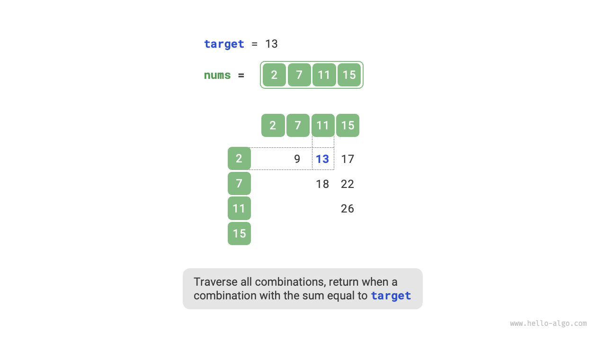
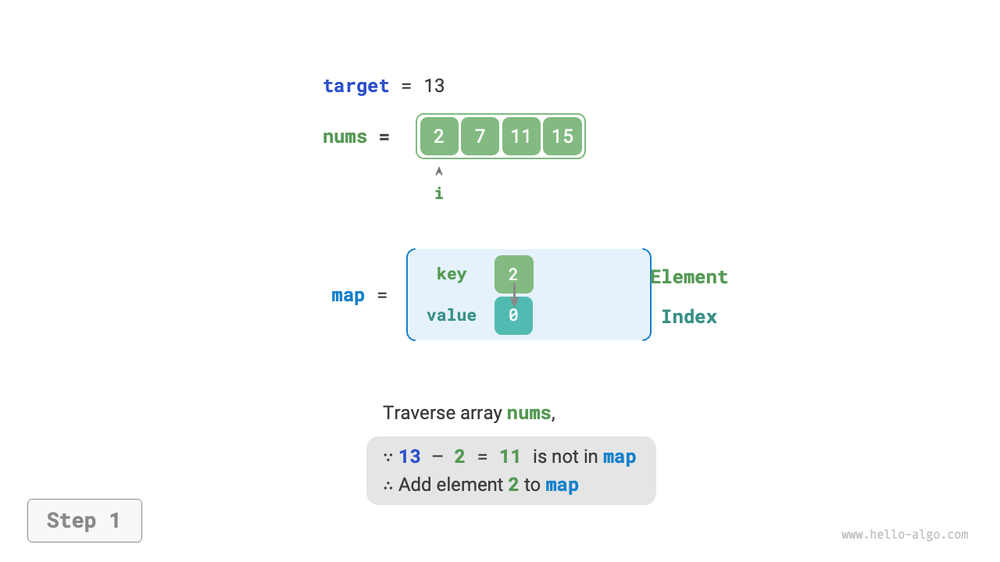
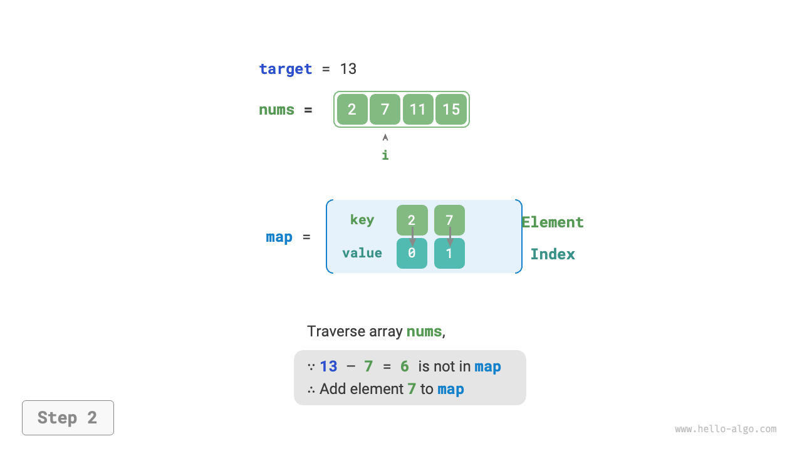
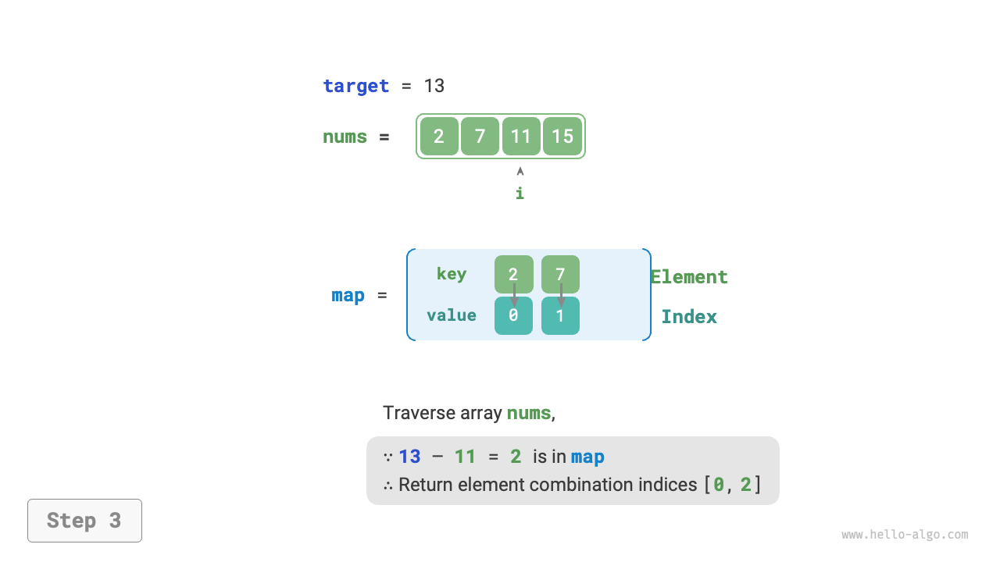

# 10.4 &nbsp; ハッシュによる最適化戦略

アルゴリズムの問題では，**線形探索をハッシュ探索に置き換えることでアルゴリズムの時間計算量を下げることがよくあります**。ここでは，あるアルゴリズム問題を通じて理解を深めましょう。

!!! question

    整数配列 `nums` と目標要素 `target` が与えられたとき，配列内から和が `target` となる 2 つの要素を探索し，それらの配列インデックスを返してください。任意の 1 つの解を返せば十分です。

## 10.4.1 &nbsp; 線形探索：時間と引き換えに空間を節約

考えられるすべての組み合わせを直接走査することを考えます。次の図に示すように，2 重ループを開始し，各ラウンドで 2 つの整数の和が `target` であるかを判定します。そうであれば，それらのインデックスを返します。

{ class="animation-figure" }

<p align="center"> 図 10-9 &nbsp; 線形探索で 2 数の和を求める </p>

コードは次のとおりです：

=== "Python"

    ```python title="two_sum.py"
    def two_sum_brute_force(nums: list[int], target: int) -> list[int]:
        """方法 1：総当たり列挙"""
        # 2重ループのため、時間計算量は O(n^2)
        for i in range(len(nums) - 1):
            for j in range(i + 1, len(nums)):
                if nums[i] + nums[j] == target:
                    return [i, j]
        return []
    ```

=== "C++"

    ```cpp title="two_sum.cpp"
    /* 方法 1：総当たり列挙 */
    vector<int> twoSumBruteForce(vector<int> &nums, int target) {
        int size = nums.size();
        // 2重ループのため、時間計算量は O(n^2)
        for (int i = 0; i < size - 1; i++) {
            for (int j = i + 1; j < size; j++) {
                if (nums[i] + nums[j] == target)
                    return {i, j};
            }
        }
        return {};
    }
    ```

=== "Java"

    ```java title="two_sum.java"
    /* 方法 1：総当たり列挙 */
    int[] twoSumBruteForce(int[] nums, int target) {
        int size = nums.length;
        // 2重ループのため、時間計算量は O(n^2)
        for (int i = 0; i < size - 1; i++) {
            for (int j = i + 1; j < size; j++) {
                if (nums[i] + nums[j] == target)
                    return new int[] { i, j };
            }
        }
        return new int[0];
    }
    ```

=== "C#"

    ```csharp title="two_sum.cs"
    /* 方法 1：総当たり列挙 */
    int[] TwoSumBruteForce(int[] nums, int target) {
        int size = nums.Length;
        // 2重ループのため、時間計算量は O(n^2)
        for (int i = 0; i < size - 1; i++) {
            for (int j = i + 1; j < size; j++) {
                if (nums[i] + nums[j] == target)
                    return [i, j];
            }
        }
        return [];
    }
    ```

=== "Go"

    ```go title="two_sum.go"
    /* 方法 1：総当たり列挙 */
    func twoSumBruteForce(nums []int, target int) []int {
        size := len(nums)
        // 2重ループのため、時間計算量は O(n^2)
        for i := 0; i < size-1; i++ {
            for j := i + 1; j < size; j++ {
                if nums[i]+nums[j] == target {
                    return []int{i, j}
                }
            }
        }
        return nil
    }
    ```

=== "Swift"

    ```swift title="two_sum.swift"
    /* 方法 1：総当たり列挙 */
    func twoSumBruteForce(nums: [Int], target: Int) -> [Int] {
        // 2重ループのため、時間計算量は O(n^2)
        for i in nums.indices.dropLast() {
            for j in nums.indices.dropFirst(i + 1) {
                if nums[i] + nums[j] == target {
                    return [i, j]
                }
            }
        }
        return [0]
    }
    ```

=== "JS"

    ```javascript title="two_sum.js"
    /* 方法 1：総当たり列挙 */
    function twoSumBruteForce(nums, target) {
        const n = nums.length;
        // 2重ループのため、時間計算量は O(n^2)
        for (let i = 0; i < n; i++) {
            for (let j = i + 1; j < n; j++) {
                if (nums[i] + nums[j] === target) {
                    return [i, j];
                }
            }
        }
        return [];
    }
    ```

=== "TS"

    ```typescript title="two_sum.ts"
    /* 方法 1：総当たり列挙 */
    function twoSumBruteForce(nums: number[], target: number): number[] {
        const n = nums.length;
        // 2重ループのため、時間計算量は O(n^2)
        for (let i = 0; i < n; i++) {
            for (let j = i + 1; j < n; j++) {
                if (nums[i] + nums[j] === target) {
                    return [i, j];
                }
            }
        }
        return [];
    }
    ```

=== "Dart"

    ```dart title="two_sum.dart"
    /* 方法1: 総当たり列挙 */
    List<int> twoSumBruteForce(List<int> nums, int target) {
      int size = nums.length;
      // 2重ループのため、時間計算量は O(n^2)
      for (var i = 0; i < size - 1; i++) {
        for (var j = i + 1; j < size; j++) {
          if (nums[i] + nums[j] == target) return [i, j];
        }
      }
      return [0];
    }
    ```

=== "Rust"

    ```rust title="two_sum.rs"
    /* 方法 1：総当たり列挙 */
    pub fn two_sum_brute_force(nums: &Vec<i32>, target: i32) -> Option<Vec<i32>> {
        let size = nums.len();
        // 2重ループのため、時間計算量は O(n^2)
        for i in 0..size - 1 {
            for j in i + 1..size {
                if nums[i] + nums[j] == target {
                    return Some(vec![i as i32, j as i32]);
                }
            }
        }
        None
    }
    ```

=== "C"

    ```c title="two_sum.c"
    /* 方法 1：総当たり列挙 */
    int *twoSumBruteForce(int *nums, int numsSize, int target, int *returnSize) {
        for (int i = 0; i < numsSize; ++i) {
            for (int j = i + 1; j < numsSize; ++j) {
                if (nums[i] + nums[j] == target) {
                    int *res = malloc(sizeof(int) * 2);
                    res[0] = i, res[1] = j;
                    *returnSize = 2;
                    return res;
                }
            }
        }
        *returnSize = 0;
        return NULL;
    }
    ```

=== "Kotlin"

    ```kotlin title="two_sum.kt"
    /* 方法 1：総当たり列挙 */
    fun twoSumBruteForce(nums: IntArray, target: Int): IntArray {
        val size = nums.size
        // 2重ループのため、時間計算量は O(n^2)
        for (i in 0..<size - 1) {
            for (j in i + 1..<size) {
                if (nums[i] + nums[j] == target) return intArrayOf(i, j)
            }
        }
        return IntArray(0)
    }
    ```

=== "Ruby"

    ```ruby title="two_sum.rb"
    ### 方法1：総当たり列挙 ###
    def two_sum_brute_force(nums, target)
      # 2重ループのため、時間計算量は O(n^2)
      for i in 0...(nums.length - 1)
        for j in (i + 1)...nums.length
          return [i, j] if nums[i] + nums[j] == target
        end
      end

      []
    end
    ```

??? pythontutor "コードの可視化"

    <div style="height: 423px; width: 100%;"><iframe class="pythontutor-iframe" src="https://pythontutor.com/iframe-embed.html#code=def%20two_sum_brute_force%28nums%3A%20list%5Bint%5D%2C%20target%3A%20int%29%20-%3E%20list%5Bint%5D%3A%0A%20%20%20%20%22%22%22%E6%96%B9%E6%B3%95%201%EF%BC%9A%E7%B7%8F%E5%BD%93%E3%81%9F%E3%82%8A%E5%88%97%E6%8C%99%22%22%22%0A%20%20%20%20%23%202%E9%87%8D%E3%83%AB%E3%83%BC%E3%83%97%E3%81%AE%E3%81%9F%E3%82%81%E3%80%81%E6%99%82%E9%96%93%E8%A8%88%E7%AE%97%E9%87%8F%E3%81%AF%20O%28n%5E2%29%0A%20%20%20%20for%20i%20in%20range%28len%28nums%29%20-%201%29%3A%0A%20%20%20%20%20%20%20%20for%20j%20in%20range%28i%20%2B%201%2C%20len%28nums%29%29%3A%0A%20%20%20%20%20%20%20%20%20%20%20%20if%20nums%5Bi%5D%20%2B%20nums%5Bj%5D%20%3D%3D%20target%3A%0A%20%20%20%20%20%20%20%20%20%20%20%20%20%20%20%20return%20%5Bi%2C%20j%5D%0A%20%20%20%20return%20%5B%5D%0A%0Aif%20__name__%20%3D%3D%20%22__main__%22%3A%0A%20%20%20%20nums%20%3D%20%5B2%2C%207%2C%2011%2C%2015%5D%0A%20%20%20%20target%20%3D%2013%0A%20%20%20%20res%20%3D%20two_sum_brute_force%28nums%2C%20target%29&codeDivHeight=472&codeDivWidth=350&cumulative=false&curInstr=5&heapPrimitives=nevernest&origin=opt-frontend.js&py=311&rawInputLstJSON=%5B%5D&textReferences=false"> </iframe></div>
    <div style="margin-top: 5px;"><a href="https://pythontutor.com/iframe-embed.html#code=def%20two_sum_brute_force%28nums%3A%20list%5Bint%5D%2C%20target%3A%20int%29%20-%3E%20list%5Bint%5D%3A%0A%20%20%20%20%22%22%22%E6%96%B9%E6%B3%95%201%EF%BC%9A%E7%B7%8F%E5%BD%93%E3%81%9F%E3%82%8A%E5%88%97%E6%8C%99%22%22%22%0A%20%20%20%20%23%202%E9%87%8D%E3%83%AB%E3%83%BC%E3%83%97%E3%81%AE%E3%81%9F%E3%82%81%E3%80%81%E6%99%82%E9%96%93%E8%A8%88%E7%AE%97%E9%87%8F%E3%81%AF%20O%28n%5E2%29%0A%20%20%20%20for%20i%20in%20range%28len%28nums%29%20-%201%29%3A%0A%20%20%20%20%20%20%20%20for%20j%20in%20range%28i%20%2B%201%2C%20len%28nums%29%29%3A%0A%20%20%20%20%20%20%20%20%20%20%20%20if%20nums%5Bi%5D%20%2B%20nums%5Bj%5D%20%3D%3D%20target%3A%0A%20%20%20%20%20%20%20%20%20%20%20%20%20%20%20%20return%20%5Bi%2C%20j%5D%0A%20%20%20%20return%20%5B%5D%0A%0Aif%20__name__%20%3D%3D%20%22__main__%22%3A%0A%20%20%20%20nums%20%3D%20%5B2%2C%207%2C%2011%2C%2015%5D%0A%20%20%20%20target%20%3D%2013%0A%20%20%20%20res%20%3D%20two_sum_brute_force%28nums%2C%20target%29&codeDivHeight=800&codeDivWidth=600&cumulative=false&curInstr=5&heapPrimitives=nevernest&origin=opt-frontend.js&py=311&rawInputLstJSON=%5B%5D&textReferences=false" target="_blank" rel="noopener noreferrer">全画面で見る ></a></div>

この方法の時間計算量は $O(n^2)$ ，空間計算量は $O(1)$ であり，大規模データでは非常に時間がかかります。

## 10.4.2 &nbsp; ハッシュ探索：空間と引き換えに時間を節約

ハッシュテーブルを利用し，キーと値をそれぞれ配列要素と要素のインデックスにします。配列をループで走査し，各ラウンドで次の図に示す手順を実行します。

1. 数値 `target - nums[i]` がハッシュテーブル内にあるかを判定します。あれば，この 2 つの要素のインデックスを直接返します。
2. キーと値の組 `nums[i]` とインデックス `i` をハッシュテーブルに追加します。

=== "<1>"
    { class="animation-figure" }

=== "<2>"
    { class="animation-figure" }

=== "<3>"
    { class="animation-figure" }

<p align="center"> 図 10-10 &nbsp; 補助ハッシュテーブルで 2 数の和を求める </p>

実装コードは次のとおりで，単一ループだけで済みます：

=== "Python"

    ```python title="two_sum.py"
    def two_sum_hash_table(nums: list[int], target: int) -> list[int]:
        """方法 2：補助ハッシュテーブル"""
        # 補助ハッシュテーブルを使用し、空間計算量は O(n)
        dic = {}
        # 単一ループで、時間計算量は O(n)
        for i in range(len(nums)):
            if target - nums[i] in dic:
                return [dic[target - nums[i]], i]
            dic[nums[i]] = i
        return []
    ```

=== "C++"

    ```cpp title="two_sum.cpp"
    /* 方法 2：補助ハッシュテーブル */
    vector<int> twoSumHashTable(vector<int> &nums, int target) {
        int size = nums.size();
        // 補助ハッシュテーブルを使用し、空間計算量は O(n)
        unordered_map<int, int> dic;
        // 単一ループで、時間計算量は O(n)
        for (int i = 0; i < size; i++) {
            if (dic.find(target - nums[i]) != dic.end()) {
                return {dic[target - nums[i]], i};
            }
            dic.emplace(nums[i], i);
        }
        return {};
    }
    ```

=== "Java"

    ```java title="two_sum.java"
    /* 方法 2：補助ハッシュテーブル */
    int[] twoSumHashTable(int[] nums, int target) {
        int size = nums.length;
        // 補助ハッシュテーブルを使用し、空間計算量は O(n)
        Map<Integer, Integer> dic = new HashMap<>();
        // 単一ループで、時間計算量は O(n)
        for (int i = 0; i < size; i++) {
            if (dic.containsKey(target - nums[i])) {
                return new int[] { dic.get(target - nums[i]), i };
            }
            dic.put(nums[i], i);
        }
        return new int[0];
    }
    ```

=== "C#"

    ```csharp title="two_sum.cs"
    /* 方法 2：補助ハッシュテーブル */
    int[] TwoSumHashTable(int[] nums, int target) {
        int size = nums.Length;
        // 補助ハッシュテーブルを使用し、空間計算量は O(n)
        Dictionary<int, int> dic = [];
        // 単一ループで、時間計算量は O(n)
        for (int i = 0; i < size; i++) {
            if (dic.ContainsKey(target - nums[i])) {
                return [dic[target - nums[i]], i];
            }
            dic.Add(nums[i], i);
        }
        return [];
    }
    ```

=== "Go"

    ```go title="two_sum.go"
    /* 方法 2：補助ハッシュテーブル */
    func twoSumHashTable(nums []int, target int) []int {
        // 補助ハッシュテーブルを使用し、空間計算量は O(n)
        hashTable := map[int]int{}
        // 単一ループで、時間計算量は O(n)
        for idx, val := range nums {
            if preIdx, ok := hashTable[target-val]; ok {
                return []int{preIdx, idx}
            }
            hashTable[val] = idx
        }
        return nil
    }
    ```

=== "Swift"

    ```swift title="two_sum.swift"
    /* 方法 2：補助ハッシュテーブル */
    func twoSumHashTable(nums: [Int], target: Int) -> [Int] {
        // 補助ハッシュテーブルを使用し、空間計算量は O(n)
        var dic: [Int: Int] = [:]
        // 単一ループで、時間計算量は O(n)
        for i in nums.indices {
            if let j = dic[target - nums[i]] {
                return [j, i]
            }
            dic[nums[i]] = i
        }
        return [0]
    }
    ```

=== "JS"

    ```javascript title="two_sum.js"
    /* 方法 2：補助ハッシュテーブル */
    function twoSumHashTable(nums, target) {
        // 補助ハッシュテーブルを使用し、空間計算量は O(n)
        let m = {};
        // 単一ループで、時間計算量は O(n)
        for (let i = 0; i < nums.length; i++) {
            if (m[target - nums[i]] !== undefined) {
                return [m[target - nums[i]], i];
            } else {
                m[nums[i]] = i;
            }
        }
        return [];
    }
    ```

=== "TS"

    ```typescript title="two_sum.ts"
    /* 方法 2：補助ハッシュテーブル */
    function twoSumHashTable(nums: number[], target: number): number[] {
        // 補助ハッシュテーブルを使用し、空間計算量は O(n)
        let m: Map<number, number> = new Map();
        // 単一ループで、時間計算量は O(n)
        for (let i = 0; i < nums.length; i++) {
            let index = m.get(target - nums[i]);
            if (index !== undefined) {
                return [index, i];
            } else {
                m.set(nums[i], i);
            }
        }
        return [];
    }
    ```

=== "Dart"

    ```dart title="two_sum.dart"
    /* 方法2: 補助ハッシュテーブル */
    List<int> twoSumHashTable(List<int> nums, int target) {
      int size = nums.length;
      // 補助ハッシュテーブルを使用し、空間計算量は O(n)
      Map<int, int> dic = HashMap();
      // 単一ループで、時間計算量は O(n)
      for (var i = 0; i < size; i++) {
        if (dic.containsKey(target - nums[i])) {
          return [dic[target - nums[i]]!, i];
        }
        dic.putIfAbsent(nums[i], () => i);
      }
      return [0];
    }
    ```

=== "Rust"

    ```rust title="two_sum.rs"
    /* 方法 2：補助ハッシュテーブル */
    pub fn two_sum_hash_table(nums: &Vec<i32>, target: i32) -> Option<Vec<i32>> {
        // 補助ハッシュテーブルを使用し、空間計算量は O(n)
        let mut dic = HashMap::new();
        // 単一ループで、時間計算量は O(n)
        for (i, num) in nums.iter().enumerate() {
            match dic.get(&(target - num)) {
                Some(v) => return Some(vec![*v as i32, i as i32]),
                None => dic.insert(num, i as i32),
            };
        }
        None
    }
    ```

=== "C"

    ```c title="two_sum.c"
    /* ハッシュテーブル */
    typedef struct {
        int key;
        int val;
        UT_hash_handle hh; // uthash.h を用いて実装
    } HashTable;

    /* ハッシュテーブルを検索する */
    HashTable *find(HashTable *h, int key) {
        HashTable *tmp;
        HASH_FIND_INT(h, &key, tmp);
        return tmp;
    }

    /* ハッシュテーブルに要素を挿入する */
    void insert(HashTable **h, int key, int val) {
        HashTable *t = find(*h, key);
        if (t == NULL) {
            HashTable *tmp = malloc(sizeof(HashTable));
            tmp->key = key, tmp->val = val;
            HASH_ADD_INT(*h, key, tmp);
        } else {
            t->val = val;
        }
    }

    /* 方法 2：補助ハッシュテーブル */
    int *twoSumHashTable(int *nums, int numsSize, int target, int *returnSize) {
        HashTable *hashtable = NULL;
        for (int i = 0; i < numsSize; i++) {
            HashTable *t = find(hashtable, target - nums[i]);
            if (t != NULL) {
                int *res = malloc(sizeof(int) * 2);
                res[0] = t->val, res[1] = i;
                *returnSize = 2;
                return res;
            }
            insert(&hashtable, nums[i], i);
        }
        *returnSize = 0;
        return NULL;
    }
    ```

=== "Kotlin"

    ```kotlin title="two_sum.kt"
    /* 方法 2：補助ハッシュテーブル */
    fun twoSumHashTable(nums: IntArray, target: Int): IntArray {
        val size = nums.size
        // 補助ハッシュテーブルを使用し、空間計算量は O(n)
        val dic = HashMap<Int, Int>()
        // 単一ループで、時間計算量は O(n)
        for (i in 0..<size) {
            if (dic.containsKey(target - nums[i])) {
                return intArrayOf(dic[target - nums[i]]!!, i)
            }
            dic[nums[i]] = i
        }
        return IntArray(0)
    }
    ```

=== "Ruby"

    ```ruby title="two_sum.rb"
    ### 方法2：補助ハッシュテーブル ###
    def two_sum_hash_table(nums, target)
      # 補助ハッシュテーブルを使用し、空間計算量は O(n)
      dic = {}
      # 単一ループで、時間計算量は O(n)
      for i in 0...nums.length
        return [dic[target - nums[i]], i] if dic.has_key?(target - nums[i])

        dic[nums[i]] = i
      end

      []
    end
    ```

??? pythontutor "コードの可視化"

    <div style="height: 459px; width: 100%;"><iframe class="pythontutor-iframe" src="https://pythontutor.com/iframe-embed.html#code=def%20two_sum_hash_table%28nums%3A%20list%5Bint%5D%2C%20target%3A%20int%29%20-%3E%20list%5Bint%5D%3A%0A%20%20%20%20%22%22%22%E6%96%B9%E6%B3%95%202%EF%BC%9A%E8%A3%9C%E5%8A%A9%E3%83%8F%E3%83%83%E3%82%B7%E3%83%A5%E3%83%86%E3%83%BC%E3%83%96%E3%83%AB%22%22%22%0A%20%20%20%20%23%20%E8%A3%9C%E5%8A%A9%E3%83%8F%E3%83%83%E3%82%B7%E3%83%A5%E3%83%86%E3%83%BC%E3%83%96%E3%83%AB%E3%82%92%E4%BD%BF%E7%94%A8%E3%81%97%E3%80%81%E7%A9%BA%E9%96%93%E8%A8%88%E7%AE%97%E9%87%8F%E3%81%AF%20O%28n%29%0A%20%20%20%20dic%20%3D%20%7B%7D%0A%20%20%20%20%23%20%E5%8D%98%E4%B8%80%E3%83%AB%E3%83%BC%E3%83%97%E3%81%A7%E3%80%81%E6%99%82%E9%96%93%E8%A8%88%E7%AE%97%E9%87%8F%E3%81%AF%20O%28n%29%0A%20%20%20%20for%20i%20in%20range%28len%28nums%29%29%3A%0A%20%20%20%20%20%20%20%20if%20target%20-%20nums%5Bi%5D%20in%20dic%3A%0A%20%20%20%20%20%20%20%20%20%20%20%20return%20%5Bdic%5Btarget%20-%20nums%5Bi%5D%5D%2C%20i%5D%0A%20%20%20%20%20%20%20%20dic%5Bnums%5Bi%5D%5D%20%3D%20i%0A%20%20%20%20return%20%5B%5D%0A%0Aif%20__name__%20%3D%3D%20%22__main__%22%3A%0A%20%20%20%20nums%20%3D%20%5B2%2C%207%2C%2011%2C%2015%5D%0A%20%20%20%20target%20%3D%2013%0A%20%20%20%20res%20%3D%20two_sum_hash_table%28nums%2C%20target%29&codeDivHeight=472&codeDivWidth=350&cumulative=false&curInstr=5&heapPrimitives=nevernest&origin=opt-frontend.js&py=311&rawInputLstJSON=%5B%5D&textReferences=false"> </iframe></div>
    <div style="margin-top: 5px;"><a href="https://pythontutor.com/iframe-embed.html#code=def%20two_sum_hash_table%28nums%3A%20list%5Bint%5D%2C%20target%3A%20int%29%20-%3E%20list%5Bint%5D%3A%0A%20%20%20%20%22%22%22%E6%96%B9%E6%B3%95%202%EF%BC%9A%E8%A3%9C%E5%8A%A9%E3%83%8F%E3%83%83%E3%82%B7%E3%83%A5%E3%83%86%E3%83%BC%E3%83%96%E3%83%AB%22%22%22%0A%20%20%20%20%23%20%E8%A3%9C%E5%8A%A9%E3%83%8F%E3%83%83%E3%82%B7%E3%83%A5%E3%83%86%E3%83%BC%E3%83%96%E3%83%AB%E3%82%92%E4%BD%BF%E7%94%A8%E3%81%97%E3%80%81%E7%A9%BA%E9%96%93%E8%A8%88%E7%AE%97%E9%87%8F%E3%81%AF%20O%28n%29%0A%20%20%20%20dic%20%3D%20%7B%7D%0A%20%20%20%20%23%20%E5%8D%98%E4%B8%80%E3%83%AB%E3%83%BC%E3%83%97%E3%81%A7%E3%80%81%E6%99%82%E9%96%93%E8%A8%88%E7%AE%97%E9%87%8F%E3%81%AF%20O%28n%29%0A%20%20%20%20for%20i%20in%20range%28len%28nums%29%29%3A%0A%20%20%20%20%20%20%20%20if%20target%20-%20nums%5Bi%5D%20in%20dic%3A%0A%20%20%20%20%20%20%20%20%20%20%20%20return%20%5Bdic%5Btarget%20-%20nums%5Bi%5D%5D%2C%20i%5D%0A%20%20%20%20%20%20%20%20dic%5Bnums%5Bi%5D%5D%20%3D%20i%0A%20%20%20%20return%20%5B%5D%0A%0Aif%20__name__%20%3D%3D%20%22__main__%22%3A%0A%20%20%20%20nums%20%3D%20%5B2%2C%207%2C%2011%2C%2015%5D%0A%20%20%20%20target%20%3D%2013%0A%20%20%20%20res%20%3D%20two_sum_hash_table%28nums%2C%20target%29&codeDivHeight=800&codeDivWidth=600&cumulative=false&curInstr=5&heapPrimitives=nevernest&origin=opt-frontend.js&py=311&rawInputLstJSON=%5B%5D&textReferences=false" target="_blank" rel="noopener noreferrer">全画面で見る ></a></div>

この方法ではハッシュ探索によって時間計算量を $O(n^2)$ から $O(n)$ に下げ，実行効率を大幅に向上させます。

追加のハッシュテーブルを維持する必要があるため，空間計算量は $O(n)$ です。**それでも，この方法は全体として時間と空間の効率のバランスがより良く，本問の最適解です**。
