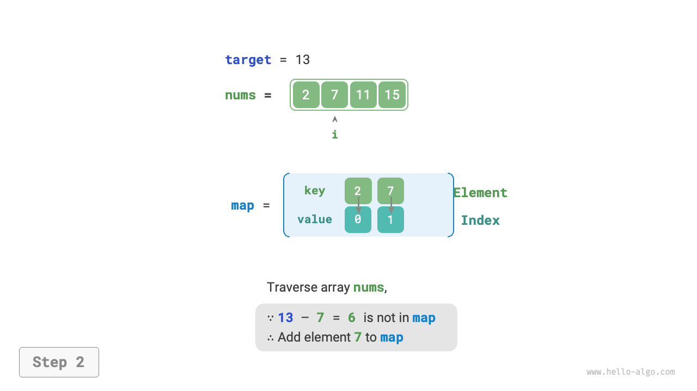

# ハッシュ最適化戦略

アルゴリズム問題において、**線形探索をハッシュベースの探索に置き換えることで、アルゴリズムの時間計算量を削減することがよくあります**。アルゴリズム問題を使用して理解を深めましょう。

!!! question

    整数配列`nums`と目標要素`target`が与えられ、配列内で「和」が`target`に等しい2つの要素を探索し、それらの配列インデックスを返してください。任意の解が受け入れられます。

## 線形探索：時間を空間と交換

すべての可能な組み合わせを直接横断することを考えてみます。下図に示すように、ネストしたループを開始し、各反復で2つの整数の和が`target`に等しいかどうかを判断します。そうであれば、それらのインデックスを返します。


コードは以下の通りです：

```src
[file]{two_sum}-[class]{}-[func]{two_sum_brute_force}
```

この方法の時間計算量は$O(n^2)$、空間計算量は$O(1)$で、大容量データでは非常に時間がかかる可能性があります。

## ハッシュ探索：空間を時間と交換

ハッシュテーブルの使用を考えてみましょう。キーと値のペアはそれぞれ配列要素とそのインデックスです。配列をループし、各反復中に下図に示すステップを実行します。

1. 数値`target - nums[i]`がハッシュテーブルにあるかどうかを確認します。ある場合は、これら2つの要素のインデックスを直接返します。
2. キーと値のペア`nums[i]`とインデックス`i`をハッシュテーブルに追加します。

=== "<1>"
    

=== "<2>"
    

=== "<3>"
    

実装コードは以下に示され、単一のループのみが必要です：

```src
[file]{two_sum}-[class]{}-[func]{two_sum_hash_table}
```

この方法は、ハッシュ探索を使用することで時間計算量を$O(n^2)$から$O(n)$に削減し、実行時効率を大幅に向上させます。

追加のハッシュテーブルを維持する必要があるため、空間計算量は$O(n)$です。**それにもかかわらず、この方法は全体的により均衡のとれた時空間効率を持ち、この問題の最適解となります**。
