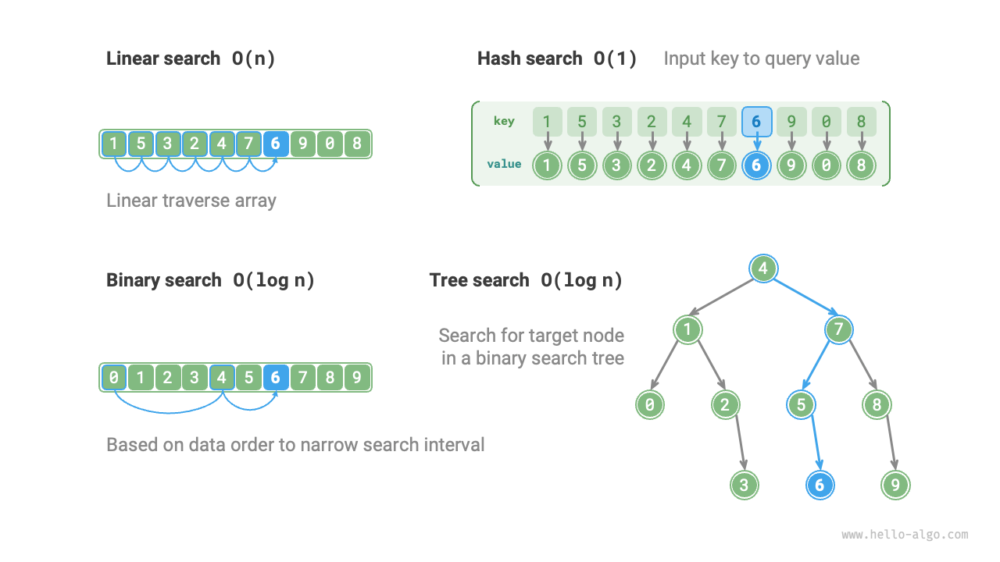

# 探索アルゴリズムの再検討

<u>探索アルゴリズム（検索アルゴリズム）</u>は、配列、連結リスト、木、グラフなどのデータ構造内で特定の基準を満たす1つ以上の要素を取得するために使用されます。

探索アルゴリズムは、そのアプローチに基づいて以下の2つのカテゴリに分けることができます。

- **データ構造を横断することで目標要素を特定する**：配列、連結リスト、木、グラフの横断など。
- **データの組織構造や既存のデータを使用して効率的な要素探索を実現する**：二分探索、ハッシュ探索、二分探索木探索など。

これらのトピックは前の章で紹介されたため、私たちには馴染みのないものではありません。このセクションでは、より体系的な観点から探索アルゴリズムを再検討します。

## 総当たり探索

総当たり探索は、データ構造のすべての要素を横断することで目標要素を特定します。

- 「線形探索」は配列や連結リストなどの線形データ構造に適しています。データ構造の一端から開始し、目標要素が見つかるか、目標要素を見つけることなく他端に到達するまで、各要素に一つずつアクセスします。
- 「幅優先探索」と「深さ優先探索」は、グラフと木の2つの横断戦略です。幅優先探索は初期ノードから開始し、層ごと（左から右へ）に探索し、近くから遠くのノードにアクセスします。深さ優先探索は初期ノードから開始し、パスの終端（上から下へ）まで追跡し、その後バックトラックして他のパスを試し、データ構造全体が横断されるまで続行します。

総当たり探索の利点は、その単純さと汎用性であり、**データの前処理や追加のデータ構造の助けが不要**です。

ただし、**このタイプのアルゴリズムの時間計算量は$O(n)$**で、$n$は要素数であるため、大規模なデータセットでは性能が悪くなります。

## 適応的探索

適応的探索は、データの固有の性質（順序など）を使用して探索プロセスを最適化し、それにより目標要素をより効率的に特定します。

- 「二分探索」はデータの整列性を使用して効率的な探索を実現し、配列にのみ適用可能です。
- 「ハッシュ探索」はハッシュテーブルを使用して探索データと目標データの間にキーと値のマッピングを確立し、それによりクエリ操作を実装します。
- 特定の木構造（二分探索木など）での「木探索」は、ノード値の比較に基づいてノードを迅速に除外し、それにより目標要素を特定します。

これらのアルゴリズムの利点は高効率であり、**時間計算量が$O(\log n)$または$O(1)$にまで達します**。

ただし、**これらのアルゴリズムを使用するには、多くの場合データの前処理が必要です**。例えば、二分探索では事前に配列をソートする必要があり、ハッシュ探索と木探索の両方で追加のデータ構造の助けが必要です。これらの構造を維持することも、時間と空間の面でより多くのオーバーヘッドが必要です。

!!! tip

    適応的探索アルゴリズムは、多くの場合探索アルゴリズムと呼ばれ、**主に特定のデータ構造内で目標要素を迅速に取得するために使用されます**。

## 探索方法の選択

サイズ$n$のデータセットが与えられた場合、線形探索、二分探索、木探索、ハッシュ探索、またはその他の方法を使用して目標要素を取得できます。これらの方法の動作原理を下図に示します。

前述の方法の特性と操作効率を以下の表に示します。

 表 <id> &nbsp; 探索アルゴリズム効率の比較 

|                    | 線形探索      | 二分探索              | 木探索                      | ハッシュ探索               |
| ------------------ | ------------- | --------------------- | --------------------------- | -------------------------- |
| 要素探索           | $O(n)$        | $O(\log n)$           | $O(\log n)$                 | $O(1)$                     |
| 要素挿入           | $O(1)$        | $O(n)$                | $O(\log n)$                 | $O(1)$                     |
| 要素削除           | $O(n)$        | $O(n)$                | $O(\log n)$                 | $O(1)$                     |
| 追加空間           | $O(1)$        | $O(1)$                | $O(n)$                      | $O(n)$                     |
| データ前処理       | /             | ソート $O(n \log n)$  | 木構築 $O(n \log n)$        | ハッシュテーブル構築 $O(n)$ |
| データ順序性       | 無順序        | 順序                  | 順序                        | 無順序                     |

探索アルゴリズムの選択は、データ量、探索性能要件、データクエリと更新の頻度などにも依存します。

**線形探索**

- 汎用性が良く、データ前処理操作が不要です。データを一度だけクエリする必要がある場合、他の3つの方法のデータ前処理時間は線形探索の時間よりも長くなります。
- 小容量のデータに適しており、時間計算量が効率に与える影響は小さいです。
- データ更新が非常に頻繁なシナリオに適しています。この方法はデータの追加メンテナンスを必要としないためです。

**二分探索**

- より大きなデータ量に適しており、安定した性能と最悪ケースの時間計算量$O(\log n)$を持ちます。
- ただし、データ量が大きすぎることはできません。配列の保存には連続したメモリ空間が必要だからです。
- 頻繁な追加と削除があるシナリオには適していません。順序付き配列の維持に多くのオーバーヘッドが発生するためです。

**ハッシュ探索**

- 高速クエリ性能が不可欠なシナリオに適しており、平均時間計算量は$O(1)$です。
- 順序付きデータや範囲探索が必要なシナリオには適していません。ハッシュテーブルはデータの順序性を維持できないためです。
- ハッシュ関数とハッシュ衝突処理戦略への依存度が高く、性能劣化のリスクが大きいです。
- 過度に大容量のデータには適していません。ハッシュテーブルは衝突を最小化し、良好なクエリ性能を提供するために追加の空間が必要だからです。

**木探索**

- 大容量データに適しています。木ノードはメモリ内に分散して保存されるためです。
- 順序付きデータの維持や範囲探索に適しています。
- ノードの継続的な追加と削除により、二分探索木は偏る可能性があり、時間計算量が$O(n)$に劣化する可能性があります。
- AVL木や赤黒木を使用する場合、操作は$O(\log n)$効率で安定して実行できますが、木のバランスを維持する操作により追加のオーバーヘッドが追加されます。
