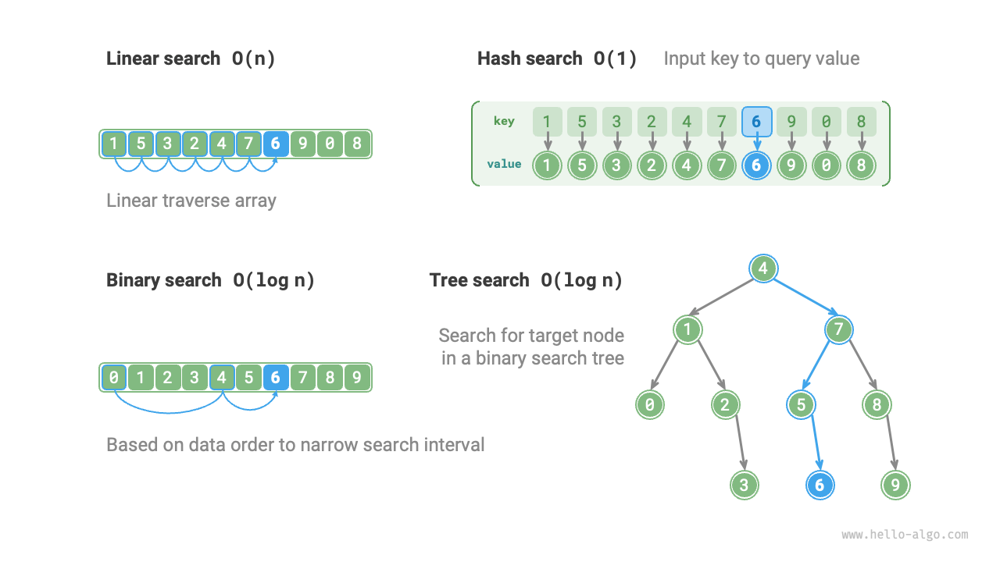

# 10.5 &nbsp; 探索アルゴリズム再考

<u>探索アルゴリズム（searching algorithm）</u>は、データ構造（配列、連結リスト、木、グラフなど）の中から、特定の条件を満たす 1 つまたは複数の要素を探索するために用いられます。

探索アルゴリズムは、実装の考え方に応じて次の 2 種類に分けられます。

- **データ構造を走査して目標要素を特定する方法**。配列、連結リスト、木、グラフの走査などがこれに当たります。
- **データの構成やデータに含まれる事前情報を利用して、要素を効率よく探す方法**。二分探索、ハッシュ探索、二分探索木による探索などがこれに当たります。

これらのトピックはすでに前の章で扱っているため、探索アルゴリズムは私たちにとって見慣れたものです。本節では、より体系的な視点から探索アルゴリズムをあらためて見直します。

## 10.5.1 &nbsp; 総当たり探索

総当たり探索は、データ構造の各要素を順に調べて目標要素を特定します。

- “線形探索”は配列や連結リストなどの線形データ構造に適しています。データ構造の一端から始めて、要素を 1 つずつ調べ、目標要素が見つかるか、もう一方の端に達しても見つからないまで続けます。
- “幅優先探索”と“深さ優先探索”は、グラフと木における 2 つの走査戦略です。幅優先探索は初期ノードから始めて層ごとに探索し、近いところから遠いところへ各ノードを訪れます。深さ優先探索は初期ノードから始めて 1 本の経路を最後までたどり、その後でバックトラックしてほかの経路を試し、データ構造全体を走査し終えるまで続けます。

総当たり探索の利点は、単純で汎用性が高く、**データの前処理や追加のデータ構造を必要としない**ことです。

しかし、**この種のアルゴリズムの時間計算量は $O(n)$ です**。ここで $n$ は要素数であり、そのためデータ量が大きい場合は性能が低くなります。

## 10.5.2 &nbsp; 適応的な探索

適応的な探索は、データが持つ固有の性質（整列性など）を利用して探索過程を最適化し、目標要素をより効率よく特定します。

- “二分探索”は、データの順序性を利用して効率的な探索を行う方法で、配列にしか適用できません。
- “ハッシュ探索”は、ハッシュ表を用いて探索対象のデータと目標データをキーと値の対応にし、問い合わせ操作を実現します。
- “木探索”は、特定の木構造（たとえば二分探索木）の中で、ノード値の比較に基づいて不要なノードをすばやく除外し、目標要素を特定します。

この種のアルゴリズムの利点は効率が高く、**時間計算量が $O(\log n)$ あるいは $O(1)$ に達する**ことです。

しかし、**これらのアルゴリズムを使うには、たいていデータの前処理が必要です**。たとえば、二分探索では事前に配列をソートする必要があり、ハッシュ探索と木探索では追加のデータ構造が必要です。これらのデータ構造を維持するにも、追加の時間と空間のコストがかかります。

!!! tip

    適応的な探索アルゴリズムは、しばしば検索アルゴリズムとも呼ばれ、**主に特定のデータ構造の中で目標要素を高速に取得するために用いられます**。

## 10.5.3 &nbsp; 探索手法の選択

大きさ $n$ のデータ集合が与えられたとき、線形探索、二分探索、木探索、ハッシュ探索など、さまざまな方法で目標要素を探索できます。各手法の動作原理を下図に示します。

{ class="animation-figure" }

 図 10-11 &nbsp; 複数の探索戦略 

上記のいくつかの手法について、操作効率と特性を次の表に示します。

 表 10-1 &nbsp; 探索アルゴリズムの効率比較 

|              | 線形探索 | 二分探索           | 木探索             | ハッシュ探索    |
| ------------ | -------- | ------------------ | ------------------ | --------------- |
| 要素探索     | $O(n)$   | $O(\log n)$        | $O(\log n)$        | $O(1)$          |
| 要素挿入     | $O(1)$   | $O(n)$             | $O(\log n)$        | $O(1)$          |
| 要素削除     | $O(n)$   | $O(n)$             | $O(\log n)$        | $O(1)$          |
| 追加領域     | $O(1)$   | $O(1)$             | $O(n)$             | $O(n)$          |
| データ前処理 | /        | ソート $O(n \log n)$ | 木構築 $O(n \log n)$ | ハッシュ表構築 $O(n)$ |
| データの順序性 | なし   | あり               | あり               | なし            |

探索アルゴリズムの選択は、規模、探索性能の要求、データの問い合わせ頻度や更新頻度などにも左右されます。

**線形探索**

- 汎用性が高く、データの前処理をまったく必要としません。データを 1 回だけ問い合わせればよい場合、ほか 3 つの手法では前処理にかかる時間のほうが、線形探索そのものより長くなることがあります。
- 規模の小さいデータに適しています。この場合、時間計算量が効率に与える影響は比較的小さいです。
- データ更新頻度が高い場面に適しています。この手法では、データに対する追加の保守が不要だからです。

**二分探索**

- 大規模データに適しており、効率が安定しています。最悪時間計算量は $O(\log n)$ です。
- データ量が大きすぎる場合には向きません。配列の格納には連続したメモリ領域が必要だからです。
- 頻繁な挿入・削除がある場面には向きません。整列配列を維持するコストが高いためです。

**ハッシュ探索**

- 問い合わせ性能への要求が高い場面に適しており、平均時間計算量は $O(1)$ です。
- 順序付きデータや範囲探索が必要な場面には向きません。ハッシュ表ではデータの順序性を維持できないからです。
- ハッシュ関数とハッシュ衝突処理戦略への依存度が高く、性能劣化のリスクが大きいです。
- データ量が大きすぎる場合には向きません。ハッシュ表は衝突をできるだけ減らして良好な問い合わせ性能を出すために、追加の空間を必要とするからです。

**木探索**

- 巨大データに適しています。木ノードはメモリ上に分散して格納されるためです。
- 順序付きデータの維持や範囲探索が必要な場面に適しています。
- ノードの挿入・削除を続ける過程で、二分探索木は偏ることがあり、時間計算量は $O(n)$ まで劣化する可能性があります。
- AVL 木や赤黒木を使えば、各種操作を $O(\log n)$ の効率で安定して実行できますが、木の平衡を保つ処理による追加コストが発生します。
