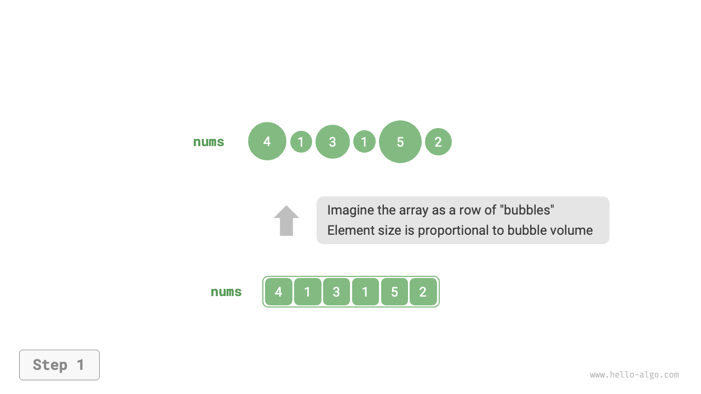
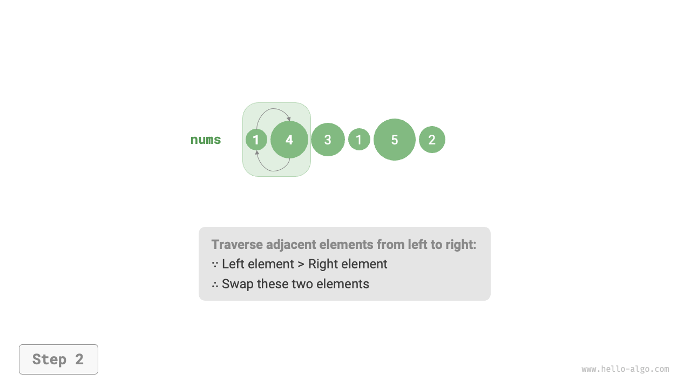
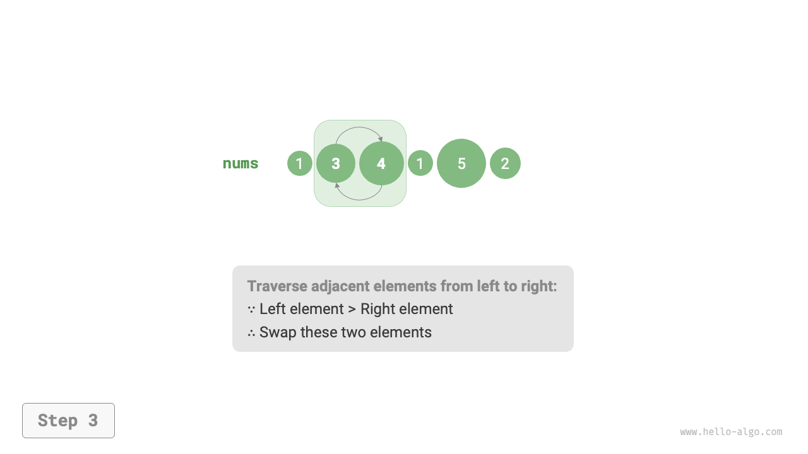
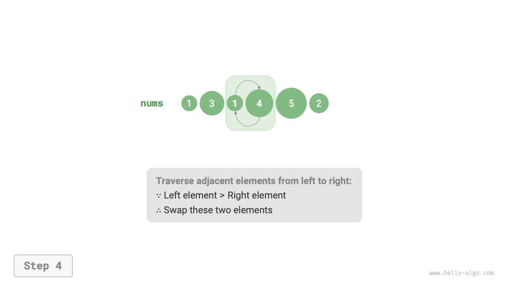
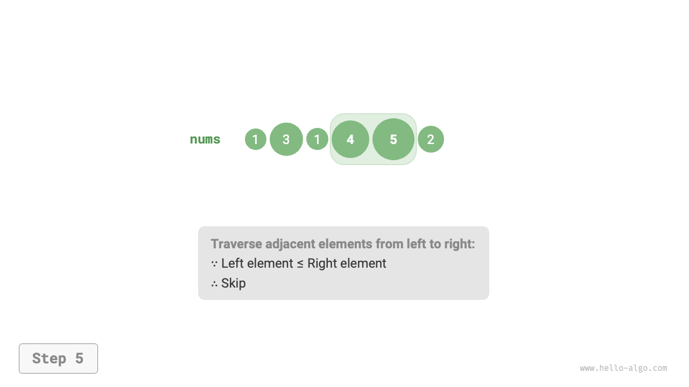
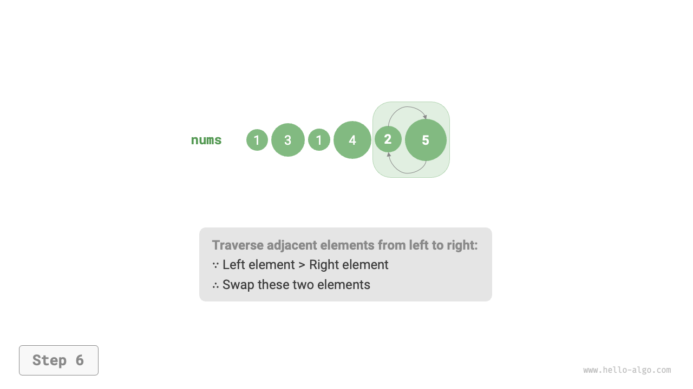
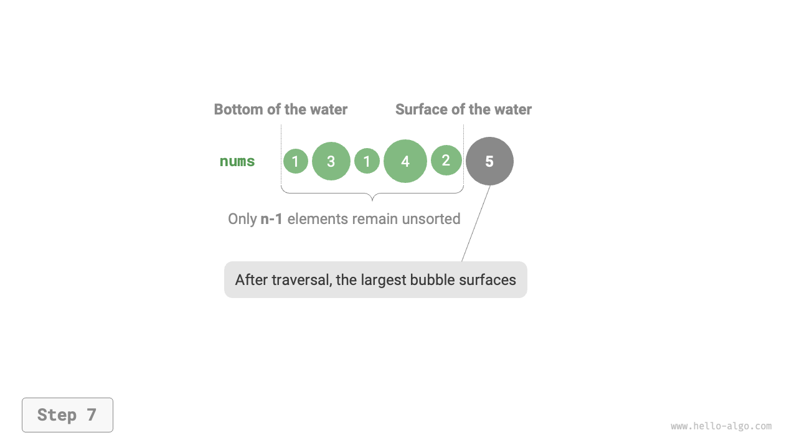

# バブルソート

<u>バブルソート</u>は、隣接する要素を継続的に比較し交換することで動作します。このプロセスは泡が底から上に上昇するようなものなので、「バブルソート」と名付けられました。

下図に示すように、バブリングプロセスは要素交換を使用してシミュレートできます：配列の左端から開始して右に移動し、隣接する要素の各ペアを比較します。左の要素が右の要素より大きい場合は、それらを交換します。横断後、最大要素は配列の右端にバブルアップします。

=== "<1>"
    

=== "<2>"
    

=== "<3>"
    

=== "<4>"
    

=== "<5>"
    

=== "<6>"
    

=== "<7>"
    

## アルゴリズムプロセス

配列の長さを$n$とします。バブルソートのステップは下図に示されます：

1. まず、$n$個の要素に対して1回の「バブル」パスを実行し、**最大要素を正しい位置に交換します**。
2. 次に、残りの$n - 1$個の要素に対して「バブル」パスを実行し、**2番目に大きい要素を正しい位置に交換します**。
3. この方法で続行します；$n - 1$回のパスの後、**最大$n - 1$個の要素が正しい位置に移動されます**。
4. 残りの唯一の要素は**必ず**最小であるため、**さらなる**ソートは必要ありません。この時点で、配列はソートされます。


コード例は以下の通りです：

```src
[file]{bubble_sort}-[class]{}-[func]{bubble_sort}
```

## 効率の最適化

「バブリング」のラウンド中に交換が発生しない場合、配列はすでにソートされているため、すぐに戻ることができます。これを検出するために、`flag`変数を追加できます；パスで交換が行われない場合は、フラグを設定して早期に戻ります。

この最適化があっても、バブルソートの最悪時間計算量と平均時間計算量は$O(n^2)$のままです。ただし、入力配列がすでにソートされている場合、最良ケース時間計算量は$O(n)$まで低くなる可能性があります。

```src
[file]{bubble_sort}-[class]{}-[func]{bubble_sort_with_flag}
```

## アルゴリズムの特性

- **$O(n^2)$の時間計算量、適応ソート。** 各「バブリング」ラウンドは長さ$n - 1$、$n - 2$、$\dots$、$2$、$1$の配列セグメントを横断し、合計は$(n - 1) n / 2$となります。`flag`最適化により、配列がすでにソートされている場合、最良ケース時間計算量は$O(n)$に達する可能性があります。
- **$O(1)$の空間計算量、インプレースソート。** ポインタ$i$と$j$によって定数量の追加空間のみが使用されます。
- **安定ソート。** 等しい要素は「バブリング」中に交換されないため、元の順序が保持され、これは安定ソートになります。
