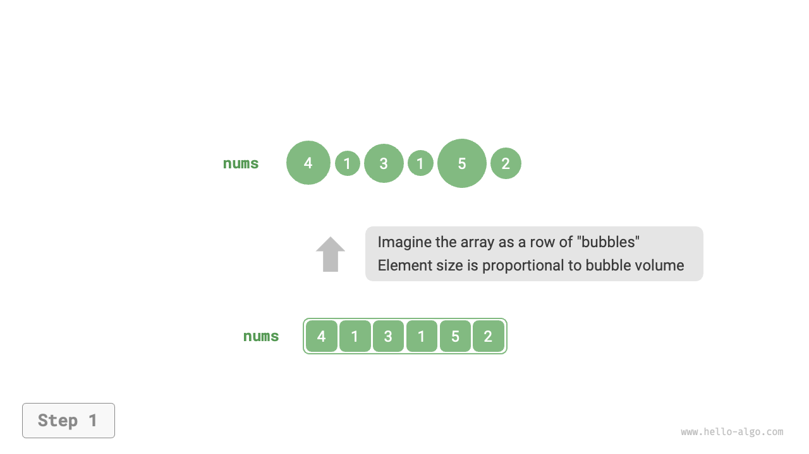
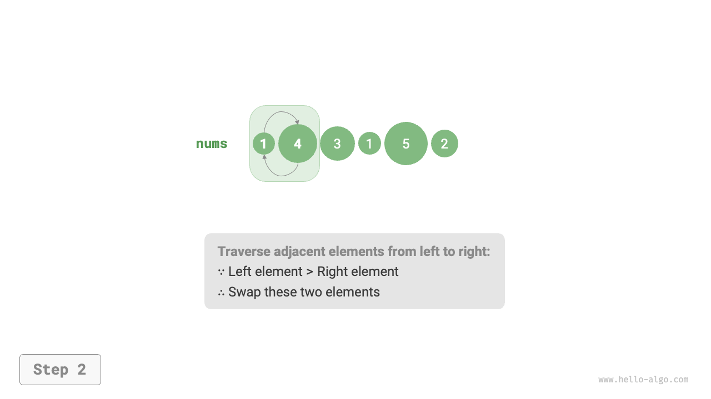
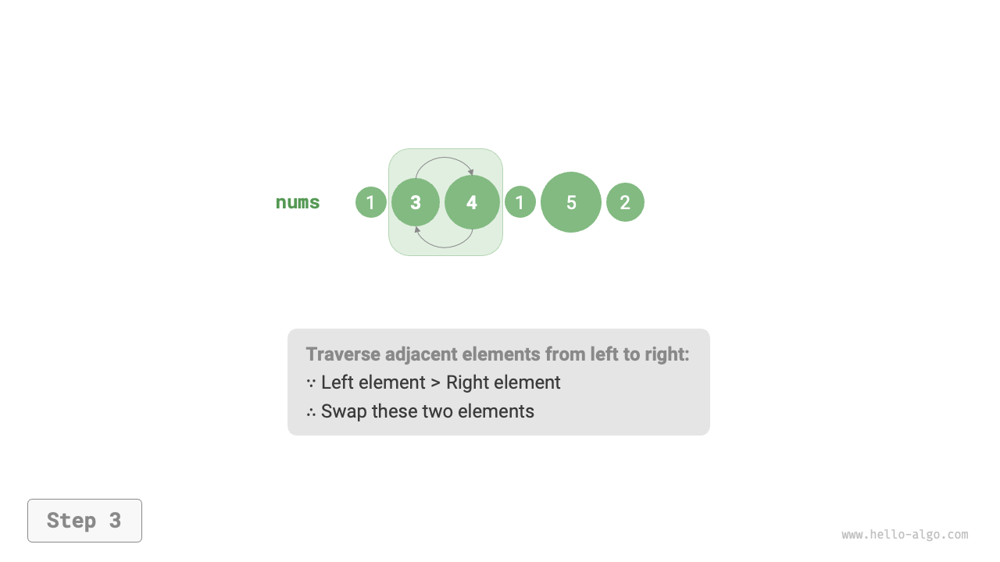
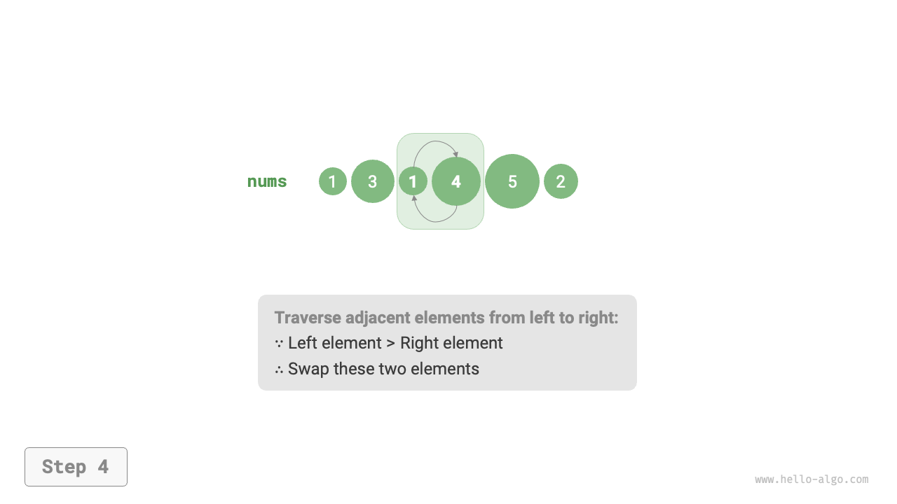
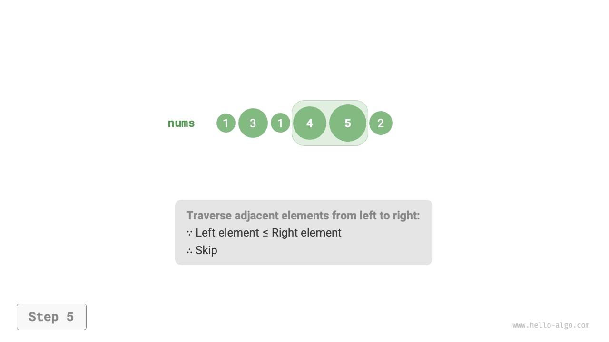
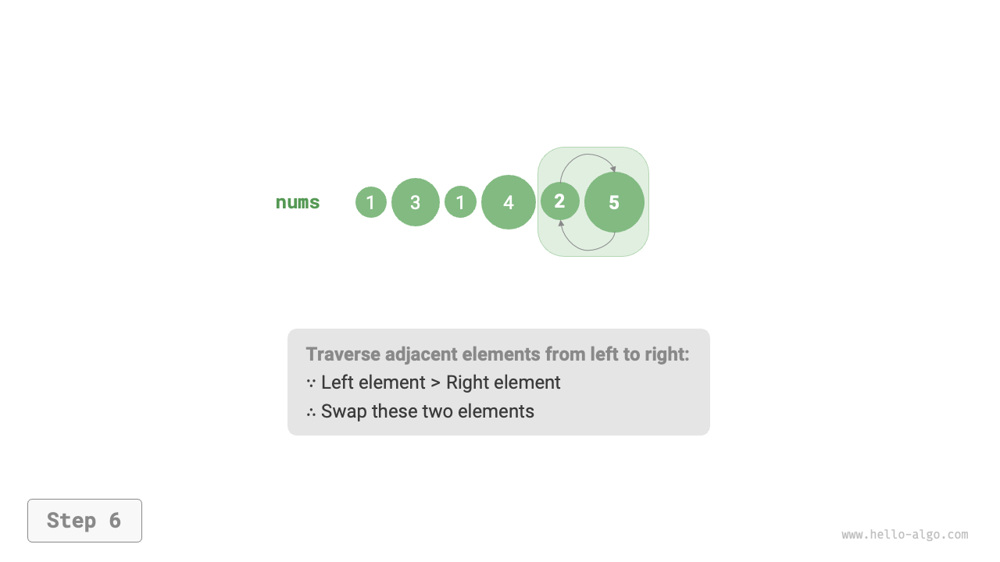
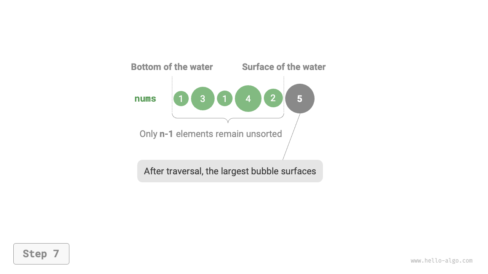
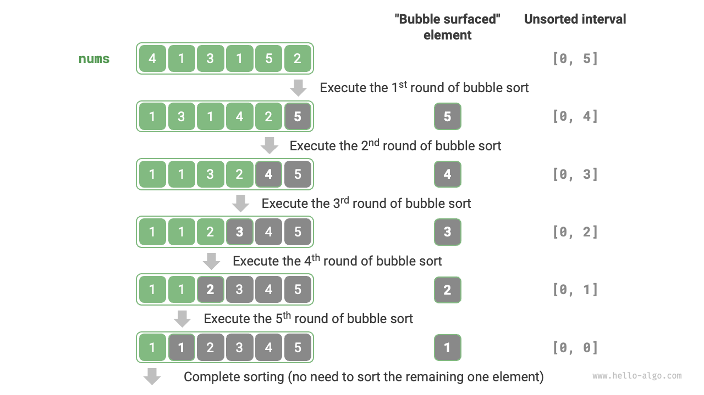

# バブルソート

<u>バブルソート（bubble sort）</u>は、隣接する要素を繰り返し比較して交換することで整列を行います。この過程が泡のように下から上へ浮かび上がることから、バブルソートと呼ばれます。

次の図に示すように、バブル処理は要素の交換操作によってシミュレートできます。配列の最も左の端から右へ走査し、隣接する要素の大小を順に比較して、「左要素 > 右要素」であれば両者を交換します。走査が終わると、最大の要素は配列の最も右端へ移動します。

=== "<1>"
    

=== "<2>"
    

=== "<3>"
    

=== "<4>"
    

=== "<5>"
    

=== "<6>"
    

=== "<7>"
    

## アルゴリズムの流れ

配列の長さを $n$ とすると、バブルソートの手順は次の図のとおりです。

1. まず、$n$ 個の要素に対して「バブル処理」を行い、**配列中の最大要素を正しい位置へ交換します**。
2. 次に、残りの $n - 1$ 個の要素に対して「バブル処理」を行い、**2 番目に大きい要素を正しい位置へ交換します**。
3. このようにして、$n - 1$ 回の「バブル処理」を終えると、**大きいほうから $n - 1$ 個の要素がすべて正しい位置へ交換されます**。
4. 残った 1 つの要素は必ず最小要素なので、並べ替える必要はなく、これで配列のソートが完了します。



コード例は次のとおりです。

```src
[file]{bubble_sort}-[class]{}-[func]{bubble_sort}
```

## 効率の最適化

ある回の「バブル処理」で交換操作が一度も行われなければ、配列はすでにソート済みであり、結果をそのまま返せることがわかります。したがって、この状況を検出するためのフラグ `flag` を追加し、発生した時点で直ちに返すようにできます。

最適化後も、バブルソートの最悪時間計算量と平均時間計算量は依然として $O(n^2)$ です。ただし、入力配列が完全に整列済みであれば、最良時間計算量は $O(n)$ に達します。

```src
[file]{bubble_sort}-[class]{}-[func]{bubble_sort_with_flag}
```

## アルゴリズムの特徴

- **時間計算量は $O(n^2)$、適応的ソート**：各回の「バブル処理」で走査する配列の長さは順に $n - 1$、$n - 2$、$\dots$、$2$、$1$ であり、その総和は $(n - 1) n / 2$ です。`flag` による最適化を導入すると、最良時間計算量は $O(n)$ に達します。
- **空間計算量は $O(1)$、インプレースソート**：ポインタ $i$ と $j$ は定数サイズの追加領域しか使用しません。
- **安定ソート**：「バブル処理」では等しい要素に出会っても交換しないためです。
