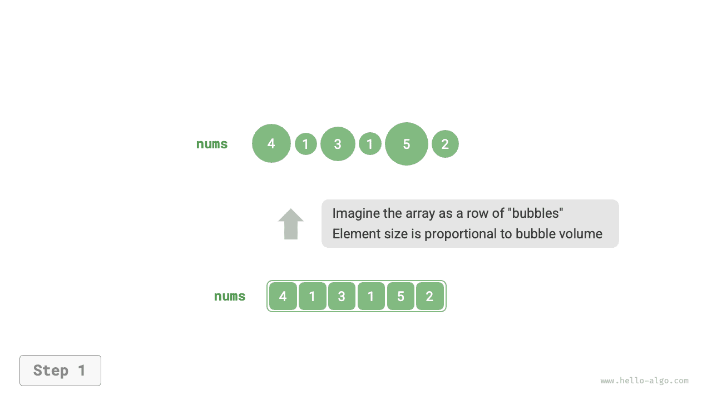
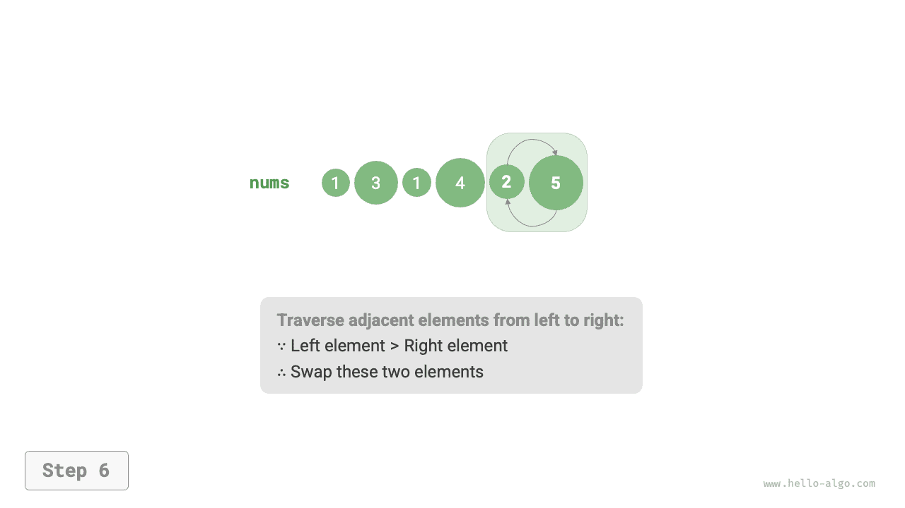
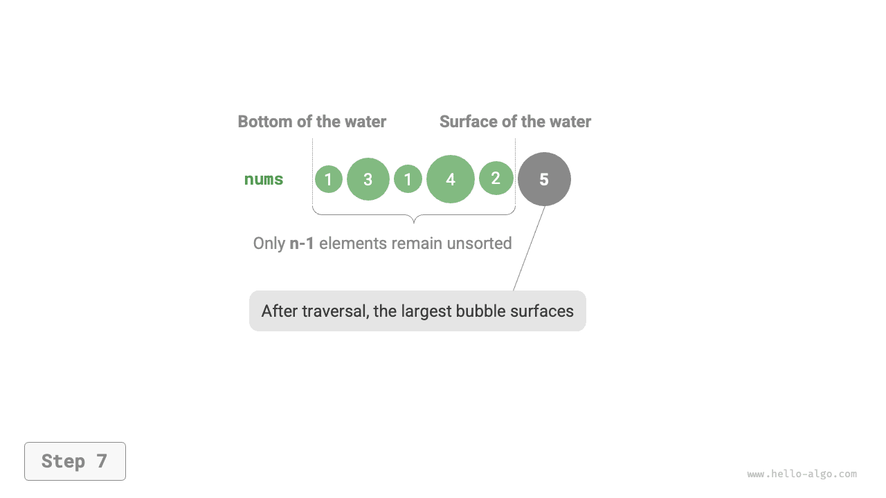

# 11.3 &nbsp; バブルソート

<u>バブルソート（bubble sort）</u>は、隣り合う要素の比較と交換を繰り返してソートします。この過程が泡が下から上へ浮かぶ様子に似ていることから、この名前が付いています。

図 11-4 のように、要素の交換で泡の動きを再現できます。配列の左端から右へ走査し、隣り合う要素を順に比較して、「左の要素 > 右の要素」なら交換します。走査が終わると、最大の要素が配列の右端に移ります。

=== "<1>"
    { class="animation-figure" }

=== "<2>"
    { class="animation-figure" }

=== "<3>"
    { class="animation-figure" }

=== "<4>"
    { class="animation-figure" }

=== "<5>"
    { class="animation-figure" }

=== "<6>"
    { class="animation-figure" }

=== "<7>"
    { class="animation-figure" }

<p align="center"> 図 11-4 &nbsp; 要素の交換で泡の動きを再現する </p>

## 11.3.1 &nbsp; アルゴリズムの流れ

配列の長さを $n$ とすると、バブルソートの手順は図 11-5 のとおりです。

1. まず、$n$ 個の要素に対して泡を浮かべる操作を行い、**最大の要素を正しい位置へ移します**。
2. 続いて、残りの $n - 1$ 個の要素に同じ操作を行い、**2 番目に大きい要素を正しい位置へ移します**。
3. 同様に $n - 1$ 回繰り返すと、**大きいほうから $n - 1$ 個の要素がすべて正しい位置へ移ります**。
4. 残った一つの要素は必ず最小要素なので、ソートは不要です。これで配列全体のソートが完了します。

{ class="animation-figure" }

<p align="center"> 図 11-5 &nbsp; バブルソートの流れ </p>

コード例は次のとおりです。

=== "Python"

    ```python title="bubble_sort.py"
    def bubble_sort(nums: list[int]):
        """バブルソート"""
        n = len(nums)
        # 外側のループ：未ソート区間は [0, i]
        for i in range(n - 1, 0, -1):
            # 内側のループ：未ソート区間 [0, i] の最大要素を区間の右端に移す
            for j in range(i):
                if nums[j] > nums[j + 1]:
                    # nums[j] と nums[j + 1] を交換する
                    nums[j], nums[j + 1] = nums[j + 1], nums[j]
    ```

=== "C++"

    ```cpp title="bubble_sort.cpp"
    /* バブルソート */
    void bubbleSort(vector<int> &nums) {
        // 外側のループ：未ソート区間は [0, i]
        for (int i = nums.size() - 1; i > 0; i--) {
            // 内側のループ：未ソート区間 [0, i] の最大要素を区間の右端に移す
            for (int j = 0; j < i; j++) {
                if (nums[j] > nums[j + 1]) {
                    // nums[j] と nums[j + 1] を交換する
                    // ここでは std::swap() 関数を使う
                    swap(nums[j], nums[j + 1]);
                }
            }
        }
    }
    ```

=== "Java"

    ```java title="bubble_sort.java"
    /* バブルソート */
    void bubbleSort(int[] nums) {
        // 外側のループ：未ソート区間は [0, i]
        for (int i = nums.length - 1; i > 0; i--) {
            // 内側のループ：未ソート区間 [0, i] の最大要素を区間の右端に移す
            for (int j = 0; j < i; j++) {
                if (nums[j] > nums[j + 1]) {
                    // nums[j] と nums[j + 1] を交換する
                    int tmp = nums[j];
                    nums[j] = nums[j + 1];
                    nums[j + 1] = tmp;
                }
            }
        }
    }
    ```

=== "C#"

    ```csharp title="bubble_sort.cs"
    /* バブルソート */
    void BubbleSort(int[] nums) {
        // 外側のループ：未ソート区間は [0, i]
        for (int i = nums.Length - 1; i > 0; i--) {
            // 内側のループ：未ソート区間 [0, i] の最大要素を区間の右端に移す
            for (int j = 0; j < i; j++) {
                if (nums[j] > nums[j + 1]) {
                    // nums[j] と nums[j + 1] を交換する
                    (nums[j + 1], nums[j]) = (nums[j], nums[j + 1]);
                }
            }
        }
    }
    ```

=== "Go"

    ```go title="bubble_sort.go"
    /* バブルソート */
    func bubbleSort(nums []int) {
        // 外側のループ：未ソート区間は [0, i]
        for i := len(nums) - 1; i > 0; i-- {
            // 内側のループ：未ソート区間 [0, i] の最大要素を区間の右端に移す
            for j := 0; j < i; j++ {
                if nums[j] > nums[j+1] {
                    // nums[j] と nums[j + 1] を交換する
                    nums[j], nums[j+1] = nums[j+1], nums[j]
                }
            }
        }
    }
    ```

=== "Swift"

    ```swift title="bubble_sort.swift"
    /* バブルソート */
    func bubbleSort(nums: inout [Int]) {
        // 外側のループ：未ソート区間は [0, i]
        for i in nums.indices.dropFirst().reversed() {
            // 内側のループ：未ソート区間 [0, i] の最大要素を区間の右端に移す
            for j in 0 ..< i {
                if nums[j] > nums[j + 1] {
                    // nums[j] と nums[j + 1] を交換する
                    nums.swapAt(j, j + 1)
                }
            }
        }
    }
    ```

=== "JS"

    ```javascript title="bubble_sort.js"
    /* バブルソート */
    function bubbleSort(nums) {
        // 外側のループ：未ソート区間は [0, i]
        for (let i = nums.length - 1; i > 0; i--) {
            // 内側のループ：未ソート区間 [0, i] の最大要素を区間の右端に移す
            for (let j = 0; j < i; j++) {
                if (nums[j] > nums[j + 1]) {
                    // nums[j] と nums[j + 1] を交換する
                    let tmp = nums[j];
                    nums[j] = nums[j + 1];
                    nums[j + 1] = tmp;
                }
            }
        }
    }
    ```

=== "TS"

    ```typescript title="bubble_sort.ts"
    /* バブルソート */
    function bubbleSort(nums: number[]): void {
        // 外側のループ：未ソート区間は [0, i]
        for (let i = nums.length - 1; i > 0; i--) {
            // 内側のループ：未ソート区間 [0, i] の最大要素を区間の右端に移す
            for (let j = 0; j < i; j++) {
                if (nums[j] > nums[j + 1]) {
                    // nums[j] と nums[j + 1] を交換する
                    let tmp = nums[j];
                    nums[j] = nums[j + 1];
                    nums[j + 1] = tmp;
                }
            }
        }
    }
    ```

=== "Dart"

    ```dart title="bubble_sort.dart"
    /* バブルソート */
    void bubbleSort(List<int> nums) {
      // 外側のループ：未ソート区間は [0, i]
      for (int i = nums.length - 1; i > 0; i--) {
        // 内側のループ：未ソート区間 [0, i] の最大要素を区間の右端に移す
        for (int j = 0; j < i; j++) {
          if (nums[j] > nums[j + 1]) {
            // nums[j] と nums[j + 1] を交換する
            int tmp = nums[j];
            nums[j] = nums[j + 1];
            nums[j + 1] = tmp;
          }
        }
      }
    }
    ```

=== "Rust"

    ```rust title="bubble_sort.rs"
    /* バブルソート */
    fn bubble_sort(nums: &mut [i32]) {
        // 外側のループ：未ソート区間は [0, i]
        for i in (1..nums.len()).rev() {
            // 内側のループ：未ソート区間 [0, i] の最大要素を区間の右端に移す
            for j in 0..i {
                if nums[j] > nums[j + 1] {
                    // nums[j] と nums[j + 1] を交換する
                    nums.swap(j, j + 1);
                }
            }
        }
    }
    ```

=== "C"

    ```c title="bubble_sort.c"
    /* バブルソート */
    void bubbleSort(int nums[], int size) {
        // 外側のループ：未ソート区間は [0, i]
        for (int i = size - 1; i > 0; i--) {
            // 内側のループ：未ソート区間 [0, i] の最大要素を区間の右端に移す
            for (int j = 0; j < i; j++) {
                if (nums[j] > nums[j + 1]) {
                    int temp = nums[j];
                    nums[j] = nums[j + 1];
                    nums[j + 1] = temp;
                }
            }
        }
    }
    ```

=== "Kotlin"

    ```kotlin title="bubble_sort.kt"
    /* バブルソート */
    fun bubbleSort(nums: IntArray) {
        // 外側のループ：未ソート区間は [0, i]
        for (i in nums.size - 1 downTo 1) {
            // 内側のループ：未ソート区間 [0, i] の最大要素を区間の右端に移す
            for (j in 0..<i) {
                if (nums[j] > nums[j + 1]) {
                    // nums[j] と nums[j + 1] を交換する
                    val temp = nums[j]
                    nums[j] = nums[j + 1]
                    nums[j + 1] = temp
                }
            }
        }
    }
    ```

=== "Ruby"

    ```ruby title="bubble_sort.rb"
    ### バブルソート ###
    def bubble_sort(nums)
      n = nums.length
      # 外側のループ：未ソート区間は [0, i]
      for i in (n - 1).downto(1)
        # 内側のループ：未ソート区間 [0, i] の最大要素を区間の右端に移す
        for j in 0...i
          if nums[j] > nums[j + 1]
            # nums[j] と nums[j + 1] を交換する
            nums[j], nums[j + 1] = nums[j + 1], nums[j]
          end
        end
      end
    end
    ```

??? pythontutor "実行の可視化"

    <div style="height: 477px; width: 100%;"><iframe class="pythontutor-iframe" title="実行の可視化" src="https://pythontutor.com/iframe-embed.html#code=def%20bubble_sort%28nums%3A%20list%5Bint%5D%29%3A%0A%20%20%20%20%22%22%22%E3%83%90%E3%83%96%E3%83%AB%E3%82%BD%E3%83%BC%E3%83%88%22%22%22%0A%20%20%20%20n%20%3D%20len%28nums%29%0A%20%20%20%20%23%20%E5%A4%96%E5%81%B4%E3%81%AE%E3%83%AB%E3%83%BC%E3%83%97%EF%BC%9A%E6%9C%AA%E3%82%BD%E3%83%BC%E3%83%88%E5%8C%BA%E9%96%93%E3%81%AF%20%5B0,%20i%5D%0A%20%20%20%20for%20i%20in%20range%28n%20-%201,%200,%20-1%29%3A%0A%20%20%20%20%20%20%20%20%23%20%E5%86%85%E5%81%B4%E3%81%AE%E3%83%AB%E3%83%BC%E3%83%97%EF%BC%9A%E6%9C%AA%E3%82%BD%E3%83%BC%E3%83%88%E5%8C%BA%E9%96%93%20%5B0,%20i%5D%20%E3%81%AE%E6%9C%80%E5%A4%A7%E8%A6%81%E7%B4%A0%E3%82%92%E5%8C%BA%E9%96%93%E3%81%AE%E5%8F%B3%E7%AB%AF%E3%81%AB%E7%A7%BB%E3%81%99%0A%20%20%20%20%20%20%20%20for%20j%20in%20range%28i%29%3A%0A%20%20%20%20%20%20%20%20%20%20%20%20if%20nums%5Bj%5D%20%3E%20nums%5Bj%20%2B%201%5D%3A%0A%20%20%20%20%20%20%20%20%20%20%20%20%20%20%20%20%23%20nums%5Bj%5D%20%E3%81%A8%20nums%5Bj%20%2B%201%5D%20%E3%82%92%E4%BA%A4%E6%8F%9B%E3%81%99%E3%82%8B%0A%20%20%20%20%20%20%20%20%20%20%20%20%20%20%20%20nums%5Bj%5D,%20nums%5Bj%20%2B%201%5D%20%3D%20nums%5Bj%20%2B%201%5D,%20nums%5Bj%5D%0A%0A%22%22%22%E5%AE%9F%E8%A1%8C%E7%94%A8%E3%82%B3%E3%83%BC%E3%83%89%22%22%22%0Aif%20__name__%20%3D%3D%20%22__main__%22%3A%0A%20%20%20%20nums%20%3D%20%5B4,%201,%203,%201,%205,%202%5D%0A%20%20%20%20bubble_sort%28nums%29%0A%20%20%20%20print%28%22%E3%83%90%E3%83%96%E3%83%AB%E3%82%BD%E3%83%BC%E3%83%88%E5%AE%8C%E4%BA%86%E5%BE%8C%20nums%20%3D%22,%20nums%29&codeDivHeight=472&codeDivWidth=350&cumulative=false&curInstr=4&heapPrimitives=nevernest&origin=opt-frontend.js&py=311&rawInputLstJSON=%5B%5D&textReferences=false"> </iframe></div>
    <div style="margin-top: 5px;"><a href="https://pythontutor.com/iframe-embed.html#code=def%20bubble_sort%28nums%3A%20list%5Bint%5D%29%3A%0A%20%20%20%20%22%22%22%E3%83%90%E3%83%96%E3%83%AB%E3%82%BD%E3%83%BC%E3%83%88%22%22%22%0A%20%20%20%20n%20%3D%20len%28nums%29%0A%20%20%20%20%23%20%E5%A4%96%E5%81%B4%E3%81%AE%E3%83%AB%E3%83%BC%E3%83%97%EF%BC%9A%E6%9C%AA%E3%82%BD%E3%83%BC%E3%83%88%E5%8C%BA%E9%96%93%E3%81%AF%20%5B0,%20i%5D%0A%20%20%20%20for%20i%20in%20range%28n%20-%201,%200,%20-1%29%3A%0A%20%20%20%20%20%20%20%20%23%20%E5%86%85%E5%81%B4%E3%81%AE%E3%83%AB%E3%83%BC%E3%83%97%EF%BC%9A%E6%9C%AA%E3%82%BD%E3%83%BC%E3%83%88%E5%8C%BA%E9%96%93%20%5B0,%20i%5D%20%E3%81%AE%E6%9C%80%E5%A4%A7%E8%A6%81%E7%B4%A0%E3%82%92%E5%8C%BA%E9%96%93%E3%81%AE%E5%8F%B3%E7%AB%AF%E3%81%AB%E7%A7%BB%E3%81%99%0A%20%20%20%20%20%20%20%20for%20j%20in%20range%28i%29%3A%0A%20%20%20%20%20%20%20%20%20%20%20%20if%20nums%5Bj%5D%20%3E%20nums%5Bj%20%2B%201%5D%3A%0A%20%20%20%20%20%20%20%20%20%20%20%20%20%20%20%20%23%20nums%5Bj%5D%20%E3%81%A8%20nums%5Bj%20%2B%201%5D%20%E3%82%92%E4%BA%A4%E6%8F%9B%E3%81%99%E3%82%8B%0A%20%20%20%20%20%20%20%20%20%20%20%20%20%20%20%20nums%5Bj%5D,%20nums%5Bj%20%2B%201%5D%20%3D%20nums%5Bj%20%2B%201%5D,%20nums%5Bj%5D%0A%0A%22%22%22%E5%AE%9F%E8%A1%8C%E7%94%A8%E3%82%B3%E3%83%BC%E3%83%89%22%22%22%0Aif%20__name__%20%3D%3D%20%22__main__%22%3A%0A%20%20%20%20nums%20%3D%20%5B4,%201,%203,%201,%205,%202%5D%0A%20%20%20%20bubble_sort%28nums%29%0A%20%20%20%20print%28%22%E3%83%90%E3%83%96%E3%83%AB%E3%82%BD%E3%83%BC%E3%83%88%E5%AE%8C%E4%BA%86%E5%BE%8C%20nums%20%3D%22,%20nums%29&codeDivHeight=800&codeDivWidth=600&cumulative=false&curInstr=4&heapPrimitives=nevernest&origin=opt-frontend.js&py=311&rawInputLstJSON=%5B%5D&textReferences=false" target="_blank" rel="noopener noreferrer">全画面で表示 ></a></div>

## 11.3.2 &nbsp; 効率の改善

ある反復で一度も交換しなかった場合、配列はすでに整列済みなので、そのまま結果を返せます。そこで、フラグ `flag` を追加してこの状況を検知し、該当したら直ちに返すようにします。

この改善後も、最悪時間計算量と平均時間計算量は $O(n^2)$ のままです。ただし、入力配列が完全に整列済みなら、最良時間計算量 $O(n)$ を達成できます。

=== "Python"

    ```python title="bubble_sort.py"
    def bubble_sort_with_flag(nums: list[int]):
        """バブルソート（フラグによる最適化）"""
        n = len(nums)
        # 外側のループ：未ソート区間は [0, i]
        for i in range(n - 1, 0, -1):
            flag = False  # フラグを初期化する
            # 内側のループ：未ソート区間 [0, i] の最大要素を区間の右端に移す
            for j in range(i):
                if nums[j] > nums[j + 1]:
                    # nums[j] と nums[j + 1] を交換する
                    nums[j], nums[j + 1] = nums[j + 1], nums[j]
                    flag = True  # 要素を交換したことを記録する
            if not flag:
                break  # 今回の「バブル」で要素を一度も交換しなかった場合、直ちに終了する
    ```

=== "C++"

    ```cpp title="bubble_sort.cpp"
    /* バブルソート（フラグによる最適化）*/
    void bubbleSortWithFlag(vector<int> &nums) {
        // 外側のループ：未ソート区間は [0, i]
        for (int i = nums.size() - 1; i > 0; i--) {
            bool flag = false; // フラグを初期化する
            // 内側のループ：未ソート区間 [0, i] の最大要素を区間の右端に移す
            for (int j = 0; j < i; j++) {
                if (nums[j] > nums[j + 1]) {
                    // nums[j] と nums[j + 1] を交換する
                    // ここでは std::swap() 関数を使う
                    swap(nums[j], nums[j + 1]);
                    flag = true; // 要素を交換したことを記録する
                }
            }
            if (!flag)
                break; // 今回の「バブル」で要素を一度も交換しなかった場合、直ちに終了する
        }
    }
    ```

=== "Java"

    ```java title="bubble_sort.java"
    /* バブルソート（フラグによる最適化） */
    void bubbleSortWithFlag(int[] nums) {
        // 外側のループ：未ソート区間は [0, i]
        for (int i = nums.length - 1; i > 0; i--) {
            boolean flag = false; // フラグを初期化する
            // 内側のループ：未ソート区間 [0, i] の最大要素を区間の右端に移す
            for (int j = 0; j < i; j++) {
                if (nums[j] > nums[j + 1]) {
                    // nums[j] と nums[j + 1] を交換する
                    int tmp = nums[j];
                    nums[j] = nums[j + 1];
                    nums[j + 1] = tmp;
                    flag = true; // 要素を交換したことを記録する
                }
            }
            if (!flag)
                break; // 今回の「バブル」で要素を一度も交換しなかった場合、直ちに終了する
        }
    }
    ```

=== "C#"

    ```csharp title="bubble_sort.cs"
    /* バブルソート（フラグによる最適化）*/
    void BubbleSortWithFlag(int[] nums) {
        // 外側のループ：未ソート区間は [0, i]
        for (int i = nums.Length - 1; i > 0; i--) {
            bool flag = false; // フラグを初期化する
            // 内側のループ：未ソート区間 [0, i] の最大要素を区間の右端に移す
            for (int j = 0; j < i; j++) {
                if (nums[j] > nums[j + 1]) {
                    // nums[j] と nums[j + 1] を交換する
                    (nums[j + 1], nums[j]) = (nums[j], nums[j + 1]);
                    flag = true;  // 要素を交換したことを記録する
                }
            }
            if (!flag) break;     // 今回の「バブル」で要素を一度も交換しなかった場合、直ちに終了する
        }
    }
    ```

=== "Go"

    ```go title="bubble_sort.go"
    /* バブルソート（フラグによる最適化）*/
    func bubbleSortWithFlag(nums []int) {
        // 外側のループ：未ソート区間は [0, i]
        for i := len(nums) - 1; i > 0; i-- {
            flag := false // フラグを初期化する
            // 内側のループ：未ソート区間 [0, i] の最大要素を区間の右端に移す
            for j := 0; j < i; j++ {
                if nums[j] > nums[j+1] {
                    // nums[j] と nums[j + 1] を交換する
                    nums[j], nums[j+1] = nums[j+1], nums[j]
                    flag = true // 要素を交換したことを記録する
                }
            }
            if flag == false { // 今回の「バブル」で要素を一度も交換しなかった場合、直ちに終了する
                break
            }
        }
    }
    ```

=== "Swift"

    ```swift title="bubble_sort.swift"
    /* バブルソート（フラグによる最適化）*/
    func bubbleSortWithFlag(nums: inout [Int]) {
        // 外側のループ：未ソート区間は [0, i]
        for i in nums.indices.dropFirst().reversed() {
            var flag = false // フラグを初期化する
            for j in 0 ..< i {
                if nums[j] > nums[j + 1] {
                    // nums[j] と nums[j + 1] を交換する
                    nums.swapAt(j, j + 1)
                    flag = true // 要素を交換したことを記録する
                }
            }
            if !flag { // 今回の「バブル」で要素を一度も交換しなかった場合、直ちに終了する
                break
            }
        }
    }
    ```

=== "JS"

    ```javascript title="bubble_sort.js"
    /* バブルソート（フラグによる最適化）*/
    function bubbleSortWithFlag(nums) {
        // 外側のループ：未ソート区間は [0, i]
        for (let i = nums.length - 1; i > 0; i--) {
            let flag = false; // フラグを初期化する
            // 内側のループ：未ソート区間 [0, i] の最大要素を区間の右端に移す
            for (let j = 0; j < i; j++) {
                if (nums[j] > nums[j + 1]) {
                    // nums[j] と nums[j + 1] を交換する
                    let tmp = nums[j];
                    nums[j] = nums[j + 1];
                    nums[j + 1] = tmp;
                    flag = true; // 要素を交換したことを記録する
                }
            }
            if (!flag) break; // 今回の「バブル」で要素を一度も交換しなかった場合、直ちに終了する
        }
    }
    ```

=== "TS"

    ```typescript title="bubble_sort.ts"
    /* バブルソート（フラグによる最適化）*/
    function bubbleSortWithFlag(nums: number[]): void {
        // 外側のループ：未ソート区間は [0, i]
        for (let i = nums.length - 1; i > 0; i--) {
            let flag = false; // フラグを初期化する
            // 内側のループ：未ソート区間 [0, i] の最大要素を区間の右端に移す
            for (let j = 0; j < i; j++) {
                if (nums[j] > nums[j + 1]) {
                    // nums[j] と nums[j + 1] を交換する
                    let tmp = nums[j];
                    nums[j] = nums[j + 1];
                    nums[j + 1] = tmp;
                    flag = true; // 要素を交換したことを記録する
                }
            }
            if (!flag) break; // 今回の「バブル」で要素を一度も交換しなかった場合、直ちに終了する
        }
    }
    ```

=== "Dart"

    ```dart title="bubble_sort.dart"
    /* バブルソート（フラグによる最適化）*/
    void bubbleSortWithFlag(List<int> nums) {
      // 外側のループ：未ソート区間は [0, i]
      for (int i = nums.length - 1; i > 0; i--) {
        bool flag = false; // フラグを初期化する
        // 内側のループ：未ソート区間 [0, i] の最大要素を区間の右端に移す
        for (int j = 0; j < i; j++) {
          if (nums[j] > nums[j + 1]) {
            // nums[j] と nums[j + 1] を交換する
            int tmp = nums[j];
            nums[j] = nums[j + 1];
            nums[j + 1] = tmp;
            flag = true; // 要素を交換したことを記録する
          }
        }
        if (!flag) break; // 今回の「バブル」で要素を一度も交換しなかった場合、直ちに終了する
      }
    }
    ```

=== "Rust"

    ```rust title="bubble_sort.rs"
    /* バブルソート（フラグによる最適化） */
    fn bubble_sort_with_flag(nums: &mut [i32]) {
        // 外側のループ：未ソート区間は [0, i]
        for i in (1..nums.len()).rev() {
            let mut flag = false; // フラグを初期化する
            // 内側のループ：未ソート区間 [0, i] の最大要素を区間の右端に移す
            for j in 0..i {
                if nums[j] > nums[j + 1] {
                    // nums[j] と nums[j + 1] を交換する
                    nums.swap(j, j + 1);
                    flag = true; // 要素を交換したことを記録する
                }
            }
            if !flag {
                break; // 今回の「バブル」で要素を一度も交換しなかった場合、直ちに終了する
            };
        }
    }
    ```

=== "C"

    ```c title="bubble_sort.c"
    /* バブルソート（フラグによる最適化）*/
    void bubbleSortWithFlag(int nums[], int size) {
        // 外側のループ：未ソート区間は [0, i]
        for (int i = size - 1; i > 0; i--) {
            bool flag = false;
            // 内側のループ：未ソート区間 [0, i] の最大要素を区間の右端に移す
            for (int j = 0; j < i; j++) {
                if (nums[j] > nums[j + 1]) {
                    int temp = nums[j];
                    nums[j] = nums[j + 1];
                    nums[j + 1] = temp;
                    flag = true;
                }
            }
            if (!flag)
                break;
        }
    }
    ```

=== "Kotlin"

    ```kotlin title="bubble_sort.kt"
    /* バブルソート（フラグによる最適化） */
    fun bubbleSortWithFlag(nums: IntArray) {
        // 外側のループ：未ソート区間は [0, i]
        for (i in nums.size - 1 downTo 1) {
            var flag = false // フラグを初期化する
            // 内側のループ：未ソート区間 [0, i] の最大要素を区間の右端に移す
            for (j in 0..<i) {
                if (nums[j] > nums[j + 1]) {
                    // nums[j] と nums[j + 1] を交換する
                    val temp = nums[j]
                    nums[j] = nums[j + 1]
                    nums[j + 1] = temp
                    flag = true // 要素を交換したことを記録する
                }
            }
            if (!flag) break // 今回の「バブル」で要素を一度も交換しなかった場合、直ちに終了する
        }
    }
    ```

=== "Ruby"

    ```ruby title="bubble_sort.rb"
    ### バブルソート（フラグによる最適化）###
    def bubble_sort_with_flag(nums)
      n = nums.length
      # 外側のループ：未ソート区間は [0, i]
      for i in (n - 1).downto(1)
        flag = false # フラグを初期化する

        # 内側のループ：未ソート区間 [0, i] の最大要素を区間の右端に移す
        for j in 0...i
          if nums[j] > nums[j + 1]
            # nums[j] と nums[j + 1] を交換する
            nums[j], nums[j + 1] = nums[j + 1], nums[j]
            flag = true # 要素を交換したことを記録する
          end
        end

        break unless flag # 今回の「バブル」で要素を一度も交換しなかった場合、直ちに終了する
      end
    end
    ```

??? pythontutor "実行の可視化"

    <div style="height: 549px; width: 100%;"><iframe class="pythontutor-iframe" title="実行の可視化" src="https://pythontutor.com/iframe-embed.html#code=def%20bubble_sort_with_flag%28nums%3A%20list%5Bint%5D%29%3A%0A%20%20%20%20%22%22%22%E3%83%90%E3%83%96%E3%83%AB%E3%82%BD%E3%83%BC%E3%83%88%EF%BC%88%E3%83%95%E3%83%A9%E3%82%B0%E3%81%AB%E3%82%88%E3%82%8B%E6%9C%80%E9%81%A9%E5%8C%96%EF%BC%89%22%22%22%0A%20%20%20%20n%20%3D%20len%28nums%29%0A%20%20%20%20%23%20%E5%A4%96%E5%81%B4%E3%81%AE%E3%83%AB%E3%83%BC%E3%83%97%EF%BC%9A%E6%9C%AA%E3%82%BD%E3%83%BC%E3%83%88%E5%8C%BA%E9%96%93%E3%81%AF%20%5B0,%20i%5D%0A%20%20%20%20for%20i%20in%20range%28n%20-%201,%200,%20-1%29%3A%0A%20%20%20%20%20%20%20%20flag%20%3D%20False%20%20%23%20%E3%83%95%E3%83%A9%E3%82%B0%E3%82%92%E5%88%9D%E6%9C%9F%E5%8C%96%E3%81%99%E3%82%8B%0A%20%20%20%20%20%20%20%20%23%20%E5%86%85%E5%81%B4%E3%81%AE%E3%83%AB%E3%83%BC%E3%83%97%EF%BC%9A%E6%9C%AA%E3%82%BD%E3%83%BC%E3%83%88%E5%8C%BA%E9%96%93%20%5B0,%20i%5D%20%E3%81%AE%E6%9C%80%E5%A4%A7%E8%A6%81%E7%B4%A0%E3%82%92%E5%8C%BA%E9%96%93%E3%81%AE%E5%8F%B3%E7%AB%AF%E3%81%AB%E7%A7%BB%E3%81%99%0A%20%20%20%20%20%20%20%20for%20j%20in%20range%28i%29%3A%0A%20%20%20%20%20%20%20%20%20%20%20%20if%20nums%5Bj%5D%20%3E%20nums%5Bj%20%2B%201%5D%3A%0A%20%20%20%20%20%20%20%20%20%20%20%20%20%20%20%20%23%20nums%5Bj%5D%20%E3%81%A8%20nums%5Bj%20%2B%201%5D%20%E3%82%92%E4%BA%A4%E6%8F%9B%E3%81%99%E3%82%8B%0A%20%20%20%20%20%20%20%20%20%20%20%20%20%20%20%20nums%5Bj%5D,%20nums%5Bj%20%2B%201%5D%20%3D%20nums%5Bj%20%2B%201%5D,%20nums%5Bj%5D%0A%20%20%20%20%20%20%20%20%20%20%20%20%20%20%20%20flag%20%3D%20True%20%20%23%20%E8%A6%81%E7%B4%A0%E3%82%92%E4%BA%A4%E6%8F%9B%E3%81%97%E3%81%9F%E3%81%93%E3%81%A8%E3%82%92%E8%A8%98%E9%8C%B2%E3%81%99%E3%82%8B%0A%20%20%20%20%20%20%20%20if%20not%20flag%3A%0A%20%20%20%20%20%20%20%20%20%20%20%20break%20%20%23%20%E4%BB%8A%E5%9B%9E%E3%81%AE%E3%80%8C%E3%83%90%E3%83%96%E3%83%AB%E3%80%8D%E3%81%A7%E8%A6%81%E7%B4%A0%E3%82%92%E4%B8%80%E5%BA%A6%E3%82%82%E4%BA%A4%E6%8F%9B%E3%81%97%E3%81%AA%E3%81%8B%E3%81%A3%E3%81%9F%E5%A0%B4%E5%90%88%E3%80%81%E7%9B%B4%E3%81%A1%E3%81%AB%E7%B5%82%E4%BA%86%E3%81%99%E3%82%8B%0A%0A%22%22%22%E5%AE%9F%E8%A1%8C%E7%94%A8%E3%82%B3%E3%83%BC%E3%83%89%22%22%22%0Aif%20__name__%20%3D%3D%20%22__main__%22%3A%0A%20%20%20%20nums%20%3D%20%5B4,%201,%203,%201,%205,%202%5D%0A%20%20%20%20bubble_sort_with_flag%28nums%29%0A%20%20%20%20print%28%22%E3%83%90%E3%83%96%E3%83%AB%E3%82%BD%E3%83%BC%E3%83%88%E5%AE%8C%E4%BA%86%E5%BE%8C%20nums%20%3D%22,%20nums%29&codeDivHeight=472&codeDivWidth=350&cumulative=false&curInstr=4&heapPrimitives=nevernest&origin=opt-frontend.js&py=311&rawInputLstJSON=%5B%5D&textReferences=false"> </iframe></div>
    <div style="margin-top: 5px;"><a href="https://pythontutor.com/iframe-embed.html#code=def%20bubble_sort_with_flag%28nums%3A%20list%5Bint%5D%29%3A%0A%20%20%20%20%22%22%22%E3%83%90%E3%83%96%E3%83%AB%E3%82%BD%E3%83%BC%E3%83%88%EF%BC%88%E3%83%95%E3%83%A9%E3%82%B0%E3%81%AB%E3%82%88%E3%82%8B%E6%9C%80%E9%81%A9%E5%8C%96%EF%BC%89%22%22%22%0A%20%20%20%20n%20%3D%20len%28nums%29%0A%20%20%20%20%23%20%E5%A4%96%E5%81%B4%E3%81%AE%E3%83%AB%E3%83%BC%E3%83%97%EF%BC%9A%E6%9C%AA%E3%82%BD%E3%83%BC%E3%83%88%E5%8C%BA%E9%96%93%E3%81%AF%20%5B0,%20i%5D%0A%20%20%20%20for%20i%20in%20range%28n%20-%201,%200,%20-1%29%3A%0A%20%20%20%20%20%20%20%20flag%20%3D%20False%20%20%23%20%E3%83%95%E3%83%A9%E3%82%B0%E3%82%92%E5%88%9D%E6%9C%9F%E5%8C%96%E3%81%99%E3%82%8B%0A%20%20%20%20%20%20%20%20%23%20%E5%86%85%E5%81%B4%E3%81%AE%E3%83%AB%E3%83%BC%E3%83%97%EF%BC%9A%E6%9C%AA%E3%82%BD%E3%83%BC%E3%83%88%E5%8C%BA%E9%96%93%20%5B0,%20i%5D%20%E3%81%AE%E6%9C%80%E5%A4%A7%E8%A6%81%E7%B4%A0%E3%82%92%E5%8C%BA%E9%96%93%E3%81%AE%E5%8F%B3%E7%AB%AF%E3%81%AB%E7%A7%BB%E3%81%99%0A%20%20%20%20%20%20%20%20for%20j%20in%20range%28i%29%3A%0A%20%20%20%20%20%20%20%20%20%20%20%20if%20nums%5Bj%5D%20%3E%20nums%5Bj%20%2B%201%5D%3A%0A%20%20%20%20%20%20%20%20%20%20%20%20%20%20%20%20%23%20nums%5Bj%5D%20%E3%81%A8%20nums%5Bj%20%2B%201%5D%20%E3%82%92%E4%BA%A4%E6%8F%9B%E3%81%99%E3%82%8B%0A%20%20%20%20%20%20%20%20%20%20%20%20%20%20%20%20nums%5Bj%5D,%20nums%5Bj%20%2B%201%5D%20%3D%20nums%5Bj%20%2B%201%5D,%20nums%5Bj%5D%0A%20%20%20%20%20%20%20%20%20%20%20%20%20%20%20%20flag%20%3D%20True%20%20%23%20%E8%A6%81%E7%B4%A0%E3%82%92%E4%BA%A4%E6%8F%9B%E3%81%97%E3%81%9F%E3%81%93%E3%81%A8%E3%82%92%E8%A8%98%E9%8C%B2%E3%81%99%E3%82%8B%0A%20%20%20%20%20%20%20%20if%20not%20flag%3A%0A%20%20%20%20%20%20%20%20%20%20%20%20break%20%20%23%20%E4%BB%8A%E5%9B%9E%E3%81%AE%E3%80%8C%E3%83%90%E3%83%96%E3%83%AB%E3%80%8D%E3%81%A7%E8%A6%81%E7%B4%A0%E3%82%92%E4%B8%80%E5%BA%A6%E3%82%82%E4%BA%A4%E6%8F%9B%E3%81%97%E3%81%AA%E3%81%8B%E3%81%A3%E3%81%9F%E5%A0%B4%E5%90%88%E3%80%81%E7%9B%B4%E3%81%A1%E3%81%AB%E7%B5%82%E4%BA%86%E3%81%99%E3%82%8B%0A%0A%22%22%22%E5%AE%9F%E8%A1%8C%E7%94%A8%E3%82%B3%E3%83%BC%E3%83%89%22%22%22%0Aif%20__name__%20%3D%3D%20%22__main__%22%3A%0A%20%20%20%20nums%20%3D%20%5B4,%201,%203,%201,%205,%202%5D%0A%20%20%20%20bubble_sort_with_flag%28nums%29%0A%20%20%20%20print%28%22%E3%83%90%E3%83%96%E3%83%AB%E3%82%BD%E3%83%BC%E3%83%88%E5%AE%8C%E4%BA%86%E5%BE%8C%20nums%20%3D%22,%20nums%29&codeDivHeight=800&codeDivWidth=600&cumulative=false&curInstr=4&heapPrimitives=nevernest&origin=opt-frontend.js&py=311&rawInputLstJSON=%5B%5D&textReferences=false" target="_blank" rel="noopener noreferrer">全画面で表示 ></a></div>

## 11.3.3 &nbsp; アルゴリズムの特徴

- **時間計算量は $O(n^2)$、適応的ソート**：各反復で走査する配列の長さは順に $n - 1$、$n - 2$、$\dots$、$2$、$1$ で、合計は $(n - 1) n / 2$ です。`flag` による改善後は、最良時間計算量が $O(n)$ になります。
- **空間計算量は $O(1)$、インプレースソート**：ポインタ $i$ と $j$ は定数サイズの追加領域を使います。
- **安定ソート**：泡を浮かべる操作では、等しい要素を交換しないためです。
