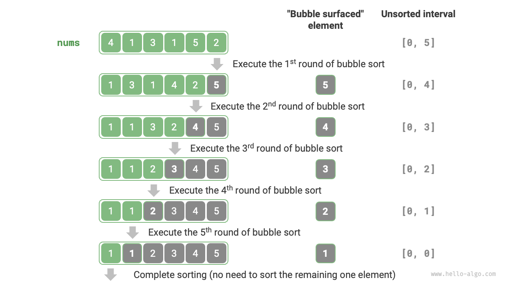

# 11.3 &nbsp; バブルソート

<u>バブルソート</u>は、隣接する要素を継続的に比較し交換することで動作します。このプロセスは泡が底から上に上昇するようなものなので、「バブルソート」と名付けられました。

下図に示すように、バブリングプロセスは要素交換を使用してシミュレートできます：配列の左端から開始して右に移動し、隣接する要素の各ペアを比較します。左の要素が右の要素より大きい場合は、それらを交換します。横断後、最大要素は配列の右端にバブルアップします。

=== "<1>"
    { class="animation-figure" }

=== "<2>"
    { class="animation-figure" }

=== "<3>"
    { class="animation-figure" }

=== "<4>"
    { class="animation-figure" }

=== "<5>"
    { class="animation-figure" }

=== "<6>"
    { class="animation-figure" }

=== "<7>"
    { class="animation-figure" }

<p align="center"> 図 11-4 &nbsp; Simulating bubble process using element swap </p>

## 11.3.1 &nbsp; アルゴリズムプロセス

配列の長さを$n$とします。バブルソートのステップは下図に示されます：

1. まず、$n$個の要素に対して1回の「バブル」パスを実行し、**最大要素を正しい位置に交換します**。
2. 次に、残りの$n - 1$個の要素に対して「バブル」パスを実行し、**2番目に大きい要素を正しい位置に交換します**。
3. この方法で続行します；$n - 1$回のパスの後、**最大$n - 1$個の要素が正しい位置に移動されます**。
4. 残りの唯一の要素は**必ず**最小であるため、**さらなる**ソートは必要ありません。この時点で、配列はソートされます。

{ class="animation-figure" }

<p align="center"> 図 11-5 &nbsp; Bubble sort process </p>

コード例は以下の通りです：

=== "Python"

    ```python title="bubble_sort.py"
    def bubble_sort(nums: list[int]):
        """バブルソート"""
        n = len(nums)
        # 外側のループ：未ソート範囲は [0, i]
        for i in range(n - 1, 0, -1):
            # 内側のループ：未ソート範囲 [0, i] の最大要素を範囲の右端に移動
            for j in range(i):
                if nums[j] > nums[j + 1]:
                    # nums[j] と nums[j + 1] を交換
                    nums[j], nums[j + 1] = nums[j + 1], nums[j]
    ```

=== "C++"

    ```cpp title="bubble_sort.cpp"
    /* バブルソート */
    void bubbleSort(vector<int> &nums) {
        // 外側ループ：未ソート範囲は[0, i]
        for (int i = nums.size() - 1; i > 0; i--) {
            // 内側ループ：未ソート範囲[0, i]内の最大要素を範囲の右端に交換
            for (int j = 0; j < i; j++) {
                if (nums[j] > nums[j + 1]) {
                    // nums[j]とnums[j + 1]を交換
                    // ここではstdのswapを使用
                    swap(nums[j], nums[j + 1]);
                }
            }
        }
    }
    ```

=== "Java"

    ```java title="bubble_sort.java"
    /* バブルソート */
    void bubbleSort(int[] nums) {
        // 外側ループ: 未ソート範囲は [0, i]
        for (int i = nums.length - 1; i > 0; i--) {
            // 内側ループ: 未ソート範囲 [0, i] の最大要素を範囲の右端に交換
            for (int j = 0; j < i; j++) {
                if (nums[j] > nums[j + 1]) {
                    // nums[j] と nums[j + 1] を交換
                    int tmp = nums[j];
                    nums[j] = nums[j + 1];
                    nums[j + 1] = tmp;
                }
            }
        }
    }
    ```

=== "C#"

    ```csharp title="bubble_sort.cs"
    [class]{bubble_sort}-[func]{BubbleSort}
    ```

=== "Go"

    ```go title="bubble_sort.go"
    [class]{}-[func]{bubbleSort}
    ```

=== "Swift"

    ```swift title="bubble_sort.swift"
    [class]{}-[func]{bubbleSort}
    ```

=== "JS"

    ```javascript title="bubble_sort.js"
    [class]{}-[func]{bubbleSort}
    ```

=== "TS"

    ```typescript title="bubble_sort.ts"
    [class]{}-[func]{bubbleSort}
    ```

=== "Dart"

    ```dart title="bubble_sort.dart"
    [class]{}-[func]{bubbleSort}
    ```

=== "Rust"

    ```rust title="bubble_sort.rs"
    [class]{}-[func]{bubble_sort}
    ```

=== "C"

    ```c title="bubble_sort.c"
    [class]{}-[func]{bubbleSort}
    ```

=== "Kotlin"

    ```kotlin title="bubble_sort.kt"
    [class]{}-[func]{bubbleSort}
    ```

=== "Ruby"

    ```ruby title="bubble_sort.rb"
    [class]{}-[func]{bubble_sort}
    ```

## 11.3.2 &nbsp; 効率の最適化

「バブリング」のラウンド中に交換が発生しない場合、配列はすでにソートされているため、すぐに戻ることができます。これを検出するために、`flag`変数を追加できます；パスで交換が行われない場合は、フラグを設定して早期に戻ります。

この最適化があっても、バブルソートの最悪時間計算量と平均時間計算量は$O(n^2)$のままです。ただし、入力配列がすでにソートされている場合、最良ケース時間計算量は$O(n)$まで低くなる可能性があります。

=== "Python"

    ```python title="bubble_sort.py"
    def bubble_sort_with_flag(nums: list[int]):
        """バブルソート（フラグによる最適化）"""
        n = len(nums)
        # 外側のループ：未ソート範囲は [0, i]
        for i in range(n - 1, 0, -1):
            flag = False  # フラグを初期化
            # 内側のループ：未ソート範囲 [0, i] の最大要素を範囲の右端に移動
            for j in range(i):
                if nums[j] > nums[j + 1]:
                    # nums[j] と nums[j + 1] を交換
                    nums[j], nums[j + 1] = nums[j + 1], nums[j]
                    flag = True  # 要素を交換したことを記録
            if not flag:
                break  # この回の「バブリング」で要素が交換されなかった場合、終了
    ```

=== "C++"

    ```cpp title="bubble_sort.cpp"
    /* バブルソート（フラグ最適化版）*/
    void bubbleSortWithFlag(vector<int> &nums) {
        // 外側ループ：未ソート範囲は[0, i]
        for (int i = nums.size() - 1; i > 0; i--) {
            bool flag = false; // フラグを初期化
            // 内側ループ：未ソート範囲[0, i]内の最大要素を範囲の右端に交換
            for (int j = 0; j < i; j++) {
                if (nums[j] > nums[j + 1]) {
                    // nums[j]とnums[j + 1]を交換
                    // ここではstdのswapを使用
                    swap(nums[j], nums[j + 1]);
                    flag = true; // 交換された要素を記録
                }
            }
            if (!flag)
                break; // この回の「バブリング」で要素が交換されなかった場合、終了
        }
    }
    ```

=== "Java"

    ```java title="bubble_sort.java"
    /* バブルソート（フラグによる最適化） */
    void bubbleSortWithFlag(int[] nums) {
        // 外側ループ: 未ソート範囲は [0, i]
        for (int i = nums.length - 1; i > 0; i--) {
            boolean flag = false; // フラグを初期化
            // 内側ループ: 未ソート範囲 [0, i] の最大要素を範囲の右端に交換
            for (int j = 0; j < i; j++) {
                if (nums[j] > nums[j + 1]) {
                    // nums[j] と nums[j + 1] を交換
                    int tmp = nums[j];
                    nums[j] = nums[j + 1];
                    nums[j + 1] = tmp;
                    flag = true; // 交換された要素を記録
                }
            }
            if (!flag)
                break; // この「バブリング」ラウンドで要素が交換されなかった場合、終了
        }
    }
    ```

=== "C#"

    ```csharp title="bubble_sort.cs"
    [class]{bubble_sort}-[func]{BubbleSortWithFlag}
    ```

=== "Go"

    ```go title="bubble_sort.go"
    [class]{}-[func]{bubbleSortWithFlag}
    ```

=== "Swift"

    ```swift title="bubble_sort.swift"
    [class]{}-[func]{bubbleSortWithFlag}
    ```

=== "JS"

    ```javascript title="bubble_sort.js"
    [class]{}-[func]{bubbleSortWithFlag}
    ```

=== "TS"

    ```typescript title="bubble_sort.ts"
    [class]{}-[func]{bubbleSortWithFlag}
    ```

=== "Dart"

    ```dart title="bubble_sort.dart"
    [class]{}-[func]{bubbleSortWithFlag}
    ```

=== "Rust"

    ```rust title="bubble_sort.rs"
    [class]{}-[func]{bubble_sort_with_flag}
    ```

=== "C"

    ```c title="bubble_sort.c"
    [class]{}-[func]{bubbleSortWithFlag}
    ```

=== "Kotlin"

    ```kotlin title="bubble_sort.kt"
    [class]{}-[func]{bubbleSortWithFlag}
    ```

=== "Ruby"

    ```ruby title="bubble_sort.rb"
    [class]{}-[func]{bubble_sort_with_flag}
    ```

## 11.3.3 &nbsp; アルゴリズムの特性

- **$O(n^2)$の時間計算量、適応ソート。** 各「バブリング」ラウンドは長さ$n - 1$、$n - 2$、$\dots$、$2$、$1$の配列セグメントを横断し、合計は$(n - 1) n / 2$となります。`flag`最適化により、配列がすでにソートされている場合、最良ケース時間計算量は$O(n)$に達する可能性があります。
- **$O(1)$の空間計算量、インプレースソート。** ポインタ$i$と$j$によって定数量の追加空間のみが使用されます。
- **安定ソート。** 等しい要素は「バブリング」中に交換されないため、元の順序が保持され、これは安定ソートになります。
