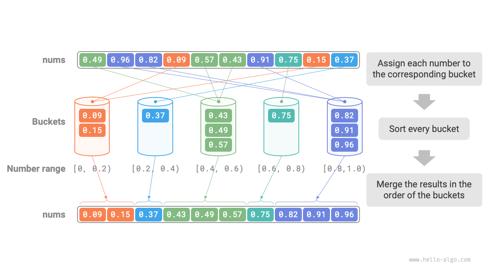
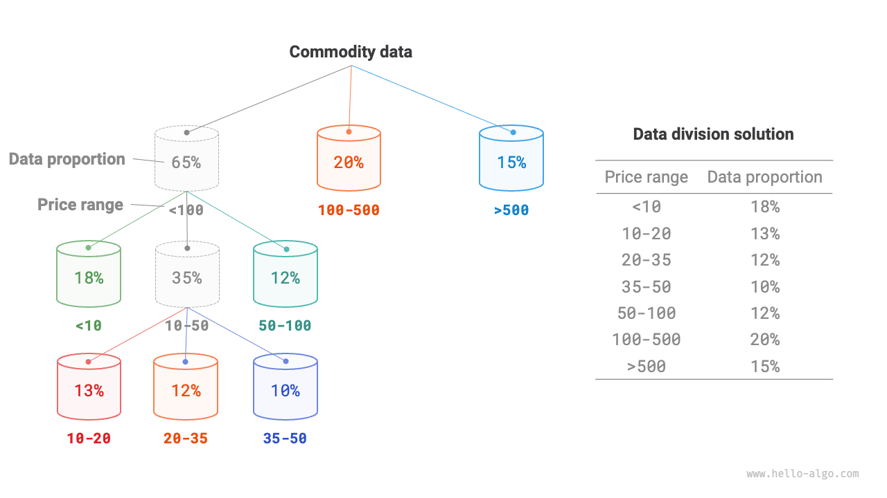
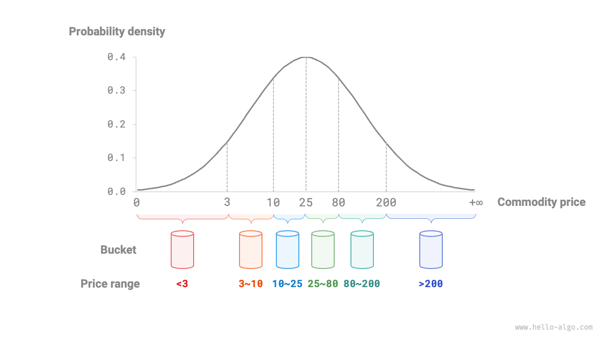

# バケットソート

前述のソートアルゴリズムはすべて「比較ベースのソートアルゴリズム」で、値を比較することで要素をソートします。このようなソートアルゴリズムは $O(n \log n)$ より良い時間計算量を持つことはできません。次に、線形時間計算量を達成できるいくつかの「非比較ソートアルゴリズム」について議論します。

<u>バケットソート</u>は分割統治戦略の典型的な応用です。一連の順序付けられたバケットを設定し、各バケットがデータの範囲を含み、入力データをこれらのバケットに均等に分散させることで動作します。そして、各バケット内のデータを個別にソートします。最後に、すべてのバケットからのソート済みデータを順次マージして最終結果を生成します。

## アルゴリズムの過程

長さ $n$ の配列で、$[0, 1)$ の範囲の浮動小数点数を考えてみます。バケットソートの過程は以下の図に示されています。

1. $k$ 個のバケットを初期化し、$n$ 個の要素をこれらの $k$ 個のバケットに分散させます。
2. 各バケットを個別にソートします（プログラミング言語の組み込みソート関数を使用）。
3. 最小から最大のバケットの順序で結果をマージします。



コードは以下の通りです：

```src
[file]{bucket_sort}-[class]{}-[func]{bucket_sort}
```

## アルゴリズムの特徴

バケットソートは非常に大きなデータセットの処理に適しています。例えば、入力データに100万個の要素が含まれ、システムメモリの制限によりすべてのデータを同時にロードできない場合、データを1,000個のバケットに分割し、各バケットを個別にソートしてから結果をマージできます。

- **時間計算量は $O(n + k)$**：要素がバケット間で均等に分散されていると仮定すると、各バケット内の要素数は $n/k$ です。単一のバケットのソートに $O(n/k \log(n/k))$ 時間がかかると仮定すると、すべてのバケットのソートに $O(n \log(n/k))$ 時間がかかります。**バケット数 $k$ が比較的大きいとき、時間計算量は $O(n)$ に近づきます**。結果のマージには、すべてのバケットと要素を走査する必要があり、$O(n + k)$ 時間がかかります。最悪の場合、すべてのデータが単一のバケットに分散され、そのバケットのソートには $O(n^2)$ 時間がかかります。
- **空間計算量は $O(n + k)$、非インプレースソート**：$k$ 個のバケットと合計 $n$ 個の要素のための追加スペースが必要です。
- バケットソートが安定かどうかは、各バケット内で使用されるソートアルゴリズムが安定かどうかに依存します。

## 均等分散を達成する方法

バケットソートの理論的時間計算量は $O(n)$ に達することができます。**重要なことは、すべてのバケットに要素を均等に分散させることです**。実世界のデータはしばしば均一に分散されていないからです。例えば、eBayのすべての商品を価格範囲で10個のバケットに均等に分散させたいとします。しかし、商品価格の分散は均等でない可能性があり、100ドル未満の商品が多く、500ドル以上の商品が少ないかもしれません。価格範囲を均等に10分割すると、各バケットの商品数の差が大きくなります。

均等分散を達成するために、最初におおよその境界を設定して、データを3つのバケットに大まかに分割できます。**分散が完了した後、より多くのアイテムを持つバケットをさらに3つのバケットに分割し、すべてのバケットの要素数がほぼ等しくなるまで続けます**。

以下の図に示すように、この方法は本質的に再帰木を構築し、葉ノードの要素数ができるだけ均等になることを目指します。もちろん、各ラウンドでデータを3つのバケットに分割する必要はありません - 分割戦略はデータの独特な特性に適応的に調整できます。



商品価格の確率分布を事前に知っている場合、**データの確率分布に基づいて各バケットの価格境界を設定できます**。データ分布を具体的に計算する必要は必ずしもなく、代わりに確率モデルを使用してデータ特性に基づいて近似できることに注意してください。

以下の図に示すように、商品価格が正規分布に従うと仮定すると、バケット間でアイテムの分散のバランスを取るために合理的な価格区間を定義できます。


