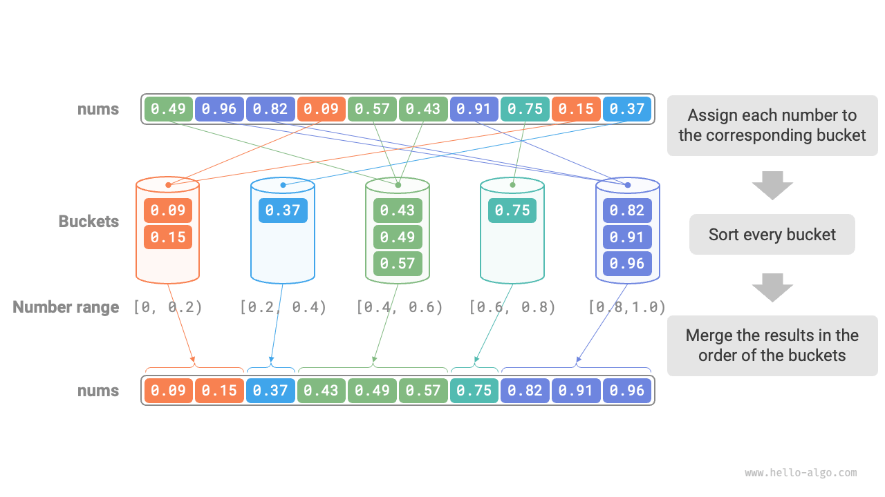
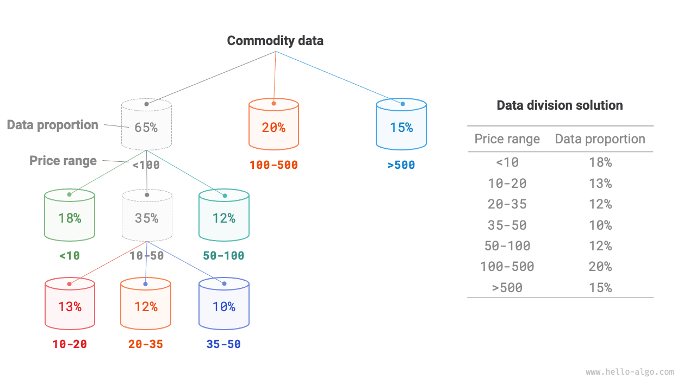
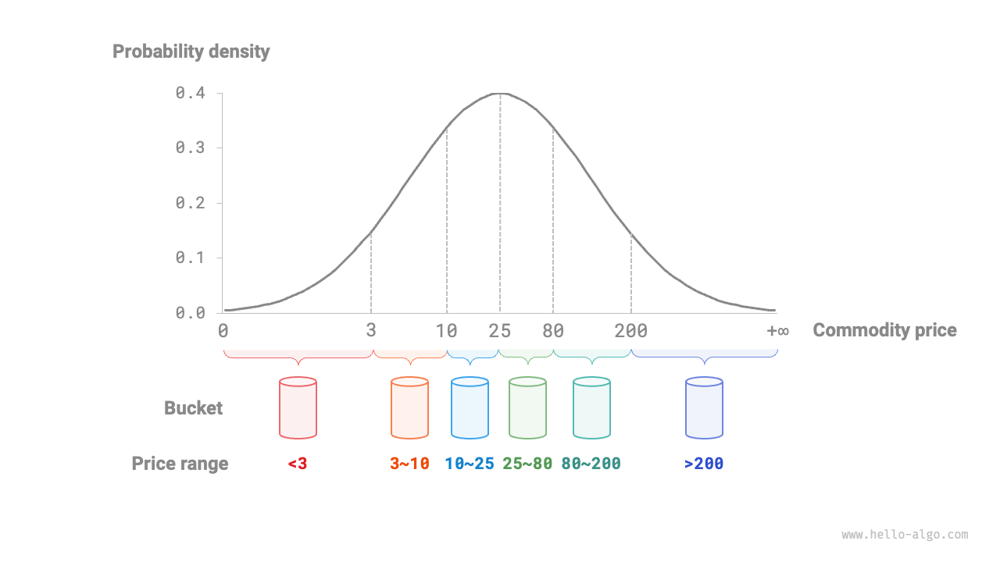

# 11.8 &nbsp; バケットソート

前述のいくつかのソートアルゴリズムは、いずれも「比較ベースのソートアルゴリズム」に属し、要素間の大小を比較することで整列を実現します。この種のソートアルゴリズムの時間計算量は $O(n \log n)$ を超えられません。続いて、時間計算量が線形オーダーに達しうる「非比較ソートアルゴリズム」をいくつか見ていきます。

<u>バケットソート（bucket sort）</u>は分割統治戦略の典型的な応用です。大小関係をもつ複数のバケットを用意し、各バケットがあるデータ範囲に対応するようにして、データを各バケットへ均等に分配します。その後、各バケット内でそれぞれソートを行い、最後にバケットの順序に従ってすべてのデータを結合します。

## 11.8.1 &nbsp; アルゴリズムの流れ

長さ $n$ の配列を考え、その要素は範囲 $[0, 1)$ の浮動小数点数であるとします。バケットソートの流れを以下の図に示します。

1. $k$ 個のバケットを初期化し、$n$ 個の要素を $k$ 個のバケットに分配します。
2. 各バケットに対してそれぞれソートを実行します（ここではプログラミング言語の組み込みソート関数を用います）。
3. バケットを小さい順にたどって結果を結合します。

{ class="animation-figure" }

<p align="center"> 図 11-13 &nbsp; バケットソートの流れ </p>

コードは以下のとおりです：

=== "Python"

    ```python title="bucket_sort.py"
    def bucket_sort(nums: list[float]):
        """バケットソート"""
        # k = n/2 個のバケットを初期化し、各バケットに 2 要素ずつ割り当てる想定とする
        k = len(nums) // 2
        buckets = [[] for _ in range(k)]
        # 1. 配列要素を各バケットに振り分ける
        for num in nums:
            # 入力データの範囲は [0, 1) であり、num * k を用いてインデックス範囲 [0, k-1] に写像する
            i = int(num * k)
            # num をバケット i に追加
            buckets[i].append(num)
        # 2. 各バケットをソートする
        for bucket in buckets:
            # 組み込みのソート関数を使う。他のソートアルゴリズムに置き換えてもよい
            bucket.sort()
        # 3. バケットを走査して結果を結合
        i = 0
        for bucket in buckets:
            for num in bucket:
                nums[i] = num
                i += 1
    ```

=== "C++"

    ```cpp title="bucket_sort.cpp"
    /* バケットソート */
    void bucketSort(vector<float> &nums) {
        // k = n/2 個のバケットを初期化し、各バケットに 2 要素ずつ割り当てる想定とする
        int k = nums.size() / 2;
        vector<vector<float>> buckets(k);
        // 1. 配列要素を各バケットに振り分ける
        for (float num : nums) {
            // 入力データの範囲は [0, 1) であり、num * k を用いてインデックス範囲 [0, k-1] に写像する
            int i = num * k;
            // num をバケット bucket_idx に追加
            buckets[i].push_back(num);
        }
        // 2. 各バケットをソートする
        for (vector<float> &bucket : buckets) {
            // 組み込みのソート関数を使う。他のソートアルゴリズムに置き換えてもよい
            sort(bucket.begin(), bucket.end());
        }
        // 3. バケットを走査して結果を結合
        int i = 0;
        for (vector<float> &bucket : buckets) {
            for (float num : bucket) {
                nums[i++] = num;
            }
        }
    }
    ```

=== "Java"

    ```java title="bucket_sort.java"
    /* バケットソート */
    void bucketSort(float[] nums) {
        // k = n/2 個のバケットを初期化し、各バケットに 2 要素ずつ割り当てる想定とする
        int k = nums.length / 2;
        List<List<Float>> buckets = new ArrayList<>();
        for (int i = 0; i < k; i++) {
            buckets.add(new ArrayList<>());
        }
        // 1. 配列要素を各バケットに振り分ける
        for (float num : nums) {
            // 入力データの範囲は [0, 1) であり、num * k を用いてインデックス範囲 [0, k-1] に写像する
            int i = (int) (num * k);
            // num をバケット i に追加
            buckets.get(i).add(num);
        }
        // 2. 各バケットをソートする
        for (List<Float> bucket : buckets) {
            // 組み込みのソート関数を使う。他のソートアルゴリズムに置き換えてもよい
            Collections.sort(bucket);
        }
        // 3. バケットを走査して結果を結合
        int i = 0;
        for (List<Float> bucket : buckets) {
            for (float num : bucket) {
                nums[i++] = num;
            }
        }
    }
    ```

=== "C#"

    ```csharp title="bucket_sort.cs"
    /* バケットソート */
    void BucketSort(float[] nums) {
        // k = n/2 個のバケットを初期化し、各バケットに 2 要素ずつ割り当てる想定とする
        int k = nums.Length / 2;
        List<List<float>> buckets = [];
        for (int i = 0; i < k; i++) {
            buckets.Add([]);
        }
        // 1. 配列要素を各バケットに振り分ける
        foreach (float num in nums) {
            // 入力データの範囲は [0, 1) であり、num * k を用いてインデックス範囲 [0, k-1] に写像する
            int i = (int)(num * k);
            // num をバケット i に追加
            buckets[i].Add(num);
        }
        // 2. 各バケットをソートする
        foreach (List<float> bucket in buckets) {
            // 組み込みのソート関数を使う。他のソートアルゴリズムに置き換えてもよい
            bucket.Sort();
        }
        // 3. バケットを走査して結果を結合
        int j = 0;
        foreach (List<float> bucket in buckets) {
            foreach (float num in bucket) {
                nums[j++] = num;
            }
        }
    }
    ```

=== "Go"

    ```go title="bucket_sort.go"
    /* バケットソート */
    func bucketSort(nums []float64) {
        // k = n/2 個のバケットを初期化し、各バケットに 2 要素ずつ割り当てる想定とする
        k := len(nums) / 2
        buckets := make([][]float64, k)
        for i := 0; i < k; i++ {
            buckets[i] = make([]float64, 0)
        }
        // 1. 配列要素を各バケットに振り分ける
        for _, num := range nums {
            // 入力データの範囲は [0, 1) であり、num * k を用いてインデックス範囲 [0, k-1] に写像する
            i := int(num * float64(k))
            // num をバケット i に追加
            buckets[i] = append(buckets[i], num)
        }
        // 2. 各バケットをソートする
        for i := 0; i < k; i++ {
            // 組み込みのスライスソート関数を使う。ほかのソートアルゴリズムに置き換えてもよい
            sort.Float64s(buckets[i])
        }
        // 3. バケットを走査して結果を結合
        i := 0
        for _, bucket := range buckets {
            for _, num := range bucket {
                nums[i] = num
                i++
            }
        }
    }
    ```

=== "Swift"

    ```swift title="bucket_sort.swift"
    /* バケットソート */
    func bucketSort(nums: inout [Double]) {
        // k = n/2 個のバケットを初期化し、各バケットに 2 要素ずつ割り当てる想定とする
        let k = nums.count / 2
        var buckets = (0 ..< k).map { _ in [Double]() }
        // 1. 配列要素を各バケットに振り分ける
        for num in nums {
            // 入力データの範囲は [0, 1) であり、num * k を用いてインデックス範囲 [0, k-1] に写像する
            let i = Int(num * Double(k))
            // num をバケット i に追加
            buckets[i].append(num)
        }
        // 2. 各バケットをソートする
        for i in buckets.indices {
            // 組み込みのソート関数を使う。他のソートアルゴリズムに置き換えてもよい
            buckets[i].sort()
        }
        // 3. バケットを走査して結果を結合
        var i = nums.startIndex
        for bucket in buckets {
            for num in bucket {
                nums[i] = num
                i += 1
            }
        }
    }
    ```

=== "JS"

    ```javascript title="bucket_sort.js"
    /* バケットソート */
    function bucketSort(nums) {
        // k = n/2 個のバケットを初期化し、各バケットに 2 要素ずつ割り当てる想定とする
        const k = nums.length / 2;
        const buckets = [];
        for (let i = 0; i < k; i++) {
            buckets.push([]);
        }
        // 1. 配列要素を各バケットに振り分ける
        for (const num of nums) {
            // 入力データの範囲は [0, 1) であり、num * k を用いてインデックス範囲 [0, k-1] に写像する
            const i = Math.floor(num * k);
            // num をバケット i に追加
            buckets[i].push(num);
        }
        // 2. 各バケットをソートする
        for (const bucket of buckets) {
            // 組み込みのソート関数を使う。他のソートアルゴリズムに置き換えてもよい
            bucket.sort((a, b) => a - b);
        }
        // 3. バケットを走査して結果を結合
        let i = 0;
        for (const bucket of buckets) {
            for (const num of bucket) {
                nums[i++] = num;
            }
        }
    }
    ```

=== "TS"

    ```typescript title="bucket_sort.ts"
    /* バケットソート */
    function bucketSort(nums: number[]): void {
        // k = n/2 個のバケットを初期化し、各バケットに 2 要素ずつ割り当てる想定とする
        const k = nums.length / 2;
        const buckets: number[][] = [];
        for (let i = 0; i < k; i++) {
            buckets.push([]);
        }
        // 1. 配列要素を各バケットに振り分ける
        for (const num of nums) {
            // 入力データの範囲は [0, 1) であり、num * k を用いてインデックス範囲 [0, k-1] に写像する
            const i = Math.floor(num * k);
            // num をバケット i に追加
            buckets[i].push(num);
        }
        // 2. 各バケットをソートする
        for (const bucket of buckets) {
            // 組み込みのソート関数を使う。他のソートアルゴリズムに置き換えてもよい
            bucket.sort((a, b) => a - b);
        }
        // 3. バケットを走査して結果を結合
        let i = 0;
        for (const bucket of buckets) {
            for (const num of bucket) {
                nums[i++] = num;
            }
        }
    }
    ```

=== "Dart"

    ```dart title="bucket_sort.dart"
    /* バケットソート */
    void bucketSort(List<double> nums) {
      // k = n/2 個のバケットを初期化し、各バケットに 2 要素ずつ割り当てる想定とする
      int k = nums.length ~/ 2;
      List<List<double>> buckets = List.generate(k, (index) => []);

      // 1. 配列要素を各バケットに振り分ける
      for (double _num in nums) {
        // 入力データの範囲は [0, 1) であり、_num * k を用いてインデックス範囲 [0, k-1] に写像する
        int i = (_num * k).toInt();
        // _num をバケット bucket_idx に追加
        buckets[i].add(_num);
      }
      // 2. 各バケットをソートする
      for (List<double> bucket in buckets) {
        bucket.sort();
      }
      // 3. バケットを走査して結果を結合
      int i = 0;
      for (List<double> bucket in buckets) {
        for (double _num in bucket) {
          nums[i++] = _num;
        }
      }
    }
    ```

=== "Rust"

    ```rust title="bucket_sort.rs"
    /* バケットソート */
    fn bucket_sort(nums: &mut [f64]) {
        // k = n/2 個のバケットを初期化し、各バケットに 2 要素ずつ割り当てる想定とする
        let k = nums.len() / 2;
        let mut buckets = vec![vec![]; k];
        // 1. 配列要素を各バケットに振り分ける
        for &num in nums.iter() {
            // 入力データの範囲は [0, 1) であり、num * k を用いてインデックス範囲 [0, k-1] に写像する
            let i = (num * k as f64) as usize;
            // num をバケット i に追加
            buckets[i].push(num);
        }
        // 2. 各バケットをソートする
        for bucket in &mut buckets {
            // 組み込みのソート関数を使う。他のソートアルゴリズムに置き換えてもよい
            bucket.sort_by(|a, b| a.partial_cmp(b).unwrap());
        }
        // 3. バケットを走査して結果を結合
        let mut i = 0;
        for bucket in buckets.iter() {
            for &num in bucket.iter() {
                nums[i] = num;
                i += 1;
            }
        }
    }
    ```

=== "C"

    ```c title="bucket_sort.c"
    /* バケットソート */
    void bucketSort(float nums[], int n) {
        int k = n / 2;                                 // k = n/2 個のバケットを初期化する
        int *sizes = malloc(k * sizeof(int));          // 各バケットのサイズを記録する
        float **buckets = malloc(k * sizeof(float *)); // 動的配列の配列（バケット）
        // 各バケットに十分な容量を事前確保する
        for (int i = 0; i < k; ++i) {
            buckets[i] = (float *)malloc(n * sizeof(float));
            sizes[i] = 0;
        }
        // 1. 配列要素を各バケットに振り分ける
        for (int i = 0; i < n; ++i) {
            int idx = (int)(nums[i] * k);
            buckets[idx][sizes[idx]++] = nums[i];
        }
        // 2. 各バケットをソートする
        for (int i = 0; i < k; ++i) {
            qsort(buckets[i], sizes[i], sizeof(float), compare);
        }
        // 3. ソート済みのバケットを結合する
        int idx = 0;
        for (int i = 0; i < k; ++i) {
            for (int j = 0; j < sizes[i]; ++j) {
                nums[idx++] = buckets[i][j];
            }
            // メモリを解放する
            free(buckets[i]);
        }
    }
    ```

=== "Kotlin"

    ```kotlin title="bucket_sort.kt"
    /* バケットソート */
    fun bucketSort(nums: FloatArray) {
        // k = n/2 個のバケットを初期化し、各バケットに 2 要素ずつ割り当てる想定とする
        val k = nums.size / 2
        val buckets = mutableListOf<MutableList<Float>>()
        for (i in 0..<k) {
            buckets.add(mutableListOf())
        }
        // 1. 配列要素を各バケットに振り分ける
        for (num in nums) {
            // 入力データの範囲は [0, 1) であり、num * k を用いてインデックス範囲 [0, k-1] に写像する
            val i = (num * k).toInt()
            // num をバケット i に追加
            buckets[i].add(num)
        }
        // 2. 各バケットをソートする
        for (bucket in buckets) {
            // 組み込みのソート関数を使う。他のソートアルゴリズムに置き換えてもよい
            bucket.sort()
        }
        // 3. バケットを走査して結果を結合
        var i = 0
        for (bucket in buckets) {
            for (num in bucket) {
                nums[i++] = num
            }
        }
    }
    ```

=== "Ruby"

    ```ruby title="bucket_sort.rb"
    ### バケットソート ###
    def bucket_sort(nums)
      # k = n/2 個のバケットを初期化し、各バケットに 2 要素ずつ割り当てる想定とする
      k = nums.length / 2
      buckets = Array.new(k) { [] }
      
      # 1. 配列要素を各バケットに振り分ける
      nums.each do |num|
        # 入力データの範囲は [0, 1) であり、num * k を用いてインデックス範囲 [0, k-1] に写像する
        i = (num * k).to_i
        # num をバケット i に追加
        buckets[i] << num
      end

      # 2. 各バケットをソートする
      buckets.each do |bucket|
        # 組み込みのソート関数を使う。他のソートアルゴリズムに置き換えてもよい
        bucket.sort!
      end

      # 3. バケットを走査して結果を結合
      i = 0
      buckets.each do |bucket|
        bucket.each do |num|
          nums[i] = num
          i += 1
        end
      end
    end
    ```

??? pythontutor "コードの可視化"

    <div style="height: 549px; width: 100%;"><iframe class="pythontutor-iframe" src="https://pythontutor.com/iframe-embed.html#code=def%20bucket_sort%28nums%3A%20list%5Bfloat%5D%29%3A%0A%20%20%20%20%22%22%22%E3%83%90%E3%82%B1%E3%83%83%E3%83%88%E3%82%BD%E3%83%BC%E3%83%88%22%22%22%0A%20%20%20%20%23%20k%20%3D%20n%2F2%20%E5%80%8B%E3%81%AE%E3%83%90%E3%82%B1%E3%83%83%E3%83%88%E3%82%92%E5%88%9D%E6%9C%9F%E5%8C%96%E3%81%97%E3%80%81%E5%90%84%E3%83%90%E3%82%B1%E3%83%83%E3%83%88%E3%81%AB%202%20%E8%A6%81%E7%B4%A0%E3%81%9A%E3%81%A4%E5%89%B2%E3%82%8A%E5%BD%93%E3%81%A6%E3%82%8B%E6%83%B3%E5%AE%9A%E3%81%A8%E3%81%99%E3%82%8B%0A%20%20%20%20k%20%3D%20len%28nums%29%20%2F%2F%202%0A%20%20%20%20buckets%20%3D%20%5B%5B%5D%20for%20_%20in%20range%28k%29%5D%0A%20%20%20%20%23%201.%20%E9%85%8D%E5%88%97%E8%A6%81%E7%B4%A0%E3%82%92%E5%90%84%E3%83%90%E3%82%B1%E3%83%83%E3%83%88%E3%81%AB%E6%8C%AF%E3%82%8A%E5%88%86%E3%81%91%E3%82%8B%0A%20%20%20%20for%20num%20in%20nums%3A%0A%20%20%20%20%20%20%20%20%23%20%E5%85%A5%E5%8A%9B%E3%83%87%E3%83%BC%E3%82%BF%E3%81%AE%E7%AF%84%E5%9B%B2%E3%81%AF%20%5B0%2C%201%29%20%E3%81%A7%E3%81%82%E3%82%8A%E3%80%81num%20%2A%20k%20%E3%82%92%E7%94%A8%E3%81%84%E3%81%A6%E3%82%A4%E3%83%B3%E3%83%87%E3%83%83%E3%82%AF%E3%82%B9%E7%AF%84%E5%9B%B2%20%5B0%2C%20k-1%5D%20%E3%81%AB%E5%86%99%E5%83%8F%E3%81%99%E3%82%8B%0A%20%20%20%20%20%20%20%20i%20%3D%20int%28num%20%2A%20k%29%0A%20%20%20%20%20%20%20%20%23%20num%20%E3%82%92%E3%83%90%E3%82%B1%E3%83%83%E3%83%88%20i%20%E3%81%AB%E8%BF%BD%E5%8A%A0%0A%20%20%20%20%20%20%20%20buckets%5Bi%5D.append%28num%29%0A%20%20%20%20%23%202.%20%E5%90%84%E3%83%90%E3%82%B1%E3%83%83%E3%83%88%E3%82%92%E3%82%BD%E3%83%BC%E3%83%88%E3%81%99%E3%82%8B%0A%20%20%20%20for%20bucket%20in%20buckets%3A%0A%20%20%20%20%20%20%20%20%23%20%E7%B5%84%E3%81%BF%E8%BE%BC%E3%81%BF%E3%81%AE%E3%82%BD%E3%83%BC%E3%83%88%E9%96%A2%E6%95%B0%E3%82%92%E4%BD%BF%E3%81%86%E3%80%82%E4%BB%96%E3%81%AE%E3%82%BD%E3%83%BC%E3%83%88%E3%82%A2%E3%83%AB%E3%82%B4%E3%83%AA%E3%82%BA%E3%83%A0%E3%81%AB%E7%BD%AE%E3%81%8D%E6%8F%9B%E3%81%88%E3%81%A6%E3%82%82%E3%82%88%E3%81%84%0A%20%20%20%20%20%20%20%20bucket.sort%28%29%0A%20%20%20%20%23%203.%20%E3%83%90%E3%82%B1%E3%83%83%E3%83%88%E3%82%92%E8%B5%B0%E6%9F%BB%E3%81%97%E3%81%A6%E7%B5%90%E6%9E%9C%E3%82%92%E7%B5%90%E5%90%88%0A%20%20%20%20i%20%3D%200%0A%20%20%20%20for%20bucket%20in%20buckets%3A%0A%20%20%20%20%20%20%20%20for%20num%20in%20bucket%3A%0A%20%20%20%20%20%20%20%20%20%20%20%20nums%5Bi%5D%20%3D%20num%0A%20%20%20%20%20%20%20%20%20%20%20%20i%20%2B%3D%201%0A%0Aif%20__name__%20%3D%3D%20%22__main__%22%3A%0A%20%20%20%20%23%20%E5%85%A5%E5%8A%9B%E3%83%87%E3%83%BC%E3%82%BF%E3%81%AF%E7%AF%84%E5%9B%B2%20%5B0%2C%201%29%20%E3%81%AE%E6%B5%AE%E5%8B%95%E5%B0%8F%E6%95%B0%E7%82%B9%E6%95%B0%E3%81%A8%E3%81%99%E3%82%8B%0A%20%20%20%20nums%20%3D%20%5B0.49%2C%200.96%2C%200.82%2C%200.09%2C%200.57%2C%200.43%2C%200.91%2C%200.75%2C%200.15%2C%200.37%5D%0A%20%20%20%20bucket_sort%28nums%29%0A%20%20%20%20print%28%22%E3%83%90%E3%82%B1%E3%83%83%E3%83%88%E3%82%BD%E3%83%BC%E3%83%88%E5%AE%8C%E4%BA%86%E5%BE%8C%20nums%20%3D%22%2C%20nums%29&codeDivHeight=472&codeDivWidth=350&cumulative=false&curInstr=3&heapPrimitives=nevernest&origin=opt-frontend.js&py=311&rawInputLstJSON=%5B%5D&textReferences=false"> </iframe></div>
    <div style="margin-top: 5px;"><a href="https://pythontutor.com/iframe-embed.html#code=def%20bucket_sort%28nums%3A%20list%5Bfloat%5D%29%3A%0A%20%20%20%20%22%22%22%E3%83%90%E3%82%B1%E3%83%83%E3%83%88%E3%82%BD%E3%83%BC%E3%83%88%22%22%22%0A%20%20%20%20%23%20k%20%3D%20n%2F2%20%E5%80%8B%E3%81%AE%E3%83%90%E3%82%B1%E3%83%83%E3%83%88%E3%82%92%E5%88%9D%E6%9C%9F%E5%8C%96%E3%81%97%E3%80%81%E5%90%84%E3%83%90%E3%82%B1%E3%83%83%E3%83%88%E3%81%AB%202%20%E8%A6%81%E7%B4%A0%E3%81%9A%E3%81%A4%E5%89%B2%E3%82%8A%E5%BD%93%E3%81%A6%E3%82%8B%E6%83%B3%E5%AE%9A%E3%81%A8%E3%81%99%E3%82%8B%0A%20%20%20%20k%20%3D%20len%28nums%29%20%2F%2F%202%0A%20%20%20%20buckets%20%3D%20%5B%5B%5D%20for%20_%20in%20range%28k%29%5D%0A%20%20%20%20%23%201.%20%E9%85%8D%E5%88%97%E8%A6%81%E7%B4%A0%E3%82%92%E5%90%84%E3%83%90%E3%82%B1%E3%83%83%E3%83%88%E3%81%AB%E6%8C%AF%E3%82%8A%E5%88%86%E3%81%91%E3%82%8B%0A%20%20%20%20for%20num%20in%20nums%3A%0A%20%20%20%20%20%20%20%20%23%20%E5%85%A5%E5%8A%9B%E3%83%87%E3%83%BC%E3%82%BF%E3%81%AE%E7%AF%84%E5%9B%B2%E3%81%AF%20%5B0%2C%201%29%20%E3%81%A7%E3%81%82%E3%82%8A%E3%80%81num%20%2A%20k%20%E3%82%92%E7%94%A8%E3%81%84%E3%81%A6%E3%82%A4%E3%83%B3%E3%83%87%E3%83%83%E3%82%AF%E3%82%B9%E7%AF%84%E5%9B%B2%20%5B0%2C%20k-1%5D%20%E3%81%AB%E5%86%99%E5%83%8F%E3%81%99%E3%82%8B%0A%20%20%20%20%20%20%20%20i%20%3D%20int%28num%20%2A%20k%29%0A%20%20%20%20%20%20%20%20%23%20num%20%E3%82%92%E3%83%90%E3%82%B1%E3%83%83%E3%83%88%20i%20%E3%81%AB%E8%BF%BD%E5%8A%A0%0A%20%20%20%20%20%20%20%20buckets%5Bi%5D.append%28num%29%0A%20%20%20%20%23%202.%20%E5%90%84%E3%83%90%E3%82%B1%E3%83%83%E3%83%88%E3%82%92%E3%82%BD%E3%83%BC%E3%83%88%E3%81%99%E3%82%8B%0A%20%20%20%20for%20bucket%20in%20buckets%3A%0A%20%20%20%20%20%20%20%20%23%20%E7%B5%84%E3%81%BF%E8%BE%BC%E3%81%BF%E3%81%AE%E3%82%BD%E3%83%BC%E3%83%88%E9%96%A2%E6%95%B0%E3%82%92%E4%BD%BF%E3%81%86%E3%80%82%E4%BB%96%E3%81%AE%E3%82%BD%E3%83%BC%E3%83%88%E3%82%A2%E3%83%AB%E3%82%B4%E3%83%AA%E3%82%BA%E3%83%A0%E3%81%AB%E7%BD%AE%E3%81%8D%E6%8F%9B%E3%81%88%E3%81%A6%E3%82%82%E3%82%88%E3%81%84%0A%20%20%20%20%20%20%20%20bucket.sort%28%29%0A%20%20%20%20%23%203.%20%E3%83%90%E3%82%B1%E3%83%83%E3%83%88%E3%82%92%E8%B5%B0%E6%9F%BB%E3%81%97%E3%81%A6%E7%B5%90%E6%9E%9C%E3%82%92%E7%B5%90%E5%90%88%0A%20%20%20%20i%20%3D%200%0A%20%20%20%20for%20bucket%20in%20buckets%3A%0A%20%20%20%20%20%20%20%20for%20num%20in%20bucket%3A%0A%20%20%20%20%20%20%20%20%20%20%20%20nums%5Bi%5D%20%3D%20num%0A%20%20%20%20%20%20%20%20%20%20%20%20i%20%2B%3D%201%0A%0Aif%20__name__%20%3D%3D%20%22__main__%22%3A%0A%20%20%20%20%23%20%E5%85%A5%E5%8A%9B%E3%83%87%E3%83%BC%E3%82%BF%E3%81%AF%E7%AF%84%E5%9B%B2%20%5B0%2C%201%29%20%E3%81%AE%E6%B5%AE%E5%8B%95%E5%B0%8F%E6%95%B0%E7%82%B9%E6%95%B0%E3%81%A8%E3%81%99%E3%82%8B%0A%20%20%20%20nums%20%3D%20%5B0.49%2C%200.96%2C%200.82%2C%200.09%2C%200.57%2C%200.43%2C%200.91%2C%200.75%2C%200.15%2C%200.37%5D%0A%20%20%20%20bucket_sort%28nums%29%0A%20%20%20%20print%28%22%E3%83%90%E3%82%B1%E3%83%83%E3%83%88%E3%82%BD%E3%83%BC%E3%83%88%E5%AE%8C%E4%BA%86%E5%BE%8C%20nums%20%3D%22%2C%20nums%29&codeDivHeight=800&codeDivWidth=600&cumulative=false&curInstr=3&heapPrimitives=nevernest&origin=opt-frontend.js&py=311&rawInputLstJSON=%5B%5D&textReferences=false" target="_blank" rel="noopener noreferrer">全画面で見る ></a></div>

## 11.8.2 &nbsp; アルゴリズムの特性

バケットソートは、非常に大規模なデータの処理に適しています。たとえば、入力データに 100 万個の要素が含まれ、空間の制約によりシステムメモリへすべてのデータを一度に読み込めない場合です。このとき、データを 1000 個のバケットに分け、それぞれのバケットを個別にソートしてから、最後に結果を結合できます。

- **時間計算量は $O(n + k)$** ：要素が各バケット内に平均的に分布していると仮定すると、各バケット内の要素数は $\frac{n}{k}$ です。1 つのバケットをソートするのに $O(\frac{n}{k} \log\frac{n}{k})$ の時間がかかるなら、すべてのバケットのソートには $O(n \log\frac{n}{k})$ の時間がかかります。**バケット数 $k$ が十分大きいとき、時間計算量は $O(n)$ に近づきます**。結果を結合する際には、すべてのバケットと要素を走査する必要があり、$O(n + k)$ の時間を要します。最悪の場合、すべてのデータが 1 つのバケットに割り当てられ、そのバケットのソートに $O(n^2)$ の時間がかかります。
- **空間計算量は $O(n + k)$、非インプレースソート**：$k$ 個のバケットと合計 $n$ 個の要素ぶんの追加領域が必要です。
- バケットソートが安定かどうかは、バケット内要素のソートに用いるアルゴリズムが安定かどうかに依存します。

## 11.8.3 &nbsp; 均等な分配を実現するには

バケットソートの時間計算量は理論上 $O(n)$ に達しますが、**鍵は要素を各バケットへ均等に分配すること** にあります。実際のデータは均一に分布していないことが多いからです。たとえば、Taobao 上のすべての商品を価格帯ごとに 10 個のバケットへ均等に分けたいとしても、商品の価格分布は偏っており、100 元未満は非常に多く、1000 元超は非常に少ないかもしれません。価格区間を単純に 10 等分すると、各バケットの商品数には大きな差が生じます。

均等な分配を実現するために、まず大まかな境界線を設定し、データをひとまず 3 個のバケットに粗く振り分けます。**分配後は、商品数の多いバケットをさらに 3 個のバケットに分割し、すべてのバケット内の要素数がおおむね等しくなるまでこれを続けます**。

以下の図に示すように、この方法の本質は再帰木を構築することにあり、目標は葉ノードの値をできるだけ均等にすることです。もちろん、毎回データを 3 個のバケットに分割する必要はなく、具体的な分け方はデータの特徴に応じて柔軟に選べます。

{ class="animation-figure" }

<p align="center"> 図 11-14 &nbsp; 再帰的にバケットを分割 </p>

商品価格の確率分布をあらかじめ把握しているなら、**データの確率分布に基づいて各バケットの価格境界を設定できます**。なお、データ分布は必ずしも特別に統計を取る必要はなく、データの特徴に応じて何らかの確率モデルで近似することもできます。

以下の図に示すように、商品価格が正規分布に従うと仮定すれば、価格区間を合理的に設定でき、それによって商品を各バケットへ均等に分配できます。

{ class="animation-figure" }

<p align="center"> 図 11-15 &nbsp; 確率分布に基づいてバケットを分割 </p>
