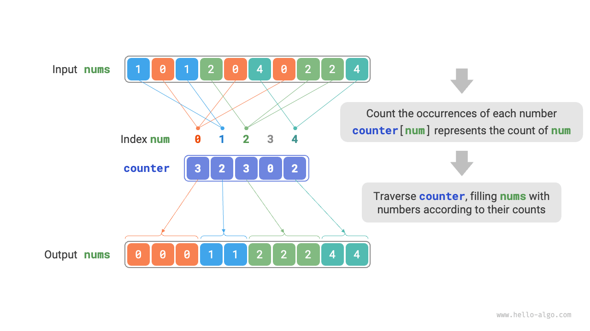
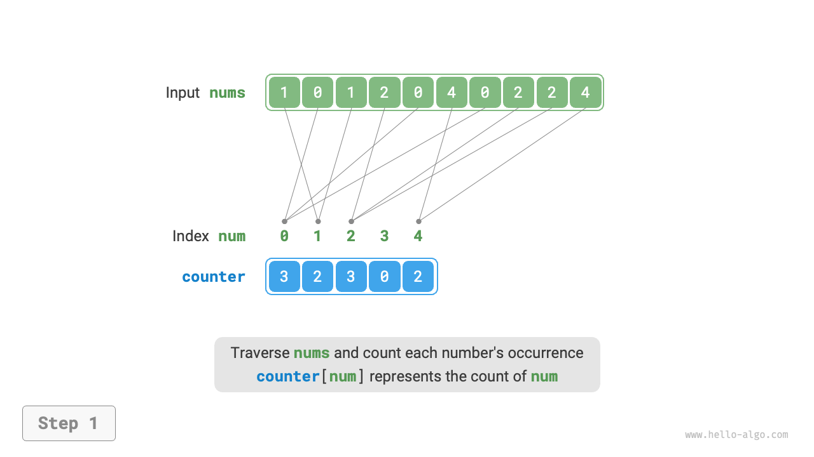
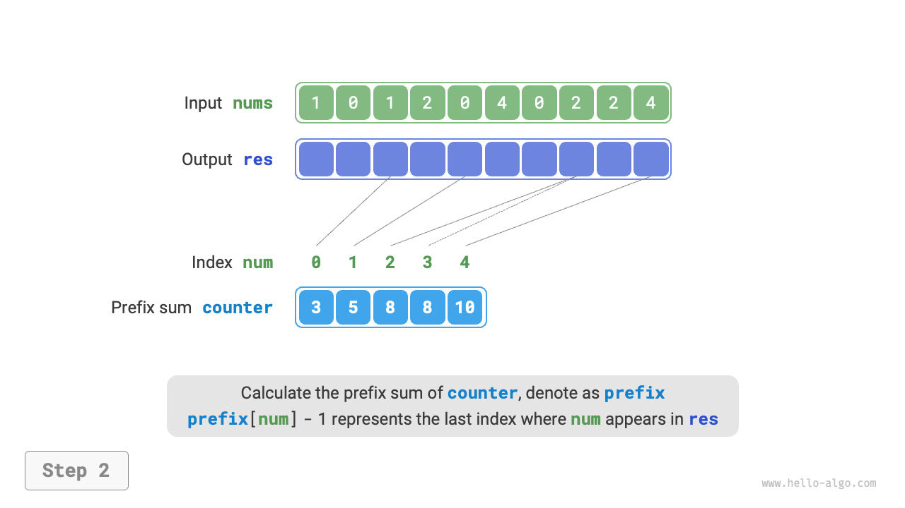
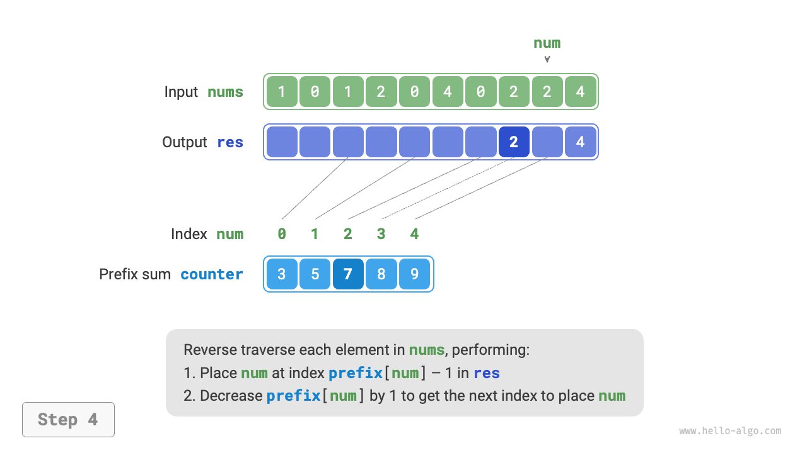
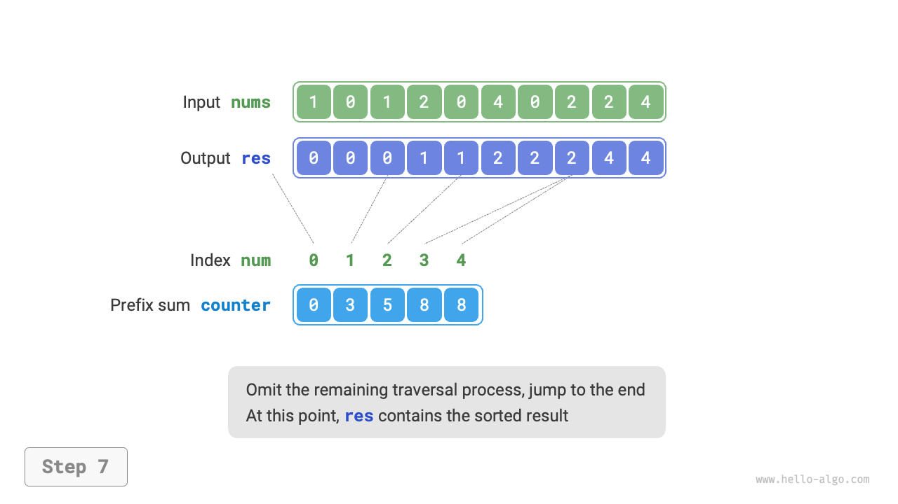
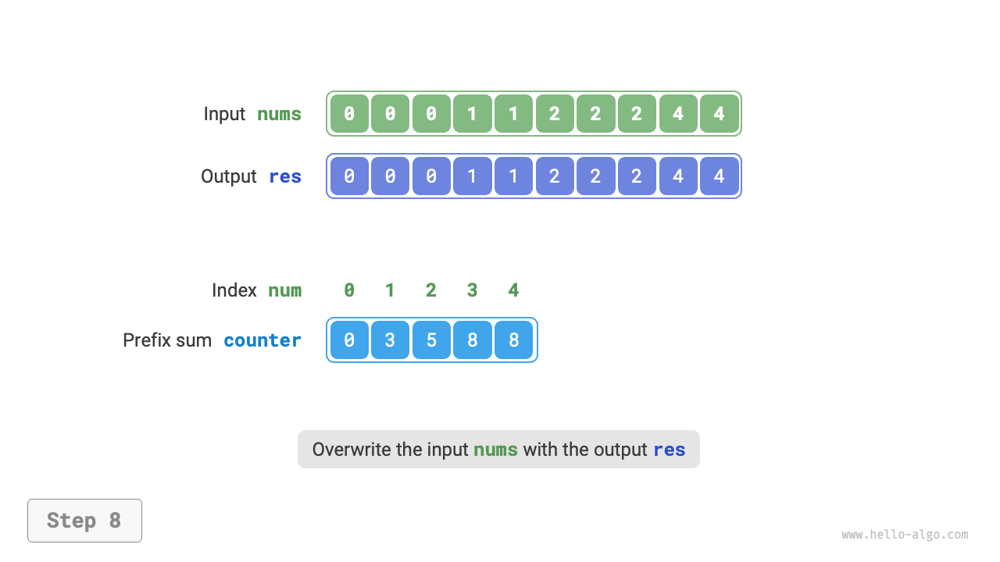

# 計数ソート

<u>計数ソート</u>は要素の数をカウントすることでソートを実現し、通常は整数配列に適用されます。

## 簡単な実装

簡単な例から始めましょう。長さ $n$ の配列 `nums` が与えられ、すべての要素が「非負整数」である場合、計数ソートの全体的な過程は以下の図に示されています。

1. 配列を走査して最大数を見つけ、それを $m$ とし、長さ $m + 1$ の補助配列 `counter` を作成します。
2. **`counter` を使用して `nums` 内の各数の出現回数をカウントします**。ここで `counter[num]` は数 `num` の出現回数に対応します。カウント方法は簡単で、`nums` を走査し（現在の数を `num` とする）、各ラウンドで `counter[num]` を $1$ 増やします。
3. **`counter` のインデックスは自然に順序付けられているため、すべての数は本質的にすでにソートされています**。次に、`counter` を走査し、出現順に `nums` を昇順で埋めます。



コードは以下の通りです：

```src
[file]{counting_sort}-[class]{}-[func]{counting_sort_naive}
```

!!! note "計数ソートとバケットソートの関係"

    バケットソートの観点から、計数ソートにおける計数配列 `counter` の各インデックスをバケットと考え、カウントの過程を要素を対応するバケットに分散させることと考えることができます。本質的に、計数ソートは整数データのためのバケットソートの特別なケースです。

## 完全な実装

注意深い読者は気付くかもしれませんが、**入力データがオブジェクトの場合、上記の手順 `3.` は無効です**。入力データが商品オブジェクトで、価格（クラスメンバ変数）で商品をソートしたいとします。しかし、上記のアルゴリズムは結果としてソート済みの価格のみを提供できます。

では、元のデータのソート結果をどのように取得できるでしょうか？まず、`counter` の「前置和」を計算します。名前が示すように、インデックス `i` での前置和 `prefix[i]` は、配列の最初の `i` 個の要素の和に等しいです：

$$
\text{prefix}[i] = \sum_{j=0}^i \text{counter[j]}
$$

**前置和には明確な意味があります。`prefix[num] - 1` は結果配列 `res` における要素 `num` の最後の出現のインデックスを表します**。この情報は重要で、各要素が結果配列のどこに現れるべきかを教えてくれます。次に、元の配列 `nums` の各要素 `num` を逆順で走査し、各反復で以下の2つの手順を実行します。

1. インデックス `prefix[num] - 1` で配列 `res` に `num` を埋めます。
2. 前置和 `prefix[num]` を $1$ 減らして、`num` を配置する次のインデックスを取得します。

走査後、配列 `res` にはソートされた結果が含まれ、最後に `res` が元の配列 `nums` を置き換えます。完全な計数ソートの過程は以下の図に示されています。

=== "<1>"
    

=== "<2>"
    

=== "<3>"
    

=== "<4>"
    

=== "<5>"
    

=== "<6>"
    

=== "<7>"
    

=== "<8>"
    

計数ソートの実装コードは以下の通りです：

```src
[file]{counting_sort}-[class]{}-[func]{counting_sort}
```

## アルゴリズムの特徴

- **時間計算量は $O(n + m)$、非適応ソート**：`nums` と `counter` の走査が含まれ、どちらも線形時間を使用します。一般的に、$n \gg m$ であり、時間計算量は $O(n)$ に近づきます。
- **空間計算量は $O(n + m)$、非インプレースソート**：長さ $n$ の配列 `res` と長さ $m$ の配列 `counter` をそれぞれ使用します。
- **安定ソート**：要素が「右から左」の順序で `res` に埋められるため、`nums` の走査を逆順にすることで、等しい要素間の相対位置の変化を防ぎ、安定したソートを実現できます。実際、`nums` を順番に走査しても正しいソート結果を生成できますが、結果は不安定です。

## 制限事項

今までに、計数ソートは非常に巧妙だと感じるかもしれません。単に量をカウントするだけで効率的なソートを実現できるからです。しかし、計数ソートを使用するための前提条件は比較的厳しいです。

**計数ソートは非負整数にのみ適用できます**。他のタイプのデータに適用したい場合、これらのデータが要素の元の順序を変更することなく非負整数に変換できることを保証する必要があります。例えば、負の整数を含む配列の場合、最初にすべての数に定数を加えて、すべてを正の数に変換し、ソート完了後に元に戻すことができます。

**計数ソートは値の範囲が小さい大きなデータセットに適しています**。例えば、上記の例では、$m$ は大きすぎるべきではありません。そうでなければ、あまりにも多くのスペースを占有してしまいます。そして $n \ll m$ の場合、計数ソートは $O(m)$ 時間を使用し、$O(n \log n)$ ソートアルゴリズムより遅い可能性があります。
