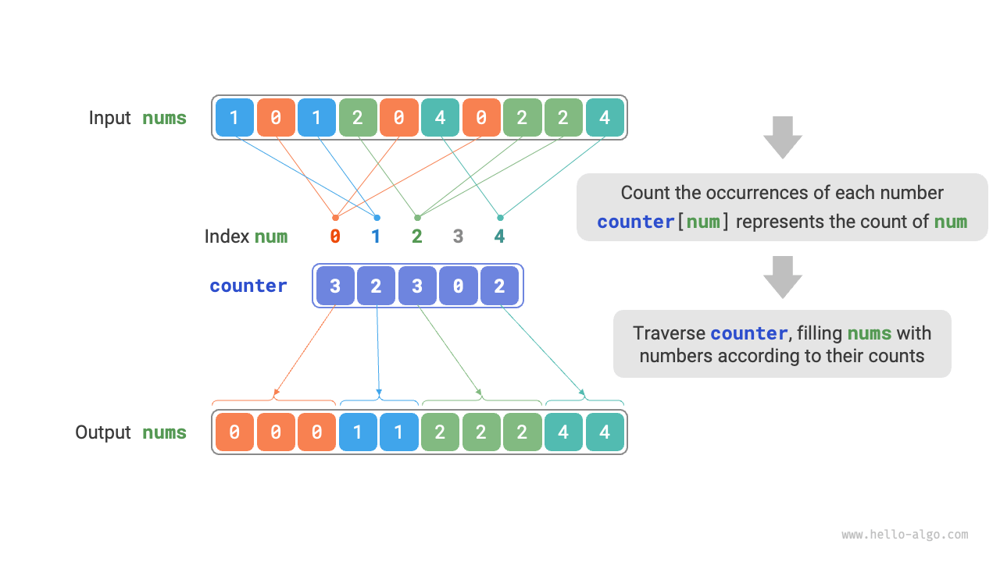
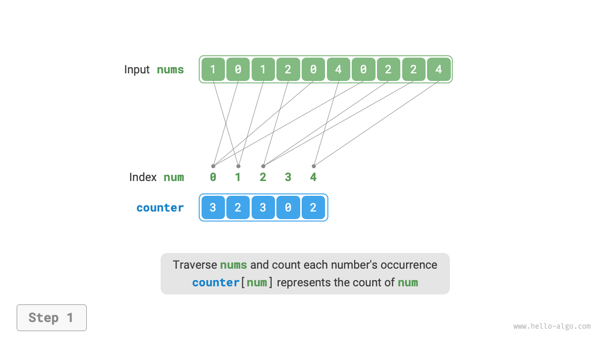
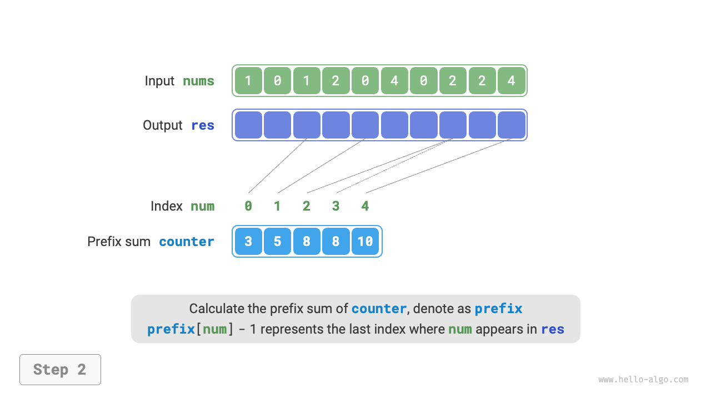
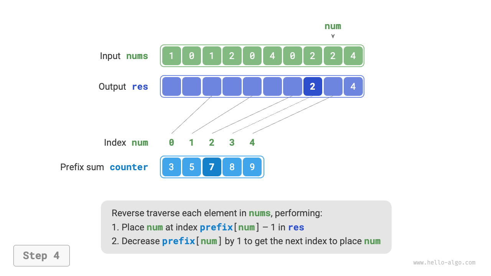
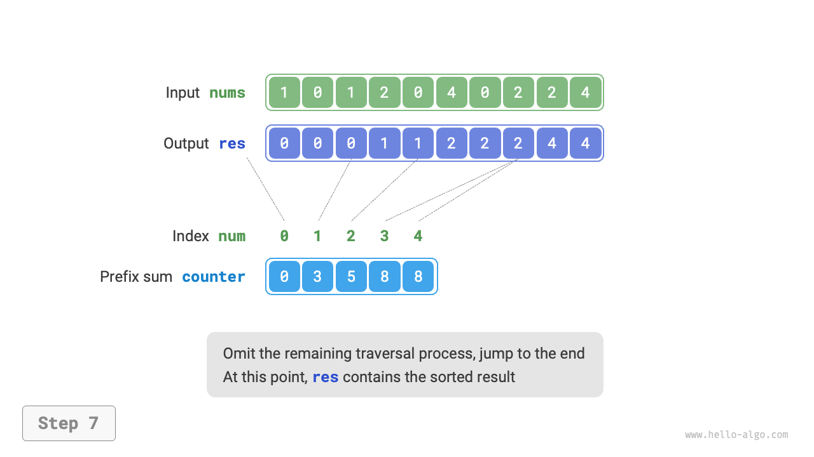
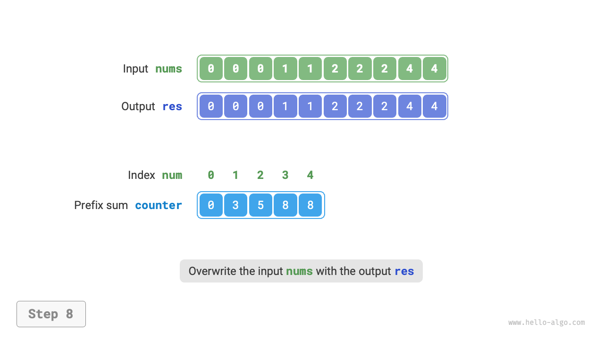

# 11.9 &nbsp; 計数ソート

<u>計数ソート（counting sort）</u>は要素数を集計することでソートを実現し、通常は整数配列に適用されます。

## 11.9.1 &nbsp; 単純な実装

まず簡単な例を見てみましょう。長さ $n$ の配列 `nums` が与えられ、その要素はすべて「非負整数」であるとします。計数ソートの全体的な流れを以下の図に示します。

1. 配列を走査し、その中の最大値を見つけて $m$ とし、続いて長さ $m + 1$ の補助配列 `counter` を作成します。
2. **`counter` を用いて `nums` 内の各数値の出現回数を集計します**。ここで `counter[num]` は数値 `num` の出現回数に対応します。集計方法は非常に簡単で、`nums` を走査し（現在の数値を `num` とする）、各回で `counter[num]` を $1$ 増やせばよいです。
3. **`counter` の各インデックスは自然に順序づけられているため、すべての数値はすでに整列された状態とみなせます**。続いて `counter` を走査し、各数値の出現回数に応じて小さい順に `nums` へ書き戻せば完了です。

{ class="animation-figure" }

<p align="center"> 図 11-16 &nbsp; 計数ソートの流れ </p>

コードは以下のとおりです：

=== "Python"

    ```python title="counting_sort.py"
    def counting_sort_naive(nums: list[int]):
        """計数ソート"""
        # 簡易版。オブジェクトのソートには使えない
        # 1. 配列の最大要素 m を求める
        m = max(nums)
        # 2. 各数値の出現回数を数える
        # counter[num] は num の出現回数を表す
        counter = [0] * (m + 1)
        for num in nums:
            counter[num] += 1
        # 3. counter を走査し、各要素を元の配列 nums に書き戻す
        i = 0
        for num in range(m + 1):
            for _ in range(counter[num]):
                nums[i] = num
                i += 1
    ```

=== "C++"

    ```cpp title="counting_sort.cpp"
    /* 計数ソート */
    // 簡易実装のため、オブジェクトのソートには使えない
    void countingSortNaive(vector<int> &nums) {
        // 1. 配列の最大要素 m を求める
        int m = 0;
        for (int num : nums) {
            m = max(m, num);
        }
        // 2. 各数値の出現回数を数える
        // counter[num] は num の出現回数を表す
        vector<int> counter(m + 1, 0);
        for (int num : nums) {
            counter[num]++;
        }
        // 3. counter を走査し、各要素を元の配列 nums に書き戻す
        int i = 0;
        for (int num = 0; num < m + 1; num++) {
            for (int j = 0; j < counter[num]; j++, i++) {
                nums[i] = num;
            }
        }
    }
    ```

=== "Java"

    ```java title="counting_sort.java"
    /* 計数ソート */
    // 簡易実装のため、オブジェクトのソートには使えない
    void countingSortNaive(int[] nums) {
        // 1. 配列の最大要素 m を求める
        int m = 0;
        for (int num : nums) {
            m = Math.max(m, num);
        }
        // 2. 各数値の出現回数を数える
        // counter[num] は num の出現回数を表す
        int[] counter = new int[m + 1];
        for (int num : nums) {
            counter[num]++;
        }
        // 3. counter を走査し、各要素を元の配列 nums に書き戻す
        int i = 0;
        for (int num = 0; num < m + 1; num++) {
            for (int j = 0; j < counter[num]; j++, i++) {
                nums[i] = num;
            }
        }
    }
    ```

=== "C#"

    ```csharp title="counting_sort.cs"
    /* 計数ソート */
    // 簡易実装のため、オブジェクトのソートには使えない
    void CountingSortNaive(int[] nums) {
        // 1. 配列の最大要素 m を求める
        int m = 0;
        foreach (int num in nums) {
            m = Math.Max(m, num);
        }
        // 2. 各数値の出現回数を数える
        // counter[num] は num の出現回数を表す
        int[] counter = new int[m + 1];
        foreach (int num in nums) {
            counter[num]++;
        }
        // 3. counter を走査し、各要素を元の配列 nums に書き戻す
        int i = 0;
        for (int num = 0; num < m + 1; num++) {
            for (int j = 0; j < counter[num]; j++, i++) {
                nums[i] = num;
            }
        }
    }
    ```

=== "Go"

    ```go title="counting_sort.go"
    /* 計数ソート */
    // 簡易実装のため、オブジェクトのソートには使えない
    func countingSortNaive(nums []int) {
        // 1. 配列の最大要素 m を求める
        m := 0
        for _, num := range nums {
            if num > m {
                m = num
            }
        }
        // 2. 各数値の出現回数を数える
        // counter[num] は num の出現回数を表す
        counter := make([]int, m+1)
        for _, num := range nums {
            counter[num]++
        }
        // 3. counter を走査し、各要素を元の配列 nums に書き戻す
        for i, num := 0, 0; num < m+1; num++ {
            for j := 0; j < counter[num]; j++ {
                nums[i] = num
                i++
            }
        }
    }
    ```

=== "Swift"

    ```swift title="counting_sort.swift"
    /* 計数ソート */
    // 簡易実装のため、オブジェクトのソートには使えない
    func countingSortNaive(nums: inout [Int]) {
        // 1. 配列の最大要素 m を求める
        let m = nums.max()!
        // 2. 各数値の出現回数を数える
        // counter[num] は num の出現回数を表す
        var counter = Array(repeating: 0, count: m + 1)
        for num in nums {
            counter[num] += 1
        }
        // 3. counter を走査し、各要素を元の配列 nums に書き戻す
        var i = 0
        for num in 0 ..< m + 1 {
            for _ in 0 ..< counter[num] {
                nums[i] = num
                i += 1
            }
        }
    }
    ```

=== "JS"

    ```javascript title="counting_sort.js"
    /* 計数ソート */
    // 簡易実装のため、オブジェクトのソートには使えない
    function countingSortNaive(nums) {
        // 1. 配列の最大要素 m を求める
        let m = Math.max(...nums);
        // 2. 各数値の出現回数を数える
        // counter[num] は num の出現回数を表す
        const counter = new Array(m + 1).fill(0);
        for (const num of nums) {
            counter[num]++;
        }
        // 3. counter を走査し、各要素を元の配列 nums に書き戻す
        let i = 0;
        for (let num = 0; num < m + 1; num++) {
            for (let j = 0; j < counter[num]; j++, i++) {
                nums[i] = num;
            }
        }
    }
    ```

=== "TS"

    ```typescript title="counting_sort.ts"
    /* 計数ソート */
    // 簡易実装のため、オブジェクトのソートには使えない
    function countingSortNaive(nums: number[]): void {
        // 1. 配列の最大要素 m を求める
        let m: number = Math.max(...nums);
        // 2. 各数値の出現回数を数える
        // counter[num] は num の出現回数を表す
        const counter: number[] = new Array<number>(m + 1).fill(0);
        for (const num of nums) {
            counter[num]++;
        }
        // 3. counter を走査し、各要素を元の配列 nums に書き戻す
        let i = 0;
        for (let num = 0; num < m + 1; num++) {
            for (let j = 0; j < counter[num]; j++, i++) {
                nums[i] = num;
            }
        }
    }
    ```

=== "Dart"

    ```dart title="counting_sort.dart"
    /* 計数ソート */
    // 簡易実装のため、オブジェクトのソートには使えない
    void countingSortNaive(List<int> nums) {
      // 1. 配列の最大要素 m を求める
      int m = 0;
      for (int _num in nums) {
        m = max(m, _num);
      }
      // 2. 各数値の出現回数を数える
      // counter[_num] は _num の出現回数を表す
      List<int> counter = List.filled(m + 1, 0);
      for (int _num in nums) {
        counter[_num]++;
      }
      // 3. counter を走査し、各要素を元の配列 nums に書き戻す
      int i = 0;
      for (int _num = 0; _num < m + 1; _num++) {
        for (int j = 0; j < counter[_num]; j++, i++) {
          nums[i] = _num;
        }
      }
    }
    ```

=== "Rust"

    ```rust title="counting_sort.rs"
    /* 計数ソート */
    // 簡易実装のため、オブジェクトのソートには使えない
    fn counting_sort_naive(nums: &mut [i32]) {
        // 1. 配列の最大要素 m を求める
        let m = *nums.iter().max().unwrap();
        // 2. 各数値の出現回数を数える
        // counter[num] は num の出現回数を表す
        let mut counter = vec![0; m as usize + 1];
        for &num in nums.iter() {
            counter[num as usize] += 1;
        }
        // 3. counter を走査し、各要素を元の配列 nums に書き戻す
        let mut i = 0;
        for num in 0..m + 1 {
            for _ in 0..counter[num as usize] {
                nums[i] = num;
                i += 1;
            }
        }
    }
    ```

=== "C"

    ```c title="counting_sort.c"
    /* 計数ソート */
    // 簡易実装のため、オブジェクトのソートには使えない
    void countingSortNaive(int nums[], int size) {
        // 1. 配列の最大要素 m を求める
        int m = 0;
        for (int i = 0; i < size; i++) {
            if (nums[i] > m) {
                m = nums[i];
            }
        }
        // 2. 各数値の出現回数を数える
        // counter[num] は num の出現回数を表す
        int *counter = calloc(m + 1, sizeof(int));
        for (int i = 0; i < size; i++) {
            counter[nums[i]]++;
        }
        // 3. counter を走査し、各要素を元の配列 nums に書き戻す
        int i = 0;
        for (int num = 0; num < m + 1; num++) {
            for (int j = 0; j < counter[num]; j++, i++) {
                nums[i] = num;
            }
        }
        // 4. メモリを解放する
        free(counter);
    }
    ```

=== "Kotlin"

    ```kotlin title="counting_sort.kt"
    /* 計数ソート */
    // 簡易実装のため、オブジェクトのソートには使えない
    fun countingSortNaive(nums: IntArray) {
        // 1. 配列の最大要素 m を求める
        var m = 0
        for (num in nums) {
            m = max(m, num)
        }
        // 2. 各数値の出現回数を数える
        // counter[num] は num の出現回数を表す
        val counter = IntArray(m + 1)
        for (num in nums) {
            counter[num]++
        }
        // 3. counter を走査し、各要素を元の配列 nums に書き戻す
        var i = 0
        for (num in 0..<m + 1) {
            var j = 0
            while (j < counter[num]) {
                nums[i] = num
                j++
                i++
            }
        }
    }
    ```

=== "Ruby"

    ```ruby title="counting_sort.rb"
    ### 計数ソート ###
    def counting_sort_naive(nums)
      # 簡易版。オブジェクトのソートには使えない
      # 1. 配列の最大要素 m を求める
      m = 0
      nums.each { |num| m = [m, num].max }
      # 2. 各数値の出現回数を数える
      # counter[num] は num の出現回数を表す
      counter = Array.new(m + 1, 0)
      nums.each { |num| counter[num] += 1 }
      # 3. counter を走査し、各要素を元の配列 nums に書き戻す
      i = 0
      for num in 0...(m + 1)
        (0...counter[num]).each do
          nums[i] = num
          i += 1
        end
      end
    end
    ```

??? pythontutor "コードの可視化"

    <div style="height: 549px; width: 100%;"><iframe class="pythontutor-iframe" src="https://pythontutor.com/iframe-embed.html#code=def%20counting_sort_naive%28nums%3A%20list%5Bint%5D%29%3A%0A%20%20%20%20%22%22%22%E8%A8%88%E6%95%B0%E3%82%BD%E3%83%BC%E3%83%88%22%22%22%0A%20%20%20%20%23%20%E7%B0%A1%E6%98%93%E7%89%88%E3%80%82%E3%82%AA%E3%83%96%E3%82%B8%E3%82%A7%E3%82%AF%E3%83%88%E3%81%AE%E3%82%BD%E3%83%BC%E3%83%88%E3%81%AB%E3%81%AF%E4%BD%BF%E3%81%88%E3%81%AA%E3%81%84%0A%20%20%20%20%23%201.%20%E9%85%8D%E5%88%97%E3%81%AE%E6%9C%80%E5%A4%A7%E8%A6%81%E7%B4%A0%20m%20%E3%82%92%E6%B1%82%E3%82%81%E3%82%8B%0A%20%20%20%20m%20%3D%200%0A%20%20%20%20for%20num%20in%20nums%3A%0A%20%20%20%20%20%20%20%20m%20%3D%20max%28m%2C%20num%29%0A%20%20%20%20%23%202.%20%E5%90%84%E6%95%B0%E5%80%A4%E3%81%AE%E5%87%BA%E7%8F%BE%E5%9B%9E%E6%95%B0%E3%82%92%E6%95%B0%E3%81%88%E3%82%8B%0A%20%20%20%20%23%20counter%5Bnum%5D%20%E3%81%AF%20num%20%E3%81%AE%E5%87%BA%E7%8F%BE%E5%9B%9E%E6%95%B0%E3%82%92%E8%A1%A8%E3%81%99%0A%20%20%20%20counter%20%3D%20%5B0%5D%20%2A%20%28m%20%2B%201%29%0A%20%20%20%20for%20num%20in%20nums%3A%0A%20%20%20%20%20%20%20%20counter%5Bnum%5D%20%2B%3D%201%0A%20%20%20%20%23%203.%20counter%20%E3%82%92%E8%B5%B0%E6%9F%BB%E3%81%97%E3%80%81%E5%90%84%E8%A6%81%E7%B4%A0%E3%82%92%E5%85%83%E3%81%AE%E9%85%8D%E5%88%97%20nums%20%E3%81%AB%E6%9B%B8%E3%81%8D%E6%88%BB%E3%81%99%0A%20%20%20%20i%20%3D%200%0A%20%20%20%20for%20num%20in%20range%28m%20%2B%201%29%3A%0A%20%20%20%20%20%20%20%20for%20_%20in%20range%28counter%5Bnum%5D%29%3A%0A%20%20%20%20%20%20%20%20%20%20%20%20nums%5Bi%5D%20%3D%20num%0A%20%20%20%20%20%20%20%20%20%20%20%20i%20%2B%3D%201%0A%0Aif%20__name__%20%3D%3D%20%22__main__%22%3A%0A%20%20%20%20nums%20%3D%20%5B1%2C%200%2C%201%2C%202%2C%200%2C%204%2C%200%2C%202%2C%202%2C%204%5D%0A%20%20%20%20counting_sort_naive%28nums%29%0A%20%20%20%20print%28f%22%E8%A8%88%E6%95%B0%E3%82%BD%E3%83%BC%E3%83%88%EF%BC%88%E3%82%AA%E3%83%96%E3%82%B8%E3%82%A7%E3%82%AF%E3%83%88%E3%81%AF%E3%82%BD%E3%83%BC%E3%83%88%E4%B8%8D%E5%8F%AF%EF%BC%89%E5%AE%8C%E4%BA%86%E5%BE%8C%20nums%20%3D%20%7Bnums%7D%22%29&codeDivHeight=472&codeDivWidth=350&cumulative=false&curInstr=4&heapPrimitives=nevernest&origin=opt-frontend.js&py=311&rawInputLstJSON=%5B%5D&textReferences=false"> </iframe></div>
    <div style="margin-top: 5px;"><a href="https://pythontutor.com/iframe-embed.html#code=def%20counting_sort_naive%28nums%3A%20list%5Bint%5D%29%3A%0A%20%20%20%20%22%22%22%E8%A8%88%E6%95%B0%E3%82%BD%E3%83%BC%E3%83%88%22%22%22%0A%20%20%20%20%23%20%E7%B0%A1%E6%98%93%E7%89%88%E3%80%82%E3%82%AA%E3%83%96%E3%82%B8%E3%82%A7%E3%82%AF%E3%83%88%E3%81%AE%E3%82%BD%E3%83%BC%E3%83%88%E3%81%AB%E3%81%AF%E4%BD%BF%E3%81%88%E3%81%AA%E3%81%84%0A%20%20%20%20%23%201.%20%E9%85%8D%E5%88%97%E3%81%AE%E6%9C%80%E5%A4%A7%E8%A6%81%E7%B4%A0%20m%20%E3%82%92%E6%B1%82%E3%82%81%E3%82%8B%0A%20%20%20%20m%20%3D%200%0A%20%20%20%20for%20num%20in%20nums%3A%0A%20%20%20%20%20%20%20%20m%20%3D%20max%28m%2C%20num%29%0A%20%20%20%20%23%202.%20%E5%90%84%E6%95%B0%E5%80%A4%E3%81%AE%E5%87%BA%E7%8F%BE%E5%9B%9E%E6%95%B0%E3%82%92%E6%95%B0%E3%81%88%E3%82%8B%0A%20%20%20%20%23%20counter%5Bnum%5D%20%E3%81%AF%20num%20%E3%81%AE%E5%87%BA%E7%8F%BE%E5%9B%9E%E6%95%B0%E3%82%92%E8%A1%A8%E3%81%99%0A%20%20%20%20counter%20%3D%20%5B0%5D%20%2A%20%28m%20%2B%201%29%0A%20%20%20%20for%20num%20in%20nums%3A%0A%20%20%20%20%20%20%20%20counter%5Bnum%5D%20%2B%3D%201%0A%20%20%20%20%23%203.%20counter%20%E3%82%92%E8%B5%B0%E6%9F%BB%E3%81%97%E3%80%81%E5%90%84%E8%A6%81%E7%B4%A0%E3%82%92%E5%85%83%E3%81%AE%E9%85%8D%E5%88%97%20nums%20%E3%81%AB%E6%9B%B8%E3%81%8D%E6%88%BB%E3%81%99%0A%20%20%20%20i%20%3D%200%0A%20%20%20%20for%20num%20in%20range%28m%20%2B%201%29%3A%0A%20%20%20%20%20%20%20%20for%20_%20in%20range%28counter%5Bnum%5D%29%3A%0A%20%20%20%20%20%20%20%20%20%20%20%20nums%5Bi%5D%20%3D%20num%0A%20%20%20%20%20%20%20%20%20%20%20%20i%20%2B%3D%201%0A%0Aif%20__name__%20%3D%3D%20%22__main__%22%3A%0A%20%20%20%20nums%20%3D%20%5B1%2C%200%2C%201%2C%202%2C%200%2C%204%2C%200%2C%202%2C%202%2C%204%5D%0A%20%20%20%20counting_sort_naive%28nums%29%0A%20%20%20%20print%28f%22%E8%A8%88%E6%95%B0%E3%82%BD%E3%83%BC%E3%83%88%EF%BC%88%E3%82%AA%E3%83%96%E3%82%B8%E3%82%A7%E3%82%AF%E3%83%88%E3%81%AF%E3%82%BD%E3%83%BC%E3%83%88%E4%B8%8D%E5%8F%AF%EF%BC%89%E5%AE%8C%E4%BA%86%E5%BE%8C%20nums%20%3D%20%7Bnums%7D%22%29&codeDivHeight=800&codeDivWidth=600&cumulative=false&curInstr=4&heapPrimitives=nevernest&origin=opt-frontend.js&py=311&rawInputLstJSON=%5B%5D&textReferences=false" target="_blank" rel="noopener noreferrer">全画面で見る ></a></div>

!!! note "計数ソートとバケットソートの関係"

    バケットソートの観点から見ると、計数ソートにおける計数配列 `counter` の各インデックスを 1 つのバケットとみなし、個数を数える過程を各要素を対応するバケットへ振り分ける操作とみなせます。本質的には、計数ソートは整数データにおけるバケットソートの特殊な一例です。

## 11.9.2 &nbsp; 完全な実装

注意深い読者なら、**入力データがオブジェクトである場合、上記の手順 `3.` は機能しない**ことに気づくかもしれません。入力データが商品オブジェクトであり、商品価格（クラスのメンバ変数）に基づいて商品をソートしたいとします。しかし上記のアルゴリズムが返せるのは価格のソート結果だけです。

では、元のデータのソート結果を得るにはどうすればよいのでしょうか。まず `counter` の「累積和」を計算します。名前のとおり、インデックス `i` における累積和 `prefix[i]` は、配列の先頭から `i` 番目までの要素の総和に等しくなります：

$$
\text{prefix}[i] = \sum_{j=0}^i \text{counter[j]}
$$

**累積和には明確な意味があり、`prefix[num] - 1` は要素 `num` が結果配列 `res` に最後に現れるインデックスを表します**。この情報は非常に重要で、各要素が結果配列のどの位置に現れるべきかを示してくれます。続いて元の配列 `nums` を逆順に走査し、各要素 `num` に対して各反復で次の 2 つの手順を行います。

1. `num` を配列 `res` のインデックス `prefix[num] - 1` に格納します。
2. 累積和 `prefix[num]` を $1$ 減らし、次に `num` を配置するインデックスを得ます。

走査が完了すると、配列 `res` にソート済みの結果が格納されます。最後に `res` で元の配列 `nums` を上書きすれば完了です。以下の図は完全な計数ソートの流れを示しています。

=== "<1>"
    { class="animation-figure" }

=== "<2>"
    { class="animation-figure" }

=== "<3>"
    { class="animation-figure" }

=== "<4>"
    { class="animation-figure" }

=== "<5>"
    { class="animation-figure" }

=== "<6>"
    { class="animation-figure" }

=== "<7>"
    { class="animation-figure" }

=== "<8>"
    { class="animation-figure" }

<p align="center"> 図 11-17 &nbsp; 計数ソートの手順 </p>

計数ソートの実装コードは以下のとおりです：

=== "Python"

    ```python title="counting_sort.py"
    def counting_sort(nums: list[int]):
        """計数ソート"""
        # 完全版。オブジェクトをソートでき、かつ安定ソートである
        # 1. 配列の最大要素 m を求める
        m = max(nums)
        # 2. 各数値の出現回数を数える
        # counter[num] は num の出現回数を表す
        counter = [0] * (m + 1)
        for num in nums:
            counter[num] += 1
        # 3. counter の累積和を求めて、「出現回数」を「末尾インデックス」に変換する
        # つまり counter[num]-1 は、num が res に最後に現れるインデックス
        for i in range(m):
            counter[i + 1] += counter[i]
        # 4. nums を逆順に走査し、各要素を結果配列 res に格納する
        # 結果を記録するための配列 res を初期化
        n = len(nums)
        res = [0] * n
        for i in range(n - 1, -1, -1):
            num = nums[i]
            res[counter[num] - 1] = num  # num を対応するインデックスに配置
            counter[num] -= 1  # 累積和を 1 減らして、次に num を配置するインデックスを得る
        # 結果配列 res で元の配列 nums を上書きする
        for i in range(n):
            nums[i] = res[i]
    ```

=== "C++"

    ```cpp title="counting_sort.cpp"
    /* 計数ソート */
    // 完全な実装で、オブジェクトをソートでき、かつ安定ソートである
    void countingSort(vector<int> &nums) {
        // 1. 配列の最大要素 m を求める
        int m = 0;
        for (int num : nums) {
            m = max(m, num);
        }
        // 2. 各数値の出現回数を数える
        // counter[num] は num の出現回数を表す
        vector<int> counter(m + 1, 0);
        for (int num : nums) {
            counter[num]++;
        }
        // 3. counter の累積和を求めて、「出現回数」を「末尾インデックス」に変換する
        // つまり counter[num]-1 は、num が res に最後に現れるインデックス
        for (int i = 0; i < m; i++) {
            counter[i + 1] += counter[i];
        }
        // 4. nums を逆順に走査し、各要素を結果配列 res に格納する
        // 結果を記録するための配列 res を初期化
        int n = nums.size();
        vector<int> res(n);
        for (int i = n - 1; i >= 0; i--) {
            int num = nums[i];
            res[counter[num] - 1] = num; // num を対応するインデックスに配置
            counter[num]--;              // 累積和を 1 減らして、次に num を配置するインデックスを得る
        }
        // 結果配列 res で元の配列 nums を上書きする
        nums = res;
    }
    ```

=== "Java"

    ```java title="counting_sort.java"
    /* 計数ソート */
    // 完全な実装で、オブジェクトをソートでき、かつ安定ソートである
    void countingSort(int[] nums) {
        // 1. 配列の最大要素 m を求める
        int m = 0;
        for (int num : nums) {
            m = Math.max(m, num);
        }
        // 2. 各数値の出現回数を数える
        // counter[num] は num の出現回数を表す
        int[] counter = new int[m + 1];
        for (int num : nums) {
            counter[num]++;
        }
        // 3. counter の累積和を求めて、「出現回数」を「末尾インデックス」に変換する
        // つまり counter[num]-1 は、num が res に最後に現れるインデックス
        for (int i = 0; i < m; i++) {
            counter[i + 1] += counter[i];
        }
        // 4. nums を逆順に走査し、各要素を結果配列 res に格納する
        // 結果を記録するための配列 res を初期化
        int n = nums.length;
        int[] res = new int[n];
        for (int i = n - 1; i >= 0; i--) {
            int num = nums[i];
            res[counter[num] - 1] = num; // num を対応するインデックスに配置
            counter[num]--; // 累積和を 1 減らして、次に num を配置するインデックスを得る
        }
        // 結果配列 res で元の配列 nums を上書きする
        for (int i = 0; i < n; i++) {
            nums[i] = res[i];
        }
    }
    ```

=== "C#"

    ```csharp title="counting_sort.cs"
    /* 計数ソート */
    // 完全な実装で、オブジェクトをソートでき、かつ安定ソートである
    void CountingSort(int[] nums) {
        // 1. 配列の最大要素 m を求める
        int m = 0;
        foreach (int num in nums) {
            m = Math.Max(m, num);
        }
        // 2. 各数値の出現回数を数える
        // counter[num] は num の出現回数を表す
        int[] counter = new int[m + 1];
        foreach (int num in nums) {
            counter[num]++;
        }
        // 3. counter の累積和を求めて、「出現回数」を「末尾インデックス」に変換する
        // つまり counter[num]-1 は、num が res に最後に現れるインデックス
        for (int i = 0; i < m; i++) {
            counter[i + 1] += counter[i];
        }
        // 4. nums を逆順に走査し、各要素を結果配列 res に格納する
        // 結果を記録するための配列 res を初期化
        int n = nums.Length;
        int[] res = new int[n];
        for (int i = n - 1; i >= 0; i--) {
            int num = nums[i];
            res[counter[num] - 1] = num; // num を対応するインデックスに配置
            counter[num]--; // 累積和を 1 減らして、次に num を配置するインデックスを得る
        }
        // 結果配列 res で元の配列 nums を上書きする
        for (int i = 0; i < n; i++) {
            nums[i] = res[i];
        }
    }
    ```

=== "Go"

    ```go title="counting_sort.go"
    /* 計数ソート */
    // 完全な実装で、オブジェクトをソートでき、かつ安定ソートである
    func countingSort(nums []int) {
        // 1. 配列の最大要素 m を求める
        m := 0
        for _, num := range nums {
            if num > m {
                m = num
            }
        }
        // 2. 各数値の出現回数を数える
        // counter[num] は num の出現回数を表す
        counter := make([]int, m+1)
        for _, num := range nums {
            counter[num]++
        }
        // 3. counter の累積和を求めて、「出現回数」を「末尾インデックス」に変換する
        // つまり counter[num]-1 は、num が res に最後に現れるインデックス
        for i := 0; i < m; i++ {
            counter[i+1] += counter[i]
        }
        // 4. nums を逆順に走査し、各要素を結果配列 res に格納する
        // 結果を記録するための配列 res を初期化
        n := len(nums)
        res := make([]int, n)
        for i := n - 1; i >= 0; i-- {
            num := nums[i]
            // num を対応するインデックスに配置
            res[counter[num]-1] = num
            // 累積和を 1 減らして、次に num を配置するインデックスを得る
            counter[num]--
        }
        // 結果配列 res で元の配列 nums を上書きする
        copy(nums, res)
    }
    ```

=== "Swift"

    ```swift title="counting_sort.swift"
    /* 計数ソート */
    // 完全な実装で、オブジェクトをソートでき、かつ安定ソートである
    func countingSort(nums: inout [Int]) {
        // 1. 配列の最大要素 m を求める
        let m = nums.max()!
        // 2. 各数値の出現回数を数える
        // counter[num] は num の出現回数を表す
        var counter = Array(repeating: 0, count: m + 1)
        for num in nums {
            counter[num] += 1
        }
        // 3. counter の累積和を求めて、「出現回数」を「末尾インデックス」に変換する
        // つまり counter[num]-1 は、num が res に最後に現れるインデックス
        for i in 0 ..< m {
            counter[i + 1] += counter[i]
        }
        // 4. nums を逆順に走査し、各要素を結果配列 res に格納する
        // 結果を記録するための配列 res を初期化
        var res = Array(repeating: 0, count: nums.count)
        for i in nums.indices.reversed() {
            let num = nums[i]
            res[counter[num] - 1] = num // num を対応するインデックスに配置
            counter[num] -= 1 // 累積和を 1 減らして、次に num を配置するインデックスを得る
        }
        // 結果配列 res で元の配列 nums を上書きする
        for i in nums.indices {
            nums[i] = res[i]
        }
    }
    ```

=== "JS"

    ```javascript title="counting_sort.js"
    /* 計数ソート */
    // 完全な実装で、オブジェクトをソートでき、かつ安定ソートである
    function countingSort(nums) {
        // 1. 配列の最大要素 m を求める
        let m = Math.max(...nums);
        // 2. 各数値の出現回数を数える
        // counter[num] は num の出現回数を表す
        const counter = new Array(m + 1).fill(0);
        for (const num of nums) {
            counter[num]++;
        }
        // 3. counter の累積和を求めて、「出現回数」を「末尾インデックス」に変換する
        // つまり counter[num]-1 は、num が res に最後に現れるインデックス
        for (let i = 0; i < m; i++) {
            counter[i + 1] += counter[i];
        }
        // 4. nums を逆順に走査し、各要素を結果配列 res に格納する
        // 結果を記録するための配列 res を初期化
        const n = nums.length;
        const res = new Array(n);
        for (let i = n - 1; i >= 0; i--) {
            const num = nums[i];
            res[counter[num] - 1] = num; // num を対応するインデックスに配置
            counter[num]--; // 累積和を 1 減らして、次に num を配置するインデックスを得る
        }
        // 結果配列 res で元の配列 nums を上書きする
        for (let i = 0; i < n; i++) {
            nums[i] = res[i];
        }
    }
    ```

=== "TS"

    ```typescript title="counting_sort.ts"
    /* 計数ソート */
    // 完全な実装で、オブジェクトをソートでき、かつ安定ソートである
    function countingSort(nums: number[]): void {
        // 1. 配列の最大要素 m を求める
        let m: number = Math.max(...nums);
        // 2. 各数値の出現回数を数える
        // counter[num] は num の出現回数を表す
        const counter: number[] = new Array<number>(m + 1).fill(0);
        for (const num of nums) {
            counter[num]++;
        }
        // 3. counter の累積和を求めて、「出現回数」を「末尾インデックス」に変換する
        // つまり counter[num]-1 は、num が res に最後に現れるインデックス
        for (let i = 0; i < m; i++) {
            counter[i + 1] += counter[i];
        }
        // 4. nums を逆順に走査し、各要素を結果配列 res に格納する
        // 結果を記録するための配列 res を初期化
        const n = nums.length;
        const res: number[] = new Array<number>(n);
        for (let i = n - 1; i >= 0; i--) {
            const num = nums[i];
            res[counter[num] - 1] = num; // num を対応するインデックスに配置
            counter[num]--; // 累積和を 1 減らして、次に num を配置するインデックスを得る
        }
        // 結果配列 res で元の配列 nums を上書きする
        for (let i = 0; i < n; i++) {
            nums[i] = res[i];
        }
    }
    ```

=== "Dart"

    ```dart title="counting_sort.dart"
    /* 計数ソート */
    // 完全な実装で、オブジェクトをソートでき、かつ安定ソートである
    void countingSort(List<int> nums) {
      // 1. 配列の最大要素 m を求める
      int m = 0;
      for (int _num in nums) {
        m = max(m, _num);
      }
      // 2. 各数値の出現回数を数える
      // counter[_num] は _num の出現回数を表す
      List<int> counter = List.filled(m + 1, 0);
      for (int _num in nums) {
        counter[_num]++;
      }
      // 3. counter の累積和を求め、「出現回数」を「末尾インデックス」に変換する
      // つまり counter[_num]-1 は、res において _num が最後に出現する位置のインデックスである
      for (int i = 0; i < m; i++) {
        counter[i + 1] += counter[i];
      }
      // 4. nums を逆順に走査し、各要素を結果配列 res に格納する
      // 結果を記録するための配列 res を初期化
      int n = nums.length;
      List<int> res = List.filled(n, 0);
      for (int i = n - 1; i >= 0; i--) {
        int _num = nums[i];
        res[counter[_num] - 1] = _num; // _num を対応する添字に配置
        counter[_num]--; // 累積和を 1 減らし、次に _num を配置するインデックスを得る
      }
      // 結果配列 res で元の配列 nums を上書きする
      nums.setAll(0, res);
    }
    ```

=== "Rust"

    ```rust title="counting_sort.rs"
    /* 計数ソート */
    // 完全な実装で、オブジェクトをソートでき、かつ安定ソートである
    fn counting_sort(nums: &mut [i32]) {
        // 1. 配列の最大要素 m を求める
        let m = *nums.iter().max().unwrap() as usize;
        // 2. 各数値の出現回数を数える
        // counter[num] は num の出現回数を表す
        let mut counter = vec![0; m + 1];
        for &num in nums.iter() {
            counter[num as usize] += 1;
        }
        // 3. counter の累積和を求めて、「出現回数」を「末尾インデックス」に変換する
        // つまり counter[num]-1 は、num が res に最後に現れるインデックス
        for i in 0..m {
            counter[i + 1] += counter[i];
        }
        // 4. nums を逆順に走査し、各要素を結果配列 res に格納する
        // 結果を記録するための配列 res を初期化
        let n = nums.len();
        let mut res = vec![0; n];
        for i in (0..n).rev() {
            let num = nums[i];
            res[counter[num as usize] - 1] = num; // num を対応するインデックスに配置
            counter[num as usize] -= 1; // 累積和を 1 減らして、次に num を配置するインデックスを得る
        }
        // 結果配列 res で元の配列 nums を上書きする
        nums.copy_from_slice(&res)
    }
    ```

=== "C"

    ```c title="counting_sort.c"
    /* 計数ソート */
    // 完全な実装で、オブジェクトをソートでき、かつ安定ソートである
    void countingSort(int nums[], int size) {
        // 1. 配列の最大要素 m を求める
        int m = 0;
        for (int i = 0; i < size; i++) {
            if (nums[i] > m) {
                m = nums[i];
            }
        }
        // 2. 各数値の出現回数を数える
        // counter[num] は num の出現回数を表す
        int *counter = calloc(m, sizeof(int));
        for (int i = 0; i < size; i++) {
            counter[nums[i]]++;
        }
        // 3. counter の累積和を求めて、「出現回数」を「末尾インデックス」に変換する
        // つまり counter[num]-1 は、num が res に最後に現れるインデックス
        for (int i = 0; i < m; i++) {
            counter[i + 1] += counter[i];
        }
        // 4. nums を逆順に走査し、各要素を結果配列 res に格納する
        // 結果を記録するための配列 res を初期化
        int *res = malloc(sizeof(int) * size);
        for (int i = size - 1; i >= 0; i--) {
            int num = nums[i];
            res[counter[num] - 1] = num; // num を対応するインデックスに配置
            counter[num]--;              // 累積和を 1 減らして、次に num を配置するインデックスを得る
        }
        // 結果配列 res で元の配列 nums を上書きする
        memcpy(nums, res, size * sizeof(int));
        // 5. メモリを解放する
        free(res);
        free(counter);
    }
    ```

=== "Kotlin"

    ```kotlin title="counting_sort.kt"
    /* 計数ソート */
    // 完全な実装で、オブジェクトをソートでき、かつ安定ソートである
    fun countingSort(nums: IntArray) {
        // 1. 配列の最大要素 m を求める
        var m = 0
        for (num in nums) {
            m = max(m, num)
        }
        // 2. 各数値の出現回数を数える
        // counter[num] は num の出現回数を表す
        val counter = IntArray(m + 1)
        for (num in nums) {
            counter[num]++
        }
        // 3. counter の累積和を求めて、「出現回数」を「末尾インデックス」に変換する
        // つまり counter[num]-1 は、num が res に最後に現れるインデックス
        for (i in 0..<m) {
            counter[i + 1] += counter[i]
        }
        // 4. nums を逆順に走査し、各要素を結果配列 res に格納する
        // 結果を記録するための配列 res を初期化
        val n = nums.size
        val res = IntArray(n)
        for (i in n - 1 downTo 0) {
            val num = nums[i]
            res[counter[num] - 1] = num // num を対応するインデックスに配置
            counter[num]-- // 累積和を 1 減らして、次に num を配置するインデックスを得る
        }
        // 結果配列 res で元の配列 nums を上書きする
        for (i in 0..<n) {
            nums[i] = res[i]
        }
    }
    ```

=== "Ruby"

    ```ruby title="counting_sort.rb"
    ### 計数ソート ###
    def counting_sort(nums)
      # 完全版。オブジェクトをソートでき、かつ安定ソートである
      # 1. 配列の最大要素 m を求める
      m = nums.max
      # 2. 各数値の出現回数を数える
      # counter[num] は num の出現回数を表す
      counter = Array.new(m + 1, 0)
      nums.each { |num| counter[num] += 1 }
      # 3. counter の累積和を求めて、「出現回数」を「末尾インデックス」に変換する
      # つまり counter[num]-1 は、num が res に最後に現れるインデックス
      (0...m).each { |i| counter[i + 1] += counter[i] }
      # 4. nums を逆順に走査し、各要素を結果配列 res に格納する
      # 結果を記録するための配列 res を初期化する
      n = nums.length
      res = Array.new(n, 0)
      (n - 1).downto(0).each do |i|
        num = nums[i]
        res[counter[num] - 1] = num # num を対応するインデックスに配置
        counter[num] -= 1 # 累積和を 1 減らして、次に num を配置するインデックスを得る
      end
      # 結果配列 res で元の配列 nums を上書きする
      (0...n).each { |i| nums[i] = res[i] }
    end
    ```

??? pythontutor "コードの可視化"

    <div style="height: 549px; width: 100%;"><iframe class="pythontutor-iframe" src="https://pythontutor.com/iframe-embed.html#code=def%20counting_sort%28nums%3A%20list%5Bint%5D%29%3A%0A%20%20%20%20%22%22%22%E8%A8%88%E6%95%B0%E3%82%BD%E3%83%BC%E3%83%88%22%22%22%0A%20%20%20%20%23%20%E5%AE%8C%E5%85%A8%E7%89%88%E3%80%82%E3%82%AA%E3%83%96%E3%82%B8%E3%82%A7%E3%82%AF%E3%83%88%E3%82%92%E3%82%BD%E3%83%BC%E3%83%88%E3%81%A7%E3%81%8D%E3%80%81%E3%81%8B%E3%81%A4%E5%AE%89%E5%AE%9A%E3%82%BD%E3%83%BC%E3%83%88%E3%81%A7%E3%81%82%E3%82%8B%0A%20%20%20%20%23%201.%20%E9%85%8D%E5%88%97%E3%81%AE%E6%9C%80%E5%A4%A7%E8%A6%81%E7%B4%A0%20m%20%E3%82%92%E6%B1%82%E3%82%81%E3%82%8B%0A%20%20%20%20m%20%3D%20max%28nums%29%0A%20%20%20%20%23%202.%20%E5%90%84%E6%95%B0%E5%80%A4%E3%81%AE%E5%87%BA%E7%8F%BE%E5%9B%9E%E6%95%B0%E3%82%92%E6%95%B0%E3%81%88%E3%82%8B%0A%20%20%20%20%23%20counter%5Bnum%5D%20%E3%81%AF%20num%20%E3%81%AE%E5%87%BA%E7%8F%BE%E5%9B%9E%E6%95%B0%E3%82%92%E8%A1%A8%E3%81%99%0A%20%20%20%20counter%20%3D%20%5B0%5D%20%2A%20%28m%20%2B%201%29%0A%20%20%20%20for%20num%20in%20nums%3A%0A%20%20%20%20%20%20%20%20counter%5Bnum%5D%20%2B%3D%201%0A%20%20%20%20%23%203.%20counter%20%E3%81%AE%E7%B4%AF%E7%A9%8D%E5%92%8C%E3%82%92%E6%B1%82%E3%82%81%E3%81%A6%E3%80%81%E3%80%8C%E5%87%BA%E7%8F%BE%E5%9B%9E%E6%95%B0%E3%80%8D%E3%82%92%E3%80%8C%E6%9C%AB%E5%B0%BE%E3%82%A4%E3%83%B3%E3%83%87%E3%83%83%E3%82%AF%E3%82%B9%E3%80%8D%E3%81%AB%E5%A4%89%E6%8F%9B%E3%81%99%E3%82%8B%0A%20%20%20%20%23%20%E3%81%A4%E3%81%BE%E3%82%8A%20counter%5Bnum%5D-1%20%E3%81%AF%E3%80%81num%20%E3%81%8C%20res%20%E3%81%AB%E6%9C%80%E5%BE%8C%E3%81%AB%E7%8F%BE%E3%82%8C%E3%82%8B%E3%82%A4%E3%83%B3%E3%83%87%E3%83%83%E3%82%AF%E3%82%B9%0A%20%20%20%20for%20i%20in%20range%28m%29%3A%0A%20%20%20%20%20%20%20%20counter%5Bi%20%2B%201%5D%20%2B%3D%20counter%5Bi%5D%0A%20%20%20%20%23%204.%20nums%20%E3%82%92%E9%80%86%E9%A0%86%E3%81%AB%E8%B5%B0%E6%9F%BB%E3%81%97%E3%80%81%E5%90%84%E8%A6%81%E7%B4%A0%E3%82%92%E7%B5%90%E6%9E%9C%E9%85%8D%E5%88%97%20res%20%E3%81%AB%E6%A0%BC%E7%B4%8D%E3%81%99%E3%82%8B%0A%20%20%20%20%23%20%E7%B5%90%E6%9E%9C%E3%82%92%E8%A8%98%E9%8C%B2%E3%81%99%E3%82%8B%E3%81%9F%E3%82%81%E3%81%AE%E9%85%8D%E5%88%97%20res%20%E3%82%92%E5%88%9D%E6%9C%9F%E5%8C%96%0A%20%20%20%20n%20%3D%20len%28nums%29%0A%20%20%20%20res%20%3D%20%5B0%5D%20%2A%20n%0A%20%20%20%20for%20i%20in%20range%28n%20-%201%2C%20-1%2C%20-1%29%3A%0A%20%20%20%20%20%20%20%20num%20%3D%20nums%5Bi%5D%0A%20%20%20%20%20%20%20%20res%5Bcounter%5Bnum%5D%20-%201%5D%20%3D%20num%20%20%23%20num%20%E3%82%92%E5%AF%BE%E5%BF%9C%E3%81%99%E3%82%8B%E3%82%A4%E3%83%B3%E3%83%87%E3%83%83%E3%82%AF%E3%82%B9%E3%81%AB%E9%85%8D%E7%BD%AE%0A%20%20%20%20%20%20%20%20counter%5Bnum%5D%20-%3D%201%20%20%23%20%E7%B4%AF%E7%A9%8D%E5%92%8C%E3%82%92%201%20%E6%B8%9B%E3%82%89%E3%81%97%E3%81%A6%E3%80%81%E6%AC%A1%E3%81%AB%20num%20%E3%82%92%E9%85%8D%E7%BD%AE%E3%81%99%E3%82%8B%E3%82%A4%E3%83%B3%E3%83%87%E3%83%83%E3%82%AF%E3%82%B9%E3%82%92%E5%BE%97%E3%82%8B%0A%20%20%20%20%23%20%E7%B5%90%E6%9E%9C%E9%85%8D%E5%88%97%20res%20%E3%81%A7%E5%85%83%E3%81%AE%E9%85%8D%E5%88%97%20nums%20%E3%82%92%E4%B8%8A%E6%9B%B8%E3%81%8D%E3%81%99%E3%82%8B%0A%20%20%20%20for%20i%20in%20range%28n%29%3A%0A%20%20%20%20%20%20%20%20nums%5Bi%5D%20%3D%20res%5Bi%5D%0A%0Aif%20__name__%20%3D%3D%20%22__main__%22%3A%0A%20%20%20%20nums%20%3D%20%5B1%2C%200%2C%201%2C%202%2C%200%2C%204%2C%200%2C%202%2C%202%2C%204%5D%0A%20%20%20%20counting_sort%28nums%29%0A%20%20%20%20print%28f%22%E3%82%AB%E3%82%A6%E3%83%B3%E3%83%88%E3%82%BD%E3%83%BC%E3%83%88%E5%AE%8C%E4%BA%86%E5%BE%8C%20nums%20%3D%20%7Bnums%7D%22%29&codeDivHeight=472&codeDivWidth=350&cumulative=false&curInstr=4&heapPrimitives=nevernest&origin=opt-frontend.js&py=311&rawInputLstJSON=%5B%5D&textReferences=false"> </iframe></div>
    <div style="margin-top: 5px;"><a href="https://pythontutor.com/iframe-embed.html#code=def%20counting_sort%28nums%3A%20list%5Bint%5D%29%3A%0A%20%20%20%20%22%22%22%E8%A8%88%E6%95%B0%E3%82%BD%E3%83%BC%E3%83%88%22%22%22%0A%20%20%20%20%23%20%E5%AE%8C%E5%85%A8%E7%89%88%E3%80%82%E3%82%AA%E3%83%96%E3%82%B8%E3%82%A7%E3%82%AF%E3%83%88%E3%82%92%E3%82%BD%E3%83%BC%E3%83%88%E3%81%A7%E3%81%8D%E3%80%81%E3%81%8B%E3%81%A4%E5%AE%89%E5%AE%9A%E3%82%BD%E3%83%BC%E3%83%88%E3%81%A7%E3%81%82%E3%82%8B%0A%20%20%20%20%23%201.%20%E9%85%8D%E5%88%97%E3%81%AE%E6%9C%80%E5%A4%A7%E8%A6%81%E7%B4%A0%20m%20%E3%82%92%E6%B1%82%E3%82%81%E3%82%8B%0A%20%20%20%20m%20%3D%20max%28nums%29%0A%20%20%20%20%23%202.%20%E5%90%84%E6%95%B0%E5%80%A4%E3%81%AE%E5%87%BA%E7%8F%BE%E5%9B%9E%E6%95%B0%E3%82%92%E6%95%B0%E3%81%88%E3%82%8B%0A%20%20%20%20%23%20counter%5Bnum%5D%20%E3%81%AF%20num%20%E3%81%AE%E5%87%BA%E7%8F%BE%E5%9B%9E%E6%95%B0%E3%82%92%E8%A1%A8%E3%81%99%0A%20%20%20%20counter%20%3D%20%5B0%5D%20%2A%20%28m%20%2B%201%29%0A%20%20%20%20for%20num%20in%20nums%3A%0A%20%20%20%20%20%20%20%20counter%5Bnum%5D%20%2B%3D%201%0A%20%20%20%20%23%203.%20counter%20%E3%81%AE%E7%B4%AF%E7%A9%8D%E5%92%8C%E3%82%92%E6%B1%82%E3%82%81%E3%81%A6%E3%80%81%E3%80%8C%E5%87%BA%E7%8F%BE%E5%9B%9E%E6%95%B0%E3%80%8D%E3%82%92%E3%80%8C%E6%9C%AB%E5%B0%BE%E3%82%A4%E3%83%B3%E3%83%87%E3%83%83%E3%82%AF%E3%82%B9%E3%80%8D%E3%81%AB%E5%A4%89%E6%8F%9B%E3%81%99%E3%82%8B%0A%20%20%20%20%23%20%E3%81%A4%E3%81%BE%E3%82%8A%20counter%5Bnum%5D-1%20%E3%81%AF%E3%80%81num%20%E3%81%8C%20res%20%E3%81%AB%E6%9C%80%E5%BE%8C%E3%81%AB%E7%8F%BE%E3%82%8C%E3%82%8B%E3%82%A4%E3%83%B3%E3%83%87%E3%83%83%E3%82%AF%E3%82%B9%0A%20%20%20%20for%20i%20in%20range%28m%29%3A%0A%20%20%20%20%20%20%20%20counter%5Bi%20%2B%201%5D%20%2B%3D%20counter%5Bi%5D%0A%20%20%20%20%23%204.%20nums%20%E3%82%92%E9%80%86%E9%A0%86%E3%81%AB%E8%B5%B0%E6%9F%BB%E3%81%97%E3%80%81%E5%90%84%E8%A6%81%E7%B4%A0%E3%82%92%E7%B5%90%E6%9E%9C%E9%85%8D%E5%88%97%20res%20%E3%81%AB%E6%A0%BC%E7%B4%8D%E3%81%99%E3%82%8B%0A%20%20%20%20%23%20%E7%B5%90%E6%9E%9C%E3%82%92%E8%A8%98%E9%8C%B2%E3%81%99%E3%82%8B%E3%81%9F%E3%82%81%E3%81%AE%E9%85%8D%E5%88%97%20res%20%E3%82%92%E5%88%9D%E6%9C%9F%E5%8C%96%0A%20%20%20%20n%20%3D%20len%28nums%29%0A%20%20%20%20res%20%3D%20%5B0%5D%20%2A%20n%0A%20%20%20%20for%20i%20in%20range%28n%20-%201%2C%20-1%2C%20-1%29%3A%0A%20%20%20%20%20%20%20%20num%20%3D%20nums%5Bi%5D%0A%20%20%20%20%20%20%20%20res%5Bcounter%5Bnum%5D%20-%201%5D%20%3D%20num%20%20%23%20num%20%E3%82%92%E5%AF%BE%E5%BF%9C%E3%81%99%E3%82%8B%E3%82%A4%E3%83%B3%E3%83%87%E3%83%83%E3%82%AF%E3%82%B9%E3%81%AB%E9%85%8D%E7%BD%AE%0A%20%20%20%20%20%20%20%20counter%5Bnum%5D%20-%3D%201%20%20%23%20%E7%B4%AF%E7%A9%8D%E5%92%8C%E3%82%92%201%20%E6%B8%9B%E3%82%89%E3%81%97%E3%81%A6%E3%80%81%E6%AC%A1%E3%81%AB%20num%20%E3%82%92%E9%85%8D%E7%BD%AE%E3%81%99%E3%82%8B%E3%82%A4%E3%83%B3%E3%83%87%E3%83%83%E3%82%AF%E3%82%B9%E3%82%92%E5%BE%97%E3%82%8B%0A%20%20%20%20%23%20%E7%B5%90%E6%9E%9C%E9%85%8D%E5%88%97%20res%20%E3%81%A7%E5%85%83%E3%81%AE%E9%85%8D%E5%88%97%20nums%20%E3%82%92%E4%B8%8A%E6%9B%B8%E3%81%8D%E3%81%99%E3%82%8B%0A%20%20%20%20for%20i%20in%20range%28n%29%3A%0A%20%20%20%20%20%20%20%20nums%5Bi%5D%20%3D%20res%5Bi%5D%0A%0Aif%20__name__%20%3D%3D%20%22__main__%22%3A%0A%20%20%20%20nums%20%3D%20%5B1%2C%200%2C%201%2C%202%2C%200%2C%204%2C%200%2C%202%2C%202%2C%204%5D%0A%20%20%20%20counting_sort%28nums%29%0A%20%20%20%20print%28f%22%E3%82%AB%E3%82%A6%E3%83%B3%E3%83%88%E3%82%BD%E3%83%BC%E3%83%88%E5%AE%8C%E4%BA%86%E5%BE%8C%20nums%20%3D%20%7Bnums%7D%22%29&codeDivHeight=800&codeDivWidth=600&cumulative=false&curInstr=4&heapPrimitives=nevernest&origin=opt-frontend.js&py=311&rawInputLstJSON=%5B%5D&textReferences=false" target="_blank" rel="noopener noreferrer">全画面で見る ></a></div>

## 11.9.3 &nbsp; アルゴリズムの特性

- **時間計算量は $O(n + m)$、非適応ソート** ：`nums` の走査と `counter` の走査が含まれ、いずれも線形時間です。一般には $n \gg m$ であり、時間計算量は $O(n)$ に近づきます。
- **空間計算量は $O(n + m)$、非インプレースソート**：長さがそれぞれ $n$ と $m$ の配列 `res` と `counter` を利用します。
- **安定ソート**：`res` に要素を埋める順序が「右から左」であるため、`nums` を逆順に走査することで等しい要素どうしの相対位置が変化するのを防ぎ、安定ソートを実現できます。実際には、`nums` を順方向に走査しても正しいソート結果は得られますが、その結果は安定ではありません。

## 11.9.4 &nbsp; 制約

ここまで読むと、計数ソートは非常に巧妙で、個数を数えるだけで効率的なソートを実現できると感じるかもしれません。しかし、計数ソートを利用するための前提条件は比較的厳格です。

**計数ソートは非負整数にしか適用できません**。ほかの型のデータに適用したい場合は、それらのデータを非負整数に変換でき、かつ変換の過程で要素間の相対的な大小関係が変わらないことを保証する必要があります。たとえば、負数を含む整数配列に対しては、すべての数値に定数を加えて正数へ変換し、ソート後に元へ戻すことができます。

**計数ソートはデータ量が多く、値域が小さい場合に適しています**。たとえば上記の例では $m$ が大きすぎてはならず、そうでないと過剰な空間を消費します。また、$n \ll m$ のとき、計数ソートは $O(m)$ 時間を要するため、$O(n \log n)$ のソートアルゴリズムより遅くなる可能性があります。
