# ヒープソート

!!! tip

    この節を読む前に、「ヒープ」の章を必ず完了させてください。

<u>ヒープソート</u>は、ヒープデータ構造に基づく効率的なソートアルゴリズムです。すでに学習した「ヒープの構築」と「要素の抽出」操作を使用してヒープソートを実装できます。

1. 配列を入力し、最小ヒープを構築します。ここで、最小要素がヒープの頂上に位置します。
2. 継続的に抽出操作を実行し、抽出された要素を順次記録して、最小から最大までのソート済みリストを取得します。

上記の方法は実現可能ですが、ポップされた要素を格納するための追加の配列が必要で、やや空間を消費します。実際には、通常、より優雅な実装を使用します。

## アルゴリズムの流れ

配列の長さを $n$ とすると、ヒープソートの過程は以下の通りです。

1. 配列を入力し、最大ヒープを構築します。この手順の後、最大要素がヒープの頂上に位置します。
2. ヒープの頂上要素（最初の要素）とヒープの底部要素（最後の要素）を交換します。この交換の後、ヒープの長さを $1$ 減らし、ソート済み要素の数を $1$ 増やします。
3. ヒープの頂上から開始して、上から下へのsift-down操作を実行します。sift-downの後、ヒープの性質が復元されます。
4. 手順 `2.` と `3.` を繰り返します。$n - 1$ ラウンドループして、配列のソートを完了します。

!!! tip

    実際、要素抽出操作も手順 `2.` と `3.` を含み、抽出された要素をヒープから削除する追加の手順があります。

=== "<1>"
    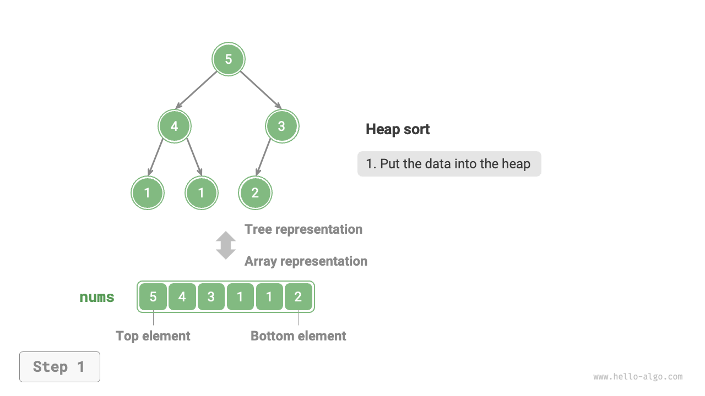

=== "<2>"
    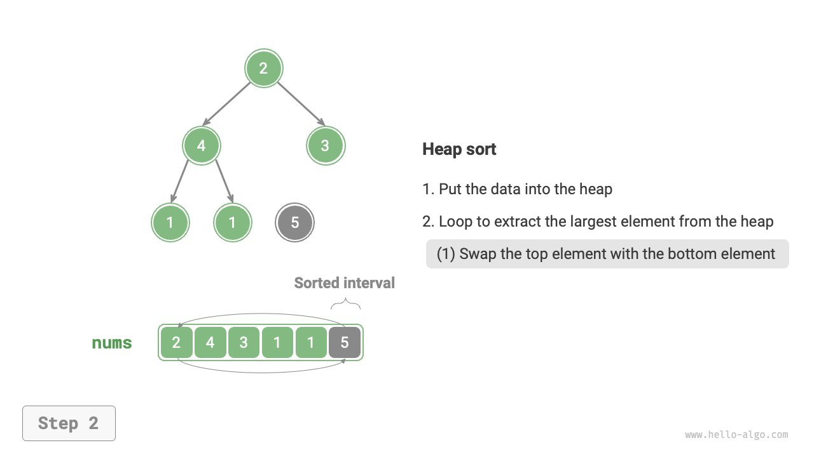

=== "<3>"
    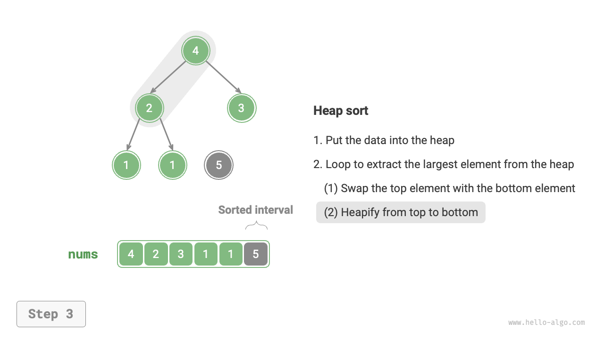

=== "<4>"
    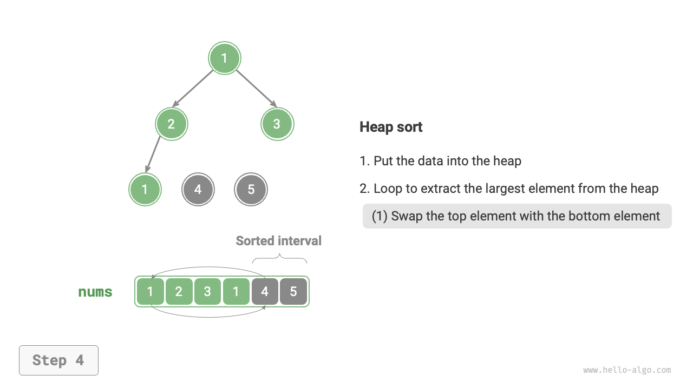

=== "<5>"
    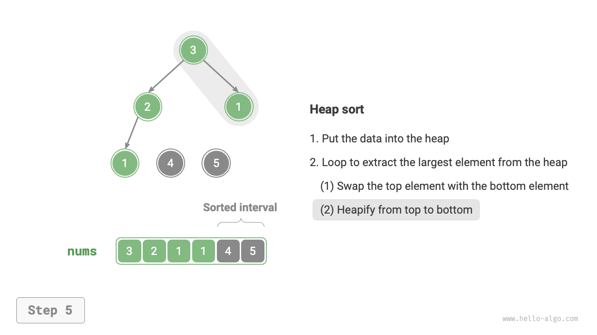

=== "<6>"
    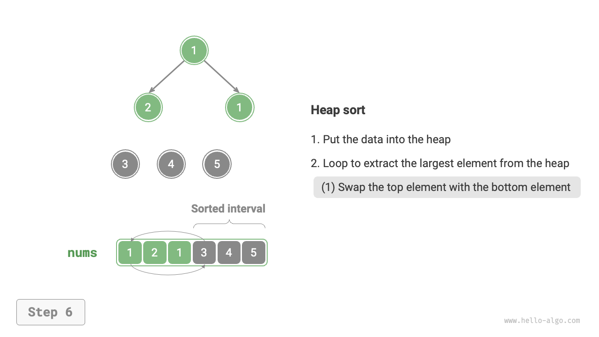

=== "<7>"
    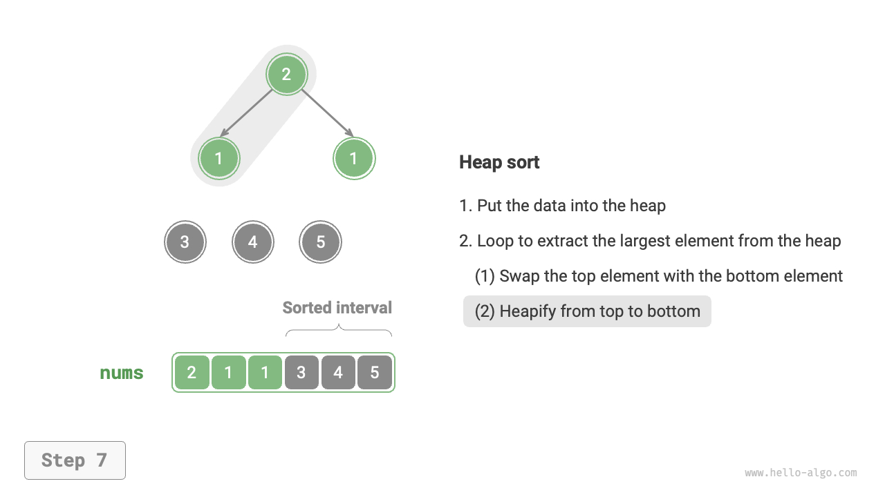

=== "<8>"
    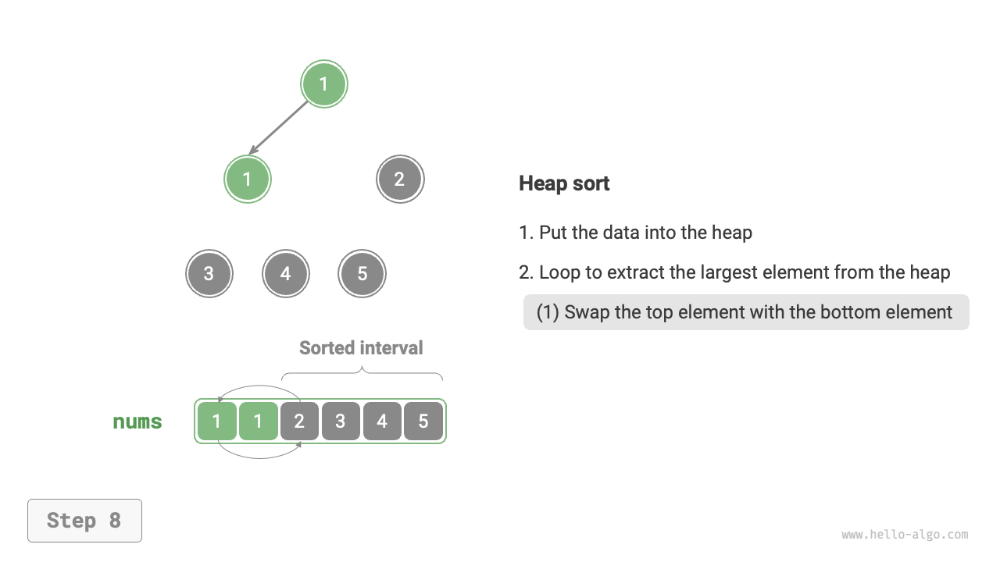

=== "<9>"
    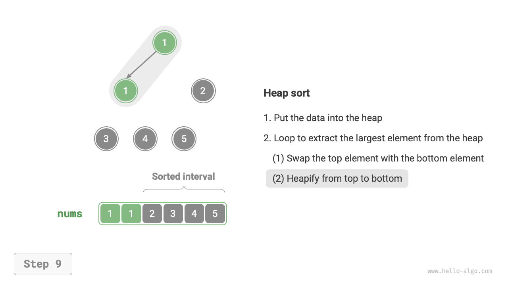

=== "<10>"
    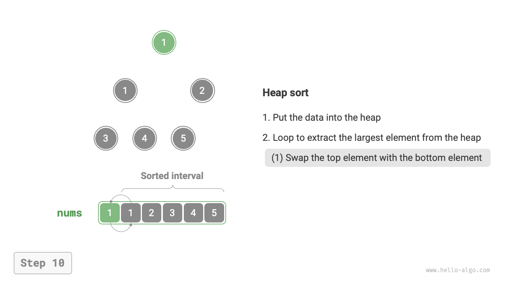

=== "<11>"
    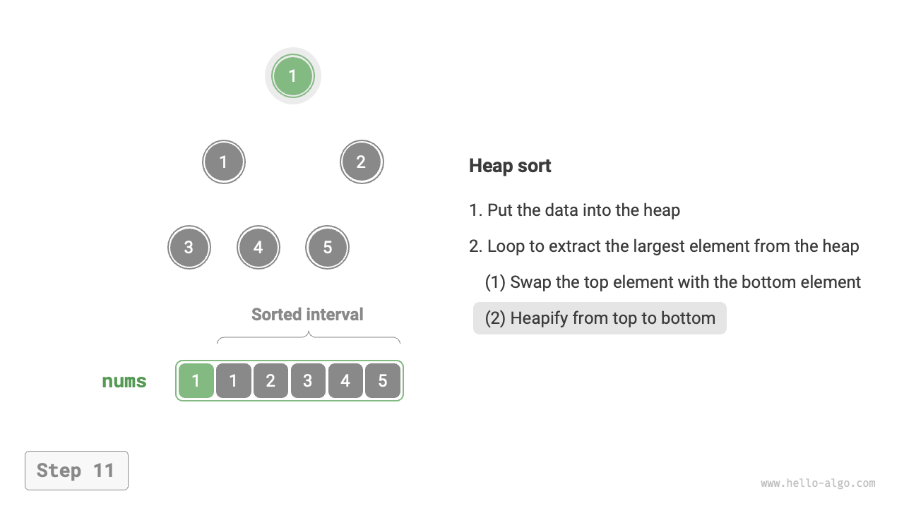

=== "<12>"
    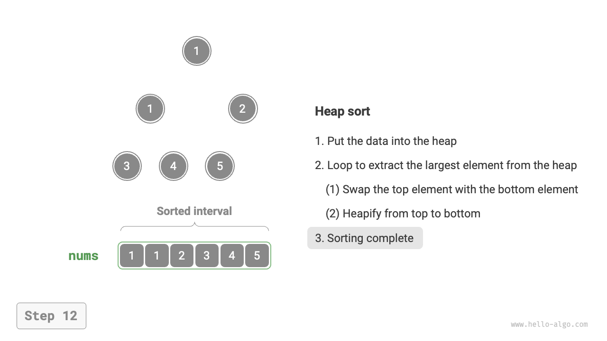

コードの実装では、「ヒープ」の章からのsift-down関数 `sift_down()` を使用しました。最大要素が抽出されるにつれてヒープの長さが減少するため、`sift_down()` 関数に長さパラメータ $n$ を追加して、ヒープの現在の有効長を指定する必要があることに注意することが重要です。コードは以下の通りです：

```src
[file]{heap_sort}-[class]{}-[func]{heap_sort}
```

## アルゴリズムの特徴

- **時間計算量は $O(n \log n)$、非適応ソート**：ヒープの構築は $O(n)$ 時間を使用します。ヒープから最大要素を抽出するには $O(\log n)$ 時間がかかり、$n - 1$ ラウンドループします。
- **空間計算量は $O(1)$、インプレースソート**：いくつかのポインタ変数が $O(1)$ 空間を使用します。要素の交換とヒープ化操作は元の配列で実行されます。
- **非安定ソート**：ヒープの頂上と底部要素の交換中に、等しい要素の相対位置が変わる可能性があります。
