# 11.7 &nbsp; ヒープソート

!!! tip

    本節を読む前に、「ヒープ」の章を学習済みであることを確認してください。

<u>ヒープソート（heap sort）</u>は、ヒープデータ構造に基づいて実装される効率的なソートアルゴリズムです。すでに学んだ「ヒープ構築操作」と「要素の取り出し操作」を利用してヒープソートを実現できます。

1. 配列を入力して最小ヒープを構築すると、このとき最小要素はヒープの頂点にあります。
2. 取り出し操作を繰り返し実行し、取り出された要素を順に記録すれば、昇順に並んだ列が得られます。

以上の方法でも実行できますが、取り出した要素を保存するために追加の配列が必要となり、空間をやや無駄にします。実際には、通常はより洗練された実装方法を用います。

## 11.7.1 &nbsp; アルゴリズムの流れ

配列の長さを $n$ とすると、ヒープソートの流れは次図のとおりです。

1. 配列を入力して最大ヒープを構築します。完了後、最大要素はヒープの頂点にあります。
2. ヒープ頂点の要素（最初の要素）とヒープ末尾の要素（最後の要素）を交換します。交換後、ヒープの長さは $1$ 減少し、整列済み要素数は $1$ 増加します。
3. ヒープ頂点の要素から始めて、上から下へヒープ化操作（sift down）を実行します。ヒープ化が完了すると、ヒープの性質が回復します。
4. 第 `2.` ステップと第 `3.` ステップを繰り返し実行します。これを $n - 1$ 回繰り返すと、配列の整列が完了します。

!!! tip

    実際には、要素の取り出し操作にも第 `2.` ステップと第 `3.` ステップが含まれており、要素を取り出す処理が 1 つ加わるだけです。

=== "<1>"
    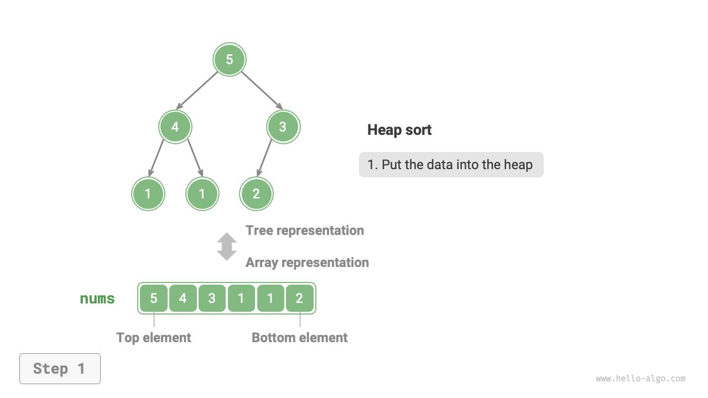{ class="animation-figure" }

=== "<2>"
    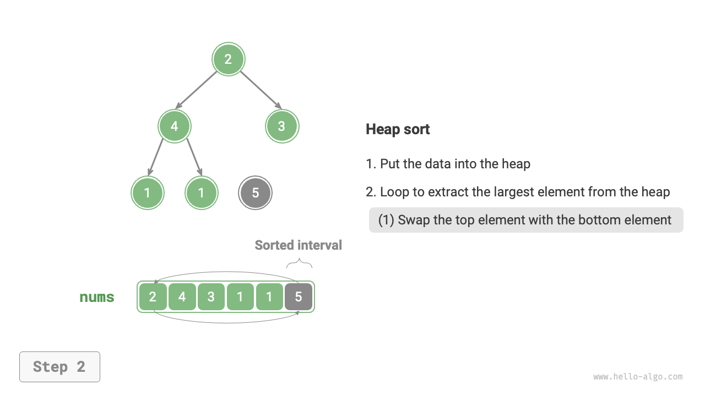{ class="animation-figure" }

=== "<3>"
    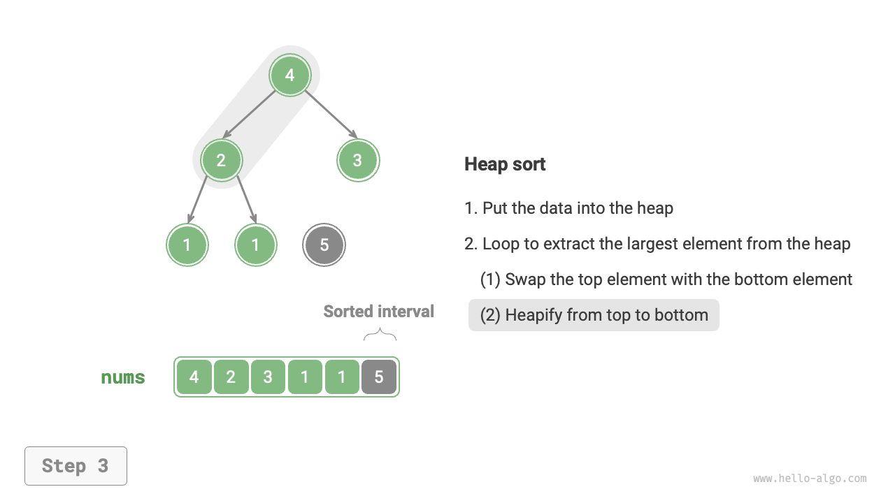{ class="animation-figure" }

=== "<4>"
    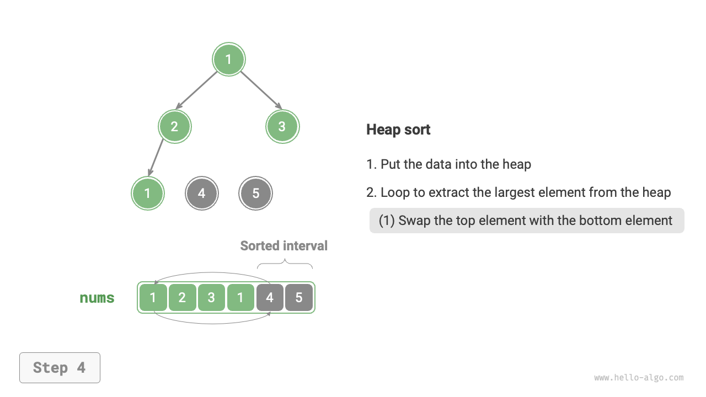{ class="animation-figure" }

=== "<5>"
    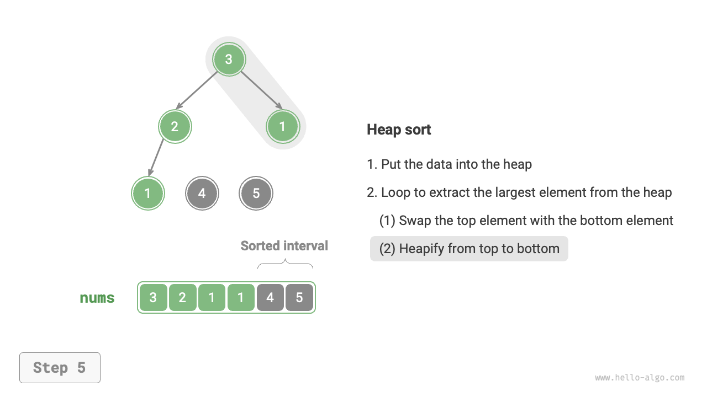{ class="animation-figure" }

=== "<6>"
    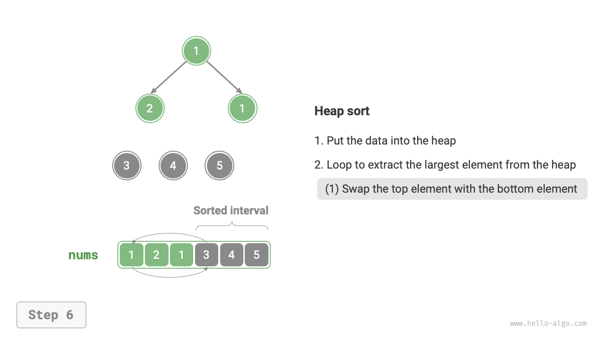{ class="animation-figure" }

=== "<7>"
    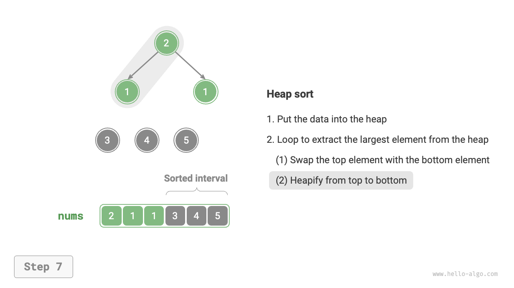{ class="animation-figure" }

=== "<8>"
    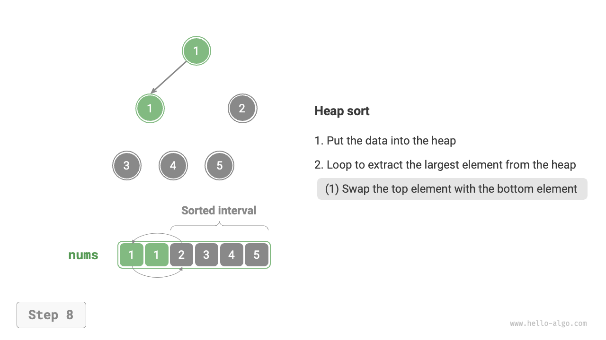{ class="animation-figure" }

=== "<9>"
    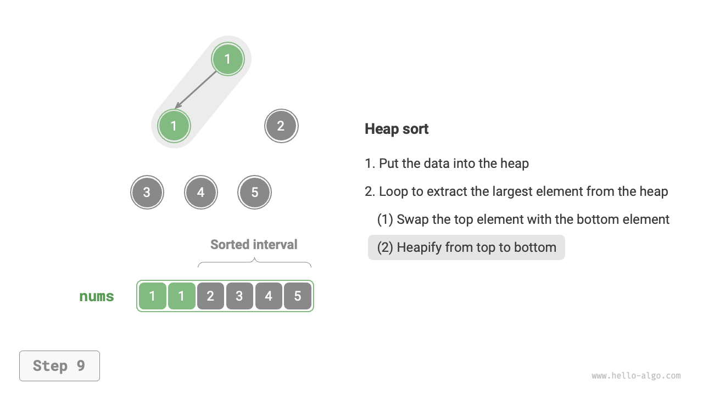{ class="animation-figure" }

=== "<10>"
    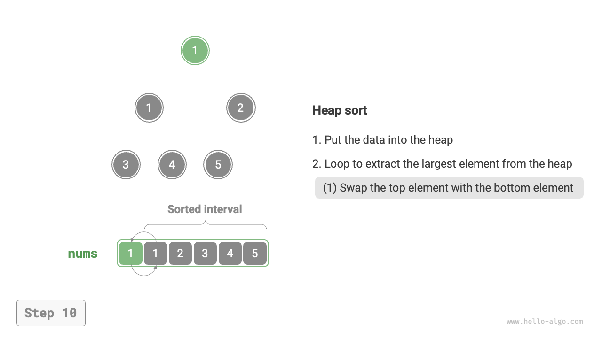{ class="animation-figure" }

=== "<11>"
    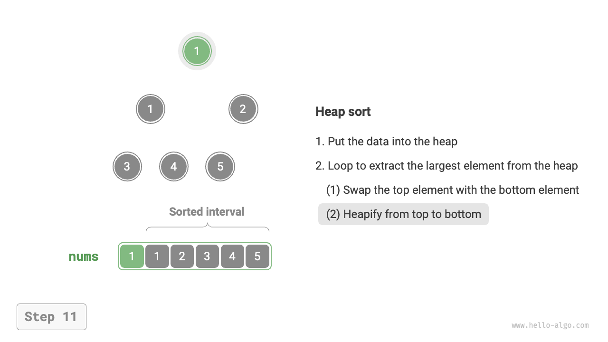{ class="animation-figure" }

=== "<12>"
    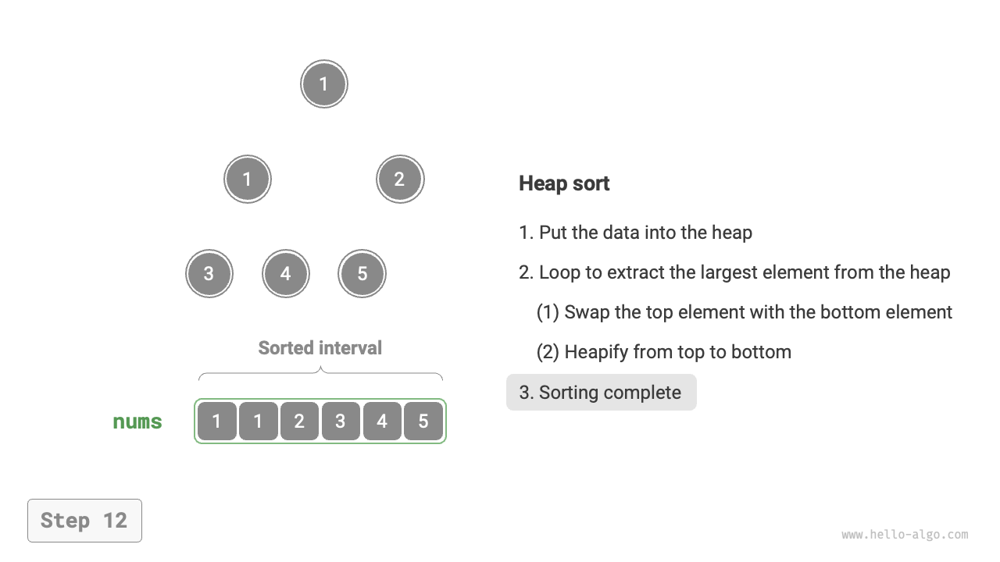{ class="animation-figure" }

<p align="center"> 図 11-12 &nbsp; ヒープソートの手順 </p>

コード実装では、「ヒープ」の章と同じ上から下へのヒープ化 `sift_down()` 関数を使用します。注意すべき点として、ヒープの長さは最大要素を取り出すたびに短くなるため、`sift_down()` 関数に長さパラメータ $n$ を追加し、ヒープの現在の有効な長さを指定する必要があります。コードは以下のとおりです。

=== "Python"

    ```python title="heap_sort.py"
    def sift_down(nums: list[int], n: int, i: int):
        """ヒープの長さは n。ノード i から下方向にヒープ化"""
        while True:
            # ノード i, l, r のうち値が最大のノードを ma とする
            l = 2 * i + 1
            r = 2 * i + 2
            ma = i
            if l < n and nums[l] > nums[ma]:
                ma = l
            if r < n and nums[r] > nums[ma]:
                ma = r
            # ノード i が最大、またはインデックス l, r が範囲外なら、ヒープ化は不要なので抜ける
            if ma == i:
                break
            # 2 つのノードを交換
            nums[i], nums[ma] = nums[ma], nums[i]
            # ループで上から下へヒープ化
            i = ma

    def heap_sort(nums: list[int]):
        """ヒープソート"""
        # ヒープ構築：葉ノード以外のすべてのノードをヒープ化する
        for i in range(len(nums) // 2 - 1, -1, -1):
            sift_down(nums, len(nums), i)
        # ヒープから最大要素を取り出し、n-1 回繰り返す
        for i in range(len(nums) - 1, 0, -1):
            # 根ノードと最も右の葉ノードを交換（先頭要素と末尾要素を交換）
            nums[0], nums[i] = nums[i], nums[0]
            # 根ノードを起点に、上から下へヒープ化
            sift_down(nums, i, 0)
    ```

=== "C++"

    ```cpp title="heap_sort.cpp"
    /* ヒープの長さは n。ノード i から下方向にヒープ化 */
    void siftDown(vector<int> &nums, int n, int i) {
        while (true) {
            // ノード i, l, r のうち値が最大のノードを ma とする
            int l = 2 * i + 1;
            int r = 2 * i + 2;
            int ma = i;
            if (l < n && nums[l] > nums[ma])
                ma = l;
            if (r < n && nums[r] > nums[ma])
                ma = r;
            // ノード i が最大、またはインデックス l, r が範囲外なら、ヒープ化は不要なので抜ける
            if (ma == i) {
                break;
            }
            // 2 つのノードを交換
            swap(nums[i], nums[ma]);
            // ループで上から下へヒープ化
            i = ma;
        }
    }

    /* ヒープソート */
    void heapSort(vector<int> &nums) {
        // ヒープ構築：葉ノード以外のすべてのノードをヒープ化する
        for (int i = nums.size() / 2 - 1; i >= 0; --i) {
            siftDown(nums, nums.size(), i);
        }
        // ヒープから最大要素を取り出し、n-1 回繰り返す
        for (int i = nums.size() - 1; i > 0; --i) {
            // 根ノードと最も右の葉ノードを交換（先頭要素と末尾要素を交換）
            swap(nums[0], nums[i]);
            // 根ノードを起点に、上から下へヒープ化
            siftDown(nums, i, 0);
        }
    }
    ```

=== "Java"

    ```java title="heap_sort.java"
    /* ヒープの長さは n。ノード i から下方向にヒープ化 */
    void siftDown(int[] nums, int n, int i) {
        while (true) {
            // ノード i, l, r のうち値が最大のノードを ma とする
            int l = 2 * i + 1;
            int r = 2 * i + 2;
            int ma = i;
            if (l < n && nums[l] > nums[ma])
                ma = l;
            if (r < n && nums[r] > nums[ma])
                ma = r;
            // ノード i が最大、またはインデックス l, r が範囲外なら、ヒープ化は不要なので抜ける
            if (ma == i)
                break;
            // 2 つのノードを交換
            int temp = nums[i];
            nums[i] = nums[ma];
            nums[ma] = temp;
            // ループで上から下へヒープ化
            i = ma;
        }
    }

    /* ヒープソート */
    void heapSort(int[] nums) {
        // ヒープ構築：葉ノード以外のすべてのノードをヒープ化する
        for (int i = nums.length / 2 - 1; i >= 0; i--) {
            siftDown(nums, nums.length, i);
        }
        // ヒープから最大要素を取り出し、n-1 回繰り返す
        for (int i = nums.length - 1; i > 0; i--) {
            // 根ノードと最も右の葉ノードを交換（先頭要素と末尾要素を交換）
            int tmp = nums[0];
            nums[0] = nums[i];
            nums[i] = tmp;
            // 根ノードを起点に、上から下へヒープ化
            siftDown(nums, i, 0);
        }
    }
    ```

=== "C#"

    ```csharp title="heap_sort.cs"
    /* ヒープの長さは n。ノード i から下方向にヒープ化 */
    void SiftDown(int[] nums, int n, int i) {
        while (true) {
            // ノード i, l, r のうち値が最大のノードを ma とする
            int l = 2 * i + 1;
            int r = 2 * i + 2;
            int ma = i;
            if (l < n && nums[l] > nums[ma])
                ma = l;
            if (r < n && nums[r] > nums[ma])
                ma = r;
            // ノード i が最大、またはインデックス l, r が範囲外なら、ヒープ化は不要なので抜ける
            if (ma == i)
                break;
            // 2 つのノードを交換
            (nums[ma], nums[i]) = (nums[i], nums[ma]);
            // ループで上から下へヒープ化
            i = ma;
        }
    }

    /* ヒープソート */
    void HeapSort(int[] nums) {
        // ヒープ構築：葉ノード以外のすべてのノードをヒープ化する
        for (int i = nums.Length / 2 - 1; i >= 0; i--) {
            SiftDown(nums, nums.Length, i);
        }
        // ヒープから最大要素を取り出し、n-1 回繰り返す
        for (int i = nums.Length - 1; i > 0; i--) {
            // 根ノードと最も右の葉ノードを交換（先頭要素と末尾要素を交換）
            (nums[i], nums[0]) = (nums[0], nums[i]);
            // 根ノードを起点に、上から下へヒープ化
            SiftDown(nums, i, 0);
        }
    }
    ```

=== "Go"

    ```go title="heap_sort.go"
    /* ヒープの長さは n。ノード i から下方向にヒープ化 */
    func siftDown(nums *[]int, n, i int) {
        for true {
            // ノード i, l, r のうち値が最大のノードを ma とする
            l := 2*i + 1
            r := 2*i + 2
            ma := i
            if l < n && (*nums)[l] > (*nums)[ma] {
                ma = l
            }
            if r < n && (*nums)[r] > (*nums)[ma] {
                ma = r
            }
            // ノード i が最大、またはインデックス l, r が範囲外なら、ヒープ化は不要なので抜ける
            if ma == i {
                break
            }
            // 2 つのノードを交換
            (*nums)[i], (*nums)[ma] = (*nums)[ma], (*nums)[i]
            // ループで上から下へヒープ化
            i = ma
        }
    }

    /* ヒープソート */
    func heapSort(nums *[]int) {
        // ヒープ構築：葉ノード以外のすべてのノードをヒープ化する
        for i := len(*nums)/2 - 1; i >= 0; i-- {
            siftDown(nums, len(*nums), i)
        }
        // ヒープから最大要素を取り出し、n-1 回繰り返す
        for i := len(*nums) - 1; i > 0; i-- {
            // 根ノードと最も右の葉ノードを交換（先頭要素と末尾要素を交換）
            (*nums)[0], (*nums)[i] = (*nums)[i], (*nums)[0]
            // 根ノードを起点に、上から下へヒープ化
            siftDown(nums, i, 0)
        }
    }
    ```

=== "Swift"

    ```swift title="heap_sort.swift"
    /* ヒープの長さは n。ノード i から下方向にヒープ化 */
    func siftDown(nums: inout [Int], n: Int, i: Int) {
        var i = i
        while true {
            // ノード i, l, r のうち値が最大のノードを ma とする
            let l = 2 * i + 1
            let r = 2 * i + 2
            var ma = i
            if l < n, nums[l] > nums[ma] {
                ma = l
            }
            if r < n, nums[r] > nums[ma] {
                ma = r
            }
            // ノード i が最大、またはインデックス l, r が範囲外なら、ヒープ化は不要なので抜ける
            if ma == i {
                break
            }
            // 2 つのノードを交換
            nums.swapAt(i, ma)
            // ループで上から下へヒープ化
            i = ma
        }
    }

    /* ヒープソート */
    func heapSort(nums: inout [Int]) {
        // ヒープ構築：葉ノード以外のすべてのノードをヒープ化する
        for i in stride(from: nums.count / 2 - 1, through: 0, by: -1) {
            siftDown(nums: &nums, n: nums.count, i: i)
        }
        // ヒープから最大要素を取り出し、n-1 回繰り返す
        for i in nums.indices.dropFirst().reversed() {
            // 根ノードと最も右の葉ノードを交換（先頭要素と末尾要素を交換）
            nums.swapAt(0, i)
            // 根ノードを起点に、上から下へヒープ化
            siftDown(nums: &nums, n: i, i: 0)
        }
    }
    ```

=== "JS"

    ```javascript title="heap_sort.js"
    /* ヒープの長さは n。ノード i から下方向にヒープ化 */
    function siftDown(nums, n, i) {
        while (true) {
            // ノード i, l, r のうち値が最大のノードを ma とする
            let l = 2 * i + 1;
            let r = 2 * i + 2;
            let ma = i;
            if (l < n && nums[l] > nums[ma]) {
                ma = l;
            }
            if (r < n && nums[r] > nums[ma]) {
                ma = r;
            }
            // ノード i が最大、またはインデックス l, r が範囲外なら、ヒープ化は不要なので抜ける
            if (ma === i) {
                break;
            }
            // 2 つのノードを交換
            [nums[i], nums[ma]] = [nums[ma], nums[i]];
            // ループで上から下へヒープ化
            i = ma;
        }
    }

    /* ヒープソート */
    function heapSort(nums) {
        // ヒープ構築：葉ノード以外のすべてのノードをヒープ化する
        for (let i = Math.floor(nums.length / 2) - 1; i >= 0; i--) {
            siftDown(nums, nums.length, i);
        }
        // ヒープから最大要素を取り出し、n-1 回繰り返す
        for (let i = nums.length - 1; i > 0; i--) {
            // 根ノードと最も右の葉ノードを交換（先頭要素と末尾要素を交換）
            [nums[0], nums[i]] = [nums[i], nums[0]];
            // 根ノードを起点に、上から下へヒープ化
            siftDown(nums, i, 0);
        }
    }
    ```

=== "TS"

    ```typescript title="heap_sort.ts"
    /* ヒープの長さは n。ノード i から下方向にヒープ化 */
    function siftDown(nums: number[], n: number, i: number): void {
        while (true) {
            // ノード i, l, r のうち値が最大のノードを ma とする
            let l = 2 * i + 1;
            let r = 2 * i + 2;
            let ma = i;
            if (l < n && nums[l] > nums[ma]) {
                ma = l;
            }
            if (r < n && nums[r] > nums[ma]) {
                ma = r;
            }
            // ノード i が最大、またはインデックス l, r が範囲外なら、ヒープ化は不要なので抜ける
            if (ma === i) {
                break;
            }
            // 2 つのノードを交換
            [nums[i], nums[ma]] = [nums[ma], nums[i]];
            // ループで上から下へヒープ化
            i = ma;
        }
    }

    /* ヒープソート */
    function heapSort(nums: number[]): void {
        // ヒープ構築：葉ノード以外のすべてのノードをヒープ化する
        for (let i = Math.floor(nums.length / 2) - 1; i >= 0; i--) {
            siftDown(nums, nums.length, i);
        }
        // ヒープから最大要素を取り出し、n-1 回繰り返す
        for (let i = nums.length - 1; i > 0; i--) {
            // 根ノードと最も右の葉ノードを交換（先頭要素と末尾要素を交換）
            [nums[0], nums[i]] = [nums[i], nums[0]];
            // 根ノードを起点に、上から下へヒープ化
            siftDown(nums, i, 0);
        }
    }
    ```

=== "Dart"

    ```dart title="heap_sort.dart"
    /* ヒープの長さは n。ノード i から下方向にヒープ化 */
    void siftDown(List<int> nums, int n, int i) {
      while (true) {
        // ノード i, l, r のうち値が最大のノードを ma とする
        int l = 2 * i + 1;
        int r = 2 * i + 2;
        int ma = i;
        if (l < n && nums[l] > nums[ma]) ma = l;
        if (r < n && nums[r] > nums[ma]) ma = r;
        // ノード i が最大、またはインデックス l, r が範囲外なら、ヒープ化は不要なので抜ける
        if (ma == i) break;
        // 2 つのノードを交換
        int temp = nums[i];
        nums[i] = nums[ma];
        nums[ma] = temp;
        // ループで上から下へヒープ化
        i = ma;
      }
    }

    /* ヒープソート */
    void heapSort(List<int> nums) {
      // ヒープ構築：葉ノード以外のすべてのノードをヒープ化する
      for (int i = nums.length ~/ 2 - 1; i >= 0; i--) {
        siftDown(nums, nums.length, i);
      }
      // ヒープから最大要素を取り出し、n-1 回繰り返す
      for (int i = nums.length - 1; i > 0; i--) {
        // 根ノードと最も右の葉ノードを交換（先頭要素と末尾要素を交換）
        int tmp = nums[0];
        nums[0] = nums[i];
        nums[i] = tmp;
        // 根ノードを起点に、上から下へヒープ化
        siftDown(nums, i, 0);
      }
    }
    ```

=== "Rust"

    ```rust title="heap_sort.rs"
    /* ヒープの長さは n。ノード i から下方向にヒープ化 */
    fn sift_down(nums: &mut [i32], n: usize, mut i: usize) {
        loop {
            // ノード i, l, r のうち値が最大のノードを ma とする
            let l = 2 * i + 1;
            let r = 2 * i + 2;
            let mut ma = i;
            if l < n && nums[l] > nums[ma] {
                ma = l;
            }
            if r < n && nums[r] > nums[ma] {
                ma = r;
            }
            // ノード i が最大、またはインデックス l, r が範囲外なら、ヒープ化は不要なので抜ける
            if ma == i {
                break;
            }
            // 2 つのノードを交換
            nums.swap(i, ma);
            // ループで上から下へヒープ化
            i = ma;
        }
    }

    /* ヒープソート */
    fn heap_sort(nums: &mut [i32]) {
        // ヒープ構築：葉ノード以外のすべてのノードをヒープ化する
        for i in (0..nums.len() / 2).rev() {
            sift_down(nums, nums.len(), i);
        }
        // ヒープから最大要素を取り出し、n-1 回繰り返す
        for i in (1..nums.len()).rev() {
            // 根ノードと最も右の葉ノードを交換（先頭要素と末尾要素を交換）
            nums.swap(0, i);
            // 根ノードを起点に、上から下へヒープ化
            sift_down(nums, i, 0);
        }
    }
    ```

=== "C"

    ```c title="heap_sort.c"
    /* ヒープの長さは n。ノード i から下方向にヒープ化 */
    void siftDown(int nums[], int n, int i) {
        while (1) {
            // ノード i, l, r のうち値が最大のノードを ma とする
            int l = 2 * i + 1;
            int r = 2 * i + 2;
            int ma = i;
            if (l < n && nums[l] > nums[ma])
                ma = l;
            if (r < n && nums[r] > nums[ma])
                ma = r;
            // ノード i が最大、またはインデックス l, r が範囲外なら、ヒープ化は不要なので抜ける
            if (ma == i) {
                break;
            }
            // 2 つのノードを交換
            int temp = nums[i];
            nums[i] = nums[ma];
            nums[ma] = temp;
            // ループで上から下へヒープ化
            i = ma;
        }
    }

    /* ヒープソート */
    void heapSort(int nums[], int n) {
        // ヒープ構築：葉ノード以外のすべてのノードをヒープ化する
        for (int i = n / 2 - 1; i >= 0; --i) {
            siftDown(nums, n, i);
        }
        // ヒープから最大要素を取り出し、n-1 回繰り返す
        for (int i = n - 1; i > 0; --i) {
            // 根ノードと最も右の葉ノードを交換（先頭要素と末尾要素を交換）
            int tmp = nums[0];
            nums[0] = nums[i];
            nums[i] = tmp;
            // 根ノードを起点に、上から下へヒープ化
            siftDown(nums, i, 0);
        }
    }
    ```

=== "Kotlin"

    ```kotlin title="heap_sort.kt"
    /* ヒープの長さは n。ノード i から下方向にヒープ化 */
    fun siftDown(nums: IntArray, n: Int, li: Int) {
        var i = li
        while (true) {
            // ノード i, l, r のうち値が最大のノードを ma とする
            val l = 2 * i + 1
            val r = 2 * i + 2
            var ma = i
            if (l < n && nums[l] > nums[ma]) 
                ma = l
            if (r < n && nums[r] > nums[ma]) 
                ma = r
            // ノード i が最大、またはインデックス l, r が範囲外なら、ヒープ化は不要なので抜ける
            if (ma == i) 
                break
            // 2 つのノードを交換
            val temp = nums[i]
            nums[i] = nums[ma]
            nums[ma] = temp
            // ループで上から下へヒープ化
            i = ma
        }
    }

    /* ヒープソート */
    fun heapSort(nums: IntArray) {
        // ヒープ構築：葉ノード以外のすべてのノードをヒープ化する
        for (i in nums.size / 2 - 1 downTo 0) {
            siftDown(nums, nums.size, i)
        }
        // ヒープから最大要素を取り出し、n-1 回繰り返す
        for (i in nums.size - 1 downTo 1) {
            // 根ノードと最も右の葉ノードを交換（先頭要素と末尾要素を交換）
            val temp = nums[0]
            nums[0] = nums[i]
            nums[i] = temp
            // 根ノードを起点に、上から下へヒープ化
            siftDown(nums, i, 0)
        }
    }
    ```

=== "Ruby"

    ```ruby title="heap_sort.rb"
    ### ヒープ長 n で、ノード i から上から下へヒープ化 ###
    def sift_down(nums, n, i)
      while true
        # ノード i, l, r のうち値が最大のノードを ma とする
        l = 2 * i + 1
        r = 2 * i + 2
        ma = i
        ma = l if l < n && nums[l] > nums[ma]
        ma = r if r < n && nums[r] > nums[ma]
        # ノード i が最大、またはインデックス l, r が範囲外なら、ヒープ化は不要なので抜ける
        break if ma == i
        # 2 つのノードを交換
        nums[i], nums[ma] = nums[ma], nums[i]
        # ループで上から下へヒープ化
        i = ma
      end
    end

    ### ヒープソート ###
    def heap_sort(nums)
      # ヒープ構築：葉ノード以外のすべてのノードをヒープ化する
      (nums.length / 2 - 1).downto(0) do |i|
        sift_down(nums, nums.length, i)
      end
      # ヒープから最大要素を取り出し、n-1 回繰り返す
      (nums.length - 1).downto(1) do |i|
        # 根ノードと最も右の葉ノードを交換（先頭要素と末尾要素を交換）
        nums[0], nums[i] = nums[i], nums[0]
        # 根ノードを起点に、上から下へヒープ化
        sift_down(nums, i, 0)
      end
    end
    ```

??? pythontutor "コードの可視化"

    <div style="height: 549px; width: 100%;"><iframe class="pythontutor-iframe" src="https://pythontutor.com/iframe-embed.html#code=def%20sift_down%28nums%3A%20list%5Bint%5D%2C%20n%3A%20int%2C%20i%3A%20int%29%3A%0A%20%20%20%20%22%22%22%E3%83%92%E3%83%BC%E3%83%97%E3%81%AE%E9%95%B7%E3%81%95%E3%81%AF%20n%E3%80%82%E3%83%8E%E3%83%BC%E3%83%89%20i%20%E3%81%8B%E3%82%89%E4%B8%8B%E6%96%B9%E5%90%91%E3%81%AB%E3%83%92%E3%83%BC%E3%83%97%E5%8C%96%22%22%22%0A%20%20%20%20while%20True%3A%0A%20%20%20%20%20%20%20%20%23%20%E3%83%8E%E3%83%BC%E3%83%89%20i%2C%20l%2C%20r%20%E3%81%AE%E3%81%86%E3%81%A1%E5%80%A4%E3%81%8C%E6%9C%80%E5%A4%A7%E3%81%AE%E3%83%8E%E3%83%BC%E3%83%89%E3%82%92%20ma%20%E3%81%A8%E3%81%99%E3%82%8B%0A%20%20%20%20%20%20%20%20l%20%3D%202%20%2A%20i%20%2B%201%0A%20%20%20%20%20%20%20%20r%20%3D%202%20%2A%20i%20%2B%202%0A%20%20%20%20%20%20%20%20ma%20%3D%20i%0A%20%20%20%20%20%20%20%20if%20l%20%3C%20n%20and%20nums%5Bl%5D%20%3E%20nums%5Bma%5D%3A%0A%20%20%20%20%20%20%20%20%20%20%20%20ma%20%3D%20l%0A%20%20%20%20%20%20%20%20if%20r%20%3C%20n%20and%20nums%5Br%5D%20%3E%20nums%5Bma%5D%3A%0A%20%20%20%20%20%20%20%20%20%20%20%20ma%20%3D%20r%0A%20%20%20%20%20%20%20%20%23%20%E3%83%8E%E3%83%BC%E3%83%89%20i%20%E3%81%8C%E6%9C%80%E5%A4%A7%E3%80%81%E3%81%BE%E3%81%9F%E3%81%AF%E3%82%A4%E3%83%B3%E3%83%87%E3%83%83%E3%82%AF%E3%82%B9%20l%2C%20r%20%E3%81%8C%E7%AF%84%E5%9B%B2%E5%A4%96%E3%81%AA%E3%82%89%E3%80%81%E3%83%92%E3%83%BC%E3%83%97%E5%8C%96%E3%81%AF%E4%B8%8D%E8%A6%81%E3%81%AA%E3%81%AE%E3%81%A7%E6%8A%9C%E3%81%91%E3%82%8B%0A%20%20%20%20%20%20%20%20if%20ma%20%3D%3D%20i%3A%0A%20%20%20%20%20%20%20%20%20%20%20%20break%0A%20%20%20%20%20%20%20%20%23%202%20%E3%81%A4%E3%81%AE%E3%83%8E%E3%83%BC%E3%83%89%E3%82%92%E4%BA%A4%E6%8F%9B%0A%20%20%20%20%20%20%20%20nums%5Bi%5D%2C%20nums%5Bma%5D%20%3D%20nums%5Bma%5D%2C%20nums%5Bi%5D%0A%20%20%20%20%20%20%20%20%23%20%E3%83%AB%E3%83%BC%E3%83%97%E3%81%A7%E4%B8%8A%E3%81%8B%E3%82%89%E4%B8%8B%E3%81%B8%E3%83%92%E3%83%BC%E3%83%97%E5%8C%96%0A%20%20%20%20%20%20%20%20i%20%3D%20ma%0A%0Adef%20heap_sort%28nums%3A%20list%5Bint%5D%29%3A%0A%20%20%20%20%22%22%22%E3%83%92%E3%83%BC%E3%83%97%E3%82%BD%E3%83%BC%E3%83%88%22%22%22%0A%20%20%20%20%23%20%E3%83%92%E3%83%BC%E3%83%97%E6%A7%8B%E7%AF%89%EF%BC%9A%E8%91%89%E3%83%8E%E3%83%BC%E3%83%89%E4%BB%A5%E5%A4%96%E3%81%AE%E3%81%99%E3%81%B9%E3%81%A6%E3%81%AE%E3%83%8E%E3%83%BC%E3%83%89%E3%82%92%E3%83%92%E3%83%BC%E3%83%97%E5%8C%96%E3%81%99%E3%82%8B%0A%20%20%20%20for%20i%20in%20range%28len%28nums%29%20%2F%2F%202%20-%201%2C%20-1%2C%20-1%29%3A%0A%20%20%20%20%20%20%20%20sift_down%28nums%2C%20len%28nums%29%2C%20i%29%0A%20%20%20%20%23%20%E3%83%92%E3%83%BC%E3%83%97%E3%81%8B%E3%82%89%E6%9C%80%E5%A4%A7%E8%A6%81%E7%B4%A0%E3%82%92%E5%8F%96%E3%82%8A%E5%87%BA%E3%81%97%E3%80%81n-1%20%E5%9B%9E%E7%B9%B0%E3%82%8A%E8%BF%94%E3%81%99%0A%20%20%20%20for%20i%20in%20range%28len%28nums%29%20-%201%2C%200%2C%20-1%29%3A%0A%20%20%20%20%20%20%20%20%23%20%E6%A0%B9%E3%83%8E%E3%83%BC%E3%83%89%E3%81%A8%E6%9C%80%E3%82%82%E5%8F%B3%E3%81%AE%E8%91%89%E3%83%8E%E3%83%BC%E3%83%89%E3%82%92%E4%BA%A4%E6%8F%9B%EF%BC%88%E5%85%88%E9%A0%AD%E8%A6%81%E7%B4%A0%E3%81%A8%E6%9C%AB%E5%B0%BE%E8%A6%81%E7%B4%A0%E3%82%92%E4%BA%A4%E6%8F%9B%EF%BC%89%0A%20%20%20%20%20%20%20%20nums%5B0%5D%2C%20nums%5Bi%5D%20%3D%20nums%5Bi%5D%2C%20nums%5B0%5D%0A%20%20%20%20%20%20%20%20%23%20%E6%A0%B9%E3%83%8E%E3%83%BC%E3%83%89%E3%82%92%E8%B5%B7%E7%82%B9%E3%81%AB%E3%80%81%E4%B8%8A%E3%81%8B%E3%82%89%E4%B8%8B%E3%81%B8%E3%83%92%E3%83%BC%E3%83%97%E5%8C%96%0A%20%20%20%20%20%20%20%20sift_down%28nums%2C%20i%2C%200%29%0A%0Aif%20__name__%20%3D%3D%20%22__main__%22%3A%0A%20%20%20%20nums%20%3D%20%5B4%2C%201%2C%203%2C%201%2C%205%2C%202%5D%0A%20%20%20%20heap_sort%28nums%29%0A%20%20%20%20print%28%22%E3%83%92%E3%83%BC%E3%83%97%E3%82%BD%E3%83%BC%E3%83%88%E5%AE%8C%E4%BA%86%E5%BE%8C%20nums%20%3D%22%2C%20nums%29&codeDivHeight=472&codeDivWidth=350&cumulative=false&curInstr=5&heapPrimitives=nevernest&origin=opt-frontend.js&py=311&rawInputLstJSON=%5B%5D&textReferences=false"> </iframe></div>
    <div style="margin-top: 5px;"><a href="https://pythontutor.com/iframe-embed.html#code=def%20sift_down%28nums%3A%20list%5Bint%5D%2C%20n%3A%20int%2C%20i%3A%20int%29%3A%0A%20%20%20%20%22%22%22%E3%83%92%E3%83%BC%E3%83%97%E3%81%AE%E9%95%B7%E3%81%95%E3%81%AF%20n%E3%80%82%E3%83%8E%E3%83%BC%E3%83%89%20i%20%E3%81%8B%E3%82%89%E4%B8%8B%E6%96%B9%E5%90%91%E3%81%AB%E3%83%92%E3%83%BC%E3%83%97%E5%8C%96%22%22%22%0A%20%20%20%20while%20True%3A%0A%20%20%20%20%20%20%20%20%23%20%E3%83%8E%E3%83%BC%E3%83%89%20i%2C%20l%2C%20r%20%E3%81%AE%E3%81%86%E3%81%A1%E5%80%A4%E3%81%8C%E6%9C%80%E5%A4%A7%E3%81%AE%E3%83%8E%E3%83%BC%E3%83%89%E3%82%92%20ma%20%E3%81%A8%E3%81%99%E3%82%8B%0A%20%20%20%20%20%20%20%20l%20%3D%202%20%2A%20i%20%2B%201%0A%20%20%20%20%20%20%20%20r%20%3D%202%20%2A%20i%20%2B%202%0A%20%20%20%20%20%20%20%20ma%20%3D%20i%0A%20%20%20%20%20%20%20%20if%20l%20%3C%20n%20and%20nums%5Bl%5D%20%3E%20nums%5Bma%5D%3A%0A%20%20%20%20%20%20%20%20%20%20%20%20ma%20%3D%20l%0A%20%20%20%20%20%20%20%20if%20r%20%3C%20n%20and%20nums%5Br%5D%20%3E%20nums%5Bma%5D%3A%0A%20%20%20%20%20%20%20%20%20%20%20%20ma%20%3D%20r%0A%20%20%20%20%20%20%20%20%23%20%E3%83%8E%E3%83%BC%E3%83%89%20i%20%E3%81%8C%E6%9C%80%E5%A4%A7%E3%80%81%E3%81%BE%E3%81%9F%E3%81%AF%E3%82%A4%E3%83%B3%E3%83%87%E3%83%83%E3%82%AF%E3%82%B9%20l%2C%20r%20%E3%81%8C%E7%AF%84%E5%9B%B2%E5%A4%96%E3%81%AA%E3%82%89%E3%80%81%E3%83%92%E3%83%BC%E3%83%97%E5%8C%96%E3%81%AF%E4%B8%8D%E8%A6%81%E3%81%AA%E3%81%AE%E3%81%A7%E6%8A%9C%E3%81%91%E3%82%8B%0A%20%20%20%20%20%20%20%20if%20ma%20%3D%3D%20i%3A%0A%20%20%20%20%20%20%20%20%20%20%20%20break%0A%20%20%20%20%20%20%20%20%23%202%20%E3%81%A4%E3%81%AE%E3%83%8E%E3%83%BC%E3%83%89%E3%82%92%E4%BA%A4%E6%8F%9B%0A%20%20%20%20%20%20%20%20nums%5Bi%5D%2C%20nums%5Bma%5D%20%3D%20nums%5Bma%5D%2C%20nums%5Bi%5D%0A%20%20%20%20%20%20%20%20%23%20%E3%83%AB%E3%83%BC%E3%83%97%E3%81%A7%E4%B8%8A%E3%81%8B%E3%82%89%E4%B8%8B%E3%81%B8%E3%83%92%E3%83%BC%E3%83%97%E5%8C%96%0A%20%20%20%20%20%20%20%20i%20%3D%20ma%0A%0Adef%20heap_sort%28nums%3A%20list%5Bint%5D%29%3A%0A%20%20%20%20%22%22%22%E3%83%92%E3%83%BC%E3%83%97%E3%82%BD%E3%83%BC%E3%83%88%22%22%22%0A%20%20%20%20%23%20%E3%83%92%E3%83%BC%E3%83%97%E6%A7%8B%E7%AF%89%EF%BC%9A%E8%91%89%E3%83%8E%E3%83%BC%E3%83%89%E4%BB%A5%E5%A4%96%E3%81%AE%E3%81%99%E3%81%B9%E3%81%A6%E3%81%AE%E3%83%8E%E3%83%BC%E3%83%89%E3%82%92%E3%83%92%E3%83%BC%E3%83%97%E5%8C%96%E3%81%99%E3%82%8B%0A%20%20%20%20for%20i%20in%20range%28len%28nums%29%20%2F%2F%202%20-%201%2C%20-1%2C%20-1%29%3A%0A%20%20%20%20%20%20%20%20sift_down%28nums%2C%20len%28nums%29%2C%20i%29%0A%20%20%20%20%23%20%E3%83%92%E3%83%BC%E3%83%97%E3%81%8B%E3%82%89%E6%9C%80%E5%A4%A7%E8%A6%81%E7%B4%A0%E3%82%92%E5%8F%96%E3%82%8A%E5%87%BA%E3%81%97%E3%80%81n-1%20%E5%9B%9E%E7%B9%B0%E3%82%8A%E8%BF%94%E3%81%99%0A%20%20%20%20for%20i%20in%20range%28len%28nums%29%20-%201%2C%200%2C%20-1%29%3A%0A%20%20%20%20%20%20%20%20%23%20%E6%A0%B9%E3%83%8E%E3%83%BC%E3%83%89%E3%81%A8%E6%9C%80%E3%82%82%E5%8F%B3%E3%81%AE%E8%91%89%E3%83%8E%E3%83%BC%E3%83%89%E3%82%92%E4%BA%A4%E6%8F%9B%EF%BC%88%E5%85%88%E9%A0%AD%E8%A6%81%E7%B4%A0%E3%81%A8%E6%9C%AB%E5%B0%BE%E8%A6%81%E7%B4%A0%E3%82%92%E4%BA%A4%E6%8F%9B%EF%BC%89%0A%20%20%20%20%20%20%20%20nums%5B0%5D%2C%20nums%5Bi%5D%20%3D%20nums%5Bi%5D%2C%20nums%5B0%5D%0A%20%20%20%20%20%20%20%20%23%20%E6%A0%B9%E3%83%8E%E3%83%BC%E3%83%89%E3%82%92%E8%B5%B7%E7%82%B9%E3%81%AB%E3%80%81%E4%B8%8A%E3%81%8B%E3%82%89%E4%B8%8B%E3%81%B8%E3%83%92%E3%83%BC%E3%83%97%E5%8C%96%0A%20%20%20%20%20%20%20%20sift_down%28nums%2C%20i%2C%200%29%0A%0Aif%20__name__%20%3D%3D%20%22__main__%22%3A%0A%20%20%20%20nums%20%3D%20%5B4%2C%201%2C%203%2C%201%2C%205%2C%202%5D%0A%20%20%20%20heap_sort%28nums%29%0A%20%20%20%20print%28%22%E3%83%92%E3%83%BC%E3%83%97%E3%82%BD%E3%83%BC%E3%83%88%E5%AE%8C%E4%BA%86%E5%BE%8C%20nums%20%3D%22%2C%20nums%29&codeDivHeight=800&codeDivWidth=600&cumulative=false&curInstr=5&heapPrimitives=nevernest&origin=opt-frontend.js&py=311&rawInputLstJSON=%5B%5D&textReferences=false" target="_blank" rel="noopener noreferrer">全画面で見る ></a></div>

## 11.7.2 &nbsp; アルゴリズムの特性

- **時間計算量は $O(n \log n)$、非適応ソート**：ヒープ構築操作には $O(n)$ の時間がかかります。ヒープから最大要素を取り出す時間計算量は $O(\log n)$ であり、これを合計 $n - 1$ 回繰り返します。
- **空間計算量は $O(1)$、インプレースソート**：いくつかのポインタ変数が使う空間は $O(1)$ です。要素の交換とヒープ化操作はいずれも元の配列上で行われます。
- **非安定ソート**：ヒープ頂点の要素とヒープ末尾の要素を交換する際、等しい要素どうしの相対位置が変化する可能性があります。
