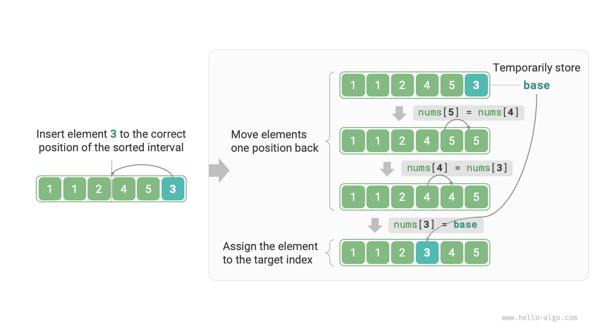
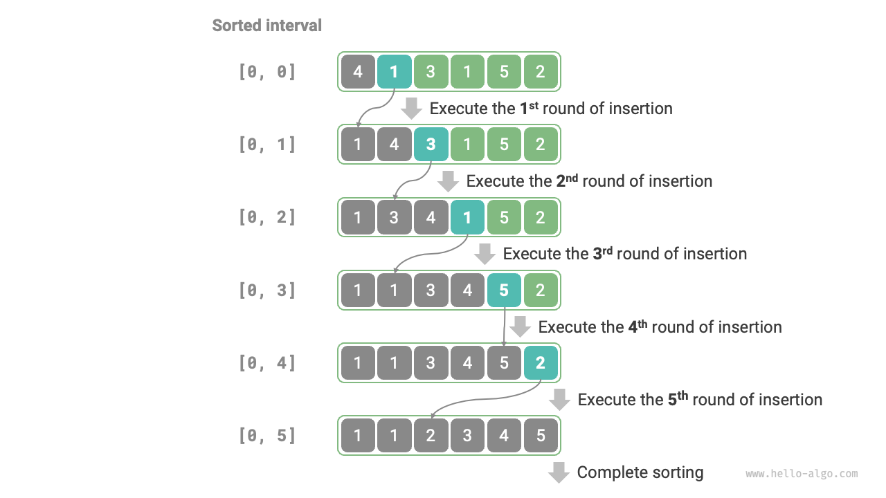

# 挿入ソート

<u>挿入ソート</u>は、トランプのデッキを手動でソートするプロセスによく似た動作をするシンプルなソートアルゴリズムです。

具体的には、未ソート区間からベース要素を選択し、その左側のソート済み区間の要素と比較して、要素を正しい位置に挿入します。

下図は、要素が配列に挿入される方法を示しています。ベース要素を`base`とすると、ターゲットインデックスから`base`までのすべての要素を右に1つずつシフトし、その後`base`をターゲットインデックスに割り当てる必要があります。



## アルゴリズムプロセス

挿入ソートの全体的なプロセスは下図に示されます。

1. 配列の最初の要素をソート済みとみなします。
2. 2番目の要素を`base`として選択し、正しい位置に挿入して、**最初の2つの要素をソート済みにします**。
3. 3番目の要素を`base`として選択し、正しい位置に挿入して、**最初の3つの要素をソート済みにします**。
4. この方法で続行し、最後の反復では、最後の要素を`base`として取り、正しい位置に挿入した後、**すべての要素がソートされます**。



コード例は以下の通りです：

```src
[file]{insertion_sort}-[class]{}-[func]{insertion_sort}
```

## アルゴリズムの特性

- **時間計算量は$O(n^2)$、適応ソート**：最悪の場合、各挿入操作には$n - 1$、$n-2$、...、$2$、$1$のループが必要で、合計は$(n - 1) n / 2$となり、時間計算量は$O(n^2)$です。順序付きデータの場合、挿入操作は早期に終了します。入力配列が完全に順序付けられている場合、挿入ソートは最良時間計算量$O(n)$を実現します。
- **空間計算量は$O(1)$、インプレースソート**：ポインタ$i$と$j$は定数量の追加空間を使用します。
- **安定ソート**：挿入操作中、等しい要素の右側に要素を挿入し、順序を変更しません。

## 挿入ソートの利点

挿入ソートの時間計算量は$O(n^2)$で、次に学習するクイックソートの時間計算量は$O(n \log n)$です。挿入ソートはより高い時間計算量を持ちますが、**小さな入力サイズでは通常より高速です**。

この結論は線形探索と二分探索の結論と似ています。時間計算量が$O(n \log n)$で分割統治戦略に基づくクイックソートなどのアルゴリズムは、多くの場合より多くの単位操作を含みます。小さな入力サイズでは、$n^2$と$n \log n$の数値は近く、計算量が支配的でなく、ラウンドあたりの単位操作数が決定的な役割を果たします。

実際、多くのプログラミング言語（Javaなど）は、組み込みソート関数内で挿入ソートを使用しています。一般的なアプローチは：長い配列に対しては、クイックソートなどの分割統治戦略に基づくソートアルゴリズムを使用し、短い配列に対しては挿入ソートを直接使用します。

バブルソート、選択ソート、挿入ソートはすべて時間計算量$O(n^2)$を持ちますが、実際には、**挿入ソートはバブルソートや選択ソートよりも一般的に使用されます**。主な理由は以下の通りです。

- バブルソートは要素交換に基づき、一時変数の使用が必要で、3つの単位操作を含みます；挿入ソートは要素代入に基づき、1つの単位操作のみが必要です。したがって、**バブルソートの計算オーバーヘッドは一般的に挿入ソートよりも高くなります**。
- 選択ソートの時間計算量は常に$O(n^2)$です。**部分的に順序付けられたデータのセットが与えられた場合、挿入ソートは通常選択ソートよりも効率的です**。
- 選択ソートは不安定で、マルチレベルソートに適用できません。
