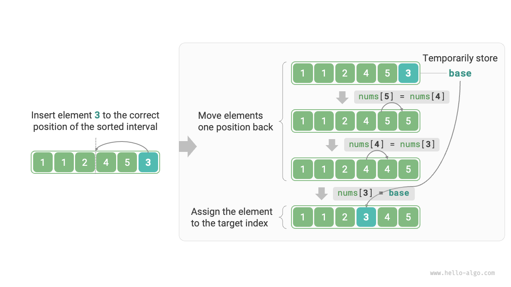
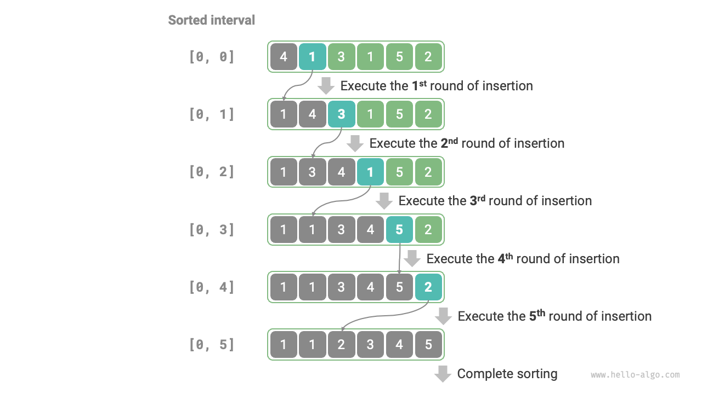

# 11.4 &nbsp; 挿入ソート

<u>挿入ソート（insertion sort）</u>は単純なソートアルゴリズムであり、その動作原理は手作業でトランプの山を整える過程と非常によく似ています。

具体的には、未ソート区間から基準要素を 1 つ選び、その要素を左側の整列済み区間の要素と 1 つずつ比較し、正しい位置に挿入します。

以下の図は、配列に要素を挿入する操作の流れを示しています。基準要素を `base` とすると、目的のインデックスから `base` までのすべての要素を 1 つずつ右に移動し、その後 `base` を目的のインデックスに代入する必要があります。

{ class="animation-figure" }

<p align="center"> 図 11-6 &nbsp; 1 回の挿入操作 </p>

## 11.4.1 &nbsp; アルゴリズムの流れ

挿入ソート全体の流れを以下の図に示します。

1. 初期状態では、配列の 1 番目の要素はすでに整列済みです。
2. 配列の 2 番目の要素を `base` として選び、正しい位置に挿入すると、**配列の先頭 2 要素が整列済み**になります。
3. 3 番目の要素を `base` として選び、正しい位置に挿入すると、**配列の先頭 3 要素が整列済み**になります。
4. このように繰り返し、最後のラウンドで最後の要素を `base` として選んで正しい位置に挿入すると、**すべての要素が整列済み**になります。

{ class="animation-figure" }

<p align="center"> 図 11-7 &nbsp; 挿入ソートの流れ </p>

コード例は以下のとおりです。

=== "Python"

    ```python title="insertion_sort.py"
    def insertion_sort(nums: list[int]):
        """挿入ソート"""
        # 外側ループ：整列済み区間は [0, i-1]
        for i in range(1, len(nums)):
            base = nums[i]
            j = i - 1
            # 内側ループ: base をソート済み区間 [0, i-1] の正しい位置に挿入する
            while j >= 0 and nums[j] > base:
                nums[j + 1] = nums[j]  # nums[j] を 1 つ右へ移動する
                j -= 1
            nums[j + 1] = base  # base を正しい位置に配置する
    ```

=== "C++"

    ```cpp title="insertion_sort.cpp"
    /* 挿入ソート */
    void insertionSort(vector<int> &nums) {
        // 外側ループ：整列済み区間は [0, i-1]
        for (int i = 1; i < nums.size(); i++) {
            int base = nums[i], j = i - 1;
            // 内側ループ: base をソート済み区間 [0, i-1] の正しい位置に挿入する
            while (j >= 0 && nums[j] > base) {
                nums[j + 1] = nums[j]; // nums[j] を 1 つ右へ移動する
                j--;
            }
            nums[j + 1] = base; // base を正しい位置に配置する
        }
    }
    ```

=== "Java"

    ```java title="insertion_sort.java"
    /* 挿入ソート */
    void insertionSort(int[] nums) {
        // 外側ループ：整列済み区間は [0, i-1]
        for (int i = 1; i < nums.length; i++) {
            int base = nums[i], j = i - 1;
            // 内側ループ: base をソート済み区間 [0, i-1] の正しい位置に挿入する
            while (j >= 0 && nums[j] > base) {
                nums[j + 1] = nums[j]; // nums[j] を 1 つ右へ移動する
                j--;
            }
            nums[j + 1] = base;        // base を正しい位置に配置する
        }
    }
    ```

=== "C#"

    ```csharp title="insertion_sort.cs"
    /* 挿入ソート */
    void InsertionSort(int[] nums) {
        // 外側ループ：整列済み区間は [0, i-1]
        for (int i = 1; i < nums.Length; i++) {
            int bas = nums[i], j = i - 1;
            // 内側ループ: base をソート済み区間 [0, i-1] の正しい位置に挿入する
            while (j >= 0 && nums[j] > bas) {
                nums[j + 1] = nums[j]; // nums[j] を 1 つ右へ移動する
                j--;
            }
            nums[j + 1] = bas;         // base を正しい位置に配置する
        }
    }
    ```

=== "Go"

    ```go title="insertion_sort.go"
    /* 挿入ソート */
    func insertionSort(nums []int) {
        // 外側ループ：整列済み区間は [0, i-1]
        for i := 1; i < len(nums); i++ {
            base := nums[i]
            j := i - 1
            // 内側ループ: base をソート済み区間 [0, i-1] の正しい位置に挿入する
            for j >= 0 && nums[j] > base {
                nums[j+1] = nums[j] // nums[j] を 1 つ右へ移動する
                j--
            }
            nums[j+1] = base // base を正しい位置に配置する
        }
    }
    ```

=== "Swift"

    ```swift title="insertion_sort.swift"
    /* 挿入ソート */
    func insertionSort(nums: inout [Int]) {
        // 外側ループ：整列済み区間は [0, i-1]
        for i in nums.indices.dropFirst() {
            let base = nums[i]
            var j = i - 1
            // 内側ループ: base をソート済み区間 [0, i-1] の正しい位置に挿入する
            while j >= 0, nums[j] > base {
                nums[j + 1] = nums[j] // nums[j] を 1 つ右へ移動する
                j -= 1
            }
            nums[j + 1] = base // base を正しい位置に配置する
        }
    }
    ```

=== "JS"

    ```javascript title="insertion_sort.js"
    /* 挿入ソート */
    function insertionSort(nums) {
        // 外側ループ：整列済み区間は [0, i-1]
        for (let i = 1; i < nums.length; i++) {
            let base = nums[i],
                j = i - 1;
            // 内側ループ: base をソート済み区間 [0, i-1] の正しい位置に挿入する
            while (j >= 0 && nums[j] > base) {
                nums[j + 1] = nums[j]; // nums[j] を 1 つ右へ移動する
                j--;
            }
            nums[j + 1] = base; // base を正しい位置に配置する
        }
    }
    ```

=== "TS"

    ```typescript title="insertion_sort.ts"
    /* 挿入ソート */
    function insertionSort(nums: number[]): void {
        // 外側ループ：整列済み区間は [0, i-1]
        for (let i = 1; i < nums.length; i++) {
            const base = nums[i];
            let j = i - 1;
            // 内側ループ: base をソート済み区間 [0, i-1] の正しい位置に挿入する
            while (j >= 0 && nums[j] > base) {
                nums[j + 1] = nums[j]; // nums[j] を 1 つ右へ移動する
                j--;
            }
            nums[j + 1] = base; // base を正しい位置に配置する
        }
    }
    ```

=== "Dart"

    ```dart title="insertion_sort.dart"
    /* 挿入ソート */
    void insertionSort(List<int> nums) {
      // 外側ループ：整列済み区間は [0, i-1]
      for (int i = 1; i < nums.length; i++) {
        int base = nums[i], j = i - 1;
        // 内側ループ: base をソート済み区間 [0, i-1] の正しい位置に挿入する
        while (j >= 0 && nums[j] > base) {
          nums[j + 1] = nums[j]; // nums[j] を 1 つ右へ移動する
          j--;
        }
        nums[j + 1] = base; // base を正しい位置に配置する
      }
    }
    ```

=== "Rust"

    ```rust title="insertion_sort.rs"
    /* 挿入ソート */
    fn insertion_sort(nums: &mut [i32]) {
        // 外側ループ：整列済み区間は [0, i-1]
        for i in 1..nums.len() {
            let (base, mut j) = (nums[i], (i - 1) as i32);
            // 内側ループ: base をソート済み区間 [0, i-1] の正しい位置に挿入する
            while j >= 0 && nums[j as usize] > base {
                nums[(j + 1) as usize] = nums[j as usize]; // nums[j] を 1 つ右へ移動する
                j -= 1;
            }
            nums[(j + 1) as usize] = base; // base を正しい位置に配置する
        }
    }
    ```

=== "C"

    ```c title="insertion_sort.c"
    /* 挿入ソート */
    void insertionSort(int nums[], int size) {
        // 外側ループ：整列済み区間は [0, i-1]
        for (int i = 1; i < size; i++) {
            int base = nums[i], j = i - 1;
            // 内側ループ: base をソート済み区間 [0, i-1] の正しい位置に挿入する
            while (j >= 0 && nums[j] > base) {
                // nums[j] を 1 つ右へ移動する
                nums[j + 1] = nums[j];
                j--;
            }
            // base を正しい位置に配置する
            nums[j + 1] = base;
        }
    }
    ```

=== "Kotlin"

    ```kotlin title="insertion_sort.kt"
    /* 挿入ソート */
    fun insertionSort(nums: IntArray) {
        // 外側ループ: ソート済み要素は 1, 2, ..., n
        for (i in nums.indices) {
            val base = nums[i]
            var j = i - 1
            // 内側ループ: base をソート済み区間 [0, i-1] の正しい位置に挿入する
            while (j >= 0 && nums[j] > base) {
                nums[j + 1] = nums[j] // nums[j] を 1 つ右へ移動する
                j--
            }
            nums[j + 1] = base        // base を正しい位置に配置する
        }
    }
    ```

=== "Ruby"

    ```ruby title="insertion_sort.rb"
    ### 挿入ソート ###
    def insertion_sort(nums)
      n = nums.length
      # 外側ループ：整列済み区間は [0, i-1]
      for i in 1...n
        base = nums[i]
        j = i - 1
        # 内側ループ: base をソート済み区間 [0, i-1] の正しい位置に挿入する
        while j >= 0 && nums[j] > base
          nums[j + 1] = nums[j] # nums[j] を 1 つ右へ移動する
          j -= 1
        end
        nums[j + 1] = base # base を正しい位置に配置する
      end
    end
    ```

??? pythontutor "コードの可視化"

    <div style="height: 495px; width: 100%;"><iframe class="pythontutor-iframe" src="https://pythontutor.com/iframe-embed.html#code=def%20insertion_sort%28nums%3A%20list%5Bint%5D%29%3A%0A%20%20%20%20%22%22%22%E6%8C%BF%E5%85%A5%E3%82%BD%E3%83%BC%E3%83%88%22%22%22%0A%20%20%20%20%23%20%E5%A4%96%E5%81%B4%E3%83%AB%E3%83%BC%E3%83%97%EF%BC%9A%E6%95%B4%E5%88%97%E6%B8%88%E3%81%BF%E5%8C%BA%E9%96%93%E3%81%AF%20%5B0%2C%20i-1%5D%0A%20%20%20%20for%20i%20in%20range%281%2C%20len%28nums%29%29%3A%0A%20%20%20%20%20%20%20%20base%20%3D%20nums%5Bi%5D%0A%20%20%20%20%20%20%20%20j%20%3D%20i%20-%201%0A%20%20%20%20%20%20%20%20%23%20%E5%86%85%E5%81%B4%E3%83%AB%E3%83%BC%E3%83%97%3A%20base%20%E3%82%92%E3%82%BD%E3%83%BC%E3%83%88%E6%B8%88%E3%81%BF%E5%8C%BA%E9%96%93%20%5B0%2C%20i-1%5D%20%E3%81%AE%E6%AD%A3%E3%81%97%E3%81%84%E4%BD%8D%E7%BD%AE%E3%81%AB%E6%8C%BF%E5%85%A5%E3%81%99%E3%82%8B%0A%20%20%20%20%20%20%20%20while%20j%20%3E%3D%200%20and%20nums%5Bj%5D%20%3E%20base%3A%0A%20%20%20%20%20%20%20%20%20%20%20%20nums%5Bj%20%2B%201%5D%20%3D%20nums%5Bj%5D%20%20%23%20nums%5Bj%5D%20%E3%82%92%201%20%E3%81%A4%E5%8F%B3%E3%81%B8%E7%A7%BB%E5%8B%95%E3%81%99%E3%82%8B%0A%20%20%20%20%20%20%20%20%20%20%20%20j%20-%3D%201%0A%20%20%20%20%20%20%20%20nums%5Bj%20%2B%201%5D%20%3D%20base%20%20%23%20base%20%E3%82%92%E6%AD%A3%E3%81%97%E3%81%84%E4%BD%8D%E7%BD%AE%E3%81%AB%E9%85%8D%E7%BD%AE%E3%81%99%E3%82%8B%0A%0A%0Aif%20__name__%20%3D%3D%20%22__main__%22%3A%0A%20%20%20%20nums%20%3D%20%5B4%2C%201%2C%203%2C%201%2C%205%2C%202%5D%0A%20%20%20%20insertion_sort%28nums%29%0A%20%20%20%20print%28%22%E6%8C%BF%E5%85%A5%E3%82%BD%E3%83%BC%E3%83%88%E5%AE%8C%E4%BA%86%E5%BE%8C%20nums%20%3D%22%2C%20nums%29&codeDivHeight=472&codeDivWidth=350&cumulative=false&curInstr=4&heapPrimitives=nevernest&origin=opt-frontend.js&py=311&rawInputLstJSON=%5B%5D&textReferences=false"> </iframe></div>
    <div style="margin-top: 5px;"><a href="https://pythontutor.com/iframe-embed.html#code=def%20insertion_sort%28nums%3A%20list%5Bint%5D%29%3A%0A%20%20%20%20%22%22%22%E6%8C%BF%E5%85%A5%E3%82%BD%E3%83%BC%E3%83%88%22%22%22%0A%20%20%20%20%23%20%E5%A4%96%E5%81%B4%E3%83%AB%E3%83%BC%E3%83%97%EF%BC%9A%E6%95%B4%E5%88%97%E6%B8%88%E3%81%BF%E5%8C%BA%E9%96%93%E3%81%AF%20%5B0%2C%20i-1%5D%0A%20%20%20%20for%20i%20in%20range%281%2C%20len%28nums%29%29%3A%0A%20%20%20%20%20%20%20%20base%20%3D%20nums%5Bi%5D%0A%20%20%20%20%20%20%20%20j%20%3D%20i%20-%201%0A%20%20%20%20%20%20%20%20%23%20%E5%86%85%E5%81%B4%E3%83%AB%E3%83%BC%E3%83%97%3A%20base%20%E3%82%92%E3%82%BD%E3%83%BC%E3%83%88%E6%B8%88%E3%81%BF%E5%8C%BA%E9%96%93%20%5B0%2C%20i-1%5D%20%E3%81%AE%E6%AD%A3%E3%81%97%E3%81%84%E4%BD%8D%E7%BD%AE%E3%81%AB%E6%8C%BF%E5%85%A5%E3%81%99%E3%82%8B%0A%20%20%20%20%20%20%20%20while%20j%20%3E%3D%200%20and%20nums%5Bj%5D%20%3E%20base%3A%0A%20%20%20%20%20%20%20%20%20%20%20%20nums%5Bj%20%2B%201%5D%20%3D%20nums%5Bj%5D%20%20%23%20nums%5Bj%5D%20%E3%82%92%201%20%E3%81%A4%E5%8F%B3%E3%81%B8%E7%A7%BB%E5%8B%95%E3%81%99%E3%82%8B%0A%20%20%20%20%20%20%20%20%20%20%20%20j%20-%3D%201%0A%20%20%20%20%20%20%20%20nums%5Bj%20%2B%201%5D%20%3D%20base%20%20%23%20base%20%E3%82%92%E6%AD%A3%E3%81%97%E3%81%84%E4%BD%8D%E7%BD%AE%E3%81%AB%E9%85%8D%E7%BD%AE%E3%81%99%E3%82%8B%0A%0A%0Aif%20__name__%20%3D%3D%20%22__main__%22%3A%0A%20%20%20%20nums%20%3D%20%5B4%2C%201%2C%203%2C%201%2C%205%2C%202%5D%0A%20%20%20%20insertion_sort%28nums%29%0A%20%20%20%20print%28%22%E6%8C%BF%E5%85%A5%E3%82%BD%E3%83%BC%E3%83%88%E5%AE%8C%E4%BA%86%E5%BE%8C%20nums%20%3D%22%2C%20nums%29&codeDivHeight=800&codeDivWidth=600&cumulative=false&curInstr=4&heapPrimitives=nevernest&origin=opt-frontend.js&py=311&rawInputLstJSON=%5B%5D&textReferences=false" target="_blank" rel="noopener noreferrer">全画面で見る ></a></div>

## 11.4.2 &nbsp; アルゴリズムの特徴

- **計算量は $O(n^2)$、適応的ソート**：最悪の場合、各挿入操作ではそれぞれ $n - 1$、$n-2$、$\dots$、$2$、$1$ 回のループが必要であり、合計は $(n - 1) n / 2$ となるため、時間計算量は $O(n^2)$ です。データが整列済みであれば、挿入操作は早期に終了します。入力配列が完全に整列済みである場合、挿入ソートは最良の時間計算量 $O(n)$ に達します。
- **空間計算量は $O(1)$、インプレースソート**：ポインタ $i$ と $j$ は定数サイズの追加領域しか使用しません。
- **安定ソート**：挿入操作の過程では、要素を等しい要素の右側に挿入するため、それらの順序は変化しません。

## 11.4.3 &nbsp; 挿入ソートの利点

挿入ソートの時間計算量は $O(n^2)$ であり、これから学ぶクイックソートの時間計算量は $O(n \log n)$ です。挿入ソートの時間計算量のほうが大きいにもかかわらず、**データ量が小さい場合には、挿入ソートのほうが通常は高速**です。

この結論は、線形探索と二分探索の適用条件に関する結論と似ています。クイックソートのような $O(n \log n)$ のアルゴリズムは分割統治法に基づくソートアルゴリズムであり、一般により多くの基本演算を含みます。一方、データ量が小さい場合は、$n^2$ と $n \log n$ の値は比較的近く、計算量が支配的ではなくなり、各ラウンドにおける基本演算の回数が決定的な役割を果たします。

実際、多くのプログラミング言語（たとえば Java）の組み込みソート関数では挿入ソートが採用されており、その大まかな考え方は次のとおりです。長い配列にはクイックソートなどの分割統治法に基づくソートアルゴリズムを使い、短い配列には直接挿入ソートを使います。

バブルソート、選択ソート、挿入ソートはいずれも時間計算量が $O(n^2)$ ですが、実際には、**挿入ソートはバブルソートや選択ソートよりもはるかに高い頻度で使われます**。主な理由は次のとおりです。

- バブルソートは要素の交換によって実装され、1 つの一時変数を必要とするため、合計で 3 回の基本演算が関わります。これに対して、挿入ソートは要素の代入に基づいており、必要な基本演算は 1 回だけです。したがって、**バブルソートの計算コストは通常、挿入ソートより高くなります**。
- 選択ソートの時間計算量はどのような場合でも $O(n^2)$ です。**部分的に整列されたデータが与えられた場合、挿入ソートは通常、選択ソートより効率的**です。
- 選択ソートは安定ではないため、多段ソートには適用できません。
