# マージソート

<u>マージソート</u>は分割統治戦略に基づくソートアルゴリズムで、下図に示す「分割」と「マージ」フェーズを含みます。

1. **分割フェーズ**：中点から配列を再帰的に分割し、長い配列のソート問題をより短い配列に変換します。
2. **マージフェーズ**：サブ配列の長さが1になったときに分割を停止し、その後マージを開始します。2つの短いソート済み配列を連続的により長いソート済み配列にマージし、プロセスが完了するまで続行します。

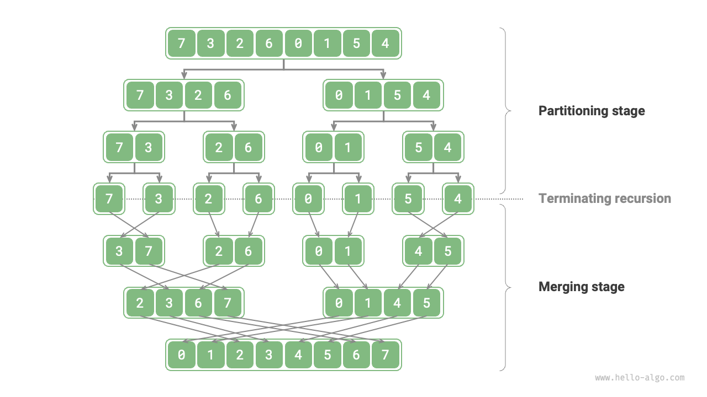

## アルゴリズムワークフロー

下図に示すように、「分割フェーズ」は中点から配列を上から下に2つのサブ配列に再帰的に分割します。

1. 中点`mid`を計算し、左サブ配列（区間`[left, mid]`）と右サブ配列（区間`[mid + 1, right]`）を再帰的に分割します。
2. サブ配列の長さが1になるまでステップ`1.`を再帰的に続行し、その後停止します。

「マージフェーズ」は左と右のサブ配列を下から上にソート済み配列に結合します。重要なのは、マージが長さ1のサブ配列から開始され、マージフェーズ中に各サブ配列がソートされることです。

=== "<1>"
    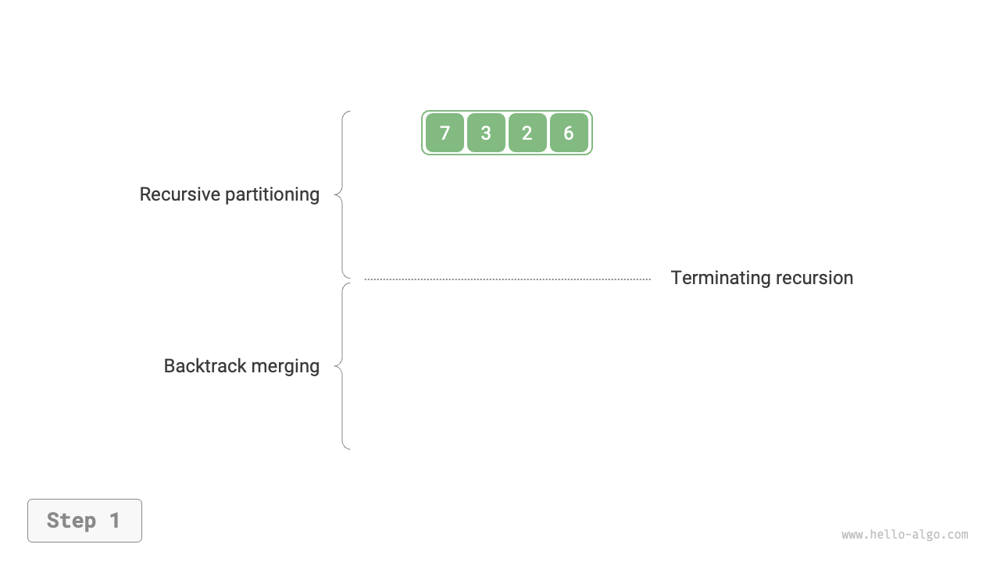

=== "<2>"
    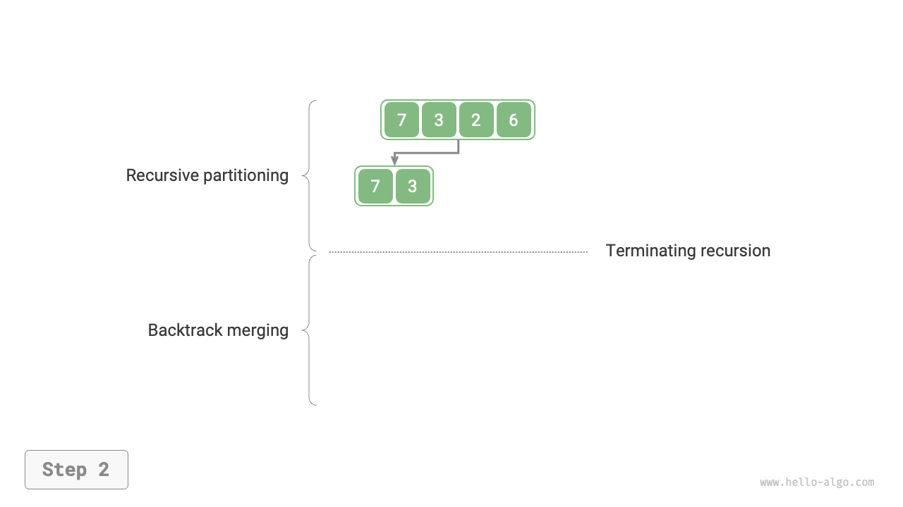

=== "<3>"
    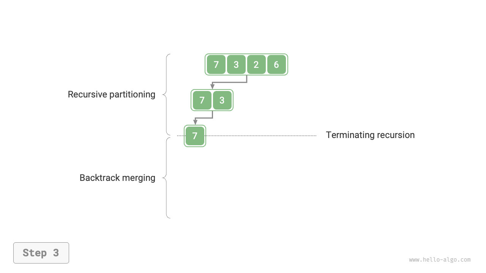

=== "<4>"
    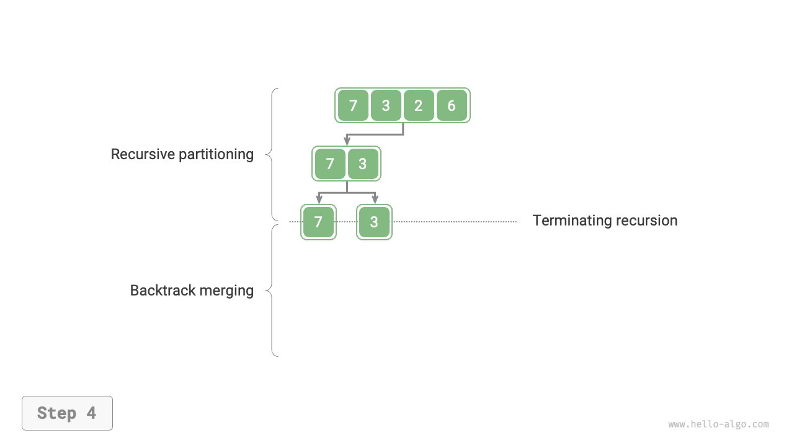

=== "<5>"
    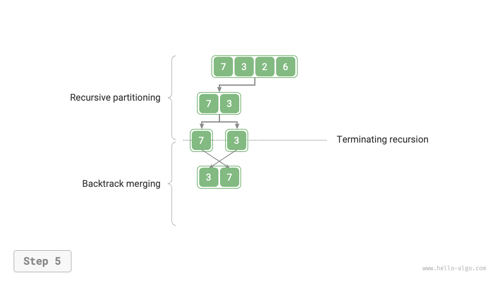

=== "<6>"
    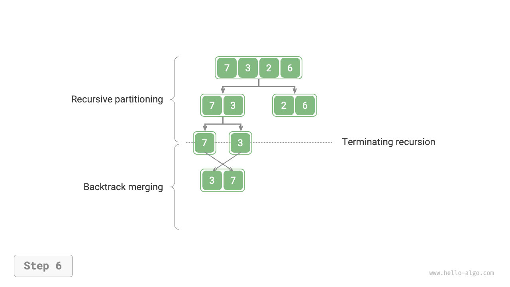

=== "<7>"
    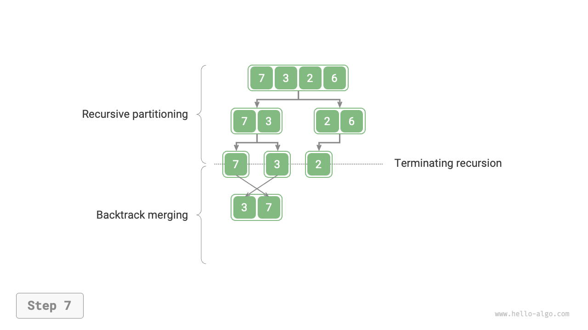

=== "<8>"
    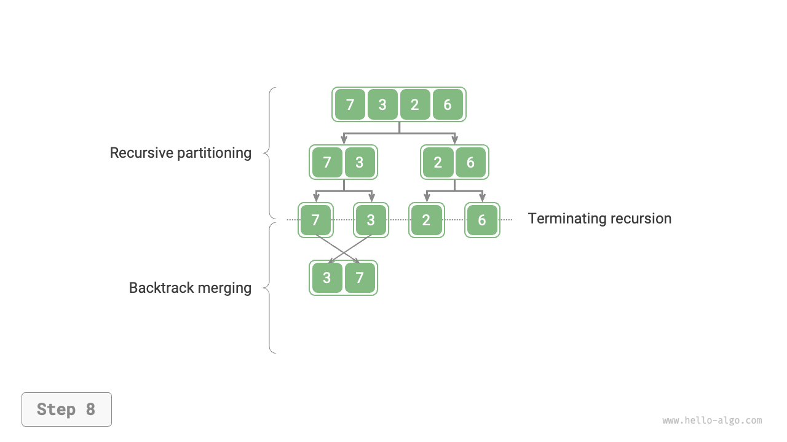

=== "<9>"
    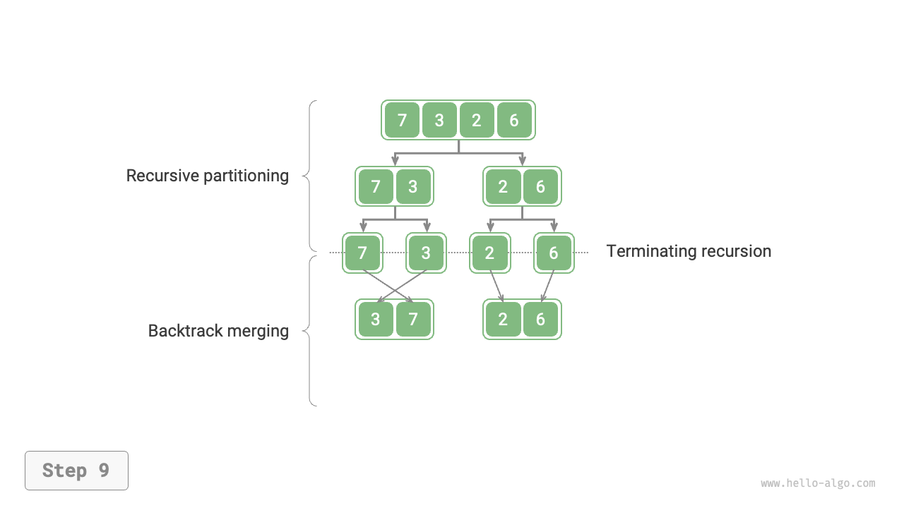

=== "<10>"
    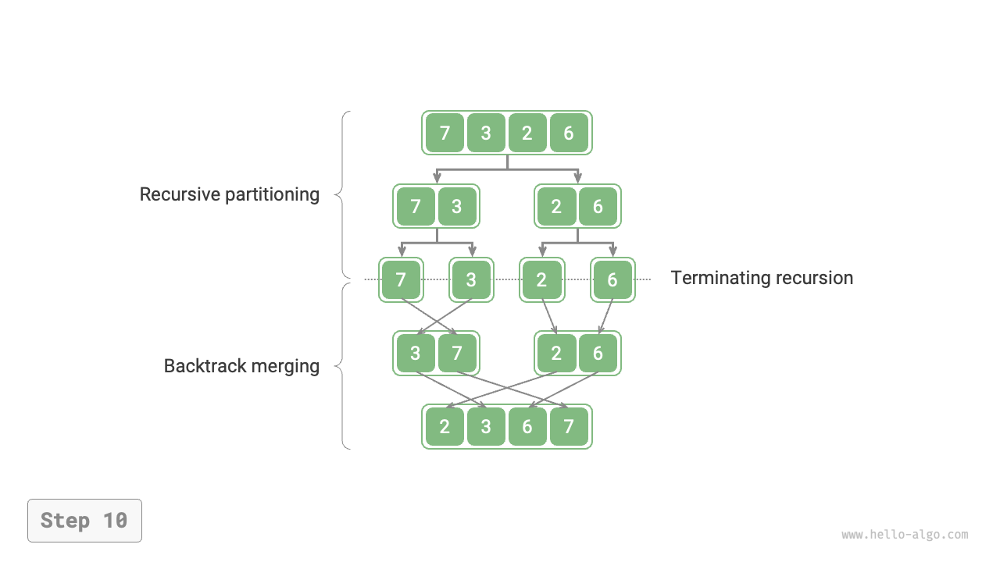

マージソートの再帰順序は二分木の後順横断と一致することが観察できます。

- **後順横断**：まず左のサブツリーを再帰的に横断し、次に右のサブツリーを横断し、最後にルートノードを処理します。
- **マージソート**：まず左のサブ配列を再帰的に処理し、次に右のサブ配列を処理し、最後にマージを実行します。

マージソートの実装は以下のコードに示されます。`nums`でマージされる区間は`[left, right]`で、`tmp`の対応する区間は`[0, right - left]`であることに注意してください。

```src
[file]{merge_sort}-[class]{}-[func]{merge_sort}
```

## アルゴリズムの特性

- **$O(n \log n)$の時間計算量、非適応ソート**：分割により高さ$\log n$の再帰ツリーが作成され、各層で合計$n$回の操作をマージし、全体的な時間計算量は$O(n \log n)$となります。
- **$O(n)$の空間計算量、非インプレースソート**：再帰深度は$\log n$で、$O(\log n)$のスタックフレーム空間を使用します。マージ操作には補助配列が必要で、追加の$O(n)$空間を使用します。
- **安定ソート**：マージプロセス中、等しい要素の順序は変更されません。

## 連結リストのソート

連結リストの場合、マージソートは他のソートアルゴリズムよりも大きな利点があります。**連結リストソートタスクの空間計算量を$O(1)$に最適化できます**。

- **分割フェーズ**：「再帰」の代わりに「反復」を使用して連結リスト分割作業を実行できるため、再帰で使用されるスタックフレーム空間を節約できます。
- **マージフェーズ**：連結リストでは、ノードの挿入と削除操作は参照（ポインタ）を変更することで実現できるため、マージフェーズ（2つの短い順序付きリストを1つの長い順序付きリストに結合）中に追加のリストを作成する必要がありません。

実装の詳細は比較的複雑で、興味のある読者は関連資料を参照して学習してください。
