# マージソート

<u>マージソート（merge sort）</u>は分割統治戦略に基づくソートアルゴリズムであり、以下の図に示す「分割」と「マージ」の段階から構成されます。

1. **分割段階**：再帰によって配列を中点で繰り返し分割し、長い配列のソート問題を短い配列のソート問題へ変換します。
2. **マージ段階**：部分配列の長さが 1 になったら分割を終了し、マージを開始して、左右 2 つの短いソート済み配列をより長いソート済み配列へと繰り返しマージしていきます。

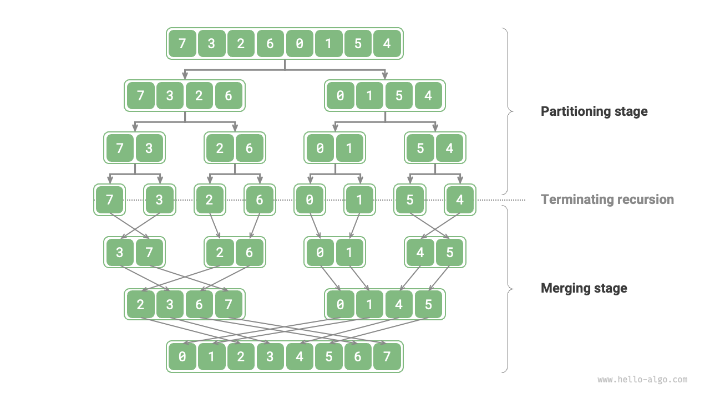

## アルゴリズムの流れ

以下の図に示すように、「分割段階」では配列を上から下へ再帰的に中点で 2 つの部分配列へ分割します。

1. 配列の中点 `mid` を計算し、左部分配列（区間 `[left, mid]` ）と右部分配列（区間 `[mid + 1, right]` ）を再帰的に分割します。
2. 手順 `1.` を再帰的に実行し、部分配列区間の長さが 1 になった時点で終了します。

「マージ段階」では左部分配列と右部分配列を下から上へとマージし、1 つのソート済み配列にします。長さ 1 の部分配列からマージを始めるため、この段階の各部分配列はすでに整列されています。

=== "<1>"
    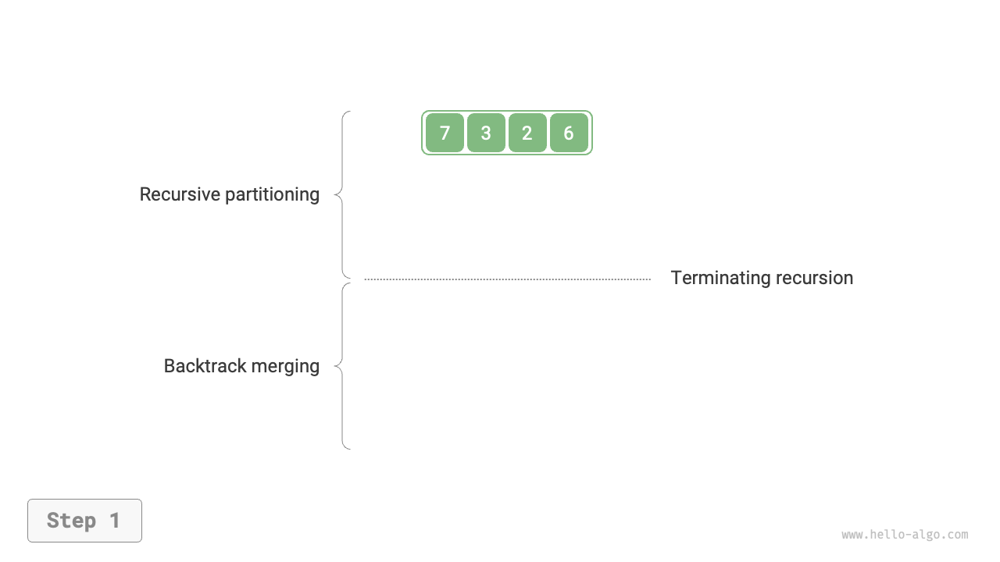

=== "<2>"
    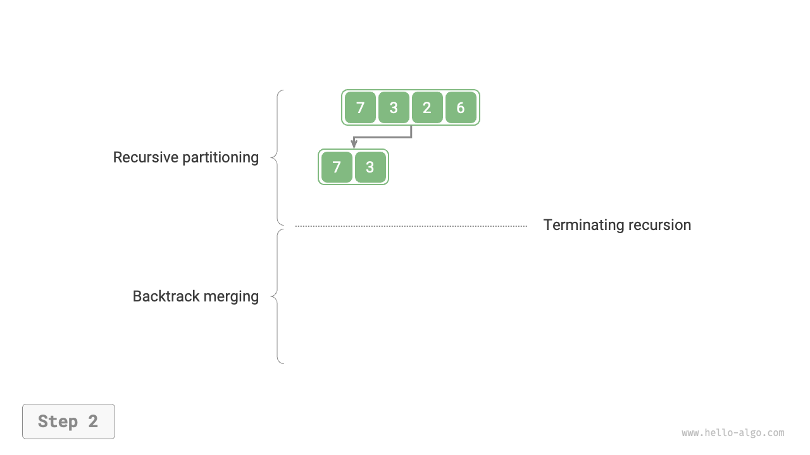

=== "<3>"
    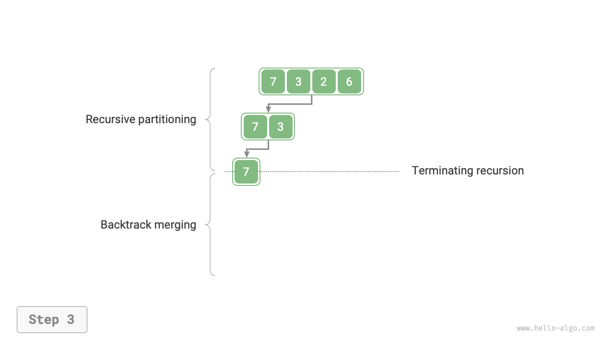

=== "<4>"
    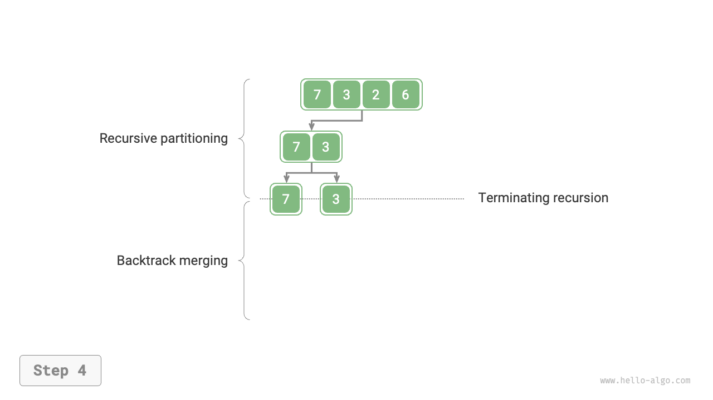

=== "<5>"
    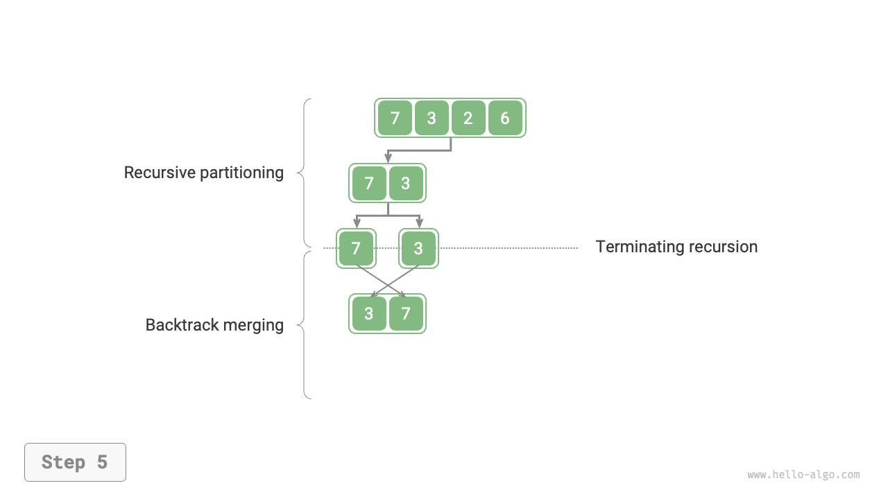

=== "<6>"
    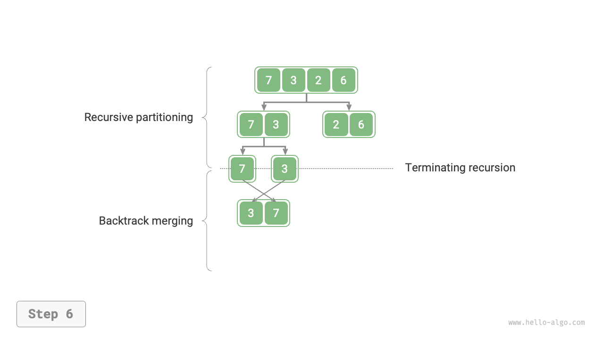

=== "<7>"
    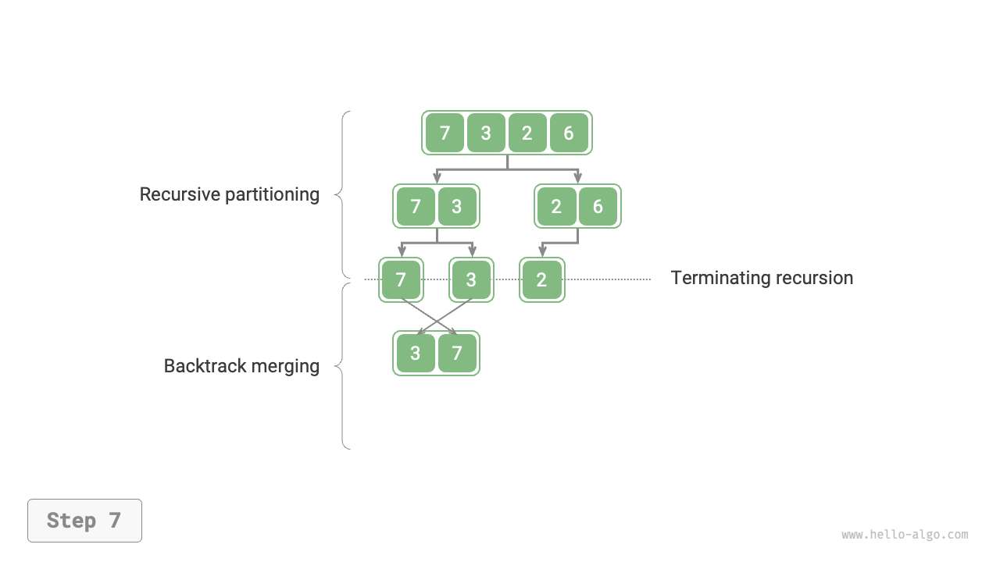

=== "<8>"
    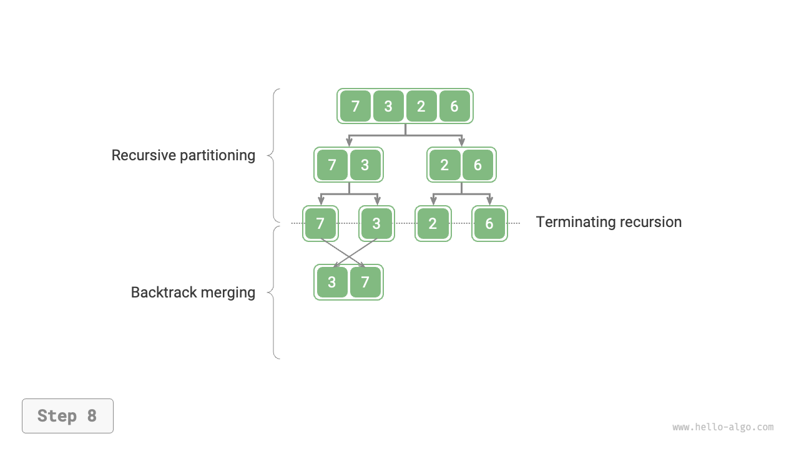

=== "<9>"
    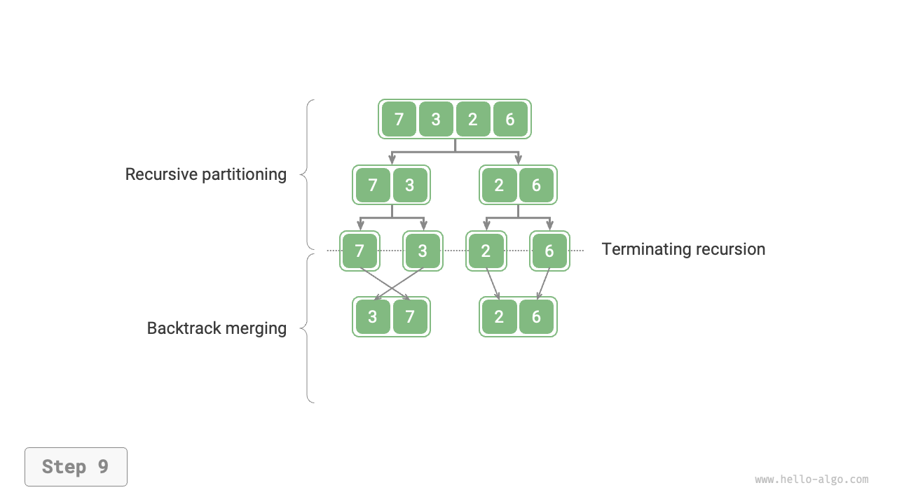

=== "<10>"
    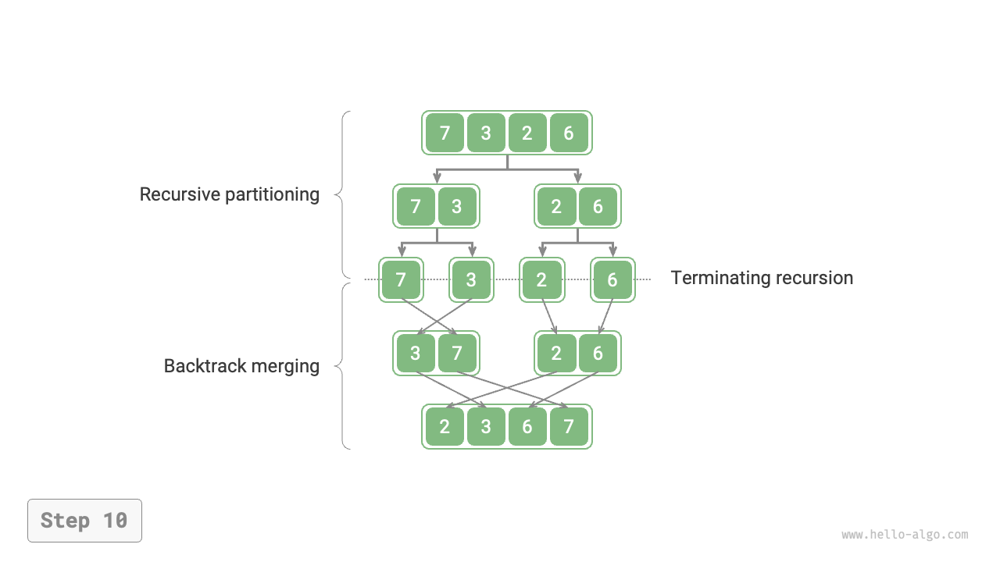

観察すると、マージソートの再帰順序は二分木の後順走査と一致していることがわかります。

- **後順走査**：まず左部分木を再帰し、次に右部分木を再帰し、最後に根ノードを処理します。
- **マージソート**：まず左部分配列を再帰し、次に右部分配列を再帰し、最後にマージを処理します。

マージソートの実装を以下のコードに示します。注意として、`nums` のマージ対象区間は `[left, right]` であり、`tmp` の対応区間は `[0, right - left]` です。

```src
[file]{merge_sort}-[class]{}-[func]{merge_sort}
```

## アルゴリズムの特性

- **時間計算量は $O(n \log n)$、非適応型ソート**：分割によって高さ $\log n$ の再帰木が生成され、各層でのマージ操作の総数は $n$ であるため、全体の時間計算量は $O(n \log n)$ です。
- **空間計算量は $O(n)$、インプレースではないソート**：再帰の深さは $\log n$ であり、サイズ $O(\log n)$ のスタックフレーム領域を使用します。マージ操作は補助配列を用いて実装する必要があり、サイズ $O(n)$ の追加領域を使用します。
- **安定ソート**：マージの過程では、等しい要素の順序は変化しません。

## 連結リストのソート

連結リストに対しては、マージソートは他のソートアルゴリズムと比べて顕著な利点があり、**連結リストのソート問題の空間計算量を $O(1)$ まで最適化できます** 。

- **分割段階**：連結リストの分割は「再帰」の代わりに「反復」で実装できるため、再帰で使用するスタックフレーム領域を省けます。
- **マージ段階**：連結リストでは、ノードの追加や削除は参照（ポインタ）を変更するだけで実現できるため、マージ段階（2 つの短いソート済み連結リストを 1 つの長いソート済み連結リストにマージすること）では追加の連結リストを作成する必要がありません。

具体的な実装の詳細は比較的複雑なので、興味のある読者は関連資料を参照して学習してください。
