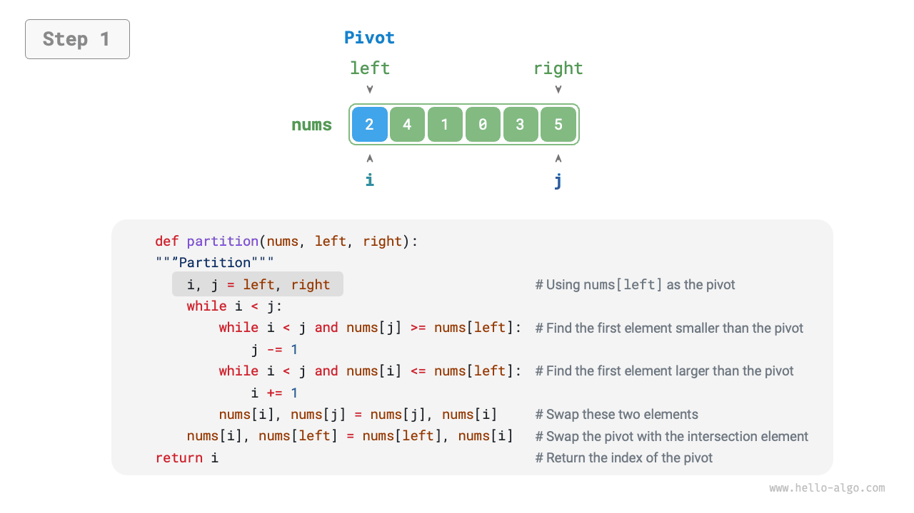
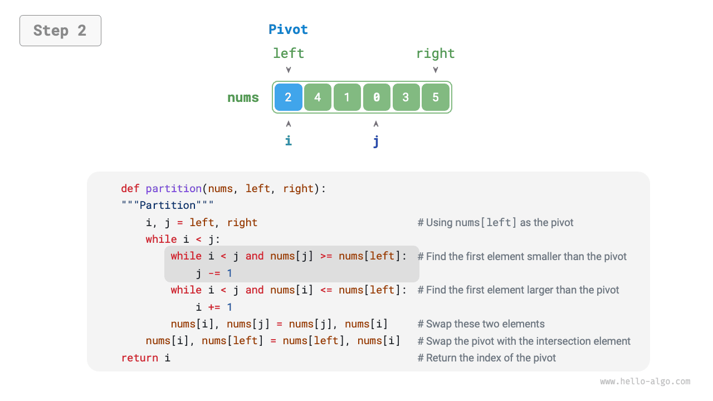
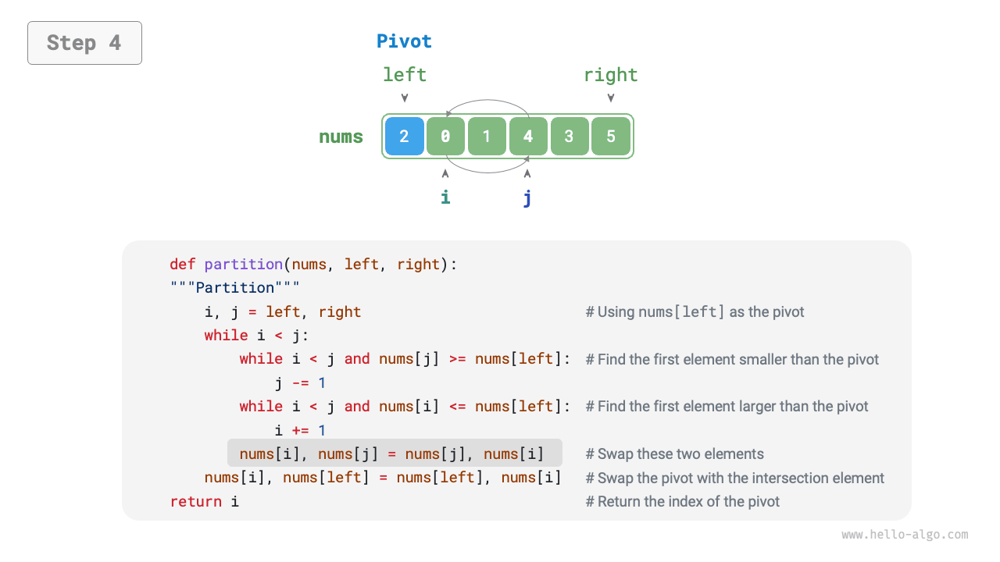
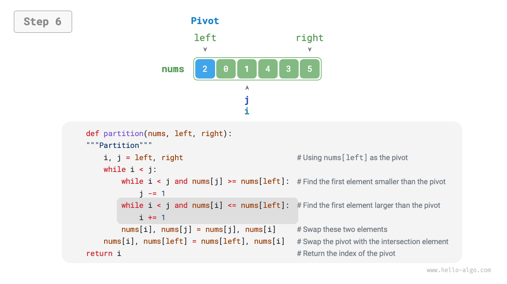
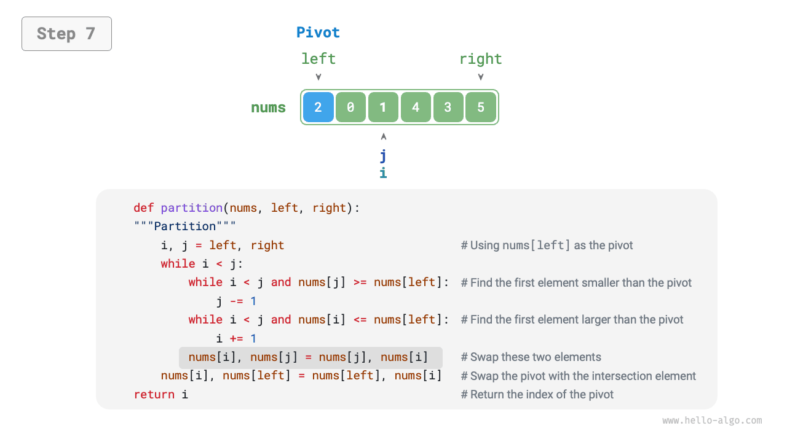
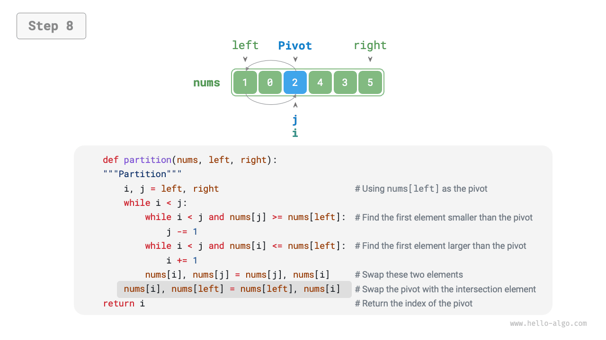
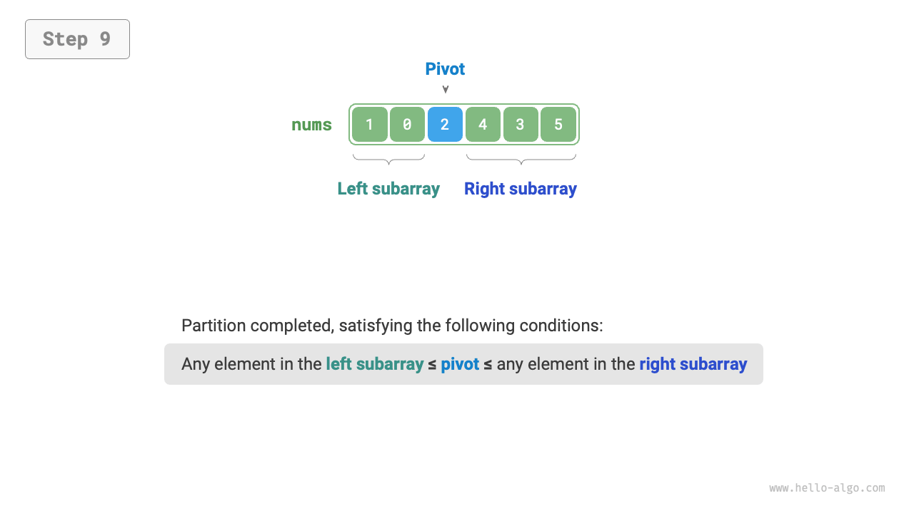
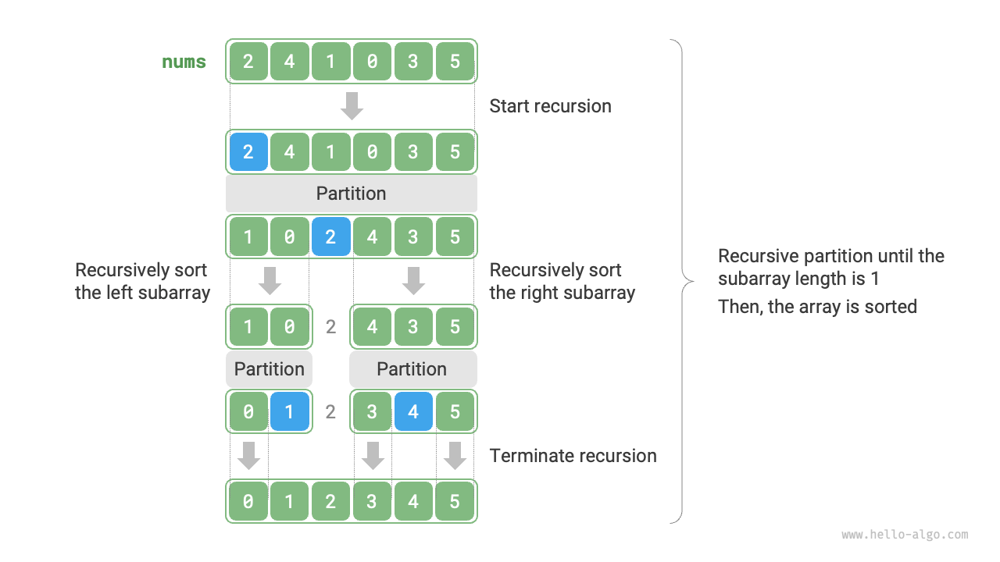

# 11.5 &nbsp; クイックソート

<u>クイックソート（quick sort）</u>は分割統治戦略に基づくソートアルゴリズムであり、実行効率が高く、広く利用されています。

クイックソートの中核操作は「パーティション」であり、その目的は、配列内のある要素を「基準数」として選び、基準数より小さいすべての要素を左側へ、大きい要素を右側へ移動することです。具体的には、パーティションの流れを下図に示します。

1. 配列の最左端の要素を基準数として選び、2 つのポインタ `i` と `j` を初期化して、それぞれ配列の両端を指すようにします。
2. ループを設定し、各ラウンドで `i`（`j`）を使ってそれぞれ基準数より大きい（小さい）最初の要素を探し、その後この 2 つの要素を交換します。
3. `i` と `j` が出会うまでステップ `2.` を繰り返し、最後に基準数を 2 つの部分配列の境界へ交換します。

=== "<1>"
    { class="animation-figure" }

=== "<2>"
    { class="animation-figure" }

=== "<3>"
    { class="animation-figure" }

=== "<4>"
    { class="animation-figure" }

=== "<5>"
    { class="animation-figure" }

=== "<6>"
    { class="animation-figure" }

=== "<7>"
    { class="animation-figure" }

=== "<8>"
    { class="animation-figure" }

=== "<9>"
    { class="animation-figure" }

<p align="center"> 図 11-8 &nbsp; パーティションの手順 </p>

パーティションが完了すると、元の配列は左部分配列、基準数、右部分配列の 3 つに分けられ、「左部分配列の任意の要素 $\leq$ 基準数 $\leq$ 右部分配列の任意の要素」を満たします。したがって、次はこの 2 つの部分配列だけをソートすれば済みます。

!!! note "クイックソートの分割統治戦略"

    パーティションの本質は、長い配列のソート問題を 2 つの短い配列のソート問題へ簡略化することです。

=== "Python"

    ```python title="quick_sort.py"
    def partition(self, nums: list[int], left: int, right: int) -> int:
        """番兵分割"""
        # nums[left] を基準値とする
        i, j = left, right
        while i < j:
            while i < j and nums[j] >= nums[left]:
                j -= 1  # 右から左へ基準値未満の最初の要素を探す
            while i < j and nums[i] <= nums[left]:
                i += 1  # 左から右へ基準値より大きい最初の要素を探す
            # 要素の交換
            nums[i], nums[j] = nums[j], nums[i]
        # 基準値を 2 つの部分配列の境界へ交換する
        nums[i], nums[left] = nums[left], nums[i]
        return i  # 基準値のインデックスを返す
    ```

=== "C++"

    ```cpp title="quick_sort.cpp"
    /* 番兵分割 */
    int partition(vector<int> &nums, int left, int right) {
        // nums[left] を基準値とする
        int i = left, j = right;
        while (i < j) {
            while (i < j && nums[j] >= nums[left])
                j--;                // 右から左へ基準値未満の最初の要素を探す
            while (i < j && nums[i] <= nums[left])
                i++;                // 左から右へ基準値より大きい最初の要素を探す
            swap(nums[i], nums[j]); // この 2 つの要素を交換
        }
        swap(nums[i], nums[left]);  // 基準値を 2 つの部分配列の境界へ交換する
        return i;                   // 基準値のインデックスを返す
    }
    ```

=== "Java"

    ```java title="quick_sort.java"
    /* 要素の交換 */
    void swap(int[] nums, int i, int j) {
        int tmp = nums[i];
        nums[i] = nums[j];
        nums[j] = tmp;
    }

    /* 番兵分割 */
    int partition(int[] nums, int left, int right) {
        // nums[left] を基準値とする
        int i = left, j = right;
        while (i < j) {
            while (i < j && nums[j] >= nums[left])
                j--;          // 右から左へ基準値未満の最初の要素を探す
            while (i < j && nums[i] <= nums[left])
                i++;          // 左から右へ基準値より大きい最初の要素を探す
            swap(nums, i, j); // この 2 つの要素を交換
        }
        swap(nums, i, left);  // 基準値を 2 つの部分配列の境界へ交換する
        return i;             // 基準値のインデックスを返す
    }
    ```

=== "C#"

    ```csharp title="quick_sort.cs"
    /* 要素の交換 */
    void Swap(int[] nums, int i, int j) {
        (nums[j], nums[i]) = (nums[i], nums[j]);
    }

    /* 番兵分割 */
    int Partition(int[] nums, int left, int right) {
        // nums[left] を基準値とする
        int i = left, j = right;
        while (i < j) {
            while (i < j && nums[j] >= nums[left])
                j--;          // 右から左へ基準値未満の最初の要素を探す
            while (i < j && nums[i] <= nums[left])
                i++;          // 左から右へ基準値より大きい最初の要素を探す
            Swap(nums, i, j); // この 2 つの要素を交換
        }
        Swap(nums, i, left);  // 基準値を 2 つの部分配列の境界へ交換する
        return i;             // 基準値のインデックスを返す
    }
    ```

=== "Go"

    ```go title="quick_sort.go"
    /* 番兵分割 */
    func (q *quickSort) partition(nums []int, left, right int) int {
        // nums[left] を基準値とする
        i, j := left, right
        for i < j {
            for i < j && nums[j] >= nums[left] {
                j-- // 右から左へ基準値未満の最初の要素を探す
            }
            for i < j && nums[i] <= nums[left] {
                i++ // 左から右へ基準値より大きい最初の要素を探す
            }
            // 要素の交換
            nums[i], nums[j] = nums[j], nums[i]
        }
        // 基準値を 2 つの部分配列の境界へ交換する
        nums[i], nums[left] = nums[left], nums[i]
        return i // 基準値のインデックスを返す
    }
    ```

=== "Swift"

    ```swift title="quick_sort.swift"
    /* 番兵分割 */
    func partition(nums: inout [Int], left: Int, right: Int) -> Int {
        // nums[left] を基準値とする
        var i = left
        var j = right
        while i < j {
            while i < j, nums[j] >= nums[left] {
                j -= 1 // 右から左へ基準値未満の最初の要素を探す
            }
            while i < j, nums[i] <= nums[left] {
                i += 1 // 左から右へ基準値より大きい最初の要素を探す
            }
            nums.swapAt(i, j) // この 2 つの要素を交換
        }
        nums.swapAt(i, left) // 基準値を 2 つの部分配列の境界へ交換する
        return i // 基準値のインデックスを返す
    }
    ```

=== "JS"

    ```javascript title="quick_sort.js"
    /* 要素の交換 */
    swap(nums, i, j) {
        let tmp = nums[i];
        nums[i] = nums[j];
        nums[j] = tmp;
    }

    /* 番兵分割 */
    partition(nums, left, right) {
        // nums[left] を基準値とする
        let i = left,
            j = right;
        while (i < j) {
            while (i < j && nums[j] >= nums[left]) {
                j -= 1; // 右から左へ基準値未満の最初の要素を探す
            }
            while (i < j && nums[i] <= nums[left]) {
                i += 1; // 左から右へ基準値より大きい最初の要素を探す
            }
            // 要素の交換
            this.swap(nums, i, j); // この 2 つの要素を交換
        }
        this.swap(nums, i, left); // 基準値を 2 つの部分配列の境界へ交換する
        return i; // 基準値のインデックスを返す
    }
    ```

=== "TS"

    ```typescript title="quick_sort.ts"
    /* 要素の交換 */
    swap(nums: number[], i: number, j: number): void {
        let tmp = nums[i];
        nums[i] = nums[j];
        nums[j] = tmp;
    }

    /* 番兵分割 */
    partition(nums: number[], left: number, right: number): number {
        // nums[left] を基準値とする
        let i = left,
            j = right;
        while (i < j) {
            while (i < j && nums[j] >= nums[left]) {
                j -= 1; // 右から左へ基準値未満の最初の要素を探す
            }
            while (i < j && nums[i] <= nums[left]) {
                i += 1; // 左から右へ基準値より大きい最初の要素を探す
            }
            // 要素の交換
            this.swap(nums, i, j); // この 2 つの要素を交換
        }
        this.swap(nums, i, left); // 基準値を 2 つの部分配列の境界へ交換する
        return i; // 基準値のインデックスを返す
    }
    ```

=== "Dart"

    ```dart title="quick_sort.dart"
    /* 要素の交換 */
    void _swap(List<int> nums, int i, int j) {
      int tmp = nums[i];
      nums[i] = nums[j];
      nums[j] = tmp;
    }

    /* 番兵分割 */
    int _partition(List<int> nums, int left, int right) {
      // nums[left] を基準値とする
      int i = left, j = right;
      while (i < j) {
        while (i < j && nums[j] >= nums[left]) j--; // 右から左へ基準値未満の最初の要素を探す
        while (i < j && nums[i] <= nums[left]) i++; // 左から右へ基準値より大きい最初の要素を探す
        _swap(nums, i, j); // この 2 つの要素を交換
      }
      _swap(nums, i, left); // 基準値を 2 つの部分配列の境界へ交換する
      return i; // 基準値のインデックスを返す
    }
    ```

=== "Rust"

    ```rust title="quick_sort.rs"
    /* 番兵分割 */
    fn partition(nums: &mut [i32], left: usize, right: usize) -> usize {
        // nums[left] を基準値とする
        let (mut i, mut j) = (left, right);
        while i < j {
            while i < j && nums[j] >= nums[left] {
                j -= 1; // 右から左へ基準値未満の最初の要素を探す
            }
            while i < j && nums[i] <= nums[left] {
                i += 1; // 左から右へ基準値より大きい最初の要素を探す
            }
            nums.swap(i, j); // この 2 つの要素を交換
        }
        nums.swap(i, left); // 基準値を 2 つの部分配列の境界へ交換する
        i // 基準値のインデックスを返す
    }
    ```

=== "C"

    ```c title="quick_sort.c"
    /* 要素の交換 */
    void swap(int nums[], int i, int j) {
        int tmp = nums[i];
        nums[i] = nums[j];
        nums[j] = tmp;
    }

    /* 番兵分割 */
    int partition(int nums[], int left, int right) {
        // nums[left] を基準値とする
        int i = left, j = right;
        while (i < j) {
            while (i < j && nums[j] >= nums[left]) {
                j--; // 右から左へ基準値未満の最初の要素を探す
            }
            while (i < j && nums[i] <= nums[left]) {
                i++; // 左から右へ基準値より大きい最初の要素を探す
            }
            // この 2 つの要素を交換
            swap(nums, i, j);
        }
        // 基準値を 2 つの部分配列の境界へ交換する
        swap(nums, i, left);
        // 基準値のインデックスを返す
        return i;
    }
    ```

=== "Kotlin"

    ```kotlin title="quick_sort.kt"
    /* 要素の交換 */
    fun swap(nums: IntArray, i: Int, j: Int) {
        val temp = nums[i]
        nums[i] = nums[j]
        nums[j] = temp
    }

    /* 番兵分割 */
    fun partition(nums: IntArray, left: Int, right: Int): Int {
        // nums[left] を基準値とする
        var i = left
        var j = right
        while (i < j) {
            while (i < j && nums[j] >= nums[left])
                j--           // 右から左へ基準値未満の最初の要素を探す
            while (i < j && nums[i] <= nums[left])
                i++           // 左から右へ基準値より大きい最初の要素を探す
            swap(nums, i, j)  // この 2 つの要素を交換
        }
        swap(nums, i, left)   // 基準値を 2 つの部分配列の境界へ交換する
        return i              // 基準値のインデックスを返す
    }
    ```

=== "Ruby"

    ```ruby title="quick_sort.rb"
    ### 番兵分割 ###
    def partition(nums, left, right)
      # nums[left] を基準値とする
      i, j = left, right
      while i < j
        while i < j && nums[j] >= nums[left]
          j -= 1 # 右から左へ基準値未満の最初の要素を探す
        end
        while i < j && nums[i] <= nums[left]
          i += 1 # 左から右へ基準値より大きい最初の要素を探す
        end
        # 要素の交換
        nums[i], nums[j] = nums[j], nums[i]
      end
      # 基準値を 2 つの部分配列の境界へ交換する
      nums[i], nums[left] = nums[left], nums[i]
      i # 基準値のインデックスを返す
    end
    ```

??? pythontutor "コードの可視化"

    <div style="height: 549px; width: 100%;"><iframe class="pythontutor-iframe" src="https://pythontutor.com/iframe-embed.html#code=def%20partition%28nums%3A%20list%5Bint%5D%2C%20left%3A%20int%2C%20right%3A%20int%29%20-%3E%20int%3A%0A%20%20%20%20%22%22%22%E7%95%AA%E5%85%B5%E5%88%86%E5%89%B2%22%22%22%0A%20%20%20%20%23%20nums%5Bleft%5D%20%E3%82%92%E5%9F%BA%E6%BA%96%E5%80%A4%E3%81%A8%E3%81%99%E3%82%8B%0A%20%20%20%20i%2C%20j%20%3D%20left%2C%20right%0A%20%20%20%20while%20i%20%3C%20j%3A%0A%20%20%20%20%20%20%20%20while%20i%20%3C%20j%20and%20nums%5Bj%5D%20%3E%3D%20nums%5Bleft%5D%3A%0A%20%20%20%20%20%20%20%20%20%20%20%20j%20-%3D%201%20%20%23%20%E5%8F%B3%E3%81%8B%E3%82%89%E5%B7%A6%E3%81%B8%E5%9F%BA%E6%BA%96%E5%80%A4%E6%9C%AA%E6%BA%80%E3%81%AE%E6%9C%80%E5%88%9D%E3%81%AE%E8%A6%81%E7%B4%A0%E3%82%92%E6%8E%A2%E3%81%99%0A%20%20%20%20%20%20%20%20while%20i%20%3C%20j%20and%20nums%5Bi%5D%20%3C%3D%20nums%5Bleft%5D%3A%0A%20%20%20%20%20%20%20%20%20%20%20%20i%20%2B%3D%201%20%20%23%20%E5%B7%A6%E3%81%8B%E3%82%89%E5%8F%B3%E3%81%B8%E5%9F%BA%E6%BA%96%E5%80%A4%E3%82%88%E3%82%8A%E5%A4%A7%E3%81%8D%E3%81%84%E6%9C%80%E5%88%9D%E3%81%AE%E8%A6%81%E7%B4%A0%E3%82%92%E6%8E%A2%E3%81%99%0A%20%20%20%20%20%20%20%20%23%20%E8%A6%81%E7%B4%A0%E3%81%AE%E4%BA%A4%E6%8F%9B%0A%20%20%20%20%20%20%20%20nums%5Bi%5D%2C%20nums%5Bj%5D%20%3D%20nums%5Bj%5D%2C%20nums%5Bi%5D%0A%20%20%20%20%23%20%E5%9F%BA%E6%BA%96%E5%80%A4%E3%82%92%202%20%E3%81%A4%E3%81%AE%E9%83%A8%E5%88%86%E9%85%8D%E5%88%97%E3%81%AE%E5%A2%83%E7%95%8C%E3%81%B8%E4%BA%A4%E6%8F%9B%E3%81%99%E3%82%8B%0A%20%20%20%20nums%5Bi%5D%2C%20nums%5Bleft%5D%20%3D%20nums%5Bleft%5D%2C%20nums%5Bi%5D%0A%20%20%20%20return%20i%20%20%23%20%E5%9F%BA%E6%BA%96%E5%80%A4%E3%81%AE%E3%82%A4%E3%83%B3%E3%83%87%E3%83%83%E3%82%AF%E3%82%B9%E3%82%92%E8%BF%94%E3%81%99%0A%0A%0Aif%20__name__%20%3D%3D%20%22__main__%22%3A%0A%20%20%20%20nums%20%3D%20%5B2%2C%204%2C%201%2C%200%2C%203%2C%205%5D%0A%20%20%20%20partition%28nums%2C%200%2C%20len%28nums%29%20-%201%29%0A%20%20%20%20print%28%22%E7%95%AA%E5%85%B5%E5%88%86%E5%89%B2%E5%AE%8C%E4%BA%86%E5%BE%8C%20nums%20%3D%22%2C%20nums%29&codeDivHeight=472&codeDivWidth=350&cumulative=false&curInstr=4&heapPrimitives=nevernest&origin=opt-frontend.js&py=311&rawInputLstJSON=%5B%5D&textReferences=false"> </iframe></div>
    <div style="margin-top: 5px;"><a href="https://pythontutor.com/iframe-embed.html#code=def%20partition%28nums%3A%20list%5Bint%5D%2C%20left%3A%20int%2C%20right%3A%20int%29%20-%3E%20int%3A%0A%20%20%20%20%22%22%22%E7%95%AA%E5%85%B5%E5%88%86%E5%89%B2%22%22%22%0A%20%20%20%20%23%20nums%5Bleft%5D%20%E3%82%92%E5%9F%BA%E6%BA%96%E5%80%A4%E3%81%A8%E3%81%99%E3%82%8B%0A%20%20%20%20i%2C%20j%20%3D%20left%2C%20right%0A%20%20%20%20while%20i%20%3C%20j%3A%0A%20%20%20%20%20%20%20%20while%20i%20%3C%20j%20and%20nums%5Bj%5D%20%3E%3D%20nums%5Bleft%5D%3A%0A%20%20%20%20%20%20%20%20%20%20%20%20j%20-%3D%201%20%20%23%20%E5%8F%B3%E3%81%8B%E3%82%89%E5%B7%A6%E3%81%B8%E5%9F%BA%E6%BA%96%E5%80%A4%E6%9C%AA%E6%BA%80%E3%81%AE%E6%9C%80%E5%88%9D%E3%81%AE%E8%A6%81%E7%B4%A0%E3%82%92%E6%8E%A2%E3%81%99%0A%20%20%20%20%20%20%20%20while%20i%20%3C%20j%20and%20nums%5Bi%5D%20%3C%3D%20nums%5Bleft%5D%3A%0A%20%20%20%20%20%20%20%20%20%20%20%20i%20%2B%3D%201%20%20%23%20%E5%B7%A6%E3%81%8B%E3%82%89%E5%8F%B3%E3%81%B8%E5%9F%BA%E6%BA%96%E5%80%A4%E3%82%88%E3%82%8A%E5%A4%A7%E3%81%8D%E3%81%84%E6%9C%80%E5%88%9D%E3%81%AE%E8%A6%81%E7%B4%A0%E3%82%92%E6%8E%A2%E3%81%99%0A%20%20%20%20%20%20%20%20%23%20%E8%A6%81%E7%B4%A0%E3%81%AE%E4%BA%A4%E6%8F%9B%0A%20%20%20%20%20%20%20%20nums%5Bi%5D%2C%20nums%5Bj%5D%20%3D%20nums%5Bj%5D%2C%20nums%5Bi%5D%0A%20%20%20%20%23%20%E5%9F%BA%E6%BA%96%E5%80%A4%E3%82%92%202%20%E3%81%A4%E3%81%AE%E9%83%A8%E5%88%86%E9%85%8D%E5%88%97%E3%81%AE%E5%A2%83%E7%95%8C%E3%81%B8%E4%BA%A4%E6%8F%9B%E3%81%99%E3%82%8B%0A%20%20%20%20nums%5Bi%5D%2C%20nums%5Bleft%5D%20%3D%20nums%5Bleft%5D%2C%20nums%5Bi%5D%0A%20%20%20%20return%20i%20%20%23%20%E5%9F%BA%E6%BA%96%E5%80%A4%E3%81%AE%E3%82%A4%E3%83%B3%E3%83%87%E3%83%83%E3%82%AF%E3%82%B9%E3%82%92%E8%BF%94%E3%81%99%0A%0A%0Aif%20__name__%20%3D%3D%20%22__main__%22%3A%0A%20%20%20%20nums%20%3D%20%5B2%2C%204%2C%201%2C%200%2C%203%2C%205%5D%0A%20%20%20%20partition%28nums%2C%200%2C%20len%28nums%29%20-%201%29%0A%20%20%20%20print%28%22%E7%95%AA%E5%85%B5%E5%88%86%E5%89%B2%E5%AE%8C%E4%BA%86%E5%BE%8C%20nums%20%3D%22%2C%20nums%29&codeDivHeight=800&codeDivWidth=600&cumulative=false&curInstr=4&heapPrimitives=nevernest&origin=opt-frontend.js&py=311&rawInputLstJSON=%5B%5D&textReferences=false" target="_blank" rel="noopener noreferrer">全画面で見る ></a></div>

## 11.5.1 &nbsp; アルゴリズムの流れ

クイックソート全体の流れを下図に示します。

1. まず、元の配列に対して 1 回「パーティション」を実行し、未ソートの左部分配列と右部分配列を得ます。
2. 次に、左部分配列と右部分配列に対してそれぞれ再帰的に「パーティション」を実行します。
3. 部分配列の長さが 1 になるまで再帰を続け、配列全体のソートを完了します。

{ class="animation-figure" }

<p align="center"> 図 11-9 &nbsp; クイックソートの流れ </p>

=== "Python"

    ```python title="quick_sort.py"
    def quick_sort(self, nums: list[int], left: int, right: int):
        """クイックソート"""
        # 部分配列の長さが 1 なら再帰を終了する
        if left >= right:
            return
        # 番兵分割
        pivot = self.partition(nums, left, right)
        # 左右の部分配列を再帰処理
        self.quick_sort(nums, left, pivot - 1)
        self.quick_sort(nums, pivot + 1, right)
    ```

=== "C++"

    ```cpp title="quick_sort.cpp"
    /* クイックソート */
    void quickSort(vector<int> &nums, int left, int right) {
        // 部分配列の長さが 1 なら再帰を終了する
        if (left >= right)
            return;
        // 番兵分割
        int pivot = partition(nums, left, right);
        // 左右の部分配列を再帰処理
        quickSort(nums, left, pivot - 1);
        quickSort(nums, pivot + 1, right);
    }
    ```

=== "Java"

    ```java title="quick_sort.java"
    /* クイックソート */
    void quickSort(int[] nums, int left, int right) {
        // 部分配列の長さが 1 なら再帰を終了する
        if (left >= right)
            return;
        // 番兵分割
        int pivot = partition(nums, left, right);
        // 左右の部分配列を再帰処理
        quickSort(nums, left, pivot - 1);
        quickSort(nums, pivot + 1, right);
    }
    ```

=== "C#"

    ```csharp title="quick_sort.cs"
    /* クイックソート */
    void QuickSort(int[] nums, int left, int right) {
        // 部分配列の長さが 1 なら再帰を終了する
        if (left >= right)
            return;
        // 番兵分割
        int pivot = Partition(nums, left, right);
        // 左右の部分配列を再帰処理
        QuickSort(nums, left, pivot - 1);
        QuickSort(nums, pivot + 1, right);
    }
    ```

=== "Go"

    ```go title="quick_sort.go"
    /* クイックソート */
    func (q *quickSort) quickSort(nums []int, left, right int) {
        // 部分配列の長さが 1 なら再帰を終了する
        if left >= right {
            return
        }
        // 番兵分割
        pivot := q.partition(nums, left, right)
        // 左右の部分配列を再帰処理
        q.quickSort(nums, left, pivot-1)
        q.quickSort(nums, pivot+1, right)
    }
    ```

=== "Swift"

    ```swift title="quick_sort.swift"
    /* クイックソート */
    func quickSort(nums: inout [Int], left: Int, right: Int) {
        // 部分配列の長さが 1 なら再帰を終了する
        if left >= right {
            return
        }
        // 番兵分割
        let pivot = partition(nums: &nums, left: left, right: right)
        // 左右の部分配列を再帰処理
        quickSort(nums: &nums, left: left, right: pivot - 1)
        quickSort(nums: &nums, left: pivot + 1, right: right)
    }
    ```

=== "JS"

    ```javascript title="quick_sort.js"
    /* クイックソート */
    quickSort(nums, left, right) {
        // 部分配列の長さが 1 なら再帰を終了する
        if (left >= right) return;
        // 番兵分割
        const pivot = this.partition(nums, left, right);
        // 左右の部分配列を再帰処理
        this.quickSort(nums, left, pivot - 1);
        this.quickSort(nums, pivot + 1, right);
    }
    ```

=== "TS"

    ```typescript title="quick_sort.ts"
    /* クイックソート */
    quickSort(nums: number[], left: number, right: number): void {
        // 部分配列の長さが 1 なら再帰を終了する
        if (left >= right) {
            return;
        }
        // 番兵分割
        const pivot = this.partition(nums, left, right);
        // 左右の部分配列を再帰処理
        this.quickSort(nums, left, pivot - 1);
        this.quickSort(nums, pivot + 1, right);
    }
    ```

=== "Dart"

    ```dart title="quick_sort.dart"
    /* クイックソート */
    void quickSort(List<int> nums, int left, int right) {
      // 部分配列の長さが 1 なら再帰を終了する
      if (left >= right) return;
      // 番兵分割
      int pivot = _partition(nums, left, right);
      // 左右の部分配列を再帰処理
      quickSort(nums, left, pivot - 1);
      quickSort(nums, pivot + 1, right);
    }
    ```

=== "Rust"

    ```rust title="quick_sort.rs"
    /* クイックソート */
    pub fn quick_sort(left: i32, right: i32, nums: &mut [i32]) {
        // 部分配列の長さが 1 なら再帰を終了する
        if left >= right {
            return;
        }
        // 番兵分割
        let pivot = Self::partition(nums, left as usize, right as usize) as i32;
        // 左右の部分配列を再帰処理
        Self::quick_sort(left, pivot - 1, nums);
        Self::quick_sort(pivot + 1, right, nums);
    }
    ```

=== "C"

    ```c title="quick_sort.c"
    /* クイックソート */
    void quickSort(int nums[], int left, int right) {
        // 部分配列の長さが 1 なら再帰を終了する
        if (left >= right) {
            return;
        }
        // 番兵分割
        int pivot = partition(nums, left, right);
        // 左右の部分配列を再帰処理
        quickSort(nums, left, pivot - 1);
        quickSort(nums, pivot + 1, right);
    }
    ```

=== "Kotlin"

    ```kotlin title="quick_sort.kt"
    /* クイックソート */
    fun quickSort(nums: IntArray, left: Int, right: Int) {
        // 部分配列の長さが 1 なら再帰を終了する
        if (left >= right) return
        // 番兵分割
        val pivot = partition(nums, left, right)
        // 左右の部分配列を再帰処理
        quickSort(nums, left, pivot - 1)
        quickSort(nums, pivot + 1, right)
    }
    ```

=== "Ruby"

    ```ruby title="quick_sort.rb"
    ### クイックソートクラス ###
    def quick_sort(nums, left, right)
      # 部分配列の長さが 1 でない場合は再帰する
      if left < right
        # 番兵分割
        pivot = partition(nums, left, right)
        # 左右の部分配列を再帰処理
        quick_sort(nums, left, pivot - 1)
        quick_sort(nums, pivot + 1, right)
      end
      nums
    end
    ```

??? pythontutor "コードの可視化"

    <div style="height: 549px; width: 100%;"><iframe class="pythontutor-iframe" src="https://pythontutor.com/iframe-embed.html#code=def%20partition%28nums%3A%20list%5Bint%5D%2C%20left%3A%20int%2C%20right%3A%20int%29%20-%3E%20int%3A%0A%20%20%20%20%22%22%22%E7%95%AA%E5%85%B5%E5%88%86%E5%89%B2%22%22%22%0A%20%20%20%20%23%20nums%5Bleft%5D%20%E3%82%92%E5%9F%BA%E6%BA%96%E5%80%A4%E3%81%A8%E3%81%99%E3%82%8B%0A%20%20%20%20i%2C%20j%20%3D%20left%2C%20right%0A%20%20%20%20while%20i%20%3C%20j%3A%0A%20%20%20%20%20%20%20%20while%20i%20%3C%20j%20and%20nums%5Bj%5D%20%3E%3D%20nums%5Bleft%5D%3A%0A%20%20%20%20%20%20%20%20%20%20%20%20j%20-%3D%201%20%20%23%20%E5%8F%B3%E3%81%8B%E3%82%89%E5%B7%A6%E3%81%B8%E5%9F%BA%E6%BA%96%E5%80%A4%E6%9C%AA%E6%BA%80%E3%81%AE%E6%9C%80%E5%88%9D%E3%81%AE%E8%A6%81%E7%B4%A0%E3%82%92%E6%8E%A2%E3%81%99%0A%20%20%20%20%20%20%20%20while%20i%20%3C%20j%20and%20nums%5Bi%5D%20%3C%3D%20nums%5Bleft%5D%3A%0A%20%20%20%20%20%20%20%20%20%20%20%20i%20%2B%3D%201%20%20%23%20%E5%B7%A6%E3%81%8B%E3%82%89%E5%8F%B3%E3%81%B8%E5%9F%BA%E6%BA%96%E5%80%A4%E3%82%88%E3%82%8A%E5%A4%A7%E3%81%8D%E3%81%84%E6%9C%80%E5%88%9D%E3%81%AE%E8%A6%81%E7%B4%A0%E3%82%92%E6%8E%A2%E3%81%99%0A%20%20%20%20%20%20%20%20%23%20%E8%A6%81%E7%B4%A0%E3%81%AE%E4%BA%A4%E6%8F%9B%0A%20%20%20%20%20%20%20%20nums%5Bi%5D%2C%20nums%5Bj%5D%20%3D%20nums%5Bj%5D%2C%20nums%5Bi%5D%0A%20%20%20%20%23%20%E5%9F%BA%E6%BA%96%E5%80%A4%E3%82%92%202%20%E3%81%A4%E3%81%AE%E9%83%A8%E5%88%86%E9%85%8D%E5%88%97%E3%81%AE%E5%A2%83%E7%95%8C%E3%81%B8%E4%BA%A4%E6%8F%9B%E3%81%99%E3%82%8B%0A%20%20%20%20nums%5Bi%5D%2C%20nums%5Bleft%5D%20%3D%20nums%5Bleft%5D%2C%20nums%5Bi%5D%0A%20%20%20%20return%20i%20%20%23%20%E5%9F%BA%E6%BA%96%E5%80%A4%E3%81%AE%E3%82%A4%E3%83%B3%E3%83%87%E3%83%83%E3%82%AF%E3%82%B9%E3%82%92%E8%BF%94%E3%81%99%0A%0Adef%20quick_sort%28nums%3A%20list%5Bint%5D%2C%20left%3A%20int%2C%20right%3A%20int%29%3A%0A%20%20%20%20%22%22%22%E3%82%AF%E3%82%A4%E3%83%83%E3%82%AF%E3%82%BD%E3%83%BC%E3%83%88%22%22%22%0A%20%20%20%20%23%20%E9%83%A8%E5%88%86%E9%85%8D%E5%88%97%E3%81%AE%E9%95%B7%E3%81%95%E3%81%8C%201%20%E3%81%AA%E3%82%89%E5%86%8D%E5%B8%B0%E3%82%92%E7%B5%82%E4%BA%86%E3%81%99%E3%82%8B%0A%20%20%20%20if%20left%20%3E%3D%20right%3A%0A%20%20%20%20%20%20%20%20return%0A%20%20%20%20%23%20%E7%95%AA%E5%85%B5%E5%88%86%E5%89%B2%0A%20%20%20%20pivot%20%3D%20partition%28nums%2C%20left%2C%20right%29%0A%20%20%20%20%23%20%E5%B7%A6%E5%8F%B3%E3%81%AE%E9%83%A8%E5%88%86%E9%85%8D%E5%88%97%E3%82%92%E5%86%8D%E5%B8%B0%E5%87%A6%E7%90%86%0A%20%20%20%20quick_sort%28nums%2C%20left%2C%20pivot%20-%201%29%0A%20%20%20%20quick_sort%28nums%2C%20pivot%20%2B%201%2C%20right%29%0A%0A%0Aif%20__name__%20%3D%3D%20%22__main__%22%3A%0A%20%20%20%20%23%20%E3%82%AF%E3%82%A4%E3%83%83%E3%82%AF%E3%82%BD%E3%83%BC%E3%83%88%0A%20%20%20%20nums%20%3D%20%5B2%2C%204%2C%201%2C%200%2C%203%2C%205%5D%0A%20%20%20%20quick_sort%28nums%2C%200%2C%20len%28nums%29%20-%201%29%0A%20%20%20%20print%28%22%E3%82%AF%E3%82%A4%E3%83%83%E3%82%AF%E3%82%BD%E3%83%BC%E3%83%88%E5%AE%8C%E4%BA%86%E5%BE%8C%20nums%20%3D%22%2C%20nums%29&codeDivHeight=472&codeDivWidth=350&cumulative=false&curInstr=5&heapPrimitives=nevernest&origin=opt-frontend.js&py=311&rawInputLstJSON=%5B%5D&textReferences=false"> </iframe></div>
    <div style="margin-top: 5px;"><a href="https://pythontutor.com/iframe-embed.html#code=def%20partition%28nums%3A%20list%5Bint%5D%2C%20left%3A%20int%2C%20right%3A%20int%29%20-%3E%20int%3A%0A%20%20%20%20%22%22%22%E7%95%AA%E5%85%B5%E5%88%86%E5%89%B2%22%22%22%0A%20%20%20%20%23%20nums%5Bleft%5D%20%E3%82%92%E5%9F%BA%E6%BA%96%E5%80%A4%E3%81%A8%E3%81%99%E3%82%8B%0A%20%20%20%20i%2C%20j%20%3D%20left%2C%20right%0A%20%20%20%20while%20i%20%3C%20j%3A%0A%20%20%20%20%20%20%20%20while%20i%20%3C%20j%20and%20nums%5Bj%5D%20%3E%3D%20nums%5Bleft%5D%3A%0A%20%20%20%20%20%20%20%20%20%20%20%20j%20-%3D%201%20%20%23%20%E5%8F%B3%E3%81%8B%E3%82%89%E5%B7%A6%E3%81%B8%E5%9F%BA%E6%BA%96%E5%80%A4%E6%9C%AA%E6%BA%80%E3%81%AE%E6%9C%80%E5%88%9D%E3%81%AE%E8%A6%81%E7%B4%A0%E3%82%92%E6%8E%A2%E3%81%99%0A%20%20%20%20%20%20%20%20while%20i%20%3C%20j%20and%20nums%5Bi%5D%20%3C%3D%20nums%5Bleft%5D%3A%0A%20%20%20%20%20%20%20%20%20%20%20%20i%20%2B%3D%201%20%20%23%20%E5%B7%A6%E3%81%8B%E3%82%89%E5%8F%B3%E3%81%B8%E5%9F%BA%E6%BA%96%E5%80%A4%E3%82%88%E3%82%8A%E5%A4%A7%E3%81%8D%E3%81%84%E6%9C%80%E5%88%9D%E3%81%AE%E8%A6%81%E7%B4%A0%E3%82%92%E6%8E%A2%E3%81%99%0A%20%20%20%20%20%20%20%20%23%20%E8%A6%81%E7%B4%A0%E3%81%AE%E4%BA%A4%E6%8F%9B%0A%20%20%20%20%20%20%20%20nums%5Bi%5D%2C%20nums%5Bj%5D%20%3D%20nums%5Bj%5D%2C%20nums%5Bi%5D%0A%20%20%20%20%23%20%E5%9F%BA%E6%BA%96%E5%80%A4%E3%82%92%202%20%E3%81%A4%E3%81%AE%E9%83%A8%E5%88%86%E9%85%8D%E5%88%97%E3%81%AE%E5%A2%83%E7%95%8C%E3%81%B8%E4%BA%A4%E6%8F%9B%E3%81%99%E3%82%8B%0A%20%20%20%20nums%5Bi%5D%2C%20nums%5Bleft%5D%20%3D%20nums%5Bleft%5D%2C%20nums%5Bi%5D%0A%20%20%20%20return%20i%20%20%23%20%E5%9F%BA%E6%BA%96%E5%80%A4%E3%81%AE%E3%82%A4%E3%83%B3%E3%83%87%E3%83%83%E3%82%AF%E3%82%B9%E3%82%92%E8%BF%94%E3%81%99%0A%0Adef%20quick_sort%28nums%3A%20list%5Bint%5D%2C%20left%3A%20int%2C%20right%3A%20int%29%3A%0A%20%20%20%20%22%22%22%E3%82%AF%E3%82%A4%E3%83%83%E3%82%AF%E3%82%BD%E3%83%BC%E3%83%88%22%22%22%0A%20%20%20%20%23%20%E9%83%A8%E5%88%86%E9%85%8D%E5%88%97%E3%81%AE%E9%95%B7%E3%81%95%E3%81%8C%201%20%E3%81%AA%E3%82%89%E5%86%8D%E5%B8%B0%E3%82%92%E7%B5%82%E4%BA%86%E3%81%99%E3%82%8B%0A%20%20%20%20if%20left%20%3E%3D%20right%3A%0A%20%20%20%20%20%20%20%20return%0A%20%20%20%20%23%20%E7%95%AA%E5%85%B5%E5%88%86%E5%89%B2%0A%20%20%20%20pivot%20%3D%20partition%28nums%2C%20left%2C%20right%29%0A%20%20%20%20%23%20%E5%B7%A6%E5%8F%B3%E3%81%AE%E9%83%A8%E5%88%86%E9%85%8D%E5%88%97%E3%82%92%E5%86%8D%E5%B8%B0%E5%87%A6%E7%90%86%0A%20%20%20%20quick_sort%28nums%2C%20left%2C%20pivot%20-%201%29%0A%20%20%20%20quick_sort%28nums%2C%20pivot%20%2B%201%2C%20right%29%0A%0A%0Aif%20__name__%20%3D%3D%20%22__main__%22%3A%0A%20%20%20%20%23%20%E3%82%AF%E3%82%A4%E3%83%83%E3%82%AF%E3%82%BD%E3%83%BC%E3%83%88%0A%20%20%20%20nums%20%3D%20%5B2%2C%204%2C%201%2C%200%2C%203%2C%205%5D%0A%20%20%20%20quick_sort%28nums%2C%200%2C%20len%28nums%29%20-%201%29%0A%20%20%20%20print%28%22%E3%82%AF%E3%82%A4%E3%83%83%E3%82%AF%E3%82%BD%E3%83%BC%E3%83%88%E5%AE%8C%E4%BA%86%E5%BE%8C%20nums%20%3D%22%2C%20nums%29&codeDivHeight=800&codeDivWidth=600&cumulative=false&curInstr=5&heapPrimitives=nevernest&origin=opt-frontend.js&py=311&rawInputLstJSON=%5B%5D&textReferences=false" target="_blank" rel="noopener noreferrer">全画面で見る ></a></div>

## 11.5.2 &nbsp; アルゴリズムの特性

- **時間計算量は $O(n \log n)$、非適応型ソート**：平均的な場合、パーティションの再帰の深さは $\log n$ で、各層の総ループ回数は $n$ のため、全体で $O(n \log n)$ 時間を要します。最悪の場合、各回のパーティション操作で長さ $n$ の配列が長さ $0$ と $n - 1$ の 2 つの部分配列に分割され、このとき再帰の深さは $n$ に達し、各層のループ回数は $n$ となるため、全体で $O(n^2)$ 時間を要します。
- **空間計算量は $O(n)$、インプレースソート**：入力配列が完全な逆順の場合、最悪の再帰深さ $n$ に達し、$O(n)$ のスタックフレーム空間を使用します。ソート操作は元の配列上で行われ、追加の配列は用いません。
- **非安定ソート**：パーティションの最後のステップで、基準数が等しい要素の右側へ交換される可能性があります。

## 11.5.3 &nbsp; クイックソートが速い理由

名前からも分かるように、クイックソートは効率面で一定の優位性を持っています。クイックソートの平均時間計算量は「マージソート」や「ヒープソート」と同じですが、通常はクイックソートのほうが高効率であり、主な理由は次のとおりです。

- **最悪ケースが起こる確率が低い**：クイックソートの最悪時間計算量は $O(n^2)$ で、「マージソート」ほど安定ではありませんが、大半のケースでは $O(n \log n)$ の時間計算量で動作します。
- **キャッシュ利用効率が高い**：パーティション操作の実行時には、システムが部分配列全体をキャッシュに読み込めるため、要素アクセスの効率が高くなります。一方、「ヒープソート」のようなアルゴリズムは要素へ飛び飛びにアクセスする必要があり、この性質を持ちません。
- **計算量の定数係数が小さい**：上記 3 つのアルゴリズムの中で、クイックソートは比較、代入、交換などの操作総数が最も少なくなります。これは「挿入ソート」が「バブルソート」より速い理由と似ています。

## 11.5.4 &nbsp; 基準数の最適化

**クイックソートは、入力によっては時間効率が低下する可能性があります**。極端な例として、入力配列が完全な逆順であるとします。最左端の要素を基準数として選ぶため、パーティション完了後には基準数が配列の最右端へ交換され、左部分配列の長さが $n - 1$、右部分配列の長さが $0$ になります。この再帰を続けると、各回のパーティション後に必ず一方の部分配列の長さが $0$ となり、分割統治戦略が機能せず、クイックソートは「バブルソート」に近い形へ退化します。

この状況をできるだけ避けるため、**パーティションにおける基準数の選び方を最適化できます**。たとえば、ランダムに 1 つの要素を選んで基準数にできます。しかし、運が悪く毎回望ましくない基準数を選んでしまうと、効率は依然として十分ではありません。

注意すべき点として、プログラミング言語が通常生成するのは「疑似乱数」です。疑似乱数列に合わせて特定のテストケースを構築すると、クイックソートの効率はやはり劣化する可能性があります。

さらに改善するために、配列から 3 つの候補要素（通常は先頭、末尾、中間の要素）を選び、**その 3 つの候補要素の中央値を基準数とする**ことができます。こうすると、基準数が「小さすぎず大きすぎもしない」確率が大幅に上がります。もちろん、候補要素をさらに増やして、アルゴリズムの頑健性をいっそう高めることも可能です。この方法を採用すると、時間計算量が $O(n^2)$ まで劣化する確率は大きく下がります。

コード例を以下に示します。

=== "Python"

    ```python title="quick_sort.py"
    def median_three(self, nums: list[int], left: int, mid: int, right: int) -> int:
        """3つの候補要素の中央値を選ぶ"""
        l, m, r = nums[left], nums[mid], nums[right]
        if (l <= m <= r) or (r <= m <= l):
            return mid  # m は l と r の間
        if (m <= l <= r) or (r <= l <= m):
            return left  # l は m と r の間
        return right

    def partition(self, nums: list[int], left: int, right: int) -> int:
        """番兵による分割処理（3 点中央値）"""
        # nums[left] を基準値とする
        med = self.median_three(nums, left, (left + right) // 2, right)
        # 中央値を配列の最左端に交換する
        nums[left], nums[med] = nums[med], nums[left]
        # nums[left] を基準値とする
        i, j = left, right
        while i < j:
            while i < j and nums[j] >= nums[left]:
                j -= 1  # 右から左へ基準値未満の最初の要素を探す
            while i < j and nums[i] <= nums[left]:
                i += 1  # 左から右へ基準値より大きい最初の要素を探す
            # 要素の交換
            nums[i], nums[j] = nums[j], nums[i]
        # 基準値を 2 つの部分配列の境界へ交換する
        nums[i], nums[left] = nums[left], nums[i]
        return i  # 基準値のインデックスを返す
    ```

=== "C++"

    ```cpp title="quick_sort.cpp"
    /* 3つの候補要素の中央値を選ぶ */
    int medianThree(vector<int> &nums, int left, int mid, int right) {
        int l = nums[left], m = nums[mid], r = nums[right];
        if ((l <= m && m <= r) || (r <= m && m <= l))
            return mid; // m は l と r の間
        if ((m <= l && l <= r) || (r <= l && l <= m))
            return left; // l は m と r の間
        return right;
    }

    /* 番兵による分割処理（3 点中央値） */
    int partition(vector<int> &nums, int left, int right) {
        // 3つの候補要素の中央値を選ぶ
        int med = medianThree(nums, left, (left + right) / 2, right);
        // 中央値を配列の最左端に交換する
        swap(nums[left], nums[med]);
        // nums[left] を基準値とする
        int i = left, j = right;
        while (i < j) {
            while (i < j && nums[j] >= nums[left])
                j--;                // 右から左へ基準値未満の最初の要素を探す
            while (i < j && nums[i] <= nums[left])
                i++;                // 左から右へ基準値より大きい最初の要素を探す
            swap(nums[i], nums[j]); // この 2 つの要素を交換
        }
        swap(nums[i], nums[left]);  // 基準値を 2 つの部分配列の境界へ交換する
        return i;                   // 基準値のインデックスを返す
    }
    ```

=== "Java"

    ```java title="quick_sort.java"
    /* 3つの候補要素の中央値を選ぶ */
    int medianThree(int[] nums, int left, int mid, int right) {
        int l = nums[left], m = nums[mid], r = nums[right];
        if ((l <= m && m <= r) || (r <= m && m <= l))
            return mid; // m は l と r の間
        if ((m <= l && l <= r) || (r <= l && l <= m))
            return left; // l は m と r の間
        return right;
    }

    /* 番兵による分割処理（3 点中央値） */
    int partition(int[] nums, int left, int right) {
        // 3つの候補要素の中央値を選ぶ
        int med = medianThree(nums, left, (left + right) / 2, right);
        // 中央値を配列の最左端に交換する
        swap(nums, left, med);
        // nums[left] を基準値とする
        int i = left, j = right;
        while (i < j) {
            while (i < j && nums[j] >= nums[left])
                j--;          // 右から左へ基準値未満の最初の要素を探す
            while (i < j && nums[i] <= nums[left])
                i++;          // 左から右へ基準値より大きい最初の要素を探す
            swap(nums, i, j); // この 2 つの要素を交換
        }
        swap(nums, i, left);  // 基準値を 2 つの部分配列の境界へ交換する
        return i;             // 基準値のインデックスを返す
    }
    ```

=== "C#"

    ```csharp title="quick_sort.cs"
    /* 3つの候補要素の中央値を選ぶ */
    int MedianThree(int[] nums, int left, int mid, int right) {
        int l = nums[left], m = nums[mid], r = nums[right];
        if ((l <= m && m <= r) || (r <= m && m <= l))
            return mid; // m は l と r の間
        if ((m <= l && l <= r) || (r <= l && l <= m))
            return left; // l は m と r の間
        return right;
    }

    /* 番兵による分割処理（3 点中央値） */
    int Partition(int[] nums, int left, int right) {
        // 3つの候補要素の中央値を選ぶ
        int med = MedianThree(nums, left, (left + right) / 2, right);
        // 中央値を配列の最左端に交換する
        Swap(nums, left, med);
        // nums[left] を基準値とする
        int i = left, j = right;
        while (i < j) {
            while (i < j && nums[j] >= nums[left])
                j--;          // 右から左へ基準値未満の最初の要素を探す
            while (i < j && nums[i] <= nums[left])
                i++;          // 左から右へ基準値より大きい最初の要素を探す
            Swap(nums, i, j); // この 2 つの要素を交換
        }
        Swap(nums, i, left);  // 基準値を 2 つの部分配列の境界へ交換する
        return i;             // 基準値のインデックスを返す
    }
    ```

=== "Go"

    ```go title="quick_sort.go"
    /* 3つの候補要素の中央値を選ぶ */
    func (q *quickSortMedian) medianThree(nums []int, left, mid, right int) int {
        l, m, r := nums[left], nums[mid], nums[right]
        if (l <= m && m <= r) || (r <= m && m <= l) {
            return mid // m は l と r の間
        }
        if (m <= l && l <= r) || (r <= l && l <= m) {
            return left // l は m と r の間
        }
        return right
    }

    /* 番兵による分割処理（3 点中央値） */
    func (q *quickSortMedian) partition(nums []int, left, right int) int {
        // nums[left] を基準値とする
        med := q.medianThree(nums, left, (left+right)/2, right)
        // 中央値を配列の最左端に交換する
        nums[left], nums[med] = nums[med], nums[left]
        // nums[left] を基準値とする
        i, j := left, right
        for i < j {
            for i < j && nums[j] >= nums[left] {
                j-- // 右から左へ基準値未満の最初の要素を探す
            }
            for i < j && nums[i] <= nums[left] {
                i++ // 左から右へ基準値より大きい最初の要素を探す
            }
            // 要素の交換
            nums[i], nums[j] = nums[j], nums[i]
        }
        // 基準値を 2 つの部分配列の境界へ交換する
        nums[i], nums[left] = nums[left], nums[i]
        return i // 基準値のインデックスを返す
    }
    ```

=== "Swift"

    ```swift title="quick_sort.swift"
    /* 3つの候補要素の中央値を選ぶ */
    func medianThree(nums: [Int], left: Int, mid: Int, right: Int) -> Int {
        let l = nums[left]
        let m = nums[mid]
        let r = nums[right]
        if (l <= m && m <= r) || (r <= m && m <= l) {
            return mid // m は l と r の間
        }
        if (m <= l && l <= r) || (r <= l && l <= m) {
            return left // l は m と r の間
        }
        return right
    }

    /* 番兵による分割処理（3 点中央値） */
    func partitionMedian(nums: inout [Int], left: Int, right: Int) -> Int {
        // 3つの候補要素の中央値を選ぶ
        let med = medianThree(nums: nums, left: left, mid: left + (right - left) / 2, right: right)
        // 中央値を配列の最左端に交換する
        nums.swapAt(left, med)
        return partition(nums: &nums, left: left, right: right)
    }
    ```

=== "JS"

    ```javascript title="quick_sort.js"
    /* 3つの候補要素の中央値を選ぶ */
    medianThree(nums, left, mid, right) {
        let l = nums[left],
            m = nums[mid],
            r = nums[right];
        // m は l と r の間
        if ((l <= m && m <= r) || (r <= m && m <= l)) return mid;
        // l は m と r の間
        if ((m <= l && l <= r) || (r <= l && l <= m)) return left;
        return right;
    }

    /* 番兵による分割処理（3 点中央値） */
    partition(nums, left, right) {
        // 3つの候補要素の中央値を選ぶ
        let med = this.medianThree(
            nums,
            left,
            Math.floor((left + right) / 2),
            right
        );
        // 中央値を配列の最左端に交換する
        this.swap(nums, left, med);
        // nums[left] を基準値とする
        let i = left,
            j = right;
        while (i < j) {
            while (i < j && nums[j] >= nums[left]) j--; // 右から左へ基準値未満の最初の要素を探す
            while (i < j && nums[i] <= nums[left]) i++; // 左から右へ基準値より大きい最初の要素を探す
            this.swap(nums, i, j); // この 2 つの要素を交換
        }
        this.swap(nums, i, left); // 基準値を 2 つの部分配列の境界へ交換する
        return i; // 基準値のインデックスを返す
    }
    ```

=== "TS"

    ```typescript title="quick_sort.ts"
    /* 3つの候補要素の中央値を選ぶ */
    medianThree(
        nums: number[],
        left: number,
        mid: number,
        right: number
    ): number {
        let l = nums[left],
            m = nums[mid],
            r = nums[right];
        // m は l と r の間
        if ((l <= m && m <= r) || (r <= m && m <= l)) return mid;
        // l は m と r の間
        if ((m <= l && l <= r) || (r <= l && l <= m)) return left;
        return right;
    }

    /* 番兵による分割処理（3 点中央値） */
    partition(nums: number[], left: number, right: number): number {
        // 3つの候補要素の中央値を選ぶ
        let med = this.medianThree(
            nums,
            left,
            Math.floor((left + right) / 2),
            right
        );
        // 中央値を配列の最左端に交換する
        this.swap(nums, left, med);
        // nums[left] を基準値とする
        let i = left,
            j = right;
        while (i < j) {
            while (i < j && nums[j] >= nums[left]) {
                j--; // 右から左へ基準値未満の最初の要素を探す
            }
            while (i < j && nums[i] <= nums[left]) {
                i++; // 左から右へ基準値より大きい最初の要素を探す
            }
            this.swap(nums, i, j); // この 2 つの要素を交換
        }
        this.swap(nums, i, left); // 基準値を 2 つの部分配列の境界へ交換する
        return i; // 基準値のインデックスを返す
    }
    ```

=== "Dart"

    ```dart title="quick_sort.dart"
    /* 3つの候補要素の中央値を選ぶ */
    int _medianThree(List<int> nums, int left, int mid, int right) {
      int l = nums[left], m = nums[mid], r = nums[right];
      if ((l <= m && m <= r) || (r <= m && m <= l))
        return mid; // m は l と r の間
      if ((m <= l && l <= r) || (r <= l && l <= m))
        return left; // l は m と r の間
      return right;
    }

    /* 番兵による分割処理（3 点中央値） */
    int _partition(List<int> nums, int left, int right) {
      // 3つの候補要素の中央値を選ぶ
      int med = _medianThree(nums, left, (left + right) ~/ 2, right);
      // 中央値を配列の最左端に交換する
      _swap(nums, left, med);
      // nums[left] を基準値とする
      int i = left, j = right;
      while (i < j) {
        while (i < j && nums[j] >= nums[left]) j--; // 右から左へ基準値未満の最初の要素を探す
        while (i < j && nums[i] <= nums[left]) i++; // 左から右へ基準値より大きい最初の要素を探す
        _swap(nums, i, j); // この 2 つの要素を交換
      }
      _swap(nums, i, left); // 基準値を 2 つの部分配列の境界へ交換する
      return i; // 基準値のインデックスを返す
    }
    ```

=== "Rust"

    ```rust title="quick_sort.rs"
    /* 3つの候補要素の中央値を選ぶ */
    fn median_three(nums: &mut [i32], left: usize, mid: usize, right: usize) -> usize {
        let (l, m, r) = (nums[left], nums[mid], nums[right]);
        if (l <= m && m <= r) || (r <= m && m <= l) {
            return mid; // m は l と r の間
        }
        if (m <= l && l <= r) || (r <= l && l <= m) {
            return left; // l は m と r の間
        }
        right
    }

    /* 番兵による分割処理（3 点中央値） */
    fn partition(nums: &mut [i32], left: usize, right: usize) -> usize {
        // 3つの候補要素の中央値を選ぶ
        let med = Self::median_three(nums, left, (left + right) / 2, right);
        // 中央値を配列の最左端に交換する
        nums.swap(left, med);
        // nums[left] を基準値とする
        let (mut i, mut j) = (left, right);
        while i < j {
            while i < j && nums[j] >= nums[left] {
                j -= 1; // 右から左へ基準値未満の最初の要素を探す
            }
            while i < j && nums[i] <= nums[left] {
                i += 1; // 左から右へ基準値より大きい最初の要素を探す
            }
            nums.swap(i, j); // この 2 つの要素を交換
        }
        nums.swap(i, left); // 基準値を 2 つの部分配列の境界へ交換する
        i // 基準値のインデックスを返す
    }
    ```

=== "C"

    ```c title="quick_sort.c"
    /* 3つの候補要素の中央値を選ぶ */
    int medianThree(int nums[], int left, int mid, int right) {
        int l = nums[left], m = nums[mid], r = nums[right];
        if ((l <= m && m <= r) || (r <= m && m <= l))
            return mid; // m は l と r の間
        if ((m <= l && l <= r) || (r <= l && l <= m))
            return left; // l は m と r の間
        return right;
    }

    /* 番兵による分割処理（3 点中央値） */
    int partitionMedian(int nums[], int left, int right) {
        // 3つの候補要素の中央値を選ぶ
        int med = medianThree(nums, left, (left + right) / 2, right);
        // 中央値を配列の最左端に交換する
        swap(nums, left, med);
        // nums[left] を基準値とする
        int i = left, j = right;
        while (i < j) {
            while (i < j && nums[j] >= nums[left])
                j--; // 右から左へ基準値未満の最初の要素を探す
            while (i < j && nums[i] <= nums[left])
                i++;          // 左から右へ基準値より大きい最初の要素を探す
            swap(nums, i, j); // この 2 つの要素を交換
        }
        swap(nums, i, left); // 基準値を 2 つの部分配列の境界へ交換する
        return i;            // 基準値のインデックスを返す
    }
    ```

=== "Kotlin"

    ```kotlin title="quick_sort.kt"
    /* 3つの候補要素の中央値を選ぶ */
    fun medianThree(nums: IntArray, left: Int, mid: Int, right: Int): Int {
        val l = nums[left]
        val m = nums[mid]
        val r = nums[right]
        if ((m in l..r) || (m in r..l))
            return mid  // m は l と r の間
        if ((l in m..r) || (l in r..m))
            return left // l は m と r の間
        return right
    }

    /* 番兵による分割処理（3 点中央値） */
    fun partitionMedian(nums: IntArray, left: Int, right: Int): Int {
        // 3つの候補要素の中央値を選ぶ
        val med = medianThree(nums, left, (left + right) / 2, right)
        // 中央値を配列の最左端に交換する
        swap(nums, left, med)
        // nums[left] を基準値とする
        var i = left
        var j = right
        while (i < j) {
            while (i < j && nums[j] >= nums[left])
                j--                      // 右から左へ基準値未満の最初の要素を探す
            while (i < j && nums[i] <= nums[left])
                i++                      // 左から右へ基準値より大きい最初の要素を探す
            swap(nums, i, j)             // この 2 つの要素を交換
        }
        swap(nums, i, left)              // 基準値を 2 つの部分配列の境界へ交換する
        return i                         // 基準値のインデックスを返す
    }
    ```

=== "Ruby"

    ```ruby title="quick_sort.rb"
    ### 3 つの候補要素の中央値を選ぶ ###
    def median_three(nums, left, mid, right)
      # 3つの候補要素の中央値を選ぶ
      _l, _m, _r = nums[left], nums[mid], nums[right]
      # m は l と r の間
      return mid if (_l <= _m && _m <= _r) || (_r <= _m && _m <= _l)
      # l は m と r の間
      return left if (_m <= _l && _l <= _r) || (_r <= _l && _l <= _m)
      return right
    end

    ### 3 つの候補要素の中央値を選ぶ ###
    def median_three(nums, left, mid, right)
      # 3つの候補要素の中央値を選ぶ
      _l, _m, _r = nums[left], nums[mid], nums[right]
      # m は l と r の間
      return mid if (_l <= _m && _m <= _r) || (_r <= _m && _m <= _l)
      # l は m と r の間
      return left if (_m <= _l && _l <= _r) || (_r <= _l && _l <= _m)
      return right
    end

    # ## 番兵分割（三数中央値）###
    def partition(nums, left, right)
      # ## nums[left] を基準値とする
      med = median_three(nums, left, (left + right) / 2, right)
      # 中央値を配列の最左端に交換する
      nums[left], nums[med] = nums[med], nums[left]
      i, j = left, right
      while i < j
        while i < j && nums[j] >= nums[left]
          j -= 1 # 右から左へ基準値未満の最初の要素を探す
        end
        while i < j && nums[i] <= nums[left]
          i += 1 # 左から右へ基準値より大きい最初の要素を探す
        end
        # 要素の交換
        nums[i], nums[j] = nums[j], nums[i]
      end
      # 基準値を 2 つの部分配列の境界へ交換する
      nums[i], nums[left] = nums[left], nums[i]
      i # 基準値のインデックスを返す
    end
    ```

??? pythontutor "コードの可視化"

    <div style="height: 549px; width: 100%;"><iframe class="pythontutor-iframe" src="https://pythontutor.com/iframe-embed.html#code=def%20median_three%28nums%3A%20list%5Bint%5D%2C%20left%3A%20int%2C%20mid%3A%20int%2C%20right%3A%20int%29%20-%3E%20int%3A%0A%20%20%20%20%22%22%223%E3%81%A4%E3%81%AE%E5%80%99%E8%A3%9C%E8%A6%81%E7%B4%A0%E3%81%AE%E4%B8%AD%E5%A4%AE%E5%80%A4%E3%82%92%E9%81%B8%E3%81%B6%22%22%22%0A%20%20%20%20l%2C%20m%2C%20r%20%3D%20nums%5Bleft%5D%2C%20nums%5Bmid%5D%2C%20nums%5Bright%5D%0A%20%20%20%20if%20%28l%20%3C%3D%20m%20%3C%3D%20r%29%20or%20%28r%20%3C%3D%20m%20%3C%3D%20l%29%3A%0A%20%20%20%20%20%20%20%20return%20mid%20%20%23%20m%20%E3%81%AF%20l%20%E3%81%A8%20r%20%E3%81%AE%E9%96%93%0A%20%20%20%20if%20%28m%20%3C%3D%20l%20%3C%3D%20r%29%20or%20%28r%20%3C%3D%20l%20%3C%3D%20m%29%3A%0A%20%20%20%20%20%20%20%20return%20left%20%20%23%20l%20%E3%81%AF%20m%20%E3%81%A8%20r%20%E3%81%AE%E9%96%93%0A%20%20%20%20return%20right%0A%0Adef%20partition%28nums%3A%20list%5Bint%5D%2C%20left%3A%20int%2C%20right%3A%20int%29%20-%3E%20int%3A%0A%20%20%20%20%22%22%22%E7%95%AA%E5%85%B5%E3%81%AB%E3%82%88%E3%82%8B%E5%88%86%E5%89%B2%E5%87%A6%E7%90%86%EF%BC%883%20%E7%82%B9%E4%B8%AD%E5%A4%AE%E5%80%A4%EF%BC%89%22%22%22%0A%20%20%20%20%23%20nums%5Bleft%5D%20%E3%82%92%E5%9F%BA%E6%BA%96%E5%80%A4%E3%81%A8%E3%81%99%E3%82%8B%0A%20%20%20%20med%20%3D%20median_three%28nums%2C%20left%2C%20%28left%20%2B%20right%29%20%2F%2F%202%2C%20right%29%0A%20%20%20%20%23%20%E4%B8%AD%E5%A4%AE%E5%80%A4%E3%82%92%E9%85%8D%E5%88%97%E3%81%AE%E6%9C%80%E5%B7%A6%E7%AB%AF%E3%81%AB%E4%BA%A4%E6%8F%9B%E3%81%99%E3%82%8B%0A%20%20%20%20nums%5Bleft%5D%2C%20nums%5Bmed%5D%20%3D%20nums%5Bmed%5D%2C%20nums%5Bleft%5D%0A%20%20%20%20%23%20nums%5Bleft%5D%20%E3%82%92%E5%9F%BA%E6%BA%96%E5%80%A4%E3%81%A8%E3%81%99%E3%82%8B%0A%20%20%20%20i%2C%20j%20%3D%20left%2C%20right%0A%20%20%20%20while%20i%20%3C%20j%3A%0A%20%20%20%20%20%20%20%20while%20i%20%3C%20j%20and%20nums%5Bj%5D%20%3E%3D%20nums%5Bleft%5D%3A%0A%20%20%20%20%20%20%20%20%20%20%20%20j%20-%3D%201%20%20%23%20%E5%8F%B3%E3%81%8B%E3%82%89%E5%B7%A6%E3%81%B8%E5%9F%BA%E6%BA%96%E5%80%A4%E6%9C%AA%E6%BA%80%E3%81%AE%E6%9C%80%E5%88%9D%E3%81%AE%E8%A6%81%E7%B4%A0%E3%82%92%E6%8E%A2%E3%81%99%0A%20%20%20%20%20%20%20%20while%20i%20%3C%20j%20and%20nums%5Bi%5D%20%3C%3D%20nums%5Bleft%5D%3A%0A%20%20%20%20%20%20%20%20%20%20%20%20i%20%2B%3D%201%20%20%23%20%E5%B7%A6%E3%81%8B%E3%82%89%E5%8F%B3%E3%81%B8%E5%9F%BA%E6%BA%96%E5%80%A4%E3%82%88%E3%82%8A%E5%A4%A7%E3%81%8D%E3%81%84%E6%9C%80%E5%88%9D%E3%81%AE%E8%A6%81%E7%B4%A0%E3%82%92%E6%8E%A2%E3%81%99%0A%20%20%20%20%20%20%20%20%23%20%E8%A6%81%E7%B4%A0%E3%81%AE%E4%BA%A4%E6%8F%9B%0A%20%20%20%20%20%20%20%20nums%5Bi%5D%2C%20nums%5Bj%5D%20%3D%20nums%5Bj%5D%2C%20nums%5Bi%5D%0A%20%20%20%20%23%20%E5%9F%BA%E6%BA%96%E5%80%A4%E3%82%92%202%20%E3%81%A4%E3%81%AE%E9%83%A8%E5%88%86%E9%85%8D%E5%88%97%E3%81%AE%E5%A2%83%E7%95%8C%E3%81%B8%E4%BA%A4%E6%8F%9B%E3%81%99%E3%82%8B%0A%20%20%20%20nums%5Bi%5D%2C%20nums%5Bleft%5D%20%3D%20nums%5Bleft%5D%2C%20nums%5Bi%5D%0A%20%20%20%20return%20i%20%20%23%20%E5%9F%BA%E6%BA%96%E5%80%A4%E3%81%AE%E3%82%A4%E3%83%B3%E3%83%87%E3%83%83%E3%82%AF%E3%82%B9%E3%82%92%E8%BF%94%E3%81%99%0A%0A%0Aif%20__name__%20%3D%3D%20%22__main__%22%3A%0A%20%20%20%20%23%20%E4%B8%AD%E5%A4%AE%E5%80%A4%E3%83%94%E3%83%9C%E3%83%83%E3%83%88%E6%9C%80%E9%81%A9%E5%8C%96%0A%20%20%20%20nums%20%3D%20%5B2%2C%204%2C%201%2C%200%2C%203%2C%205%5D%0A%20%20%20%20partition%28nums%2C%200%2C%20len%28nums%29%20-%201%29%0A%20%20%20%20print%28%22%E7%95%AA%E5%85%B5%E5%88%86%E5%89%B2%EF%BC%88%E4%B8%AD%E5%A4%AE%E5%80%A4%E3%83%94%E3%83%9C%E3%83%83%E3%83%88%E6%9C%80%E9%81%A9%E5%8C%96%EF%BC%89%E5%AE%8C%E4%BA%86%E5%BE%8C%20nums%20%3D%22%2C%20nums%29&codeDivHeight=472&codeDivWidth=350&cumulative=false&curInstr=5&heapPrimitives=nevernest&origin=opt-frontend.js&py=311&rawInputLstJSON=%5B%5D&textReferences=false"> </iframe></div>
    <div style="margin-top: 5px;"><a href="https://pythontutor.com/iframe-embed.html#code=def%20median_three%28nums%3A%20list%5Bint%5D%2C%20left%3A%20int%2C%20mid%3A%20int%2C%20right%3A%20int%29%20-%3E%20int%3A%0A%20%20%20%20%22%22%223%E3%81%A4%E3%81%AE%E5%80%99%E8%A3%9C%E8%A6%81%E7%B4%A0%E3%81%AE%E4%B8%AD%E5%A4%AE%E5%80%A4%E3%82%92%E9%81%B8%E3%81%B6%22%22%22%0A%20%20%20%20l%2C%20m%2C%20r%20%3D%20nums%5Bleft%5D%2C%20nums%5Bmid%5D%2C%20nums%5Bright%5D%0A%20%20%20%20if%20%28l%20%3C%3D%20m%20%3C%3D%20r%29%20or%20%28r%20%3C%3D%20m%20%3C%3D%20l%29%3A%0A%20%20%20%20%20%20%20%20return%20mid%20%20%23%20m%20%E3%81%AF%20l%20%E3%81%A8%20r%20%E3%81%AE%E9%96%93%0A%20%20%20%20if%20%28m%20%3C%3D%20l%20%3C%3D%20r%29%20or%20%28r%20%3C%3D%20l%20%3C%3D%20m%29%3A%0A%20%20%20%20%20%20%20%20return%20left%20%20%23%20l%20%E3%81%AF%20m%20%E3%81%A8%20r%20%E3%81%AE%E9%96%93%0A%20%20%20%20return%20right%0A%0Adef%20partition%28nums%3A%20list%5Bint%5D%2C%20left%3A%20int%2C%20right%3A%20int%29%20-%3E%20int%3A%0A%20%20%20%20%22%22%22%E7%95%AA%E5%85%B5%E3%81%AB%E3%82%88%E3%82%8B%E5%88%86%E5%89%B2%E5%87%A6%E7%90%86%EF%BC%883%20%E7%82%B9%E4%B8%AD%E5%A4%AE%E5%80%A4%EF%BC%89%22%22%22%0A%20%20%20%20%23%20nums%5Bleft%5D%20%E3%82%92%E5%9F%BA%E6%BA%96%E5%80%A4%E3%81%A8%E3%81%99%E3%82%8B%0A%20%20%20%20med%20%3D%20median_three%28nums%2C%20left%2C%20%28left%20%2B%20right%29%20%2F%2F%202%2C%20right%29%0A%20%20%20%20%23%20%E4%B8%AD%E5%A4%AE%E5%80%A4%E3%82%92%E9%85%8D%E5%88%97%E3%81%AE%E6%9C%80%E5%B7%A6%E7%AB%AF%E3%81%AB%E4%BA%A4%E6%8F%9B%E3%81%99%E3%82%8B%0A%20%20%20%20nums%5Bleft%5D%2C%20nums%5Bmed%5D%20%3D%20nums%5Bmed%5D%2C%20nums%5Bleft%5D%0A%20%20%20%20%23%20nums%5Bleft%5D%20%E3%82%92%E5%9F%BA%E6%BA%96%E5%80%A4%E3%81%A8%E3%81%99%E3%82%8B%0A%20%20%20%20i%2C%20j%20%3D%20left%2C%20right%0A%20%20%20%20while%20i%20%3C%20j%3A%0A%20%20%20%20%20%20%20%20while%20i%20%3C%20j%20and%20nums%5Bj%5D%20%3E%3D%20nums%5Bleft%5D%3A%0A%20%20%20%20%20%20%20%20%20%20%20%20j%20-%3D%201%20%20%23%20%E5%8F%B3%E3%81%8B%E3%82%89%E5%B7%A6%E3%81%B8%E5%9F%BA%E6%BA%96%E5%80%A4%E6%9C%AA%E6%BA%80%E3%81%AE%E6%9C%80%E5%88%9D%E3%81%AE%E8%A6%81%E7%B4%A0%E3%82%92%E6%8E%A2%E3%81%99%0A%20%20%20%20%20%20%20%20while%20i%20%3C%20j%20and%20nums%5Bi%5D%20%3C%3D%20nums%5Bleft%5D%3A%0A%20%20%20%20%20%20%20%20%20%20%20%20i%20%2B%3D%201%20%20%23%20%E5%B7%A6%E3%81%8B%E3%82%89%E5%8F%B3%E3%81%B8%E5%9F%BA%E6%BA%96%E5%80%A4%E3%82%88%E3%82%8A%E5%A4%A7%E3%81%8D%E3%81%84%E6%9C%80%E5%88%9D%E3%81%AE%E8%A6%81%E7%B4%A0%E3%82%92%E6%8E%A2%E3%81%99%0A%20%20%20%20%20%20%20%20%23%20%E8%A6%81%E7%B4%A0%E3%81%AE%E4%BA%A4%E6%8F%9B%0A%20%20%20%20%20%20%20%20nums%5Bi%5D%2C%20nums%5Bj%5D%20%3D%20nums%5Bj%5D%2C%20nums%5Bi%5D%0A%20%20%20%20%23%20%E5%9F%BA%E6%BA%96%E5%80%A4%E3%82%92%202%20%E3%81%A4%E3%81%AE%E9%83%A8%E5%88%86%E9%85%8D%E5%88%97%E3%81%AE%E5%A2%83%E7%95%8C%E3%81%B8%E4%BA%A4%E6%8F%9B%E3%81%99%E3%82%8B%0A%20%20%20%20nums%5Bi%5D%2C%20nums%5Bleft%5D%20%3D%20nums%5Bleft%5D%2C%20nums%5Bi%5D%0A%20%20%20%20return%20i%20%20%23%20%E5%9F%BA%E6%BA%96%E5%80%A4%E3%81%AE%E3%82%A4%E3%83%B3%E3%83%87%E3%83%83%E3%82%AF%E3%82%B9%E3%82%92%E8%BF%94%E3%81%99%0A%0A%0Aif%20__name__%20%3D%3D%20%22__main__%22%3A%0A%20%20%20%20%23%20%E4%B8%AD%E5%A4%AE%E5%80%A4%E3%83%94%E3%83%9C%E3%83%83%E3%83%88%E6%9C%80%E9%81%A9%E5%8C%96%0A%20%20%20%20nums%20%3D%20%5B2%2C%204%2C%201%2C%200%2C%203%2C%205%5D%0A%20%20%20%20partition%28nums%2C%200%2C%20len%28nums%29%20-%201%29%0A%20%20%20%20print%28%22%E7%95%AA%E5%85%B5%E5%88%86%E5%89%B2%EF%BC%88%E4%B8%AD%E5%A4%AE%E5%80%A4%E3%83%94%E3%83%9C%E3%83%83%E3%83%88%E6%9C%80%E9%81%A9%E5%8C%96%EF%BC%89%E5%AE%8C%E4%BA%86%E5%BE%8C%20nums%20%3D%22%2C%20nums%29&codeDivHeight=800&codeDivWidth=600&cumulative=false&curInstr=5&heapPrimitives=nevernest&origin=opt-frontend.js&py=311&rawInputLstJSON=%5B%5D&textReferences=false" target="_blank" rel="noopener noreferrer">全画面で見る ></a></div>

## 11.5.5 &nbsp; 再帰の深さの最適化

**一部の入力では、クイックソートは多くの空間を消費する可能性があります**。完全に整列済みの入力配列を例にとり、再帰中の部分配列の長さを $m$ とします。各回のパーティション操作では長さ $0$ の左部分配列と長さ $m - 1$ の右部分配列が生成されます。これは、各再帰呼び出しで減る問題サイズが非常に小さいこと（要素が 1 つ減るだけ）を意味し、再帰木の高さは $n - 1$ に達するため、このとき $O(n)$ のスタックフレーム空間を占有します。

スタックフレーム空間の蓄積を防ぐために、各回のパーティション完了後に 2 つの部分配列の長さを比較し、**短いほうの部分配列に対してのみ再帰**を行えます。短い部分配列の長さは $n / 2$ を超えないため、この方法なら再帰の深さを $\log n$ 以下に抑えられ、最悪時の空間計算量を $O(\log n)$ まで最適化できます。コードを以下に示します。

=== "Python"

    ```python title="quick_sort.py"
    def quick_sort(self, nums: list[int], left: int, right: int):
        """クイックソート（再帰深度最適化）"""
        # 部分配列の長さが 1 なら終了
        while left < right:
            # 番兵による分割処理
            pivot = self.partition(nums, left, right)
            # 2 つの部分配列のうち短いほうにクイックソートを適用する
            if pivot - left < right - pivot:
                self.quick_sort(nums, left, pivot - 1)  # 左部分配列を再帰的にソート
                left = pivot + 1  # 未ソート区間の残りは [pivot + 1, right]
            else:
                self.quick_sort(nums, pivot + 1, right)  # 右部分配列を再帰的にソート
                right = pivot - 1  # 未ソート区間の残りは [left, pivot - 1]
    ```

=== "C++"

    ```cpp title="quick_sort.cpp"
    /* クイックソート（再帰深度最適化） */
    void quickSort(vector<int> &nums, int left, int right) {
        // 部分配列の長さが 1 なら終了
        while (left < right) {
            // 番兵による分割処理
            int pivot = partition(nums, left, right);
            // 2 つの部分配列のうち短いほうにクイックソートを適用する
            if (pivot - left < right - pivot) {
                quickSort(nums, left, pivot - 1); // 左部分配列を再帰的にソート
                left = pivot + 1;                 // 未ソート区間の残りは [pivot + 1, right]
            } else {
                quickSort(nums, pivot + 1, right); // 右部分配列を再帰的にソート
                right = pivot - 1;                 // 未ソート区間の残りは [left, pivot - 1]
            }
        }
    }
    ```

=== "Java"

    ```java title="quick_sort.java"
    /* クイックソート（再帰深度最適化） */
    void quickSort(int[] nums, int left, int right) {
        // 部分配列の長さが 1 なら終了
        while (left < right) {
            // 番兵による分割処理
            int pivot = partition(nums, left, right);
            // 2 つの部分配列のうち短いほうにクイックソートを適用する
            if (pivot - left < right - pivot) {
                quickSort(nums, left, pivot - 1); // 左部分配列を再帰的にソート
                left = pivot + 1; // 未ソート区間の残りは [pivot + 1, right]
            } else {
                quickSort(nums, pivot + 1, right); // 右部分配列を再帰的にソート
                right = pivot - 1; // 未ソート区間の残りは [left, pivot - 1]
            }
        }
    }
    ```

=== "C#"

    ```csharp title="quick_sort.cs"
    /* クイックソート（再帰深度最適化） */
    void QuickSort(int[] nums, int left, int right) {
        // 部分配列の長さが 1 なら終了
        while (left < right) {
            // 番兵による分割処理
            int pivot = Partition(nums, left, right);
            // 2 つの部分配列のうち短いほうにクイックソートを適用する
            if (pivot - left < right - pivot) {
                QuickSort(nums, left, pivot - 1);  // 左部分配列を再帰的にソート
                left = pivot + 1;  // 未ソート区間の残りは [pivot + 1, right]
            } else {
                QuickSort(nums, pivot + 1, right); // 右部分配列を再帰的にソート
                right = pivot - 1; // 未ソート区間の残りは [left, pivot - 1]
            }
        }
    }
    ```

=== "Go"

    ```go title="quick_sort.go"
    /* クイックソート（再帰深度最適化） */
    func (q *quickSortTailCall) quickSort(nums []int, left, right int) {
        // 部分配列の長さが 1 なら終了
        for left < right {
            // 番兵による分割処理
            pivot := q.partition(nums, left, right)
            // 2 つの部分配列のうち短いほうにクイックソートを適用する
            if pivot-left < right-pivot {
                q.quickSort(nums, left, pivot-1) // 左部分配列を再帰的にソート
                left = pivot + 1                 // 未ソート区間の残りは [pivot + 1, right]
            } else {
                q.quickSort(nums, pivot+1, right) // 右部分配列を再帰的にソート
                right = pivot - 1                 // 未ソート区間の残りは [left, pivot - 1]
            }
        }
    }
    ```

=== "Swift"

    ```swift title="quick_sort.swift"
    /* クイックソート（再帰深度最適化） */
    func quickSortTailCall(nums: inout [Int], left: Int, right: Int) {
        var left = left
        var right = right
        // 部分配列の長さが 1 なら終了
        while left < right {
            // 番兵による分割処理
            let pivot = partition(nums: &nums, left: left, right: right)
            // 2 つの部分配列のうち短いほうにクイックソートを適用する
            if (pivot - left) < (right - pivot) {
                quickSortTailCall(nums: &nums, left: left, right: pivot - 1) // 左部分配列を再帰的にソート
                left = pivot + 1 // 未ソート区間の残りは [pivot + 1, right]
            } else {
                quickSortTailCall(nums: &nums, left: pivot + 1, right: right) // 右部分配列を再帰的にソート
                right = pivot - 1 // 未ソート区間の残りは [left, pivot - 1]
            }
        }
    }
    ```

=== "JS"

    ```javascript title="quick_sort.js"
    /* クイックソート（再帰深度最適化） */
    quickSort(nums, left, right) {
        // 部分配列の長さが 1 なら終了
        while (left < right) {
            // 番兵による分割処理
            let pivot = this.partition(nums, left, right);
            // 2 つの部分配列のうち短いほうにクイックソートを適用する
            if (pivot - left < right - pivot) {
                this.quickSort(nums, left, pivot - 1); // 左部分配列を再帰的にソート
                left = pivot + 1; // 未ソート区間の残りは [pivot + 1, right]
            } else {
                this.quickSort(nums, pivot + 1, right); // 右部分配列を再帰的にソート
                right = pivot - 1; // 未ソート区間の残りは [left, pivot - 1]
            }
        }
    }
    ```

=== "TS"

    ```typescript title="quick_sort.ts"
    /* クイックソート（再帰深度最適化） */
    quickSort(nums: number[], left: number, right: number): void {
        // 部分配列の長さが 1 なら終了
        while (left < right) {
            // 番兵による分割処理
            let pivot = this.partition(nums, left, right);
            // 2 つの部分配列のうち短いほうにクイックソートを適用する
            if (pivot - left < right - pivot) {
                this.quickSort(nums, left, pivot - 1); // 左部分配列を再帰的にソート
                left = pivot + 1; // 未ソート区間の残りは [pivot + 1, right]
            } else {
                this.quickSort(nums, pivot + 1, right); // 右部分配列を再帰的にソート
                right = pivot - 1; // 未ソート区間の残りは [left, pivot - 1]
            }
        }
    }
    ```

=== "Dart"

    ```dart title="quick_sort.dart"
    /* クイックソート（再帰深度最適化） */
    void quickSort(List<int> nums, int left, int right) {
      // 部分配列の長さが 1 なら終了
      while (left < right) {
        // 番兵による分割処理
        int pivot = _partition(nums, left, right);
        // 2 つの部分配列のうち短いほうにクイックソートを適用する
        if (pivot - left < right - pivot) {
          quickSort(nums, left, pivot - 1); // 左部分配列を再帰的にソート
          left = pivot + 1; // 未ソート区間の残りは [pivot + 1, right]
        } else {
          quickSort(nums, pivot + 1, right); // 右部分配列を再帰的にソート
          right = pivot - 1; // 未ソート区間の残りは [left, pivot - 1]
        }
      }
    }
    ```

=== "Rust"

    ```rust title="quick_sort.rs"
    /* クイックソート（再帰深度最適化） */
    pub fn quick_sort(mut left: i32, mut right: i32, nums: &mut [i32]) {
        // 部分配列の長さが 1 なら終了
        while left < right {
            // 番兵による分割処理
            let pivot = Self::partition(nums, left as usize, right as usize) as i32;
            // 2 つの部分配列のうち短いほうにクイックソートを適用する
            if pivot - left < right - pivot {
                Self::quick_sort(left, pivot - 1, nums); // 左部分配列を再帰的にソート
                left = pivot + 1; // 未ソート区間の残りは [pivot + 1, right]
            } else {
                Self::quick_sort(pivot + 1, right, nums); // 右部分配列を再帰的にソート
                right = pivot - 1; // 未ソート区間の残りは [left, pivot - 1]
            }
        }
    }
    ```

=== "C"

    ```c title="quick_sort.c"
    /* クイックソート（再帰深度最適化） */
    void quickSortTailCall(int nums[], int left, int right) {
        // 部分配列の長さが 1 なら終了
        while (left < right) {
            // 番兵による分割処理
            int pivot = partition(nums, left, right);
            // 2 つの部分配列のうち短いほうにクイックソートを適用する
            if (pivot - left < right - pivot) {
                // 左部分配列を再帰的にソート
                quickSortTailCall(nums, left, pivot - 1);
                // 未ソート区間の残りは [pivot + 1, right]
                left = pivot + 1;
            } else {
                // 右部分配列を再帰的にソート
                quickSortTailCall(nums, pivot + 1, right);
                // 未ソート区間の残りは [left, pivot - 1]
                right = pivot - 1;
            }
        }
    }
    ```

=== "Kotlin"

    ```kotlin title="quick_sort.kt"
    /* クイックソート（再帰深度最適化） */
    fun quickSortTailCall(nums: IntArray, left: Int, right: Int) {
        // 部分配列の長さが 1 なら終了
        var l = left
        var r = right
        while (l < r) {
            // 番兵による分割処理
            val pivot = partition(nums, l, r)
            // 2 つの部分配列のうち短いほうにクイックソートを適用する
            if (pivot - l < r - pivot) {
                quickSort(nums, l, pivot - 1) // 左部分配列を再帰的にソート
                l = pivot + 1 // 未ソート区間の残りは [pivot + 1, right]
            } else {
                quickSort(nums, pivot + 1, r) // 右部分配列を再帰的にソート
                r = pivot - 1 // 未ソート区間の残りは [left, pivot - 1]
            }
        }
    }
    ```

=== "Ruby"

    ```ruby title="quick_sort.rb"
    ### 番兵分割 ###
    def partition(nums, left, right)
      # nums[left] を基準値とする
      i = left
      j = right
      while i < j
        while i < j && nums[j] >= nums[left]
          j -= 1 # 右から左へ基準値未満の最初の要素を探す
        end
        while i < j && nums[i] <= nums[left]
          i += 1 # 左から右へ基準値より大きい最初の要素を探す
        end
        # 要素の交換
        nums[i], nums[j] = nums[j], nums[i]
      end
      # 基準値を 2 つの部分配列の境界へ交換する
      nums[i], nums[left] = nums[left], nums[i]
      i # 基準値のインデックスを返す
    end

    # ## クイックソート（再帰深度最適化）###
    def quick_sort(nums, left, right)
      # 部分配列の長さが 1 でない場合は再帰する
      while left < right
        # 番兵分割
        pivot = partition(nums, left, right)
        # 2 つの部分配列のうち短いほうにクイックソートを適用する
        if pivot - left < right - pivot
          quick_sort(nums, left, pivot - 1)
          left = pivot + 1 # 未ソート区間の残りは [pivot + 1, right]
        else
          quick_sort(nums, pivot + 1, right)
          right = pivot - 1 # 未ソート区間の残りは [left, pivot - 1]
        end
      end
    end
    ```

??? pythontutor "コードの可視化"

    <div style="height: 549px; width: 100%;"><iframe class="pythontutor-iframe" src="https://pythontutor.com/iframe-embed.html#code=def%20partition%28nums%3A%20list%5Bint%5D%2C%20left%3A%20int%2C%20right%3A%20int%29%20-%3E%20int%3A%0A%20%20%20%20%22%22%22%E7%95%AA%E5%85%B5%E5%88%86%E5%89%B2%22%22%22%0A%20%20%20%20%23%20nums%5Bleft%5D%20%E3%82%92%E5%9F%BA%E6%BA%96%E5%80%A4%E3%81%A8%E3%81%99%E3%82%8B%0A%20%20%20%20i%2C%20j%20%3D%20left%2C%20right%0A%20%20%20%20while%20i%20%3C%20j%3A%0A%20%20%20%20%20%20%20%20while%20i%20%3C%20j%20and%20nums%5Bj%5D%20%3E%3D%20nums%5Bleft%5D%3A%0A%20%20%20%20%20%20%20%20%20%20%20%20j%20-%3D%201%20%20%23%20%E5%8F%B3%E3%81%8B%E3%82%89%E5%B7%A6%E3%81%B8%E5%9F%BA%E6%BA%96%E5%80%A4%E6%9C%AA%E6%BA%80%E3%81%AE%E6%9C%80%E5%88%9D%E3%81%AE%E8%A6%81%E7%B4%A0%E3%82%92%E6%8E%A2%E3%81%99%0A%20%20%20%20%20%20%20%20while%20i%20%3C%20j%20and%20nums%5Bi%5D%20%3C%3D%20nums%5Bleft%5D%3A%0A%20%20%20%20%20%20%20%20%20%20%20%20i%20%2B%3D%201%20%20%23%20%E5%B7%A6%E3%81%8B%E3%82%89%E5%8F%B3%E3%81%B8%E5%9F%BA%E6%BA%96%E5%80%A4%E3%82%88%E3%82%8A%E5%A4%A7%E3%81%8D%E3%81%84%E6%9C%80%E5%88%9D%E3%81%AE%E8%A6%81%E7%B4%A0%E3%82%92%E6%8E%A2%E3%81%99%0A%20%20%20%20%20%20%20%20%23%20%E8%A6%81%E7%B4%A0%E3%81%AE%E4%BA%A4%E6%8F%9B%0A%20%20%20%20%20%20%20%20nums%5Bi%5D%2C%20nums%5Bj%5D%20%3D%20nums%5Bj%5D%2C%20nums%5Bi%5D%0A%20%20%20%20%23%20%E5%9F%BA%E6%BA%96%E5%80%A4%E3%82%92%202%20%E3%81%A4%E3%81%AE%E9%83%A8%E5%88%86%E9%85%8D%E5%88%97%E3%81%AE%E5%A2%83%E7%95%8C%E3%81%B8%E4%BA%A4%E6%8F%9B%E3%81%99%E3%82%8B%0A%20%20%20%20nums%5Bi%5D%2C%20nums%5Bleft%5D%20%3D%20nums%5Bleft%5D%2C%20nums%5Bi%5D%0A%20%20%20%20return%20i%20%20%23%20%E5%9F%BA%E6%BA%96%E5%80%A4%E3%81%AE%E3%82%A4%E3%83%B3%E3%83%87%E3%83%83%E3%82%AF%E3%82%B9%E3%82%92%E8%BF%94%E3%81%99%0A%0Adef%20quick_sort%28nums%3A%20list%5Bint%5D%2C%20left%3A%20int%2C%20right%3A%20int%29%3A%0A%20%20%20%20%22%22%22%E3%82%AF%E3%82%A4%E3%83%83%E3%82%AF%E3%82%BD%E3%83%BC%E3%83%88%EF%BC%88%E6%9C%AB%E5%B0%BE%E5%86%8D%E5%B8%B0%E6%9C%80%E9%81%A9%E5%8C%96%EF%BC%89%22%22%22%0A%20%20%20%20%23%20%E9%83%A8%E5%88%86%E9%85%8D%E5%88%97%E3%81%AE%E9%95%B7%E3%81%95%E3%81%8C%201%20%E3%81%AA%E3%82%89%E7%B5%82%E4%BA%86%0A%20%20%20%20while%20left%20%3C%20right%3A%0A%20%20%20%20%20%20%20%20%23%20%E7%95%AA%E5%85%B5%E3%81%AB%E3%82%88%E3%82%8B%E5%88%86%E5%89%B2%E5%87%A6%E7%90%86%0A%20%20%20%20%20%20%20%20pivot%20%3D%20partition%28nums%2C%20left%2C%20right%29%0A%20%20%20%20%20%20%20%20%23%202%20%E3%81%A4%E3%81%AE%E9%83%A8%E5%88%86%E9%85%8D%E5%88%97%E3%81%AE%E3%81%86%E3%81%A1%E7%9F%AD%E3%81%84%E3%81%BB%E3%81%86%E3%81%AB%E3%82%AF%E3%82%A4%E3%83%83%E3%82%AF%E3%82%BD%E3%83%BC%E3%83%88%E3%82%92%E9%81%A9%E7%94%A8%E3%81%99%E3%82%8B%0A%20%20%20%20%20%20%20%20if%20pivot%20-%20left%20%3C%20right%20-%20pivot%3A%0A%20%20%20%20%20%20%20%20%20%20%20%20quick_sort%28nums%2C%20left%2C%20pivot%20-%201%29%20%20%23%20%E5%B7%A6%E9%83%A8%E5%88%86%E9%85%8D%E5%88%97%E3%82%92%E5%86%8D%E5%B8%B0%E7%9A%84%E3%81%AB%E3%82%BD%E3%83%BC%E3%83%88%0A%20%20%20%20%20%20%20%20%20%20%20%20left%20%3D%20pivot%20%2B%201%20%20%23%20%E6%9C%AA%E3%82%BD%E3%83%BC%E3%83%88%E5%8C%BA%E9%96%93%E3%81%AE%E6%AE%8B%E3%82%8A%E3%81%AF%20%5Bpivot%20%2B%201%2C%20right%5D%0A%20%20%20%20%20%20%20%20else%3A%0A%20%20%20%20%20%20%20%20%20%20%20%20quick_sort%28nums%2C%20pivot%20%2B%201%2C%20right%29%20%20%23%20%E5%8F%B3%E9%83%A8%E5%88%86%E9%85%8D%E5%88%97%E3%82%92%E5%86%8D%E5%B8%B0%E7%9A%84%E3%81%AB%E3%82%BD%E3%83%BC%E3%83%88%0A%20%20%20%20%20%20%20%20%20%20%20%20right%20%3D%20pivot%20-%201%20%20%23%20%E6%9C%AA%E3%82%BD%E3%83%BC%E3%83%88%E5%8C%BA%E9%96%93%E3%81%AE%E6%AE%8B%E3%82%8A%E3%81%AF%20%5Bleft%2C%20pivot%20-%201%5D%0A%0Aif%20__name__%20%3D%3D%20%22__main__%22%3A%0A%20%20%20%20%23%20%E3%82%AF%E3%82%A4%E3%83%83%E3%82%AF%E3%82%BD%E3%83%BC%E3%83%88%EF%BC%88%E6%9C%AB%E5%B0%BE%E5%86%8D%E5%B8%B0%E6%9C%80%E9%81%A9%E5%8C%96%EF%BC%89%0A%20%20%20%20nums%20%3D%20%5B2%2C%204%2C%201%2C%200%2C%203%2C%205%5D%0A%20%20%20%20quick_sort%28nums%2C%200%2C%20len%28nums%29%20-%201%29%0A%20%20%20%20print%28%22%E3%82%AF%E3%82%A4%E3%83%83%E3%82%AF%E3%82%BD%E3%83%BC%E3%83%88%EF%BC%88%E6%9C%AB%E5%B0%BE%E5%86%8D%E5%B8%B0%E6%9C%80%E9%81%A9%E5%8C%96%EF%BC%89%E5%AE%8C%E4%BA%86%E5%BE%8C%20nums%20%3D%22%2C%20nums%29&codeDivHeight=472&codeDivWidth=350&cumulative=false&curInstr=5&heapPrimitives=nevernest&origin=opt-frontend.js&py=311&rawInputLstJSON=%5B%5D&textReferences=false"> </iframe></div>
    <div style="margin-top: 5px;"><a href="https://pythontutor.com/iframe-embed.html#code=def%20partition%28nums%3A%20list%5Bint%5D%2C%20left%3A%20int%2C%20right%3A%20int%29%20-%3E%20int%3A%0A%20%20%20%20%22%22%22%E7%95%AA%E5%85%B5%E5%88%86%E5%89%B2%22%22%22%0A%20%20%20%20%23%20nums%5Bleft%5D%20%E3%82%92%E5%9F%BA%E6%BA%96%E5%80%A4%E3%81%A8%E3%81%99%E3%82%8B%0A%20%20%20%20i%2C%20j%20%3D%20left%2C%20right%0A%20%20%20%20while%20i%20%3C%20j%3A%0A%20%20%20%20%20%20%20%20while%20i%20%3C%20j%20and%20nums%5Bj%5D%20%3E%3D%20nums%5Bleft%5D%3A%0A%20%20%20%20%20%20%20%20%20%20%20%20j%20-%3D%201%20%20%23%20%E5%8F%B3%E3%81%8B%E3%82%89%E5%B7%A6%E3%81%B8%E5%9F%BA%E6%BA%96%E5%80%A4%E6%9C%AA%E6%BA%80%E3%81%AE%E6%9C%80%E5%88%9D%E3%81%AE%E8%A6%81%E7%B4%A0%E3%82%92%E6%8E%A2%E3%81%99%0A%20%20%20%20%20%20%20%20while%20i%20%3C%20j%20and%20nums%5Bi%5D%20%3C%3D%20nums%5Bleft%5D%3A%0A%20%20%20%20%20%20%20%20%20%20%20%20i%20%2B%3D%201%20%20%23%20%E5%B7%A6%E3%81%8B%E3%82%89%E5%8F%B3%E3%81%B8%E5%9F%BA%E6%BA%96%E5%80%A4%E3%82%88%E3%82%8A%E5%A4%A7%E3%81%8D%E3%81%84%E6%9C%80%E5%88%9D%E3%81%AE%E8%A6%81%E7%B4%A0%E3%82%92%E6%8E%A2%E3%81%99%0A%20%20%20%20%20%20%20%20%23%20%E8%A6%81%E7%B4%A0%E3%81%AE%E4%BA%A4%E6%8F%9B%0A%20%20%20%20%20%20%20%20nums%5Bi%5D%2C%20nums%5Bj%5D%20%3D%20nums%5Bj%5D%2C%20nums%5Bi%5D%0A%20%20%20%20%23%20%E5%9F%BA%E6%BA%96%E5%80%A4%E3%82%92%202%20%E3%81%A4%E3%81%AE%E9%83%A8%E5%88%86%E9%85%8D%E5%88%97%E3%81%AE%E5%A2%83%E7%95%8C%E3%81%B8%E4%BA%A4%E6%8F%9B%E3%81%99%E3%82%8B%0A%20%20%20%20nums%5Bi%5D%2C%20nums%5Bleft%5D%20%3D%20nums%5Bleft%5D%2C%20nums%5Bi%5D%0A%20%20%20%20return%20i%20%20%23%20%E5%9F%BA%E6%BA%96%E5%80%A4%E3%81%AE%E3%82%A4%E3%83%B3%E3%83%87%E3%83%83%E3%82%AF%E3%82%B9%E3%82%92%E8%BF%94%E3%81%99%0A%0Adef%20quick_sort%28nums%3A%20list%5Bint%5D%2C%20left%3A%20int%2C%20right%3A%20int%29%3A%0A%20%20%20%20%22%22%22%E3%82%AF%E3%82%A4%E3%83%83%E3%82%AF%E3%82%BD%E3%83%BC%E3%83%88%EF%BC%88%E6%9C%AB%E5%B0%BE%E5%86%8D%E5%B8%B0%E6%9C%80%E9%81%A9%E5%8C%96%EF%BC%89%22%22%22%0A%20%20%20%20%23%20%E9%83%A8%E5%88%86%E9%85%8D%E5%88%97%E3%81%AE%E9%95%B7%E3%81%95%E3%81%8C%201%20%E3%81%AA%E3%82%89%E7%B5%82%E4%BA%86%0A%20%20%20%20while%20left%20%3C%20right%3A%0A%20%20%20%20%20%20%20%20%23%20%E7%95%AA%E5%85%B5%E3%81%AB%E3%82%88%E3%82%8B%E5%88%86%E5%89%B2%E5%87%A6%E7%90%86%0A%20%20%20%20%20%20%20%20pivot%20%3D%20partition%28nums%2C%20left%2C%20right%29%0A%20%20%20%20%20%20%20%20%23%202%20%E3%81%A4%E3%81%AE%E9%83%A8%E5%88%86%E9%85%8D%E5%88%97%E3%81%AE%E3%81%86%E3%81%A1%E7%9F%AD%E3%81%84%E3%81%BB%E3%81%86%E3%81%AB%E3%82%AF%E3%82%A4%E3%83%83%E3%82%AF%E3%82%BD%E3%83%BC%E3%83%88%E3%82%92%E9%81%A9%E7%94%A8%E3%81%99%E3%82%8B%0A%20%20%20%20%20%20%20%20if%20pivot%20-%20left%20%3C%20right%20-%20pivot%3A%0A%20%20%20%20%20%20%20%20%20%20%20%20quick_sort%28nums%2C%20left%2C%20pivot%20-%201%29%20%20%23%20%E5%B7%A6%E9%83%A8%E5%88%86%E9%85%8D%E5%88%97%E3%82%92%E5%86%8D%E5%B8%B0%E7%9A%84%E3%81%AB%E3%82%BD%E3%83%BC%E3%83%88%0A%20%20%20%20%20%20%20%20%20%20%20%20left%20%3D%20pivot%20%2B%201%20%20%23%20%E6%9C%AA%E3%82%BD%E3%83%BC%E3%83%88%E5%8C%BA%E9%96%93%E3%81%AE%E6%AE%8B%E3%82%8A%E3%81%AF%20%5Bpivot%20%2B%201%2C%20right%5D%0A%20%20%20%20%20%20%20%20else%3A%0A%20%20%20%20%20%20%20%20%20%20%20%20quick_sort%28nums%2C%20pivot%20%2B%201%2C%20right%29%20%20%23%20%E5%8F%B3%E9%83%A8%E5%88%86%E9%85%8D%E5%88%97%E3%82%92%E5%86%8D%E5%B8%B0%E7%9A%84%E3%81%AB%E3%82%BD%E3%83%BC%E3%83%88%0A%20%20%20%20%20%20%20%20%20%20%20%20right%20%3D%20pivot%20-%201%20%20%23%20%E6%9C%AA%E3%82%BD%E3%83%BC%E3%83%88%E5%8C%BA%E9%96%93%E3%81%AE%E6%AE%8B%E3%82%8A%E3%81%AF%20%5Bleft%2C%20pivot%20-%201%5D%0A%0Aif%20__name__%20%3D%3D%20%22__main__%22%3A%0A%20%20%20%20%23%20%E3%82%AF%E3%82%A4%E3%83%83%E3%82%AF%E3%82%BD%E3%83%BC%E3%83%88%EF%BC%88%E6%9C%AB%E5%B0%BE%E5%86%8D%E5%B8%B0%E6%9C%80%E9%81%A9%E5%8C%96%EF%BC%89%0A%20%20%20%20nums%20%3D%20%5B2%2C%204%2C%201%2C%200%2C%203%2C%205%5D%0A%20%20%20%20quick_sort%28nums%2C%200%2C%20len%28nums%29%20-%201%29%0A%20%20%20%20print%28%22%E3%82%AF%E3%82%A4%E3%83%83%E3%82%AF%E3%82%BD%E3%83%BC%E3%83%88%EF%BC%88%E6%9C%AB%E5%B0%BE%E5%86%8D%E5%B8%B0%E6%9C%80%E9%81%A9%E5%8C%96%EF%BC%89%E5%AE%8C%E4%BA%86%E5%BE%8C%20nums%20%3D%22%2C%20nums%29&codeDivHeight=800&codeDivWidth=600&cumulative=false&curInstr=5&heapPrimitives=nevernest&origin=opt-frontend.js&py=311&rawInputLstJSON=%5B%5D&textReferences=false" target="_blank" rel="noopener noreferrer">全画面で見る ></a></div>
