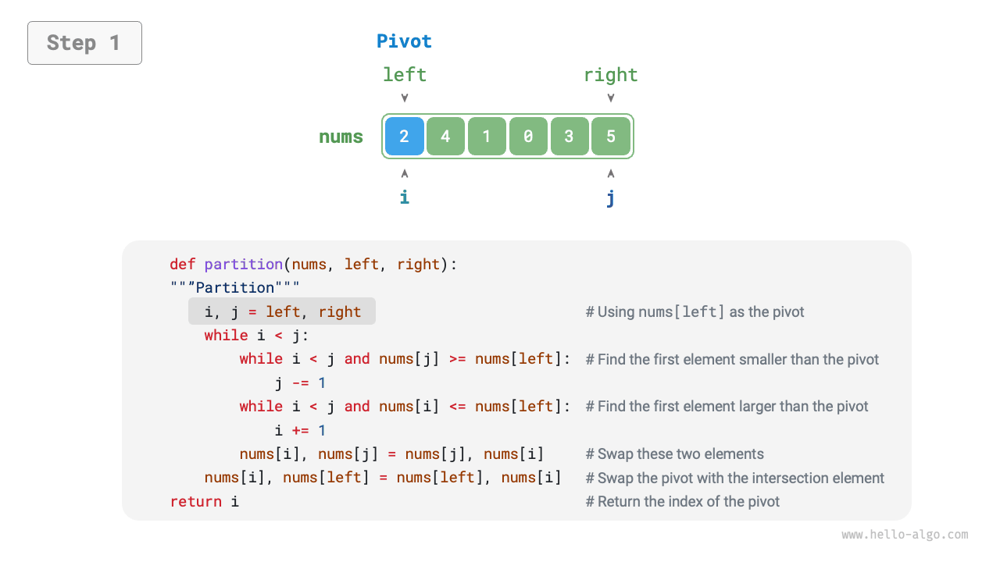

# 11.5 &nbsp; クイックソート

<u>クイックソート</u>は分割統治戦略に基づくソートアルゴリズムで、その効率性と幅広い応用で知られています。

クイックソートのコア操作は「ピボット分割」で、配列から要素を「ピボット」として選択し、ピボットより小さいすべての要素をその左側に移動し、ピボットより大きいすべての要素をその右側に移動することを目的としています。具体的に、ピボット分割のプロセスは下図に示されます。

1. 配列の最も左の要素をピボットとして選択し、2つのポインタ`i`と`j`を初期化して配列の両端をそれぞれ指すようにします。
2. 各ラウンドで`i`（`j`）を使用してピボットより大きい（小さい）最初の要素を探索し、次にこれら2つの要素を交換するループを設定します。
3. `i`と`j`が出会うまでステップ`2.`を繰り返し、最後にピボットを2つのサブ配列の境界に交換します。

=== "<1>"
    { class="animation-figure" }

=== "<2>"
    { class="animation-figure" }

=== "<3>"
    { class="animation-figure" }

=== "<4>"
    { class="animation-figure" }

=== "<5>"
    { class="animation-figure" }

=== "<6>"
    { class="animation-figure" }

=== "<7>"
    { class="animation-figure" }

=== "<8>"
    { class="animation-figure" }

=== "<9>"
    { class="animation-figure" }

<p align="center"> 図 11-8 &nbsp; Pivot division process </p>

ピボット分割後、元の配列は3つの部分に分割されます：左サブ配列、ピボット、右サブ配列で、「左サブ配列の任意の要素 $\leq$ ピボット $\leq$ 右サブ配列の任意の要素」を満たします。したがって、これら2つのサブ配列のみをソートすればよいのです。

!!! note "クイックソートの分割統治戦略"

    ピボット分割の本質は、より長い配列のソート問題をより短い2つの配列に簡素化することです。

=== "Python"

    ```python title="quick_sort.py"
    def partition(self, nums: list[int], left: int, right: int) -> int:
        """分割"""
        # nums[left] をピボットとして使用
        i, j = left, right
        while i < j:
            while i < j and nums[j] >= nums[left]:
                j -= 1  # 右から左へピボットより小さい最初の要素を探す
            while i < j and nums[i] <= nums[left]:
                i += 1  # 左から右へピボットより大きい最初の要素を探す
            # 要素を交換
            nums[i], nums[j] = nums[j], nums[i]
        # ピボットを2つのサブ配列の境界に交換
        nums[i], nums[left] = nums[left], nums[i]
        return i  # ピボットのインデックスを返す
    ```

=== "C++"

    ```cpp title="quick_sort.cpp"
    /* 分割 */
    int partition(vector<int> &nums, int left, int right) {
        // nums[left]をピボットとして使用
        int i = left, j = right;
        while (i < j) {
            while (i < j && nums[j] >= nums[left])
                j--; // 右から左へピボットより小さい最初の要素を検索
            while (i < j && nums[i] <= nums[left])
                i++;          // 左から右へピボットより大きい最初の要素を検索
            swap(nums, i, j); // これら二つの要素を交換
        }
        swap(nums, i, left); // ピボットを二つのサブ配列の境界に交換
        return i;            // ピボットのインデックスを返す
    }
    ```

=== "Java"

    ```java title="quick_sort.java"
    /* 要素を交換 */
    void swap(int[] nums, int i, int j) {
        int tmp = nums[i];
        nums[i] = nums[j];
        nums[j] = tmp;
    }

    /* 分割 */
    int partition(int[] nums, int left, int right) {
        // nums[left] を基準値として使用
        int i = left, j = right;
        while (i < j) {
            while (i < j && nums[j] >= nums[left])
                j--;          // 右から左へ、基準値より小さい最初の要素を検索
            while (i < j && nums[i] <= nums[left])
                i++;          // 左から右へ、基準値より大きい最初の要素を検索
            swap(nums, i, j); // これら2つの要素を交換
        }
        swap(nums, i, left);  // 基準値を2つの部分配列の境界に交換
        return i;             // 基準値のインデックスを返す
    }
    ```

=== "C#"

    ```csharp title="quick_sort.cs"
    [class]{quickSort}-[func]{Swap}

    [class]{quickSort}-[func]{Partition}
    ```

=== "Go"

    ```go title="quick_sort.go"
    [class]{quickSort}-[func]{partition}
    ```

=== "Swift"

    ```swift title="quick_sort.swift"
    [class]{}-[func]{partition}
    ```

=== "JS"

    ```javascript title="quick_sort.js"
    [class]{QuickSort}-[func]{swap}

    [class]{QuickSort}-[func]{partition}
    ```

=== "TS"

    ```typescript title="quick_sort.ts"
    [class]{QuickSort}-[func]{swap}

    [class]{QuickSort}-[func]{partition}
    ```

=== "Dart"

    ```dart title="quick_sort.dart"
    [class]{QuickSort}-[func]{_swap}

    [class]{QuickSort}-[func]{_partition}
    ```

=== "Rust"

    ```rust title="quick_sort.rs"
    [class]{QuickSort}-[func]{partition}
    ```

=== "C"

    ```c title="quick_sort.c"
    [class]{}-[func]{swap}

    [class]{}-[func]{partition}
    ```

=== "Kotlin"

    ```kotlin title="quick_sort.kt"
    [class]{}-[func]{swap}

    [class]{}-[func]{partition}
    ```

=== "Ruby"

    ```ruby title="quick_sort.rb"
    [class]{QuickSort}-[func]{partition}
    ```

=== "Zig"

    ```zig title="quick_sort.zig"
    [class]{QuickSort}-[func]{swap}

    [class]{QuickSort}-[func]{partition}
    ```

## 11.5.1 &nbsp; アルゴリズムプロセス

クイックソートの全体的なプロセスは下図に示されます。

1. まず、元の配列に対して「ピボット分割」を実行し、未ソートの左と右のサブ配列を取得します。
2. 次に、左と右のサブ配列に対してそれぞれ再帰的に「ピボット分割」を実行します。
3. サブ配列の長さが1になるまで再帰を続け、配列全体のソートを完了します。

{ class="animation-figure" }

<p align="center"> 図 11-9 &nbsp; Quick sort process </p>

=== "Python"

    ```python title="quick_sort.py"
    def quick_sort(self, nums: list[int], left: int, right: int):
        """クイックソート"""
        # サブ配列の長さが1のときに再帰を終了
        if left >= right:
            return
        # 分割
        pivot = self.partition(nums, left, right)
        # 左サブ配列と右サブ配列を再帰的に処理
        self.quick_sort(nums, left, pivot - 1)
        self.quick_sort(nums, pivot + 1, right)
    ```

=== "C++"

    ```cpp title="quick_sort.cpp"
    /* クイックソート */
    void quickSort(vector<int> &nums, int left, int right) {
        // サブ配列の長さが1の時、再帰を終了
        if (left >= right)
            return;
        // 分割
        int pivot = partition(nums, left, right);
        // 左サブ配列と右サブ配列を再帰的に処理
        quickSort(nums, left, pivot - 1);
        quickSort(nums, pivot + 1, right);
    }
    ```

=== "Java"

    ```java title="quick_sort.java"
    /* クイックソート */
    void quickSort(int[] nums, int left, int right) {
        // 部分配列の長さが 1 のとき再帰を終了
        if (left >= right)
            return;
        // 分割
        int pivot = partition(nums, left, right);
        // 左部分配列と右部分配列を再帰的に処理
        quickSort(nums, left, pivot - 1);
        quickSort(nums, pivot + 1, right);
    }
    ```

=== "C#"

    ```csharp title="quick_sort.cs"
    [class]{quickSort}-[func]{QuickSort}
    ```

=== "Go"

    ```go title="quick_sort.go"
    [class]{quickSort}-[func]{quickSort}
    ```

=== "Swift"

    ```swift title="quick_sort.swift"
    [class]{}-[func]{quickSort}
    ```

=== "JS"

    ```javascript title="quick_sort.js"
    [class]{QuickSort}-[func]{quickSort}
    ```

=== "TS"

    ```typescript title="quick_sort.ts"
    [class]{QuickSort}-[func]{quickSort}
    ```

=== "Dart"

    ```dart title="quick_sort.dart"
    [class]{QuickSort}-[func]{quickSort}
    ```

=== "Rust"

    ```rust title="quick_sort.rs"
    [class]{QuickSort}-[func]{quick_sort}
    ```

=== "C"

    ```c title="quick_sort.c"
    [class]{}-[func]{quickSort}
    ```

=== "Kotlin"

    ```kotlin title="quick_sort.kt"
    [class]{}-[func]{quickSort}
    ```

=== "Ruby"

    ```ruby title="quick_sort.rb"
    [class]{QuickSort}-[func]{quick_sort}
    ```

=== "Zig"

    ```zig title="quick_sort.zig"
    [class]{QuickSort}-[func]{quickSort}
    ```

## 11.5.2 &nbsp; アルゴリズムの特徴

- **$O(n \log n)$の時間計算量、非適応ソート**：平均的なケースでは、ピボット分割の再帰レベルは$\log n$で、レベルあたりのループの総数は$n$であり、全体で$O(n \log n)$の時間を使用します。最悪の場合、各ラウンドのピボット分割は長さ$n$の配列を長さ$0$と$n - 1$の2つのサブ配列に分割し、再帰レベル数が$n$に達すると、各レベルのループ数は$n$で、使用される総時間は$O(n^2)$です。
- **$O(n)$の空間計算量、インプレースソート**：入力配列が完全に逆順の場合、最悪の再帰深度は$n$に達し、$O(n)$のスタックフレーム空間を使用します。ソート操作は追加の配列の助けなしに元の配列で実行されます。
- **非安定ソート**：ピボット分割の最終ステップで、ピボットは等しい要素の右側に交換される可能性があります。

## 11.5.3 &nbsp; なぜクイックソートは高速なのか

名前が示すように、クイックソートは効率性の面で一定の利点を持つべきです。クイックソートの平均時間計算量は「マージソート」や「ヒープソート」と同じですが、以下の理由で一般的により効率的です。

- **最悪ケースシナリオの低い確率**：クイックソートの最悪時間計算量は$O(n^2)$で、マージソートほど安定していませんが、ほとんどの場合、クイックソートは$O(n \log n)$の時間計算量で動作できます。
- **高いキャッシュ利用率**：ピボット分割操作中、システムはサブ配列全体をキャッシュにロードできるため、要素により効率的にアクセスできます。対照的に、「ヒープソート」などのアルゴリズムは要素にジャンプ方式でアクセスする必要があり、この特徴を欠いています。
- **計算量の小さな定数係数**：上記3つのアルゴリズムの中で、クイックソートは比較、代入、交換などの操作の総数が最も少ないです。これは「挿入ソート」が「バブルソート」よりも高速な理由と似ています。

## 11.5.4 &nbsp; ピボット最適化

**クイックソートの時間効率は特定の入力で劣化する可能性があります**。例えば、入力配列が完全に逆順の場合、最も左の要素をピボットとして選択するため、ピボット分割後、ピボットは配列の右端に交換され、左サブ配列の長さが$n - 1$、右サブ配列の長さが$0$になります。この方法を続けると、各ラウンドのピボット分割でサブ配列の長さが$0$になり、分割統治戦略が失敗し、クイックソートは「バブルソート」に似た形に劣化します。

この状況を避けるため、**ピボット分割でピボット選択戦略を最適化できます**。例えば、要素をランダムに選択してピボットとすることができます。ただし、運が悪く、一貫して最適でないピボットを選択した場合、効率はまだ満足できません。

プログラミング言語は通常「疑似乱数」を生成することに注意することが重要です。疑似乱数シーケンスに対して特定のテストケースを構築すると、クイックソートの効率はまだ劣化する可能性があります。

さらなる改善のため、3つの候補要素（通常は配列の最初、最後、中点の要素）を選択し、**これら3つの候補要素の中央値をピボットとして使用**できます。この方法で、ピボットが「小さすぎず大きすぎない」確率が大幅に増加します。もちろん、さらに多くの候補要素を選択してアルゴリズムの堅牢性をさらに向上させることもできます。この方法により、時間計算量が$O(n^2)$に劣化する確率が大幅に削減されます。

サンプルコードは以下の通りです：

=== "Python"

    ```python title="quick_sort.py"
    def median_three(self, nums: list[int], left: int, mid: int, right: int) -> int:
        """3つの候補要素の中央値を選択"""
        l, m, r = nums[left], nums[mid], nums[right]
        if (l <= m <= r) or (r <= m <= l):
            return mid  # m は l と r の間
        if (m <= l <= r) or (r <= l <= m):
            return left  # l は m と r の間
        return right

    def partition(self, nums: list[int], left: int, right: int) -> int:
        """分割（三点中央値）"""
        # nums[left] をピボットとして使用
        med = self.median_three(nums, left, (left + right) // 2, right)
        # 中央値を配列の最左端に交換
        nums[left], nums[med] = nums[med], nums[left]
        # nums[left] をピボットとして使用
        i, j = left, right
        while i < j:
            while i < j and nums[j] >= nums[left]:
                j -= 1  # 右から左へピボットより小さい最初の要素を探す
            while i < j and nums[i] <= nums[left]:
                i += 1  # 左から右へピボットより大きい最初の要素を探す
            # 要素を交換
            nums[i], nums[j] = nums[j], nums[i]
        # ピボットを2つのサブ配列の境界に交換
        nums[i], nums[left] = nums[left], nums[i]
        return i  # ピボットのインデックスを返す
    ```

=== "C++"

    ```cpp title="quick_sort.cpp"
    /* 三つの候補要素の中央値を選択 */
    int medianThree(vector<int> &nums, int left, int mid, int right) {
        int l = nums[left], m = nums[mid], r = nums[right];
        if ((l <= m && m <= r) || (r <= m && m <= l))
            return mid; // mはlとrの間
        if ((m <= l && l <= r) || (r <= l && l <= m))
            return left; // lはmとrの間
        return right;
    }

    /* 分割（三つの中央値） */
    int partition(vector<int> &nums, int left, int right) {
        // 三つの候補要素の中央値を選択
        int med = medianThree(nums, left, (left + right) / 2, right);
        // 中央値を配列の最左位置に交換
        swap(nums, left, med);
        // nums[left]をピボットとして使用
        int i = left, j = right;
        while (i < j) {
            while (i < j && nums[j] >= nums[left])
                j--; // 右から左へピボットより小さい最初の要素を検索
            while (i < j && nums[i] <= nums[left])
                i++;          // 左から右へピボットより大きい最初の要素を検索
            swap(nums, i, j); // これら二つの要素を交換
        }
        swap(nums, i, left); // ピボットを二つのサブ配列の境界に交換
        return i;            // ピボットのインデックスを返す
    }
    ```

=== "Java"

    ```java title="quick_sort.java"
    /* 3つの候補要素の中央値を選択 */
    int medianThree(int[] nums, int left, int mid, int right) {
        int l = nums[left], m = nums[mid], r = nums[right];
        if ((l <= m && m <= r) || (r <= m && m <= l))
            return mid; // m は l と r の間
        if ((m <= l && l <= r) || (r <= l && l <= m))
            return left; // l は m と r の間
        return right;
    }

    /* 分割（3つの中央値） */
    int partition(int[] nums, int left, int right) {
        // 3つの候補要素の中央値を選択
        int med = medianThree(nums, left, (left + right) / 2, right);
        // 中央値を配列の最左端の位置に交換
        swap(nums, left, med);
        // nums[left] を基準値として使用
        int i = left, j = right;
        while (i < j) {
            while (i < j && nums[j] >= nums[left])
                j--;          // 右から左へ、基準値より小さい最初の要素を検索
            while (i < j && nums[i] <= nums[left])
                i++;          // 左から右へ、基準値より大きい最初の要素を検索
            swap(nums, i, j); // これら2つの要素を交換
        }
        swap(nums, i, left);  // 基準値を2つの部分配列の境界に交換
        return i;             // 基準値のインデックスを返す
    }
    ```

=== "C#"

    ```csharp title="quick_sort.cs"
    [class]{QuickSortMedian}-[func]{MedianThree}

    [class]{QuickSortMedian}-[func]{Partition}
    ```

=== "Go"

    ```go title="quick_sort.go"
    [class]{quickSortMedian}-[func]{medianThree}

    [class]{quickSortMedian}-[func]{partition}
    ```

=== "Swift"

    ```swift title="quick_sort.swift"
    [class]{}-[func]{medianThree}

    [class]{}-[func]{partitionMedian}
    ```

=== "JS"

    ```javascript title="quick_sort.js"
    [class]{QuickSortMedian}-[func]{medianThree}

    [class]{QuickSortMedian}-[func]{partition}
    ```

=== "TS"

    ```typescript title="quick_sort.ts"
    [class]{QuickSortMedian}-[func]{medianThree}

    [class]{QuickSortMedian}-[func]{partition}
    ```

=== "Dart"

    ```dart title="quick_sort.dart"
    [class]{QuickSortMedian}-[func]{_medianThree}

    [class]{QuickSortMedian}-[func]{_partition}
    ```

=== "Rust"

    ```rust title="quick_sort.rs"
    [class]{QuickSortMedian}-[func]{median_three}

    [class]{QuickSortMedian}-[func]{partition}
    ```

=== "C"

    ```c title="quick_sort.c"
    [class]{}-[func]{medianThree}

    [class]{}-[func]{partitionMedian}
    ```

=== "Kotlin"

    ```kotlin title="quick_sort.kt"
    [class]{}-[func]{medianThree}

    [class]{}-[func]{partitionMedian}
    ```

=== "Ruby"

    ```ruby title="quick_sort.rb"
    [class]{QuickSortMedian}-[func]{median_three}

    [class]{QuickSortMedian}-[func]{partition}
    ```

=== "Zig"

    ```zig title="quick_sort.zig"
    [class]{QuickSortMedian}-[func]{medianThree}

    [class]{QuickSortMedian}-[func]{partition}
    ```

## 11.5.5 &nbsp; 末尾再帰最適化

**特定の入力では、クイックソートはより多くの空間を占有する可能性があります**。例えば、完全に順序付けられた入力配列を考えてみましょう。再帰でのサブ配列の長さを$m$とします。各ラウンドのピボット分割で、長さ$0$の左サブ配列と長さ$m - 1$の右サブ配列が生成されます。これは、再帰呼び出しごとに問題サイズが1つの要素のみ減少することを意味し、各レベルの再帰での削減が非常に小さくなります。
結果として、再帰ツリーの高さは$n − 1$に達する可能性があり、これには$O(n)$のスタックフレーム空間が必要です。

スタックフレーム空間の蓄積を防ぐため、各ラウンドのピボットソート後に2つのサブ配列の長さを比較し、**より短いサブ配列のみを再帰的にソート**できます。より短いサブ配列の長さは$n / 2$を超えないため、この方法は再帰深度が$\log n$を超えないことを保証し、最悪空間計算量を$O(\log n)$に最適化します。コードは以下の通りです：

=== "Python"

    ```python title="quick_sort.py"
    def quick_sort(self, nums: list[int], left: int, right: int):
        """クイックソート（末尾再帰最適化）"""
        # サブ配列の長さが1のときに終了
        while left < right:
            # 分割操作
            pivot = self.partition(nums, left, right)
            # 2つのサブ配列のうち短い方に対してクイックソートを実行
            if pivot - left < right - pivot:
                self.quick_sort(nums, left, pivot - 1)  # 左サブ配列を再帰的にソート
                left = pivot + 1  # 残りの未ソート区間は [pivot + 1, right]
            else:
                self.quick_sort(nums, pivot + 1, right)  # 右サブ配列を再帰的にソート
                right = pivot - 1  # 残りの未ソート区間は [left, pivot - 1]
    ```

=== "C++"

    ```cpp title="quick_sort.cpp"
    /* クイックソート（末尾再帰最適化） */
    void quickSort(vector<int> &nums, int left, int right) {
        // サブ配列の長さが1の時終了
        while (left < right) {
            // 分割操作
            int pivot = partition(nums, left, right);
            // 二つのサブ配列のうち短い方でクイックソートを実行
            if (pivot - left < right - pivot) {
                quickSort(nums, left, pivot - 1); // 左サブ配列を再帰的にソート
                left = pivot + 1;                 // 残りの未ソート区間は[pivot + 1, right]
            } else {
                quickSort(nums, pivot + 1, right); // 右サブ配列を再帰的にソート
                right = pivot - 1;                 // 残りの未ソート区間は[left, pivot - 1]
            }
        }
    }
    ```

=== "Java"

    ```java title="quick_sort.java"
    /* クイックソート（末尾再帰最適化） */
    void quickSort(int[] nums, int left, int right) {
        // 部分配列の長さが 1 のとき終了
        while (left < right) {
            // 分割操作
            int pivot = partition(nums, left, right);
            // 2つの部分配列のうち短い方にクイックソートを実行
            if (pivot - left < right - pivot) {
                quickSort(nums, left, pivot - 1); // 左部分配列を再帰的にソート
                left = pivot + 1; // 残りの未ソート区間は [pivot + 1, right]
            } else {
                quickSort(nums, pivot + 1, right); // 右部分配列を再帰的にソート
                right = pivot - 1; // 残りの未ソート区間は [left, pivot - 1]
            }
        }
    }
    ```

=== "C#"

    ```csharp title="quick_sort.cs"
    [class]{QuickSortTailCall}-[func]{QuickSort}
    ```

=== "Go"

    ```go title="quick_sort.go"
    [class]{quickSortTailCall}-[func]{quickSort}
    ```

=== "Swift"

    ```swift title="quick_sort.swift"
    [class]{}-[func]{quickSortTailCall}
    ```

=== "JS"

    ```javascript title="quick_sort.js"
    [class]{QuickSortTailCall}-[func]{quickSort}
    ```

=== "TS"

    ```typescript title="quick_sort.ts"
    [class]{QuickSortTailCall}-[func]{quickSort}
    ```

=== "Dart"

    ```dart title="quick_sort.dart"
    [class]{QuickSortTailCall}-[func]{quickSort}
    ```

=== "Rust"

    ```rust title="quick_sort.rs"
    [class]{QuickSortTailCall}-[func]{quick_sort}
    ```

=== "C"

    ```c title="quick_sort.c"
    [class]{}-[func]{quickSortTailCall}
    ```

=== "Kotlin"

    ```kotlin title="quick_sort.kt"
    [class]{}-[func]{quickSortTailCall}
    ```

=== "Ruby"

    ```ruby title="quick_sort.rb"
    [class]{QuickSortTailCall}-[func]{quick_sort}
    ```

=== "Zig"

    ```zig title="quick_sort.zig"
    [class]{QuickSortTailCall}-[func]{quickSort}
    ```
