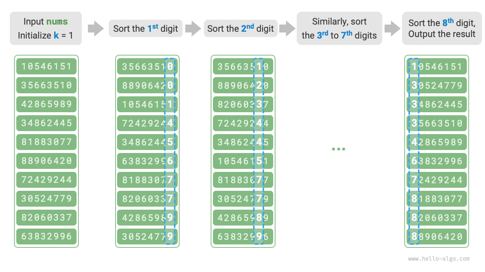

# 基数ソート

前の節では計数ソートを紹介しました。これは、データサイズ $n$ が大きいがデータ範囲 $m$ が小さいシナリオに適しています。$n = 10^6$ の学生IDをソートする必要があり、各IDが $8$ 桁の数字であるとします。これは、データ範囲 $m = 10^8$ が非常に大きいことを意味します。この場合、計数ソートを使用すると、大量のメモリスペースが必要になります。基数ソートはこの状況を回避できます。

<u>基数ソート</u>は計数ソートと同じ核心概念を共有し、要素の頻度をカウントすることでソートします。同時に、基数ソートは数字の桁間の漸進的関係を利用してこれを基盤としています。桁を一度に一つずつ処理してソートし、最終的なソート順序を達成します。

## アルゴリズムの過程

学生IDデータを例として、最下位桁を $1$ 番目、最上位桁を $8$ 番目とすると、基数ソートの過程は以下の図に示されています。

1. 桁 $k = 1$ を初期化します。
2. 学生IDの $k$ 番目の桁に対して「計数ソート」を実行します。完了後、データは $k$ 番目の桁に基づいて最小から最大までソートされます。
3. $k$ を $1$ 増やし、手順 `2.` に戻って反復を続け、すべての桁がソートされるまで続けます。この時点で過程が終了します。



以下、コード実装を詳しく見てみます。基数 $d$ での数 $x$ に対して、その $k$ 番目の桁 $x_k$ を取得するには、以下の計算式を使用できます：

$$
x_k = \lfloor\frac{x}{d^{k-1}}\rfloor \bmod d
$$

ここで $\lfloor a \rfloor$ は浮動小数点数 $a$ の切り捨てを表し、$\bmod \: d$ は $d$ による剰余を表します。学生IDデータの場合、$d = 10$ で $k \in [1, 8]$ です。

さらに、$k$ 番目の桁に基づいてソートできるように、計数ソートのコードを少し修正する必要があります：

```src
[file]{radix_sort}-[class]{}-[func]{radix_sort}
```

!!! question "なぜ最下位桁から開始するのか？"

    連続するソートラウンドでは、後のラウンドの結果が前のラウンドの結果を上書きします。例えば、最初のラウンドの結果が $a < b$ で、2番目のラウンドが $a > b$ の場合、2番目のラウンドの結果が最初のラウンドの結果を置き換えます。上位桁は下位桁より優先されるため、上位桁の前に下位桁をソートすることが理にかなっています。

## アルゴリズムの特徴

計数ソートと比較して、基数ソートはより大きな数値範囲に適していますが、**データが固定桁数で表現でき、桁数があまり大きくないことを前提としています**。例えば、浮動小数点数は桁数 $k$ が大きい可能性があり、時間計算量 $O(nk) \gg O(n^2)$ につながる可能性があるため、基数ソートには適していません。

- **時間計算量は $O(nk)$、非適応ソート**：データサイズを $n$、データが基数 $d$、最大桁数を $k$ とすると、単一桁のソートには $O(n + d)$ 時間がかかり、すべての $k$ 桁のソートには $O((n + d)k)$ 時間がかかります。一般的に、$d$ と $k$ はどちらも比較的小さく、時間計算量は $O(n)$ に近づきます。
- **空間計算量は $O(n + d)$、非インプレースソート**：計数ソートと同様に、基数ソートは長さ $n$ と $d$ の配列 `res` と `counter` にそれぞれ依存します。
- **安定ソート**：計数ソートが安定な場合、基数ソートも安定です。計数ソートが不安定な場合、基数ソートは正しいソート順序を保証できません。
